 离俗览第七

# 离俗

**【题解】**

《离俗览》八篇，主要论述君主役使人民的方法。概括起来，就是“太上以义，其次以赏罚”（《用民》）。论述时，各篇侧重有所不同。

本篇旨在宣扬以理义为本、超世离俗的高节厉行。文章列举了石户之农等六人的事例加以论证。文章赞扬了石户之农等人非难舜、汤，超世离俗的思想，同时又对舜、汤即帝位“以爱利为本，以万民为义”的作法表示了肯定。这里表现出的矛盾显然是由于作者兼收道家、儒家的思想造成的。

一曰：

世之所不足者，理义也；所有馀者，妄苟也(1)。民之情，贵所不足，贱所有馀。故布衣、人臣之行，洁白清廉中绳(2)，愈穷愈荣，虽死，天下愈高之，所不足也。然而以理义斫削(3)，神农、黄帝犹有可非，微独舜、汤(4)。飞兔、要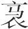(5)，古之骏马也，材犹有短。故以绳墨取木，则宫室不成矣(6)。

**【注释】**

(1)妄苟：妄作苟为，指违背理义的行为。

(2)中绳：指符合原则法度。

(3)斫（zhuó）削：砍削。这里是衡量的意思。

(4)微独：非但，不只是。

(5)飞兔：骏马名。要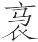（niǎo）：也作“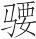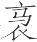”、“腰”，骏马名。

(6)“故以”二句：以上两句意思是，如果用墨绳严格量取木材，那么木材就难以符合要求，因此房屋就不能建成了。

**【译文】**

第一：

社会上不足的东西，是理义；有馀的东西，是胡作非为。人之常情是，以不足的东西为贵，以有馀的东西为贱。所以平民、臣子的品行，应该纯洁清廉，合乎法度，越穷困越感到荣耀，即使死了，天下的人也越发尊崇他们，这是因为社会上这种品行不足啊。然而如果按照理义的标准来衡量，连神农、黄帝都还有可以非难的地方，不仅仅是舜、汤而已。飞兔、要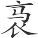，是古代的骏马，它们的力气尚且有所不足。所以如果用墨绳严格地量取木材，那么房屋就不能建成。

舜让其友石户之农(1)，石户之农曰：“棬棬乎后之为人也(2)！葆力之士也(3)。”以舜之德为未至也，于是乎夫负妻戴，携子以入于海，去之终身不反。舜又让其友北人无择(4)，北人无择曰：“异哉后之为人也！居于甽亩之中，而游入于尧之门。不若是而已(5)，又欲以其辱行漫我(6)，我羞之。”而自投于苍领之渊(7)。

汤将伐桀，因卞随而谋(8)，卞随辞曰：“非吾事也。”汤曰：“孰可？”卞随曰：“吾不知也。”汤又因务光而谋(9)，务光曰：“非吾事也。”汤曰：“孰可？”务光曰：“吾不知也。”汤曰：“伊尹何如？”务光曰：“强力忍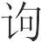(10)，吾不知其他也。”汤遂与伊尹谋夏伐桀，克之。以让卞随，卞随辞曰：“后之伐桀也，谋乎我，必以我为贼也；胜桀而让我，必以我为贪也。吾生乎乱世，而无道之人再来我(11)，吾不忍数闻也。”乃自投于颍水而死。汤又让于务光曰：“智者谋之，武者遂之(12)，仁者居之，古之道也。吾子胡不位之(13)？请相吾子(14)。”务光辞曰：“废上(15)，非义也；杀民，非仁也；人犯其难，我享其利，非廉也。吾闻之，非其义，不受其利；无道之世，不践其土。况于尊我乎？吾不忍久见也。”乃负石而沉于募水(16)。

故如石户之农、北人无择、卞随、务光者，其视天下，若六合之外(17)，人之所不能察。其视贵富也，苟可得已，则必不之赖(18)。高节厉行(19)，独乐其意，而物莫之害。不漫于利，不牵于势，而羞居浊世。惟此四士者之节。

若夫舜、汤，则苞裹覆容(20)，缘不得已而动，因时而为，以爱利为本，以万民为义。譬之若钓者，鱼有小大，饵有宜适，羽有动静(21)。

**【注释】**

(1)石户之农：在石户种田的农夫。石户，地名。

(2)棬（quān）棬：用力的样子。后：君。这里指舜。

(3)葆力：勤劳任力。

(4)北人无择：姓北人，名无择。

(5)若是：如此。已：止。

(6)漫：玷污。

(7)苍领：他书或作“清泠”，古代传说中的大泽名，《山海经》谓在江南。

(8)卞随：传说中夏时的高士。

(9)务光：传说中夏时的高士。

(10)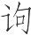：同“诟”，耻辱。

(11)无道之人：指汤而言。卞随认为汤作为一个诸侯不应伐天子（桀），所以称他为“无道之人”。再：二，两次。

(12)遂：成。

(13)位之：指居天子之位。位，用如动词，居……位。

(14)相：辅佐。吾子：对对方的尊称。

(15)上：天子。这里指桀。

(16)募水：水名。

(17)六合：指天、地、四方。

(18)赖：利，用如意动。

(19)厉行：使自己的品行受到磨砺，即品行坚贞的意思。厉，磨砺，这里用如使动。

(20)苞裹覆容：包装容纳的意思。苞，通“包”。按：“苞”和“裹”是同义词，“覆”和“容”是同义词。

(21)羽：钓鱼用的浮漂。

**【译文】**

舜把帝位让给自己的朋友石户之农，石户之农说：“君王您的为人真是不知疲倦啊！不过只是个勤劳任力的人。”认为舜的品德尚未完备，于是丈夫肩背着东西，妻子头顶着东西，领着孩子去海上隐居，离开了舜，终身不再回来。舜又把帝位让给自己的朋友北人无择，北人无择说：“君王您的为人真是与众不同啊！本来居住在乡野之中，却到尧那里继承了帝位。不仅仅是这样就罢了，又想用自己耻辱的行为玷污我，我对此感到羞耻。”因而自己跳到苍领的深渊中。

汤将要讨伐桀，去找卞随谋划，卞随谢绝说：“这不是我的事情。”汤说：“谁可以谋划？”卞随说：“我不知道。”汤又去找务光谋划，务光说：“这不是我的事情。”汤说：“谁可以谋划？”务光说：“我不知道。”汤说：“伊尹怎么样？”务光说：“他能奋力做事，忍受耻辱，我不知道他别的情况了。”汤于是就跟伊尹谋划讨伐夏桀，战胜了夏桀。汤把王位让给卞随，卞随谢绝说：“君王您讨伐桀的时候，要跟我谋划，一定是认为我残忍；战胜桀后要把王位让给我，一定是认为我贪婪。我生在乱世，而无道之人两次来污辱我，我不忍心屡次听这样的话。”于是就自己跳入颍水而死。汤又把王位让给务光，说：“聪明的人谋划它，勇武的人实现它，仁德的人享有它，这是自古以来的原则。您何不居王位呢？让我来辅佐您。”务光谢绝说：“废弃君王桀，这是不义的行为；作战杀死人民，这是不仁的行为；别人冒战争的危险，我享受战争的利益，这是不廉洁的行为。我听说过这样的话，不符合义，就不接受利益；不符合道义的社会，就不踏上它的土地。更何况使我处于尊位呢？我不忍心长久地看到这种情况。”于是就背负石头沉没在募水之中。

所以像石户之农、北人无择、卞随、务光这样的人，他们看待天下，就如同天外之物一样，这是一般人所不能理解的。他们看待富贵，即使可以得到，也一定不把它当作有利的事。他们节操高尚，品行坚贞，独自为坚持自己的理想而感到快乐，因而外物没有什么可以危害他们。他们不为利益玷污，不受权势牵制，以居于污浊的社会为耻。只有这四位贤士具有这样的节操。

至于舜、汤，则无所不包，无所不容，因为迫不得已而采取行动，顺应时势而有所作为，把爱和利作为根本，把为万民谋利作为义的准则。这就如同钓鱼的人一样，鱼有小有大，钓饵与之相应，浮飘有动有静，都要相机而行。

齐、晋相与战，平阿之馀子亡戟得矛(1)，却而去，不自快，谓路之人曰：“亡戟得矛，可以归乎？”路之人曰：“戟亦兵也，矛亦兵也，亡兵得兵，何为不可以归？”去行，心犹不自快，遇高唐之孤叔无孙(2)，当其马前曰：“今者战，亡戟得矛，可以归乎？”叔无孙曰：“矛非戟也，戟非矛也，亡戟得矛，岂亢责也哉(3)？”平阿之余子曰：“嘻！”还反战，趋尚及之，遂战而死。叔无孙曰：“吾闻之，君子济人于患(4)，必离其难(5)。”疾驱而从之，亦死而不反。令此将众，亦必不北矣；令此处人主之旁，亦必死义矣。今死矣而无大功，其任小故也。任小者，不知大也。今焉知天下之无平阿馀子与叔无孙也？故人主之欲得廉士者，不可不务求。

**【注释】**

(1)平阿：齐邑名。馀子：周代兵制规定，每户以一人为正卒，馀者为羡卒，即“馀子”。

(2)高唐：齐邑名，故城在今山东禹城西南。孤：古代官名，本指少师、少傅、少保，这里指守邑大夫。叔无孙：人名，高唐邑守邑大夫。

(3)亢：抵，当。

(4)济人于患：让人蒙难的意思。济，入，使进入，把……引到。

(5)离：通“罹”，遭遇，遭受。

**【译文】**

齐国、晋国相互作战，平阿邑的士卒丢失了戟，得到了矛，后退时，自己很不高兴，对路上的人说：“我丢失了戟，得到了矛，可以回去吗？”路上的人说：“戟也是兵器，矛也是兵器，丢失了兵器又得到了兵器，为什么不可以回去？”士卒又往回走，自己心里还是不高兴，遇到高唐邑的守邑大夫叔无孙，就站在他的马前说：“今天作战时，我丢失了戟，得到了矛，可以回去吗？”叔无孙说：“矛不是戟，戟不是矛，丢失了戟，得到了矛，怎么能交待得了呢？”那个士卒说了声：“嘿！”又返回去作战，跑到战场，还赶上作战，终于战死了。叔无孙说：“我听说过，君子让人遭受祸患，自己一定要跟他共患难。”急速赶马去追他，也死在战场上没有回来。假使让这两个人统率军队，一定不会战败逃跑；假使让他们处于君主身边，一定会为道义而献身。如今他们死了，却没有什么大功劳，这是因为他们职位低的缘故。职位低的人是不考虑大事情的。现在怎么知道天下没有平阿的士卒与叔无孙那样的人呢？所以君主中那些希望得到廉正之士的人，不可不努力寻求这样的人。

齐庄公之时(1)，有士曰宾卑聚(2)。梦有壮子，白缟之冠(3)，丹绩之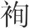(4)，东布之衣(5)，新素履(6)，墨剑室，从而叱之，唾其面。惕然而寤，徒梦也。终夜坐，不自快。明日，召其友而告之曰：“吾少好勇，年六十而无所挫辱。今夜辱，吾将索其形，期得之则可，不得将死之。”每朝与其友俱立乎衢，三日不得，却而自殁(7)。谓此当务则未也，虽然，其心之不辱也，有可以加乎(8)？

**【注释】**

(1)齐庄公：春秋时齐国国君，前553年—前548年在位。

(2)宾卑聚：人名。

(3)缟：未经染色的绢。

(4)丹绩：红丝带。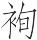（xuàn）：缨，系帽子的带。

(5)东布：“东”当为“柬”之误（依谭戒甫引文廷式说）。柬布，即练帛，白色的熟绢。

(6)素：白色的生绢。

(7)殁：同“歾”，“歾”与“刎”同。

(8)加：超过。

**【译文】**

齐庄公时，有个士人名叫宾卑聚。他梦见有个强壮的男子，戴着白绢做的帽子，系着红麻线做的帽带，穿着熟绢做的衣服，白色的新鞋，佩带着黑鞘宝剑，走上前来叱责他，用唾沫吐他的脸。他吓醒了，原来只是一个梦。坐了整整一夜，心里很不高兴。第二天，召来他的朋友告诉说：“我年轻时就爱好勇力，年纪六十了，没有遭受过挫折侮辱。现在夜里遭到侮辱，我将寻找这个人，如期找到还可以，如果找不到我将为此而死。”每天早晨跟他的朋友一起站在四通八达的街道上，过了三天没有找到，回去以后就自刎而死。要说这是应当尽力去做的却未必，虽说如此，但是他的内心不可受辱，这一点还有能超过的吗？

# 高义

**【题解】**

本篇主旨在于推崇“义”。文章说，不管世俗的看法如何，君子“动必缘义，行必诚义”，即一举一动都必须依照“义”的原则。文章列举孔子、墨子、子囊、石渚的事例，说明君子对待赏罚的态度是：“当功以受赏，当罪以受罚。赏不当，虽与之必辞；罚诚当，虽赦之不外。”这样做，符合“义”的原则。

二曰：

君子之自行也，动必缘义，行必诚义，俗虽谓之穷，通也。行不诚义，动不缘义，俗虽谓之通，穷也。然则君子之穷通，有异乎俗者也。故当功以受赏，当罪以受罚。赏不当，虽与之必辞；罚诚当(1)，虽赦之不外(2)。度之于国(3)，必利长久。长久之于主，必宜内反于心不惭然后动。

**【注释】**

(1)诚：如果。

(2)不外：不敢推却，指不敢不受惩罚。外，摒弃，推却掉。

(3)度（duó）：衡量。

**【译文】**

第二：

君子自身的所作所为，举动必须遵循义的原则，行为必须忠于义的原则，世俗虽然认为行不通，但君子认为行得通。行为不忠于义的原则，举动不遵循义的原则，世俗虽然认为行得通，但君子认为行不通。这样看来，君子的所谓行不通或行得通，就跟世俗不同了。所以有功就接受相应的奖赏，有罪就接受相应的惩罚。如果不该受赏，那么即使赏给自己，也一定谢绝；如果应该受罚，那么即使赦免自己，也不躲避惩罚。用这种原则考虑国家大事，一定会对国家有长远的利益。要对君主有长远的利益，君子一定要内心反省不感到惭愧然后才行动。

孔子见齐景公(1)，景公致廪丘以为养(2)。孔子辞不受，入谓弟子曰(3)：“吾闻君子当功以受禄。今说景公(4)，景公未之行而赐之廪丘，其不知丘亦甚矣！”令弟子趣驾(5)，辞而行。孔子，布衣也，官在鲁司寇，万乘难与比行(6)，三王之佐不显焉(7)，取舍不苟也夫！

**【注释】**

(1)齐景公：春秋时齐国君主，前547年—前490年在位。

(2)廪丘：齐邑名，在今山东郓城西北。以为养：指把它（廪丘）作为食邑。

(3)入：当为“出”字之误（依松皋圆说）。

(4)说（shuì）：游说，劝说别人使之听从自己的主张。景公：“景”是谥号，此处不该如此称呼，当是追书之辞。

(5)趣（cù）：赶快。

(6)比：并。

(7)不显焉：不比他显赫。

**【译文】**

孔子谒见齐景公，景公送给他廪丘作为食邑。孔子谢绝了，不肯接受，出来以后对学生们说：“我听说君子有功因而接受俸禄，现在我劝说景公听从我的主张，景公还没有实行，却要赏赐给我廪丘，他太不了解我了！”让学生们赶快套好车，告辞以后就走了。孔子这时是平民，他在鲁国只任过司寇之职，然而拥有万辆兵车的大国君主难以跟他相提并论，禹、汤、文武的辅佐之臣不比他显赫，这是因为他取舍都不苟且啊！

子墨子游公上过于越(1)。公上过语墨子之义，越王说之，谓公上过曰：“子之师苟肯至越，请以故吴之地阴江之浦书社三百以封夫子(2)。”公上过往复于子墨子，子墨子曰：“子之观越王也，能听吾言、用吾道乎？”公上过曰：“殆未能也。”墨子曰：“不唯越王不知翟之意，虽子亦不知翟之意。若越王听吾言、用吾道，翟度身而衣，量腹而食，比于宾萌(3)，未敢求仕。越王不听吾言、不用吾道，虽全越以与我，吾无所用之。越王不听吾言、不用吾道，而受其国，是以义翟也(4)。义翟何必越，虽于中国亦可(5)。”凡人不可不熟论。秦之野人(6)，以小利之故，弟兄相狱，亲戚相忍。今可得其国，恐亏其义而辞之，可谓能守行矣。其与秦之野人相去亦远矣。

**【注释】**

(1)游：用如使动，使……游。公上过：墨子的弟子。

(2)阴江：江名。浦：江边。书社：古代二十五家为一社，书写社人姓名于册籍，称“书社”。借指一定数量的土地及附着于土地的人口。

(3)宾萌：客居之民，从外地迁入的人。萌，民。

(4)翟：当是“粜”（繁体作“糶”，与“翟”形近）字之误（依毕沅说）。粜，卖。

(5)中国：指中原各国。

(6)野人：义同“鄙人”。四郊以外地区为“野”或“鄙”，“野人”即指郊野之农。

**【译文】**

墨子让公上过到越国游说。公上过讲述了墨子的主张，越王很喜欢，对公上过说：“您的老师如果肯到越国来，我愿把过去吴国的土地阴江沿岸三百社的地方封给他老先生。”公上过回去禀报给墨子，墨子说：“你看越王能听从我的话、采纳我的主张吗？”公上过说：“恐怕不能。”墨子说：“不仅越王不了解我的心意，就是你也不了解我的心意。假如越王听从我的话、采纳我的主张，我衡量自己的身体穿衣，估量自己的肚子吃饭，我将处于客居之民的地位，不敢要求做官；假如越王不听从我的话、不采纳我的主张，即使把整个越国给我，我也用不着它。越王不听从我的话、不采纳我的主张，我却接受他的国家，这就是拿原则做交易。拿原则做交易，何必到越国去？即使中原之国也是可以的。”大凡对于人不可不仔细考察。秦国的鄙野之人，因为一点小利的缘故，弟兄之间就相互打官司，亲人之间就相互残害。现在墨子可以得到越王的国土，却担心损害了自己的道义，因而谢绝了，这可以说是能保持操行了。秦国的鄙野之人与他相距也太远了。

荆人与吴人将战，荆师寡，吴师众。荆将军子囊曰(1)：“我与吴人战，必败。败王师，辱王名，亏壤土，忠臣不忍为也。”不复于王而遁。至于郊，使人复于王曰：“臣请死。”王曰：“将军之遁也，以其为利也。今诚利，将军何死？子囊曰：“遁者无罪，则后世之为王臣者，将皆依不利之名而效臣遁。若是，则荆国终为天下挠(2)。”遂伏剑而死。王曰：“请成将军之义。”乃为之桐棺三寸(3)，加斧锧其上。人主之患，存而不知所以存，亡而不知所以亡。此存亡之所以数至也。郼、岐之广也(4)，万国之顺也，从此生矣(5)。荆之为四十二世矣(6)，尝有乾谿、白公之乱矣(7)，尝有郑襄、州侯之避矣(8)，而今犹为万乘之大国，其时有臣如子囊与！子囊之节，非独厉一世之人臣也(9)。

**【注释】**

(1)子囊：春秋时楚庄王之子。

(2)挠：挫，挫败。

(3)桐棺三寸：指刑人之棺。棺木只有三寸厚，以此表明是受刑而死。

(4)郼：汤灭桀前的封国。岐：武王灭纣前所居之地。广：扩大。

(5)“万国”二句：这几句大意是说，汤、武王之所以能灭掉桀、纣，统一天下，天下诸侯都归服，正是由于这个原因（指桀、纣不知存亡的道理）。

(6)“荆之”句：“为”下当脱“荆”或“国”字（王念孙、孙锵鸣说）。

(7)乾谿、白公之乱：楚灵王伐楚，驻札在乾谿；公子弃疾为司马，派人去乾谿瓦解灵王的军队，灵王在乾谿自缢而死。“乾谿之乱”即指此而言。白公，指白公胜，楚平王太子建之子，太子建为郑人所杀，白公胜为报父仇，杀死领兵救郑的楚令尹子西、司马子旗，并占据了楚都。“白公之乱”即指此事而言。

(8)郑襄、州侯之避：指郑袖、州侯助楚王行邪僻。襄，当作“褭”（袖）字（依王念孙说）。郑袖，楚怀王幸姬。州侯，楚襄王宠臣。避：通“辟”，邪僻。

(9)厉：磨砺，勉励。

**【译文】**

楚国人与吴国人将要作战，楚国军队人少，吴国军队人多。楚国将军子囊说：“我国与吴国作战，必定失败。让君主的军队失败，让君主的名声受辱，使国家的土地受损失，忠臣不忍心这样做。”没有向楚王禀告就逃回来了。到了郊外，派人向楚王禀告说：“我请求被处死。”楚王说：“将军你逃回来，是认为这样做有利啊。现在确实有利，将军你为什么要死呢？”子囊说：“逃回来的如果不加惩处，那么后世当君主将领的人，都会借口作战不利而效法我逃跑。这样，楚国最终就会被天下的诸侯挫败。”于是就用剑自杀而死。楚王说：“让我成全将军他的道义。”就给他做了三寸厚的桐木棺表示惩处，把斧子砧子等刑具放在棺上表示处以死刑。君主的弊病是，保存住国家却不知道为什么会保存住，丧失掉国家却不知道为什么会丧失掉。这就是保存住国家与丧失掉国家的情况频繁出现的原因。郼、岐的扩大，各国的归顺，就是由此产生的。楚国成为国家已经四十二代了，曾经有过灵王被迫在乾谿自缢而死、白公胜杀死子西、子旗攻陷楚都那样的祸乱，曾经有过郑袖、州侯帮楚王行邪僻的事情，可是如今仍然是个拥有万辆兵车的大国，这大概就是因为它经常有像子囊那样的臣子吧！子囊的气节，不只是磨砺一代的臣子啊！

荆昭王之时(1)，有士焉曰石渚。其为人也，公直无私，王使为政。道有杀人者，石渚追之，则其父也。还车而反(2)，立于廷曰：“杀人者，仆之父也(3)。以父行法，不忍；阿有罪(4)，废国法，不可。失法伏罪，人臣之义也。”于是乎伏斧锧，请死于王。王曰：“追而不及，岂必伏罪哉！子复事矣。”石渚辞曰：“不私其亲，不可谓孝子；事君枉法，不可谓忠臣。君令赦之，上之惠也；不敢废法，臣之行也。”不去斧锧，殁头乎王廷(5)。正法枉必死，父犯法而不忍，王赦之而不肯，石渚之为人臣也，可谓忠且孝矣。

**【注释】**

(1)荆昭王：楚昭王，前515年—前489年在位。

(2)还车：掉转车头。

(3)仆：自称谦词。

(4)阿（ē）：偏袒，庇护。

(5)殁头：刎颈。

**【译文】**

楚昭王时，有个贤士名叫石渚。他为人公正无私，昭王让他治理政事。有个在道上杀人的人，石渚去追赶这个人，原来是他父亲。他掉转车子返回来，站在朝廷上说：“杀人的人是我父亲。对父亲施刑法，我不忍心；偏袒有罪之人，废弃国家刑法，这不可以。执法有失要受惩处，这是臣子应遵守的道义。”于是就趴伏在刑具上，请求在昭王面前受死。昭王说：“追赶杀人的人而没有追上，哪里一定要受惩处呢？你重新担任职务吧。”石渚说：“不偏爱自己的父亲，不可以叫做孝子；侍奉君主而违法曲断，不可以叫做忠臣。您命令赦免我，这是君主的恩惠；不敢废弃刑法，这是臣子的操行。”不让拿掉刑具，在昭王朝廷上自刎而死。按照公正的刑法，违法必定处死，父亲犯法，自己不忍心处以死刑；君主赦免了自己，却不肯接受赦免。石渚作为臣子，可以说是又忠又孝了。

# 上德

**【题解】**

所谓“上德”，即以德为上、崇尚道德之意。本篇旨在论述德、义是治理天下和国家的根本。文章指出，“为天下及国，莫如以德，莫如行义”，做到“以德以义”，那么就能“不赏而民劝，不罚而邪止”。文章宣扬德义的威力。同时反对“严罚厚赏”，认为这是“衰世之政”。

三曰：

为天下及国，莫如以德，莫如行义。以德以义，不赏而民劝，不罚而邪止。此神农、黄帝之政也。以德以义，则四海之大，江河之水，不能亢矣(1)；太华之高(2)，会稽之险(3)，不能障矣；阖庐之教(4)，孙、吴之兵(5)，不能当矣。故古之王者，德回乎天地(6)，澹乎四海(7)，东西南北，极日月之所烛(8)。天覆地载，爱恶不臧(9)。虚素以公(10)，小民皆之(11)，其之敌而不知其所以然(12)，此之谓顺天。教变容改俗，而莫得其所受之，此之谓顺情。故古之人，身隐而功著，形息而名彰(13)，说通而化奋(14)，利行乎天下，而民不识。岂必以严罚厚赏哉？严罚厚赏，此衰世之政也。

**【注释】**

(1)亢：通“抗”，抵御。

(2)太华（huà）：即西岳华山。

(3)会稽（kuàijī）：即会稽山，在浙江省中部。

(4)阖庐：通作“阖闾”，春秋末期吴国君主，前514年—前496年在位。本书《用民》云：“阖庐试其民于五湖，剑皆加于肩，地流血几不可止。”所谓“阖庐之教”，即指此类事而言。

(5)孙：指孙武，字长卿，春秋时期齐国人，著名的兵家。吴：指吴起，战国时期卫国人，善用兵。初为鲁将，继为魏将，后至楚，为令尹，实行变法。楚悼王死后，被旧贵族射死。

(6)回：转，运转。

(7)澹：通“赡”，足。

(8)烛：照耀。

(9)臧：隐匿。这个意义后来写作“藏”。

(10)虚素：处虚服素，恬淡质朴的意思。

(11)皆：通“偕”。

(12)之：与。敌：通“适”，往。（以上皆从许维遹说）这句意思是，小民与王皆往（指行公正）而不知其所以然。

(13)形息：指身死。

(14)化奋：教化大行。奋，发扬。

**【译文】**

第三：

治理天下和国家，莫过于用德，莫过于行义。用德用义，不靠赏赐人民就会努力向善，不靠刑罚邪恶就能制止。这是神农、黄帝的政治。用德用义，那么四海的广大，长江黄河的流水，都不能抵御；华山的高大，会稽山的险峻，都不能阻挡；阖庐的教化，孙武、吴起的军队，都不能抵挡。所以古代称王的人，他们的道德流布天地之间，充满四海之内，东西南北，一直到达日月所能照耀到的地方。他们的道德像天一样覆盖万物，像地一样承载万物，无论对喜爱的还是厌恶的，都不藏匿其道德。他们恬淡质朴，处事公正，小民们也都随之公正，小民与王一起公正处事，自己却不知道为什么会这样，这就叫做顺应了天性。王的教化改变了小民的面貌和习俗，小民自己却不知道受了教化，这就叫做顺应了人情。所以古代的人，他们自身隐没了，可是功绩却卓著；他们本身死了，可是名声却显扬。他们的主张畅通，教化大行。他们给天下人带来利益，可是人民并不能察觉到。哪里一定要用严刑厚赏呢？严刑厚赏，这是衰落社会的政治。

三苗不服(1)，禹请攻之，舜曰：“以德可也。”行德三年，而三苗服。孔子闻之，曰：“通乎德之情，则孟门、太行不为险矣(2)。故曰德之速，疾乎以邮传命(3)。”周明堂金在其后(4)，有以见先德后武也(5)。舜其犹此乎！其臧武通于周矣。

**【注释】**

(1)三苗：也称“有苗”，古部族名，居住在江、淮、荆州一带。传说舜时被迁到三危（今甘肃敦煌一带）。

(2)孟门：古山名，在山西、陕西交界处，绵亘黄河两岸。太行：山名，在山西、河北交界处，多横谷，故有“太行八陉”之称。这里“孟门、太行”指二山之要塞。

(3)疾：速。邮：古代传递文书、供应食宿车马的驿站。

(4)明堂：古代天子宣明政教举行大典的地方。金在其后：指金属乐器及器具陈列于后。依五行说，金主杀气，所以把它作为“武”的象征。

(5)见（xiàn）：显示，表明。

**【译文】**

三苗不归服，禹请求攻打它，舜说：“用德政就可以了。”实行德政三年，三苗就归服了。孔子听到了这件事，说：“通晓了德教的实质，那么孟门、太行山都算不得险峻了。所以说德教的迅速，比用驿车传递命令还快。”周代的朝堂把金属乐器和器物摆在后边，这是用来表示先行德教后用武力啊。舜大概就是这样做的吧！他不轻易动用武力的精神流传到周代了。

晋献公为丽姬远太子(1)。太子申生居曲沃(2)，公子重耳居蒲(3)，公子夷吾居屈(4)。丽姬谓太子曰：“往昔君梦见姜氏(5)”。太子祠而膳于公(6)，丽姬易之。公将尝膳，姬曰：“所由远(7)，请使人尝之。”尝人，人死；食狗，狗死。故诛太子。太子不肯自释，曰：“君非丽姬，居不安，食不甘。”遂以剑死。公子夷吾自屈奔梁(8)。公子重耳自蒲奔翟(9)。去翟过卫，卫文公无礼焉(10)。过五鹿(11)，如齐，齐桓公死。去齐之曹，曹共公视其骈胁(12)，使袒而捕池鱼。去曹过宋，宋襄公加礼焉(13)。之郑，郑文公不敬(14)，被瞻谏曰(15)：“臣闻贤主不穷穷(16)。今晋公子之从者，皆贤者也。君不礼也，不如杀之。”郑君不听。去郑之荆，荆成王慢焉(17)。去荆之秦，秦缪公入之(18)。晋既定，兴师攻郑，求被瞻。被瞻谓郑君曰：“不若以臣与之。”郑君曰：“此孤之过也。”被瞻曰：“杀臣以免国，臣愿之。”被瞻入晋军，文公将烹之，被瞻据镬而呼曰(19)：“三军之士皆听瞻也：自今以来(20)，无有忠于其君，忠于其君者将烹。”文公谢焉，罢师，归之于郑。且被瞻忠于其君，而君免于晋患也；行义于郑，而见说于文公也。故义之为利博矣。

**【注释】**

(1)晋献公：春秋时晋国国君，前676年—前651年在位。丽姬：即骊姬。晋献公伐骊戎，获骊姬。有宠，生奚齐，欲立之，故陷害太子申生。

(2)曲沃：古邑名，晋的别都，在今山西闻喜东北。

(3)公子重耳：即后来的晋文公。蒲：晋邑名，在今山西隰县西北。

(4)公子夷吾：晋献公之子。屈：晋邑名，在今山西吉县北。

(5)昔：通“夕”。姜氏：即齐姜，太子申生之母，其时已死。

(6)膳：进食，奉献食物。下文“尝膳”之“膳”指食物。

(7)所由远：意思是，膳食是从远处送来的。其时太子居曲沃，自曲沃进膳，所以说“所由远”。由，从。

(8)梁：春秋时国名，嬴姓，后为秦穆公所灭。

(9)翟：也作“狄”，古部族名。

(10)卫文公：春秋时卫国君主，前659年—前635年在位。

(11)五鹿：卫邑名，在今河南濮阳东北。

(12)曹共公：曹国君主，前652年—前618年在位。骈胁：肋骨紧密相连，是一种生理畸形。

(13)宋襄公：春秋时宋国君主，前650年—前637年在位。加：施加。

(14)郑文公：春秋时郑国君主，前672年—前628年在位。

(15)被瞻：郑大夫。

(16)不穷穷：不永远困窘。前“穷”字，终的意思。后“穷”字，困窘，困厄。

(17)荆成王：楚成王，春秋时楚国君主，前671年—前626年在位。慢：怠慢，不敬。

(18)秦缪公：即秦穆公（缪通“穆”），春秋时秦国君主，前659年—前621年在位。入之：指将重耳送入晋国为君。

(19)镬（huò）：无足的鼎，形似大锅。

(20)自今以来：从今以后。来，往。

**【译文】**

晋献公为了丽姬的缘故而疏远了太子。太子申生住在曲沃，公子重耳住在蒲邑，公子夷吾住在屈邑。丽姬对太子说：“前几天夜里君主梦见了姜氏。”太子就祭祀姜氏，并把食品奉献给献公，丽姬用毒食替换了太子进献的膳食。献公要吃膳食，丽姬说：“膳食从远处送来的，请让人先尝尝。”让人尝，人死了；让狗吃，狗死了。所以要杀太子。太子不肯为自己申辩，说：“君主如果没有丽姬，睡觉就不安稳，吃饭就不香甜。”于是就用剑自杀了。公子夷吾从屈邑逃到梁国。公子重耳从蒲城逃到翟。离开翟，经过卫国，卫文公不以礼相待。经过五鹿，到了齐国，正赶上齐桓公死了。又离开齐国到了曹国，曹共公想看看他紧紧相连的肋骨，就让他脱了衣服去捕池里的鱼。离开曹国，经过宋国，宋襄公以礼相待。到了郑国，郑文公不尊重他，被瞻劝告说：“我听说贤明的君主不会永远困窘。现在晋公子随行的人，都是贤德之人。您不以礼相待，不如杀了他。”郑国君主不听从他的劝告。离开郑国，到了楚国，楚成王对他很不敬。离开楚国，到了秦国，秦穆公把他送回晋国。重耳即位以后，发兵攻打郑国，索取被瞻。被瞻对郑国君主说：“不如把我交给晋国。”郑国君主说：“这是我的过错。”被瞻说：“杀死我从而使国家免于灾难，我愿意这样做。”被瞻到了晋国军队里，晋文公要煮死他，被瞻抓住大锅喊道：“三军的兵士都听我说：从今以后，不要再忠于自己的君主了，忠于自己君主的人将被煮死。”文公向他道歉，撤回了军队，让被瞻回到了郑国。被瞻忠于自己的君主，因而君主避免了晋国的祸患；他在郑国按义的原则行事，因而受到了晋文公的喜欢。所以义带来的利益太大了。

墨者钜子孟胜(1)，善荆之阳城君。阳城君令守于国(2)，毁璜以为符(3)，约曰：“符合听之。”荆王薨，群臣攻吴起，兵于丧所(4)，阳城君与焉。荆罪之(5)，阳城君走。荆收其国。孟胜曰：“受人之国，与之有符。今不见符，而力不能禁，不能死，不可。”其弟子徐弱谏孟胜曰：“死而有益阳城君，死之可矣；无益也，而绝墨者于世，不可。”孟胜曰：“不然。吾于阳城君也，非师则友也，非友则臣也。不死，自今以来，求严师必不于墨者矣，求贤友必不于墨者矣，求良臣必不于墨者矣。死之，所以行墨者之义，而继其业者也。我将属钜子于宋之田襄子(6)。田襄子，贤者也，何患墨者之绝世也？”徐弱曰：“若夫子之言，弱请先死以除路。”还殁头前于孟胜(7)。因使二人传钜子于田襄子。孟胜死，弟子死之者百八十。三人以致令于田襄子(8)，欲反死孟胜于荆，田襄子止之曰：“孟子已传钜子于我矣，当听。”遂反死之。墨者以为不听钜子不察(9)。严罚厚赏，不足以致此。今世之言治，多以严罚厚赏，此上世之若客也(10)。

**【注释】**

(1)钜子：也作“巨子”，战国时期墨家称其学派有重大成就的人为“钜子”，如同说“大师”。钜子之职是由前任钜子认可并传给的。

(2)国：指阳城君的食邑。

(3)璜（huánɡ）：古玉器名，形状像璧的一半。符：古代传达命令或调兵将用的凭证，以铜、玉、竹、木等制成，中间剖分开，双方各执一半，合之以验真伪。

(4)兵于丧所：在停丧的地方动起了兵器。楚悼王死后，旧贵族们箭射吴起，吴起伏于王尸而死，所以这里说“兵于丧所”。

(5)荆罪之：楚肃王即位以后，因为旧贵族们射吴起时射中悼王尸体，所以对这些人治罪。这里的“荆罪之”即指此事而言。

(6)属（zhǔ）：托付。田襄子：事迹无考，当为墨家首领。

(7)还：转过身去。殁头：刎颈。

(8)三人：当作“二人”（依吴闿生说）。以：已。

(9)不察：不知，指不知墨家之义。察，知。

(10)若客：义未详。许维遹疑为“苛察”之误，译文姑从之。苛察，以繁烦苛酷为明察。

**【译文】**

墨家学派的钜子孟胜，与楚国的阳城君友好。阳城君让他守卫自己的食邑，剖分开璜玉作为符信，与他约定说：“合符以后才能听从命令。”楚王死了，大臣们攻打吴起，在停丧的地方动起了兵器，阳城君参与了这件事。楚国治罪这些大臣，阳城君逃走了。楚国要收回他的食邑。孟胜说：“我接受了人家的食邑，与人家有符信为凭证。现在没有见到符信，而自己的力量又不能禁止楚国收回食邑，不能为此而死，是不行的。”他的学生徐弱劝阻说：“死了如果对阳城君有好处，那么为此而死是可以的；如果对阳城君没有好处，却使墨家在社会上断绝了，这不可以。”孟胜说：“不对。我对于阳城君来说，不是老师就是朋友，不是朋友就是臣子。如果不为此而死，从今以后，寻求严师一定不会从墨家中寻求了，寻求贤友一定不会从墨家中寻求了，寻求良臣一定不会从墨家中寻求了。为此而死，正是为了实行墨家的道义从而使墨家的事业得以继续啊！我将把钜子的职务传给宋国的田襄子。田襄子是贤德的人，哪里用得着担心墨家在社会上断绝呢？”徐弱说：“像先生您说的这样，那我请求先死以便扫清道路。”转过身去在孟胜之前刎颈而死。孟胜于是就派两个人把钜子的职务传给田襄子。孟胜死了，学生们为他殉死的有一百八十人。那两个人把孟胜的命令传达给田襄子，想返回去在楚国为孟胜殉死，田襄子制止他们说：“孟子已把钜子的职务传给我了，你们应当听我的。”两个人终于返回去为孟胜殉死。墨家认为不听从钜子的话，就是不知墨家之义。严刑厚赏，不足以达到这样的地步。现在社会上谈到治理天下国家，大都认为要用严刑厚赏，这就是古代所认为的以繁烦苛酷为明察啊。

# 用民

**【题解】**

本篇旨在论述使用人民的方法。文章认为，君主能否得当地使用自己的人民，是国家存亡的关键。君主使用人民的正确的方法是“太子以义，其次以赏罚”。义是根本，赏罚是义的辅助。

文章最后提出“威不可无有，而不足专恃”，与下篇《适威》相通。

四曰：

凡用民，太上以义，其次以赏罚。其义则不足死(1)，赏罚则不足去就(2)，若是而能用其民者，古今无有。民无常用也，无常不用也，唯得其道为可。阖庐之用兵也，不过三万。吴起之用兵也，不过五万。万乘之国，其为三万五万尚多，今外之则不可以拒敌，内之则不可以守国，其民非不可用也，不得所以用之也。不得所以用之，国虽大，势虽便，卒虽众，何益？古者多有天下而亡者矣，其民不为用也。用民之论，不可不熟(3)。

**【注释】**

(1)则：若，如果。

(2)去就：指去恶就善。

(3)熟：深知，详尽了解。

**【译文】**

第四：

凡是使用人民，最上等的是靠义，其次是靠赏罚。义如果不足以让人民效死，赏罚如果不足以让人民去恶向善，这样却能使用自己人民的人，从古到今都没有。人民并不永远被使用，也不永远不被使用，只有掌握了正确的方法，人民才可以被使用。阖庐用兵，不超过三万。吴起用兵，不超过五万。拥有万辆兵车的大国，它们用兵比三万五万还多，可是如今对外不可以御敌，对内不可以保国，它们的人民并不是不可以使用，只是没有掌握恰当的使用人民的方法。没有掌握恰当的使用人民的方法，国家即使很大，形势即使很有利，士兵即使很多，有什么益处？古代有很多享有天下可是最后却遭到灭亡的，就是因为人民不被他们使用啊。使用人民的道理，不可不详尽了解。

剑不徒断(1)，车不自行，或使之也。夫种麦而得麦，种稷而得稷(2)，人不怪也。用民亦有种，不审其种，而祈民之用，惑莫大焉。

当禹之时，天下万国，至于汤而三千馀国，今无存者矣，皆不能用其民也。民之不用，赏罚不充也(3)。汤、武因夏、商之民也，得所以用之也。管、商亦因齐、秦之民也(4)，得所以用之也。民之用也有故，得其故，民无所不用。用民有纪有纲(5)。壹引其纪，万目皆起(6)；壹引其纲，万目皆张。为民纪纲者何也？欲也恶也。何欲何恶？欲荣利，恶辱害。辱害所以为罚充也，荣利所以为赏实也。赏罚皆有充实，则民无不用矣。阖庐试其民于五湖(7)，剑皆加于肩，地流血几不可止。句践试其民于寝宫，民争入水火，死者千馀矣，遽击金而却之(8)。赏罚有充也。莫邪不为勇者兴惧者变(9)，勇者以工，惧者以拙，能与不能也。

**【注释】**

(1)徒：凭空，无故。断：指断物。

(2)稷：谷物名，不粘的黍子，即糜子。

(3)充：充实。

(4)管：指管仲。商：指商鞅。

(5)纪：本指丝缕的头绪，又可指网上的绳，引申而有法纪、法度义。纲：提网的绳，引申而有纲纪义。

(6)目：网上的孔眼，引申而有细目义。

(7)试：演习，检验。

(8)遽：速。金：金属之器，指钲铙之类，古代军队中以击金作为退兵的信号。

(9)莫邪：也作“镆铘”、“镆䥺”、“镆邪”，古代良剑名。兴：当作“与”（依王念孙说）。

**【译文】**

剑不会自己凭空砍断东西，车不会自己行走，是有人让它们这样的。播种麦子就收获麦子，播种糜子就收获糜子，人们对此并不感到奇怪。使用人民也有播什么种子的问题，不考察播下什么种子，却要求人民被使用，没有比这更胡涂的了。

在禹那个时代，天下有上万个诸侯国，到汤那个时代有三千多个诸侯国，这些诸侯国现在没有存在的了，都是因为不能使用自己的人民啊。人民不被使用，是因为赏罚不能兑现。汤、武王凭借的是夏朝、商朝的人民，这是因为他们掌握了恰当的使用人民的方法。管仲、商鞅也是凭借齐国、秦国的人民，这是因为他们掌握了恰当的使用人民的方法。人民被使用是有原因的，懂得了这原因，人民就会听凭使用了。使用人民也有纪有纲，一举起纪和纲来，万目都随之举起张开。成为人民纲纪的是什么呢？是希望和厌恶。希望什么厌恶什么？希望荣耀利益，厌恶耻辱祸害。耻辱祸害是用来兑现惩罚的，荣耀利益是用来兑现赏赐的。赏赐惩罚都能兑现，那么人民就没有不被使用的了。阖庐在五湖检验他的人民，剑都刺到了肩头，血流遍地，几乎都不能制止人民前进。勾践在寝宫着火时检验他的人民，人民争着赴汤蹈火，死的人有一千多，赶紧鸣金才能让人民后退。这是因为赏罚都能兑现。莫邪那样的良剑不因为勇敢的人或怯懦的人而改变锋利的程度，勇敢的人靠了它更加灵巧，怯懦的人靠了它更加笨拙，这是由于他们善于使用或不善于使用造成的。

夙沙之民(1)，自攻其君而归神农。密须之民(2)，自缚其主而与文王(3)。汤、武非徒能用其民也，又能用非己之民。能用非己之民，国虽小，卒虽少，功名犹可立。古昔多由布衣定一世者矣，皆能用非其有也。用非其有之心，不可察之本(4)。三代之道无二，以信为管(5)。

**【注释】**

(1)夙沙：传说中上古部族名。

(2)密须：也作“密”，古国名，篯姓，后为周文王所灭。故址在今甘肃灵台西南。

(3)与：亲附，归附。

(4)不可察：“察”上当脱一“不”字（依毕沅说）。

(5)管：枢要，准则。

**【译文】**

夙沙国的人民，自己杀死自己的君主来归附神农。密须国的人民，自己捆上自己的君主来归附周文王。汤、武王不只是能使用自己的人民，还能使用不属于自己的人民。能使用不属于自己的人民，国家即使小，士兵即使少，功名仍然可以建立。古代有很多由平民而平定天下的人，这是因为他们都能使用不属于自己的人民啊。使用不属于自己的人民这种心思，是不可不考察清楚的根本啊。夏、商、周三代的法则没有别的，就是把信用作为准绳。

宋人有取道者(1)，其马不进，倒而投之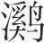水(2)。又复取道，其马不进，又刭而投之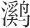水。如此者三。虽造父之所以威马(3)，不过此矣。不得造父之道，而徒得其威，无益于御。人主之不肖者，有似于此。不得其道，而徒多其威。威愈多，民愈不用。亡国之主，多以多威使其民矣。故威不可无有，而不足专恃。譬之若盐之于味，凡盐之用，有所托也。不适，则败托而不可食。威亦然，必有所托，然后可行。恶乎托(4)？托于爱利。爱利之心谕(5)，威乃可行。威太甚则爱利之心息，爱利之心息，而徒疾行威，身必咎矣。此殷、夏之所以绝也。君，利势也，次官也(6)。处次官，执利势，不可而不察于此。夫不禁而禁者，其唯深见此论邪。

**【注释】**

(1)取道：出行，赶路。

(2)倒：当为“刭”字之误。刭：杀。“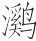水”当作“谿水”。（皆依王念孙说）。

(3)造父：古代善于驾马的人，曾为周穆王御者。

(4)恶（wū）乎：于何。恶，何。乎，于。

(5)谕：知晓，这里是被知晓的意思。

(6)次官：义未详。似指决定官吏的等次。次，等次。

**【译文】**

宋国有个赶路的人，他的马不肯前进，就杀死它把它扔到溪水里。又重新赶路，他的马不肯前进，又杀死它把它扔到溪水里。这样反复了三次。即使是造父对马树立威严的方法，也不过如此。那个宋国人没有学到造父驭马的方法，却仅仅学到了威严，这对于驾驭马没有什么好处。君主当中那些不贤德的人，与此相似。他们没有学到当君主的方法，却仅仅学到很多当君主的威严。威严越多，人民越不被使用。亡国的君主，大都凭着威严使用人民。所以威严不可以没有，也不足以专门依仗。这就譬如盐对于味道一样，凡是使用盐，一定要有凭借的东西。用量不适度，就毁坏了所凭借的东西，因而就不可食用了。威严也是这样，一定要有所凭借，然后才可以施以威严。凭借什么？凭借爱和利。爱和利的心被人晓喻了，威严才可以施行。威严太过分了，那么爱和利的心就会消失。爱和利的心消失了，却只是厉行威严，自身必定遭殃。这就是夏、商之所以灭亡的原因。君主有利有势，能决定官吏的等级。处于决定官吏等级的地位，掌握着利益和权势，君主对这种情况不可不审察清楚。不须刑罚禁止就能禁止人们为非的，大概只有深刻地认识到这个道理才能做到吧！

# 适威

**【题解】**

所谓“适威”，指君主树立威严应该适度。本篇旨在论述君主役使人民的方法。首先，君主只有善待人民，才能得到人民的拥戴；只有为民除患致福，才能无敌于天下。第二，君主树立威严应该适度，超过限度走到极端必然失败。这些观点，反映了作者的民本思想。

五曰：

先王之使其民，若御良马，轻任新节(1)，欲走不得，故致千里。善用其民者亦然。民日夜祈用而不可得，若得为上用，民之走之也，若决积水于千仞之溪(2)，其谁能当之？

《周书》曰(3)：“民，善之则畜也(4)，不善则雠也(5)”。有雠而众，不若无有。厉王(6)，天子也，有雠而众，故流于彘(7)，祸及子孙，微召公虎而绝无后嗣(8)。今世之人主，多欲众之，而不知善，此多其雠也。不善则不有(9)。有必缘其心，爱之谓也。有其形不可谓有之。舜布衣而有天下，桀，天子也，而不得息(10)，由此生矣。有无之论，不可不熟。汤、武通于此论，故功名立。

古之君民者，仁义以治之，爱利以安之，忠信以导之，务除其灾，思致其福。故民之于上也，若玺之于涂也(11)，抑之以方则方(12)，抑之以圜则圜(13)；若五种之于地也，必应其类，而蕃息于百倍。此五帝三王之所以无敌也。身已终矣，而后世化之如神，其人事审也。

**【注释】**

(1)任：载，负担。新节：当作“执节”（依许维遹说）。节，策，马鞭。

(2)仞：周代以七尺或八尺为仞。

(3)《周书》：古逸书。

(4)畜：通“慉（xù）”，喜爱，爱护。

(5)雠：仇。

(6)厉王：周厉王，有名的暴君。后被国人逐出，逃到彘，十四年后死在那里。

(7)彘（zhì）：古地名，在今山西霍县东北。

(8)“微召”句：厉王被逐后，太子靖藏在召公虎家中，国人包围了召公虎家，召公虎以己子代替太子，太子才免于死，所以这里这样说。召公虎，即召伯虎，召公奭的后代。厉王死后，他拥立太子靖（即周宣王）即位。

(9)不有：指不能得到人民拥护。

(10)息：安，指安居其位。

(11)玺：印。涂：指“封泥”。古代公私简牍封闭时，捆以绳，于绳端或交叉处加以检木，封以粘土，上盖印章，作为信验，以防私拆。这种钤有印章的泥块称为“封泥”。

(12)抑：按压。

(13)圜：通“圆”。

**【译文】**

第五：

先王役使自己的百姓，就像驾驭好马一样，让马拉着轻载，手里拿着马鞭，马想乱跑也办不到，所以能达到千里远的地方。善于役使自己百姓的人也是这样。百姓日夜祈求被使用却不能够被使用，如果能够被君主使用，百姓为君主奔走，就像积水从万丈深的溪流中决口冲出来，谁又能阻挡得住呢？

《周书》上说：“百姓，善待他们，他们就喜爱君主；不善待他们，他们就和君主成为仇人。”有很多仇人，就不如没有好。周厉王是天子，他有很多仇人，所以被放逐到彘，灾祸连累到子孙，如果没有召公虎，就断绝了后嗣。现在世上的君主，大都想使自己百姓众多，却不知道善待百姓，这只是使仇人增多啊。不善待百姓，就不能得到百姓拥护。得到百姓拥护，必须让百姓从内心里拥护，这就是所说的爱戴了。只占有百姓的躯体不能叫做得到百姓拥护。舜是平民，却占有了天下。桀是天子，却不得安居其位。这些都取决于能否得民心。得民心与失民心的道理，不可不认真审察。汤、武王精通这个道理，所以功成名就。

古代当君主的人，用仁和义治理百姓，用爱和利使百姓安定，用忠和信引导百姓，致力于为民除害，思考着为民造福。所以百姓对于君主来说，就像把玺印打在封泥上一样，用方形的按压就成为方形的，用圆形的按压就成为圆形的；就像把五谷种在土地上一样，收获的果实必定与种子同类，而且能成百倍地增长。这就是五帝三王之所以无敌于天下的原因。他们自己虽然去世了，可是后世如同神灵一般蒙受他们的教化，这是因为他们对世间之事经过认真审察。

魏武侯之居中山也(1)，问于李克曰(2)：“吴之所以亡者何也？”李克对曰：“骤战而骤胜(3)。”武侯曰：“骤战而骤胜，国家之福也，其独以亡，何故？”对曰：“骤战则民罢，骤胜则主骄。以骄主使罢民，然而国不亡者，天下少矣。骄则恣，恣则极物(4)；罢则怨，怨则极虑。上下俱极，吴之亡犹晚。此夫差之所以自殁于干隧也(5)。”

东野稷以御见庄公(6)，进退中绳(7)，左右旋中规(8)。庄公曰：“善。”以为造父不过也。使之钩百而少及焉(9)。颜阖入见(10)，庄公曰：“子遇东野稷乎？”对曰：“然，臣遇之。其马必败(11)。”庄公曰：“将何败？”少顷，东野之马败而至。庄公召颜阖而问之曰：“子何以知其败也？”颜阖对曰：“夫进退中绳，左右旋中规，造父之御，无以过焉。乡臣遇之(12)，犹求其马，臣是以知其败也。”

故乱国之使其民，不论人之性，不反人之情，烦为教而过不识，数为令而非不从，巨为危而罪不敢，重为任而罚不胜。民进则欲其赏，退则畏其罪。知其能力之不足也，则以为继矣(13)。以为继知，则上又从而罪之，是以罪召罪。上下之相雠也，由是起矣。

**【注释】**

(1)魏武侯：名击，魏文侯之子，前395年—前370年在位。文侯攻灭中山国后，封太子击为中山君，所以这里说他“居中山”。

(2)李克：战国初期政治家，子夏的学生。太子击为中山君时，他任中山相。

(3)骤：屡次。

(4)极：尽。这里用如动词，用尽。

(5)自殁：自刎。干隧：也作“干遂”，吴地名，在今江苏苏州西北。夫差被勾践打败后，在干隧自刎而死。

(6)东野稷：姓东野，名稷。见（xiàn）：展现，显示。庄公：指卫庄公。

(7)中：符合。绳：墨绳，木工取直的工具。

(8)规：木工取圆的工具。

(9)“使之”句：义未详。按：《庄子·达生》载此作“使之钩百而反”，疑此亦应作“使之钩百而反”，“及”乃“反”之形误，又与“少”误倒。“少焉”（须臾之义）另作一读属下。钩百，绕一百个圈子。钩，圆形，用如动词，则有绕圈义。

(10)颜阖：战国时期鲁国人。

(11)败：坏，这里是累坏的意思。

(12)乡：通“向”，刚才。

(13)为：通“伪”。

**【译文】**

魏武侯当中山君的时候，向李克问道：“吴国之所以灭亡的原因是什么呢？”李克回答说：“是因为屡战屡胜。”武侯说：“屡战屡胜，这是国家的福分，它却偏偏因此灭亡，是什么原因呢？”李克回答说：“多次作战，百姓就疲惫；多次胜利，君主就骄傲。用骄傲的君主役使疲惫的百姓，这样国家却不灭亡的，天下太少了。骄傲就会放纵，放纵就会用尽所欲之物；疲惫就会怨恨，怨恨就会用尽巧诈之心。君主用尽所欲之物，百姓用尽巧诈之心，吴国被灭亡还算晚了呢。这就是夫差之所以在干隧自刎的原因。”

东野稷在庄公面前表演自己的驾车技术，前进后退都符合规则，左转右转都合乎规矩。庄公说：“好。”认为造父也不能超过他。又让他的马绕一百个圈之后再回来。过了一会儿，颜阖来谒见庄公，庄公说：“你遇到东野稷了吗？”颜阖回答说：“是的，我遇到了他。他的马一定要累坏。”庄公说：“怎么会累坏呢？”过了一会儿，东野稷的马累坏回来了。庄公召来颜阖问他说：“你怎么知道他的马要累坏呢？”颜阖回答说：“前进后退都符合规则，左转右转都合乎规矩，造父驾车的技术都无法超过他了。刚才我遇到他，他还在无止境地苛求自己的马，我因此知道他的马要累坏。”

所以，混乱的国家役使自己百姓的情况是，不了解人的本性，不反求人的常情，频繁地制订教令，而责备人们不了解；屡次下达命令，而非难人们不听从；制造巨大的危难，而对人们不敢赴难加以治罪；把任务弄得十分繁重，而对人们不能胜任加以惩罚。百姓前进是希望得到赏赐，后退是害怕受到惩处，当知道自己的能力不足时，就会做虚假的事了。做虚假的事，君主知道了，跟着又加以惩处。这样就是因为畏罪而获罪。君主和百姓相互仇恨，就由此产生了。

故礼烦则不庄，业烦则无功，令苛则不听，禁多则不行。桀、纣之禁，不可胜数，故民因而身为戮，极也，不能用威适(1)。子阳极也好严(2)，有过而折弓者，恐必死，遂应猘狗而弑子阳(3)，极也。周鼎有窃曲(4)，状甚长，上下皆曲，以见极之败也(5)。

**【注释】**

(1)不能用威适：此五字当是注文而窜入正文（依陈昌齐说）。

(2)子阳：郑相，驷氏之后。极也：此二字涉上文而误行（依陈昌齐说）。

(3)猘：狗发疯。

(4)窃曲：古代铜器上的一种花纹。

(5)见（xiàn）：显示，表示。

**【译文】**

所以，礼节繁琐就不庄重，事情繁琐就不能成功，命令严苛就不被听从，禁令多了就行不通。桀、纣的禁令不可胜数，所以百姓因此而背叛，他们自己也被杀死，这是因为他们过分到极点了。子阳喜好严厉，有个人犯了过失弄断了弓，担心一定会被杀死，于是就乘追赶疯狗之机杀死了子阳，这是因为他过分到极点了。周鼎上铸有窃曲形花纹，花纹很长，上下都呈弯曲状，以此表明过分到极点的害处。

# 为欲

**【题解】**

本篇主要阐述要使人民有欲望。然后君主利用人民的欲望役使人民，从而达到治国的目的。文章指出：“使民无欲，上虽贤，犹不能用。”因此，人民有欲望，这是君主役使人民的基础。文章认为，君主使人民得到欲望的恰当的方法是“审顺其天而以行欲”，就是说，君主应该仔细审辨，顺应人民的天性，使人民满足欲望，那样，人民就会“无不令矣”。

文章最后以晋文公攻原得卫为例，说明君主必须诚信。这与下篇《贵信》相通。

六曰：

使民无欲，上虽贤，犹不能用。夫无欲者，其视为天子也，与为舆隶同(1)；其视有天下也，与无立锥之地同；其视为彭祖也(2)，与为殇子同(3)。天子，至贵也；天下，至富也；彭祖，至寿也。诚无欲，则是三者不足以劝(4)。舆隶，至贱也；无立锥之地，至贫也；殇子，至夭也。诚无欲，则是三者不足以禁。会有一欲(5)，则北至大夏(6)，南至北户(7)，西至三危(8)，东至扶木(9)，不敢乱矣；犯白刃，冒流矢，趣水火(10)，不敢却也；晨寤兴，务耕疾庸(11)，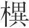为烦辱(12)，不敢休矣。故人之欲多者，其可得用亦多；人之欲少者，其得用亦少(13)；无欲者，不可得用也。人之欲虽多，而上无以令之，人虽得其欲，人犹不可用也。令人得欲之道，不可不审矣。

**【注释】**

(1)舆隶：“舆”和“隶”是同义词，都指奴隶，奴仆。

(2)彭祖：古代传说中长寿的人。

(3)殇（shānɡ）子：未成年而死的孩子。

(4)是：此。劝：勉励，鼓励。

(5)会：适逢。

(6)大夏：古湖泽名。

(7)北户：上古国名，所谓南荒之国。

(8)三危：山名，在今甘肃敦煌东。

(9)扶木：即扶桑，古代传说中的东方之国。

(10)趣：趋，奔赴。

(11)庸：佣，受雇佣代人种田。

(12)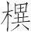：古“耕”字（依高诱说）。烦辱：繁杂劳苦。

(13)得用亦少：“得”上当脱一“可”字（依孙锵鸣说）。

**【译文】**

第六：

假使人们没有欲望，君主即使贤明，还是不能使用他们。没有欲望的人，他们看待当天子，跟当奴仆相同；他们看待享有天下，跟没有立锥之地相同；他们看待当个彭祖那样长寿的人，跟当个夭折的孩子相同。天子是最尊贵的了，天下是最富饶的了，彭祖是最长寿的了，如果没有欲望，那么这三种情况都不足以鼓励人们；奴仆是最低贱的了，没有立锥之地是最贫穷的了，夭折的孩子是最短命的了，如果没有欲望，那么这三种情况都不足以禁止人们。如果有一种欲望，那么向北到大夏，向南到北户，向西到三危，向东到扶桑，人们就都不敢作乱了；迎着闪光的刀，冒着飞来的箭，奔赴水火之中，人们也不敢后退；清早就起身，致力于耕种，受人雇佣，从事繁杂劳苦的耕作，也不敢休息。所以，欲望多的人，可以使用的地方也就多；欲望少的人，可以使用的地方也就少；没有欲望的人，就无法使用了。人们的欲望即使很多，可是君主没有恰当的方法役使他们，人们虽然满足了自己的欲望，还是不可以使用。让人们满足欲望的方法，不可不审察清楚。

善为上者，能令人得欲无穷，故人之可得用亦无穷也。蛮夷反舌殊俗异习之国(1)，其衣服冠带、宫室居处、舟车器械、声色滋味皆异，其为欲使一也(2)。三王不能革，不能革而功成者，顺其天也；桀、纣不能离，不能离而国亡者，逆其天也。逆而不知其逆也，湛于俗也(3)。久湛而不去则若性。性异非性，不可不熟。不闻道者，何以去非性哉？无以去非性，则欲未尝正矣。欲不正，以治身则夭，以治国则亡。故古之圣王，审顺其天而以行欲，则民无不令矣，功无不立矣。圣王执一(4)，四夷皆至者，其此之谓也！执一者至贵也，至贵者无敌。圣王托于无敌，故民命敌焉(5)。

群狗相与居，皆静无争。投以炙鸡，则相与争矣。或折其骨，或绝其筋(6)，争术存也。争术存，因争；不争之术存，因不争。取争之术而相与争(7)，万国无一。

**【注释】**

(1)蛮夷：古代对我国境内少数民族的泛称。反舌：蛮夷与华夏言语异声，故称“反舌”。

(2)为欲使：为欲望所驱使。一：一样，相同。

(3)湛：通“沉”。

(4)执一：指掌握住根本之道。

(5)敌：通“适”，往，归附。

(6)绝：断。

(7)“取争”句：此句义不可通，当有脱文。前“争”字上当有“不”字（依孙锵鸣说）。

**【译文】**

善于当君主的人，能够让人们无穷无尽地满足欲望，所以人们也就可以无穷无尽地被役使。言语、风俗、习惯与华夏都不相同的蛮夷之国，他们的衣服、帽子、衣带，房屋、住处，车船、器物，声音、颜色、饮食，都与华夏不同，但是他们为欲望所驱使却与华夏是一样的。三王不能改变这种情况，不能改变这种情况而能成就功业，这是因为顺应了人们的天性；桀、纣不能背离这种情况，不能背离这种情况而国家遭到灭亡，这是因为违背了人们的天性。违背了天性却还不知道，这是因为沉溺在习俗中了。长期沉溺在习俗中而不能自拔，那就变成自己的习性了。本性与非本性不同，这是不可不认真分辨清楚的。不懂得让人们得到欲望的方法的人，怎么能去掉非本性的东西呢？没有办法去掉非本性的东西，那么欲望就不会正当了。欲望不正当，用它来治理自身，就会夭亡；用它来治理国家，就会亡国。所以古代的圣贤君王，审察并顺应人们的天性，以便满足人们的欲望，人们就没有不听从命令的了，功业就没有不建立的了。圣贤的君王执守根本，四方部族都来归服，大概说的就是这种情况吧！执守根本的人是最尊贵的，最尊贵的人没有对手。圣贤的君王立身于没有对手的境地，所以人们的命运就都依附于他们了。

一群狗相互呆在一起，都安安静静地无所争夺。把烤熟的鸡扔给它们，就相互争夺了。有的被咬折了骨，有的被咬断了筋，这是因为存在着争夺的条件。存在着争夺的条件，就争夺；不存在争夺的条件，就不争夺。不存在争夺的条件却相互争夺，所有的国家没有任何一国有这种事。

凡治国，令其民争行义也(1)；乱国，令其民争为不义也。强国，令其民争乐用也；弱国，令其民争竞不用也。夫争行义乐用与争为不义竞不用，此其为祸福也，天不能覆，地不能载(2)。

晋文公伐原(3)，与士期七日。七日而原不下，命去之。谋士言曰：“原将下矣。”师吏请待之，公曰：“信，国之宝也。得原失宝，吾不为也。”遂去之。明年，复伐之，与士期必得原然后反。原人闻之，乃下。卫人闻之，以文公之信为至矣，乃归文公。故曰“攻原得卫”者，此之谓也。文公非不欲得原也，以不信得原，不若勿得也，必诚信以得之，归之者非独卫也。文公可谓知求欲矣。

**【注释】**

(1)治国：治理得好的国家。下句“乱国”指治理得不好的国家。

(2)“天不”二句：这两句是极言其祸福之大。

(3)原：古国名，在今山西沁水，周文王之子始封于此。后东迁，在今河南济源西北。重耳（即晋文公）回国即位，原不顺服，故伐之。

**【译文】**

凡是安定的国家，都是让人们争着做符合道义的事；混乱的国家，都是让人们争着做不符合道义的事。强大的国家，都是让人们争着乐于为君主所使用；弱小的国家，都是让人们争着不为君主所使用。争着做符合道义的事、争着为君主所使用与争着做不符合道义的事、争着不为君主所使用，这两种不同情况带来的祸和福，天都不能覆盖住，地都不能承载起。

晋文公攻打原国，与士兵约定七天为期。过了七天没有攻下原国，文公就命令离开。谋士们说：“原国就要投降了。”军官们都请求等待一下，文公说：“信用是国家的珍宝。得到原国失掉珍宝，我不这样做。”于是离开了。第二年，又攻打原国，与士兵约定一定得到原国然后才返回。原国人听到了这约定，于是就投降了。卫国人听到这件事，认为文公的信用真是达到极点了，就归顺了文公。所以人们说的“攻打原国同时得到了卫国”，指的就是这个。文公并不是不想得到原国，以不守信用为代价得到原国，不如不得到，一定要靠诚信来得到，归顺的不仅仅是卫国啊。文公可以说是懂得如何实现自己的欲望了。

# 贵信

**【题解】**

本篇主要论述君主必须诚信的道理。诚信是君主治国的基本准则，君主能做到诚信，人民就会亲附，万物就会为己所用，就能称王于天下。君主如果丧失诚信，就会带来极大的危害。文章通过管仲劝说齐桓公对仇敌信守盟誓，最终成就霸业的事例，强调了诚信对国君的重要意义。

七曰：

凡人主必信，信而又信，谁人不亲？故《周书》曰(1)：“允哉(2)！允哉！”以言非信则百事不满也(3)。故信之为功大矣。信立则虚言可以赏矣(4)。虚言可以赏，则六合之内皆为己府矣。信之所及，尽制之矣。制之而不用，人之有也；制之而用之，己之有也。己有之，则天地之物毕为用矣。人主有见此论者(5)，其王不久矣；人臣有知此论者，可以为王者佐矣。

**【注释】**

(1)《周书》：古逸书，记载周代训诰誓命之书。

(2)允：诚信，真诚。

(3)满：完，成。

(4)赏：鉴别。

(5)见：知道。

**【译文】**

第七：

凡是君主一定要诚信，诚信而又诚信，谁能不亲附？所以《周书》上说“诚信啊：！诚信啊！”这是说如果不诚信，那么所有的事情都不能成功。因此诚信所产生的功效太大了。诚信树立了，虚假的话就可以鉴别了。虚假的话可以鉴别，整个天下就都成为自己的了。诚信所达到的地方，就都能够控制了。能够控制却不加以利用，仍然会为他人所有；能够控制而又加以利用，才会为自己所有。为自己所有，那么天地间的事物就全都为自己所用了。君主如有知道这个道理的，那他很快就能称王了；臣子如有知道这个道理的，那就可以当帝王的辅佐了。

天行不信，不能成岁；地行不信，草木不大。春之德风(1)，风不信，其华不盛(2)，华不盛，则果实不生。夏之德暑，暑不信，其土不肥，土不肥，则长遂不精。秋之德雨，雨不信，其谷不坚(3)，谷不坚，则五种不成。冬之德寒，寒不信，其地不刚，地不刚，则冻闭不开(4)。天地之大，四时之化，而犹不能以不信成物，又况乎人事？

君臣不信，则百姓诽谤(5)，社稷不宁。处官不信，则少不畏长，贵贱相轻。赏罚不信，则民易犯法，不可使令。交友不信，则离散郁怨，不能相亲。百工不信，则器械苦伪(6)，丹漆染色不贞(7)。夫可与为始，可与为终，可与尊通，可与卑穷者，其唯信乎！信而又信，重袭于身(8)，乃通于天。以此治人，则膏雨甘露降矣，寒暑四时当矣。

**【注释】**

(1)德：事物的属性，这里有表征、象征的意思。

(2)华：古“花”字。

(3)坚：坚实，指谷粒成熟，坚实饱满。

(4)冻闭不开：指地冻得不能裂开。按：本书《仲冬》有“冰益壮，地始坼”之语，“地始坼”即地冻得开始裂开缝隙。此处“冻闭不开”其意正与“地始坼”相反，乃是“地不刚”“寒不信”所致。

(5)诽谤：批评议论，指责。

(6)苦（gǔ）：粗劣。伪：作假。

(7)丹漆：二者均为颜料。丹，红色。漆，黑色。贞：纯正。

(8)重袭：重叠。

**【译文】**

天的运行不遵循规律，就不能形成岁时；地的运行不遵循规律，草木就不能长大。春天的特征是风，风不能按时到来，花就不能盛开，花不能盛开，那么果实就不能生长。夏天的特征是炎热，炎热不能按时到来，土地就不肥沃，土地不肥沃，那么植物生长成熟的情况就不好。秋天的特征是雨，雨不能按时降下，谷粒就不坚实饱满，谷粒不坚实饱满，那么五谷就不能成熟。冬天的特征是寒冷，寒冷不能按时到来，地冻得就不坚固，地冻得不坚固，那么就不能冻开裂缝。天地如此之大，四时如此变化，尚且不能以不遵循规律生成万物，更何况人事呢？

君臣不诚信，那么百姓就会批评指责，国家就不得安宁。当官不诚信，那么年轻的就不敬畏年长的，地位尊贵的和地位低下的就会互相轻视。赏罚不诚信，那么百姓就会轻易犯法，不可以役使。结交朋友不诚信，那么就会离散怨恨，不能互相亲近。各种工匠不诚信，那么器物就会粗劣作假，丹和漆等颜料就不纯正。可以跟它一块开始，可以跟它一块终止，可以跟它一块尊贵显达，可以跟它一块卑微穷困的，大概只有诚信吧！诚信而又诚信，诚信重叠于身，就能与天意相通。靠这个来治理人，那么滋润大地的雨水和甜美的露水就会降下来，寒暑四季就会得当。

齐桓公伐鲁。鲁人不敢轻战，去鲁国五十里而封之(1)。鲁请比关内侯以听(2)，桓公许之。曹翙谓鲁庄公曰(3)：“君宁死而又死乎(4)，其宁生而又生乎(5)？”庄公曰：“何谓也？”曹翙曰：“听臣之言，国必广大，身必安乐，是生而又生也；不听臣之言，国必灭亡，身必危辱，是死而又死也。”庄公曰：“请从。”于是明日将盟，庄公与曹翙皆怀剑至于坛上(6)。庄公左搏桓公，右抽剑以自承(7)，曰：“鲁国去境数百里，今去境五十里，亦无生矣。钧其死也(8)，戮于君前(9)。”管仲、鲍叔进，曹翙按剑当两陛之间曰(10)：“且二君将改图，毋或进者(11)！”庄公曰：“封于汶则可(12)，不则请死。”管仲曰：“以地卫君，非以君卫地。君其许之！”乃遂封于汶南，与之盟。归而欲勿予，管仲曰：“不可。人特劫君而不盟(13)，君不知，不可谓智；临难而不能勿听，不可谓勇；许之而不予，不可谓信。不智不勇不信，有此三者，不可以立功名。予之，虽亡地，亦得信。以四百里之地见信于天下，君犹得也。”庄公，仇也；曹翙，贼也(14)。信于仇贼，又况于非仇贼者乎？夫九合之而合，壹匡之而听(15)，从此生矣。管仲可谓能因物矣。以辱为荣，以穷为通，虽失乎前，可谓后得之矣。物固不可全也。

**【注释】**

(1)去：距离，离。国：都城。封：封土为界。

(2)比：比照。关：国家的关隘。侯：指国内有食邑的大官。

(3)曹翙（huì）：他书或作“曹刿”、“曹沫”。鲁庄公：春秋时鲁国君主，前693年—前662年在位。

(4)死而又死：指身危国亡。

(5)生而又生：指身安国存。“宁……宁……”是表示选择的习惯句式。

(6)坛：指土坛，古代盟誓时要积土为坛。

(7)自承：指把剑冲着自己。庄公这样做是表示自己决心同齐桓公拼命。

(8)钧：通“均”，同。

(9)戮于君前：死在您面前。意思是和您同归于尽。

(10)陛：殿或坛的台阶。

(11)毋或进者：谁也不要上去。毋，不要。或，语气词。

(12)汶：水名，泰山一带水皆名汶，靠近齐国。

(13)特：仅，只是。不盟：指不订立“去鲁国五十里”为界的盟约。

(14)贼：与“仇”义近，指外敌。

(15)壹匡：指齐桓公“一匡天下”。壹，一切，全部。听：听从。

**【译文】**

齐桓公攻打鲁国。鲁国人不敢轻率作战，离鲁国都城五十里封土为界。鲁国请求像齐国的封邑大臣一样服从齐国，桓公答应了。曹翙对鲁庄公说：“您是愿意死而又死呢，还是愿意生而又生？”庄公说：“你说的是什么意思呢？”曹翙说：“您听从我的话，国土必定广大，您自身必定安乐，这就是生而又生；您不听从我的话，国家必定灭亡，您自身必定遭到危险耻辱，这就是死而又死。”庄公说：“我愿意听从你的话。”第二天将要盟会时，庄公与曹翙都怀揣着剑到了盟会的土坛上。庄公左手抓住桓公，右手抽出剑来指着自己，说：“鲁国都城本来离边境几百里，如今离边境只有五十里，反正也无法生存了。削减领土不能生存与跟你拼命同样是死，让我死在您面前。”管仲、鲍叔要上去，曹翙手按着剑站在两阶之间说：“两位君主将另作商量，谁都不许上去！”庄公说：“在汶水封土为界就可以，不然的话就请求一死。”管仲对桓公说：“是用领土保卫君主，不是用君主保卫领土。您还是答应了吧！”于是终于在汶水之南封土为界，跟鲁国订立了盟约。桓公回国以后想不还给鲁国土地，管仲说：“不可以。人家只是要劫持您，并不想跟您订立盟约，可是您却不知道，这不能说是聪明；面对危难却不能不受人家胁迫，这不能说是勇敢；答应了人家却不还给人家土地，这不能算作诚信。不聪明、不勇敢、不诚信，有这三种行为的，不可以建立功名。还给它土地，这样虽说失去了土地，也还能得到诚信的名声。用四百里土地就在天下人面前显示出诚信来，您还是合算的。”庄公是仇人，曹翙是敌人，对仇人敌人都讲诚信，更何况对不是仇人敌人的人呢？桓公多次盟会诸侯而能成功，使天下一切都得到匡正而天下能听从，就由此产生出来了。管仲可以说是能因势利导了。他把耻辱变成光荣，把困窘变成通达。虽说前边有所失，不过可以说后来有所得了。事情本来就不可能十全十美啊。

# 举难

**【题解】**

本篇旨在论述选拔任用人才之难。选拔任用人才不能求全责备，“以全举人固难物之情也”。文章通过大量事例说明在选拔任用人方面应该责人宽，责己严；对于一心建立功名的人，不能要求他们一举一动都符合原则；应该从众人中广泛地选取人才，贵在取其所长；不应该“以人之小恶，亡人之大美”。

八曰：

以全举人固难，物之情也。人伤尧以不慈之名(1)，舜以卑父之号(2)，禹以贪位之意(3)，汤、武以放弑之谋(4)，五伯以侵夺之事。由此观之，物岂可全哉？故君子责人则以人(5)，自责则以义。责人以人则易足，易足则得人；自责以义则难为非，难为非则行饰(6)。故任天地而有馀。不肖者则不然。责人则以义，自责则以人。责人以义则难瞻(7)，难瞻则失亲；自责以人则易为，易为则行苟。故天下之大而不容也，身取危，国取亡焉。此桀、纣、幽、厉之行也。尺之木必有节目(8)，寸之玉必有瑕瓋(9)。先王知务之不可全也，故择务而贵取一也(10)。

**【注释】**

(1)“人伤”句：尧传位与舜而不与子，所以有人以“不慈”之名诋毁他。伤：诋毁。

(2)舜以卑父之号：即“伤舜以卑父之号”，“伤”字承上文而省略。下三句与此同。

(3)禹以贪位之意：舜推荐禹为继承人，舜死后，禹避舜之子于阳城，而天下百姓却跟从禹，禹这才继承了帝位。所以有人诋毁他“贪位”。位，指帝位。

(4)汤、武以放弑之谋：汤打败桀，桀出奔南方。武王伐商，纣兵败自焚而死。所以有人诋毁他们放、弑其君。放，逐。弑，下杀上。

(5)以人：指按一般人的标准。

(6)饰：通“饬”，端正，严整。

(7)难瞻：义不可通，疑当作“难赡”（依毕沅校说），难以满足要求。赡，供之使足。

(8)节目：树木枝干交接之处为节，文理纠结不顺的部分为目。

(9)瑕瓋（tì）：玉上的斑点。

(10)务：事务。取一：指取其长处。

**【译文】**

第八：

用十全十美的标准举荐人必定很难，这是事物的实情。有人用不爱儿子的名声诋毁尧，用不孝顺父亲的称号诋毁舜，用内心贪图帝位来诋毁禹，用谋划放逐、杀死君主来诋毁汤、武王，用侵吞掠夺别国来诋毁五霸。由此看来，事物怎么能十全十美呢？所以，君子按照一般的标准要求别人，按照义的标准要求自己。按照一般的标准要求别人就容易得到满足，容易得到满足就能受到人民拥护；按照义的标准要求自己就难以做错事，难以做错事行为就严正。所以他们承担天地间的重任还游刃有馀。不贤德的人就不是这样了。他们按照义的标准要求别人，按照一般的标准要求自己。按照义的标准要求别人就难以满足，难以满足就连最亲近的人也会失去；按照一般的标准要求自己就容易做到，容易做到行为就苟且。所以天下如此之大他们却不能容身，自身招致危险，国家招致灭亡。这就是桀、纣、周幽王、周厉王的所作所为啊。一尺长的树木必定有节结，一寸大的玉石必定有瑕疵。先王知道事物不可能十全十美，所以对事物的选择只看重其长处。

季孙氏劫公家(1)，孔子欲谕术则见外(2)，于是受养而便说(3)。鲁国以訾(4)。孔子曰：“龙食乎清而游乎清，螭食乎清而游乎浊(5)，鱼食乎浊而游乎浊。今丘上不及龙，下不若鱼，丘其螭邪！”夫欲立功者，岂得中绳哉(6)？救溺者濡(7)，追逃者趋。

**【注释】**

(1)季孙氏：春秋时鲁国最有权势的贵族，此当指季平子。劫公家：把持鲁国公室政权。

(2)谕术：即“谕以术”，以道理使之晓谕。见外：被疏远。

(3)便说：便于劝说。

(4)訾（zǐ）：毁谤非议。

(5)螭（chī）：古代传说中的一种动物，龙之属。

(6)中绳：指符合规则、原则。

(7)濡：沾湿。

**【译文】**

季孙氏把持公室政权，孔子想晓之以理，但这样就会被疏远，于是就去接受他的衣食，以便向他进言。鲁国人因此责备孔子。孔子说：“龙在清澈的水里吃东西，在清澈的水里游动；螭在清澈的水里吃东西，在浑浊的水里游动；鱼在浑浊的水里吃东西，在浑浊的水里游动。现在我往上赶不上龙，往下不像鱼那样，我大概像螭一样吧！”那些想建立功业的人，哪能处处都合乎规则呢？援救溺水之人的人要沾湿衣服，追赶逃跑之人的人总要奔跑。

魏文侯弟曰季成，友曰翟璜。文侯欲相之，而未能决，以问李克(1)，李克对曰：“君欲置相，则问乐腾与王孙苟端孰贤(2)。”文侯曰：“善。”以王孙苟端为不肖，翟璜进之(3)；以乐腾为贤，季成进之。故相季成。凡听于主，言人不可不慎。季成，弟也，翟璜，友也，而犹不能知，何由知乐腾与王孙苟端哉？疏贱者知，亲习者不知，理无自然(4)。自然而断相(5)，过。李克之对文侯也亦过。虽皆过，譬之若金之与木，金虽柔，犹坚于木(6)。

孟尝君问于白圭曰：“魏文侯名过桓公，而功不及五伯，何也？”白圭对曰：“文侯师子夏，友田子方，敬段干木，此名之所以过桓公也。卜相曰‘成与璜孰可’(7)，此功之所以不及五伯也。相也者，百官之长也，择者欲其博也。今择而不去二人，与用其雠亦远矣(8)。且师友也者(9)，公可也；戚爱也者(10)，私安也(11)。以私胜公，衰国之政也。然而名号显荣者，三士羽翼之也。”

**【注释】**

(1)李克：战国初期人，子夏的学生，仕于魏。

(2)乐腾与王孙苟端：都是魏文侯之臣。

(3)进：举荐。

(4)理无自然：不会有这样的道理。无自，无从。然，这样。

(5)“自然”句：“自然”上当脱“理无”二字（依俞樾说）。

(6)金虽柔，犹坚于木：这是比喻说法，喻李克之过较文侯之过为轻。

(7)卜：选择。孰：哪一个。

(8)用其雠：指齐桓公任用管仲为相。管仲初辅佐公子纠，曾箭射公子小白。公子小白即位后（即齐桓公），任用管仲为相。所以这里说“用其雠”。雠，仇。

(9)师友：指任用师友为相。师友指上文提到的子夏、田子方。

(10)戚爱：指任用弟弟与所宠爱之人为相。戚，近亲，此指弟弟，即上文的季成。爱，所宠爱之人，此指上文的翟璜。

(11)私安：私利。

**【译文】**

魏文侯的弟弟名叫季成，朋友名叫翟璜。文侯想让他们当中的一个人当相，可是不能决断，就询问李克，李克回答说：“您想立相，那么看看乐腾与王孙苟端哪一个好些就可以了。”文侯说：“好。”文侯认为王孙苟端不好，而他是翟璜举荐的；认为乐腾好，而他是季成举荐的。所以就让季成当了相。凡是言论被君主听从的人，谈论别人不可不慎重。季成是弟弟，翟璜是朋友，而文侯尚且不能了解，又怎么能够了解乐腾与王孙苟端呢？对疏远低贱的人却了解，对亲近熟悉的人却不了解，没有这样的道理。没有这样的道理却要以此决断相位，这就错了。李克回答文侯的话也错了。他们虽然都错了，但是就如同金和木一样，金虽然软，但还是比木硬。

孟尝君向白圭问道：“魏文侯名声超过了齐桓公，可是功业却赶不上五霸，这是为什么呢？”白圭回答说：“文侯以子夏为师，以田子方为友，敬重段干木，这就是他的名声超过桓公的原因。选择相的时候说‘季成与翟璜哪一个可以’，这就是他的功业赶不上五霸的原因。相是百官之长，选择时要从众人中挑选。现在选择相却离不开那两个人，这跟桓公任用自己的仇人管仲为相相差太远了。况且以师友为相，是为了公利；以亲属宠爱的人为相，是为了私利。把私利放在公利之上，这是衰微国家的政治。然而他的名声却显赫荣耀，这是因为有三位贤士辅佐他。”

宁戚欲干齐桓公(1)，穷困无以自进，于是为商旅将任车以至齐(2)，暮宿于郭门之外。桓公郊迎客，夜开门，辟任车(3)，爝火甚盛(4)，从者甚众。宁戚饭牛居车下，望桓公而悲，击牛角疾歌。桓公闻之，抚其仆之手曰：“异哉！之歌者非常人也！”命后车载之(5)。桓公反，至，从者以请。桓公赐之衣冠，将见之。宁戚见，说桓公以治境内。明日复见，说桓公以为天下。桓公大说，将任之。群臣争之曰(6)：“客，卫人也。卫之去齐不远，君不若使人问之。而固贤者也，用之未晚也。”桓公曰：“不然。问之，患其有小恶。以人之小恶，亡人之大美，此人主之所以失天下之士也已。”凡听必有以矣，今听而不复问，合其所以也。且人固难全，权而用其长者，当举也。桓公得之矣。

**【注释】**

(1)宁戚：即宁速。干：谋求官职。

(2)任车：装载货物的车子。任，装载。

(3)辟：躲避。这个意义后来写作“避”。这里用如使动，使……躲避。

(4)爝（jué）火：小火把。

(5)后车：副车，侍从之车。

(6)争：劝谏。这个意义后来写作“诤”。

**【译文】**

宁戚想向齐桓公谋求官职，但处境穷困，没有办法使自己得到举荐，于是就给商人赶着装载货物的车子到了齐国，傍晚住在城门外。桓公到郊外迎客，夜里打开城门，让装载货物的车子躲开，火把很明亮，跟随的人很多。宁戚在车下喂牛，望见桓公，心里很悲伤，就敲着牛角大声唱起歌来。桓公听到歌声，抚摸着自己车夫的手说：“真是与众不同啊！这个唱歌的不是一般人！”就命令副车载着他。桓公回去，到了朝廷里，跟随的人请示桓公如何安置宁戚。桓公赐给他衣服帽子，准备召见他。宁戚见到桓公，用如何治理国家的话劝说桓公。第二天又谒见桓公，用如何治理天下的话劝说桓公。桓公非常高兴，准备任用他。臣子们劝谏说：“这个客人是卫国人。卫国离齐国不远，您不如去询问一下。如果确实是贤德的人，再任用他也不晚。”桓公说：“不是这样。去询问，担心他有小毛病。因为人家的小毛病，丢掉人家的大优点，这是君主失掉天下杰出人才的原因。”凡是听取别人的主张一定是有根据的，现在听从了他的主张而不再去追究他的为人如何，这是因为其主张符合听者心目中的标准。况且人本来就难以十全十美，衡量以后用其所长，这是举荐人才的恰当做法。桓公算是掌握住这个原则了。

