 恃君览第八

# 恃君

**【题解】**

《恃君览》八篇，主要论述如何为君。

本篇试图通过论述君道产生的原因，证明君道的必然性、合理性。文章认为，就人自身来说，不能单独抵御各种自然灾害，然而，人却能主宰万物，这是由于群居的缘故。人之所以能够聚居在一起，是由于相互都能获得好处。为生存而群居，并从中相互获得好处，这就是君道必然产生的根基。文章在列举了太古时代无君的祸患之后，提出“为天下长虑，莫如置天子也；为一国长虑，莫如置君也”。同时认为“置君非以阿君也，置天子非以阿天子也”，君主要“利而物利章”，以为人民谋利益而不谋私利为壮则。

一曰：

凡人之性，爪牙不足以自守卫，肌肤不足以扞寒暑(1)，筋骨不足以从利辟害，勇敢不足以却猛禁悍。然且犹裁万物(2)，制禽兽，服狡虫(3)，寒暑燥湿弗能害，不唯先有其备，而以群聚邪！群之可聚也，相与利之也。利之出于群也，君道立也(4)。故君道立则利出于群，而人备可完矣。

昔太古尝无君矣，其民聚生群处，知母不知父，无亲戚兄弟夫妻男女之别(5)，无上下长幼之道，无进退揖让之礼，无衣服、履带、宫室、畜积之便，无器械、舟车、城郭、险阻之备。此无君之患。故君臣之义，不可不明也。

自上世以来，天下亡国多矣，而君道不废者，天下之利也。故废其非君，而立其行君道者。君道何如？利而物利章(6)。

**【注释】**

(1)扞（hàn）：也作“捍”，抵御。

(2)裁：主宰。

(3)狡虫：指毒虫。狡，凶暴。

(4)“利之”二句：古人把能群聚百姓作为君主的职守，而能群聚，百姓自然彼此都有利，所以这里说“利之出于群也，君道立也”。

(5)亲戚：近亲，这里指父母。

(6)物：通“勿”。章：章则，准则。

**【译文】**

第一：

就人的本能来说，爪牙不足以保卫自己，肌肤不足以抵御寒暑，筋骨不足以使人趋利避害，勇敢不足以使人击退制止凶猛强悍之物。然而人还是能够主宰万物，制服毒虫猛兽，使寒暑燥湿不能为害，这不正是人们事先有准备，并且能结成群体吗！人们可以聚集，是因为彼此都能使对方得利。人们在群聚中相互得利，为君的原则就确立了。所以，为君的原则确立了，那么利益就会从群聚中产生出来，而人事方面的准备就可以齐全了。

从前，远古时期曾经没有君主，那时的人民过着群居的生活，只知道母亲而不知道父亲，没有父母兄弟夫妻男女的区别，没有上下长幼的准则，没有进退揖让的礼节，没有衣服、鞋子、衣带、房屋、积蓄这些方便人的东西，不具备器械、车船、城郭、险隘这些东西。这就是没有君主的祸患。所以君臣之间的原则，不可不明察啊。

从上古以来，天下灭亡的国家很多了，可是为君的原则却不废掉，这是因为对天下有利啊。所以要废掉那些不按为君原则行事的人，拥立那些按为君原则行事的人。为君的原则是什么？就是把为人民谋利而自己不谋私利作为准则。

非滨之东(1)，夷秽之乡(2)，大解、陵鱼、其、鹿野、摇山、扬岛、大人之居(3)，多无君；扬、汉之南(4)，百越之际(5)，敝凯诸、夫风、余靡之地(6)，缚娄、阳禺、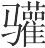兜之国(7)，多无君；氐、羌、呼唐、离水之西(8)，僰人、野人、篇笮之川(9)，舟人、送龙、突人之乡(10)，多无君；雁门之北(11)，鹰隼、所鸷、须窥之国(12)，饕餮、穷奇之地(13)，叔逆之所(14)，儋耳之居(15)，多无君。此四方之无君者也。其民麋鹿禽兽，少者使长，长者畏壮，有力者贤，暴傲者尊，日夜相残，无时休息(16)，以尽其类。圣人深见此患也，故为天下长虑，莫如置天子也；为一国长虑，莫如置君也。置君非以阿君也(17)，置天子非以阿天子也，置官长非以阿官长也。德衰世乱，然后天子利天下(18)，国君利国，官长利官。此国所以递兴递废也，乱难之所以时作也。故忠臣廉士，内之则谏其君之过也，外之则死人臣之义也。

**【注释】**

(1)非滨：未详。毕沅谓“非”当作“北”。北滨当即北海。

(2)夷秽：“夷”指东方少数民族，“秽”是国名。

(3)大解、陵鱼、其、鹿野、摇山、扬岛、大人：未详。疑皆为部族名。

(4)扬：扬州。汉：汉水。

(5)百越：“越”是古代部族名，居于长江中下游以南，部落众多，故称“百越”。

(6)敝凯诸、夫风、余靡：未详。疑皆为部族或国家名。

(7)缚娄、阳禺：未详。疑皆为古国名。兜之国：疑即“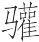头之国”，传说中的南方国名。

(8)氐、羌：都是古代我国西北方部族名。呼唐、离水：呼唐，未详，疑为水名。离水，古水名，黄河的支流，在西方。

(9)僰（bó）：古部族名，居住在川南及滇东一带。篇笮（zuó）川：当为水名。

(10)舟人、送龙、突人：未详。疑皆为古部族名。

(11)雁门：雁门山，即句注山，在山西代县西北。

(12)鹰隼、所鸷、须窥：未详。疑皆为古国名。

(13)饕餮（tāotiè）、穷奇：未详。疑皆为古部族名。

(14)叔逆：未详。疑为古部族名。

(15)儋耳：古部族名，在北部边远地区。

(16)休息：止息，停止。

(17)阿（ē）：私。

(18)利天下：以有天下为己利。利，用如意动。下两句结构同此。

**【译文】**

北滨以东，夷人居住的秽国，大解、陵鱼、其、鹿野、摇山、扬岛、大人等部族居住的地方，大都没有君主；扬州、汉水以南，百越人住的地方，敝凯诸、夫风、余靡等部族那里，缚娄、阳禺、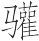兜等国家，大都没有君主；氐族、羌族、呼唐、离水以西，僰人、野人、篇笮川那里，舟人、送龙、突人等部族居住的地方，大都没有君主；雁门以北，鹰隼、所鸷、须窥等国家，饕餮、穷奇等部族那里，叔逆族那里，儋耳族居住的地方，大都没有君主。这是四方没有君主的地方。那里的人民像麋鹿禽兽一样，年轻人役使老年人，老年人畏惧壮年人，有力气的人就被认为贤德，残暴骄横的人地位就尊贵，人们日夜互相残害，没有停息的时候，以此来灭绝自己的同类。圣人清楚地看到这样做的危害，所以，为天下做长远的考虑，没有比立天子更好的了；为一国做长远的考虑，没有比立国君更好的了。立国君不是为了让国君谋私利，立天子不是为了让天子谋私利，立官长不是为了让官长谋私利。到了道德衰微世道混乱的时代，天子才凭借天下谋私利，国君才凭借国家谋私利，官长才凭借官职谋私利。这就是国家一个接一个兴起、一个接一个灭掉的原因，这就是混乱灾难之所以时时发生的原因。所以忠臣和廉正之士，对内就要敢于谏止自己国君的过错，对外就要敢于为维护臣子的道义而献身。

豫让欲杀赵襄子(1)，灭须去眉，自刑以变其容，为乞人而往乞于其妻之所。其妻曰：“状貌无似吾夫者，其音何类吾夫之甚也？”又吞炭以变其音。其友谓之曰：“子之所道甚难而无功。谓子有志则然矣，谓子智则不然。以子之材而索事襄子(2)，襄子必近子。子得近而行所欲，此甚易而功必成。”豫让笑而应之曰：“是先知报后知也(3)，为故君贼新君矣(4)，大乱君臣之义者无此，失吾所为为之矣。凡吾所为为此者，所以明君臣之义也，非从易也。”

**【注释】**

(1)豫让：晋国人，智伯的家臣。韩、赵、魏三家共灭智氏后，他为给智伯报仇，几次谋刺赵襄子，被俘后，求得襄子之衣，拔剑击衣后自杀。

(2)索：求。

(3)先知：即先知己者，先了解自己的人，这里指智伯。后知：即后知己者，后了解自己的人，这里指赵襄子。

(4)故君：过去的主人，这里指智伯。贼：杀害。新君：新主人，这里指赵襄子。

**【译文】**

豫让想刺杀赵襄子，就剃掉胡须眉毛，自己动手毁坏了面容，装扮成乞丐去他妻子那里乞讨。他的妻子说：“这个人相貌没有像我丈夫的地方，他的声音怎么这样像我的丈夫呀？”他又吞炭改变了自己的声音。他的朋友对他说：“您所选取的道路很艰难而且没有什么功效。要说您有决心那是对的，要说您聪明那就不对了。凭着您的才干去请求侍奉襄子，襄子必定亲近您。您受到亲近然后再做您想做的事，这样就会很容易而且必定能成功。”豫让笑着回答他说：“这样就是为了先知遇自己的人而去报复后知遇自己的人，就是为了过去的主人而去杀害新的主人，使君臣之间的准则大乱的事，没有比这更大的了，这就失去我所以要行刺的目的了。我要行刺的目的，是为了让君臣之间的道义彰明，并不是要抛弃君臣之义选取容易的道路。”

柱厉叔事莒敖公(1)，自以为不知，而去居于海上。夏日则食菱芡(2)，冬日则食橡栗(3)。莒敖公有难，柱厉叔辞其友而往死之。其友曰：“子自以为不知故去，今又往死之，是知与不知无异别也。”柱厉叔曰：“不然。自以为不知故去，今死而弗往死，是果知我也。吾将死之，以丑后世人主之不知其臣者也(4)，所以激君人者之行，而厉人主之节也。行激节厉，忠臣幸于得察(5)。忠臣察则君道固矣。”

**【注释】**

(1)柱厉叔：他书或作“朱厉附”，人名。莒敖公：他书或作“莒穆公”，春秋时莒国君主。莒，古国名，在今山东莒县。

(2)菱：植物名，俗称“菱角”，生于水中。芡：植物名，也称“鸡头”，生于水中。

(3)橡栗：橡树的果实，即栎实，形状似栗子。

(4)丑：惭愧。这里用如使动，使……惭愧。

(5)察：知，了解。

**【译文】**

柱厉叔侍奉莒敖公，自己认为不被知遇，因而离开莒敖公到海边居住。夏天吃菱角芡实，冬天吃橡树籽。莒敖公遇难，柱厉叔辞别他的朋友要为莒敖公去死。他的朋友说：“您自己认为不被知遇，所以离开了他，如今又要为他去死，这样看来，被知遇与不被知遇就没有什么区别了。”柱厉叔说：“不是这样。我自己认为不被知遇，所以离开了他，如今他死了，我却不为他去死，这就表明他果真了解我是不忠不义之臣了。我将为他而死，以便使后世当君主却不了解自己臣子的人感到惭愧，用以激励君主的品行，磨砺君主的节操。君主的品行得到激励，节操受到磨砺，忠臣就有可能被了解。忠臣被了解，那么为君之道就牢固了。”

# 长利

**【题解】**

本篇主要论述考虑天下长远利益的重要性。文章通过伯成子高辞为诸侯而耕“以禁后世之乱”、周公受封于鲁以避免子孙“阻山林之险以长为无道”、戎夷解衣救活弟子“以必死见其义”等事例，阐明“天下之士也者，虑天下之长利，而固处之以身”的主张。同时批评了那种只贪图眼前利益，只顾子孙私利的错误做法。

二曰：

天下之士也者，虑天下之长利，而固处之以身若也(1)。利虽倍于今，而不便于后，弗为也；安虽长久，而以私其子孙，弗行也。由此观之，陈无宇之可丑亦重矣(2)，其与伯成子高、周公旦、戎夷也(3)，形虽同(4)，取舍之殊，岂不远哉？

**【注释】**

(1)固处之以身若也：王念孙校本改“若”为“者”，应是。这句意思是，必定要身体力行。

(2)陈无宇：齐国大夫，谥“桓子”。丑：耻辱。按：陈无宇与鲍文子攻打栾氏、高氏，栾、高出奔，陈、鲍乃分其土地财产，所以这里说他“可丑”。

(3)伯成子高：相传为尧、舜时的诸侯。戎夷：齐国的仁者。

(4)形：身形。

**【译文】**

第二：

天下杰出的人士，考虑的是天下长远的利益，而自己必定要身体力行。即使对现在有加倍的利益，只要对后世不利，也不去做；即使能长久安定，只要这些是为自己的子孙谋利，也不去做。由此看来，陈无宇的贪婪可耻也很严重了，他与伯成子高、周公旦、戎夷相比，虽然同样是人，但取舍的不同，相差难道不是很远吗？

尧治天下，伯成子高立为诸侯。尧授舜，舜授禹，伯成子高辞诸侯而耕。禹往见之，则耕在野。禹趋就下风而问曰：(1)“尧理天下，吾子立为诸侯(2)。今至于我而辞之，故何也(3)？”伯成子高曰：“当尧之时，未赏而民劝(4)，未罚而民畏。民不知怨，不知说，愉愉其如赤子(5)。今赏罚甚数，而民争利且不服，德自此衰，利自此作，后世之乱自此始。夫子盍行乎(6)？无虑吾农事(7)！”协而耰(8)，遂不顾。夫为诸侯，名显荣，实佚乐，继嗣皆得其泽，伯成子高不待问而知之，然而辞为诸侯者，以禁后世之乱也。

**【注释】**

(1)趋就下风：快步走到下风头。这样做是为了表示谦卑。下风，风向的下方，喻下位或劣势。

(2)吾子：对人的敬称。

(3)故何也：什么缘故呢。《庄子·天地》作“其故何也”。

(4)劝：勉力向善。

(5)愉愉：和悦的样子。

(6)盍：“何不”的合音词。

(7)虑：乱，打扰。

(8)协：和悦。耰（yōu）：播种后用土盖上种子。

**【译文】**

尧治理天下时，伯成子高立为诸侯。尧把帝位让给舜，舜把帝位让给禹，伯成子高就辞去诸侯去耕种。禹去见他，他正在田里耕种。禹快步走到下风头问道：“尧治理天下时，您立为诸侯。现在传到我这里，您却辞去诸侯，这是什么原因呢？”伯成子高说：“尧的时候，不奖赏而人们却勉力向善，不惩罚而人们却畏惧为非。人们不知道什么是怨恨，不知道什么是高兴，就像小孩子一样和悦。现在奖赏和惩罚很频繁，而人们却争利而且不顺服，道德从此衰微了，谋私利的事从此兴起了，后世的混乱从此开始了。先生您为什么不走呢？您不要打扰我耕种！”说罢，面带和悦之色去覆盖种子，不再回头看禹。当个诸侯，名声显赫荣耀，实际情况又很安逸快乐，后嗣都能得到恩惠，这些，伯成子高不须问便能知道，然而却推辞不当诸侯，这是为了以此制止后世的混乱啊！

辛宽见鲁缪公曰(1)：“臣而今而后，知吾先君周公之不若太公望封之知也(2)。昔者太公望封于营丘之渚(3)，海阻山高，险固之地也。是故地日广，子孙弥隆。吾先君周公封于鲁，无山林溪谷之险，诸侯四面以达。是故地日削，子孙弥杀(4)。”辛宽出，南宫括入见。公曰：“今者宽也非周公，其辞若是也(5)。”南宫括对曰：“宽少者，弗识也。君独不闻成王之定成周之说乎(6)？其辞曰：‘惟余一人(7)，营居于成周。惟余一人，有善易得而见也，有不善易得而诛也(8)。’故曰善者得之，不善者失之，古之道也。夫贤者岂欲其子孙之阻山林之险以长为无道哉？小人哉宽也！”今使燕爵为鸿鹄凤皇虑(9)，则必不得矣。其所求者，瓦之间隙，屋之翳蔚也(10)，与一举则有千里之志，德不盛、义不大则不至其郊(11)。愚庳之民，其为贤者虑，亦犹此也。固妄诽訾(12)，岂不悲哉？

**【注释】**

(1)辛宽：鲁穆公臣。鲁缪公：即鲁穆公，战国时期鲁国君主，前407年—前376年在位。

(2)“知吾”句：后“知”字，明智，聪明。这个意义后来写作“智”。

(3)营丘：古邑名，齐国国都，在今山东临淄北。渚：水边。

(4)杀：衰弱。

(5)若是：如此。

(6)成周：古邑名，在今河南洛阳东北。周初成王时，为防止殷顽民作乱，周公营建成周，迁殷顽民于此。

(7)余一人：古代帝王自称。

(8)诛：责备。

(9)爵：通“雀”。燕雀皆为小鸟，喻胸无大志目光短浅者（此处喻辛宽）。鸿鹄：即鹄，天鹅。凤皇：俗作“凤凰”，古代传说中的鸟名。鸿鹄凤凰喻志向远大之人。

(10)翳（yì）蔚：遮盖。翳，遮蔽。

(11)”德不“句：“则不至其郊”下疑有脱文（依孙锵鸣说）。

(12)固：执一不通，固陋。诽訾：诽谤。

**【译文】**

辛宽谒见鲁穆公说：“我从今以后，知道了我们先君周公在受封这件事上不如太公望聪明。从前太公望被封到营丘一带滨海之地，那里是海阻山高、险要坚固的地方，所以地域日益广大，子孙越来越昌盛。我们先君周公被封到鲁国，这里没有山林溪谷之险，诸侯从四面都可以侵入，所以地域日益缩小，子孙越来越衰微。”辛宽出去以后，南宫括进来见穆公。穆公说：“刚才辛宽责备周公，他的话是如此如此说的。”南宫括回答说：“辛宽是个年幼无知的人，不懂道理。您难道没有听说过成王建成成周时说的话吗？他说的是：‘我营建并居住在成周，我有好的地方容易被发现，不好的地方容易受责备。’所以说，做好事的人得天下，干坏事的人失天下，这是自古以来的规律。贤德的人难道想让自己的子孙凭借山林之险来长久地干无道之事吗？辛宽是个小人啊！”如果让燕雀为鸿鹄凤凰谋划，那一定不会得当。它们所谋求的，只不过是瓦缝之间、屋檐之下罢了，哪里比得上鸿鹄凤凰一飞就有飞千里的志向，如果君主品德不隆厚、道义不宏大，就不飞到他的郊野。愚昧卑下之人，他们为贤德之人谋划，也与此相同。固陋狂妄，横加诽谤，难道不是很可悲吗？

戎夷违齐如鲁(1)，天大寒而后门(2)，与弟子一人宿于郭外。寒愈甚，谓其弟子曰：“子与我衣，我活也；我与子衣，子活也。我，国士也，为天下惜死；子，不肖人也，不足爱也(3)。子与我子之衣。”弟子曰：“夫不肖人也，又恶能与国士之衣哉？”戎夷太息叹曰：“嗟乎！道其不济夫(4)！”解衣与弟子，夜半而死。弟子遂活。谓戎夷其能必定一世，则未之识(5)。若夫欲利人之心，不可以加矣。达乎分(6)，仁爱之心识也(7)，故能以必死见其义。

**【注释】**

(1)违：离开。如：往，到……去。

(2)后门：后于门。门，用如动词，关城门。

(3)爱：舍不得。

(4)济：成功。夫：语气词。

(5)未之识：不能知道是否是这样。之，代词，是“识”的宾语。

(6)达乎分：指达乎死生之分，意思是，通晓生和死的区别，当生则生，当死则死。

(7)识：当为“诚”字之误（依陈昌齐说）。

**【译文】**

戎夷离开齐国到鲁国去，天气非常寒冷，城门关闭后才到达，就跟一个学生露宿城外。天冷得越来越厉害，他就对自己的学生说：“你把衣服给我，我就能活命；我把衣服给你，你就能活命。我是国家杰出的人，为天下着想舍不得死；你是个不贤德的人，不值得爱惜生命。你把你的衣服给我吧。”学生说：“不贤德的人，又怎么能给国家杰出的人衣服呢？”戎夷长叹一声说：“哎！道义大概行不通啦！”说罢就脱下自己的衣服给了学生，半夜里冻死了。学生终于活命了。要说戎夷的才能一定能让整个社会安定，还不能确切知道。至于他想对别人有利的思想，那是无以复加了。他通晓死和生的区别，仁爱之心是很诚恳的，所以他能用必死的行为来显示自己的道义。

# 知分

**【题解】**

本篇旨在论述明辨死生之分、据义行事的必要。文章一开始就指出：“达士者，达乎死生之分。达乎死生之分，则利害存亡弗能惑矣。”文章又指出：“以义为之决而安处之”。全文就是围绕这一中心论点展开论述的。文中列举了次非舍身刺蛟、禹渡江黄龙负舟而色不变、晏子与崔杼盟而不变其义等事例，都是为了说明明死生之分，据义行事的意义。

三曰：

达士者，达乎死生之分。达乎死生之分，则利害存亡弗能惑矣。故晏子与崔杼盟而不变其义(1)。延陵季子(2)，吴人愿以为王而不肯。孙叔敖三为令尹而不喜(3)，三去令尹而不忧。皆有所达也。有所达则物弗能惑。

荆有次非者(4)，得宝剑于干遂(5)。还反涉江，至于中流，有两蛟夹绕其船。次非谓舟人曰：“子尝见两蛟绕船能两活者乎？”船人曰：“未之见也。”次非攘臂袪衣(6)，拔宝剑曰：“此江中之腐肉朽骨也(7)！弃剑以全己，余奚爱焉(8)！”于是赴江刺蛟，杀之而复上船。舟中之人皆得活。荆王闻之，仕之执圭(9)。孔子闻之曰：“夫善哉！不以腐肉朽骨而弃剑者，其次非之谓乎！”

禹南省，方济乎江，黄龙负舟。舟中之人五色无主。禹仰视天而叹曰：“吾受命于天，竭力以养人。生，性也；死，命也。余何忧于龙焉？”龙俯耳低尾而逝。则禹达乎死生之分、利害之经也。

凡人物者，阴阳之化也。阴阳者，造乎天而成者也。天固有衰嗛废伏(10)，有盛盈蚠息(11)；人亦有困穷屈匮(12)，有充实达遂。此皆天之容物理也，而不得不然之数也。古圣人不以感私伤神，俞然而以待耳。

**【注释】**

(1)晏子：名婴，字平仲，齐国大夫。历仕齐灵公、齐庄公、齐景公三朝。崔杼：齐国大夫。他与庆封杀庄公，立景公，劫持齐国将军大夫等盟誓。

(2)延陵季子：季札，吴王寿梦少子，受封于延陵，故号“延陵季子”。季札贤，寿梦欲立之，季札不受。后吴人固立季札，季札于是弃其室而耕。所以下文说“吴人愿以为王而不肯”。

(3)孙叔敖：春秋时期楚国人，名敖，字孙叔，官令尹。

(4)次非：人名。

(5)干遂：又作“干隧”，吴邑名，在今江苏苏州西北。

(6)攘臂：捋衣出臂，表示振奋。袪（qū）衣：撩起衣服。

(7)腐肉朽骨：次非自指，表示自己决心与蛟龙以死相拼。

(8)“弃剑”二句：大意是，如果丢弃剑而能保全自己，我何必要舍不得这剑呢。言外之意是说，即使丢弃剑，亦不得保全自身，故决心赴江与蛟拼死。

(9)执圭：春秋时期诸侯国爵位名。以圭赐给功臣，使持圭朝见，因称“执圭”。

(10)嗛（qiàn）：通“歉”，不足，亏缺。废：毁坏。伏：伏藏，隐蔽不明。

(11)蚠：通“坌”（bèn），坟起，聚积起。息：繁殖，生息。

(12)屈（jué）：竭尽。匮：缺乏，不足。

**【译文】**

第三：

通达事理的人士，通晓死生之义。通晓死生之义，那么利害存亡就不能使之迷惑了。所以，晏子与崔杼盟誓时，能够不改变自己遵守的道义；延陵季子，吴国人愿意让他当王他却不肯当；孙叔敖几次当令尹并不显得高兴，几次不当令尹并不显得忧愁。这是因为他们都通晓理义啊。通晓理义，那么外物就不能使之迷惑了。

楚国有个叫次非的，在干遂得到了一把宝剑。回来的时候渡长江，到了江心，有两条蛟龙从两边围绕他乘坐的船。次非对船工说：“你曾见到过两条蛟龙围绕着船，龙和船上的人都能活命的吗？”船工说：“没有见到过。”次非捋起袖子，伸出胳膊，撩起衣服，拔出宝剑，说：“我至多不过成为江中的腐肉朽骨罢了！如果丢掉剑能保全自己，我何必要舍不得宝剑呢！”于是跳到江里去刺蛟龙，杀死蛟龙后又上了船。船里的人全都得以活命了。楚王听到这事以后，封给他执圭之爵。孔子听到这事以后说：“好啊！不因为将成为腐肉朽骨而丢掉宝剑的，大概只有次非能做到吧！”

禹到南方巡视，当他渡江的时候，一条黄龙把他乘的船驮了起来。船上的人大惊失色。禹仰脸朝天感慨地说：“我从上天接受使命，尽力养育人民。生和死都是命中注定的。我对龙有什么害怕的呢？”龙伏下耳朵垂下尾巴游走了。这样看来，禹是通晓死生之义、利害之道了。

凡是人和物，都是阴阳化育而成的。阴阳是由天创造而形成的。天本来就有衰微、亏缺、毁弃、隐伏，有兴盛、盈余、聚积、生息；人也有困顿、窘迫、贫穷、匮乏，有充足、富饶、显贵、成功。这些都是天地万物的规律，因而不得不如此啊。古代的圣人不因自己的私念伤害天性，只是安然地加以对待罢了。

晏子与崔杼盟。其辞曰：“不与崔氏而与公孙氏者(1)，受其不祥！”晏子俯而饮血(2)，仰而呼天曰：“不与公孙氏而与崔氏者，受此不祥！”崔杼不说，直兵造胸(3)，句兵钩颈(4)，谓晏子曰：“子变子言，则齐国吾与子共之；子不变子言，则今是已！”晏子曰：“崔子，子独不为夫《诗》乎！《诗》曰(5)：‘莫莫葛藟(6)，延于条枚。凯弟君子(7)，求福不回(8)。’婴且可以回而求福乎？子惟之矣(9)！”崔杼曰：“此贤者，不可杀也。”罢兵而去。晏子援绥而乘(10)，其仆将驰，晏子抚其仆之手曰：“安之！毋失节！疾不必生，徐不必死。鹿生于山，而命悬于厨(11)。今婴之命有所悬矣(12)。”晏子可谓知命矣。命也者，不知所以然而然者也。人事智巧以举错者，不得与焉。故命也者，就之未得，去之未失。国士知其若此也，故以义为之决而安处之。

**【注释】**

(1)与：亲附。公孙氏：齐群公子之子，故称“公孙氏”。此指齐公室而言。

(2)饮血：即歃（shà）血，古代盟会时的一种仪式，口含牲血表示信誓。

(3)直兵：矛一类兵器。造：到，触到。

(4)句（ɡōu）兵：戟一类兵器。句，弯曲。这个意义后来写作“勾”。

(5)《诗》曰：下引诗句见《诗经·大雅·旱麓》。

(6)莫莫：繁茂的样子。葛藟：植物名，木质，藤本。

(7)凯弟（tì）：今本《诗经》作“岂弟”，皆通“恺悌”。和易近人。

(8)回：邪曲，邪僻。

(9)惟：思，思考。

(10)绥：车上供上车拉扶的绳子。

(11)悬：系，这里是掌握的意思。

(12)“今婴”句：这句意思是，自己的生命掌握在别人（指崔杼）手里。

**【译文】**

晏子与崔杼盟誓。崔杼的誓词说：“不亲附崔氏而亲附齐国公室的，遭受祸殃！”晏子低下头含了血，仰起头向上天呼告说：“不亲附齐国公室而亲附崔氏的，遭受这祸殃！”崔杼很不高兴，用矛顶着他的胸，用戟勾住他的颈，对晏子说：“你改变你的话，那么我跟你共同享有齐国；你不改变你的话，那么现在就杀死你！”晏子说：“崔子，你难道没有学过《诗》吗？《诗》中说：‘密麻麻的葛藤，爬上树干枝头。和悦近人的君子，不以邪道求福。’我难道能够以邪道求福吗？你考虑考虑这些话吧！”崔杼说：“这是个贤德的人，不可杀死他。”于是崔杼撤去兵器离开了。晏子拉着车上的绳索上了车，他的车夫要赶马快跑，晏子抚摸着车夫的手说：“安稳点！不要失去常态！快了不一定就能活，慢了不一定就会死。鹿生长在山上，可是它的命却掌握在厨师手里。如今我的命也有人掌握着。”晏子可以说是懂得命了。命指的是不知为什么会这样但却终于这样了。靠耍聪明乖巧来做事的人，是不能领会这些的。所以命这东西，靠近它未必能得到，离开它未必能失去。国家杰出的人知道命是如此，所以按照义的原则决断，安然地对待它。

白圭问于邹公子夏后启曰(1)：“践绳之节(2)，四上之志(3)，三晋之事(4)，此天下之豪英。以处于晋，而迭闻晋事，未尝闻践绳之节、四上之志。愿得而闻之。”夏后启曰：“鄙人也，焉足以问？”白圭曰：“愿公子之毋让也！”夏后启曰：“以为可为，故为之，为之，天下弗能禁矣；以为不可为，故释之，释之，天下弗能使矣。”白圭曰：“利弗能使乎？威弗能禁乎？”夏后启曰：“生不足以使之，则利曷足以使之矣？死不足以禁之，则害曷足以禁之矣？”白圭无以应。夏后启辞而出。

凡使贤不肖异：使不肖以赏罚，使贤以义。故贤主之使其下也必义，审赏罚，然后贤不肖尽为用矣。

**【注释】**

(1)邹公子夏后启：夏后启是邹公子之名。邹，古国名，本作“邾”，在今山东邹城东南。

(2)践绳之节：未详。高诱注为“正直”。如此，似指正直人士之节操。践，踏，履行。绳，墨绳，木工用以取直。

(3)四上：义未详。俞樾谓当作“匹士”，指普通平民士人。

(4)三晋之事：战国初期，韩、魏、赵三家专晋国政，最后分晋而自立为侯。“三晋之事”即指此而言。

**【译文】**

白圭向邹公子夏后启问道：“正直之士的节操，平民百姓的志向，三家分晋的事情，这些都是天下最杰出的。因为我住在晋国，所以能经常听到晋国的事情，不曾听到过正直之士的节操、平民百姓的志向。希望能听您说一说。”夏后启说：“我是鄙陋之人，哪里值得问？”白圭说：“希望您不要推辞。”夏后启说：“认为可以做，所以就去做，做了，天下谁都不能禁止他；认为不可以做，所以就不去做，不去做，天下谁都不能驱使他。”白圭说：“利益也不能驱使他吗？威严也不能禁止他吗？”夏后启说：“就连生存都不能驱使他，那么利益又怎么足以驱使他呢？连死亡都不足以禁止他，那么祸害又怎么足以禁止他呢？”白圭无话回答。夏后启告辞走了。

役使贤德之人和不肖之人方法不同：役使不肖之人用赏罚，役使贤德之人用道义。所以贤明的君主役使自己的臣属一定要根据道义，慎重地施行赏罚，然后贤德之人和不肖之人就都能为自己所使用了。

# 召类

**【题解】**

本篇思想内容与《应同》篇大致相同，文字亦多有重复，可看作对《应同》篇的补充。本篇论述“类同相召”，重点放在国家的治乱兴亡上。文章认为，外患是由内乱招致的，国家有了内乱外患，必亡无疑。因此，要想阻止这种情况发生，只有把国家治理好。治理好国家的关键在于君主贤明，任用贤良，据义行事。这样，就可以“修之于庙堂之上，而折冲乎千里之外”了。

四曰：

类同相召，气同则合，声比则应(1)。故鼓宫而宫应，鼓角而角动。以龙致雨，以形逐影。祸福之所自来，众人以为命，焉不知其所由(2)。故国乱非独乱，有必召寇(3)。独乱未必亡也，召寇则无以存矣。

**【注释】**

(1)比：并，相近。应：和。

(2)焉不知其所由：当作“焉知其所”（依王念孙说）。焉，哪里。

(3)有：通“又”。下文“有况于贤主乎”之“有”亦通“又”。寇：外敌。

**【译文】**

第四：

物类相同就互相招引，气味相同就互相投合，声音相同就互相应和。所以敲击宫音的乐器则其他宫音的乐器与之共鸣，敲击角音的乐器则其他角音的乐器与之协振。用龙就能招来雨，凭形体就能找到影子。祸与福的到来，一般人认为是天命，哪里知道它们到来的原因？所以国家混乱不仅仅是内部混乱，又必定会招致外患。国家仅仅是内部混乱未必会灭亡，招致外患就无法生存了。

凡兵之用也，用于利，用于义。攻乱则服，服则攻者利；攻乱则义，义则攻者荣。荣且利，中主犹且为之，有况于贤主乎？故割地宝器戈剑，卑辞屈服，不足以止攻，唯治为足。治则为利者不攻矣，为名者不伐矣。凡人之攻伐也，非为利则固为名也。名实不得，国虽强大，则无为攻矣。

兵所自来者久矣。尧战于丹水之浦(1)，以服南蛮；舜却苗民(2)，更易其俗；禹攻曹、魏、屈骜、有扈(3)，以行其教。三王以上，固皆用兵也。乱则用，治则止。治而攻之，不祥莫大焉；乱而弗讨，害民莫长焉。此治乱之化也，文武之所由起也。文者爱之征也，武者恶之表也。爱恶循义，文武有常，圣人之元也(4)。譬之若寒暑之序，时至而事生之。圣人不能为时，而能以事适时。事适于时者，其功大。

**【注释】**

(1)丹水：又称“丹江”，在今河南、陕西两省间。浦：水滨。

(2)却：退。苗民：即“有苗”、“三苗”，古部族名。

(3)曹、魏、屈骜、有扈：都是远古时期的国名。

(4)元：这里是根本的意思。

**【译文】**

凡是用兵作战，应该用在有利的地方，用在符合道义的地方。攻打混乱的国家就能使之屈服，敌国屈服，那么进攻的国家就有利；攻打混乱的国家就符合道义，符合道义，那么进攻的国家就荣耀。既荣耀又有利，中等才能的君主尚且会去做，更何况贤明的君主呢？所以割让土地，献出宝器，奉上金戈利剑，言辞卑谦，屈服于人，这些都不足以制止别国的进攻，只有把国家治理好才足以制止别国的进攻。国家治理得好，那么图利的就不来进攻了，图名的就不来讨伐了。凡是发动攻伐的，不是图利就一定是图名。名和利都得不到，国家即使强大，也不会发动进攻了。

战争的由来已经很久了。尧在丹水岸边作战，而使南蛮归服；舜击退苗民，改变了他们的习俗；禹攻打曹、魏、屈骜、有扈，以便推行自己的教化。由三王往上，本来都用过兵。对发生混乱的国家就用兵，对治理得好的国家就不用兵。一个国家治理得很好却去攻打它，没有比这更不吉祥的了；一个国家发生混乱却不去讨伐它，对人民的残害没有比这更大的了。这就是根据治乱不同而采取的不同策略，用文和用武就是由此发生的。用文是喜爱的表露，用武是厌恶的表现。喜爱或厌恶都遵循义的原则，用文或用武都有常规，这是圣人的根本。这就如同寒暑的更迭一样，时令到了就做相应的事情。圣人不能改变时令，却能使所做的事情适应时令。做事适应时令，取得的功效就大。

士尹池为荆使于宋(1)，司城子罕觞之(2)。南家之墙犨于前而不直(3)，西家之潦径其宫而不止(4)。士尹池问其故，司城子罕曰(5)：“南家工人也，为鞔者也(6)。吾将徙之，其父曰：‘吾恃为鞔以食三世矣，今徙之，是宋国之求鞔者不知吾处也，吾将不食。愿相国之忧吾不食也。’为是故，吾弗徙也。西家高，吾宫庳，潦之经吾宫也利，故弗禁也。”士尹池归荆，荆王适兴兵而攻宋，士尹池谏于荆王曰：“宋不可攻也。其主贤，其相仁。贤者能得民，仁者能用人。荆国攻之，其无功而为天下笑乎！”故释宋而攻郑(7)。孔子闻之曰：“夫修之于庙堂之上，而折冲乎千里之外者(8)，其司城子罕之谓乎！”宋在三大万乘之间(9)，子罕之时，无所相侵(10)，边境四益，相平公、元公、景公以终其身(11)，其唯仁且节与？故仁节之为功大矣。故明堂茅茨蒿柱(12)，土阶三等(13)，以见节俭。

**【注释】**

(1)士尹池：姓士尹，名池，楚国人。

(2)司城：即司空，官名，掌工程。宋国因武公名“司空”，故改官名司空为司城。子罕：乐喜，字子罕。觞：向人敬酒。

(3)犨（chōu）：突出。

(4)潦（lǎo）：地面的积水、雨水。径：经过。宫：室，这里指庭院。

(5)司城子罕：毕本误作“司马子罕”，今依众本改。

(6)鞔（mán）：本指鞋帮，引申指鞋。

(7)释：舍弃。

(8)折冲：指击退敌军。冲，战车。

(9)宋在三大万乘之间：宋国南有楚国，北有晋国，东有齐国，所以这样说。万乘，指拥有万辆兵车的大国。

(10)相：偏指一方，这里指宋国。

(11)“相平”句：平公（前575—前532在位）、元公（前531—前517在位）、景公（前516—前451在位），都是宋国君主。

(12)茅茨：用茅草覆盖屋顶。茨，芦苇、茅草盖的屋顶。蒿柱：用蒿秆做柱子。

(13)等：级。

**【译文】**

士尹池为楚国出使宋国，司城子罕宴请他。子罕南邻的墙向前突出却不拆了它取直，西邻家的积水流过子罕的院子却不加制止。士尹池询问这是为什么，司城子罕说：“南邻家是工匠，是做鞋的。我要让他搬家，他的父亲说：‘我家靠做鞋谋生已经三代了，现在如果搬家，宋国那些要买鞋的，就不知道我的住处了，我将不能谋生。希望相国您怜悯我。’因为这个缘故，我没有让他搬家。西邻家院子地势高，我家院子地势低，积水流过我家院子很便利，所以没有加以制止。”士尹池回到楚国，楚王正要发兵攻打宋国，士尹池劝阻楚王说：“宋国不可攻打。它的君主贤明，它的国相仁慈。贤明的人能得民心，仁慈的人别人能为他出力。楚国去攻打它，大概不会有功，而且还要为天下所耻笑啊！”所以楚国放弃了宋国而去攻打郑国。孔子听到这事以后说：“在朝廷上修养自己的品德，却能制胜敌军于千里之外，这大概说的就是司城子罕吧！”宋国处在三个拥有万辆兵车的大国之间，子罕当相的时候，一直没有受到侵犯，四方边境都很安宁，子罕辅佐平公、元公、景公一直到身终，这大概正是因为他既仁慈又节俭吧！所以仁慈和节俭的功效太大了。因此，天子理事的朝堂用茅草覆盖屋顶，用蒿秆做柱子，土台阶只有三级，用这些来表示节俭。

赵简子将袭卫，使史默往睹之(1)，期以一月。六月而后反，赵简子曰：“何其久也？”史默曰：“谋利而得害，犹弗察也。今蘧伯玉为相(2)，史䲡佐焉(3)，孔子为客，子贡使令于君前(4)，甚听。《易》曰(5)：‘涣其群，元吉(6)。’涣者，贤也；群者，众也，元者吉之始也。‘涣其群，元吉’者，其佐多贤也。”赵简子按兵而不动。

凡谋者，疑也。疑则从义断事。从义断事，则谋不亏。谋不亏，则名实从之。贤主之举也，岂必旗偾将毙而乃知胜败哉(7)？察其理而得失荣辱定矣。故三代之所贵，无若贤也。

**【注释】**

(1)史默：晋史官。《应同》篇作“史墨”。

(2)蘧伯玉：名瑗，字伯玉，卫大夫。

(3)史䲡（qīu）：字子鱼，也称“史鱼”，卫大夫。

(4)子贡：孔子的学生端木赐，字子贡。

(5)《易》曰：下引文见《周易·涣》。

(6)涣其群，元吉：大意是，贤者很多，大吉。

(7)偾（fèn）：仆倒。

**【译文】**

赵简子要攻打卫国，派史默去卫国观察动静，约定一个月为期。过了六个月史默才回来，赵简子说：“怎么去了这么长时间呢？”史默说：“您要攻打卫国是为了谋取利益，结果反要遭受祸害，这个情况您还不了解啊。如今卫国蘧伯玉当相，史䲡辅佐卫君，孔子当宾客，子贡在卫君面前供差遣，他们都很受卫君信任。《周易》中说：‘涣其群，元吉。’‘涣’是贤德的意思，‘群’是众多的意思，‘元’是吉祥开始的意思。‘涣其群元吉’，是说他的辅臣有很多贤德之人。”于是赵简子才按兵不动。

凡是进行谋划，都是因为有疑惑。有疑惑，就要按照义的原则决断事情。按照义的原则决断事情，那么谋划就不会失当。谋划不失当，那么名声和实利就会跟着到来。贤明的君主行事，难道一定要弄得旗倒将死然后才知道胜败吗？明察事理，得失荣辱就能确定了。所以夏商周三代所尊崇的，没有什么比得上贤德了。

# 达郁

**【题解】**

所谓“达郁”，就是排除壅塞，使其通达的意思。本篇从“达郁”的角度论述了君主应当重视贤臣的道理。文章由人体郁结会生病，水木郁结会腐臭生虫，论及国家：“主德不通，民欲不达。”会“百恶并起”、“万灾丛至”。因此，君主应该重视忠臣豪杰，只有他们才敢直言劝谏，排除国家的壅闭。文中列举了周厉王弭谤而被国人流于彘、管仲谏桓公而使之称霸诸侯等事例，从正反两方面阐明了上述思想。

五曰：

凡人三百六十节，九窍、五藏、六府(1)。肌肤欲其比也(2)，血脉欲其通也，筋骨欲其固也，心志欲其和也，精气欲其行也。若此则病无所居，而恶无由生矣(3)。病之留、恶之生也，精气郁也。故水郁则为污，树郁则为蠹，草郁则为蒉(4)。国亦有郁。主德不通，民欲不达，此国之郁也。国郁处久，则百恶并起，而万灾丛至矣(5)。上下之相忍也，由此出矣。故圣王之贵豪士与忠臣也，为其敢直言而决郁塞也。

**【注释】**

(1)九窍：耳、目、口、鼻七窍加上前阴、后阴（肛门），总称九窍。五藏：也作“五脏”，心、肝、脾、肺、肾五个脏器的总称。六府：也作“六腑”，胆、胃、小肠、大肠、三焦、膀胱谓之六府。

(2)比：致密，细密。

(3)恶：指恶疾。

(4)蒉：当为“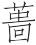”（zī，今作“菑”）之误（依毕沅校说），本指树木植立而死，这里指草枯死。

(5)丛：并，一起。

**【译文】**

第五：

凡是人都有三百六十个骨节，有九窍、五脏、六腑。肌肤应该让它细密，血脉应该让它通畅，筋骨应该让它强壮，心志应该让它平和，精气应该让它运行。这样，病痛就无处滞留，恶疾就无法产生了。病痛的滞留，恶疾的产生，是因为精气闭结。所以，水闭结就会变污浊，树闭结就会生蛀虫，草闭结就会干枯死。国家也有闭结的情形。君主的道德不通达，百姓的愿望不能实现，这就是国家的闭结。国家的闭结长期存在，那么各种邪恶都会一齐产生，所有灾难都会一起到来了。高官与下民互相残害，就由此产生了。所以圣贤的君王尊重豪杰和忠臣，这是因为他们敢于直言劝谏而且能排除闭结阻塞。

周厉王虐民，国人皆谤。召公以告(1)，曰：“民不堪命矣！”王使卫巫监谤者，得则杀之。国莫敢言，道路以目。王喜，以告召公，曰：“吾能弭谤矣(2)！”召公曰：“是障之也，非弭之也。防民之口，甚于防川。川壅而溃，败人必多(3)。夫民犹是也。是故治川者决之使导，治民者宣之使言。是故天子听政，使公卿列士正谏，好学博闻献诗(4)，矇箴(5)，师诵(6)，庶人传语，近臣尽规，亲戚补察，而后王斟酌焉。是以下无遗善，上无过举。今王塞下之口，而遂上之过，恐为社稷忧。”王弗听也。三年，国人流王于彘(7)。此郁之败也。郁者不阳也。周鼎著鼠，令马履之，为其不阳也。不阳者，亡国之俗也。

**【注释】**

(1)召公：指召穆公，名虎，为周厉王卿士。

(2)弭（mǐ）：止，消除。

(3)败：伤害。

(4)诗：指讽谏之诗。古有“采风”之制，好学博闻者采民间诗歌献给君王。

(5)矇（ménɡ）：盲人，指乐官。古代乐官由盲人充当，故称为“矇”。箴（zhēn）：箴言，一种寓有劝诫意义的文辞。这里用作动词。

(6)师：乐官。诵：诵读。

(7)彘：地名，在今山西霍县东北。

**【译文】**

周厉王残害百姓，国人都指责他。召公把这情况告诉了周厉王，说：“百姓们不能忍受您的政令了！”厉王派卫国的巫者监视敢于指责的人，抓到以后就杀掉。都城内没有人敢再讲话，彼此在道上相遇只是用眼看看而已。厉王很高兴，把这种情况告诉了召公，说：“我能消除人们的怨言了！”召公说：“这只是阻止人们的指责，并不是消除人们的怨言啊。堵塞人们的嘴，其危害比堵塞流水还厉害。流水被堵塞，一旦决口，伤人必定很多。人民也是这样。因此，治水的人应该排除阻塞，使水畅流；治理人民的人应该引导人民，让人民尽情讲话。所以，天子处理政事，让公卿列士直言劝谏，让好学博闻之人献上讽谏诗歌，让乐官进箴言，让乐师吟诵讽谏之诗，让平民把意见转达上来，让身边的臣子把规劝的话全讲出来，让同宗的大臣弥补天子的过失、监督天子的政事，然后由天子斟酌去取，加以实行。因此，下边没有遗漏的善言，上边没有错误的举动。如今您堵住下边人的嘴，从而铸成君王的过错，恐怕要成为国家的忧患。”厉王不听他的劝告。过了三年，国人把厉王放逐到彘地。这就是闭结造成的祸害。闭结就是丧失阳气。周鼎上刻铸着鼠形图案，让马踩着它，就是因为它不属于阳。丧失阳气，这是亡国的习俗。

管仲觞桓公。日暮矣，桓公乐之而征烛。管仲曰：“臣卜其昼，未卜其夜。君可以出矣。”公不说，曰：“仲父年老矣，寡人与仲父为乐将几之！请夜之(1)。”管仲曰：“君过矣。夫厚于味者薄于德，沈于乐者反于忧。壮而怠则失时，老而解则无名(2)。臣乃今将为君勉之，若何其沉于酒也！”管仲可谓能立行矣。凡行之堕也于乐，今乐而益饬(3)；行之坏也于贵，今主欲留而不许。伸志行理，贵乐弗为变，以事其主。此桓公之所以霸也。

**【注释】**

(1)夜之：指夜里继续饮酒。

(2)解：懈怠。这个意义后来写作“懈”。

(3)饬：严正。

**【译文】**

管仲宴请齐桓公。天已经黑了，桓公喝得很高兴，让点上烛火接着喝。管仲说：“白天招待您喝酒，我占卜过；至于晚上喝酒，我没有占卜过。您可以走了。”桓公很不高兴，说：“仲父您年老了，我跟您一块享乐还能有多久呢！希望夜里继续喝酒。”管仲说：“您错了。贪图美味的人道德就微薄，沉湎于享乐的人最终要忧伤。壮年懈怠就会失去时机，老年懈怠就会丧失功名。我从现在开始将努力为您做事，怎么可以沉湎在饮酒中呢！”管仲可以说是能树立品行了。凡是行为的堕落在于过分享乐，现在虽然宴乐，态度却越发严正；品行的败坏在于过分尊贵，现在君主想留下，他却不答应。他申明自己的意志，按照原则行事，不因为尊贵和享乐就加以改变，用这种态度来侍奉自己的君主。这就是桓公之所以成就霸业的原因啊。

列精子高听行乎齐湣王(1)，著柬布衣(2)，白缟冠(3)，颡推之履(4)，特会朝而袪步堂下(5)，谓其侍者曰：“我何若？”侍者曰：“公姣且丽。”列精子高因步而窥于井，粲然恶丈夫之状也(6)。喟然叹曰：“侍者为吾听行于齐王也，夫何阿哉！又况于所听行乎(7)？”万乘之主，人之阿之亦甚矣，而无所镜(8)，其残亡无日矣。孰当可而镜？其唯士乎！人皆知说镜之明己也，而恶士之明己也。镜之明己也功细，士之明己也功大。得其细，失其大，不知类耳。

**【注释】**

(1)列精子高：战国时期的贤人。齐湣王：田姓，战国时齐国君主。

(2)柬布：练布，也就是练帛，白色的熟绢。

(3)缟：未染色的绢。

(4)颡推之履：义未详。高诱注为“敝履”，许维遹谓“殆亦指粗恶言”。

(5)特：特意。会朝：指天黎明（依许维遹说）。袪步：撩起衣服走路。

(6)粲然：显明的样子。

(7)所听行：所听所行之人，听从意见加以实行的人。这里指齐王。

(8)镜：用如动词，照。

**【译文】**

齐湣王对列精子高言听计从。一次列精子高穿着熟绢做的衣服，戴着白绢做的帽子，穿着粗劣的鞋子，天刚亮就特意在堂下撩起衣服走来走去，对自己的侍从说：“我的样子怎么样？”侍从说：“您又美好又漂亮。”列精子高于是走到井边去照看，分明是个丑陋男子的形象。他慨叹着说：“侍从因为齐王对我言听计从，就这样曲意迎合我啊！更何况对于听信实行我的主张的齐王呢？”对大国君主来说，人们曲意迎合他，也就更厉害了，可他自己却无法照见自己的缺点，这样，国破身亡也就没有多久了。谁能够帮他照见自己的缺点？大概只有贤士吧！人都知道喜欢镜子能照出自己的形象，却厌恶贤士指明自己的缺点。镜子能照出自己的形象，功用很小；贤士能指明自己的缺点，功绩很大。如果只知得到小的，而丢掉大的，这是不知道类比啊。

赵简子曰：“厥也爱我(1)，铎也不爱我(2)。厥之谏我也，必于无人之所；铎之谏我也，喜质我于人中(3)，必使我丑。”尹铎对曰：“厥也爱君之丑也，而不爱君之过也；铎也爱君之过也，而不爱君之丑也。臣尝闻相人于师(4)，敦颜而土色者忍丑(5)。不质君于人中，恐君之不变也。”此简子之贤也。人主贤则人臣之言刻。简子不贤，铎也卒不居赵地，有况乎在简子之侧哉！

**【注释】**

(1)厥：人名，高诱注为“赵厥”，《说苑》作“赦厥”。赵简子家臣。

(2)铎：尹铎，赵简子家臣。

(3)质：质正。

(4)相人：观察人的相貌以判断贵贱安危等，是一种迷信行为。

(5)敦颜：面色敦厚。土色：黄色。“敦颜土色”都指赵简子之颜色。

**【译文】**

赵简子说：“赵厥爱护我，尹铎不爱护我。赵厥劝谏我的时候，一定在没有人的地方；尹铎劝谏我的时候，喜欢当着别人的面纠正我，一定让我出丑。”尹铎回答说：“赵厥顾惜您的出丑，却不顾惜您的过错；我顾惜您的过错，却不顾惜您的出丑。我曾经从老师那里听到过如何观察人的相貌。相貌敦厚而且是黄色的，能够承受住出丑。我如果不在别人面前纠正您，恐怕您不能改正啊。”这就是简子的贤明之处。君主贤明，那么臣子的谏言就严刻。如果简子不贤明，那么尹铎最终连在赵地存身都不能，更何况呆在简子身边呢？

# 行论

**【题解】**

本篇旨在论述君主处于逆境时应该如何行事。文章认为，君主是“执民之命”的，因此，在“势不便，时不利”的情况下，应该“事雠以求存”，而不应以“快志”为能事。文章进一步认为君主的进与退，要根据义的准则行事。恃强骄恣，只能落得国破身辱的下场。

六曰：

人主之行，与布衣异。势不便，时不利，事雠以求存(1)。执民之命。执民之命，重任也，不得以快志为故。故布衣行此指于国，不容乡曲(2)。

尧以天下让舜。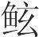为诸侯(3)，怒于尧曰：“得天之道者为帝，得地之道者为三公(4)。今我得地之道，而不以我为三公。”以尧为失论，欲得三公。怒甚猛兽，欲以为乱。比兽之角，能以为城(5)；举其尾，能以为旌(6)。召之不来，仿佯于野以患帝(7)。舜于是殛之于羽山(8)，副之以吴刀(9)。禹不敢怨，而反事之。官为司空(10)，以通水潦。颜色黎黑，步不相过(11)，窍气不通，以中帝心(12)。

昔者纣为无道，杀梅伯而醢之(13)，杀鬼侯而脯之(14)，以礼诸侯于庙。文王流涕而咨之(15)。纣恐其畔，欲杀文王而灭周。文王曰：“父虽无道，子敢不事父乎？君虽不惠，臣敢不事君乎？孰王而可畔也？”纣乃赦之。天下闻之，以文王为畏上而哀下也。《诗》曰(16)：“惟此文王，小心翼翼。昭事上帝，聿怀多福(17)”。

**【注释】**

(1)雠：仇。

(2)乡曲：乡里，乡间。

(3)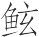（ɡǔn）：也作“鲧”，禹之父。

(4)三公：尧、舜时代未有三公之称，此系传闻。周代三公有二说：一说指司马、司徒、司空；一说指太师、太傅、太保。

(5)能：而。以为城：指像城池一样坚固。

(6)旌：旗上的装饰物，以兽尾制成。此处指旌旗。按：以上几句是以兽之怒喻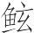之怒。

(7)仿佯（pánɡyánɡ）：通作“彷徉”，游荡无定。

(8)殛（jí）：诛杀。羽山：古地名，在今山东郯城东北（一说在今山东蓬莱东南）。

(9)副（pì）：剖开，即分尸。吴刀：吴地制造的快刀。

(10)司空：官职名，掌营建、治水土等。

(11)步不相过：形容极度疲劳、步履艰难的样子。极其疲劳时走路，一只脚不能超过另一只脚，故曰“步不相过”。

(12)中（zhònɡ）：适合，合。

(13)梅伯：纣时的诸侯。醢（hǎi）：肉酱。这里用如动词，做成肉酱。

(14)鬼侯：纣时的诸侯。脯：肉干。这里用如动词，做成肉干。

(15)咨（zī）：叹息。按：文王当时也是诸侯。

(16)《诗》曰：下引诗句见《诗经·大雅·大明》。

(17)聿：语气词，无实在意义。

**【译文】**

第六：

君主的所作所为，与平民不同。形势不好，时机不利，可以侍奉仇敌以便求得生存。君主掌握着人民的命运。掌握着人民的命运，是重大的责任，不能以随心所欲为能事。平民如果在国内也这样做，那就不能在乡里容身了。

尧把帝位让给了舜。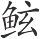当诸侯，他对尧发怒说：“符合天道的当帝王，符合地道的当三公。如今我符合地道，却不让我当三公。”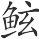认为尧这样做是丧失了原则，想得到三公的职位。他的愤怒超过了猛兽，想发动叛乱。他像猛兽把角并排起来一样固城自守，像猛兽举起尾巴一样立旗为号。舜召见他他不来，在野外游荡，以便给舜制造祸患。舜于是在羽山杀死了他，用锋利的吴刀肢解了他。禹对此不敢怨恨，反而侍奉舜。他担任了司空之职，疏导洪水。晒得面孔黧黑，累得步履艰难，七窍不能畅通，因而很得舜的欢心。

从前纣王暴虐无道，杀死梅伯把他做成肉酱，杀死鬼侯把他做成肉干，在宗庙里用来宴请诸侯。文王流着眼泪为此叹息。纣王担心他背叛自己，想杀死文王灭掉周国。文王说：“父亲即使无道，儿子敢不侍奉父亲吗？君主即使不仁惠，臣子敢不侍奉君主吗？君主怎么可以背叛呢？”纣王于是赦免了他。天下人听到这件事，认为文王畏惧在上位的人而哀怜在下位的人。所以《诗经》中说：“就是这个周文王，言与行小心翼翼。心地光明侍奉上帝，因而得来大福大吉。”

齐攻宋，燕王使张魁将燕兵以从焉(1)，齐王杀之。燕王闻之，泣数行而下，召有司而告之曰：“余兴事而齐杀我使，请令举兵以攻齐也(2)。”使受命矣。凡繇进见(3)，争之曰：“贤主故愿为臣。今王非贤主也，愿辞不为臣。”昭王曰：“是何也？”对曰：“松下乱(4)，先君以不安弃群臣也。王苦痛之，而事齐者，力不足也。今魁死而王攻齐，是视魁而贤于先君。”王曰：“诺。”请王止兵，王曰：“然则若何？”凡繇对曰：“请王缟素辟舍于郊(5)，遣使于齐，客而谢焉(6)，曰：‘此尽寡人之罪也。大王贤主也，岂尽杀诸侯之使者哉？然而燕之使者独死，此弊邑之择人不谨也。愿得变更请罪。’”使者行至齐，齐王方大饮，左右官实御者甚众(7)，因令使者进报。使者报，言燕王之甚恐惧而请罪也。毕，又复之，以矜左右官实。因乃发小使以反令燕王复舍。此济上之所以败，齐国以虚也(8)。七十城，微田单，固几不反(9)。湣王以大齐骄而残，田单以即墨城而立功。诗曰(10)：“将欲毁之，必重累之；将欲踣之(11)，必高举之。”其此之谓乎！累矣而不毁，举矣而不踣，其唯有道者乎！

**【注释】**

(1)张魁：人名。将：率领。

(2)请令：当作“请今”（依毕沅说）。今：即刻。

(3)凡繇：燕昭王臣。

(4)松下乱：即松下之难。齐伐燕，燕王子哙（昭王之父）与之战于松下（地名），被齐俘获。“松下乱”即指此而言。下文“弃群臣”是被俘的委婉说法。

(5)缟素：白色的衣服，指丧服。辟舍：指离开自己的宫室。辟，避开。这个意义后来写作“避”。按：“缟素辟舍”是自责的一种表示。

(6)客：指以客人身分。谢：谢罪，道歉。

(7)官实：官属，僚属。御者：指侍御，侍从。

(8)“此济”二句：燕昭王派乐毅伐齐，大败齐于济水边，下七十余城，齐国因此几乎成为废墟。这两句即指此而言。

(9)“七十”三句：燕昭王死后，子惠王立，惠王与乐毅有隙，派骑劫代乐毅为将。齐田单率即墨（齐邑名，在今山东平度东南）民以火牛阵大败燕军，全部收复了失地。所以这里说“七十城，微田单，固几不反”。

(10)《诗》曰：下引诗句是逸诗。

(11)踣（bó）：仆倒。这里用如使动，使……仆倒。

**【译文】**

齐国攻打宋国，燕王派张魁率领燕国士兵去帮助齐国，齐王却杀死了张魁。燕王听到这消息，眼泪一行行落下来，召来有关官员告诉他说：“我派兵参战，可是齐国却杀死了我的使臣，我要立即发兵攻打齐国。”官员接受了命令。凡繇进来谒见燕王，劝谏说：“从前认为您是贤德的君主，所以我愿意当您的臣子。现在看来您不是贤德的君主，所以我希望辞官不再当您的臣子。”燕昭王说：“这是什么原因呢？”凡繇回答说：“松下之难，我们的先君不得安宁而被俘。您对此感到痛苦，但却侍奉齐国，是因为力量不足啊。如今张魁被杀死，您却要攻打齐国，这是把张魁看得比先君还重。”燕王说：“好吧。”凡繇请燕王停止出兵，燕王说：“然而应该怎么办？”凡繇回答说：“请您穿上丧服离开宫室住到郊外，派遣使臣到齐国，以客人的身份去谢罪，说：‘这都是我的罪过。大王您是贤德的君主，哪能全部杀死诸侯们的使臣呢？然而燕国的使臣独独被杀死，这是我国选择人不慎重啊。希望能够让我改换使臣以表示请罪。’”使臣到了齐国，齐王正在举行盛大宴会，参加宴会的近臣、官员、侍从很多，于是让使臣进来禀告。使臣禀告，说是燕王非常恐惧，因而来请罪。使臣说完了，齐王又让他重复一遍，以此来向近臣、官员、侍从炫耀。于是齐王就派出地位低微的使臣去让燕王返回宫室居住。这就是后来齐国之所以在济水一带被燕国打败的原因，齐国因而几乎变成废墟。七十余座被攻下的城邑，如果没有田单，几乎不能收复。齐湣王凭借着强大的齐国，因为骄横而使国家残破；田单凭借着即墨城，却能立下大功。古诗说：“要想毁坏它，必先把它重叠起；要想摔倒它，必先把它高举起。”大概说的就是这个吧！重叠起来却能不被毁坏，高举起来却能不被摔倒，大概只有有道之人能做到吧！

楚庄王使文无畏于齐(1)，过于宋，不先假道。还反，华元言于宋昭公曰(2)：“往不假道，来不假道，是以宋为野鄙也(3)。楚之会田也(4)，故鞭君之仆于孟诸(5)。请诛之。”乃杀文无畏于扬梁之堤(6)。庄王方削袂(7)，闻之曰：“嘻！”投袂而起。履及诸庭(8)，剑及诸门(9)，车及之蒲疏之市(10)。遂舍于郊。兴师围宋九月。宋人易子而食之，析骨而爨之。宋公肉袒执牺(11)，委服告病(12)，曰：“大国若宥图之，唯命是听。”庄王曰：“情矣宋公之言也(13)！”乃为却四十里，而舍于卢门之阖(14)，所以为成而归也(15)。凡事之本在人主，人主之患，在先事而简人。简人则事穷矣。今人臣死而不当，亲帅士民以讨其故(16)，可谓不简人矣。宋公服以病告而还师，可谓不穷矣。夫舍诸侯于汉阳而饮至者(17)，其以义进退邪！强不足以成此也。

**【注释】**

(1)楚庄王：春秋时期楚国君主，前613年—前591年在位。文无畏：申舟（也作“申周”），名无畏，字舟，申是其食邑，文是其姓氏。楚大夫。

(2)华元：宋大夫。宋昭公：宋国君主，前619年—前611年在位。

(3)“是以”句：这是把宋国当成了它的边远城邑。野鄙：边邑。

(4)会田：会猎。田，打猎。这个意义后来写作“畋”。

(5)鞭：用如动词，用鞭打。孟诸：古泽名，在今河南商丘东北、虞城西北。

(6)扬梁：宋地名，在今河南商丘东南三十里。地近涣水，故有堤防。

(7)削袂（mèi）：义未详。似指将双手揣入衣袖之中，是悠闲时的一种动作。袂，衣袖。

(8)庭：指路寝（正寝，治事之所）前面的空地。

(9)门：指寝门。寝门在庭之外。

(10)蒲疏：街市名。

(11)肉袒：脱去衣服，露出臂膀。这是古人谢罪时表示敬畏的一种方式。牺：供祭祀用的纯色牲。

(12)委服：表示屈服的意思。委，曲。病：困乏，困苦。

(13)情：真诚，诚恳。

(14)卢门：宋城门名。阖：门扇。

(15)成：讲和。

(16)故：通“辜”，罪。（依谭戒甫说）。

(17)“夫舍”句：其义难晓。“舍”疑“合”字之误（毕沅说）。合诸侯于汉阳，当指楚庄王称霸诸侯事。饮至：国君外出回国以后祭告祖庙并宴饮群臣以慰劳从者，这种仪式叫“饮至”。

**【译文】**

楚庄王派文无畏出使齐国，途经宋国，没有事先借道。等他返回的时候，华元对宋昭公说：“他去的时候不借道，回来的时候也不借道，这是把宋国当成楚国的边远城邑了。从前楚王跟您会猎时，在孟诸故意鞭打您的车夫。请您允许杀掉文无畏。”于是就在扬梁的堤防上杀死了文无畏。楚庄王正悠闲地把手揣在衣袖里，听到这消息后说：“哼！”就拂袖而起，来不及穿鞋、佩剑、乘车，奉鞋的侍从追到庭院中才给他穿上鞋，奉剑的侍从追到寝门才给他佩上剑，驾车的驭者追到蒲疏街市上才让他乘上车。接着住在了郊外。发兵围困宋国九个月。宋国人彼此交换孩子杀了吃掉，劈开尸骨来烧火做饭。宋国君主脱去衣服，露出臂膀，牵着纯色牲，表示屈服，述说困苦状况，说：“贵国如果打算赦免我的罪过，我将惟命是从。”庄王说：“宋国君主的话很诚恳啊！”因此就后退了四十里，驻扎在卢门那里，两国媾和以后就返回去了。大凡事情的根本在于君主，君主的弊病，在于看重事而轻视人。轻视人，那么事情就会处于困境。现在臣子死得不应该，楚庄王亲自率领士兵讨伐罪人，可以说是不轻视人了。宋国君主表示屈服述说困苦状况之后，楚庄王就退军了，可以说是不会处于困境了。他在汉水之北盟会诸侯，回国之后用饮至之礼向祖先报功，所以能如此，大概是因为他一进一退都根据义的原则吧！单凭强大是不足以达到这种地步的。

# 骄恣

**【题解】**

本篇旨在劝说君主要防止骄傲恣肆。文章说：“亡国之主，必自骄，必自智，必轻物。”“自骄”就会傲视贤士，“自智”就会独断专行，就会没有准备。“轻物”其结果必然是听闻闭塞，地位危殆，招致祸患。文章认为，要想防止上述灾祸，必须礼贤下士，必须获得民心，必须准备周详，这三方面是君道的核心。文章列举了周厉王、魏武侯、齐宣王、赵简子的事例，说明必须重视、采纳贤士的意见，对待谗人必须予以严厉惩罚，这样就可以避免骄恣的危害了。

七曰：

亡国之主，必自骄，必自智，必轻物。自骄则简士，自智则专独，轻物则无备。无备召祸，专独位危，简士壅塞。欲无壅塞，必礼士；欲位无危，必得众；欲无召祸，必完备。三者，人君之大经也(1)。

晋厉公侈淫(2)，好听谗人，欲尽去其大臣而立其左右。胥童谓厉公曰(3)：“必先杀三郄(4)。族大多怨，去大族不逼(5)。”公曰：“诺。”乃使长鱼矫杀郄犨、郄锜、郄至于朝(6)，而陈其尸。于是厉公游于匠丽氏(7)，栾书、中行偃劫而幽之(8)。诸侯莫之救，百姓莫之哀。三月而杀之。人主之患，患在知能害人，而不知害人之不当而反自及也。是何也？智短也。智短则不知化，不知化者举自危。

**【注释】**

(1)经：道，常道。

(2)晋厉公：春秋时期晋国君主，前580年—前573年在位。

(3)胥童：晋大夫，厉公用为卿，后被栾书、中行偃杀死。

(4)三郄（xì）：即下文所说的郄犨、郄锜、郄至。郄氏是晋国的大族。

(5)不逼：指不逼迫公室，即不威胁公室。

(6)长鱼矫：晋厉公嬖臣。

(7)匠丽氏：《史记·晋世家》作“匠骊氏”，裴骃《集解》引贾逵曰：“匠骊氏，晋外嬖大夫在翼者。”（翼，晋旧都，在今山西翼城东南。）

(8)栾书：即栾武子，晋大夫。中行偃：即荀偃，字伯游。幽：囚禁。

**【译文】**

亡国的君主，必然骄傲自满，必然自以为聪明，必然轻视外物。骄傲自满就会傲视贤士，自以为聪明就会独断专行，看轻外物就会没有准备。没有准备就会招致祸患，独断专行君位就会危险，傲视贤士听闻就会闭塞。要想不闭塞，必须礼贤下士；要想君位不危险，必须得到众人辅佐；要想不招致祸患，必须准备齐全。这三条，是君主治理国家的最大原则。

晋厉公奢侈放纵，喜欢听信谗人之言，他想把他的大臣们都除掉，提拔他身边的人为官。胥童对厉公说：“一定要先杀掉三个姓郄的。他们家族大，对公室有很多怨恨，除掉大家族，就不会威逼公室了。”厉公说：“好吧。”于是就派长鱼矫在朝廷上杀死了郄犨、郄锜、郄至，陈列他们的尸体示众。接着厉公到匠丽氏那里游乐，栾书、中行偃劫持并囚禁了他。诸侯没有人援救他，百姓没有人哀怜他。过了三个月，就把他杀死了。君主的弊病，在于只知道自己能危害别人，却不知道如果所害的人是不该害的，反而会自己遭殃。这是为什么呢？这是因为智谋短浅啊。智谋短浅就不知道事物的变化，不知道事物变化的人，一举一动都会危害自己。

魏武侯谋事而当，攘臂疾言于庭曰(1)：“大夫之虑，莫如寡人矣！”立有间，再三言。李悝趋进曰(2)：“昔者楚庄王谋事而当，有大功，退朝而有忧色。左右曰：‘王有大功，退朝而有忧色，敢问其说？’王曰：‘仲虺有言(3)，不穀说之(4)。曰：“诸侯之德，能自为取师者王，能自取友者存，其所择而莫如己者亡。”今以不穀之不肖也，群臣之谋又莫吾及也，我其亡乎！’”曰(5)：“此霸王之所忧也，而君独伐之(6)，其可乎！”武侯曰：“善。”人主之患也，不在于自少，而在于自多。自多则辞受(7)，辞受则原竭(8)。李悝可谓能谏其君矣，壹称而令武侯益知君人之道。

**【注释】**

(1)攘臂：捋袖伸臂，振奋的样子。疾言：大声说话。

(2)李悝（kuī）：战国时期法家代表人物，曾为魏文侯相。

(3)仲虺（huī）：相传为汤的左相，奚仲的后代。

(4)不穀：诸侯的谦称。说：喜欢。这个意义后来写作“悦”。

(5)“曰”以下数句：“曰”下的话仍是李悝所说。前面是转述别人的话，下面是直接对武侯所说的话，故这里用一“曰”字作转。

(6)伐：自夸，夸耀。

(7)辞受：对该接受的意见加以推辞。辞，推辞。

(8)原竭：源泉枯竭，这里指进言之路堵塞。原，水源。

**【译文】**

魏武侯谋划事情总是很得当，有一次他在朝廷中捋袖伸臂大声说：“大夫们的谋虑，没有人赶得上我了！”只站了一会儿，这句话就说了好几遍。李悝快步走上前说：“从前楚庄王谋划事情很得当，成就了很大功业，退朝以后却面有忧色。身边的人说：‘大王您成就了很大功业，退朝以后却面有忧色，请问这是什么原因？’庄王说：‘仲虺有话，我很喜欢。他说：“诸侯的品德，能为自己选取老师的，就会称王天下；能为自己选取朋友的，就会保存自身；所选取的人不如自己的，就会遭到灭亡。”如今像我这样不贤德，臣子们的谋划，又都赶不上我，我大概要灭亡了吧！’”李悝接着又说道：“这就是成就霸王之业的人所忧虑的，可是您却偏偏自夸，那怎么可以呢！”武侯说：“你说得好。”君主的弊病，不在于自己看轻自己，而在于自己看重自己。自己看重自己，该接受的意见就会加以拒绝。该接受的意见加以拒绝，进谏之路就堵塞了。李悝可以说是善于劝谏自己的君主了，他一劝谏，就让武侯更加懂得了当君主的原则。

齐宣王为大室(1)，大益百亩，堂上三百户(2)。以齐之大，具之三年而未能成(3)。群臣莫敢谏王。春居问于宣王曰(4)：“荆王释先王之礼乐，而乐为轻(5)，敢问荆国为有主乎？”王曰：“为无主。”“贤臣以千数而莫敢谏，敢问荆国为有臣乎？”王曰：“为无臣。”“今王为大室，其大益百亩，堂上三百户。以齐国之大，具之三年而弗能成。群臣莫敢谏，敢问王为有臣乎？”王曰：“为无臣。”春居曰：“臣请辟矣！”趋而出。王曰：“春子！春子！反！何谏寡人之晚也？寡人请今止之。”遽召掌书曰(6)：“书之！寡人不肖，而好为大室。春子止寡人。”箴谏不可不熟。莫敢谏若(7)，非弗欲也。春居之所以欲之与人同，其所以入之与人异(8)。宣王微春居，几为天下笑矣。由是论之，失国之主，多如宣王，然患在乎无春居。故忠臣之谏者，亦从入之，不可不慎。此得失之本也。

**【注释】**

(1)齐宣王：战国时期齐国君主，前319年—前301年在位。

(2)户：门。

(3)具：备办，修建。

(4)春居：齐宣王臣。

(5)为轻：为之轻，因此而轻浮。

(6)遽：立刻。掌书：主管书写记事的人。

(7)若：当作“者”字之误（依王念孙、俞樾说）。

(8)所以入之：指用来劝阻的方法。

**【译文】**

齐宣王修建大宫室，规模之大超过了一百亩，堂上设置三百座门。凭着齐国这样的大国，修建了三年还没有能修建成。臣子们没有人敢劝阻齐王。春居问宣王说：“楚王抛弃了先王的礼乐，音乐因此变得轻浮了，请问楚国算是有贤明君主吗？”宣王说：“没有贤明君主。”春居说：“所谓的贤臣数以千计，却没有人敢劝谏，请问楚国算有贤臣吗？”宣王说：“没有贤臣。”春居说：“如今您修建大宫室，宫室之大超过了一百亩，堂上设置三百座门。凭着齐国这样的大国，修建了三年仍不能够修建成。臣子们没有人敢劝阻，请问您算是有贤臣吗？”宣王说：“没有贤臣。”春居说：“请您允许我离开吧！”说完就快步走出去。宣王说：“春子！春子！回来！为什么这么晚才劝阻我呢？我现在就停止修建大宫室。”赶紧召来记事的官员说“写上：！我不贤德，喜欢修建大宫室。春子阻止了我。”对于劝谏，不可不认真考虑。不敢劝谏的人，并不是不想劝谏。春居想要做的跟别人相同，而他采用的劝谏方法跟别人不一样。宣王如果没有春居，几乎要被天下人耻笑了。由此说来，亡国的君主，大都像宣王一样，然而他们的祸患在于没有春居那样的臣子。所以那些敢于劝谏的忠臣，也应顺势加以劝谏，这是不可不慎重对待的。这是成败的根本啊。

赵简子沈鸾徼于河(1)，曰：“吾尝好声色矣，而鸾徼致之；吾尝好宫室台榭矣，而鸾徼为之；吾尝好良马善御矣，而鸾徼来之。今吾好士六年矣，而鸾徼未尝进一人也。是长吾过而绌善也(2)。”故若简子者，能厚以理督责于其臣矣。以理督责于其臣，则人主可与为善，而不可与为非；可与为直，而不可与为枉。此三代之盛教。

**【注释】**

(1)鸾徼：赵简子臣。

(2)绌（chù）善：当作“绌吾善”（依陶鸿庆、孙人和说）。绌，减损。

**【译文】**

赵简子把鸾徼沉没到黄河里，说：“我曾经爱好音乐女色，鸾徼就给我弄来；我曾经爱好宫室台榭，鸾徼就给我修建；我曾经爱好良马好驭手，鸾徼就给我找来。如今我爱好贤士六年了，可鸾徼不曾举荐过一个人。这是助长我的过错、磨灭我的长处啊。”所以像简子这样的人，是能严格地依照原则审察责求自己的臣子了。依照原则审察责求自己的臣子，那么人主就可以跟他一起为善，而不可以跟他一起为非；可以跟他一起做正直的事，而不可以跟他一起做邪曲的事。这是夏商周三代的美好教化。

# 观表

**【题解】**

本篇旨在论述君主应该善于通过观察人和事物的征兆表象了解它们的实质。文章指出：“凡论人心，观事传，不可不熟，不可不深。”就是说，观察人和事物必须深刻细致。文章以相马为例，指出“人亦有征，事与国皆有征”，主张通过其征兆表象而加以观察。文章认为，圣人之所以先知先觉，就在于他们善于透过表象洞察实质。

文中所举吴起去西河之例与《长见》篇文字基本相同，可参看。

八曰：

凡论人心，观事传(1)，不可不熟，不可不深。天为高矣，而日月星辰云气雨露未尝休也；地为大矣，而水泉草木毛羽裸鳞未尝息也(2)。凡居于天地之间、六合之内者(3)，其务为相安利也，夫为相害危者，不可胜数。人事皆然。事随心，心随欲。欲无度者，其心无度。心无度者，则其所为不可知矣。人之心隐匿难见，渊深难测。故圣人于事志焉(4)。圣人之所以过人以先知，先知必审征表(5)。无征表而欲先知，尧、舜与众人同等。征虽易，表虽难，圣人则不可以飘矣(6)。众人则无道至焉。无道至则以为神，以为幸。非神非幸，其数不得不然。郈成子、吴起近之矣(7)。

**【注释】**

(1)事传：事迹，事情。

(2)毛：指虎狼之类有毛皮的动物。羽：指飞禽。裸：指麋鹿牛羊之类裸蹄动物。鳞：指龙鱼之类。以上两句意思是说，天地之间的事物都有可以察见的征兆。

(3)六合：天、地、四方谓之“六合”。

(4)志焉：观其志。志，用如动词。

(5)征：这里指与内心相一致的征兆（依高诱说）。表：这里指与内心不同的虚假的表象（依高诱说）。

(6)飘：迅疾。

(7)郈成子：鲁国大夫。

**【译文】**

第八：

凡是衡量人心，观察事物，不可不精审，不可不深入。天算是很高了，而日月星辰云气雨露却不曾休止过；地算是很大了，而水泉草木飞禽走兽却不曾灭绝过。凡是处于天地之间四方之内的，本来都应该尽力做到互安互利，可是它们之间互相危害的，却数不胜数。人和事情也都是如此。事情取决于人心，人心取决于欲望。欲望没有限度的，人心也没有限度。人心没有限度的，他的所作所为就不可以被了解了。人的心思隐藏着，难以窥见，就像深渊难以测量一样。所以圣人考察事情必先观察行事之人的志向。圣人之所以超过一般人，是因为能先知先觉，要先知先觉必须审察征兆和表象。没有征兆表象却想先知先觉，就是尧、舜也和一般人一样不能做到。虽然真相易于观察，假相难于考查，圣人不论对哪种情况都不可以匆忙下结论。一般人不能审察征兆和表象，所以就无法达到先知先觉了。无法达到先知先觉，就认为先知者是靠神力，是靠侥幸。其实先知并不是靠神力，并不是靠侥幸，而是圣人根据征兆表象看到事理不得不如此。郈成子、吴起就接近于先知先觉了。

郈成子为鲁聘于晋(1)，过卫，右宰谷臣止而觞之(2)。陈乐而不乐(3)，酒酣而送之以璧。顾反，过而弗辞。其仆曰：“向者右宰谷臣之觞吾子也甚欢，今侯渫过而弗辞(4)？”郈成子曰：“夫止而觞我，与我欢也。陈乐而不乐，告我忧也。酒酣而送我以璧，寄之我也。若由是观之，卫其有乱乎！”倍卫三十里(5)，闻宁喜之难作(6)，右宰谷臣死之，还车而临(7)，三举而归(8)。至，使人迎其妻子，隔宅而异之(9)，分禄而食之。其子长而反其璧。孔子闻之，曰：“夫智可以微谋、仁可以托财者，其郈成子之谓乎！”郈成子之观右宰谷臣也，深矣妙矣。不观其事而观其志，可谓能观人矣。

**【注释】**

(1)聘：出使，国与国之间派使臣通问修好。

(2)右宰谷臣：卫大夫。右宰本是官名，此以官为姓。

(3)陈乐而不乐：前“乐”（yuè），指乐器。后“乐”（lè），是快乐的意思。

(4)侯：何。渫（xiè）过：重过（依高诱说）。

(5)倍：通“背”，相背，离开。

(6)宁喜：即宁悼子，卫大夫宁惠子之子。卫献公被逐，他杀死卫侯剽而纳献公。这里的“宁喜之难”即指杀卫侯剽而言（参高诱注）。

(7)临（lìn）：哭悼死者。

(8)三举：举哀三次，即哭了三次。

(9)异之：使之异，让他们与自己分开住。异，分开，这里用如使动。

**【译文】**

郈成子为鲁国聘问晋国，路过卫国，卫国的右宰谷臣留下并宴请他。右宰谷臣陈列乐器奏乐，乐曲却不欢快；喝酒喝到正畅快之际，把璧玉送给了郈成子。郈成子从晋国回来，经过卫国，却不向右宰谷臣告别。他的车夫说：“先前右宰谷臣宴请您，感情很欢洽，如今为什么再经过这里却不向他告别？”郈成子说：“他留下我并宴请我，是要跟我欢乐一番。可陈列乐器奏乐，乐曲却不欢快，这是向我表示他的忧愁啊。喝酒喝得正畅快之际，他把璧玉送给了我，这是把璧玉托付给我啊。如果从这些迹象来看，卫国大概有祸乱吧！”郈成子离开卫国三十里，听到宁喜作乱杀死卫君，右宰谷臣为卫君殉难，就掉转车子回去哭悼谷臣，哭了三次然后才回国。到了鲁国，派人去接右宰谷臣的妻子孩子，把住宅隔开让他们与自己分开居住，分出自己的俸禄来养活他们。右宰谷臣的孩子长大了，郈成子把璧玉还给了他。孔子听到这件事，说：“论智慧可以通过隐微的方式跟他进行谋划，论仁德可以托付给他财物的，大概就是郈成子吧！”郈成子观察右宰谷臣，真是深入精妙了。不观察他做的事情，而观察他的思想，可以说是能观察人了。

吴起治西河之外(1)，王错谮之于魏武侯(2)，武侯使人召之。吴起至于岸门(3)，止车而休，望西河，泣数行而下。其仆谓之曰：“窃观公之志，视舍天下若舍屣。今去西河而泣，何也？”吴起雪泣而应之曰(4)：“子弗识也。君诚知我，而使我毕能，秦必可亡，而西河可以王。今君听谗人之议，而不知我，西河之为秦也不久矣，魏国从此削矣。”吴起果去魏入荆，而西河毕入秦。魏日以削，秦日益大。此吴起之所以先见而泣也。

**【注释】**

(1)西河：魏地名，吴起曾为西河守，辖今陕西东部黄河西岸地区。

(2)谮（zèn）：诬陷。

(3)岸门：地名，在今山西河津南。

(4)雪：擦拭。

**【译文】**

吴起治理西河，王错向魏武侯诬陷他，武侯派人召他回来。吴起到了岸门，停下车子休息，望着西河，眼泪一行行流了下来。他的车夫对他说：“我私下观察您的志向，您把抛弃天下看得像抛弃鞋子一样。如今离开西河却哭泣，这是为什么呢？”吴起擦掉眼泪回答他说：“你不知道啊。国君如果真的了解我，让我把自己的才能都发挥出来，秦国一定可以灭掉，凭着西河就可以成就王业。现在国君听信谗人之言，不了解我，西河成为秦国的土地用不了多久了，魏国从此就要削弱了。”结果吴起离开魏国到了楚国，西河全部归入秦国。魏国一天天削弱，秦国一天比一天强大。这就是吴起事先预见到这种情况因而哭泣的原因啊。

古之善相马者，寒风是相口齿(1)，麻朝相颊，子女厉相目，卫忌相髭，许鄙相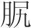(2)，投伐褐相胸胁，管青相肳(3)，陈悲相股脚(4)，秦牙相前，赞君相后。凡此十人者，皆天下之良工也。其所以相者不同，见马之一征也，而知节之高卑，足之滑易(5)，材之坚脆，能之长短。非独相马然也，人亦有征，事与国皆有征。圣人上知千岁，下知千岁，非意之也(6)，盖有自云也(7)。绿图幡薄(8)，从此生矣。

**【注释】**

(1)寒风是：即“韩风氏”，与下文的“麻朝”、“子女厉”、“卫忌”、“许鄙”、“投伐褐”、“管青”、“陈悲”、“秦牙”、“赞君”都是古代善相马者。

(2)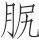（kāo）：臀部。

(3)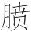：当作“唇”字之误。肳：同“吻”。

(4)股：大腿。脚：小腿。

(5)滑易：义未详。据文意，疑指快慢。

(6)意：猜想，测度。

(7)有自：有原因。云：语气词。

(8)绿图幡薄：说法不一，难以详考。按：绿图，似指“河图”。据古代传说，江河所出图皆为绿色，故别称“绿图”。幡薄，当即簿册。“幡”与“薄”义同，“薄”通“簿”。河出绿图幡薄，古人以为帝王圣者受命之瑞。

**【译文】**

古代善于相马的人，寒风是观察品评马的口齿，麻朝观察品评马的面颊，子女厉观察品评马的眼睛，卫忌观察品评马的须髭，许鄙观察品评马的臀部，投伐褐观察品评马的胸肋，管青观察品评马的嘴唇，陈悲观察品评马腿，秦牙观察品评马的前部，赞君观察品评马的后部。所有这十个人，都是天下的相马良工。他们用来相马的方法不同，但他们看到马的一处征象，就能知道马骨节的高低，腿脚的快慢，体质的强弱，才能的高下。不仅相马是这样，人也有征兆，事情和国家都有征兆。圣人往上知道千年以前的事，往下知道千年以后的事，并不是靠猜想，而是有根据的。绿图幡薄这些吉祥征兆，就从此产生了。

