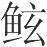
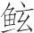
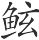
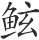
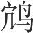
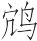
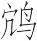
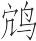
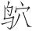
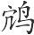

 开春论第一

# 开春

**【题解】**

本书多处论及“善说”，《开春论》即专门讨论这一问题。作者认为，论说成功的关键在于“言尽理”。从文中谈到的具体内容看，所谓“理”，主要是指节用爱人、明德慎罚等“礼义仁德”方面的道理。文章列举的惠施、封人子高、祁奚三个“善说者”的例子，都是为了论证“言尽理而得失利害定矣”这一论断。文章开头讲“物之相应”，意在说明论说能获得成功的理论根据。把“善说”同“物之相应”联系到一起，显得非常勉强。文章撮取首句“开春始雷”的前二字作为篇名，也与本书其他篇章以义名篇的体例不同。

一曰：

开春始雷(1)，则蛰虫动矣。时雨降，则草木育矣。饮食居处适，则九窍百节千脉皆通利矣。王者厚其德，积众善，而凤皇圣人皆来至矣。共伯和修其行(2)，好贤仁，而海内皆以来为稽矣(3)。周厉之难(4)，天子旷绝(5)，而天下皆来谓矣(6)。以此言物之相应也，故曰行也成也(7)。善说者亦然。言尽理而得失利害定矣，岂为一人言哉！

**【注释】**

(1)开春：当指夏历二月。《仲春》：“日夜分，雷乃发生，始电，蛰虫咸动苏。”

(2)共（ɡōnɡ）伯和：西周诸侯。共，国名。伯，爵位名。和，人名。公元前841—前828年，共伯和代周天子行政，史称“共和时期”。

(3)稽：停留，这里有归附的意思。“以、为”二字疑为衍文。

(4)周厉之难（nàn）：指周厉王末年的国内动乱。周厉，指周厉王，西周第十代国君，名胡，由于暴虐无道，被国人驱逐，逃亡在外十四年而死。

(5)旷：废缺。

(6)谓：当作“请”。请，请谒。

(7)成：成就，这里有结果的意思。

**【译文】**

第一：

开春一开始打雷，蛰伏的动物就苏醒活动了。应时之雨降落下来，草木就滋生了。饮食居处适度，身体的各种器官和骨节经脉就都通畅了。治理天下的人增加自己的美德，积累各种善行，凤凰和圣人就都到他身边来了。共伯和修养他的品行，喜好贤士仁人，海内就都因此来归附了。厉王之乱，王位废缺，天下诸侯就都来朝见共伯和了。这些事情说明事物是互相应和的，所以任何行为都有其相应的结果。善于说服别人的人也是这样。把道理说透，事情的得失利害就确定了，他们的议论哪里是为了某一个人随意而发呢！

魏惠王死，葬有日矣。天大雨雪，至于牛目。群臣多谏于太子者，曰：“雪甚如此而行葬，民必甚疾之，官费又恐不给(1)，请弛期更日(2)。”太子曰：“为人子者，以民劳与官费用之故，而不行先王之葬，不义也。子勿复言。”群臣皆莫敢谏，而以告犀首(3)。犀首曰：“吾未有以言之。是其唯惠公乎(4)！请告惠公。”惠公曰：“诺。”驾而见太子曰：“葬有日矣？”太子曰：“然。”惠公曰：“昔王季历葬于涡山之尾(5)，灓水啮其墓(6)，见棺之前和(7)。文王曰：‘嘻！先君必欲一见群臣百姓也天(8)！故使灓水见之。’于是出而为之张朝(9)，百姓皆见之，三日而后更葬。此文王之义也。今葬有日矣，而雪甚，及牛目，难以行。太子为及日之故，得无嫌于欲亟葬乎(10)？愿太子易日。先王必欲少留而抚社稷安黔首也(11)，故使雨雪甚。因弛期而更为日，此文王之义也。若此而不为，意者羞法文王也(12)？”太子曰：“甚善。敬弛期，更择葬日。”惠子不徒行说也，又令魏太子未葬其先君而因有说文王之义(13)。说文王之义以示天下，岂小功也哉！

**【注释】**

(1)给（jǐ）：充足。

(2)弛：延缓。

(3)犀首：即公孙衍，战国时魏人，纵横家，曾在魏、秦等国为相。

(4)惠公：指惠施。

(5)王季历：周文王之父，名季历，武王灭商后追尊为“王季”。涡山：山名。《战国策·魏策》作“楚山”。尾：指山脚。

(6)灓（luán）水：渗入地下而形成的水流。啮（niè）：咬，这里指浸渍。

(7)见（xiàn）：显现，露出。和：棺材两头的木板。

(8)天：当为“夫”字之误。夫，句尾语气词。

(9)张朝：设置帷幕，让群臣百姓朝见。

(10)得无：莫不是，恐怕。亟（jí）：急。

(11)少：稍。

(12)意者：表示推测和估计，想来。

(13)有：通“又”。说（yuè）：喜欢。

**【译文】**

魏惠王死了，安葬的日期已经临近。正遇上天下大雪，雪深得几乎埋住牛的眼睛。群臣多劝谏太子，说：“雪下得这样大还要举行葬礼，百姓们一定非常困苦，国家的费用也恐怕不够。请您把日期推迟，改日安葬。”太子说：“做子女的，如果因为百姓劳苦和国家费用不足的缘故就不举行先王的葬礼，是不义的。你们不要再说了。”臣子们都不敢再劝谏，就把这件事告诉了犀首。犀首说：“我也没有办法去劝说，能做这件事的恐怕只有惠公吧！请让我告诉惠公。”惠公听了说：“好吧。”就坐着车来见太子，说：“安葬的日期临近了吧？”太子说：“是的。”惠公说：“从前王季历葬在涡山脚下，渗漏下来的水流浸坍了他的坟墓，露出了棺木的前脸。周文王说：‘啊，先王一定是想看一看臣下和百姓吧！所以才让漏水浸渍使棺木显露出来。’于是就把棺木挖出，给它设置帷幕，举行朝会，百姓都来谒见，三天以后才改葬。这是文王的义呀！现在安葬的日期已经临近，但雪大得几乎埋住牛的眼睛，路难以行走，太子您为了赶上既定日期而坚持按期安葬，恐怕有想快点安葬了事之嫌吧？希望您改个日子。先王一定是想稍作停留以便安抚国家和百姓，所以才使雪下得这样大。因此推迟葬期另择日子，这样做正是文王的义啊！像目前这种情况还不改日安葬，想来是羞于效法文王了？”太子说：“您说得太好了！我谨奉命延缓葬期，另选安葬的日子。”惠子不仅使自己的主张得以实行，又使魏太子由暂时不安葬先君又进而喜好文王之义。喜好文王之义，并以此宣示天下，难道是小功劳吗！

韩氏城新城(1)，期十五日而成。段乔为司空(2)，有一县后二日，段乔执其吏而囚之(3)。囚者之子走告封人子高曰(4)：“唯先生能活臣父之死，愿委之先生。”封人子高曰：“诺。”乃见段乔。自扶而上城(5)。封人子高左右望曰：“美哉城乎！一大功矣，子必有厚赏矣！自古及今，功若此其大也，而能无有罪戮者，未尝有也。”封人子高出，段乔使人夜解其吏之束缚也而出之。故曰封人子高为之言也，而匿己之为而为也；段乔听而行之也，匿己之行而行也。说之行若此其精也，封人子高可谓善说矣。

**【注释】**

(1)城新城：城，修筑城墙。新城，地名。即阳翟（dí），因为是韩国的新都，所以称“新城”，故址在今河南禹县。

(2)段乔：战国时韩国大臣。司空：官名，掌土木工程等。

(3)吏：指县的官长。

(4)封人：管理疆界的官。子高：当时的贤者。

(5)扶：攀缘。

**【译文】**

韩国修筑新城的城墙，规定十五天完成。段乔做司空，主管这件事。有一个县拖延了两天，段乔就逮捕了这个县的主管官吏，把他囚禁起来。这个官吏的儿子跑来告诉封人子高，说：“只有先生您才能把我父亲从死罪中拯救出来，我想把这件事托付给先生。”封人子高说：“好吧。”就去拜见段乔。子高自己攀登上城墙，向左右张望说：“这城墙修得真漂亮呀！真算得上一件大功了！您一定能得到重赏了。从古到今，功劳这样大，而又能不处罚杀戮一个人的，还没有过。”封人子高离开以后，段乔就派人在夜里解开被囚禁的官吏的绳索，释放了他。所以可以说，封人子高说服别人，说了又不让人看出是在说服他；段乔听从别人的意见并加以实行，做了又不让人看出是自己做的。说服别人的做法如此精妙，封人子高可算是善于说服别人了。

叔向之弟羊舌虎善栾盈(1)。栾盈有罪于晋，晋诛羊舌虎，叔向为之奴而朡(2)。祁奚曰：“吾闻小人得位，不争不祥(3)；君子在忧，不救不祥。”乃往见范宣子而说也(4)，曰：“闻善为国者，赏不过而刑不慢(5)。赏过则惧及淫人，刑慢则惧及君子。与其不幸而过，宁过而赏淫人，毋过而刑君子。故尧之刑也殛(6)，于虞而用禹(7)；周之刑也戮管、蔡，而相周公，不慢刑也。”宣子乃命吏出叔向。救人之患者，行危苦，不避烦辱，犹不能免；今祁奚论先王之德，而叔向得免焉。学岂可以已哉！类多若此(8)。

**【注释】**

(1)叔向：春秋晋大夫，姓羊舌，名肸（xī），字叔向，以贤能著称。羊舌虎：叔向异母弟，晋大夫。栾盈：晋大夫。

(2)朡（zōnɡ）：系缚。

(3)争（zhènɡ）：谏诤。

(4)范宣子：即范匄（ɡài），又名士匄，晋平公时为正卿，谥宣子。

(5)慢：懈怠，轻忽。

(6)殛（jí）：杀。（ɡǔn）：人名。大禹之父，为人刚愎凶顽，为尧时“四凶”之一，受命治水，九年不成，被诛于羽山。

(7)虞：指舜。舜为有虞氏，所以称虞舜，又简称为虞。

(8)类：事类。

**【译文】**

叔向的弟弟羊舌虎与栾盈友善，栾盈在晋国犯了罪，晋国杀了羊舌虎，叔向为此受牵连没入官府为奴，戴上了刑具。祁奚说：“我听说当小人得到官位时，不谏诤是不善；当君子处于忧患时，不援救是不善。”于是就去拜见范宣子，劝他说：“我听说善于治国的人，行赏不过度，施刑不轻忽。行赏过度，恐怕会赏到奸人；施刑轻忽，恐怕会处罚到君子。如果不得已做得过分了，那么宁可行赏过度赏赐了奸人，也不要施刑过度处罚了君子。所以尧施刑罚杀死了，而在舜的时候却仍起用了的儿子禹；周施刑罚诛杀了管叔、蔡叔，而仍任用他们的弟兄周公为相。这都是施刑不轻忽啊！”于是范宣子命令官吏把叔向放了出来。解救别人危难的人，冒着危险和困苦，不怕麻烦和屈辱，有时仍然不能使人免于患难；如今祁奚论说先王的德政，叔向却因而得以免遭危难。由此看来，学习怎么能废止呢！很多事情都像这种情形一样。

# 察贤

**【题解】**

本篇强调君主立功名关键在于得贤，得贤方可以垂拱而治。文中比较了宓子贱任人而治与巫马期任力而治的优劣，认为任力而治“中治犹未至”，实不可取。

二曰：

今有良医于此，治十人而起九人(1)，所以求之万也(2)。故贤者之致功名也，比乎良医，而君人者不知疾求，岂不过哉！今夫塞者(3)，勇力、时日、卜筮、祷祠无事焉，善者必胜。立功名亦然，要在得贤(4)。魏文侯师卜子夏，友田子方，礼段干木，国治身逸。天下之贤主，岂必苦形愁虑哉(5)！执其要而已矣。雪霜雨露时，则万物育矣，人民修矣(6)，疾病妖厉去矣(7)。故曰尧之容若委衣裘(8)，以言少事也。

**【注释】**

(1)起：使……起，治愈。

(2)所以求之万也：这是找他治病的人成千上万的原因。

(3)塞：古代一种棋类游戏，又名“格五”。字又作“簺”。

(4)要：要领，关键。

(5)愁：通“揫（jiū）”，聚。

(6)修：善，好。

(7)厉：灾害，祸害。

(8)委衣裘：义同“垂衣裳”，喻无为而治。委，下垂。

**【译文】**

第二：

假如有这样一个良医，给十个人治病治好了九个，找他治病的人必定会成千上万。所以，贤人能为君主求致功名，就好比良医能给人治好病一样，可是当君主的却不知赶快去寻找，这难道不是错了吗！如今下棋的人，用不着凭借勇力、时机、占卜、祭祷，技巧高的一定获胜。建立功名也是如此，关键在于得到贤人。魏文侯以卜子夏为师，与田子方交友，礼敬段干木，就使得国家太平，自身安逸。天下贤明的君主哪里必定要劳身费神呢？掌握治国要领就行了。霜雪雨露合乎时节，万物就会生长了，人们就会舒适了，疾病和怪异灾祸就不会发生了。所以人们说到尧的仪表形容，就说他穿着宽大下垂的衣服，这是说他很少有政务啊！

宓子贱治单父(1)，弹鸣琴，身不下堂，而单父治。巫马期以星出(2)，以星入，日夜不居(3)，以身亲之，而单父亦治。巫马期问其故于宓子。宓子曰“：我之谓任人，子之谓任力；任力者故劳，任人者故逸。”宓子则君子矣。逸四肢，全耳目，平心气，而百官以治，义矣(4)，任其数而已矣(5)。巫马期则不然，弊生事精(6)，劳手足，烦教诏，虽治犹未至也。

**【注释】**

(1)宓（fú）子贱：春秋末期鲁国人，名不齐，字子贱，孔子弟子。单父（shànfǔ）：春秋时鲁邑，在今山东单县南。

(2)巫马期：姓巫马，名施，字子期，孔子弟子。他书或作“巫马旗”。

(3)居：止息，休息。

(4)义：宜，合宜，应该。

(5)数：术，方法。

(6)弊：毁坏，损害。事：用，耗费。精：指人的精气。

**【译文】**

宓子贱治理单父，每天在堂上静坐弹琴，单父就治理得很好。巫马期披星戴月，早朝晚退，昼夜不休息，亲自处理各种政务，单父也治理得很好。巫马期向宓子询问其中的缘故。宓子说：“我的做法叫做使用人才，你的做法叫做使用力气。使用力气的人当然劳苦，使用人才的人当然安逸。”宓子算得上君子了。使四肢安逸，耳目保全，心气平和，而官府的各种事务处理得很好，这是应该的了，他只不过使用正确的方法罢了。巫马期却不是这样。他损伤生命，耗费精气，手足疲劳，教令烦琐，尽管也治理得不错，但还未达到最高境界。

# 期贤

**【题解】**

本篇与上篇《察贤》主题相同。所谓“期贤”，就是期待贤者。文章先以明火照蝉为喻，指出君主只要德行明盛，贤士就会像蝉投奔明火那样来归附。接着，文章举卫有十士而赵简子不敢伐、魏礼段干木而秦不加兵两个事例，说明贤士对安定国家、树立功名的重要作用。其中段干木偃息藩魏一事尤其受到后世推崇，成为不少文人吟咏的题材。

三曰：

今夫爚蝉者(1)，务在乎明其火、振其树而已。火不明，虽振其树，何益？明火不独在乎火，在于暗。当今之时，世暗甚矣，人主有能明其德者，天下之士，其归之也，若蝉之走明火也。凡国不徒安(2)，名不徒显，必得贤士。

**【注释】**

(1)爚（yuè）：用火照。

(2)徒：白白地，无缘无故地。

**【译文】**

第三：

如今用火照蝉的人，务必把火光弄亮、并摇动树的枝干罢了。火光不明，即使摇动那些树木，又有什么用处？弄亮火光，不仅在于火光本身，还在于黑暗的映衬。现在这个时候，社会黑暗到极点了，国君中如有能昭明自己德行的，天下的士人归附他，就像蝉奔向明亮的火光那样。凡国家不会无缘无故地安定，名声不会无缘无故地显赫，一定要得到贤士才行。

赵简子昼居(1)，喟然太息曰：“异哉！吾欲伐卫十年矣，而卫不伐(2)。”侍者曰：“以赵之大而伐卫之细(3)，君若不欲则可也；君若欲之，请令伐之(4)。”简子曰：“不如而言也(5)。卫有士十人于吾所，吾乃且伐之，十人者其言不义也，而我伐之，是我为不义也。”故简子之时，卫以十人者按赵之兵，殁简子之身(6)。卫可谓知用人矣，游十士而国家得安。简子可谓好从谏矣，听十士而无侵小夺弱之名。

**【注释】**

(1)居：闲坐。

(2)伐：被伐

(3)细：小。

(4)令：当为“今”字之误。今，立即。

(5)而：人称代词，你。

(6)殁：终。

**【译文】**

赵简子白天闲坐，慨然长叹，说：“真是不寻常啊！我想伐卫已经有十年了，可是卫国总是伐不成。”侍从的人说：“凭赵国这样的大国来伐卫国那样的小国，您要是不想伐它也就罢了；您要是想这样做，只管立即动手就是了。”赵简子说：“事情不像你说的那样啊！卫国有十位士人在我这里。我确实想伐卫，可是这十个人都说伐卫不义，如果我还硬去伐它，那我就是做不义的事了。”所以说，赵简子的时候，卫国用十个人就遏止了赵国的军队，直到简子去世。卫国可以算是懂得使用人才了，让十位士人出游赵国，国家就获得了安全。简子可以算是喜欢听从劝谏了，听从了十位士人的劝说，从而避免了侵夺弱小的坏名声。

魏文侯过段干木之闾而轼之(1)，其仆曰(2)：“君胡为轼？”曰：“此非段干木之闾欤？段干木盖贤者也，吾安敢不轼？且吾闻段干木未尝肯以己易寡人也，吾安敢骄之？段干木光乎德(3)，寡人光乎地(4)；段干木富乎义，寡人富乎财。”其仆曰：“然则君何不相之？”于是君请相之，段干木不肯受。则君乃致禄百万，而时往馆之(5)。于是国人皆喜，相与诵之曰：“吾君好正，段干木之敬(6)；吾君好忠，段干木之隆(7)。”居无几何，秦兴兵欲攻魏，司马唐谏秦君曰(8)：“段干木，贤者也，而魏礼之，天下莫不闻，无乃不可加兵乎？”秦君以为然，乃按兵，辍不攻之。魏文侯可谓善用兵矣。尝闻君子之用兵，莫见其形，其功已成，其此之谓也。野人之用兵也，鼓声则似雷，号呼则动地，尘气充天，流矢如雨，扶伤舆死(9)，履肠涉血，无罪之民，其死者量于泽矣(10)，而国之存亡、主之死生犹不可知也。其离仁义亦远矣！

**【注释】**

(1)闾（lǘ）：里巷的门，这里指里巷。轼：凭轼。这是古人乘车时表示礼敬的动作。

(2)仆：驾车的人。

(3)光：明亮，这里比喻显耀。

(4)地：指地位，权势。

(5)馆：这里是到其住处探望的意思。

(6)段干木之敬：即“敬段干木”。

(7)段干木之隆：即“隆段干木”。隆，尊显。

(8)司马唐：战国秦大夫，他书或作“司马庾”。

(9)舆：抬。死：尸。

(10)量：满。

**【译文】**

魏文侯从段干木居住的里巷前经过，手扶车轼表示敬意。他的车夫说：“您为什么要扶轼致敬？”魏文侯说：“这不是段干木住的里巷吗？段干木是个贤者呀，我怎么敢不致敬呢？而且我听说，段干木把操守看得比什么都重要，即使拿我的君位同他的操守相交换，他也绝不会同意，我怎么敢对他骄慢无礼呢？段干木充满美好的德行，而我只占有广袤的土地；段干木是富有道义，而我只是富有财物。”他的车夫说：“既然如此，那么您为什么不让他做国相呢？”于是魏文侯就请段干木做国相，段干木不肯接受。文侯就给了他丰厚的俸禄，并且时常到家里去探望他。于是国人都很高兴，共同吟咏道：“我们国君喜欢廉正，把段干木来敬重；我们国君喜欢忠诚，把段干木来尊崇。”过了没多久，秦国起兵想去攻魏，司马唐劝谏秦君说：“段干木是个贤者，魏国礼敬他，天下没有谁不知道，恐怕不可对魏国动兵吧？”秦君认为司马唐说得很对，于是止住军队，不再攻魏。魏文侯可以说是善于用兵了。曾听说君子用兵，没有人看见用兵的形迹，大功已经告成，恐怕说的就是魏文侯这种情况。鄙陋无知的人用兵，鼓声如雷，喊声动地，烟尘满天，飞箭如雨，扶救伤兵，抬运死尸，踩着尸体，趟着血泊，使无辜百姓尸横遍野。尽管这样，国家的存亡、君主的生死仍然不可料定。这种做法离仁义也太远了！

# 审为

**【题解】**

“审为”之“为（wèi）”，当包括“所以为”（手段）和“所为”（目的）两个方面。审为，就是要弄清哪个是目的，哪个是手段。文章一开始就提出“身者所为也”的观点，把自身看作一切行为的终极目的。从这点出发，文章列举了太王亶父、韩昭釐侯、中山公子牟之事，主张“重生”、“轻利”，“不以养伤身”，“不以利累形”；如果做不到这一点，就宁可放纵私欲，以免“重伤”。这些思想，当源于杨朱“贵己”、“为我”的学说，与书中多次强调的君主无为的政治主张有着密切联系。

四曰：

身者，所为也(1)；天下者，所以为也(2)。审所以为，而轻重得矣。今有人于此，断首以易冠，杀身以易衣，世必惑之。是何也？冠，所以饰首也，衣，所以饰身也，杀所饰要所以饰(3)，则不知所为矣。世之走利有似于此。危身伤生、刈颈断头以徇利，则亦不知所为也。

**【注释】**

(1)所为（wèi）：指行为动作的目的。

(2)所以为：指用以达到目的的凭借、手段。

(3)要（yāo）：求。

**【译文】**

第四：

自身的生命是目的，天下是用来保养生命的凭借。弄清哪个是目的，哪个是凭借，二者孰轻孰重就知道了。假如有这样一个人，为了换帽子而砍掉头颅，为了换衣服而残杀身躯，世上的人一定认为他胡涂。这是为什么呢？因为帽子是用来打扮头部的，衣服是用来打扮身体的，残杀要打扮的头颅身躯以求得作打扮用的衣帽的完好，这就是不懂得自己行为的目的了。世上的人趋向财利跟这种情形相似。他们危害身体，损伤生命，甚至不惜割断脖子、砍掉头颅来追求财利，这也是不懂得自己行为的目的啊。

太王亶父居邠(1)，狄人攻之。事以皮帛而不受，事以珠玉而不肯，狄人之所求者，地也。太王亶父曰：“与人之兄居而杀其弟，与人之父处而杀其子，吾不忍为也。皆勉处矣(2)！为吾臣与狄人臣，奚以异？且吾闻之，不以所以养害所养(3)。”杖策而去(4)。民相连而从之，遂成国于岐山之下(5)。太王亶父可谓能尊生矣。能尊生，虽贵富，不以养伤身；虽贫贱，不以利累形。今受其先人之爵禄，则必重失之(6)。生之所自来者久矣，而轻失之(7)，岂不惑哉！

**【注释】**

(1)太王亶父（dǎnfǔ）：即古公亶父，周人祖先，文王祖父。自邠迁居岐山之下，领导周人开发周原，周部族势力从此日渐强盛。武王灭商后追尊为太王。邠（bīn）：地名，在今陕西旬邑西。又作“豳”。

(2)勉处（chǔ）：好好住下去。

(3)所以养：指土地。所养：指百姓。

(4)杖：拄着。策：手杖。

(5)岐山：在今陕西岐山东北。

(6)重：把……看得严重，舍不得。

(7)轻：把……看得轻易，不在乎。

**【译文】**

太王亶父居住在邠地，北方狄人攻打他。太王亶父把皮毛丝帛献给他们，狄人不接受；把珍珠美玉献给他们，狄人不应允。狄人所要的是土地。太王亶父说：“跟人家的哥哥在一起，却使他的弟弟被杀；跟人家的父亲在一起，却使他的儿子被杀，我不忍心这样做。你们都好好在这里住下去吧！给我做臣民和给狄人做臣民有什么不同呢？而且我听说，不应当用养育百姓的土地来危害所要养育的百姓。”于是拄着手杖离开了邠。百姓们成群结队地跟着他，于是在岐山下又建起了国家。太王亶父可算是能够看重生命了。能够看重生命，即使富贵，也不因为供养丰足损害生命；即使贫贱，也不为了财利而拖累身体。如今人们继承了先人的官爵俸禄，一定舍不得失去。而生命的由来长久多了，人们却不把失去生命放在心上，这难道不是胡涂吗？

韩魏相与争侵地。子华子见昭釐侯(1)，昭釐侯有忧色。子华子曰：“今使天下书铭于君之前(2)，书之曰：‘左手攫之则右手废(3)，右手攫之则左手废，然而攫之必有天下。’君将攫之乎？亡其不与(4)？”昭釐侯曰：“寡人不攫也。”子华子曰：“甚善。自是观之，两臂重于天下也。身又重于两臂。韩之轻于天下远；今之所争者，其轻于韩又远。君固愁身伤生以忧之戚不得也(5)？”昭釐侯曰：“善。教寡人者众矣，未尝得闻此言也。”子华子可谓知轻重矣。知轻重，故论不过。

**【注释】**

(1)昭釐（xī）侯：韩昭釐侯，战国韩国国君，谥昭釐。

(2)铭：书写或刻镂于器物之上用以记功、记事或自警的文字。

(3)废：这里指砍掉。

(4)亡（wú）其：选择连词，还。不（fǒu）：否。

(5)固：通“顾”，反而。之：衍文。也：同“邪”，表达疑向语气。

**【译文】**

韩魏两国互相争夺侵占来的土地。子华子拜见韩昭釐侯，昭釐侯面有忧色。子华子说：“假如使天下人在您面前写下铭文，这样写道：‘左手抓取这篇铭文就砍去右手，右手抓取这篇铭文就砍去左手，但是抓取它就一定占有天下。’您是抓取呢，还是不抓取呢？”昭釐侯说：“我是不会抓取的。”子华子说：“很好。由此看来，两臂比天下重要。而身体又比两臂重要。韩国比天下轻微得多了，如今韩魏争夺的土地又比韩国轻微得多了。您丢掉两臂占有天下尚且不愿去做，反倒要劳神伤生为得不到这些土地而忧愁吗？”昭釐侯说：“好！教诲我的人已有很多了，但我从未听到过这样的话。”子华子可说是知道轻重了。知道轻重，所以议论不犯错误。

中山公子牟谓詹子曰(1)：“身在江海之上，心居乎魏阙之下(2)，奈何？”詹子曰：“重生。重生则轻利。”中山公子牟曰：“虽知之，犹不能自胜也。”詹子曰：“不能自胜则纵之，神无恶乎(3)！不能自胜而强不纵者，此之谓重伤(4)。重伤之人无寿类矣。”

**【注释】**

(1)中山公子牟：战国魏公子，名牟，封于中山，所以称为中山公子牟。又名魏牟。詹子：即詹何，魏人，道家人物。

(2)魏阙：宫门两侧高大的楼观，其下两旁为悬布法令的地方，因以为朝廷的代称。

(3)神：精神。恶：害。

(4)重（chónɡ）伤：再伤。不能自胜，神已伤；又强制不纵，神又伤。

**【译文】**

中山公子牟对詹子说：“我隐居江海之上，可是心却在朝廷之中，怎么办？”詹子说：“看重生命。看重生命就会轻视名利了。”中山公子牟说：“虽然知道这个道理，还是不能克制自己。”詹子说：“不能克制自己就放纵它，这样，精神就不会受到伤害了吧！不能克制自己，又强迫自己不放纵，这叫做双重伤害，受到双重伤害的人没有长寿的。”

# 爱类

**【题解】**

“爱类”的意思是仁爱自己的同类。对“仁人”来说，就是要爱人，把为百姓谋利作为要务，要“当世之急，忧民之利，除民之害”。作者认为，神农亲耕，墨子非攻，大禹治水，直至惠施以尊齐王为王换取百姓的安宁，都是爱民的行为。这说明利民不只一道，只要适合时势需要就可以了。

文章把“仁”解释为“仁乎其类”，颇近于墨家的无差等的“兼爱”说。所载墨子、大禹事迹，也是墨家所乐道的。与此同时，文章还以大量篇幅褒扬了惠施这样的名家人物，表现了作者兼容并包的杂家风格。

五曰：

仁于他物，不仁于人，不得为仁。不仁于他物，独仁于人，犹若为仁(1)。仁也者，仁乎其类者也。故仁人之于民也，可以便之(2)，无不行也。神农之教曰：“士有当年而不耕者(3)，则天下或受其饥矣；女有当年而不绩者(4)，则天下或受其寒矣。”故身亲耕，妻亲绩，所以见致民利也(5)。贤人之不远海内之路，而时往来乎王公之朝，非以要利也，以民为务故也。人主有能以民为务者，则天下归之矣。王也者，非必坚甲利兵选卒练士也(6)，非必隳人之城郭杀人之士民也(7)。上世之王者众矣，而事皆不同，其当世之急、忧民之利、除民之害同(8)。

**【注释】**

(1)犹若：犹然，仍然。

(2)便：利。

(3)当年：壮年，成年。

(4)绩：缉麻，把麻纤维析成缕连接起来搓成线。

(5)见（xiàn）：显示，表示。致民利：给人民利益。

(6)练：拣，挑选。

(7)隳（huī）：毁坏。

(8)当：承担。

**【译文】**

第五：

对其他物类仁爱，对人却不仁爱，不能算是仁；对其他物类不仁爱，只对人仁爱，仍然算是仁。所谓仁，就是对自己的同类仁爱。所以具有仁爱之心的人对于百姓，只要可以使他们得利，就没有什么不可以做的。神农的教令说：“男子如有正当成年却不种田的，那么天下就会有人挨饿；女子如有正当成年却不缉麻的，那么天下就会有人受冻。”所以神农亲自种田，他的妻子亲自缉麻，以此表示要为百姓谋利。贤人不嫌海内路途遥远，时来时往于君主的朝廷，并不是以此谋求私利，而是为百姓谋利的缘故。国君如有能为百姓谋利的，那么天下就会归附他了。称王天下，并不一定要靠坚固锐利的兵器和经过挑选的精兵猛士，不一定非要毁坏人家的城郭杀戮人家的臣民。上古称王天下的人很多，他们的事迹都不相同，但他们在承担社会的急难、关心百姓的利益、消除百姓的祸害上，是相同的。

公输般为高云梯(1)，欲以攻宋。墨子闻之，自鲁往，裂裳裹足，日夜不休，十日十夜而至于郢。见荆王曰：“臣北方之鄙人也(2)，闻大王将攻宋，信有之乎？”王曰：“然。”墨子曰：“必得宋乃攻之乎？亡其不得宋且不义犹攻之乎(3)？”王曰：“必不得宋且有不义(4)，则曷为攻之？”墨子曰：“甚善。臣以宋必不可得。”王曰：“公输般，天下之巧工也，已为攻宋之械矣。”墨子曰：“请令公输般试攻之，臣请试守之。”于是公输般设攻宋之械，墨子设守宋之备。公输般九攻之，墨子九却之，不能入。故荆辍不攻宋。墨子能以术御荆免宋之难者，此之谓也。

**【注释】**

(1)公输般：古代著名工匠，春秋时鲁国人，世称鲁班。

(2)鄙：鄙野，偏远之地。

(3)亡（wú）其：还是。

(4)有：通“又”。

**【译文】**

公输般制造了高高的云梯，想用它来进攻宋国。墨子听说这件事，从鲁国出发赶往楚国。他撕了衣裳裹脚，日夜兼行，一直走了十天十夜才到达郢都。墨子拜见楚王，说：“我是北方的鄙野之人，听说大王将进攻宋国，确实有这回事吗？”楚王说：“有。”墨子说：“您是一定要得到宋国才进攻它呢，还是即使得不到宋国并且要落下不义的名声仍要进攻它呢？”楚王说：“如果一定得不到到宋国而且又不义，那么为什么还进攻它？”墨子说：“您说得很好。我认为宋国您一定得不到。”楚王说：“公输般是天下最有名的巧匠，已经制造出进攻宋国的器械了。”墨子说：“请您让公输般试着攻一攻，我来试着守一守。”于是公输般设置攻宋的器械，墨子设置守宋的设备。公输般多次进攻，墨子多次把他打退，公输般不能攻入城中。所以楚国不再进攻宋国。墨子能够设法抵御楚国而解救宋国的危难，说的就是这件事。

圣王通士(1)，不出于利民者无有。昔上古龙门未开(2)，吕梁未发(3)，河出孟门(4)，大溢逆流，无有丘陵沃衍、平原高阜(5)，尽皆灭之，名曰“鸿水”(6)。禹于是疏河决江，为彭蠡之障(7)，干东土，所活者千八百国。此禹之功也。勤劳为民，无苦乎禹者矣。

**【注释】**

(1)通士：知识渊博、通达事理的读书人。

(2)龙门：山名，在今山西河津，位于黄河河道，传说禹曾凿龙门以通河水。

(3)吕梁：山名，即《尚书·禹贡》“治梁及岐”的梁山，在今陕西韩城。梁山也正当黄河河道，传说为大禹所开凿。发：开。

(4)孟门：山名，在山西吉县西，绵亘黄河两岸，位于梁山、龙门之北。出：高出，超过。

(5)沃衍：肥沃而平坦的土地。阜：高山。

(6)鸿：大。

(7)彭蠡：泽名，即鄱阳湖。障：堤防。

**【译文】**

圣明的君主和通达的士人，言行不出自为百姓谋利的人是没有的。上古时代，龙门山尚未开凿，吕梁山尚未打通，黄河从孟门山漫过，大水泛滥横流，不管丘陵、沃野、平原、高山，全部淹没，人们把它叫做“鸿水”。禹于是疏通黄河，导引长江，筑起彭蠡泽的堤防，使东方洪水消退，拯救的国家有一千八百多个。这是禹的功绩啊！为百姓辛苦操劳，没有比禹更艰苦的了。

匡章谓惠子曰：“公之学去尊(1)，今又王齐王，何其到也(2)？”惠子曰：“今有人于此，欲必击其爱子之头，石可以代之——”匡章曰：“公取之代乎？其不与(3)？”“施取代之(4)。子头，所重也；石，所轻也。击其所轻以免其所重，岂不可哉！”匡章曰：“齐王之所以用兵而不休，攻击人而不止者，其故何也？”惠子曰：“大者可以王，其次可以霸也。今可以王齐王而寿黔首之命，免民之死，是以石代爱子头也，何为不为？”民寒则欲火，暑则欲冰，燥则欲湿，湿则欲燥。寒暑燥湿相反，其于利民一也。利民岂一道哉！当其时而已矣(5)。

**【注释】**

(1)去尊：废弃尊位。

(2)到：倒，相反。

(3)不（fǒu）：否。

(4)施：惠子自称其名。

(5)当：适合。

**【译文】**

匡章对惠子说：“您的学说主张废弃尊位，现在却尊奉齐王为王，为什么言行如此矛盾呢？”惠子说：“假如有这样一个人，迫不得已，一定得击打自己爱子的头，而石头又可以代替他爱子的头——”匡章接过来说：“您是拿石头代替呢，还是不这样做呢？”惠子说：“我要拿石头来代替爱子的头。爱子的头是重要的，石头是轻贱的，击打轻贱之物而使重要之物避免受害，为什么不可以呢？”匡章又问：“齐王用兵不休，攻战不止，是什么缘故呢？”惠子说：“因为这样做功效大的话可以称王天下，次一等也可以称霸诸侯。现在可以用尊齐王为王的方法使齐王罢兵，使百姓得以寿终，免于死亡，这正是用石头代替爱子的头啊！为什么不去做呢？”百姓寒冷了就希望得到火，炎热了就希望得到冰，干燥了就希望潮湿，潮湿了就希望干燥。寒冷与炎热、干燥与潮湿互相对立，但它们在利于百姓方面是一样的。为百姓谋利岂止一种办法呢！只不过要适合时宜罢了。

# 贵卒

**【题解】**

“贵卒”即以敏捷为贵。文章列举事例，从正反两个方面说明在激烈的争战对抗中，反应敏捷、随机应变是何等重要。

六曰：

力贵突(1)，智贵卒(2)。得之同则速为上，胜之同则湿为下(3)。所为贵骥者，为其一日千里也；旬日取之(4)，与驽骀同(5)。所为贵镞矢者(6)，为其应声而至；终日而至，则与无至同。

**【注释】**

(1)突：突然，出其不意。

(2)卒（cù）：同“猝”，迅疾，敏捷。

(3)湿：迟滞。

(4)取：通“趣（qū）”，趋向。

(5)驽（nú）骀（tái）：都是劣马。

(6)镞（zú）：轻疾锋利。

**【译文】**

第六：

用力贵在突发，用智贵在敏捷。同样获得一物，速度快的为优；同样战胜对手，时间拖得久的为劣。人们看重骐骥，是因为它能日行千里；如果走上十天才到，就与劣马相同了。人们看重利箭，是因为它能应声而至；如果整整一天才到达目标，就跟没有达到相同了。

吴起谓荆王曰(1)：“荆所有余者地也；所不足者民也。今君王以所不足益所有余，臣不得而为也。”于是令贵人往实广虚之地。皆甚苦之。荆王死，贵人皆来。尸在堂上，贵人相与射吴起。吴起号呼曰：“吾示子吾用兵也。”拔矢而走，伏尸插矢而疾言曰：“群臣乱王！”吴起死矣，且荆国之法，丽兵于王尸者(2)，尽加重罪，逮三族(3)。吴起之智可谓捷矣。

**【注释】**

(1)荆王：指楚悼王，战国楚国君，名熊疑，公元前401年—前381年在位。

(2)丽：附着。

(3)逮：连及。三族：说法不一，一般认为指父族、母族、妻族。

**【译文】**

吴起对楚王说：“楚国有余的是土地，不足的是百姓。现在您想用本就不足的百姓作战来增加本就有余的土地，我是无法办到的。”于是下令显贵们迁居到荒无人烟的地方去。显贵们都深以为苦。楚王死了，显贵们都回到京城。楚王尸体停在堂上，显贵们共同射吴起。吴起高喊着说：“我让你们看看我怎样用兵！”拔下箭跑到堂上，趴在楚王尸体上，并把箭插在王的尸体上，大声喊道：“臣子们作乱射王尸！”吴起虽说死了，而按楚国的法律，将兵器碰到君王身体的都要处以重罪，连及三族。吴起的智慧可说是敏捷了。

齐襄公即位(1)，憎公孙无知(2)，收其禄。无知不说，杀襄公。公子纠走鲁，公子小白奔莒。既而国杀无知，未有君，公子纠与公子小白皆归，俱至，争先入公家(3)。管仲扜弓射公子小白(4)，中钩。鲍叔御公子小白僵(5)。管子以为小白死，告公子纠曰：“安之，公子小白已死矣！”鲍叔因疾驱先入，故公子小白得以为君。鲍叔之智应射而令公子小白僵也，其智若镞矢也。

**【注释】**

(1)齐襄公：春秋齐国君，名诸儿，公元前697年—前686年在位。

(2)公孙无知：齐庄公之孙，僖公之侄，与襄公为堂兄弟。僖公在位时宠爱无知，使其衣服礼遇与太子诸儿同等，所以襄公厌恶他。

(3)公家：指朝廷。

(4)扜（yū）：把弓拉满。

(5)御：使。僵：仰倒。

**【译文】**

齐襄公即位，厌恶公孙无知，收回了他的禄位。无知很不高兴，杀死了襄公。公子纠逃到鲁国，公子小白出逃奔莒国。不久国内杀死了无知，齐国没有君主。公子纠与公子小白都动身回国，二人同时到达国内，争先入主朝廷。管仲开弓射公子小白，射中了衣带钩。鲍叔牙让公子小白仰面倒下。管仲以为小白死了，告诉公子纠说：“安心地走吧，公子小白已经死了！”鲍叔牙乘机赶车快跑，首先进入朝廷，所以公子小白得以做国君。鲍叔牙的智慧在于应付管仲射来的箭而让公子小白仰面倒下，他的智慧像箭一样快啊！

周武君使人刺伶悝于东周(1)。伶悝僵，令其子速哭曰：“以谁刺我父也(2)？”刺者闻，以为死也。周以为不信(3)，因厚罪之。

**【注释】**

(1)周武君：战国时西周国君。伶悝（kuī）：东周之臣。

(2)以：此。

(3)信：言语诚实。

**【译文】**

周武君派人到东周刺杀伶悝。伶悝装死仰面倒下，让他的儿子赶快哭着说：“这是谁刺杀了我的父亲啊？”行刺的人听到哭声，以为伶悝死了。事后，周武君认为刺客说话不诚实，于是重重地治了他的罪。

赵氏攻中山。中山之人多力者曰吾丘(1)，衣铁甲操铁杖以战，而所击无不碎，所冲无不陷，以车投车，以人投人也。几至将所而后死。

**【注释】**

(1)吾丘（yù）：姓吾丘，名，据文意当为中山国力士。，同“”。

**【译文】**

赵国进攻中山。中山国有个力士叫吾丘，穿着铁甲，拿着铁杖作战。打到什么，什么就被打碎；冲向哪里，哪里就被冲垮。举起车来投击敌方的战车，举起人来投击敌方的将士。几乎打到赵军主帅所在之处，才被杀死。

