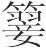
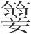
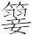

 似顺论第五

# 似顺

**【题解】**

本篇旨在强调要正确认识事物的本质。文章指出：“事多似倒而顺，多似顺而倒。有知顺之为倒、倒之为顺者，则可与言化矣。”并通过庄王伐陈、完子败军、尹铎增垒三个事例，说明只有从事物的联系、发展、转化入手，深入地进行分析，才能获得符合实际的认识。

一曰：

事多似倒而顺(1)，多似顺而倒。有知顺之为倒、倒之为顺者，则可与言化矣(2)。至长反短，至短反长(3)，天之道也。

**【注释】**

(1)倒：逆，指违背事理。

(2)化：事物发展变化的趋势。

(3)“至长”二句：高诱注：“夏至极长，过至极短，故曰‘至长反短’；冬至极短，过至则长，故曰‘至短反长’也。”

**【译文】**

第一：

事情有很多看似悖理其实是合理的，有很多看似合理其实是悖理的。如果有人知道表面合理其实悖理、表面悖理其实合理的道理，就可以跟他谈论事物发展变化的趋势了。白天到了最长的时候就要转而变短，到了最短的时候就要转而变长，这是自然的规律。

荆庄王欲伐陈，使人视之。使者曰：“陈不可伐也。”庄王曰：“何故？”对曰：“城郭高(1)，沟洫深(2)，蓄积多也。”宁国曰(3)：“陈可伐也。夫陈，小国也，而蓄积多，赋敛重也，则民怨上矣。城郭高，沟洫深，则民力罢矣。兴兵伐之，陈可取也。”庄王听之，遂取陈焉。

**【注释】**

(1)郭：外城。

(2)洫（xù）：沟渠。

(3)宁国：楚臣。

**【译文】**

楚庄王想要攻打陈国，派人去察看陈国的情况。派去的人回来说：“陈国不可以攻打它。”庄王说：“什么缘故？”回答说：“陈国城墙很高，护城河很深，蓄积的粮食财物很多。”宁国说：“照这样说，陈国是可以攻打的。陈国是个小国，蓄积的粮食财物多，赋税必然繁重，那么人民就怨恨君主了。城墙高，护城河深，那么民力就凋敝了。起兵攻打它，陈国是可以攻取的。”庄王听从了宁国的意见，于是攻取了陈国。

田成子之所以得有国至今者(1)，有兄曰完子，仁且有勇。越人兴师诛田成子，曰：“奚故杀君而取国(2)？”田成子患之。完子请率士大夫以逆越师，请必战，战请必败，败请必死。田成子曰：“夫必与越战可也，战必败，败必死，寡人疑焉。”完子曰：“君之有国也，百姓怨上，贤良又有死之臣蒙耻。以完观之也，国已惧矣。今越人起师，臣与之战，战而败，贤良尽死，不死者不敢入于国。君与诸孤处于国(3)，以臣观之，国必安矣。”完子行，田成子泣而遣之。夫死败，人之所恶也，而反以为安，岂一道哉？故人主之听者与士之学者，不可不博。

**【注释】**

(1)田成子：春秋末齐国大夫，名田恒（陈恒），又称田常（陈常），谥成子。为齐简公、平公相，独揽齐国大权，注意争取民心，其后代取代姜姓做了齐国国君。

(2)君：指齐简公，为田成子所杀。

(3)孤：指战死者的后代。

**【译文】**

田成子之所以能够享有齐国直至今天，是因为他有个哥哥叫完子，仁爱而且勇敢。越国起兵讨伐田成子，说：“为什么杀死国君而窃取他的国家？”田成子对此很忧虑。完子请求率领士大夫迎击越军，并且请求准许自己一定同越军交战，交战还要一定战败，战败还要一定战死。田成子说：“一定同越国交战是可以的，交战一定要战败，战败还要一定战死，这我就不明白了。”完子说：“你拥有齐国，百姓怨恨你，贤良之中又有敢死之臣认为蒙受了耻辱。在我看来，国家已经令人忧惧了。如今越国兴兵伐我，我去同他们交战，如果交战失败，随我去的贤良之人就会全部死掉，即使不死的人也因羞耻而不敢回到齐国来。你和那些遗孤居于齐国，在我看来，国家就一定会安定了。”完子出发时，田成子哭着为他送别。死亡和失败，这是人们所厌恶的，而完子反借此使齐国得以安定。做事情哪能只有一种方法呢！所以君主听取意见和士人学习道术，不可以不广博。

尹铎为晋阳(1)，下(2)，有请于赵简子。简子曰：“往而夷夫垒(3)。我将往，往而见垒，是见中行寅与范吉射也。”铎往而增之。简子上之晋阳，望见垒而怒曰：“嘻！铎也欺我！”于是乃舍于郊(4)，将使人诛铎也。孙明进谏曰(5)：“以臣私之(6)，铎可赏也。铎之言固曰：见乐则淫侈，见忧则诤治(7)，此人之道也。今君见垒念忧患，而况群臣与民乎？夫便国而利于主，虽兼于罪，铎为之。夫顺令以取容者，众能之，而况铎欤？君其图之！”简子曰：“微子之言，寡人几过。”于是乃以免难之赏赏尹铎(8)。人主太上喜怒必循理(9)，其次不循理，必数更，虽未至大贤，犹足以盖浊世矣。简子当此。世主之患，耻不知而矜自用(10)，好愎过而恶听谏(11)，以至于危。耻无大乎危者。

**【注释】**

(1)尹铎：赵简子的家臣。为：治。晋阳：春秋晋邑，赵简子的封地，在今山西太原。

(2)下：指由晋阳来到晋国国都新绛（今山西曲沃）。晋阳和新绛分别处于汾水上、下游，晋阳地势高，新绛地势低，所以从晋阳到新绛称“下”。当时赵简子为晋国执政大臣，居于国都。

(3)夷：平。夫：指示代词，那。垒：军营的墙壁。晋卿中行（hánɡ）寅（荀寅）与范吉射曾率军围赵简子于晋阳，这些营垒即中行氏与范氏所筑。

(4)舍：驻扎。

(5)孙明：赵简子家臣。

(6)私：私下考虑。

(7)诤：争，竞相。

(8)免难之赏：使君主免于患难的重赏。尹铎增高营垒，使简子警惧戒备，这样就可以免于患难。

(9)太上：指德行最高的。

(10)矜：骄傲自负。自用：自以为是，依己意而行。

(11)愎（bì）过：坚持错误。愎，固执。

**【译文】**

尹铎治理晋阳，下行到新绛向简子请示事情。简子说：“去把中行氏和范氏修筑的那些营垒拆平。我将到晋阳去，如果去了看到那些营垒，就像是看见了中行寅和范吉射似的。”尹铎回去以后，反倒把原有的营垒增高了。简子上行到晋阳，望见营垒，生气地说：“哼！尹铎欺骗了我！”于是住在郊外，将要派人把尹铎杀掉。孙明进谏说：“据我私下考虑，尹铎是该奖赏的。尹铎的意思本来是说：遇见享乐之事就会恣意放纵，遇见忧患之事就会励精图治，这是人之常理。如今君主见到营垒就想到了忧患，又何况群臣和百姓呢！有利于国家和君主的事，即使加倍获罪，尹铎也宁愿去做。顺从命令以取悦于君主，一般人都能做到，又何况尹铎呢！希望您好好考虑一下。”简子说：“如果没有你这一番话，我几乎犯了错误。”于是就按使君主免于患难的奖赏赏赐了尹铎。德行最高的君主，喜怒一定依理而行；次一等的，虽然有时不依理而行，但一定经常改正。这样的君主虽然还没有达到大贤的境地，仍足以超过乱世的君主了。简子跟这类人相当。当今世上君主的弊病，在于把不知当作羞耻，把自行其是当作荣耀，喜欢坚持错误而厌恶听取规谏之言，以至于陷入危险的境地。耻辱当中没有比使自己陷入危险再大的了。

# 别类

**【题解】**

本篇重点阐述“类固不必”的思想。文章以莘藟金锡等物为例，说明事物都有其特殊性，而且都处在发展变化之中。文章批评了不知别类、对事物笼统类推的错误做法，并指出，人对客观事物的认识是不可穷尽的，对于一时尚未知其所以然的事物，首先要顺应其自然，而不要凭主观进行猜测。

二曰：

知不知，上矣(1)。过者之患，不知而自以为知。物多类然而不然，故亡国僇民无已(2)。夫草有莘有藟(3)，独食之则杀人，合而食之则益寿。万堇不杀(4)。漆淖水淖(5)，合两淖则为蹇(6)，湿之则为干。金柔锡柔(7)，合两柔则为刚，燔之则为淖(8)。或湿而干，或燔而淖，类固不必(9)，可推知也？小方，大方之类也；小马，大马之类也；小智，非大智之类也(10)。

**【注释】**

(1)上：高明。

(2)僇：通“戮”。杀戮。

(3)莘（xīn）、藟（lěi）：都是有毒的药草。

(4)万：“虿（chài）”的古字。虿，蝎子，可以作为药物使用。堇（jǐn）：紫堇，药草名，有毒。

(5)淖（nào）：本为烂泥，这里指流体。

(6)蹇（jiǎn）：凝固，干硬。漆遇到水气容易干燥。

(7)金：指铜。

(8)燔（fán）：烧。

(9)必：这里指固定不变。

(10)小智：指孤立地、片面地看问题的思想方法，如下文公孙绰、高阳应之类。小智“好小察而不通乎大理”，所以和“通乎大理”的“大智”不同类。

**【译文】**

第二：

知道自己有所不知，就可以说是高明了。犯错误人的弊病，正在于不知却自以为知。很多事物都是好像如此而其实并不如此，所以国家灭亡、百姓被杀戮的事情不断地发生。药草有莘有藟，单独服用会致死，合在一起服用却能使人长寿。蝎子和紫堇都是毒药，配在一起反倒毒不死人。漆是流体，水也是流体，漆与水相遇却会凝固，使潮湿反而变干。铜很柔软，锡也很柔软，二者熔合起来反而变硬，如果用火焚烧又会变成流体。有的东西弄湿反倒变得干燥，有的东西焚烧后反倒变成流体，物类本来就不是固定不变的，怎么能够推知呢？小的方形跟大的方形是同类的，小马跟大马是同类的，小聪明跟大聪明却不是同类的。

鲁人有公孙绰者，告人曰：“我能起死人(1)。”人问其故，对曰：“我固能治偏枯(2)，今吾倍所以为偏枯之药(3)，则可以起死人矣。”物固有可以为小，不可以为大，可以为半，不可以为全者也。

**【注释】**

(1)起：治活。

(2)偏枯：偏瘫，半身不遂。

(3)倍：加倍。为：治。

**【译文】**

鲁国有个叫公孙绰的人，告诉别人说：“我能把死人医活。”别人问他其中的缘故，他回答说：“我本来就能治疗偏瘫，现在我把治疗偏瘫的药加倍，就可以把死人医活了。”公孙绰不懂得，事物本来就是有的只能在小处起作用却不能在大处起作用，有的只能对局部起作用却不能对全局起作用。

相剑者曰：“白所以为坚也(1)，黄所以为牣也(2)，黄白杂则坚且牣，良剑也。”难者曰(3)：“白所以为不牣也，黄所以为不坚也，黄白杂则不坚且不牣也。又柔则锩(4)，坚则折。剑折且锩，焉得为利剑？”剑之情未革(5)，而或以为良，或以为恶，说使之也。故有以聪明听说，则妄说者止；无以聪明听说，则尧、桀无别矣。此忠臣之所患也，贤者之所以废也。

**【注释】**

(1)白：锡所表现出的颜色。这里指锡。铜中加锡可增加合金硬度。

(2)黄：铜所表现出的颜色。这里指铜。牣：通“韧”。

(3)难（nàn）：诘责，反驳。

(4)锩（juǎn）：刀剑的刃卷曲。

(5)革：改变。

**【译文】**

相剑的人说：“色白表示剑坚硬，色黄表示剑柔韧，黄白相杂，就表示剑既坚硬又柔韧，就是好剑。”反驳的人说：“色白表示剑不柔韧，色黄表示剑不坚硬，黄白相杂，就表示剑既不坚硬又不柔韧。而且柔韧就会卷刃，坚硬就会折断，剑既易折断又易卷刃，怎么能算利剑？”剑的实质没有变化，而有的人认为好，有的人认为不好，这是人为的议论造成的。所以，如果能凭耳聪目明来听取议论，那么胡乱议论的人就得住口；不能凭耳聪目明听取议论，就会连尧和桀也分辨不清了。这正是忠臣对君主感到忧虑的地方，也是贤人之所以被废弃不用的原因。

义，小为之则小有福，大为之则大有福。于祸则不然，小有之不若其亡也(1)。射招者欲其中小也(2)，射兽者欲其中大也。物固不必，安可推也？

**【注释】**

(1)亡：通“无”。

(2)招：射箭的目标，箭靶。

**【译文】**

符合道义的事，小做就得到小福，大做就得到大福。灾祸则不是这样，有灾祸也不如没有灾祸。射靶子的人希望射中的目标越小越好，射野兽的人则希望射中的野兽越大越好。事物本来就不是固定不变的，怎么可以推知呢？

高阳应将为室家(1)，匠对曰：“未可也。木尚生，加涂其上，必将挠。以生为室，今虽善，后将必败。”高阳应曰：“缘子之言，则室不败也。木枯则益劲(2)，涂干则益轻，以益劲任益轻(3)，则不败。”匠人无辞而对，受令而为之。室之始成也善，其后果败。高阳应好小察，而不通乎大理也。

**【注释】**

(1)高阳应：宋人，姓高阳，名应。

(2)劲（jìnɡ）：坚强有力。

(3)任：承担。

**【译文】**

高阳应将要建造房舍，木匠答复说：“现在还不行。木料还湿，如果上面再加上泥，一定会被压弯。用湿木料盖房子，现时虽然很好，以后一定要倒塌。”高阳应说：“照你所说，房子恰恰不会倒塌。木料干了就会更加结实有力，泥干了重量就会更轻，用越来越结实的木料承担越来越轻的泥，肯定不会倒塌。”木匠无言以对，只好奉命建造房舍。房子刚落成时很好，后来果然倒塌了。高阳应喜欢在小处明察，却不懂得大道理啊！

骥、骜、绿耳背日而西走(1)，至乎夕则日在其前矣。目固有不见也，智固有不知也，数固有不及也(2)。不知其说所以然而然，圣人因而兴制(3)，不事心焉(4)。

**【注释】**

(1)骥、骜（ào）：千里马。绿耳：良马名，传为周穆王八骏之一。

(2)数：术，道术。

(3)兴制：创订制度。

(4)事心：用心，指凭主观进行判断。

**【译文】**

骥、骜、绿耳等良马背朝太阳向西奔跑，到了傍晚，太阳在它们的前方。眼睛本来就有看不到的东西，智慧本来就有不明白的道理，道术本来就有达不到的地方。人们不知道一些事物的所以然，但它们确实就是这样。圣人就顺应自然创制制度，不在一时不懂的地方主观臆断。

# 有度

**【题解】**

本篇论君道，主张君主要“有度”、“执一”。所谓“度”指的是准则，所谓“一”，指的是根本之道，即清静无为的性命之情。作者认为，君主只有坚持一定的准则，并通晓性命之情，才能正确地听言知人，去私心，行仁义。达到“无为而无所不为”的境地。

三曰：

贤主有度而听(1)，故不过。有度而以听，则不可欺矣，不可惶矣(2)，不可恐矣，不可喜矣。以凡人之知，不昏乎其所已知，而昏乎其所未知，则人之易欺矣，可惶矣，可恐矣，可喜矣，知之不审也。

**【注释】**

(1)度：法度，准则。

(2)惶：惶惑。

**【译文】**

第三：

贤明的君主坚持一定的准则听取议论，所以不犯错误。坚持一定的准则来听取议论，别人就不可以欺骗他了，不可以使他惶惑了，不可以使他恐惧了，不可以使他喜悦了。以普通人的智慧而论，不会在自己已经知道的事情上犯胡涂，而是在自己不知道的事情上犯胡涂。所以别人就容易欺骗他们了，就可以使他们惶惑了，可以使他们恐惧了，可以使他们喜悦了。这是对事物知道得不清楚造成的。

客有问季子曰(1)：“奚以知舜之能也？”季子曰：“尧固已治天下矣，舜言治天下而合己之符(2)，是以知其能也。”“若虽知之(3)，奚道知其不为私(4)？”季子曰：“诸能治天下者，固必通乎性命之情者，当无私矣。”夏不衣裘，非爱裘也(5)，暖有余也。冬不用(6)，非爱也，清有余也(7)。圣人之不为私也，非爱费也(8)，节乎己也(9)。节己，虽贪污之心犹若止(10)，又况乎圣人？

**【注释】**

(1)季子：东户季子，传说尧时诸侯。

(2)符：道。

(3)若：你。

(4)道：由。

(5)爱：吝惜，舍不得。

(6)（shà）：扇子。

(7)清：寒凉。

(8)费：费用，指财货。

(9)节：克制。

(10)犹若：犹然，尚且。

**【译文】**

有个客人问季子说：“尧根据什么知道舜有才能呢？”季子说：“尧本来已经治理好天下了，舜谈论治理天下的想法符合尧的道义，因此知道他有才能。”客人问：“你虽然知道他有才能，又根据什么知道他不会谋求私利呢？”季子说：“那些能治理天下的人，一定是通晓生命本性的人，应该是没有私心的了。”夏天不穿皮裘，并不是吝惜皮裘，而是因为温暖有余。冬天不用扇子，并不是吝惜扇子，而是因为寒凉有余。圣人不追求私利，并不是吝惜财货，而是因为要节制自己。如能节制自己，即使是贪心浊欲尚且能够抑止，又何况圣人呢？

许由非强也(1)，有所乎通也(2)。有所通则贪污之利外矣(3)。孔墨之弟子徒属充满天下，皆以仁义之术教导于天下，然而无所行。教者术犹不能行，又况乎所教？是何也？仁义之术外也(4)。夫以外胜内(5)，匹夫徒步不能行(6)，又况乎人主？唯通乎性命之情，而仁义之术自行矣。

**【注释】**

(1)强（qiǎnɡ）：勉强。

(2)有所乎通：指对“性命之情”有所通晓。乎，于。

(3)外：排除，抛弃。

(4)外：外在的，不是本性所具有的。

(5)内：内在的，指私欲。

(6)徒步：徒步行走的人，指平民。

**【译文】**

许由辞让天下并不是勉强做出来的，而是因为对生命本性有所通晓。有所通晓，就会屏弃贪婪污浊之利了。孔丘墨翟的弟子门徒布满天下，他们都用仁义之道教导天下的人，但是他们的主张在哪个地方也得不到推行。作为施教者的孔丘墨翟尚且不能使自己的主张得以推行，又何况被他们教导的弟子？这是什么缘故呢？因为仁义之道是外在的。用外在的仁义克服内在的私心，平民百姓尚且做不到，又何况君主！只要通晓了生命的本性，仁义之道才能得以自然推行。

先王不能尽知，执一而万物治(1)。使人不能执一者，物感之也。故曰：通意之悖(2)，解心之缪(3)，去德之累，通道之塞。贵富显严名利(4)，六者悖意者也。容动色理气意(5)，六者缪心者也。恶欲喜怒哀乐，六者累德者也。智能去就取舍，六者塞道者也。此四六者不荡乎胸中则正(6)。正则静，静则清明(7)，清明则虚，虚则无为而无不为也。

**【注释】**

(1)一：根本之道，这里指清虚无为的“性命之情”。

(2)悖：惑乱。

(3)缪（liǎo）：缠绕。

(4)严：威。

(5)理：辞理。

(6)正：指思想纯正。

(7)清明：清净明澈。

**【译文】**

先王不能无所不知，他们坚守根本之道，就把天下万物治理好了。使人不能执守根本之道的原因，是外物的扰动。所以说，要疏通思想上的惑乱，解开心志上的纠结，去掉德行上的拖累，打通大道上的阻塞。高贵、富有、显荣、威严、声名、财利，这六种东西是惑乱思想的。容貌、举止、神情、辞理、意气、情意，这六种东西是缠绕心志的。嫌恶、爱恋、欣喜、愤怒、悲伤、欢乐，这六种东西是拖累德行的。智慧、才能、背离、趋就、择取、舍弃，这六种东西是阻塞大道的。这四个方面各六种东西不在心中扰动，思想就纯正了。纯正就会平静，平静就会清净明澈，清净明澈就会虚无，做到虚无就会无为而又无所不为了。

# 分职

**【题解】**

本篇也是讲君道的。文章多方设喻、反复申说，君臣各有其职，善于为君的，应该执守“无智、无能、无为”，做到“用非其有如已有之”。如果君主事事都强力疾作，“处人臣之职”，结果必然会“壅塞”。

四曰：

先王用非其有如己有之(1)，通乎君道者也。夫君也者，处虚素服而无智(2)，故能使众智也。智反无能(3)，故能使众能也。能执无为，故能使众为也。无智无能无为，此君之所执也。人主之所惑者则不然。以其智强智(4)，以其能强能，以其为强为。此处人臣之职也。处人臣之职，而欲无壅塞，虽舜不能为。

**【注释】**

(1)非其有：不是自身所有的东西，指下文的“众智”、“众能”、“众为”。

(2)处虚：居于清虚。素服：疑当作“服素”，执守素朴，即返朴归真的意思。服，执，持。无智：大智若愚之意。

(3)反：同“返”，回归。无能：大巧若拙之意。

(4)强（qiǎnɡ）：勉强。

**【译文】**

第四：

先王使用不是自身所有的东西就像自己所有的一样，这是因为他们通晓为君之道。君主这种人，居于清虚，执守素朴，看来没有什么智慧，所以能使用众人的智慧。智慧回归到无所能的境地，所以能使用众人的才能。能执守无所作为的原则，所以能使用众人的作为。这种无智、无能、无为，是君主所执守的。君主中的胡涂人却不是这样。他们硬凭自己有限的智慧逞聪明，硬凭自己有限的才能逞能干，硬凭自己有限的作为做事情。这是使自己处于人臣的职位。君主处于人臣的职位，又想不耳目闭塞，即使是舜这样的圣人也办不到。

武王之佐五人(1)，武王之于五人者之事无能也，然而世皆曰：取天下者武王也。故武王取非其有如己有之，通乎君道也。通乎君道，则能令智者谋矣，能令勇者怒矣(2)，能令辩者语矣。夫马者，伯乐相之，造父御之，贤主乘之，一日千里。无御相之劳而有其功，则知所乘矣(3)。今召客者，酒酣，歌舞鼓瑟吹竽，明日不拜乐己者(4)，而拜主人，主人使之也。先王之立功名有似于此。使众能与众贤，功名大立于世，不予佐之者，而予其主，其主使之也。譬之若为宫室，必任巧匠，奚故？曰：匠不巧则宫室不善。夫国，重物也，其不善也岂特宫室哉！巧匠为宫室，为圆必以规，为方必以矩，为平直必以准绳。功已就，不知规矩绳墨，而赏匠巧匠之(5)。宫室已成，不知巧匠，而皆曰：“善，此某君、某王之宫室也。”此不可不察也。人主之不通主道者则不然。自为人则不能(6)，任贤者则恶之，与不肖者议之。此功名之所以伤，国家之所以危。

**【注释】**

(1)五人：周公旦、召（shào）公爽（shì）、太公望、毕公高、苏公忿生。

(2)怒：振奋。

(3)所乘：乘车的原则。

(4)乐己者：指歌舞弹唱的倡优。

(5)而赏匠巧匠之：此句当作“而赏巧匠也”，第一个“匠”字为衍文，“之”字当作“也”。

(6)人：当作“之”。

**【译文】**

周武王的辅佐大臣有五个人，武王对于这五个人的职事一样也做不来，但世上都说取得天下的是武王。武王取用不是他自身所有的东西就像自己所有的一样，这是通晓为君之道啊！通晓为君之道，就能让聪明的人谋划了，就能让勇武的人振奋了，就能让善于言辞的人议论了。譬如马，伯乐这种人相察它，造父这种人驾御它，贤明的君主乘坐它，可以日行千里。没有相察和驾御的辛劳，却有一日千里的功效，这就是知道乘马之道了。譬如召请客人，饮酒酣畅之际，倡优歌舞弹唱，第二天，客人不拜谢使自己快乐的倡优，而拜谢主人，因为是主人命他们这样做的。先王建立功名与此相似。使用众多能人和贤人，在世上功名卓著，人们不把功名归于辅佐他的人，而归于君主，因为是君主使辅臣这样做的。又譬如建造宫室一定要任用巧匠，什么缘故呢？回答是：工匠不巧，宫室就造不好。国家是极重要的东西，如果国家治理不好，所带来的危害岂止是宫室建造不好那样呢！巧匠建造宫室的时候，画圆一定要用圆规，画方一定要用矩尺，取平直一定要用水准墨线。事情完成以后，主人不知圆规、矩尺和水准墨线，只是赏赐巧匠。宫室造好以后，人们不知巧匠，而都说：“造得好，这是某某君主、某某帝王的宫室。”这个道理是不可不明察的。君主中不通晓为君之道的人则不是这样。自己去做又做不了，任用贤者又厌恶他们，跟不肖的人议论他们。这是功名之所以毁败、国家之所以倾危的原因。

枣，棘之有；裘，狐之有也。食棘之枣，衣狐之皮，先王固用非其有而己有之(1)。汤武一日而尽有夏商之民，尽有夏商之地，尽有夏商之财。以其民安，而天下莫敢之危(2)；以其地封(3)，而天下莫敢不说；以其财赏，而天下皆竞(4)。无费乎郼与岐周(5)，而天下称大仁，称大义，通乎用非其有。

**【注释】**

(1)而：如。

(2)莫敢之危：没有人敢危害他。

(3)封：分土地给诸侯或臣子。

(4)竞：进，奋发努力。

(5)郼（yī）：商汤统一天下前所在封国的国名。

**【译文】**

枣子是酸枣树结的，皮裘是狐皮做的。而人们吃酸枣树结的枣子，穿狐皮做的皮裘，先王本来就是把不是自身所有的当作自己所有的来使用。商汤、周武王在短短的时间内就完全占有了夏、商的百姓，完全占有了夏、商的土地，完全占有了夏、商的财富。他们凭借夏、商的百姓安定自身，天下没有人敢危害他们；他们利用夏、商的土地分封诸侯，天下没有人敢表示不悦；他们利用夏、商的财富赏赐臣下，天下人都争相效力。没有耗费自己封邑一点东西，可是天下都称颂他们大仁，称颂他们大义，这是因为他们通晓了使用不是自身所有的东西的道理。

白公胜得荆国(1)，不能以其府库分人。七日，石乞曰(2)：“患至矣，不能分人则焚之，毋令人以害我。”白公又不能。九日，叶公入(3)，乃发太府之货予众(4)，出高库之兵以赋民(5)，因攻之。十有九日而白公死。国非其有也，而欲有之，可谓至贪矣。不能为人(6)，又不能自为(7)，可谓至愚矣。譬白公之啬，若枭之爱其子也(8)。

**【注释】**

(1)白公胜：春秋楚人，楚平王太子建之子，惠王十年（前479）作乱，杀令尹、司马，后事败自杀。

(2)石乞：白公胜的党羽。

(3)叶公：楚叶县大夫沈诸梁。

(4)发：打开。太府：国家储藏财物的仓库。货：财物。

(5)高库：国家盛兵车武器的仓库。赋：分发。

(6)为（wèi）人：指以府库分人，为人谋利。

(7)自为（wèi）：指焚烧府库以防他人用以危害自己。

(8)枭（xiāo）：猫头鹰。据说枭子长大后食其母。白公胜爱惜财物，反被敌方利用而招致杀身之祸，就像猫头鹰爱其子而终于被其子吃掉一样。

**【译文】**

白公胜作乱，控制了楚国，舍不得把楚国仓库的财物分给别人。过了七天，石乞说：“祸患就要到了，舍不得分给别人就把它烧掉，不要让别人利用它来危害我们。”白公胜又舍不得这样做。到了第九天，叶公进入国都，就打开太府将财物发放给民众，拿出高库的兵器分配给百姓，借以进攻白公。到了第十九天，白公失败身死。国家不是自己所有的，却想占有它，可以说是贪婪到极点了。占有了国家，不能用来为别人谋利，又不能用来为自己谋利，可以说是愚蠢到极点了。拿白公的吝啬打个比喻，就像猫头鹰疼爱自己的子女而最后反被子女吃掉一样。

卫灵公天寒凿池(1)，宛春谏曰(2)：“天寒起役(3)，恐伤民。”公曰：“天寒乎？”宛春曰：“公衣狐裘，坐熊席，陬隅有灶(4)，是以不寒。今民衣弊不补，履决不组(5)，君则不寒矣，民则寒矣。”公曰：“善。”令罢役。左右以谏曰：“君凿池，不知天之寒也，而春也知之。以春之知之也而令罢之，福将归于春也，而怨将归于君。”公曰：“不然。夫春也，鲁国之匹夫也，而我举之，夫民未有见焉。今将令民以此见之。曰春也有善于寡人有也(6)，春之善非寡人之善欤？”灵公之论宛春，可谓知君道矣。

**【注释】**

(1)卫灵公：春秋卫国君，姓姬，名元，公元前534年—前493年在位。

(2)宛春：卫灵公臣。

(3)起役：兴工。役，劳役，这里指土木工程。

(4)陬（zōu）、隅（yú）：角落。

(5)决：裂开。组：编织。

(6)曰：当作“且”。于：如。

**【译文】**

卫灵公让民众在天气寒冷时开凿池塘，宛春劝谏说：“天气寒冷时开工，恐怕伤害百姓。”灵公说：“天气寒冷吗？”宛春说：“您穿着狐皮裘，坐着熊皮席，屋角又有火灶，所以不觉得寒冷。如今百姓衣服破旧不得缝补，鞋子裂开了不得编织，您是不冷了，百姓可冷呢！”灵公说：“你说得好。”就下令停止工程。侍从们劝谏说：“您下令开凿池塘，不知道天气寒冷，宛春却知道。因为宛春知道就下令停止工程，恩德将归于宛春，而怨恨将归于您。”灵公说：“不是这样。宛春只是鲁国的一个平民，我举用了他，百姓对他还没有什么了解。现在要让百姓通过这件事了解他。而且宛春有善行就如同我有一样，宛春的善行不就是我的善行吗？”灵公这样议论宛春，可算是懂得为君之道了。

君者固无任，而以职受任(1)。工拙(2)，下也(3)；赏罚，法也；君奚事哉？若是则受赏者无德，而抵诛者无怨矣(4)，人自反而已(5)。此治之至也。

**【注释】**

(1)职：指臣下的职位。受：同“授”，给予。

(2)工：巧。

(3)下：臣下。

(4)抵诛：因犯罪而处死。抵，抵挡罪过。臣下分职既定，赏罚都依法而行，并无君主个人爱憎于其中，所以说“无德”、“无怨”。

(5)自反：反躬求己，自省。

**【译文】**

做君主的人，本来就没有具体职责，而是要根据臣下的职位委派他们责任。事情做得好坏，由臣下负责；该赏该罚，由法律规定。君主何必亲自去做呢？像这样，受赏的人就无须感激谁，被处死的人也无须怨恨谁，人人都反躬自省就够了。这是治理国家最高明的做法。

# 处方

**【题解】**

“处方”，意为使臣民各居其分。“方”即《季春纪·圜道》篇“天道圜，地道方”、“君执圜，臣处方”之“方”。本篇旨在言臣道，故以“处方”名篇。文章开篇名义，指出“凡为治必先定分”。所谓“定分”即确定上下尊卑的等级名分。作者反复强调“定分”的重要，把它视为治国之本，认为只有君臣父子夫妇各安其分，社会才能安定。

五曰：

凡为治必先定分(1)：君臣父子夫妇(2)。君臣父子夫妇六者当位，则下不逾节而上不苟为矣，少不悍辟而长不简慢矣(3)。金木异任(4)，水火殊事(5)，阴阳不同，其为民利一也。故异所以安同也，同所以危异也(6)。同异之分，贵贱之别，长少之义(7)，此先王之所慎，而治乱之纪也(8)。

**【注释】**

(1)分（fèn）：名分，职分。

(2)君臣父子夫妇：这是解释“定分”的具体内容，所谓定分，就是确定这六者的名分。

(3)悍：凶暴。辟：同“僻”，奸邪。简慢：怠惰轻忽。

(4)任：职责，这里指功用，与下句“事”同义。

(5)事：职务，这里指用途。

(6)“故异”二句：同：同一，这里指人的共同欲望。异：差异，这里指人贵贱尊卑的不同等级。所谓异安同，指不同的等级名分才能保证人们的欲望得到适当满足；所谓同危异，意指放纵人们的欲望就会危害贵贱尊卑的等级名分。

(7)义：宜，这里指适当的关系。

(8)纪：关键。

**【译文】**

第五：

凡治国一定要先确定名分，使君臣父子夫妇名实相副。君臣父子夫妇六种人各居其位，那么地位低下的就不会超越礼法，地位尊贵的就不会随意而行了，晚辈就不会凶暴邪僻，长者就不会怠惰轻忽了。金和木功用各异，水和火用途有别，阴和阳性质不同，但它们作为对人们有用之物则是相同的。所以说，差异是保证同一的，而同一是危害差异的。同一和差异的区分，尊贵和卑贱的区别，长辈和晚辈的伦理，这是先王所慎重的，是国家太平或者混乱的关键。

今夫射者仪毫而失墙(1)，画者仪发而易貌(2)，言审本也。本不审，虽尧舜不能以治。故凡乱也者，必始乎近而后及远，必始乎本而后及末。治亦然。故百里奚处乎虞而虞亡，处乎秦而秦霸；向挚处乎商而商灭(3)，处乎周而周王。百里奚之处乎虞，智非愚也；向挚之处乎商，典非恶也(4)：无其本也。其处于秦也，智非加益也；其处于周也，典非加善也：有其本也。其本也者，定分之谓也。

**【注释】**

(1)仪：察。毫：毫毛，比喻细微之物。

(2)易貌：忽略容貌。此句和上句都是谨小而失大的意思。

(3)向挚：商朝太史令，谏纣不听而归周，周武王采用他的建议而称王天下。

(4)典：指太史所掌的国家法典。

**【译文】**

如今射箭的人，仔细观察毫毛而看不见墙壁；画画的人，仔细观察毛发而忽略容貌。这是说应该审察根本。根本的东西不审察清楚，即使尧舜也不能治理好天下。所以凡是祸乱，一定先从身边产生而后延及远处，一定先从根本产生而后延及微末。国家太平也是如此。百里奚处在虞国而虞国灭亡，处在秦国而秦国称霸；向挚处在殷商而殷商覆灭，处在周国而周国称王。百里奚处在虞国的时候，他的才智并非愚笨；向挚处在殷商的时候，他所掌管的典籍并非不好。虞、商之所以灭亡，是因为没有治国之本。百里奚处在秦国的时候，他的才智并没有进一步增加；向挚处在周国的时候，他所掌管的典籍并没有进一步完善。秦、周之所以兴盛，是因为具有治国之本。所谓治国之本，说的就是确定名分啊！

齐令章子将而与韩魏攻荆(1)，荆令唐篾将而应之(2)。军相当(3)，六月而不战。齐令周最趣章子急战(4)，其辞甚刻(5)。章子对周最曰：“杀之免之，残其家，王能得此于臣。不可以战而战，可以战而不战，王不能得此于臣。”与荆人夹沘水而军(6)。章子令人视水可绝者(7)，荆人射之，水不可得近。有刍水旁者(8)，告齐候者曰(9)：“水浅深易知。荆人所盛守，尽其浅者也；所简守，皆其深者也。”候者载刍者，与见章子。章子甚喜，因练卒以夜奄荆人之所盛守(10)，果杀唐篾。章子可谓知将分矣。

**【注释】**

(1)章子：战国时人，齐威王、宣王时为将。

(2)唐篾：楚怀王将。

(3)当：面对，对峙。

(4)周最：战国周人，纵横家。趣（cù）：通“促”，催促。

(5)刻：尖刻，严峻。

(6)沘（bǐ）水：安徽淠河的古称，发源于沘山，北入淮河。军：驻军。

(7)绝：横渡。

(8)刍（chú）：割草。

(9)候：伺探，侦察。

(10)奄：通“掩”，突袭。

**【译文】**

齐王命令章子率兵与韩魏两国联合攻楚，楚命唐篾率兵应敌。两军对峙，六个月不交战。齐王命周最催促章子迅速开战，言辞非常尖刻。章子回答周最说：“杀死我，罢免我，杀戮我的全族，这些大王对我都可以做到；不可交战而硬要交战，可以交战而不去交战，这些，大王在我这里办不到。”齐军与楚军隔沘水驻军对垒。章子派人察看河水可以横渡之处，楚军放箭，派去侦察的人无法靠近河边。有一个人在河边割草，告诉齐军的侦察人员说：“河水的深浅很容易知道。凡是楚军防守严密的，都是水浅的地方；防守粗疏的，都是水深的地方。”齐军的侦察人员让割草的人上车，和他一起来见章子。章子非常高兴，于是就乘着黑夜用精兵突袭楚军严密防守的地方，果然大胜，杀死了唐篾。章子可说是知道为将的职分了。

韩昭釐侯出弋(1)，靷偏缓(2)。昭釐侯居车上，谓其仆(3)：“靷不偏缓乎？”其仆曰：“然。”至，舍(4)，昭釐侯射鸟，其右摄其一靷(5)，适之。昭釐侯已射，驾而归。上车，选间(6)，曰：“乡者靷偏缓，今适，何也？”其右从后对曰：“今者臣适之。”昭釐侯至，诘车令(7)，各避舍(8)。故擅为妄意之道，虽当，贤主不由也。

**【注释】**

(1)弋（yì）：以带有丝线的箭射鸟，这里泛指射猎。

(2)靷（yǐn）：骖马拉车所用的皮带。偏缓：骖马居于服马两侧，偏缓指一侧的皮带松了。

(3)仆：车夫。

(4)舍：车停下来。

(5)右：车右。摄：收束，结系。

(6)选间：一会儿。

(7)诘（jié）：责问。车令：官名，负责管理君主所乘车马。“靷偏缓”是车令失职，所以责问他。

(8)各：指车令和车右。避舍：离开住室而露宿于外，这是惶恐请罪的表示。车令失职，车右侵职，都是不守其分，所以避舍请罪。

**【译文】**

韩昭釐侯外出射猎，边马拉车的皮带有一侧松了。昭釐侯在车上，对他的车夫说：“皮带不是有一侧松了吗？”车夫说：“是的。”到了猎场，车停了下来，昭釐侯去射鸟，他的车右把那侧松了的皮带收紧，使它长短适宜。昭釐侯射猎结束，驾车回去，上车以后，过了一会儿，说：“先前皮带有一侧松了，现在长短适宜，这是怎么回事？”他的车右从身后回答说：“刚才我把它调整合适了。”昭釐侯回到朝中，就此事责问车令，车令和车右都惶恐地退避请罪。所以，擅自行动、凭空猜测的做法，即使恰当，贤主也不会应允。

今有人于此，擅矫行则免国家(1)，利轻重则若衡石(2)，为方圜则若规矩(3)，此则工矣巧矣，而不足法。法也者，众之所同也，贤不肖之所以其力也(4)。谋出乎不可用，事出乎不可同，此为先王之所舍也。

**【注释】**

(1)矫（jiǎo）行：假托君命所采取的行动。矫，假托。

(2)利：当为“制”字之误。制，裁断，确定。衡石：对衡器的通称。衡，测定重量的器具。石，重量单位，一百二十斤为一石。

(3)圜：同“圆”。

(4)以：用。

**【译文】**

假如有这样一个人，擅自假托君命行事可使国家免于祸患，判断轻重可以像衡器那样准确，画方圆可以像用圆规矩尺那样标准，这种人精巧是很精巧，但是不值得效法。所谓法，是众人共同遵守的，是使贤与不肖都竭尽其力的。计谋想出来而不能采用，事情做出来而不能普遍推行，这是先王所舍弃的。

# 慎小

**【题解】**

本篇旨在告诫君主要慎于小事，防微杜渐。文章列举了卫献公、卫庄公、齐桓公、吴起等人的事例，反复说明，慎于小事，就会取信于民，取贤名于天下；对小事不慎，就可能酿成杀身失国的大祸。

六曰：

上尊下卑。卑则不得以小观上。尊则恣，恣则轻小物，轻小物则上无道知下，下无道知上。上下不相知，则上非下，下怨上矣。人臣之情，不能为所怨；人主之情，不能爱所非。此上下大相失道也。故贤主谨小物以论好恶。

**【译文】**

第六：

主上地位尊贵，臣下地位卑贱。地位卑贱就不能通过小事观察主上。地位尊贵就会骄恣，骄恣就会忽视小事，忽视小事，主上就没有途径了解臣下，臣下也没有途径了解主上。上下互相不了解，主上就会责怪臣下，臣下就会怨恨主上了。就人臣的常情来说，不能为自己所怨恨的君主尽忠竭力；就君主的常情来说，也不能喜爱自己所责怪的臣下。这样，主上和臣下就大大地违背了君臣的道义。所以贤明的君主慎重对待小事，以表明自己的爱憎。

巨防容蝼(1)，而漂邑杀人；突泄一熛(2)，而焚宫烧积(3)；将失一令，而军破身死；主过一言，而国残名辱，为后世笑。

**【注释】**

(1)防：堤。

(2)突：烟囱。熛（biāo）：进飞的火花。

(3)积：积聚，指粮食财物。

**【译文】**

大堤中伏藏一只蝼蛄，就会引起水灾，冲毁城邑，淹死民众。烟囱里漏出一个火星，就会引起大火，焚毁宫室，烧掉积聚。将军下错一道命令，就会招致兵败身死。君主说错一句话，就会导致国破名辱，被后世讥笑。

卫献公戒孙林父、宁殖食(1)。鸿集于囿(2)，虞人以告(3)，公如囿射鸿。二子待君，日晏(4)，公不来至。来，不释皮冠而见二子(5)。二子不说，逐献公，立公子黚(6)。

**【注释】**

(1)卫献公：春秋卫国君，名衎（kàn），公元前576年即位，前559年被逐出亡，前547年又返国复位，前544年卒。戒：告诫，叮嘱，这里是相约的意思。孙林父（fǔ）、宁殖：都是卫大夫，又称孙文子、宁惠子。

(2)鸿：大雁。囿：天子诸侯畜养禽兽以供打猎的地方。

(3)虞人：管理苑囿的官吏。

(4)晏：晚。

(5)皮冠：田猎时戴的用白鹿皮制成的帽子。按照礼节，国君见臣属应脱去皮冠，“不释皮冠”是一种不礼貌的举动。

(6)公子黚（qián）：据《左传》，二人所立为献公之弟公孙剽，即卫殇公，《史记·卫世家》则谓“立定公弟秋为卫君”。

**【译文】**

卫献公约孙林父、宁殖吃饭。正巧有雁群落在苑囿，虞人报告给献公，献公就去苑囿射雁。孙林父、宁殖两个人等待国君，天色已晚，献公还不回来。回来以后，又连皮冠也不摘就去见孙林父和宁殖。二人很不高兴，就驱逐了献公，立公子黚为君。

卫庄公立(1)，欲逐石圃(2)。登台以望，见戎州，而问之曰：“是何为者也？”侍者曰：“戎州也。”庄公曰：“我姬姓也(3)，戎人安敢居国？”使夺之宅，残其州。晋人适攻卫，戎州人因与石圃杀庄公，立公子起(4)。此小物不审也。人之情，不蹶于山而蹶于垤(5)。

**【注释】**

(1)卫庄公：春秋末卫国君，卫灵公之子，名蒯聩（kuǎikuì），公元前534年—前493年在位。

(2)石圃：卫大夫。

(3)姬姓：周王室之姓。卫国祖先卫康叔为周武王之弟，卫为姬姓国。这里庄公是说自己为周宗室，地位尊贵。

(4)公子起：卫灵公之子，卫庄公弟，名起。

(5)蹶：跌倒。垤（dié）：蚁封，蚂蚁做窝时堆在穴口的小土堆。

**【译文】**

卫庄公立为国君，打算驱逐石圃。有一次，他登上高台远望，看到了戎州，就问道：“这是做什么的？”侍从说：“这是戎州。”庄公说：“我和周天子同为姬姓，戎人怎么敢住在我的国家！”于是派人抢夺了戎人的住宅，毁坏了他们的州邑。这时恰好晋国攻卫，戎州人乘机跟石圃一起杀死了庄公，立公子起为君。这就是对小事不谨慎造成的。人之常情都是如此，谁也不会被高山绊倒，却往往会被小小的土堆绊倒。

齐桓公即位，三年三言，而天下称贤，群臣皆说：去肉食之兽，去食粟之鸟，去丝罝之网(1)。

**【注释】**

(1)罝（jū）：捕兽的网。

**【译文】**

齐桓公即位以后，三年只说了三句话，天下人都称颂他的贤德，群臣也都很高兴。这三句话是：去掉苑囿中吃肉的野兽，去掉宫廷中吃粮食的鸟雀，去掉用丝编织的兽网。

吴起治西河(1)，欲谕其信于民，夜日置表于南门之外(2)，令于邑中曰：“明日有人偾南门之外表者(3)，仕长大夫(4)。”明日日晏矣，莫有偾表者。民相谓曰：“此必不信。”有一人曰：“试往偾表，不得赏而已，何伤？”往偾表，来谒吴起。吴起自见而出，仕之长大夫。夜日又复立表，又令于邑中如前。邑人守门争表，表加植(5)，不得所赏。自是之后，民信吴起之赏罚。赏罚信乎民，何事而不成，岂独兵乎？

**【注释】**

(1)西河：战国魏地，地在黄河以西。在今陕西大荔。

(2)夜日：前一天。表：木柱。

(3)偾（fèn）：仆倒。

(4)长（zhǎnɡ）大夫：上大夫，古官名。

(5)植：树立。

**【译文】**

吴起治理西河，想向百姓表明自己的信用，就派人前一天在南门外树起一根木柱，对全城百姓下令说：“明天如果有人把南门外的木柱扳倒，就任用他做长大夫。”第二天直到天黑，也没有人去扳倒木柱。人们一起议论说：“这话一定不是真的。”有一个人说：“我去试试把木柱扳倒，最多得不到赏赐罢了，有什么妨害？”这个人去扳倒了木柱，来禀告吴起。吴起亲自接见他，把他送出来，任用他为长大夫。而后又在前一天立起木柱，像前一次一样又对全城百姓下了命令。全城人都围在南门争相去扳木柱，木柱埋得很深，谁也没有得到赏赐。从此以后，百姓相信了吴起的赏罚。赏罚取信于百姓，什么事做不成？岂止是用兵呢！

