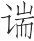
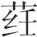
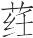
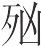

 士容论第六

# 士容

**【题解】**

“士容”指士人的仪容风范。文章开篇即具体阐述了士人应该具有的仪容风范。而后通过捕鼠之狗、田骈论客、唐尚羞于为史等事例，赞美士人志存高远、“慎谨畏化，而不肯自足”、“取舍不说，而心甚素朴”的品格。

一曰：

士不偏不党(1)。柔而坚，虚而实(2)。其状朗然不儇(3)，若失其一(4)。傲小物而志属于大(5)，似无勇而未可恐狼(6)，执固横敢而不可辱害(7)。临患涉难而处义不越(8)，南面称寡而不以侈大(9)。今日君民而欲服海外，节物甚高而细利弗赖(10)。耳目遗俗而可与定世(11)，富贵弗就而贫贱弗朅(12)。德行尊理而羞用巧卫(13)，宽裕不訾而中心甚厉(14)，难动以物而必不妄折(15)。此国士之容也。

**【注释】**

(1)偏：偏私。党：结党。

(2)虚：空虚，指表面看来一无所知，一无所能。实：充实。

(3)朗然：心地光明的样子。朗，明亮。儇（xuān）：乖巧。

(4)若失其一：好像忘记了他自身。这是形容精神专注沉寂。一，指自身。

(5)属（zhǔ）：聚集，集中。

(6)恐狼：当为“恐猲（hè）”之误。恐猲：恐吓。

(7)执固：意志坚定，不可动摇。横（hèng）敢：犹勇敢。

(8)涉：经历。处（chǔ）：守。越：失坠。

(9)侈大：骄恣，自大。侈，开张。

(10)节物：指士人的作为。赖：利，以为利。

(11)遗俗：超脱世俗，屏弃世俗之见。

(12)朅（qiè）：离开，舍弃。

(13)卫：通“躗”，诈伪。

(14)宽裕：指心胸开阔。訾（zǐ）：诋毁。厉：飞扬，这里是高远的意思。

(15)折：折节，屈节。

**【译文】**

第一：

士人不偏私不结党。柔弱而又刚强，清虚而又充实。他们的仪表堂堂正正而不刁滑乖巧，好像忘记了自身的存在。他们藐视琐事而专心于远大目标，看似没有勇气却又不可恐吓威胁，坚定勇悍而不可污辱伤害。面对祸患、经历危难能够坚守正义、不失节操，南面称王也不傲慢恣睢。一旦君临天下就想要收服海外，行事高瞻远瞩而不热衷小利。视听超尘绝俗可以安定社会，不追求富贵不屏弃贫贱。德行尊重理义而羞于使用奸巧诈伪，胸怀宽广不诋毁他人而心志非常高远，难用外物打动而决不妄自屈节。这些就是国士的仪表风范。

齐有善相狗者，其邻假以买取鼠之狗(1)。期年乃得之，曰：“是良狗也。”其邻畜之数年而不取鼠，以告相者。相者曰：“此良狗也。其志在獐麋豕鹿，不在鼠。欲其取鼠也则桎之(2)。”其邻桎其后足，狗乃取鼠。夫骥骜之气(3)，鸿鹄之志，有谕乎人心者，诚也。人亦然，诚有之则神应乎人矣，言岂足以谕之哉？此谓不言之言也。

**【注释】**

(1)假：借，凭借。

(2)桎：束缚双足的刑具，这里指用器械束缚。

(3)骜（ào）：良马名。

**【译文】**

齐国有个擅长相狗的人，邻居委托他买一条捕鼠的狗。过了整整一年时间才买到，说：“这是一条好狗。”他的邻居喂养了好几年，狗却不捕鼠，邻居把这种情况告诉给相狗的人。相狗的人说：“这是一条好狗。它的志向在于猎取獐麋猪鹿，而不在捕鼠。想让它捕鼠就要把它的腿束缚起来。”邻居拴住了狗的后腿，狗这才捕鼠。骥骜的气质，鸿鹄的心志，能够使人们知晓，是因为具有这种气质和心志。人也是如此，确实具备了，精神就能使别人感知了，言语哪能完全使人知晓呢？这叫做不言之言啊。

客有见田骈者(1)，被服中法(2)，进退中度(3)，趋翔闲雅(4)，辞令逊敏(5)。田骈听之毕而辞之。客出，田骈送之以目。弟子谓田骈曰：“客士欤？”田骈曰：“殆乎非士也。今者客所弇敛(6)，士所术施也(7)；士所弇敛，客所术施也。客殆乎非士也。”故火烛一隅，则室偏无光(8)。骨节蚤成(9)，空窍哭历(10)，身必不长。众无谋方，乞谨视见(11)，多故不良(12)。志必不公，不能立功。好得恶予，国虽大不为王，祸灾日至。故君子之容，纯乎其若钟山之玉(13)，桔乎其若陵上之木(14)；淳淳乎慎谨畏化(15)，而不肯自足；乾乾乎取舍不侻(16)，而心甚素朴。

**【注释】**

(1)田骈：战国道家人物。

(2)被（pī）服：穿戴，服饰。中（zhònɡ）：合。

(3)进退：指进退的礼节。

(4)趋翔：同“趋跄（qiānɡ）”，步履有节奏。闲雅：娴静文雅。

(5)逊敏：恭顺敏捷。

(6)弇（yǎn）敛：掩蔽收藏，这里指弃置不为。

(7)术施：申说施行。术，通“述”。

(8)偏：半。这两句是拘守小礼而忽视大节的意思。

(9)蚤：通“早”。

(10)空：通“孔”。哭历：空疏，不细密。

(11)视见，指外表。

(12)故：巧诈。

(13)纯：美好。钟山：昆仑山的别名。

(14)桔（jié）：挺直。

(15)淳淳：朴实敦厚的样子。化：教令。

(16)乾乾（qiánqián）：自强不息的样子。侻（tuō）：简易，轻忽。

**【译文】**

有个客人前来拜见田骈，服饰合于法式，进退合于礼仪，举止娴静文雅，言辞恭顺敏捷。田骈听他说完后，便把他打发走了。客人出去的时候，田骈一直注视着他。弟子们对田骈说：“来客是位士人吧？”田骈说：“恐怕不是士人啊！刚才来客掩藏收敛的地方，正是士人申说施行的地方；而士掩藏收敛的地方，也正是来客申说施行的地方，来客恐怕不是个士人啊！”所以，火光照亮一个角落，就有半间房屋没有光亮。骨骼过早长成，质地就疏松，身材一定长不高大。常人不谋求道义，只是拘谨于外部仪表，就会巧诈多端。心志如果不正，就不能建立功业。喜好聚敛而厌恶施舍，国家再大也不能统一天下，灾祸就会天天发生。所以，君子的仪容风范，像昆仑山的玉石一样美好，像高山上的大树一样挺拔。他们朴朴实实，言行谨慎，敬畏教令，而不敢骄傲自满；他们息强不息，取舍严肃不苟，而心地非常淳朴。

唐尚敌年为史(1)，其故人谓唐尚愿之，以谓唐尚。唐尚曰：“吾非不得为史也，羞而不为也。”其故人不信也。及魏围邯郸(2)，唐尚说惠王而解之围(3)，以与伯阳(4)，其故人乃信其羞为史也。居有间，其故人为其兄请，唐尚曰：“卫君死，吾将汝兄以代之。”其故人反兴再拜而信之(5)。夫可信而不信，不可信而信，此愚者之患也。知人情不能自遗(6)，以此为君，虽有天下何益？故败莫大于愚。愚之患，在必自用(7)。自用则戆陋之人从而贺之(8)。有国若此，不若无有。古之与贤从此生矣(9)。非恶其子孙也，非徼而矜其名也(10)，反其实也(11)。

**【注释】**

(1)唐尚：战国时人。敌年：年龄相当，这里指年龄相当的人。史：负责起草、抄写文书的小官。

(2)魏围邯郸：据《史记·赵世家》，赵成侯二十一年（魏惠王十七年，前354），魏围邯郸，第二年攻占邯郸，成侯二十四年魏复以邯郸归赵。本书这里所说可能就是这件事。

(3)惠王：指魏惠王。

(4)伯阳：邑名，先属赵，赵惠文王时归魏，在今河南安阳西北。

(5)反兴：站起来转身退避。

(6)自遗：指丢弃自己的私欲。

(7)自用：固执自信，一味照自己想法而行。

(8)戆（zhuàng）：刚直而愚。陋：鄙陋无知。

(9)与贤：给予贤者，让贤。

(10)徼（yāo）：求。矜：夸耀。

(11)反：本，根据。

**【译文】**

唐尚的同龄人有的做了史官，他的旧友以为他希望做史官，就把消息告诉给了唐尚。唐尚说：“我并不是没有机会做史官，而是感到羞耻不去做。”他的旧友并不相信。到了魏国围困邯郸的时候，唐尚通过劝说魏惠王解了邯郸之围，赵国就把伯阳邑赏给了唐尚。他的旧友这才相信他真的羞于做史官。过了一些日子，他的旧友来向唐尚为自己的哥哥请求官职。唐尚说：“等卫国君主死了，我用你哥哥代替他。”他的旧友起身离席，退避再拜，竟然信以为真。可信的不相信，不可信的反倒相信，这是蠢人的通病。知道贪求私利是人之常情，自己却不能去掉这种欲望，靠这个做君主，即使据有天下，又有什么益处？所以没有比愚蠢更坏事的了。愚蠢的弊病，在于固执自信。固执自信，那些憨直无知的人就会都来祝贺他。像这样据有国家，还不如没有。古代君主让贤的事情就是由此产生的。让贤的君主并不是憎恶自己的子孙，也不是追求和夸耀让贤的名声，而是基于实际情况才这样做的。

# 务大

**【题解】**

“务大”即致力于大事。文章指出，个人的荣辱取决于国家的安危，所以，人臣应该首先致力于为国家建功立业，而不应像燕雀那样只顾追求个人的安乐，否则就会“欲荣而逾辱”，“欲安而逾危”。“务大”的另一层意义，在于要追求远大的目标，那样，即使“大义之不成”，结果也不定会“既有成已”。

本篇主题和部分段落与《有始览·谕大》篇同。

二曰：

尝试观于上志(1)，三王之佐(2)，其名无不荣者，其实无不安者，功大故也。俗主之佐，其欲名实也与三王之佐同，其名无不辱者，其实无不危者，无功故也。皆患其身不贵于其国也，而不患其主之不贵于天下也，此所以欲荣而逾辱也，欲安而逾危也。

**【注释】**

(1)上志：古代的文献记载。

(2)三王：夏、商、周三代的开国君主，禹、汤、文、武。

**【译文】**

第二：

试看古代记载，禹、汤、文、武的辅佐之臣，他们的名声没有不荣耀的，他们的地位没有不安稳的，这是由于功劳大的缘故。平庸君主的辅佐之臣，他们希望获得荣耀的名声和安稳的地位，这和三王的辅佐之臣是相同的，但他们的名声没有不耻辱的，他们的地位没有不危险的，这是因为没有功劳的缘故。他们都担心自身在国内不显贵，却不担心他们的君主在天下不显贵，这是他们希望荣耀反而更加耻辱、希望安定反而更加危险的原因。

孔子曰：“燕爵争善处于一屋之下(1)，母子相哺也，区区焉相乐也(2)，自以为安矣。灶突决(3)，上栋焚，燕爵颜色不变，是何也？不知祸之将及之也，不亦愚乎！为人臣而免于燕爵之智者寡矣。夫为人臣者，进其爵禄富贵，父子兄弟相与比周于一国(4)，区区焉相乐也，而以危其社稷，其为灶突近矣，而终不知也，其与燕爵之智不异。”故曰：天下大乱，无有安国；一国尽乱，无有安家；一家尽乱，无有安身。此之谓也。故细之安必待大，大之安必待小。细大贱贵交相为赞(5)，然后皆得其所乐。

**【注释】**

(1)爵：通“雀”。

(2)区区：怡然自得的样子。

(3)突：烟囱。决：缺，裂。

(4)比周：结党营私。

(5)赞：助。

**【译文】**

孔子说：“燕雀争相在屋檐下找好地方筑巢，母鸟喂养着小鸟，怡然自得地一起嬉戏，自以为很安全了。即使烟囱破裂，头上的房梁燃烧起来，燕雀仍然面不改色，这是什么缘故呢？是因为它们不知道灾祸将延及自身啊！这不是很愚蠢的吗！做臣子的，能够避免燕雀这种见识的人太少了。那些做臣子的，只顾增益自己的爵禄富贵，父子兄弟一起在国中结党营私，怡然自得地一起游乐，以此危害他们的国家，他们离烟囱很近了，但始终察觉不到，这同燕雀的见识没有什么区别。”所以说，天下大乱，就没有安定的国家；国家大乱，就没有安定的家室；家室大乱，就没有安定的自身。说的就是上述情况。所以，局部的安定，一定要靠全局的安定；全局的安定，也一定要靠局部的安定。全局和局部、尊贵和卑贱相辅相成，然后都各得其乐。

薄疑说卫嗣君以王术(1)，嗣君应之曰：“所有者千乘也，愿以受教。”薄疑对曰：“乌获举千钧，又况一斤(2)？”杜赫以安天下说周昭文君(3)，昭文君谓杜赫曰：“愿学所以安周。”杜赫对曰：“臣之所言者不可，则不能安周矣；臣之所言者可，则周自安矣。”此所谓以弗安而安者也。

**【注释】**

(1)薄疑：战国时人，曾居赵、卫等国。卫嗣君：战国卫国君，秦惠文王至秦昭王时期在位，其时卫国小如县，所以贬称“君”。

(2)“乌获”二句：比喻如果能行王术，那么治千乘之国就像能举千钧的乌获举一斤的重物那样容易。

(3)杜赫：战国时谋士，曾游说于东周、齐、楚等国。昭文君：战国时东周国君。

**【译文】**

薄疑用统一天下的方略游说卫嗣君，卫嗣君对他说：“我拥有的只是个有着千辆兵车的小国，希望就此听取您的指教。”薄疑回答说：“乌获能够力举千钧，又何况举一斤呢？”杜赫用安定天下的方法游说周昭文君，昭文君对杜赫说：“我希望学习安定周国的方法。”杜赫回答说：“我所说的如果您做不到，那么周国也就不能安定；我所说的您做到了，那么周国自然就会安定了。”这就是所谓不去安定它而使它自然得以安定啊！

郑君问于被瞻曰(1)：“闻先生之义，不死君(2)，不亡君(3)，信有之乎？”被瞻对曰：“有之。夫言不听，道不行，则固不事君也。若言听道行，又何死亡哉？”故被瞻之不死亡也，贤乎其死亡者也。

**【注释】**

(1)郑君：指郑穆公，春秋郑国君。被瞻：郑人，曾事文公、穆公。

(2)死君：为君主而死。

(3)亡君：为君主出亡。

**【译文】**

郑君问被瞻说：“听说您的主张是不为君主而死，不为君主出亡，真的有这样的话吗？”被瞻说：“有。如果我的言论不被君主听从，主张不能得以实行，那么这本来就不算侍奉君主；如果言论能被听从，主张得以实行，君主自然身安，又哪里用得着为君主去死、为君主出亡呢？”所以，被瞻不为君主殉死出亡，胜过那些为君主殉死出亡的人。

昔有舜欲服海外而不成(1)，既足以成帝矣。禹欲帝而不成，既足以王海内矣。汤武欲继禹而不成，既足以王通达矣(2)。五伯欲继汤武而不成，既足以为诸侯长矣。孔墨欲行大道于世而不成，既足以成显荣矣。夫大义之不成，既有成已(3)，故务事大。

**【注释】**

(1)有：当作“者”（依王念孙说）。

(2)通达：指人力和舟车等交通工具能够到达的地方。

(3)已：矣。

**【译文】**

从前舜想要收服海外而没有成功，但已经足以成就帝业了；禹想要成就帝业而没有成功，但已经足以统一海内了；商汤周武想要继承禹的事业而没有成功，但已经足以统一人力舟车所能到达的地方了；五霸想继承商汤周武而没有成功，但已经足以做诸侯之长了；孔丘墨翟想在天下实行大道而没有成功，但已经足以成为显荣之人了。大事虽然没有成功，但已经有所成就了，所以一定要致力于大事。

# 上农

**【题解】**

“上农”的意思是尊尚农业，也就是重农。本篇旨在阐述农业生产的重要性和农业政策。作者认为，重农不只是为了获得土地生产之利，更重要的是可以使农民淳朴易用，安居死处。因此，重农实为消除动乱、富国强兵的根本，是一种重要的治国方略。作者正是从这一认识出发，提出了关于农业生产的各种政令，中心思想是要强本抑末，不违农时，以利于发展农业生产。

本篇与下面的《任地》、《辩土》、《审时》都是关于农业的论文，是现存最早的关于古代农业生产的文字材料。这几篇文章，对于研究吕不韦的重农思想，研究古代农业生产发展史和农学史，都有非常重要的价值。

三曰：

古先圣王之所以导其民者，先务于农。民农非徒为地利也，贵其志也。民农则朴，朴则易用，易用则边境安，主位尊。民农则重，重则少私义(1)，少私义则公法立，力专一。民农则其产复(2)，其产复则重徙，重徙则死其处而无二虑。民舍本而事末则不令(3)，不令则不可以守，不可以战。民舍本而事末则其产约(4)，其产约则轻迁徙，轻迁徙则国家有患皆有远志，无有居心。民舍本而事末则好智，好智则多诈，多诈则巧法令(5)，以是为非，以非为是。

**【注释】**

(1)义：通“议”。

(2)复：繁多。

(3)本：根本，指农业。末：末业，指工商。不令：不受令，不听从命令。

(4)约：简易。商人家产主要是金钱货物，较农民的土地农具易于搬迁。

(5)巧法令：在法令上耍机巧。

**【译文】**

第三：

古代圣王用来引导百姓的方略，首先是致力于农业。使百姓从事农业，不仅是为了土地生产之利，而且是为了陶冶他们的心志。百姓从事农业思想就会淳朴，淳朴就容易役使，容易役使边境就会安全，君主的地位就会尊崇。百姓从事农业就会持重，持重就会很少私下发表议论，私下议论少国家的法制就能确立，民力就能专一。百姓从事农业家产就繁多，家产繁多就难于迁徙，难于迁徙就会老死故乡而没有别的考虑。百姓舍弃农业而从事工商就会不听从命令，不听从命令就不能依靠他们防守，不能依靠他们攻战。百姓舍弃农业从事工商家产就简单，家产简单就易于迁徙，易于迁徙，国家遭遇患难就都有远走高飞的打算，没有安居之心。百姓舍弃农业从事工商，就会喜好耍弄智谋，喜好耍弄智谋行为就诡诈多端，诡诈多端就会在法令上投机取巧，把对的说成错的，把错的说成对的。

后稷曰(1)：“所以务耕织者，以为本教也(2)。”是故天子亲率诸侯耕帝籍田(3)，大夫士皆有功业(4)。是故当时之务(5)，农不见于国(6)，以教民尊地产也。后妃率九嫔蚕于郊，桑于公田，是以春秋冬夏皆有麻枲丝茧之功(7)，以力妇教也(8)。是故丈夫不织而衣，妇人不耕而食，男女贸功以长生(9)，此圣人之制也。故敬时爱日(10)，非老不休，非疾不息，非死不舍。

**【注释】**

(1)后稷曰：下面所引后稷之言当是古农书上的话，出自古农家的假托。

(2)本教：根本的教化。

(3)籍田：古代供帝王举行亲耕仪式的田地，其出产用于宗庙祭祀。

(4)功业：职事，这里指在举行籍田之礼时需要完成的劳动。《孟春纪》载籍田之礼，“天子三推，三公五推，卿诸侯大夫九推”。

(5)时：农时。

(6)见（xiàn）：出现。国：这里指都邑。

(7)枲（xǐ）：麻的雄株。功：事。

(8)力：致力，尽力。

(9)贸：交换。长（zhǎng）生：延续生命，生存。

(10)敬：慎。

**【译文】**

后稷说：“之所以要致力于耕织，是把它作为教化的根本。”因此天子亲自率领诸侯耕种籍田，大夫、士也都有各自的职事。因此当农忙的时候，农民不得在都邑出现，以此教育他们重视田地里的生产。后妃率领九嫔到郊外养蚕，到公田采桑，因而春夏秋冬都有绩麻缫丝等事情要做，以此致力于对妇女的教化。因此男子不织布却有衣穿，妇女不种田却有饭吃，男女交换劳动所得以维持生活，这是圣人的法度。所以，要慎守农时，爱惜光阴，不到年老不得停止劳作，不患疾病不得休息，不到死日不得弃舍农事。

上田夫食九人(1)，下田夫食五人，可以益，不可以损。一人治之，十人食之，六畜皆在其中矣(2)。此大任地之道也(3)。

**【注释】**

(1)上田：上等田地。夫：成年男子，这里指一夫所耕之田。《司马法》：“亩百为夫。”食（sì）：供养。

(2)六畜皆在其中：指把饲养的六畜也包括在内统一计算。古代耕牧结合，每个农夫配给的耕地数量相同，但上等田地配给的牧地少，下等田地配给的牧地多，以期每个农夫总的生产量（包括粮食、牲畜）相当。

(3)任地：使用土地。

**【译文】**

种上等田地，每个农夫要供养九个人，种下等田地，每个农夫要供养五个人，供养的人数只能增加，不能减少。总之，一个人种田，要供养十个人，饲养的各种家畜都包括在这一农夫的劳动之内，可以折合计算。这是充分利用土地的方法。

故当时之务，不兴土功，不作师徒(1)，庶人不冠弁、娶妻、嫁女、享祀(2)，不酒醴聚众(3)；农不上闻(4)，不敢私籍于庸(5)：为害于时也。然后制野禁(6)。苟非同姓，农不出御(7)，女不外嫁(8)，以安农也。野禁有五：地未辟易(9)，不操麻，不出粪；齿年未长(10)，不敢为园圃；量力不足，不敢渠地而耕(11)；农不敢行贾；不敢为异事：为害于时也。然后制四时之禁(12)：山不敢伐材下木，泽人不敢灰僇(13)，缳网罝罦不敢出于门(14)，罛罟不敢入于渊(15)，泽非舟虞不敢缘名(16)：为害其时也。若民不力田，墨乃家畜(17)。国家难治，三疑乃极(18)。是谓背本反则，失毁其国。

**【注释】**

(1)作：兴。师徒：军队。

(2)冠（ɡuàn）弁（biàn）：指举行冠礼。弁，皮冠。古代男子二十岁时要举行冠礼，以示进入成年。享祀：祭祀。享，进献。

(3)酒醴：指置酒。醴，甜酒。

(4)上闻：赐爵的一种，得此爵则名字可通于官府。

(5)籍：通“藉（jiè）”，借。庸：同“傭”，雇工。“农不上闻，不敢私籍于庸”是为了使富裕农民也不脱离劳动。

(6)然后制野禁：此句疑为错简，当在下文“以安农也”句下，与“野禁有五”句相连。野禁，关于乡野的禁令。

(7)出御：从外地娶妻。御，娶妻。

(8)外嫁：古代男女同姓不婚，以上三句是规定男女嫁娶要在本地异姓中择偶，但如本地皆为同姓，则可不受此规定限制。

(9)辟易：整治。辟，耕垦。易，治。

(10)齿年：年龄。长（zhǎng）：上年纪。

(11)渠：大，扩大。

(12)四时之禁：在各个季节所应遵守的禁令。

(13)灰：烧草木成灰。僇：通“戮”，这里指割草。

(14)缳（huán）：罗网。罝（jū）：捕兽网。罦（fú）：捕鸟网。

(15)罛（gū）、罟（gǔ）：都是捕鱼的网。

(16)舟虞：官名，负责管理舟船。缘名：未详。译文姑参照李宝洤、夏纬瑛说。

(17)墨：通“没”，没收。乃：略同“其”。畜：通“蓄”，积蓄，财产。

(18)三：指农、工、商三类人。疑：通“拟”，仿效。

**【译文】**

所以，当农忙的时候，不要大兴土木，不要进行战争。平民不举行加冠礼，不娶妻，不嫁女，不祭祀，不聚众饮宴。农民如果不是名字通于官府，就不得私自雇人代耕。因为这些事都妨害农时。如果不是因为同姓不婚的缘故，男子不从外地娶妻，女子也不出嫁到外地，以此让农民安定。然后制定关于乡野的禁令。乡野的禁令有五条：土地尚未整治，不得绩麻，不得扫除污秽；未上年纪，不得从事园囿中的劳动；估计力量不足，不得扩大耕地；农民不得经商；不得去做其他的事情。因为这些事都妨害农时。然后制定四季的禁令：不到适当季节，不得在山中伐木取材，不得在草泽地区烧灰割草，捕取鸟兽的罗网不得带出门外，鱼网不得下水，不是主管舟船的官员不得借口行船。因为这些事都妨害农时。如果百姓不尽力于农耕，就没收他们的家产。因为不这样做，农、工、商就会互相仿效，国家难于治理就会达到极点。这就叫做背离根本、违反法则，就会导致国家的毁灭。

凡民自七尺以上(1)，属诸三官(2)：农攻粟(3)，工攻器，贾攻货。时事不共(4)，是谓大凶。夺之以土功，是谓稽(5)，不绝忧唯(6)，必丧其秕(7)。夺之以水事，是谓籥(8)，丧以继乐(9)，四邻来虚(10)。夺之以兵事，是谓厉(11)，祸因胥岁(12)，不举铚艾(13)。数夺民时，大饥乃来。野有寝耒(14)，或谈或歌，旦则有昏(15)，丧粟甚多。皆知其末，莫知其本真。

**【注释】**

(1)七尺：指成年。古代尺小，七尺为成人身高。

(2)三官：指农、工、商三种职业。官，这里指职业、职事。

(3)攻：治，进行、从事某种工作。

(4)时：农时。事：农事。共：同，一致。

(5)稽：迟延，指延误农时。

(6)唯：通“惟”，思虑。

(7)秕（bǐ）：空的不饱满的子粒。

(8)籥（yuè）：通“瀹”，浸渍。这是一种比喻说法，意思是“夺之以水事”就像把农民浸泡在水里一样。

(9)丧以继乐：意思是，治水本是好事，但由于时间不对，结果使农民丧失收成。

(10)虚：当作“虐”。虐：残害。

(11)厉：虐害。

(12)胥岁：这里是整年连续不断的意思。胥，皆，尽。

(13)铚（zhì）：收割用的短镰。艾（yì）：通“刈”，收割。

(14)寝耒（lěi）：闲置不用的农具。耒，泛指农具。

(15)有：又。

**【译文】**

凡是百姓，自成年以上，就分别归属于农、工、商三种职业。农民生产粮食，工匠制作器物，商人经营货物。举措与农时不相适应，这叫做不祥之至。以大兴土木侵夺农时，这叫做“延误”，百姓就会忧思不断，田里一定连秕谷也收不到。以治理水患侵夺农时，这叫做“浸渍”，悲丧就会继欢乐之后来到，四方邻国就会来侵害。用进行战争侵夺农时，这叫做“虐害”，灾祸就会终年不断，用不着开镰收割。屡屡侵夺百姓农时，严重的饥荒就会发生。田中到处是闲置的农具，农民有的闲谈，有的唱歌，日以继夜，损失的粮食必定很多。人们都知道事物的末节，却没有谁知道重农这个根本。

# 任地

**【题解】**

本篇及以下两篇都是总结具体农业生产技术和经验的，反映了当时对耕作技术的重视。

本篇重点论述如何使用土地。文章开篇提出了土质改造、灌溉、除草、耕作等十个问题，而后，具体论述了“耕之大方”，反复强调了精耕细作、掌握农时的重要。

四曰：

后稷曰：子能以窐为突乎(1)？子能藏其恶而揖之以阴乎(2)？子能使吾土靖而甽浴土乎(3)？子能使保湿安地而处乎(4)？子能使雚夷毋淫乎(5)？子能使子之野尽为泠风乎(6)？子能使藁数节而茎坚乎(7)？子能使穗大而坚均乎(8)？子能使粟圜而薄糠乎(9)？子能使米多沃而食之强乎(10)？无之若何(11)？

**【注释】**

(1)窐（wā）：同“洼”，低洼。突：高出。

(2)藏：收藏。恶：这里指劣土。揖：让。之：指代前面所说的劣土。

阴：湿润，这里指湿润的土。

(3)靖：安，指土壤状况适宜。甽（quǎn）：同“畎”，田垄间的小水沟。浴：指排水。

(4)保湿：指种子保持湿润。安地：与土地相适应，指种子埋在土中深浅适宜。

(5)雚：通“萑（huán）”。生于旱地的一种较小的苇子。夷：通“荑（yí）”，茅草。淫：蔓延滋长。

(6)泠（líng）风：和风。

(7)藁（gǎo）：谷物的茎秆。数（shuò）：密。

(8)坚均：坚实均匀。

(9)粟圜：指籽粒饱满。圜：同“圆”。薄糠：指籽粒外皮薄，外皮薄则出米（粉）率高。

(10)多沃：油性大。沃，肥厚润泽。食之强：吃着有咬劲。强，有力。

(11)无：当为“为”字之误。

**【译文】**

第四：

后稷说：你能把洼地改造成高地吗？你能把劣土除掉而代之以湿润的土吗？你能使土地状况合宜并用垄沟排水吗？你能使种子播得深浅适度并在土里保持湿润吗？你能使田里的杂草不滋长蔓延吗？你能使你的田地吹遍和风吗？你能使谷物节多而茎秆坚挺吗？你能使庄稼穗大而且坚实均匀吗？你能使籽粒饱满而麸皮又薄吗？你能使谷米多油性而吃着有咬劲吗？这些应该怎样做到呢？

凡耕之大方(1)：力者欲柔(2)，柔者欲力；息者欲劳(3)，劳者欲息；棘者欲肥(4)，肥者欲棘；急者欲缓(5)，缓者欲急；湿者欲燥，燥者欲湿。

**【注释】**

(1)大方：大道，大原则。

(2)力：土性刚强。柔：土性柔和。

(3)息：指休耕。劳：指频作，指连年种植。

(4)棘：贫瘠。

(5)急：指土质坚实。缓：指土质疏松。

**【译文】**

耕作的大原则是：刚硬的土地要使它柔和，柔和的土地要使它刚硬；休耕的土地要频种，频种的土地要休耕；贫瘠的土地要使它肥沃，过于肥沃的土地要使它贫瘠；坚实的土地要使它疏松，疏松的土地要使它坚实；过湿的土地要使它干燥，干燥的土地要使它湿润。

上田弃亩(1)，下田弃甽(2)。五耕五耨(3)，必审以尽(4)。其深殖之度(5)，阴土必得(6)。大草不生，又无螟蜮(7)。今兹美禾(8)，来兹美麦。是以六尺之耜(9)，所以成亩也(10)；其博八寸(11)，所以成甽也(12)；耨柄尺(13)，此其度也(14)；其耨六寸(15)，所以间稼也(16)。地可使肥，又可使棘：人肥必以泽(17)，使苗坚而地隙(18)；人耨必以旱，使地肥而土缓。

**【注释】**

(1)上田：地势高的田地。弃亩：不把庄稼种在“亩”上。亩，高的田垄。

(2)下田：地势低洼的田地。弃甽：不把庄稼种在垄沟里。

(3)耨（nòu）：锄地。

(4)审：仔细。以：而。

(5)殖：种植。度：标准。

(6)阴土：湿土。

(7)螟：食苗心的害虫。蜮（yù）：食苗叶的害虫。

(8)兹：年。

(9)耜（sì）：古代一种人力翻土的农具，柄叫耒，装在柄端用以插入土中的平板叫耜，这里“耜”指整个农具。

(10)所以成亩：亩的宽度为六尺，末耜的长度也为六尺，正可做亩宽的标准。

(11)其博：耜面的宽度。

(12)所以成甽：甽的宽、深各为一尺，把耜面做成八寸，正适合使用。

(13)耨：一种用来耘田锄草的短柄锄。

(14)此其度：指耨柄的长度可做作物行距的标准。

(15)耨：当作“博”。

(16)间（jiàn）稼：间苗。

(17)肥：疑当作“耕”。泽：润泽，指土地湿润。

(18)隙：有空隙，即疏松。

**【译文】**

高处的田地，不要把庄稼种在田垄上；低洼的田地，不要把庄稼种在垄沟里。播种之前耕五次，播种之后锄五次，一定要做得仔细彻底。耕种的深度，以见到湿土为准。这样，田里就不生杂草，又没有各种害虫。今年种谷子，就收好谷子；明年种麦子，就收好麦子。耜的长度六尺，是为了用来测定田垄的宽窄；它的刃宽八寸，是为了用来挖出标准的垄沟。锄的柄长一尺，这是作物行距的标准；它的刃宽六寸，这是为了便于间苗。土地，可以使它肥沃，也可以使它贫瘠：耕地一定要趁湿润，这样可使土质疏松，苗根扎得牢固；锄地一定要在旱时，这样可使地表松软，保持土壤肥力。

草大月(1)。冬至后五旬七日，菖始生(2)。菖者，百草之先生者也。于是始耕。孟夏之昔(3)，杀三叶而获大麦(4)。日至(5)，苦菜死而资生(6)，而树麻与菽(7)。此告民地宝尽死(8)。凡草生藏(9)，日中出(10)，狶首生而麦无叶(11)，而从事于蓄藏。此告民究也(12)。五时见生而树生(13)，见死而获死。天下时(14)，地生财，不与民谋(15)。

**【注释】**

(1)草大月：义未详。高诱注：“大月，孟冬月也。”夏纬瑛认为“”为“诎”字之误，“诎”即衰萎的意思，译文姑从夏说。

(2)菖：菖蒲，一种生于浅水中的多年生草本植物。

(3)昔：通“夕”，下旬。

(4)杀：枯死。三叶：指荠（jì）、葶苈（tínɡlì）、菥蓂（xīmì）三种植物，都是夏历四月末枯死，这时正是大麦成熟的时候。

(5)日至：夏至、冬至都称为日至，这里指夏至。

(6)苦菜：指苣荬菜，味苦，嫩叶可食。资：当作“（cí）”，蒺藜。

(7)树：种植。麻：大麻，古人除用其纤维外，还以麻子供食用。菽：豆，这里指小豆类作物。

(8)地宝：指种地的宝贵时令。死：疑为“矣”字之误。

(9)凡草生藏：此句疑为错简，当移至“五时见生而树生”之前。生藏，生死。

(10)日中：指秋分。

(11)狶首：一种野生植物。麦：疑当为“禾”字。

(12)究：尽，指全年农事活动都已结束。

(13)五时：指春、夏、季夏、秋、冬，这是阴阳家把五行与四季相配而产生的观念。见生而树生：前一个“生”字指百草言，后一个“生”字指农作物言。下句“见死而获死”的两个“死”字同此。

(14)下：降。时：四时。

(15)不与民谋：意思是说，这是不以人的意志为转移的自然法则。

**【译文】**

草到十月就要枯萎。冬至后五十七天，菖蒲开始萌生。菖蒲是百草中最先萌生的。这时开始耕地。四月下旬，荠、葶苈、菥蓂枯死，就要收获大麦。夏至，苦菜枯死，蒺藜长出，就要种植麻和小豆。这是告诉人们种地的宝贵时节已到尽头。秋分，狶首生出，谷子黄熟叶枯，就要进行收打蓄藏。这是告诉人们一年的农事已毕。百草的生死可作农事活动的依据。一年四季，见到某种草萌生，就要种植相应的作物；见到某种草枯死，就要收获相应的作物。上天降四时，土地生财富，这是自然之道，不同下民商量的。

有年瘗土(1)，无年瘗土。无失民时，无使之治下(2)。知贫富利器(3)，皆时至而作，渴时而止(4)。是以老弱之力可尽起，其用日半(5)，其功可使倍。不知事者，时未至而逆之(6)，时既往而慕之(7)，当时而薄之(8)，使其民而郄之(9)。民既郄，乃以良时慕，此从事之下也。操事则苦(10)。不知高下，民乃逾处(11)。种稑禾不为稑(12)，种重禾不为重(13)，是以粟少而失功。

**【注释】**

(1)年：收成。瘗（yì）土：祭祀土神。“有年瘗土”是为报谢土神。下句“无年瘗土”是为禳除灾祸。

(2)治：做，从事。下：指违背农时的做法。

(3)贫富利器：等于说为贫为富之道。利器，比喻最有效的措施和方法。

(4)渴：通“竭”，尽。

(5)用：指花费的气力。

(6)逆：迎，这里指提前行动。

(7)慕：思念。

(8)当时：正值其时。薄：轻视，不在意。

(9)郄：当作“卻”（今“却”字）。却，退，这里有延迟的意思。

(10)苦（gǔ）：粗劣。

(11)逾处（chǔ）：苟且偷安。逾，通“偷”，苟且，懈怠。

(12)稑（lù）：晚种早熟的谷物品种。

(13)重：通“穜（tóng）”，早种晚熟的谷物品种。

**【译文】**

丰收要祭祀土神，歉收也要祭祀土神。不要使百姓丧失农时，不要使他们做蠢事。要使民众懂得治贫致富之道，做到农时一到就行动，农时结束就停止。这样连老弱的力量都可以完全调动起来，收到事半功倍之效。不懂农事的人，农时未到就提前行动，农时已过思念不已，而正当农时却又毫不在意，役使百姓而延误农时。已经把百姓的农时延误了，事后却又因此对大好时光思念不已，这是管理农事最愚笨的方法。这样就会把事情办坏。不知怎样做是高明，怎样做是愚笨，百姓就会苟且偷安。种早庄稼不像个早庄稼，种晚庄稼不像个晚庄稼，因此收的粮食甚少而没有成效。

# 辩土

**【题解】**

“辩土”指耕作要分别土质不同而采取不同措施，也就是要因地制宜。文中讲到耕田要分别土地的刚柔干湿，种田要分别土地的肥瘠，这些都是讨论辩土的。但本文内容并不限于此，而是对由耕田到整地、下种、覆土、间苗、除草等一系列农业生产技术都作了论述，可以说是继续回答《任地》篇开头提出的十个问题的。

五曰：

凡耕之道，必始于垆(1)，为其寡泽而后枯(2)。必厚其靹(3)，为其唯厚而及(4)。者之(5)，坚者耕之，泽其靹而后之(6)。上田则被其处(7)，下田则尽其污(8)。无与三盗任地(9)。夫四序参发(10)，大甽小亩，为青鱼胠(11)，苗若直猎(12)，地窃之也(13)。既种而无行，耕而不长，则苗相窃也(14)。弗除则芜，除之则虚(15)，则草窃之也。故去此三盗者，而后粟可多也。

**【注释】**

(1)垆（lú）：性质刚硬的黑土。

(2)后：通“厚”。

(3)厚：通“后”，置于后。下句同。靹：当作“（nà）”。，松软，这里指柔润的土地。

(4)唯：通“虽”。

(5)：当即“饱”字。饱者，指水分饱和的土地。：音义均不详，夏纬瑛疑为迟缓之义。

(6)泽：当作“释”。释，舍弃。

(7)被：覆盖，这里指耕后用工具把土块弄碎、弄平，这样可以保墒。处：指耕过的地方。

(8)尽其污：排净积水。污，积水。

(9)三盗：即下文所说的地窃、苗窃、草窃。

(10)四序参发：未详。夏纬瑛解“四序”为“四时”，“参”为“参验”，认为此句是说“四时与耕稼有所参验而发”，译文姑依夏说。

(11)为青鱼胠：由于亩小甽大，亩就像一条条被困住的青鱼一样。胠，通“阹（qū）”，围困。

(12)猎：通“鬣（liè）”，兽颈上的毛。这句是指由于亩面窄，种在上面的庄稼只有窄窄的一条，看上去像兽颈上的鬃毛一样。

(13)地窃之：因为整地不合理，而使农作物种植面积大为缩小，就像土地把苗偷走了一样，所以说“地窃之”。

(14)苗相窃：庄稼没有行列，说明种得太密，太密就会互相妨害，如争夺养分、遮挡阳光和空气等，这就像禾苗互相偷盗一样。

(15)虚：指苗根虚活不实。

**【译文】**

第五：

耕地的原则是：一定要从垆土开始，因为这种土水分少，干土层厚。一定要把柔润的地放到后面耕，因为即使拖延一下再耕也还来得及。水分饱和的土地要缓耕，坚硬的土地要立即耕，柔润的土地可以先放一放再耕。高处的土地耕后要把地面耙平，低湿的土地首先要把积水排净。不要让“三盗”和自己一起使用土地。四时依次出现，是和农事相参验的。有些人田畦做得太窄，垄沟做得太宽，田畦看上去就像一条条被困在地上的青鱼，上面的禾苗长得像兽颈上直立的鬃毛，这是地盗，地把苗侵吞了。庄稼种下去却密密麻麻地没有行列，尽力耕耘也难以长大，这是苗盗，苗与苗相互侵吞了。不除杂草地就要荒芜，清除杂草又会弄活苗根，这是草盗，草把苗侵吞了。所以必须除掉这三盗，然后才能多打粮食。

所谓今之耕也营而无获者，其蚤者先时，晚者不及时，寒暑不节，稼乃多菑。实其为亩也(1)，高而危则泽夺(2)，陂则埒(3)，见风则(4)，高培则拔(5)，寒则雕(6)，热则脩(7)，一时而五六死(8)，故不能为来(9)。不俱生而俱死，虚稼先死(10)，众盗乃窃(11)。望之似有余，就之则虚(12)。农夫知其田之易也(13)，不知其稼之疏而不适也；知其田之际也(14)，不知其稼居地之虚也。不除则芜，除之则虚，此事之伤也。故亩欲广以平(15)，甽欲小以深，下得阴，上得阳(16)，然后咸生。

**【注释】**

(1)实：是。

(2)危：陡。夺：脱失。

(3)陂（bì）：斜而险。埒（liè）：倾颓。

(4)（jué）：倒伏。

(5)拔：指庄稼遇到大风连根拔出。

(6)雕：通“凋”，凋零。

(7)脩：干缩，枯萎。

(8)五六死：指上文说的“撅”、“拔”、“雕”、“脩”等致死之道。

(9)来：好收成。

(10)虚稼：根部不牢的庄稼。

(11)众盗：即上文的“三盗”。

(12)虚：不结籽实。

(13)易：治。

(14)际：当作“除”。除：治。

(15)以：而。

(16)阳：阳光。

**【译文】**

当今有些人从事农耕，尽力经营却没有收获，这是因为他们行动早的先于农时，行动迟的赶不上农时，四季的劳作不合时节，所以庄稼多遭灾害。他们修治田畦，修得又高又陡，这样水分就容易散失；畦坡过于斜险，畦面就容易倾塌。庄稼种在这样的田畦上，遇风就会倒伏，培土过高就会连根拔出，天气寒冷就会凋零，天气炎热就会枯萎。同时有五六种灾害伤害庄稼，所以不可能有好收成。庄稼不同时出土生长，却同时死亡。根虚活的提前死掉，于是地盗、苗盗、草盗就会发生。这种庄稼，远望似乎长势很旺，走近一看，原来没有什么籽实。农夫只知道他的田地已经整治了，却不知道他的庄稼过于稀疏，密度不够；只知道他的田地已经除治了，却不知道他的庄稼在地里扎根不牢。杂草不除，土地就要荒芜；清除杂草，又会弄活苗根。这是农事的大害。所以，田畦应该又宽又平，垄沟应该又小又深。这样，庄稼下得水分，上得阳光，才能苗全苗壮。

稼欲生于尘而殖于坚者(1)。慎其种，勿使数(2)，亦无使疏。于其施土(3)，无使不足，亦无使有余。熟有耰也(4)，必务其培(5)。其耰也植(6)，植者其生也必先。其施土也均，均者其生也必坚。是以亩广以平则不丧本。茎生于地者，五分之以地(7)。茎生有行，故速长；弱不相害，故速大。衡行必得(8)，纵行必术(9)。正其行，通其风，夬必中央(10)，帅为泠风(11)。苗，其弱也欲孤(12)，其长也欲相与居，其熟也欲相扶。是故三以为族(13)，乃多粟。

**【注释】**

(1)尘：指细小的尘土。殖：生长。

(2)数（shuò）：密。

(3)施土：覆土盖种。

(4)有：通“为”。耰（yōu）：用土覆盖种子，与“施土”同义。

(5)培：指覆盖的土。

(6)植：当作“稹（zhěn）”字之误。稹：细密。

(7)五分之以地：把亩面分成五等分。《任地》篇说：“是以六尺之耜，所以成亩也”，则亩宽当为六尺。但这六尺包括一尺的甽在内，亩面的实际宽度只有五尺，在这五尺宽的亩面上种植作物，要把亩面分成一尺宽的五条。

(8)衡行：指各行谷物间横向的排列。衡，通“横”。得：恰当。

(9)术：大路，这里意思是像道路那样笔直。

(10)夬必中央：大意是，一定要使田地的中心地块也都疏通。因为中心地块不易通风，所以特意加以强调。夬（guài），决，打开，疏导。

(11)帅：通“率”，都。

(12)其弱也欲孤：禾苗幼小时应让它们单独生长。

(13)三以为族：禾苗每三四株成为一簇。族，聚集。

**【译文】**

庄稼应在细软的土中萌发，而在坚实的土中生长。播种一定要慎重，不要使它过密，也不要使它过稀。在覆土盖种时，不要使土不足，也不要使土过厚。这件事要仔细去做，一定要在培土上多下功夫。盖种的土要打得细碎，细碎了庄稼出苗就一定快；盖种的土要撒得均匀，均匀了庄稼扎根就一定牢。所以，田畦又宽又平，就不会伤害庄稼根部。禾苗生长在畦中，要把田畦均分为五分。禾苗出土成行，所以迅速生长；小时互不妨害，所以发育很快。横行一定要恰当，纵行一定要端直。要使行列端正，和风通畅，一定注意疏通田地的中心，使田中到处吹到和风。禾苗幼小时以独生为宜，长起来以后应靠拢在一起，成熟时应互相依扶。因此，禾苗三四株长成一簇，就能多打粮食。

凡禾之患，不俱生而俱死。是以先生者美米，后生者为秕。是故其耨也(1)，长其兄而去其弟(2)。树肥无使扶疏(3)，树不欲专生而族居(4)。肥而扶疏则多秕，而专居则多死。不知稼者，其耨也，去其兄而养其弟，不收其粟而收其秕。上下不安(5)，则禾多死。厚土则孽不通(6)，薄土则蕃而不发(7)。垆埴冥色(8)，刚土柔种(9)，免耕杀匿(10)，使农事得。

**【注释】**

(1)耨：兼指锄草和间苗。

(2)兄：比喻先生的壮苗。弟：比喻晚出的弱苗。

(3)肥：肥沃的土壤。扶疏：茂盛。

(4)（qiāo）：瘠薄的土地。专：通“抟（tuán）”，聚集。

(5)上：指苗。下：指土地。

(6)孽：通“蘖”，萌芽。通：当作“达”，这里指钻出地面。

(7)蕃（fān）而不发：种子闭锢不得发芽。蕃，通“藩”，闭藏。，这里是遮蔽的意思。

(8)埴（zhí）：粘土。冥：暗。

(9)柔种：使刚土软熟以后再种。

(10)免：通“勉”。匿：通“慝（tè）”，害，指田中的杂草害虫。

**【译文】**

大凡禾苗的失患，在于尽管不是同时出土生长，时令一到却要一齐死去。所以先出土的得农时之利而籽粒饱满，后出土的就成为秕子。因此，锄草间苗的时候，要使先生的禾苗茁壮成长，而去掉后生的弱苗。在肥沃的土地上种植，不要种得过稀而使庄稼疯长；在贫瘠的土地上种植，不要种得过密而使庄稼挤在一起。土地肥沃庄稼又长势过旺，就会多生秕子；土地贫瘠庄稼又挤在一起，禾苗就多枯死。不会种田的人，他们间苗时，去掉先生的壮苗而留下后生的弱苗，结果收不到粮食而只能收些秕子。对禾苗和土地都处理不当，禾苗就会大量死亡。覆土过厚，萌芽就钻不出地面；覆土过薄，种子就会遭到闭锢而不能发芽。垆土埴土颜色发暗，这些刚硬的土地要使它软熟以后再种。要勉力耕种，消灭杂草害虫，使农事活动得当。

# 审时

**【题解】**

“审时”指审察天时。本篇专论耕作要适应天时。文章对禾、黍、稻、麻、菽、麦等七种主要农作物得时与失时的情况做了非常具体的描述，反复说明“得时之稼兴，失时之稼约”，反映了古代劳动人民丰富的农业生产经验。

本篇也可看作《任地》篇的继续。

六曰：

凡农之道，厚之为宝(1)。斩木不时，不折必穗(2)；稼就而不获(3)，必遇天菑(4)。夫稼，为之者人也，生之者地也，养之者天也。是以人稼之容足(5)，耨之容耨(6)，据之容手(7)。此之谓耕道。

**【注释】**

(1)厚：重视。之：当为“时”字之讹。

(2)穗：未详，疑为“桡”字之误。桡，弯曲。

(3)就：成熟。

(4)菑：同“灾”。

(5)稼：种。之：指代上文的“稼（庄稼）”。

(6)耨之容耨：第一个“耨”字为动词，锄地。第二个“耨”字为名词，指锄。

(7)据：抓，握，指收获时的动作。

**【译文】**

第六：

大凡农作的原则，以笃守天时最为重要。伐木不顺应天时，木材不是折断就是弯曲。庄稼熟了不及时收获，一定会遭遇天灾。庄稼，种它的是人，生它的是地，养它的是天。因此播种要使田间放得下脚，锄地要使田间伸得进锄，收摘要使田间插得进手。这叫做耕作之道。

是以得时之禾，长秱长穗(1)，大本而茎杀(2)，疏穖而穗大(3)，其粟圆而薄糠，其米多沃而食之强。如此者不风(4)。先时者，茎叶带芒以短衡(5)，穗钜而芳夺(6)，秮米而不香(7)。后时者，茎叶带芒而末衡，穗阅而青零(8)，多秕而不满。

**【注释】**

(1)秱（tóng）：禾穗的总梗。

(2)杀：指有节制不徒长。

(3)穖（jǐ）：组成总穗的小穗，现在北方一些地区叫做“码”。

(4)风：指籽实被风吹落。

(5)带：围绕。衡：未详。夏纬瑛认为应该就是上文的“秱”，译文姑从夏说。

(6)钜：大。芳：通“房”，草木结果实的子房。夺：脱失。

(7)秮：未详。于鬯以为当为“饴”字之误，译文姑依于说。

(8)阅：通“锐”，指穗端尖细。青零：青色，指后时不熟。

**【译文】**

因此，适时种的谷子，穗的总梗长，穗也长，根部发达，秸秆较矮，谷码疏落而穗大，谷粒圆而皮薄，米有油性，吃着有咬劲。这样的谷子，籽粒不因刮风而散落。先于时令种的谷子，秸秆和叶子上布满细毛，穗的总梗短，穗大，但子房易于脱落，米容易变味，又没有香气。后于时令种的谷子，秸秆和叶子布满细毛，总梗短，谷穗尖而颜色发青，秕子多，籽粒不饱满。

得时之黍，芒茎而徼下(1)，穗芒以长，抟米而薄糠(2)，舂之易，而食之不噮而香(3)。如此者不饴(4)。先时者，大本而华(5)，茎杀而不遂(6)，叶膏短穗(7)。后时者，小茎而麻长(8)，短穗而厚糠，小米钳而不香(9)。

**【注释】**

(1)徼：通“檄（xí）”，本指树木光秃无枝，这里当指根部不分蘖。

(2)抟（tuán）：圆。

(3)噮（yuán）：过分甘美。

(4)饴：通“（ài）”，食物经久而变味。

(5)华：繁茂纷披。

(6)遂：条达顺畅。

(7)膏：肥润。

(8)麻：未详。夏纬瑛解为像麻一样细长，译文姑依夏说。

(9)钳：当作“黚”。黚（qián）：黄黑色。

**【译文】**

适时种的黍子，秸秆布满细毛，底部不出枝杈，穗生芒刺而长，米粒圆而糠皮薄，舂起来容易，吃起来香而不腻。这样的黍子，做出饭来不易变味。先于时令种的黍子，根部发达，植株阔大，秸秆低矮而不条畅，叶子肥厚，穗子短小。后于时令种的黍子，茎秆又细又小，穗子短，糠皮厚，米粒小而颜色发黑，后于时令没有香气。

得时之稻，大本而茎葆(1)，长桐疏机，穗如马尾，大粒无芒，抟米而薄糠，舂之易而食之香。如此者不益(2)。先时者，本大而茎叶格对(3)，短桐短穗，多秕厚糠，薄米多芒。后时者，纤茎而不滋(4)，厚糠多秕，辟米(5)，不得恃定熟(6)，卬天而死(7)。

**【注释】**

(1)葆：草木丛生，此指稻分蘖多。

(2)益：通“嗌（ài）”，噎。

(3)格对：这里指互相迫近（依夏纬瑛说）。

(4)滋：繁衍，这里指分蘖。

(5)：当为衍文。辟：半，指谷粒小而壳内不实。

(6)恃：当作“待”。定熟：等于说成熟。

(7)卬：“仰”的本字。稻谷不熟而死，穗子轻而上扬，所以说“卬天”。

**【译文】**

适时种的稻子，根部发达，茎秆丛生，总梗长，谷码稀，穗子像马尾，籽粒大，而没有稻芒，米粒圆，糠皮薄，舂起来容易，吃起来香。这样的稻子，吃着适口。先于时令种的稻子，根部发达，秸秆和叶子挤在一起，总梗和穗子短，秕子多，糠皮厚，籽粒少而稻芒多。后于时令种的稻子，秸秆细又不分蘖，糠皮厚，秕子多。籽粒不实，等不到成熟，就仰首朝天枯死。

得时之麻，必芒以长，疏节而色阳(1)，小本而茎坚，厚枲以均(2)，后熟多荣(3)，日夜分复生(4)。如此者不蝗(5)。

**【注释】**

(1)阳：鲜明。

(2)枲（xǐ）：这里指麻秆的外皮，即麻的纤维。

(3)荣：花。

(4)日夜分：春分、秋分都称日夜分，这里指秋分。复生：指结籽很多。复，重累。

(5)不蝗：指不受蝗虫之害。

**【译文】**

适时种的麻，必定带有细毛而且较长，茎节稀疏，色泽鲜亮，根部小但茎秆坚实，纤维又厚又均匀，成熟晚的开花多，到了秋分麻果累累。像这样的麻不受蝗虫危害。

得时之菽，长茎而短足(1)，其荚二七以为族(2)，多枝数节，竞叶蕃实(3)，大菽则圆，小菽则抟以芳，称之重，食之息以香(4)。如此者不虫。先时者，必长以蔓，浮叶疏节，小荚不实。后时者，短茎疏节，本虚不实。

**【注释】**

(1)茎：指上部的分枝。足：指植株下部近地的总干。

(2)二七以为族：两排豆荚簇生在一起，每排七个。

(3)竞：盛。蕃：多。

(4)息：增益。这里指吃起来有越嚼越多的感觉。

**【译文】**

适时种的豆子，分枝长而总干短，豆荚两排为一簇，每排七个。分枝多，茎节密，叶子繁茂，籽实盛多，大豆籽粒滚圆，小豆籽粒鼓胀，而且有香气，称起来重，吃起来有嚼头而且很香。这样的豆子不受虫害。先于时令种的豆子，一定长得过长而且爬蔓，叶子虚弱，茎节稀疏，豆荚小而不结籽实。后于时令种的豆子，茎短小，茎节稀，根虚弱，不结籽。

得时之麦，秱长而颈黑(1)，二七以为行(2)，而服薄而赤色(3)，称之重，食之致香以息(4)，使人肌泽且有力。如此者不蚼蛆(5)。先时者，暑雨未至，胕动蚼蛆而多疾(6)，其次羊以节(7)。后时者，弱苗而穗苍狼(8)，薄色而美芒(9)。

**【注释】**

(1)颈：疑为“颖”字之误。颖，穗。黑：指深绿色。

(2)二七以为行：长得好的麦穗，每面常有七八个小穗，从侧面看，就像七八个麦粒排成两行的样子。

(3)服：穿，包裹。（zhuó）：本指禾茎的外皮，此指麦粒的外壳。

(4)致：至，极。

(5)蚼蛆（qújū）：一种害禾稼的昆虫。

(6)胕动：当作“（fù）动”，指生病。，病。

(7)其次羊以节：疑为“其粢羸以节”之讹（依夏纬瑛说）。粢（zī），谷类籽粒，这里指麦粒。羸（léi）：瘦。节：约，限制，这里有小的意思。

(8)苍狼：与上文“青零”同义，青色。

(9)薄色：颜色暗淡无光。

**【译文】**

适时种的小麦，总梗长，穗呈深绿色，麦粒两排成一行，每排七粒，麦壳薄，麦粒颜色发红，称起来重，吃起来特别香而且有嚼劲，使人肌肤润泽而且有力。像这样的麦子不生蚼蛆。先于时令种的麦子，暑雨没到就发生病虫害，麦粒又瘦又小。后于时令种的麦子，麦苗弱，麦穗发青，颜色暗，只是麦芒长得好。

是故得时之稼兴，失时之稼约(1)。茎相若(2)，称之，得时者重，粟之多。量粟相若而舂之，得时者多米。量米相若而食之，得时者忍饥。是故得时之稼，其臭香(3)，其味甘，其气章(4)，百日食之，耳目聪明，心意睿智(5)，四卫变强(6)，气不入(7)，身无苛殃(8)。黄帝曰：“四时之不正也(9)，正五谷而已矣。”

**【注释】**

(1)约：衰。

(2)茎：指带着穗子的秸秆。相若：相当。

(3)臭：气味。

(4)气：力。章：显著。

(5)睿（ruì）：有远见。

(6)四卫：四肢。四肢保卫身体，有如四方诸侯保卫王畿，所以称为“四卫”。

(7)（xiōng）：恶。

(8)苛：当作“疴”。疴（kē），病。

(9)四时：指人体的“四时之气”，古代认为人的精气随四时变化而不同。

**【译文】**

所以，适时种植的庄稼产量就高，违背农时种植的庄稼产量就低。茎秆数量相等，称一称，适时种植的分量重；脱了粒，适时种植的粟谷多。同样多的粟谷，舂出米来，适时种植的出米多。同样多的米，做出饭来，适时种植的吃了经饿。所以，适时种植的庄稼，它的气味香，它的味道美，它的咬劲大。吃上一百天，就能耳聪目明，心神清爽，四肢强健，邪气不入，不生灾病。黄帝说：“四时之气不正的时候，只要使所吃的五谷纯正就可以了。”

