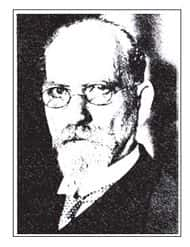
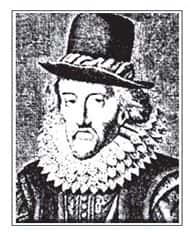

人有理性，自然就会思想。然而，思想造成的结果不仅千差万别，并且难以预料。我们经常会觉得，虽然大家都是属于“人”这一类，但是彼此沟通的时候却又困难重重，不知道问题出在哪里。

本章提出四种思想方法：逻辑、语言分析、现象学、诠释学。这四种思想方法各有不同的对象及目的，若能善加应用，人的思考将更为清晰，更容易找出问题的关键，也更有益于沟通与处世。

# 逻辑（运思的规则）

逻辑就是运思的规则，规则是客观的，人一旦开始思考，就会希望能够合乎逻辑。

究竟什么是逻辑？传统逻辑主要讨论三种内容：概念、判断、推论。以下试作一个简单的介绍。

## 概　念

“概念”是指我们平常使用的名词，譬如太阳、月亮、花、草、树木等，任何可以想得出来的名词，都称为概念。谈到概念的时候，必须将“意义”和“意象”分辨清楚。

由此可知，每个人对概念都会有一些经由自己主观经验所形成的特殊意象，很少有人能够完全避开意象，专门就意义的部分与别人沟通。然而，学习逻辑首先就必须试着把意象放在一边，仅仅就概念的意义来与别人进行思想上的交流，因为意象会带来个人的种种情绪与反应，以至于很难达成交流的效果。

不同的人对于同一个概念的意象会有相当大的差别。举例来说，外国人听到龙（dragon）这个字会觉得很恐怖，因为在《圣经》的故事中，龙是蛇的变形、人类的敌人，会诱惑人类犯罪，因此西方人认为龙是恶魔的化身。然而，对中国人而言则不是如此，因为在中国古代的社会中，通常认为龙是吉祥的象征，天子就称做龙。其他的概念也常常会有意象上的差别，因此在和别人沟通时，首先必须区分概念的意义和意象，才能够进行有效的思考。

## 判　断

两个以上的概念结合在一起，会形成“判断”。

以西方来说，有一个最基本的判断模式是“A=B”（A就是B）。A代表主词，B代表述词。举例来说，在“台大学生都是好学生”这个句子当中，“台大学生”和“好学生”分别各是一个概念，而通过“是”或“不是”把这两个概念连接起来，就形成了一个判断，因此“台大学生都是好学生”这个句子就是一个判断语句。任何一个完整的想法或语句，都是一个判断。判断又称为命题，表示当人把主张表达出来之后，就变成客观命题，可让他人看到、听到，甚至可以研究真伪。

判断总共分为四种：全称肯定、特称肯定、全称否定、特称否定。在国际通用的符号中，分别以A、I、E、O四个字母来代表这四种判断。因为拉丁文的“肯定”是affirmo，所以用A与I代表肯定句；因为“否定”是nego，所以用E与O代表否定句。各取这二字的前面两个母音来界定。

全称与特称均针对主词而言，全称即“所有”、“全部”，特称即“有些”、“某一些”。以之前所举的“台大学生”与“好学生”为例，A、I、E、O四个命题分别是：

※ 全称肯定（A命题）：所有台大学生都是好学生。

※ 特称肯定（I命题）：有些台大学生是好学生。

※ 全称否定（E命题）：所有台大学生都不是好学生。

※ 特称否定（O命题）：有些台大学生不是好学生。

我们讲出来的任何一句话都可以还原到最基本的判断，而这个判断必然属于A、I、E、O四个命题中的一种。

## 推　论

推论就是从既有的判断推衍出新的判断。在逻辑上称为推论，在我们的思想中则称为推理。以下要介绍三种推论方式：直接推论、三段论法、两难推理。

（一）直接推论

直接推论是最简单的推论方式，共有三种形式：A → I，I → I，E → E。由A命题推论时，主词与述词互调后，只能推论为I命题，而不能推论为A命题，举例来说，若要从“所有台大学生都是好学生”这个句子推出一个新的命题，则必须推论为“有些好学生是台大学生”，而不能推论为“所有好学生都是台大学生”；I命题则仍然是推论为I命题，譬如“有些台大学生是好学生”，可以推论为“有些好学生是台大学生”；E命题亦是推论为E命题，譬如“所有台大学生都不是好学生”，可以推成“所有好学生都不是台大学生”。

O命题则无法作直接推论。也许你会感到怀疑，因为在“有些台大学生不是好学生”这个句子中，似乎也可以将其推论为“有些好学生不是台大学生”。若举其他的例子，譬如“有些人不是好人”这个句子，就无法将其推论成“有些好人不是人”。由此可知，O命题是不能直接推论的。

直接推论看似没有太大用处，事实上并非如此。举例来说，在《论语》中有这样一段话：“子于是日哭，则不歌。”（《论语·述而篇》）意思是：老师在这天哭过，他就不再唱歌了。我们可以把这句话推成：老师在这天不哭，他就“可能”唱歌。也就是说，“老师今天哭，就一定不唱歌”并不代表“老师今天没有哭，就一定唱歌”，然而，可以肯定的是，“如果老师今天唱歌，那就代表他一定没有哭”。换句话说，“老师今天哭，就一定不唱歌”是一个E命题，它可以推出另一个E命题，即“老师今天唱歌，就一定没有哭”，但却不能推出“老师今天没有哭，就一定唱歌”。

由这句推论可以想见：孔子是感情丰富并且懂得自得其乐的人。孔子为什么常有机会哭呢？因为他的职业是为人办丧事，譬如，《论语》中说“子食于有丧者之侧，未尝饱也”（《论语·述而篇》），又说“丧事不敢不勉”（《论语·子罕篇》）。眼见别人的痛苦，孔子也会同感悲伤。另一方面，“子与人歌而善，必使反之，而后和之”（《论语·述而篇》）。孔子若是某日没哭，就很可能找学生一起唱歌，自得其乐了。从这些资料去认识孔子，就不会以为他是个老学究了。

（二）三段论法

所谓的三段论，是指大前提、小前提、结论，譬如：“凡人皆有死”（大前提），“苏格拉底是人”（小前提），所以“苏格拉底会死”（结论），这就是三段论法。

三段论看似很容易，但其中也会有些陷阱，举例来说，从“黄牛吃草”（大前提），“张三是黄牛”（小前提），推论出“张三吃草”（结论），看起来似乎很合理，但这个推论其实是有问题的，因为在这个三段论中，“黄牛”这个概念是歧义的：大前提中的“黄牛”指的是一头真正的黄牛，小前提中的“黄牛”指的却是倒卖电影票的“黄牛”。因此，虽然大小前提看似没有问题，但整个推论却是有问题的。这说明了，我们在运用逻辑思考的时候，概念必须准确，而不能够有歧义（一个概念有两个不同的意义）。[1]

（三）两难推理

这是指两方面的立场看似都能够成立，结果则是流于诡辩。举例来说，古希腊时期有一位哲学家毕达哥拉斯（Protagoras），他是辩士学派的代表人物，专门教别人如何辩论。有一次他看到一个年轻人，资质非常优秀，就要这个年轻人跟着他学习辩论。这个年轻人家境清寒，毕达哥拉斯特准他学成之后再交学费，他与这个年轻人约定说：“你毕业之后去和别人打官司，如果打赢就代表你学成了，那时候就要付学费给我；如果打输就代表没有学成，也就不需要付学费了。”

这个学生毕业之后，打赢了很多场官司，但就是不肯交学费。最后毕达哥拉斯对这个学生说：“我现在要去告你，如果法官判决你胜诉，那么按照我们的合约，你应该付我学费；相反，如果法官判决我胜诉，那么按照法官的判决，你也应该付我学费。因此，无论法官判决你胜诉或者我胜诉，你都应该付我学费。”这个学生听了以后回答：“如果法官判我输，那么按照我们的合约，我不需要付你学费；相反，如果法官判我赢，那么按照法官的判决，我也不需要付你学费。因此，无论法官判我输或者赢，我都不需要付你学费。”事实上这是一种诡辩，而两难推理也的确很容易有这样的情况出现。

再举个例子来说明两难推理：据说有一些伊斯兰教徒在中世纪时曾经占领一座图书馆，并下令把里面的书全部烧掉，因为他们认为，书中的内容要不就是真理，要不就是异端。如果书中的内容是真理，那么就和《古兰经》一样，既然已经有了《古兰经》，那么就不需要这些书；相反，如果书中的内容是异端，那么更是非烧不可。因此，无论这些书是什么样的内容，都必须被烧掉。类似的观念与做法，在其他宗教中也可以找到例证。

以上所介绍的就是逻辑，也就是思考的规则。如果想进行比较精确的思考，那么从概念开始就要尽量减少意象的干扰，掌握概念的意义。接着作判断的时候，则必须分辨：这是A、I、E、O中的哪一种判断，它能够如何推论、如何转换？这些都是重要的基础，如果能够纯熟运用，就可以轻易应付生活上的一些问题及挑战。

我有一个朋友结婚十年，有一天大家聚在一起，他的太太开始抱怨，说他结婚十年以来从来不洗碗。这个朋友于是慢条斯理地拿了一本笔记本出来，说：“我在某年某月某日洗过一次碗。”如果按照逻辑来说，他的反驳是有效的，因为“从来不洗碗”是一个全称否定命题，只要有一次例外，就不能成立。就好像如果要反驳“台大学生都是好学生”这个命题，只要找出一个不是好学生的台大学生，就能够让这个命题无法成立；同样，如果要反驳“台大学生都不是好学生”这个命题，只要找出一个是好学生的台大学生，也就能够使这个命题无法成立。

由此可知，说话的时候首先要注意逻辑上是否有效，这是一个最基本的训练。也可以加一些修饰词，譬如：大概、或许、差不多、好像、似乎等，这样自己表达出来的意思就不会太过极端，而产生语病。我有一个朋友到意大利旅行了三次，三次都被偷，因此回来的时候讲了一句话：“意大利人都是小偷。”当然，意大利有很多小偷是事实，但怎么可能“都是”小偷？人们说话常喜欢使用一些全称命题，因为这样比较具有煽动的效果，能够让别人注意到自己所要强调的内容。然而，在这同时却忽略了逻辑上的有效性。

# 语言分析（表达的效应）

语言的重要性，在于它不只是日常生活中为了沟通而使用的工具，事实上，人是在语言里面出生及成长，语言的影响远超过我们所能觉察的。当代西方的文学、哲学等方面，都跟探讨语言对人的影响脱离不了关系，也因此语言分析变成一个复杂而又重要的题材，无论是结构主义、解构主义，乃至于后现代主义，都和语言的使用有关，诠释学就更不用说了。

本章的主题是思想方法，因此在此只介绍语言最简单的部分，也就是语言的使用。

## 语言的有效性

语言的目的是为了发挥表达的效应，表达需要具有明确、一致、普遍这三项条件。

（一）明确

所谓明确，是指使用语言的时候，字义与文法必须非常清楚。我在德国学习德文的时候，非常辛苦，因为德文的表达与英文有很大的差异，譬如德文的否定词是放在句子的最后，因此有时候听别人讲话听到最后，才会发现对方所要表达的是一个否定的态度。这就说明了，语言使用的文法必须非常明确，否则就无法达到沟通的效果。

举例来说，我在修理电灯时，对你说：“帮我拿工具来。”可是我并没有说要拿什么工具，你怎么知道我在说什么？这就是表达不明确所产生的问题。相反，我如果说：“给我一个螺丝起子。”那么你立刻就知道我在说什么，可能还会反问我需要多大的螺丝起子。再举个例子，我现在宣布：“星期四我们要上课。”但却没有说几点钟，也没说哪间教室，那么要去哪里上课呢？因此，平常讲话时要尽量明确，这是语言表达的第一个要素。

（二）一致

语言表达的第二个条件是要一致，亦即使用语言的每个人都要同意。以开车为例，在台湾地区开车要靠右边，这就是一致。如果有人靠左边，就一定会发生车祸。有一个故事可以说明一致的重要性：有一名印度人准备到英国去留学，心里非常兴奋。由于在印度开车是靠右边，而在英国开车是靠左边，这名印度人想要先适应一下英国的开车方式，于是开始在印度靠左边开车，最后发生车祸，连英国都去不成了。

同样，使用语言也需要一致性，不能出现不同的规则。有些著作不易理解，因为在同一句话中的同一个字，意思就可能不同。譬如，号称难懂的《老子》，一开头就说：“道，可道，非常道。”在此，第一个“道”字是指“究竟真实”，第二个“道”字是指“言语叙述”，第三个“道”字加上了“常”字，又回复为第一个“道”字。如此一来，当然使读者摸不着头绪了。

（三）普遍

语言表达的第三个条件是普遍，亦即除了意思要一致之外，还要同一地区所有的人都去使用。

以上是语言表达时简单的规则，如果我们不了解一种语言的规则，就可能会闹笑话。

## 语言的类型

我们经常使用的语言可以分为四种类型：直述、比喻、价值、恒真。以下分别加以介绍：

（一）直述语句

直述就是直接叙述，也就是把看到的东西，或是想要表达的意思直接说出来。例如，“现在外面在下雨”就是一句直接叙述，不带有任何比喻或是个人意见，至于这句话是不是真的，只要到屋外看看就知道了。又如：“天空是蓝色的”“树叶是绿色的”“这间教室很多人”。这些都是直接叙述，不牵涉到其他任何因素。

（二）比喻语句

我们每天与人讲话的内容如果都是直接叙述，久了就会觉得相当乏味，因此平常使用语言的时候，常会采取一些比喻的方式。比喻语句就是使用一些象征来表达意涵，如“母亲像月亮一样”就是一种。当然，相同的比喻用久了以后会变得习以为常，而丧失了原来的韵味，所以第一个说“母亲像月亮”的人是天才，之后的人跟着使用相同的比喻，最后变得一点创意都没有，就是因为这个比喻已经被用得过于泛滥了。

艺术创作的挑战，是要能够提出新的比喻或象征，让别人能够清楚掌握你想表达的事情。譬如我现在说：“我们的国家像一条船一样，需要一个有力的舵手。”这句话每个人都听得懂，也都知道是一个比喻用法，并且相当生动地传达了我所想要表达的意思，亦即我们在同一条船上，有着共同的命运，而领袖就如同操舟的人，是要负责掌握方向的。

日常对话中用到比喻是非常自然的，而且比喻的生命力远超过直接叙述的范围，很容易感动人心，所以无论是宗教界、教育界或哲学界中的第一流人物，也都喜欢使用比喻的方式来表达，譬如释迦牟尼曾将人间比喻为火宅。这种比喻确实相当生动，说明了人的欲望就像是火，无时无刻不在煎熬着自己。同样，孔子、孟子、耶稣等，也都善于使用比喻来宣扬他们的想法。[2]

直接叙述一般离不开当时的时空条件，一旦离开之后所要表达的内容就落空了，而比喻如果使用得好，就可以传之久远。由此可知，比喻的效果远远超过了直接叙述。

（三）价值语句

价值判断不能离开主体，因为有“我”，是我在说话，因此这句话就和别人说的不一样。换言之，相同的价值语句，每个人说出来的含义却可能不同，这全视对话双方的关系或互动情况而定。举例来说，同样是“你好吗”三个字，却可能有各种不同的意思，而这个意思只有对话的两个人知道：假设一个朋友失业，你问他“你好吗”，可能是在问他是否找到工作；假设一个朋友生病，同样的“你好吗”三个字，可能是在问他病好了没有；假设一个朋友今天要考试，“你好吗”则又可能是问他准备好了没有。由此可知，相同的问句，所具有的意义却是不同的。这就是价值语句的特色。

（四）恒真语句

恒真语句的表达方式是“重言式”，即套套逻辑，是指主词与述词一样（A是A），譬如英文中有一个短语叫做“Business is business”（公事公办），这就是属于套套逻辑。

套套逻辑并非没有意义，在这里就用个小故事来说明：美国很多大城市都有中国城（China Town），老外也会去那里。当一个老外在路上走着走着，看到一个人随地吐痰，于是说“Chinese is Chinese”，这时候这句话显然带有某种批评的意味。接着他继续往前走，看到一个年轻人扶着老太太过马路，于是又说“Chinese is Chinese”，这时候这句话可能变成一种称赞，在赞美中国人敬老尊贤的美德。由此可知，套套逻辑并不是没有含义的。

我们平常讲话也会重复同一个字，譬如“你果然是你”。这句话意味着你这个人有基本的原则与个性，只有你能够符合你自己的要求。

每个人都必须使用语言才能生活，而我们也生活在语言之中。语言对一个人的影响之大可以想见。我在美国的时候，发现有些华人家庭每到周末就会开车载小孩到学校，借一间教室上中文课。我觉得很好奇，于是请教一位朋友为什么要让小孩学中文，因为当初他们自己到美国的时候，是恨不得英文能够讲得比中文好。这位朋友告诉我，如果小孩只学英文不学中文，言行就会跟美国人一样，甚至在父母年老时把他们送到养老院，因此他们坚持要让小孩学中文。

由此可知，语言绝对不只是工具而已，其中还包含了许多价值观念、文化特性，因此在学习某种语言时，自然就会受到其中思想的影响。举例来说，中国传统文化强调孝顺的重要性，中文里面经常会提到“孝顺”这一词，英文中则没有“孝顺”这个词[3]，因此小孩学习中文时，在潜移默化之下自然就会比较孝顺了。

这是一个重新建构意义的时代，而意义存在于语言之中，语言自然变得非常重要了。然而语言如何具有意义呢？一定需要人的使用，因此构成了一个互动的循环：有人使用语言→语言具有意义→有意义所以需要表达。因此，在当代文化史的研究上，语言这个题材占有关键的地位。

# 现象学（辨物的策略）

现象学是辨物的策略，想分辨一样东西到底是什么的时候，就需要现象学。关于这门学问，要先从相关的背景谈起，然后再说到当代现象学的代表学者——胡塞尔（Edmund Husserl，1859—1938）。  

胡塞尔  
Edmund Husserl  
1859—1938

德国哲学家，一生致力于推展现象学。其重点在于方法上，透过对“现象”的描述，找到一物之“本质”。他的信念是：哲学必须建构为一门严格学问，亦即把哲学当成人类知识的共同方法。其所谓核心观念是“意向性”，指出人的意识及其对象同时呈现，因此不宜主张唯心论，由此避开自笛卡儿以来的唯心论倾向。胡塞尔有“现代哲学之父”的雅号，原因正在于他由“方法上”打开了新的局面。当代的存在主义与诠释学，皆深受其启发。  

## 打破四种假象

近代英国哲学家培根（Francis Bacon，1561—1626），提出一个著名的观念，叫做“打破假象”。意思是：每个人心中都有一些假象或偶像，这些偶像会竖立在我们前面，使人无法从事正确的思考。培根认为我们要打破的假象有四种：种族、洞穴、市场、剧场。以下分别介绍之：  

培根  
Francis Bacon  
1561—1626

英国哲学家，也是法官与杰出作家。他以《新工具》一书，提倡归纳法，肯定经验材料是知识的基础，由此建构人类文化的发展。近代英国哲学以经验主义为主要立场，培根实为先驱人物。他的“打破假象”之说，意在排除人们习以为常的成见谬说，再重新建构真实可靠的知识。他的思想并非本节所谓的“现象学”，但是基本态度相似，值得我们参考。  

（一）种族假象

把人类种族的需求，当做惟一的判断标准，认为宇宙万物都是为了人而存在的。譬如说：苹果之所以这么红，是为了要引起人的食欲；猪之所以这么肥，是为了要提供我们营养；狗之所以会叫，是为了要替人看门；太阳之所以会出来，是为了要照耀人们。这种认为宇宙万物都是为了人而存在，一切的价值都是以人为准的想法，就称做种族假象。

种族假象会使人类变得过于主观，甚至形成人类中心主义。但是一般人很容易犯这种错误，因为人本来就是以人作为基础来思考各种问题。同时，种族假象会使得某些难题无法得到解释，就以蚊子来说，蚊子到底有什么用？它对人类而言并没有什么好处！由此可知，有些生物的存在并不是为了人类才被创造出来的。

（二）洞穴假象

这是指每个人都好像是井底之蛙，思考受到限制。基本上这是无可避免的，因为每个人从小开始都有自己特定的生活经验，譬如我们在台湾地区出生、成长，所以在理解世界的时候，很自然会从台湾地区的角度来看，或是从美国这个强权主流国家的角度来看，实在很难超越这些限制，客观地衡量各种状况。

人虽然无法避免自己的限制，但是知道这些限制，就可以减少被限制的程度。当然，要完全摆脱是不可能的，如果有人宣称自己能够完全摆脱这些限制，那只是一相情愿而已。就好像一个人说：“我这个人最客观。”事实上这句话本身就不太客观了，顶多只能说：“我知道自己有主观的地方，所以作判断的时候会约束自己。”这反而是一种正确的策略，能够达到沟通的效果。

由此可知，要完全避免洞穴假象是不可能的，譬如我是学哲学的，因此在考虑许多事情的时候，很自然就会把哲学放在第一位。当然，把哲学放在第一位并非没有根据，因为哲学在西方中世纪称为“scientia scientiae”，意思就是知识的知识、学问的学问；而图书馆里面编号“1”的就是哲学类，它在传统思想中代表一个总和的、整体的学问。就这点来说，哲学确实有它特别的地方。

然而，我不致因此就认为自己是一个哲学主义者，一切都要以哲学为中心；果真如此，就会产生很大的问题。每个人都有自己学习及认识哲学的权利，不见得读哲学系的人领悟能力就比较高，因为其他人也可以通过自己的修养与体验而达到很深的哲学意境。更何况哲学并不是只有一种系统，你讲儒家，别人可以讲道家，此外还有各种不同的学派，这其中谁高谁低不是一句话就能够道尽的。

（三）市场假象

市场假象代表思考中混杂着许多传言或道听途说。台湾地区现在就处于这种情况，每个人仿佛都有某种程度的精神分裂症，明明是相同的一件事，经由不同的人叙述之后就产生各种不同版本。譬如现在电视新闻里充斥着各种八卦消息，这些八卦到最后往往变成“罗生门”（人的不可信赖性和不可知性）。版本看似很多，事实上答案只有一个，就是很多人不诚实；或者，即使不是故意不诚实，也是设法不去看自己不喜欢的部分，而选择性地下判断。如此一来，怎么可能达到沟通的效果？

若每个人都只看到自己想看的、听到自己想听的，跟别人既不能沟通也没有共识，最后就会变成各说各话。就好比市场充斥的各种传言，到最后像风一样，吹来吹去却不知道风从哪里来。

（四）剧场假象

剧场假象是指有一套完整的意识形态，这在哲学和宗教领域中可以找到许多例子。许多人一旦接受一套哲学或一种宗教信仰，就好像接受一出舞台剧，全套搬演出来，从此以后认为人生就是这样，这就叫做剧场假象。

譬如我说我是唯心论，你是马克思主义，而另一个人又是某某学派，这样一讲之后，就变成我们各自只以某个学说作为了解人生的唯一版本，就好像同一出戏码一样，只有一套演法。宗教信仰也是一样，当我们接受某一派宗教信仰之后，无论任何问题都会从这个信仰的角度来看，这就是剧场假象。

虽然活在这个世界上，不能不看别人演戏，但是更重要的是，自己要怎么演、怎么安排，还是有一定的选择空间。

培根的“打破假象”之说提醒我们，客观认识一样东西是十分困难的。后续的哲学家忙于建立自己的思想体系，而较少注意思想方法的问题。在这方面最有新意的是19世纪与20世纪之交的现象学。

## 胡塞尔的现象学

胡塞尔是当代现象学的代表学者，在此要介绍他思想中的三个概念：描述法、自由想像法、地平线法。

（一）描述法

描述法是指，如果想分辨一样东西，先不要认定它是什么，而要先作一个客观的描写。然而，描写是相当困难的，并且每个人对同样一种东西的描写可能不太一样。因此，必须把所要描写的对象直接凸显出来，周边的东西先存而不论，一样一样地排除，此时就要配合自由想像法。

（二）自由想像法

先举个例子：如果想要知道“人”到底是什么，那么可以问：“如果一个人车祸受伤，断了一只手，这样还算是人吗？”当然，这样叫做独臂人。接着继续问：“那么如果断了两只手，还算是人吗？”当然还算，因为这样叫做无臂人。相同的，断了一只脚叫做独脚人；就算两只手、两只脚都断了，也还是人。那么到底要到什么程度才不算是人呢？思考到最后，可能会认为如果没有头就不算是人了，因为我们从来不曾见过一个没有头的人。这就是自由想像法。

使用自由想像法去认识一个人时，也是如此，我们必须要问：“如果少了这项特色，他还是他吗？”现象学的目的就在于让人知道一样东西的本质。假设我们要了解一个人的本质是什么，首先就要把我们能够掌握的关于这个人的所有现象写下来，譬如：身高、体重、家世背景、读什么科系、成绩如何、有什么嗜好、参加什么社团等。写下来之后，开始使用自由想像法，亦即问自己：“如果他少了这一样条件，他还是他吗？”（如：如果他身高没这么高，他还是他吗？）按照这种方式把每个细节一一问清楚，最后我们会发现，其中有些条件是绝对不能少的，一旦缺少了这些东西，他就不再是他了（如：他非常勇敢、非常诚实等）。通常这些东西会跟一个人内心的价值观有关，而不是与外在条件有关。

由此可知，认识一个人的时候，不应该被外表所迷惑，因为外表很多条件都是可以去掉的。把这些外在条件去掉之后，内在特质才会凸显出来。如果没有经过这种现象学的思考过程，就很难发现一个人的本质真相，以至于容易被外表迷惑。

举例来说，电视新闻的主播一个个都很上相，每天播报新闻看起来好像很有见解，但是他们真的很明智吗？我曾经看过一个主播闹了很多笑话，譬如他有一次播新闻的时候，为了让观众知道他讲的是非常浅白的话，于是就念：“昨天在加拿大有一架飞机，因为某些事故在空中绕了七天之后降落。”事实上当时字幕上写的是“一周”，他为了让大家了解，径自把它改为“七天”，这真是一个笑话，一般的飞机怎么可能在空中绕七天？

这就说明了，判断任何东西的时候，不能只看外表，而要问：“什么是它的本质？”进而使用描述法与自由想像法去思考，如此才能发现真相。

（三）地平线法

那么，地平线又是什么呢？英文是horizon，有时候也翻译成“视野”或是“视域”。人看任何东西都有视域，而这个视域就是我们所能见到的世界。例如，当你走在原野上，看到远处有一根尖尖的东西，很像犀牛角，也很像是教堂的塔尖，但你不知道它是什么。就像我们有时候看电影，会看到一个人在原野上走了很久，看到远处有一个尖尖的角，不知道是什么，于是继续往前走。一定要走到一个临界点，在那一刹那才知道它到底是什么，而在还没有确定之前，真的是完全没把握。

人的认知也是如此，往往是从模糊到明显，而在这其中有一个临界点，当那一点出现的时候，你会有一种“啊，原来是这样”的反应。我们认识别人的时候也是如此，有些人彼此同学了十几年，到某一天才突然觉得：“唉，原来我到今天才认识你的真面目！”这时候你所认识的他已经不再是外表的印象，而是真正注意到了他的本质，这是相当不容易的。

# 诠释学（阅读的途径）

## 阅读的三种取向

诠释学（Hermeneutics）是阅读的途径，通常人阅读的时候会有三种取向：传统、个人、文本（text）。

（一）传统

我们读一段文章时，往往会受到自身“传统”的影响，因为传统提供了各种参考的立足点。没有人是完全客观的，任何人在开始思考、使用概念来表达的时候，都一定会受到自身的传统对语言的限制，然后影响到自己看事情的角度、方法和结果。例如，我们平常读书的时候，就很容易把儒家、道家的一些传统观念加在所阅读的材料上。

（二）个人

阅读的第二种取向叫做“个人”。每个人都有自己的成长经验，没有去过农村的人，觉得“农村”一词听起来有一种田园之美；而在农村成长的人，则不尽然认为如此。这就说明了，人们会从自己这个角度来阅读。同样一篇文章给不同的人阅读，每个人都会有不同的心得，也是一样的道理。

（三）文本

“文本”是指不要从传统或个人的角度阅读，而是要看文章本身写作的方式。以前的人读书讲求“以经解经”，譬如阅读《论语》时，就尽量不要用其他材料，而要用《论语》本身来解释《论语》。这就是一种文本取向的阅读方式，也是一种比较偏向学术性的态度。

当然，前面两种取向也不可或缺，各有其存在的理由，因为没有任何人能够完全摆脱传统文化与个人经验。重要的是，我们要知道自己的传统是什么，如此一来，就会有比较明确而清楚的立场。知道自己的立场之后，就能够了解有什么优缺点。此外，还要懂得自我批判，也就是说，尽管我们有自己的立场，但要知道这并不是惟一的或普遍的立场。如此一来，当别人的意见跟自己不一样的时候，就可以知道原因，而不会引发直接的冲突。

## 阅读的四个步骤

阅读一篇文章时有四个步骤：（一）文本“究竟”（did）说了什么？（二）文本“想要”（would）说什么？（三）文本“能够”（could）说什么？（四）文本“应该”（should）说什么？

（一）文本究竟说了什么？（What did it say?）

读到一篇文本时，如果是翻译书或文言文，则要把原文研究清楚，如果连原文的字句都不够清楚，读了半天最后发现是版本有问题，那么之前花的工夫也就没有用了。所以在阅读文本时，第一步就要先弄清楚，它字面上在说什么。

（二）文本想要说什么？（What would it say?）

一句话之所以会被作者写出来，背后一定有一些相关条件。举例来说，如果一百年后有人要研究中国台湾文化，会发现台湾地区很多文章中都出现“两岸关系”这个词汇。事实上中国台湾本身怎么会有两岸呢？那么所谓的“两岸”究竟是指什么？

当然，我们现在写到“两岸”时不需要特别解释，大家都很清楚了解作者所要表达的，这就是一个时代的共识。任何一个时代都会有一些基本共识，而这可能是将来的人所无法理解的。又譬如，几十年后的人随便看一张现在的报纸，发现里面提到了“9·11”，他可能就无法了解这代表了什么意思。

同样，同一个圈子里面的人彼此谈话时，会有很多“意在言外”的情况，亦即话中虽然没有明白地说出来，但是意思却表达出来了，而这是局外人无法了解的。因此，在研究一篇文章的时候，必须注意到作者是谁，生平背景如何，当时有些什么思想等，因为相同的话从不同的人口中说出，意思可能有很大的差别。

（三）文本能够说什么？（What could it say?）

中国有一部书《十三经注疏》，对中国古代的经典有很详细的注解。以《论语》为例，原文只有小小的一本，但是注解却有一大本。我曾经仔细研究《论语》的注解，历代以来至少有四百多家注解，原文每一句话至少都有五六种讲法，而每一种讲法都有些道理。这就说明了，每一句话都是有生命的，它能够通过不同时代研究者的心得而表现出来。

不同的人读同一本书，往往会得到不同的理解，特别是人文方面的书籍。譬如一篇莎士比亚的作品，就有各种不同的解释，所以这些解释都代表可能性，而人类思想的特色之一，就在于把这些可能性表现出来。

有时候奇怪的是，连原作者都不完全清楚的意思，却能够被别人发现，譬如台湾地区有位作家郭良蕙，写了许多言情小说。她写小说的那个年代，台湾地区的社会风气还很封闭，往往只有圣诞节的时候才有舞会。而这位作家在写作时，经常描写圣诞节舞会作为故事开场，男女主角在舞会中认识，发生恋情，过程轰轰烈烈，最后以悲剧收场。后来有人研究她的小说，说她的小说是以圣洁的信仰作为开始，有着宗教的仪式，其后渐渐发展出各种复杂的关系等，分析得非常深刻，就连郭良蕙本人看了都很惊讶，因为她自己也没有发现自己居然有这种想法。

我们可以说：当原作者说出了一句话之后，那句话就已经离开了他这个主体，而变成大家都可以阅读的共同材料。至于阅读后产生的理解，则要视个人程度如何而定。例如，孔子曾说：“吾十有五而志于学，三十而立，四十而不惑，五十而知天命……”（《论语·为政篇》）只要读过《论语》的人，都知道这句话是什么意思，但是否真正能够了解其内涵？因为大部分人恐怕只明白字面的意义。譬如我现在问：“什么叫做没有迷惑？”——如果自己本身都做不到没有迷惑，又怎么可能了解什么是没有迷惑？所以在解释这句话的时候，要知道自己的限制。

此外，人对于文本意义的掌握，往往是不断扩充的，譬如你十年以前读《红楼梦》，跟十年以后再读，一定有不同的体验。如果体验完全一样，代表你这十年来完全没有进步。

这也说明，任何一本书都是有生命的，而读者可以将人生的体验与书中描写的情境互相对照，甚至是彼此启发、互相印证。所以，“它能够说什么”所包含的，就是无穷的可能性。

（四）文本应该说什么？（What should it say?）

当我们读完一篇文章时，终究还是要表明自己所理解的立场，判断到底哪一种说法才是对的，而不能保持中立。举例来说，许多人在争论孔子到底有没有信仰，有些人就用《论语》中“未知生，焉知死”“未能事人，焉能事鬼”（《论语·先进篇》）这两句话来说明孔子对死亡不了解，或者是没有兴趣，因而认为孔子对鬼神是采取不可知论的立场。这就是一种解释或一种观点。事实上，如果仔细研究，会发现《论语》中“死”这个字总共出现了三十八次，而“生”这个字也不过才出现了十六次，我们怎么能轻易判断孔子不了解死亡呢？

总而言之，无论是在理解古代经典或是现代人写的文章时，都必须去问：“它究竟说什么？想要说什么？能够说什么？应该说什么？”到了“应该”说什么这一步，就必须提出个人的见解。亦即要根据之前的“究竟”、“想要”、“能够”，最后判断出“应该”说什么，这一部分是我们必须自己负责的。

# 结论：心智成长的方法

本章对逻辑、语言分析、现象学、诠释学这四种方法简单作了介绍，每一种方法都有特定的对象与目的，使用时要考虑何者适宜，并在运用时互相搭配。

逻辑是运思的规则，这种规则性的训练让我们在判断一个人讲的话是否合理时，不止要看它是否符合事实，还要看它在形式上是否合乎逻辑的要求。

语言分析是表达的效应。人类的沟通要靠语言，但是语言究竟能够让人沟通到什么程度，则是到现在都难以回答的问题。《庄子·秋水》里面有一段故事很有趣：有一次庄子和惠施在桥上看鱼，庄子说：“鱼真是快乐啊！”惠施听了以后质疑他：“你又不是鱼，怎么知道鱼很快乐？”庄子回答：“你又不是我，怎么知道我不知道鱼快乐呢？”惠施于是说：“是啊！我不是你，所以不知道你是不是知道鱼快乐；而你不是鱼，所以你也不应该知道鱼是不是快乐。”庄子最后回答：“让我们回到开头讲的话，当你听到我说鱼快乐时，就知道我知道鱼快乐。至于我怎么知道鱼快乐呢？我站在这里一看就知道鱼快乐。”[4]

事实上，庄子知道语言的表达难免有其限制，譬如我现在很痛苦，但可以告诉别人我很快乐；我现在明明很快乐，但却可以告诉别人我很难过。由此可知，人用语言所表达出来的不见得是真相。至于人是否能够与其他生物沟通呢？应该可以的。有生之物皆有感受能力，有感受就会产生情意，有情意就可以相通。因此当我们看到鱼在水中悠游时，说鱼很快乐，有什么不对？这说明了，在正常情况之下，人与宇宙万物是可以相通的，而语言在这时候只是一种不太完备的工具而已。

所谓“此时无声胜有声”，有时候不说话所表达出的情意远超过说话；相反，有时候话说得越多，误会反而也越深。庄子十分清楚语言的限制，所以他说真正的好朋友见面时，应该是“相视而笑，莫逆于心”。

不过，虽然有所限制，语言仍然是重要而特别的，因为它是承载意义的主要材料，人不能离开语言而生活。

现象学是辨物的策略。如果我们想要真正认识一个人，不妨使用这种方法。当然，人是会变的，所以我们要知道他的“志向”，然后就能掌握到他改变的方向；相反，若我们不知道一个人的志向，那么看到他在改变时，就会觉得迷惑了。

最后一项诠释学，是阅读的途径。读书的时候要常常想：“我是不是读懂了？作者是这个意思吗？我所理解的是他想要表达的吗？”这时候我们就要借用诠释学的方法，分辨文本说了什么、想要说些什么，而这些会随着我们对作者的相关背景了解得越多，得到越深刻的体认。此外，当读者本身的经验日益丰富，也更能与文章互相呼应。每隔几年重读一本书，可以测量出自己在这几年之内心智成长的速度和方向。

人有理性，可以思想。即使没有人教导，也会从经验中自己反省，思考出一些观念。这些观念可以帮助我们安排生活，但是未必永远有效。因此，学习思想方法，是心智成长必要的一环。如何运思、如何表达、如何辨物、如何阅读，这四者配合起来，并且善加运用，相信不难抵达孔子所谓“四十而不惑”的境界。谈到“爱智”，必然也必须从这一步出发。

* * *

[1] “黄牛吃草”这个例子，违反了“名词只能有三个”的规则。以“凡人皆有死，苏格拉底是人，苏格拉底会死”为例，我们看到三个名词，分别称为小词（苏格拉底：指结论中的主词），大词（会死：指结论中的述词），中词（人：指联系小词与大词的名词）。类似的规则共有八条：

（1）名词只能有三个，即：大词、中词、小词。

（2）在结论里周延的名词，在前提里也必须周延。

（3）结论里不可以有中词。

（4）中词至少周延一次。

（5）两前提皆为否定，没有结论。

（6）两前提皆为肯定，结论肯定。

（7）结论随较弱的前提。

（8）两前提皆为特称，没有结论。

[2] 譬如，孔子以“岁寒，然后知松柏之后凋也”（《论语·子罕篇》）比喻人的德行在严苛的考验中，才能凸显出来。孟子以“火之始然，泉之始达”（《孟子·公孙丑上》）比喻人性向善的力量是难以抵挡的。耶稣以“聪明的管家”比喻人在小事上也忠于职守，才可蒙受神恩。

[3] “孝顺”在英文中，有时写为“filialpiety”意指“儿子的虔诚”，实在不易理解。

[4] 原文如下：

庄子与惠子游于濠梁之上。庄子曰：“鱼出游从容，是鱼乐也。”惠子曰：“子非鱼，安知鱼之乐？”庄子曰：“子非我，安知我不知鱼之乐？”惠子曰：“我非子固不知子矣；子固非鱼也，子之不知鱼之乐，全矣。”庄子曰：“请循其本。子曰‘汝安知鱼乐’云者，既已知吾知之而问我，我知之濠上也。”（请参考拙著《我读庄子》，上海三联书店出版）

