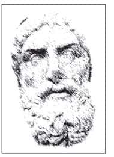
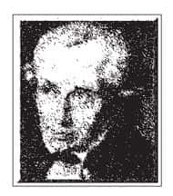
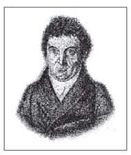
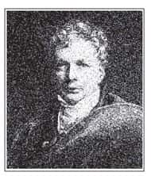

存在主义（Existentialism）是20世纪最有特色的思潮。此派的代表人物，各有主张，但皆不离人的“存在”意义，要人真诚而勇敢地面对自身，选择成为自己。

存在主义的影响力可以说历久弥新，这是因为其中某些见解，无论是在任何时代、任何社会，对人类都有相当明确的启发性。以下将分别介绍先驱人物：克尔凯郭尔（Kierkegaard，1813—1855）及尼采，以及代表人物：雅斯贝尔斯、海德格尔（Martin Hidegger，1889—1975）与马塞尔（Gabriel Marcel，1889—1973）。

# 克尔凯郭尔

讨论存在主义，可以从“存在”一词的特殊用法谈起，而第一位必须提到的人物就是克尔凯郭尔。

克尔凯郭尔是丹麦人，具有宗教性的家庭背景。他的父亲是一位牧师，从小就培养他，希望他从事这方面的工作。西方文化的精华，甚至可以说任何文化的精华，都体现在宗教信仰之中。无论人们的日常生活如何乏善可陈，都能够借由宗教信仰凝聚出深刻的文化传统。举例来说，在设计宗教建筑时一定希望它能够长久保存，因为它不是给人住的，而是给神或佛这种超越的神明居住的。也因此，人们会将这些建筑建造得金碧辉煌，借由这种具体方式来展示人类心灵的向往。

虽然克尔凯郭尔在宗教气氛的传统下成长，但是他不但不迷信，反而更深刻地去思考“什么是人生”这个问题。

克尔凯郭尔的父亲虽然是一位牧师，但是人生经验相当复杂，他安排克尔凯郭尔接受最好的教育，希望借此弥补自己的过失。严格的管教使克尔凯郭尔的性格显得早熟，与一般人格格不入。譬如，他在宴会上同别人聊天聊到最开心的时候，往往会忽然产生一个念头，觉得自己非常可耻，竟然与群众处得这么愉快。

克尔凯郭尔只有在离开群众的时候才觉得自己关怀群众，若是与群众在一起则会感到恶心不已。他认为群众基本上是“庸俗”的，聊天的话题总是离不开日常生活的衣食住行、流行娱乐。虽然，这其实是相当正常的事情，可是克尔凯郭尔对这些言论却非常不能忍受，他有一次甚至说：“每当我在宴会中和别人谈笑风生时，就会有一种冲动，想拿一把枪自杀算了！”因为他觉得这种生活充其量不过是在浪费时间，浪费生命。

## 存在是选择成为自己的可能性

存在主义的“存在”（Existence）一词本身，就是一个值得注意的题材，因为只有“人”有资格使用这两个字。如果我问：“桌子存在吗？椅子存在吗？”这个问题其实是没有意义的，因为无论你问不问这个问题，这些东西都是原来的样子，不会改变。宇宙万物之中，除了人之外，都没有资格使用“存在”这两个字，因为“存在”不只是一个名词，更是一个动词——“存在”不是死的，而是活的、有生命力的、能够自由地选择。换句话说，存在就是“抉择”，就是“选择成为自己的可能性”。

人在作选择的时候有两种可能，第一种是选择不成为自己，第二种是选择成为自己。第一种选择显然比较容易，在这种情况下我们习惯伪装自己、遮蔽自己内心真实的情感，扮演别人所期待的角色，而从来不作真诚的抉择，因为我们害怕真诚的抉择会让自己与他人发生冲突。

克尔凯郭尔把“存在”的概念从名词变成动词，凸显出“自由抉择”的内涵。然而他也认为，尽管在宇宙万物中，惟有人有资格使用“存在”二字，却很少人真正去使用。克尔凯郭尔曾经提过一个生动的例子作为比喻：人生就好像一个酒醉的农夫驾着马车回家，表面上是农夫驾马车，事实上是老马拖着农夫回家。因为农夫喝醉了，根本没有清醒的意识，然而老马识途，因此能够把农夫拖回家。

人的一生就犹如走在回家的路上，大部分时间都在昏睡之中。只有当一个人清醒的时候才能够决定自己真正要走的路，做真正的自己。因此当代很多议题，如“为自己活”、“做你自己”等，都是由存在主义启发出来的。

克尔凯郭尔提出“存在”这个议题之后，尝试以各种方式来表达。他本身是位作家，作品也具有文学性，相较于哲学著作容易让人望而生畏，他的表达方式显得更能够震撼人心，通过特殊场景、情节、人物的铺陈，让读者犹如置身在一种人与人的互动关系之中。

## 人生三绝望

克尔凯郭尔曾经订婚，却因为觉得没有人能真正了解他的内心而解除婚约，尽管未婚妻苦苦哀求，都无法改变他的决定。然而，他的未婚妻后来和别人谈恋爱，克尔凯郭尔又舍不得。由此可知，克尔凯郭尔内心世界所呈现出的是一种孤绝而特殊的状态，一般人确实难以亲近和理解。

克尔凯郭尔指出，人生有三种绝望：不知道有自我、不愿意有自我和不能够有自我。“绝望”看起来似乎是相当普通的两个字，但内涵却很特别。一般人谈到绝望时，可能会想到失业的绝望、落榜的绝望、房子倒塌的绝望等，事实上，这些都不能算是真正的绝望。真正的绝望是一种内在的体验，无关乎外在目标的达成与否。

（一）不知道有自我

这种绝望是指，一个人在世界上奋斗了许久，却不知道自己在追求什么。有追求代表有欲望，有欲望则代表一个人愿意激发内在潜能，朝着目标奋斗。然而许多人根本不知道自己要追求什么，也不知道追求什么才能得到真正的安顿，这是由于我们不知道有“自我”。

从小我们就被教导、被塑造来迎合社会的需要，学习如何追求成功。然而，这种成功是相当外在化的（拥有车子、房子、家庭……），人的生命绝对不应该只以这些为满足。因此克尔凯郭尔认为，如果人不知道有自我，庸庸碌碌过了一生，到最后也只是一场空，这样的人生没有什么意义。

（二）不愿意有自我

当一个人发现了自我之后，接下来必须问：“愿不愿意有自我？”有些人发现自我以后，却不愿意有自我，因为要独自面对自己不是一件容易的事。我们经常可以看到很多年轻人随时带着手机，让自己显得很忙碌，在校园里面一边走路、一边打电话，行色匆匆，似乎自己是很重要的人物。然而，真的是这样吗？其实很多时候不一定非这样不可。此外，有了自我，就意味着人必须开始为自己负责，而为自己负责的压力是非常沉重的。

庄子曾说：“泉涸，鱼相与处于陆，相呴以湿，相濡以沫，不如相忘于江湖。”（《庄子·大宗师》）意思是说，当泉水干了以后，鱼躺在陆地上，必须互相吹气湿润，让彼此都可以活下去，这时候鱼知道自己是鱼，却活得很辛苦。只有当鱼回到水中而忘了自己是鱼，才是鱼最快乐的时候。人却不一样，或许当人在群众之中而忘记自己是谁时，的确很快乐；但是这种快乐无法持久，因为群众的聚集总有散场的一刻，人最终必须独自面对自己。庄子的比喻中所说的“水”，是指道家的“道”[1]；而与群众相处时的热闹气氛，正是“相呴以湿，相濡以沫”，最后转眼成空。

我这么多年以来，一直很少参加应酬，就是因为我不喜欢散场之后孤寂的感觉。譬如，我们有时候和朋友聚餐，大家一起吃饭、喝酒相当开心。然而，正当所有的人酒酣耳热、高兴得忘我时，餐厅却到了该打烊的时间。这好像突然之间被浇了一盆冷水，发现原来所有的快乐都只是幻觉，之后又必须重新回到现实的世界。

一个人是否要成为自我，必须通过自己的选择。如果不愿意成为自我，也会感觉到绝望。（不愿意成为自我又能成为谁呢？）这就是“不愿意有自我”的绝望。

（三）不能够有自我

假设一个人愿意成为自我，努力做一个真诚的人，最后却发现不能成为自我，不能“有”自我（存在主义用到“有”这个字时，并非真的是指“有”，而是指“是”的意思），这时候常会觉得自己能力不够，而必须走很长的路来实现自我，因此会感到非常绝望。坚持走自己的道路，是非常孤单的，而坚持下去是否会有好的结果，更是未知数。

克尔凯郭尔是一个宗教信徒，因此他通过对宗教的信仰来面对这种不确定感。他曾说：“一个人如果不信神、不做宗教徒，还不如自杀算了。”这是因为通过宗教，能够让人作出抉择，并且活出特定的生命形态。

## 人生三阶段

克尔凯郭尔认为人生有三个阶段：感性阶段、伦理阶段、宗教阶段。

（一）感性阶段

一个人在青少年阶段往往会以感性为主，所谓“感性”，用一句话来形容，就是“今朝有酒今朝醉”。这句话用了两个“今朝”，是为了强调他不想昨天，也不想明天，而只看当下，现在。昨天发生的事已经过去了，悔恨又能如何？同样，即使我告诉你：“今天好好努力，明天就会有好的成果。”可是有没有明天呢？像台湾地区时常发生地震，谁知道自己是不是哪一天睡着就再也无法醒过来了？

由上述可知，感性阶段的心态是偏向享乐主义的。享乐并没有什么不对，但是必须先思考两个问题：

第一，享乐分为很多层次，若只把享乐定位在身体的、本能的需要，是属于较低的层次。因为人的生命有整体的需求，而感官的满足来得快、去得快，刺激必须不断增强，但是效果则会渐渐递减，到最后变成完全没有自我，活在一个官能的流动过程之中，这种享乐的背后实际上是痛苦。比较高境界的享乐不容易得到，但得到以后能够长久保持，而且这种快乐是内求于己，而非依赖其他的因素和条件。因为越是依赖外在的条件来满足，这种享乐就越没有保障。

西方有许多主张快乐主义的流派，譬如希腊时代，以伊壁鸠鲁（Epikouros，公元前341—前270）为主的伊壁鸠鲁学派（Epicureanism）。这个学派是典型的享乐主义，但是他们的主张是一种温和的禁欲主义。这是由于他们了解，唯有温和地自我节制，才能够长期保持真正的快乐。  

伊壁鸠鲁  
Epikouros  
公元前341—前270

希腊哲学家，立说主旨在于助人解脱对神明以及对后世的恐惧，由此带给人内心的平静。他认为，神明不会干涉人间事物，并且人死之后灵魂亦随之幻灭，所以人无须担心来世。他主张人生目的在于“快乐”，所以被后世称为快乐主义，但是他所谓的快乐不是放纵欲望，而是温和节制、平静安详地生活。  

第二个问题则必须考虑自己本身的性向，以及人生的目的。很多时候人要达成一个伟大的目标，必须经过许多痛苦的考验，尤其目标越高尚、越伟大时，过程就会越辛苦。牛顿说过：“天才只是长久的耐苦。”当一个人认定了值得奋斗的目标，了解那就是他的召唤（calling），而努力去拼凑属于自己的图案，他的人生才有意义，反之则不过消消散散地度过一生罢了。

感性阶段的特色是“外驰”，亦即“向外追逐”。这个阶段的人到最后会感到忧郁（melancholy），因为他们会觉得只有今天没有明天，而过去的自己又不再回来，因此生命好像落在中间，无所依恃。此时人们会开始思考：“为什么我会走到今天这一步呢？”这就如同置身在悬崖边，前方是一片迷雾，必须自己选择是否要“跃”[2]过去。若选择跳过去，就进入了伦理阶段。

（二）伦理阶段

此一阶段的特色是“向内要求自己”，把过去、现在、未来连贯起来，如此一来，生命就完整了。举例来说，如果我告诉所有同学下星期要考试，那么下星期一定要兑现这个承诺，否则就是没有伦理的观念。如果我下星期到学校，因为心情很好，临时决定不考试，固然皆大欢喜，但这样等于过去和现在没有连贯，生命无法完整。

然而，伦理阶段并不是终点，仍然要继续往上提升。我们在第三章曾经提过，七大罪中的第一罪就是骄傲，一个人有了道德之后，便很容易出现“道德上的骄傲”，好像政治人物在掌权之后，很容易出现一种民粹主义所造成的“权力的骄傲”，因为他们认为自己是人民选出来的，所以比别人高一等。然而道德的骄傲更为可怕，当一个人在道德上反省自己、肯定自己的时候（如没骗过人、没诽谤过人、没有杀过人等），便会开始产生骄傲的心态。

事实上，一个人在道德上不曾有过失，并不尽然表示他的道德水平真的优于其他人，有可能只是因为他不曾受过真正的诱惑和试探。例如，有人拿一份公文叫你签名，只要签了就可以赚一大笔钱，难道你的内心不会挣扎吗？换句话说，很多时候只是我们没有机会碰到这种事情罢了。

（三）宗教阶段

在现实生活中我们常常面临两难的抉择，或遇上道德的困境，这个时候则必须“依他”。本质上人的生命是脆弱的，而能力也是有限的，所以宗教里面的“依他”也是一种真诚的表现。

经过实实在在的反省，会发现自己的生命在很多方面非常脆弱；接受这个事实，并且认识宇宙之中有更大的力量，它是生命的来源，也是生命的归宿，如果没有它，人的生命根本不可靠，就如同风一吹过，芦苇就折断了一般。若人不运用理智去想得透彻，那么他的生命可以说是毫无价值、毫无尊严可言。

因此，这个时候我们必须问自己是否要“跃”过去——跳过去寻找一个“它”。这个“它”并不是指向外追求，而是找到了自己生命的基础，也就是诚心皈依了宗教信仰。

克尔凯郭尔为“存在”这两个字，揭示了新的意义，让我们思考的角度开始转变：把人的生命当做一种在每个刹那之间作抉择，选择成为自己的过程。存在是一个不断重复的过程，而这个过程所需要的就是“选择成为自己”，做一个真诚的人。所谓真诚的人，就是要对自己负责、忠于自己。

许多哲学家都说过类似的话，譬如孔子曾说：“匿怨而友其人，左丘明耻之，丘亦耻之。”（《论语·公冶长篇》）亦即，对孔子而言，把对一个人的怨恨隐藏起来，而在表面上做朋友，是一件令人不齿、不屑的行为。一个人要有所不为，才能够有所为，而这也正是存在主义所要警醒我们的一点。

# 尼　采

尼采是德国人，同样出身于具有宗教背景的家庭，家中信仰路德教派（基督新教）。然而尼采年纪很小就对宗教信仰产生怀疑，上大学之后更进而主张无神论，后来成为著名的无神论者。

尼采的身体不好，看来苍白而虚弱，但是思考相当深刻，看人时目光如刀，似乎能够穿透人心。尼采可称为是天才，二十五岁尚未拿到哲学博士时，已经被聘请为希腊文学的教授。然而他的哲学背景却使他同时遭受哲学界和文学界的排挤，再加上本身口才不好，个性又相当愤世嫉俗，导致他的教学生涯很不成功。他曾说：“听众是到教室来吃糖的。”又说：“真正伟大的哲学家，要到死后才会出生。”

## 上帝死了=重新估定一切价值

“上帝死了”是尼采最有名的一句格言，这句话的用意并不只是在批判基督教，而是有着“重新估定一切价值”（transvaluation）的意涵。

当时的人认为，西方文化不能离开基督教而存在，譬如一个人之所以有道德，是因为他信仰上帝。然而，这种宗教信仰在尼采所处的那个时代已经变得非常虚浮，大家都有信仰，却未能真正体现信仰的精神，宗教逐渐变得社会化。换句话说，上帝原本是道德的基础，然而人们的道德行为却都成了一种虚伪。人们虚伪的表现，也就证明自己所信仰的上帝是假的上帝。因为如果信仰的上帝是真的上帝，如果上帝是有生命的，则人不可能有这样的行为表现。

尼采看不惯这种打着宗教或上帝名号的虚伪浮夸，所以宣称“上帝死了”。他曾经写过一个比喻：有一个疯子，大清早提着灯笼在市场里面到处走动，有人问他：“为什么大白天提着灯笼？”他回答：“白天吗？我觉得是黑夜啊。上帝已经死了，宇宙一片漆黑，我什么都看不到，只能拿着灯笼到处去寻找上帝。”由此可知，许多人以为世界是充满光明的，然而，用眼睛看到的光明并不是真正的光明。

尼采说过：“哲学家是文化的医生。”哲学从理性探讨宇宙与人生的根本真相，从而指引现实生活、评估文化生态。文化氛围好像空气一样，当文化生态出现问题时，就会让生活在其中的人陷入价值错乱的困境。举例来说，现代人所尊敬崇拜的，大多是功成名就、升官发财的人，亦即不择任何手段，达到表面上所谓有“成就”的人。这种价值上的选择本身就有问题，因为它并未掌握到人所崇拜的对象应该是什么样子。值得崇拜的对象应该是拥有完美人格的人，这才是一种正确的价值观[3]。然而，现在却很少人崇拜人格高尚的人，因为人格高尚很难做到，并且就算做到了也没有什么实际利益。

尼采“上帝死了”的想法其实是经过深刻的反省，正如我们所知道的，如果没有信仰，也就无所谓背叛。因此，背叛耶稣的人正是基督徒，而背叛释迦牟尼的人也正是佛教徒。由此可知，宗教本身未能使信徒免于人性的弱点，因而遭致批判。宗教本质上都有很好的理想，而宗教的致命之处其实就是人性的弱点利用宗教表现出来的结果。

## 权力意志：超人

尼采哲学的另一项重点就是“权力意志”（the will to power）。这里的“权力”并不是指政治权力，而是一种广义的权力。举例来说，台湾大学由于历史悠久，有些围墙很老旧，许多小草长在砖石之间。墙上怎么会有小草？这是因为小草有生命，它不管在任何地方都要凸显自己生命的力量，扩充自己的影响力。这就是一种权力意志的表现。

通过这种方式去了解尼采所说的权力意志，不太会有误解。在他看来，宇宙里任何生命，只要存在，就会表现自己本身的生命力，而权力意志所指的就是这种生命力扩张的状态。

这种哲学思想放在人的身上，演变成一种“超人”（Overman）[4]。

尼采认为，人类只是桥梁，一边是动物，一边是超人，而人的生命应该从动物这一边走到超人那一边。这种思想深受达尔文进化论的影响。达尔文认为宇宙万物都是进化而来的，最后不知为何出现了人类。无论地球的历史有多少亿年，像我们这样的人类只不过存在了两万多年。因此我们要问：“经过几十亿年的演化，最后两万多年才出现人类，那么人类有没有权利、有没有资格说自己是万物之灵，并且宣称进化到此为止？”毫无疑问，人类当然没有这种权利，因为我们只是演化过程的一个环节。因此，我们应该接着思考：“人类将会演变成什么样的新物种？”尼采的答案就是“超人”。

这种思考是合理的，我们不妨如此推想：在人类出现之前，地球上最先进、最伟大的生物是灵长类，也就是所谓的猩猩族群。曾几何时，这些动物因为人类的出现而被关到动物园里面。如果照这种方式往未来推衍，人类的命运可能会和猩猩一样，而我们的后代可能也被关到动物园里面了，因为一种更新的物种出现，叫做超人。换言之，超人之于我们，可能像我们之于猩猩一样。当然，我个人不太相信会发生这种情形，但是尼采从另外一个角度思考，也值得参考。

尼采还将“超人”比喻为一个人在“走钢索”，也就是说，他必须接受各种考验。尼采之所以被列为存在主义的先驱，便是因为他的思想凸显了这种个人生命中“自我负责”的部分。他认为，一个人若是只活在群众之中，不能算是真正的“人”，要做一个人，应该设法做个“超人”。所谓的“超人”是指：一个人活在这个世界上，要对生命充分肯定。亦即，要把生命潜能完全实现出来。生命的潜能包括了“有形的身体”和“无形的精神”两方面。尼采曾经举一个例子，他认为真正的“超人”可以用两个人的结合作为代表，这两个人就是拿破仑（Napolèon Bonaparte，1769—1821）和歌德（Johann W. von Goethe，1749—1832）。拿破仑代表的是由身体开发出来，在有形世界获得的成就；而歌德所代表的则是精神方面，在无形世界的精神表现。

德国人对拿破仑有一种由害怕而崇拜的情结，因为拿破仑曾经横扫欧洲，把德国（当时称为普鲁士）整个占领，强盛的姿态让当时的普鲁士人认为法文是一种优美而高尚的语言，德文则野蛮落后，然而，德国人由于被拿破仑占领而丧失的民族自信心，后来又因为康德、费希特（Johann G. Fichte，1762—1814）、谢林、黑格尔等大哲学家相继出现，而逐渐恢复。到了20世纪甚至出现希特勒（Adolf Hitler，1889—1945）这号人物。希特勒受到尼采“超人”概念的启发，不仅在墙上挂着尼采的照片，并以此为借口，消灭所谓的低等民族（如犹太人），这也使得尼采蒙上不白之冤。  

康德  
Immanuel Kant  
1724—1804

德国哲学家，著作以三大“批判”（《纯粹理性批判》、《实践理性批判》、《判断力批判》）而知名，开创了“批判哲学”的系统，也奠定了德国唯心论的基础。所谓“批判”，是指探究合理知识的“先验”条件，亦即知识“如何可能”的问题。

其生平关心四大难题：（一）我能够知道什么？（二）我应该做什么？（三）我可以希望什么？（四）人是什么？单单就其知识论的思考模式，就引起极大效应，亦即指出“物自身”不可知。人所知者只是“现象”。但是人的道德行动并非虚妄之物，由此接上“真实本体”，并且要求三大设定：人的自由、灵魂不死，以及上帝存在。  

费希特  
Johann G. Fichte  
1762—1814

德国哲学家，有主观唯心论之说。康德认为物自身不可知，费氏则指出人的“自我”属于知性直观，不需验证即可肯定，否则人无法进行任何思想活动。他在拿破仑占领柏林期间，发表《告德意志国民书》，提出“新教育”，强调新教育的本质即是道德心，“是完全为道德而讲道德，绝不是像从前那样把教育当做达到某种目的手段”。  

谢林  
Friedrich W.J. Schelling  
1775—1854

德国哲学家，有客观唯心论之说。所谓“客观”，是指他重新肯定了“自然”的价值。主张唯心论，当然以精神为惟一本体，但是精神的活动场域是自然，因此自然是“万事万物都活跃于其中的惟一生命体”。

他想了解神性创造力如何在“自然”中运作。他探讨艺术，因为艺术是绝对与相对之交会，是精神与物质的调和。他的最高目标，乃是借此回归于对神明的理解。  

## 精神三变

尼采提出精神有三变：骆驼、狮子、婴儿。他认为精神应该先变成骆驼，再变成狮子，最后变成婴儿[5]。

（一）骆驼

骆驼是“沙漠之舟”，刻苦耐劳，意味着人在年轻的时候要接受训练，承受传统的包袱。我经常在台北街头看到中学生，觉得他们真是非常辛苦，每天上学背着沉重的书包，有时候甚至要背两个书包。每次看到这种情形，我心里常会想：“他们现在是骆驼，这是人生必经的阶段，但是这样能保证他们将来变成狮子吗？”这是个很大的问题。

（二）狮子

骆驼与狮子的差别在于：骆驼必须听从他人的指导、接受他人的命令，所听到的是别人说：“你应该如何！”而狮子则是自己作决定、对自己负责，说的是：“我要如何！”每个人都经过骆驼的阶段，听从父母与老师的教训，告诉我们应该怎么做，我们无法反驳也无法反抗。然而，上了大学以后应该进入狮子阶段，也就是由自己来告诉自己该怎么做。

但是有几个年轻人真的知道自己要什么？怎么做才对自己有意义？这就是另一个新的问题。换句话说，骆驼虽然看起来很可怜，但是至少不用自己作决定，只要服从别人的指令就行了；相反，如果要成为狮子，就要承担自我，为自己负责。这一点的压力很大，因为当我们能够自由选择想要做的事时，同时也就丧失了寻找借口和抱怨的权利。

举例来说，学生考完高考之后选填志愿时，如果按照父母的希望去选择，至少就保留了一个将来抱怨的权利；相反，如果父母说：“你已经长大了，应该自己填志愿、自己负责。”这时候一般人会很苦恼，只好去问问同学，参观大学博览会，可是最后抉择的时候还是很痛苦，因为我们一旦决定了，也就丧失了找借口的权利。就算后悔，也不能抱怨，因为这是自己的决定！聪明的父母，应该让子女自己作决定，而对子女来说，在选择的那一刹那会觉得自己长大了，决定了以后也比较愿意为自己负责。

德国心理学家弗洛姆（Eric Fromm）在《逃避自由》（Escape From Freedom）这本书中曾经写道：“给我自由吗？千万不要给我自由！因为随着自由而来的是要负责任啊！我一有自由之后就自己作选择，选择之后就做我自己，但是我做不起啊！”这段话表达了类似的想法。

（三）婴儿

狮子阶段之后则到达婴儿阶段。婴儿意味着“完美的开始”，提供了所有的可能性。当一个人还是婴儿的时候，父母一定怀着无穷的想象，想象他将来可能成为科学家、工程师、医师等。每天看着他，也就给父母的人生带来了彩色绚丽的希望。当然，小孩成长的过程往往也是父母希望幻灭的过程，最后小孩让父母失望，就像父母曾经让他们的父母失望一样，人生就是这样一种不断重复的过程。

当一个人抵达婴儿阶段，就不会再遭遇到前面所说的种种问题，代表心灵重新回归原点，可以重新再出发。

# 雅斯贝尔斯

雅斯贝尔斯是德国人，也是生活体验比较特别的哲学家。雅斯贝尔斯患有先天性心脏病，从小就随时感受到死亡的威胁。他曾获得医学博士，后来担任心理学教授，再转任哲学教授。不过他对大学哲学教授颇为反感，认为“他们并不处理与生命真正相关的问题。他们给我的印象是自负，而且固执己见”。由此不难想象他与同事相处不睦。在纳粹政权控制德国时，他也备受压力，因为他的妻子是犹太人。若不是盟军及时攻进海德堡，他们夫妇就被送往集中营了。这些都是他生命中的“界限状况”。

## 界限状况

一般人活在世界上，不大会去烦恼“人生”的问题。如果有一个人说，他最近在苦思人生问题，却找不到答案，我们通常会认为他不过是庸人自扰。之所以会有这样的反应，是因为我们自己的思考深度有限。

但是雅斯贝尔斯认为人生有三种界限状况：身体界限、心理界限、灵魂（精神）界限。当这三种界限出现时，便是人必须思考，作出抉择的时候。

（一）身体界限

一般人多半只有在面对身体的界限时，才会开始思考人生的意义，譬如车祸、受伤、衰老，或是觉得来日无多之时。这时候，很多人会开始问：“我为什么会走到这一步？将来又该往哪里走？生命如此短暂，应该如何抉择才能使生命有意义？”然而这些人还算幸运，真正可悲的是那些即使在面临身体界限时，仍然不去思考这些问题的人。

举例来说，有一年我在台湾一所大学兼课，期中考有一个学生缺席，写了一封信给我。信上写着：“老师，我因为车祸住院。在医院里面，我才开始思考人生有什么意义。”当时我想着，光是这句话就可以让他期中考拿九十分了！因为他是真正把学到的知识用在生活上。我平常教课的时候，就算拜托同学多思考人生的意义，仍然是言者谆谆，听者藐藐，因为大家只想着考试及格就算了。然而，这位同学却因为不幸发生车祸，而能够开始严肃地思考人生的意义。

所谓的意义是指，选择成为自己的可能性、实现自我的过程。很多人喜欢询问人生有什么意义，然而，人生的意义绝不可能存在于某一个地方，或是某一件事情上面。人生的意义是一个人决定去做某件事，在这个过程之中产生一种自我肯定的力量。也就是说，人生的意义只能是由内而发，而不是向外寻求的。

（二）心理界限

人的心理是指一种自我认知的能力，譬如，我的心理状况很正常，因此与别人交往时情绪稳定；别人称赞我，我就高兴，别人批评我，我就难过；然而，如果别人称赞我的时候，我觉得难过，别人批评我的时候，我觉得高兴，那才是有高度修养的证明。子路就是这种人，《孟子》中描述子路“闻过则喜”，听到别人说他的过失就很开心。这是因为知道自己的过失，才有改善的空间。

许多人平常都认为自己是正人君子，然而遭遇考验时，突然有一种黑暗的、莫名的冲动，这时候才警觉到自己并非自己平常所想的这么健全。也就是说，表面上人似乎很健康，在遇到困难时，才会发现自我并非如此可靠。这时候我们会察觉一些连自己都无法理解的念头，以及其中的盲点，这就是发现了心理的困境，也就是所谓的心理界限。

（三）灵魂（精神）界限

灵魂则代表着“精神”，它关系着“意义”的问题。人生有没有意义，这不属于心理问题[6]，心理学家荣格曾经说：“到我这里来治疗心理疾病的，大都是上层社会的人，他们身体健康、心理正常，但是并不快乐。”也就是说，一定有什么地方出了问题，而这个地方，不在于身体，也不在于心理，这个地方称作“灵”。

那么灵是什么？先不要问这个问题。只要我们同意荣格所说的，一个人有可能在身体健康、心理正常的情况下不快乐，这就代表着，一定还有第三个因素决定人们是否快乐，而这第三个因素，姑且称之为“灵”，如此而已。

西方文字的表现就已经透露出人们相信有灵的存在：body代表身体，mind代表心理（心智），最后一个则称为soul（灵魂）或是spirit（精神）。

## 刹那与永恒

人在作抉择时，往往必须掌握到“刹那”。所谓刹那是指，我们平常都生活在平淡而稳定的日子之中，忽然在某一个瞬间，可能因为某件事、某个人、某个画面，让我们很感动，觉得自己的“真我”浮现了，觉得人生好像不一样了。这时回过头去看以前的日子，就知道生命的质与生命的量是不同的。

举例来说，我有一次去看《十月的天空》（October Sky）这部电影，描写1957年10月苏联发射第一枚人造卫星，当时美国一个小镇的几个中学生立志研发火箭的故事。这部电影只有“催泪弹”三个字可以形容，我很久没有看到这么令人感动的电影了，它催泪的效果甚至远超过《泰坦尼克号》和《美丽人生》。这部电影并没有什么大明星、大场面，我一开始也没有抱太大的期望，但是看到后来发现它描述的友情、亲情、师生之情都真诚之至。所以看完电影的时候就觉得：“啊哈，今天真是不一样！”那一刹那就让我觉得内心多了一道希望的曙光。

## 密码与超越界

雅斯贝尔斯认为这个世界上充满了密码，如果解开了密码，就会发现人生虽然有限，却有它存在的真正基础。举例来说，一个人单身的时候，可能会觉得生活还过得去，但是一旦开始谈恋爱，就会发现不同的人生角度，在那一刹那，会觉得好像人生所有的秘密全部解开了。也就是说，我们活在世界上，有时候会疑惑自己到底要过什么样的人生，但是在恋爱的阶段，在两个人的互动过程之中，自己好像获得一些启发，借由这段感情，找到了解开人生之谜的钥匙一般。

同样，许多人在读书、交朋友，甚至看电影的过程中，都是因为一个密码解开，而让整个生命开朗起来。马丁·路德就是一个很好的例子。有一天他在《圣经》中读到一句话：“我相信罪过可以得到赦免。”在那一刹那之间忽然顿悟。事实上，相同的经文，他在此之前读了不下千百次，都没有顿悟，却在某个年龄、某个心境，以及某种外在环境的配合下，豁然开朗。

由此可知，人的这种忽然觉悟是很难去操控的，也无法了解它为什么会发生，总之，在那一刹那好像所有的秘密都解开了。基督徒常说“因信称义”（justification by faith）——信了就会得救，这句话就是从马丁·路德的体验中来的。

他一再强调，人不可能靠自己得救，因此需要倚靠“信仰”的力量。越是能够承认自己的无能、懦弱，就越有希望得救；相反，越骄傲就越没希望得救，这也是基督徒一贯反对“骄傲”的一个例子。

## 四大圣哲

雅斯贝尔斯研究了历史上各大文明的重要思想家之后，选出四个人作为人类的典范——释迦牟尼、孔子、苏格拉底、耶稣。这四个人并非一般人眼中的成功者，甚至可以说，以世俗的眼光来衡量，他们是所谓的“失败者”。然而他们的伟大之处在于，见证了人类精神之中丰富的潜能。通过四位圣哲作为表率，人类觉悟自己具有的尊严：亦即只要看到他们，就会肯定作为一个人可以是多么伟大、多么崇高。

当然，所谓的崇高，并不是指人一生下来就是崇高的，而是指人类在面对自己的生命、走在人生路上时，必须对自己有如何的自我期许，以及希望得到何种结果，这种精神，就是四位圣哲最大的贡献。

人类的典范绝对不是那些靠着军事力量、政治力量称雄称霸，所谓“一将功成万骨枯”的人物（如亚历山大大帝、恺撒大帝等）。所谓人类的典范，应该是让你我这般平凡的、有着许多烦恼的人都能够效法的。他们指出，烦恼并不值得担心，因为烦恼之中能够磨炼出智慧；死亡并不值得害怕，害怕的是不知为何而死、死得糊里糊涂。

四位圣哲的共同特色，正在于他们让许多人在面对人生负面的情况时（如烦恼、痛苦、灾难、罪恶等），能够坦然以对，并通过这些困境让自己内在的精神得到淬炼。他们所表现的，在某个意义上，也就是尼采所谓的“超人”。

# 海德格尔

海德格尔是德国哲学家，在纳粹统治德国期间，曾受命担任弗莱堡（Freiburg）大学校长，后来因为反对纳粹暴行而与之决裂，但是接受校长一职的行为，仍然为人诟病。学术与政治之无法相容，由此可见一般。海德格尔在哲学界的影响极大，其代表作《存在与时间》（Sein undzeit；Being and Time），更是广受研读与讨论的当代经典。他虽然否认自己与法国的萨特[7]属于同一阵营，但是大家都将他们归在“存在主义”的名下。以下简单介绍他的思想，便知其中道理。

## 存在与时间

海德格尔首先宣称他所关心的，其实是西方哲学所欲探求的“究竟真实”，亦即“存在”（Being）[8]本身。可惜的是，历代哲学家大多“遗忘了”存在，亦即把一般的“存在者”（beings，或存在物）当成“存在”本身来思考，以致陷入思想与人生的迷雾中。譬如，我们习惯以概念来思考，结果往往把“存在”当成众多存在物之一，好像那是一种抽象的“存在性”（beingness），而忽略了“存在”是生生不息的动力来源。那么，如何把握与理解“存在”？他认为，只有一个方法，就是从“提出存在问题的存在者”（指的正是“人”）着手，亦即要从“人的存在状态”着手分析：一经分析，便发现人的特性在于对“时间”的意识，在过去、现在、未来的流变过程中，觉察了时间一去不复返，人也可能浑浑噩噩地过日子，这时立即体认了自我抉择的迫切性。人若真诚面对自己，就会面临存在的关键，亦即“存在”是一个人选择成为自己的可能性。

但是，大多数时候，人们对自己的存在漠不关心，陷入讲闲话、好奇心、模棱两可的处境中，活着好像是在应付别人，好像自己永远不必真诚面对自己似的。宇宙万物之中，唯有人这种特殊的存在者可能成为“存在”，亦即使“存在”开显出来。那么，这种存在者的背景是什么？又要如何真正存在？

## 从此有到存在

“此有”（Dasein, being-here）是指“存在者在此”，亦即人的生命在此时此地的当下，是开放的，让人有机会作选择。由于时间的流变，并且最后必须面对死亡的空无性，亦即人生可能沦于幻灭，因此人的生命出现忧惧（Angst, anxiety）之感。面对空无，人不能再逃避了，他必须采取立场。“此有”一旦选择做自己，他就因而属于自己，也就成为真诚的生命，可以形成开放的管道，让“存在”展现出来。我们常说，真诚的人说话最有力量，也最感动人，那是因为他毫无遮蔽，让真理（“究竟真实”的另一种说法）可以源源不绝地展示。也就在这一刹那，“此有”成了“存在”。海德格尔说：“人是走向死亡的存在者。”人在面对死亡时，实在没有理由再虚伪了。

## 人的未来

海德格尔试图回归希腊时期的“真理”观，肯定真理即是揭开或开显，而不再是一般知识所谓的“言说与事实对应”。若讲究“对应”（correspondence），则不涉及人的实践要求，只是在理论层次来往。若强调“开显”（manifestation），则须以人的真诚与抉择为前提，在毫无遮蔽的情况下，让“存在”展现出来。惟其如此，人生才有自由可言，正如一滴水只有回归大海，才不会有干涸之苦。

在推崇“存在”的重大意义时，海德格尔并未忽略“此有”的具体处境，就是一方面人是“被抛弃”在那儿，成为“在世存在者”，与其他人共同组成这个现存的世界；另一方面，人在认知这种状况时，必须认真而严肃地考虑人生应该何去何从。由此可知，海德格尔以专业术语表达的，依然是存在主义的核心关怀所在。

# 马塞尔

马塞尔幼年丧母，深刻体验了孤独。他学会以戏剧来制造对话机会，八岁即写过两篇剧本，此后一直以文学创作来展现他的思想。哲学方面的代表作为《形上日记》，亦即以日记写下他的形上沉思。在第一次世界大战期间，他体验了“存在”是有血有肉的生命，不能被当成抽象的号码或数字。这位法国哲学家特别指出：“是”不等于“有”，“奥秘”不等于“问题”，以及“我与你”不等于“我与他”。从这三点可以引发正面而积极的人世情怀。

## 是（Being）≠有（Having）

许多人喜欢问：“我拥有什么？”然而实际上，一个人“有”的越多，就越不“是”他自己；因为一个人拥有的越多，越没有时间做自己。

存在主义有一句名言叫做：“拥有就是被拥有。（To possess is to be possessed.）”举例来说，我拥有一辆车子，就等于我被这辆车子所拥有，因为我必须时常担心：“我的车有没有被拖走？停车费还没缴怎么办？”又如我有一个朋友，他很辛苦地工作赚钱，以前租房子，后来终于自己买了一栋房子。他拥有了这栋房子，而他也被这房子所拥有。后来他拼命赚钱，买了五栋房子，从此以后就更累了，因为他一个月有一半时间都在烦恼房子的问题：租给别人怕收不到租金，收到租金又担心别人以后不肯搬走，景气不好的时候还忧虑房子跌价，然后每年还要缴一堆税金。几年辛苦下来，生活品质反而下降了。

由此可知，拥有的东西太多时，人的生命内涵以及注意力就分散了，最后反而会被拥有物所拥有，变成了拥有物的奴隶，以致精疲力竭，丧失了人生的意义。你所“有”的越多，你所“是”的就越少；这二者常是呈现反比的。

当然，这只是要提醒人，不要去拥有一些不需要的东西，并不意味着什么都不必拥有。我们所拥有的东西必须是我们所能够掌握的，也就是现代人所讲的“简朴生活”。

简朴生活要把握两个原则，第一个原则就是“东西用到坏为止”。举例来说，我的旧眼镜戴了将近十年，镜片都已经起花了。最近因为看不清手边的东西，把眼镜拿下来检查时，才发现这副眼镜实在已经老旧到不能用了，所以才换了副新的。这就是一种习惯，我们不应该把还可以用的东西丢弃，因为任何东西的存在，无论它是什么材质，若是没有充分被利用，那么它作为这样东西本身的价值就被忽略了。

下课时，我常常最后一个离开教室，有时候发现桌上有几支圆珠笔，就会捡回去用。为什么学生会把笔丢在桌上呢？因为圆珠笔很便宜，丢了一支没什么了不起，所以很多人一点都不在乎，也不会在发现遗失之后回教室找，结果这些笔就变成垃圾了。我常常写文章，所以看到笔与纸都觉得特别亲切，只要是可以用的笔，就算被丢在地上，我都会捡起来使用。这就是养成一种不愿意浪费东西的习惯。

第二个原则是“不拥有不需要的东西”。我们可以做个实验，就是把自己的皮包打开，检查里面所有的东西，看看是不是每一样东西都是必要的。把握这两个原则，才能够做到不浪费的“简朴生活”。

## 奥秘（Mystery）≠问题（Problem）

我们常会认为这个世界上有青少年问题、家庭问题、老人问题等各类关于人的问题。事实上，凡是与人有关的都不能称为问题，因为凡是问题就预设了一种解决的方法。也就是说，如果找到解决的方法，问题自然会消失。但是，属于人类的问题永远都不会消失，这是因为人本身就是问题的制造者和解决者。因此，对于人类，应该以“奥秘”形容之。奥秘与问题的差别在于：问题是预设了有一个正确的答案，可以消解问题；奥秘则否，我们只能够跟它一起生活。举例来说，假设我们现在看到一个问题青少年，我们不应该认为他有问题，而以为只要把问题找出来，给他一个答案，问题就解决了。要解决问题，唯有跟他一起生活，把他当做“奥秘”对待，而不是当做“问题”解决。

我们和人来往，都希望彼此的相处永远没有困扰，但是这种奢望是不可能实现的。说得更明白一点，如果我们跟朋友在一起都没有任何需要费心的事，代表彼此之间其实没有什么感情，因为人是奥秘，不可能没有生命的互动。

## 我与你（I-You）≠我与他（I-He）

“我与你”是指一种说话的场景，我如果问：“你好吗？（How are you?）”你会回答：“我很好，谢谢你，那你呢？（I am fine, thank you, and you?）”由此可知，“I”与“You”可以对等代换，我说“你”的时候，“你”一定在我面前出现（presence）。“你”在我面前，因此与我是平等互动的：当我说“你”的时候，这个“你”是“你”；而“你”回答的时候，“你”就变成了“我”。

所谓的“他”，是不在眼前的，也就是缺席（absence）的。譬如我现在说：“张三如何如何……”由于张三不在现场，所以没有机会为自己辩护；相反，当我问：“你今天怎么没有来？”你立刻可以提出解释，说自己有正当理由。因此，我们与人相处，应该要用“我与你”的关系来取代“我与他”的关系。因为我们在同别人来往的时候，若把他当成“你”，就代表尊重他；相反，若把他当做“他”，便不是如此了。

就一般人的习惯而言，当一个人不在我们面前的时候，我们通常会用比较直接、尖锐，甚至刻薄的方式批评他，然而，当那个人出现在眼前的时候，我们却会用不同的方式批评他，或许比较委婉、比较保留。举例来说，我在上课的时候批评一个不在场的人，可能把他骂得很严重，同学也都听得很过瘾。下次上课的时候，这个人也出席了这堂课，结果我提到他的时候，就会说一些婉转的话，就算必须批评他的缺点，也会补充称赞他的优点。

一般人平常是不是也如此？在一起聊天的时候，如果提到某个不在场的人，那么批评起来就肆无忌惮。听到有人骂他，就算明明知道他是被冤枉的，也懒得替他辩护；相反，如果这个人在现场，那么大家的态度又不一样了。由此可知，我们对一个人的批评，和他在不在现场有很大的关系，而这也说明了，我们大多数人都不符合存在主义的要求。

事实上，在他人面前不敢说出口的话，在他背后，也不应该说。同样，当我们在背后批评他人的时候，也要想：“在他的面前我是不是也能说出相同的话？”如果我们对待任何人，都像他在现场一样，那么我们的言行就会比较谨慎，这样才算是符合存在主义的要求。

## 人生=旅行的过程

人活在世界上都只是旅客或过客，而不是归人。既然只是旅客，又何必在意自己“有”什么呢？我们应该在意的是，自己“是”什么、如何“做自己”。人生所有的一切，最后都不能带走，所以我们要懂得“与人分享”的道理，分享不单单指财务方面的分享，还包括了关怀、知识、信念，以及人与人之间的尊重。

很多人都有参加旅行团的经验，在那段时间大家真的会互相帮助，如果到国外念书，那更是情同手足。然而，一旦回到了自己的家乡，似乎整个态度就转变了，因为故乡会让我们觉得有恃无恐。

事实上，人生整个说起来就是一个旅行的过程，人与人之间因为缘分而有机会在一起。相处的时间可能并不长，在此之后就各分东西，继续走向自己的未来。因此我们必须做到“舍得”，并且在当下去珍惜及感受相处的缘分，因为这些过程，只能留待将来回忆。若是舍不得，继续坚持原来的那份情感，最后恐怕也只会变得不堪，甚至可能觉得自己受到了某种束缚。

# 结论：保持开放的心胸面对人生

存在主义强调人类当下的“自我抉择”，但是从来不曾忘记“超越界”，也就是人类生命最后的基础。

如果从人生所面对的四大领域——“自我、群体、自然界、超越界[9]”来看，存在主义的出发点显然在于“自我”，肯定自我的抉择与负责态度，不愿虚度此生；其次，由自我推至“群体”，因为人是“在世存在者”与“共同存在者”，进而要以“我与你”的相互尊重及信任对待所有的人。然后，即使不谈宗教，他们对于“超越界”也有一定的体认（完全否定超越界的，只有下一章要介绍的萨特比较明显）。不过，对于“自然界”，无论是科学研究或哲学沉思，则较为少见。

我们在思考人生问题时，因为本身经验的限制，可能会局限在狭隘的经验范围之内。然而，我们不能因此以为，自己的人生只是如此而已，还必须保持开放的心胸，去面对“人”的生命。这就是存在主义带给我们的启示。

* * *

[1] 关于道家的“道”字，与西方哲学所谓的“存在”是属于同一位阶的。请参考《哲学与人生Ⅱ》第三章。

[2] 克尔凯郭尔的作品强调“跃”这个字，意味着人在面对未知时的抉择就如同站在悬崖边，前面是漫天迷雾，完全看不清楚，这时候必须自己决定是否要跳跃过去。前方有可能是一个对岸，能够让人继续前进，也可能什么都没有，跳下去就粉身碎骨。但是在决定是否跳之前，没有人可以给我们答案，因为人生本来就是抉择的过程。

[3] 在《哲学与人生Ⅱ》第二章讨论儒家时，将会说明：人性向善，所以行善是正确的价值观。

[4] “超人”一词的原文是Ubermensch，译为英文是Overman，而不是Super-man。

[5] 这个概念，源自尼采所著的《查拉斯图拉如是说》。查拉斯图拉是一个很聪明的人，就像先知一样。他三十岁的时候，觉得世界太污浊，因此上山隐居，隐居的十年间得到了各种具有启发性的见解，最后想回到原来的世界。有一天早上他起床，面对太阳，说了一句话：“太阳啊，伟大的星球，如果没有这个地球让你光照，你的光明有什么用？”说完就下山了。

[6] 心理学的发展一开始是把人的心理当做内、外二分的关系来研究，也就是说，一个人有了外在的行为，就代表着他内心中有这样的想法与观念。弗洛伊德以后，开始了“深度心理学”的发展，他认为，一个人的行为表现，不是决定于内在的心态，而是有深度的考量。就犹如冰山之中、海平面之下的部分，连自己都不了解，也就是所谓的“潜意识”。此后便开始出现“心理分析”这个行业，而荣格就是一位著名的心理分析师。

[7] 萨特于1946年发表《存在主义是一种人文主义》，认为海德格尔与他属于无神论的存在主义，而雅斯贝尔斯与马塞尔则是有神论的存在主义。他的分类并未得到这三人的认可。有关萨特的思想，请参看本书第七章。

[8] 关于“存在”与“存在者”的说明亦可参考第五章注。

[9] 有关“超越界”，请参看《哲学与人生Ⅱ》第五章《宗教与永恒》的讨论。

