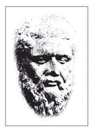
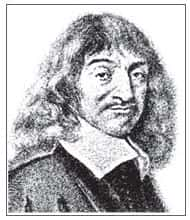
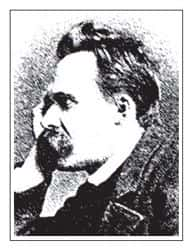
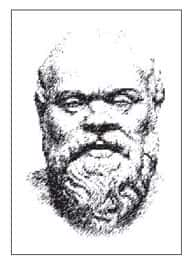
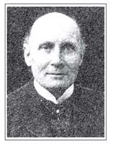

对一般人而言，“哲学”是一个既抽象又空洞的词汇。有些人笑称，所谓的哲学家，就是整天在一间漆黑的屋子里寻找一只黑猫的人。亦即，他所说的一切全凭个人想象，而无法证明到底有没有这样一只猫；也有人抱怨，哲学是把简单的东西说得很复杂，把你原本懂的事情说成你不懂。然而，真的是如此吗？在开宗明义的第一章要特别说明，这种一般的观念是不正确的。

到图书馆查看资料，必须根据书目编号，这时会发现编号“0”代表总类，也就是辞典、百科全书之类的工具书；编号“1”则是哲学类。为什么哲学会被排在第一号呢？这是因为在西方的学术传统里，早就界定了哲学的作用，认为哲学具有基础性与整合性，既能为一切知识奠基，又能统合所有的知识。

人类的经验是多样而分散的，尤其为了深入了解的需要，往往只能分工而不能合作。然而，人的生命是完整的，我们总是希望对任何事物都有一个整体的了解，以便可以作正确的抉择。“博士学位”的英文是Ph.D.，Ph.D.就是Doctor of Philosophy，也就是“哲学博士”，表示任何一门专业的学科，学到最后所抵达的境界都是哲学的层次。

若要了解上面所说的是否合理，就要进一步思考：到底什么是哲学？学了哲学之后对人生又有什么帮助？

# 定义：哲学原意是“爱智”

哲学的英文叫做Philosophy，这个字源于希腊文，是由希腊文中Philia和Sophia这两个字所合成的，意思是“爱智”——爱好智慧。

## 希腊文之“爱”与“智”

Sophia是“智慧”的意思。几年前有一本畅销书，叫做《苏菲的世界》（Sophie’s World），Sophie这个字就是源自Sophia，有些女孩喜欢把英文名字取做Sophia，代表对智慧有一种向往。

“爱”这个字在希腊文中有三种不同的写法，以Philia、Eros、Agape三个字为代表，分别指涉三种不同的情怀。一般人比较熟悉的应该是Eros，其形容词是erotic，中文一般翻译为“情色”。

Eros是指“情爱”，代表一种出于本能的感性冲动及浪漫的情怀，它是人类与生俱有的。一个人有情爱的欲望是正常的，因为若是没有这种能力，两性就不可能结合并且繁衍后代。Philia则是“友爱”，它和Philos是同一个字根。第三种爱叫做Agape，代表了“博爱”，也就是宗教里面所讲的无私的爱。

在中文里“爱”这个字，往往显得浮泛，因此需要特别标明是友爱、情爱、博爱，或者是亲子之爱、夫妻之爱、家庭之爱、国家之爱等，借此加以分别。在希腊文中则是直接使用不同的字，以避免让“爱”这个字混淆了，因为爱有很多种，譬如：有些人为了爱，可以牺牲奉献；有些人为了爱，执著到要去杀人或自杀；也有些人为了爱，达成自我实现。

哲学所谈论的“爱”，重点在于“友爱”。友爱是温和而理性的，从互相欣赏与尊重开始，进而彼此砥砺，一起走上人生的路。换句话说，一个人在爱好智慧的时候，并不是一种Eros，好像男欢女爱一般，狂热到不能静止，也不是Agape那种泛爱一切、没有任何差等的博爱[1]，而是Philia，一种温和而理性的友爱，使我们对于智慧采取比较正确的态度。

## 爱智要保持心灵开放

那么，什么是“爱智”？在此要指出一个原则，即“爱好智慧不等于拥有智慧”。

希腊时代有一派学者，自称为“辩士学派”（Sophists），相信自己拥有智慧。年长的人由于见多识广，可以教导别人，因此很容易摆出一种姿态，让年轻人觉得他好像很有学问，能够提供所有问题的答案，其实他们未必是真正的智者或爱好智慧的人。因为爱好智慧代表的是一种追求的过程，而这个过程的特色就是一直保持心灵的开放。

哲学称为爱智，所强调的是“过程”，要不停地质疑与询问，永远在等待着接受惊讶（wonder）。

希腊时代有一句话说：“哲学起源于惊讶。”这个世界充满了变化，然而，这些不停在变化的东西，却还能够继续存在着，这难道不是一件值得惊讶的事吗？变化代表有生有灭，亦即本身应该是缺乏实在性的，但它居然能够持续存在，这是一件奇妙的事情。因此人们要试着问：“到底‘存在’是什么？”

## 真正的智慧来自生命的试炼

在希腊人的想法中，智慧是“属灵的”（spiritual）、属于神明的。人因为是身心合一的，而身体是一个物质，有重量、有惰性。例如，有时候我们希望自己能够早起，却怎样也爬不起来，这时候会觉得身体实在是自己最大的敌人。身体如此沉重，就是因为它是物质，所以有惰性。又有时候我们很愿意帮助别人，这代表心灵上的美好，却可能因为需要花时间、花力气，所以懒得行动。由此可知，人类的身体是软弱的，会妨碍人类拥有智慧。

那么如何才能拥有智慧呢？柏拉图（Plato，公元前427—前347）曾说：“哲学就是练习死亡。”当然，这不是要我们去自杀。所谓的“练习死亡”，是要练习减少身体的控制程度，亦即要让身体的惰性无法对个人产生影响力，就好像死亡一样。如此，才能让心灵自由地追求智慧。  

柏拉图  
Plato  
公元前427—前347

谈起希腊文化，“转头必见柏拉图”。他曾亲炙苏格拉底，肯定灵魂是人的真我。真理存在，那就是吾人理性所对应的“理型”（eidos）。理性是“发现”而非“发明”理型，所以他不是唯心论者。善的理型有如太阳，照亮一切存在，也为人生指示了正确的道路。怀特海说：“西方两千多年的哲学，只不过是柏拉图思想的一系列注解而已。”  

西方强调“爱好智慧”是灵性上的追求，的确有其道理。人到了最后要离开世界时，应该检视自我，是不是全面降低了身体的影响程度，而让心灵完全自由地翱翔于永恒真实的领域。如果达到这种境界，就代表这个人的生命已经度过了各种试炼，取得最后的成全。

## 每个人都需要哲学

有人说，人生就像在求学，要努力修行，最后可以得到解脱，否则人生的辛苦有什么必要性呢？举例来说，人为什么要读书？读书的目的难道是为了读更多的书吗？当然不是。读书的目的是要让我们的人生减少各种不必要的困扰。

在《吕氏春秋》的记载中，有一个人叫做宁越，他十几岁时开始替别人做工，每天从早做到晚非常辛苦，工资却仅够维持温饱。他眼看着一生这样下去毫无希望，于是请教一位朋友，怎么做才能摆脱这种痛苦的人生。这位朋友告诉他，如果愿意读书，三十年之后可以免除这种痛苦。宁越听了，从此每天夜以继日地读书，十五年之后变得很有学问，有个贵族请他当家教，生活就此改观。

这个故事当然是一个特例，因为大多数的人随着日子一天天过去，老早忘了自己曾经立过什么志向。然而，这也说明了，一个人如果有高度的自制能力，就可以摆脱身体的惰性与软弱，让心灵更为自由。人的本质在于心灵，因为身体会老化，无论如何努力都无法避免。如果要依靠身体，只会一步步走向坟墓，一点希望都没有。相反，如果了解人的本质在于心灵世界，那么不管身体如何变化，心灵都有另外一个可以翱翔的天空。

如此说来，哲学对于每个人而言都是必需的，因为人类天性之中就有一种哲学的倾向——每个人内心都希望自由，能够做自己，摆脱各种限制与压力，越来越感受到作为一个人的喜悦。那么如何才能达到这种境界？要爱好智慧。爱好智慧就是从事哲学思维，它像人生的照明灯，让我们知道该往哪里走。

## 研究哲学的基本习惯：凡事保持好奇

有一部日本电影叫做《催眠》，叙述几个角色在不知不觉中被催眠了，然后在受制的情况下接受指示，做出许多平常无法思议的事。很多时候我们是被催眠的，广告的作用就是一种催眠的过程。有一句广告台词说：“你在看我吗？你可以再靠近一点！”事实上，当你电视看久了之后，真的走近一点去看，最后就会像被催眠一般，觉得好像活着就应该要像电视中的人一样，学这些人用一样的商品，否则就会活不下去，于是你变成了一个商品流通站，不断地去消费及使用这些商品。

这种催眠作用在一个社会中可能形成一种集体潜意识，譬如我们从小开始，在不知不觉之中就被灌输了许多观念。我们往往认为这些观念是对的、没有问题的，但是却从来没有仔细反省过。事实上，一个人如果要研究哲学，就必须养成一种习惯，就是对任何事情都要觉得好奇，这样才能让自己重新出发。

## 哲学性的思维：理性的反省

经验本身虽然像是一个丰富的宝库，其实里面的东西好坏都有，良莠不齐，就好像黄河之水一样，看起来浩浩荡荡，事实上挟泥沙以俱下。这时就需要依靠理性来对自己的经验做一个反省。当用理性反省经验的时候，才是真正清醒的时刻，而平常在经验的过程之中（如赶车、买东西、和别人通电话等），则恐怕是身不由己的，因为有许多外在的因素会引导我们朝着某个方向去行动，去生活。

人会有各种好的与不好的经验，这是很自然的，已经发生了，后悔也没用。然而，重要的是，必须以理性去思考这些经验。能够静下来思考，对于一个人的生命而言是非常重要的，这也可以说是人生开始转变的关键。我们常说“在生命转弯的地方”，思考能够让一个人找到生命中转弯的机会。

当一个人在思考时，代表理性开始运作了，因此他在当下这一刻是清醒的，这也可以说是“我思，故我在”[2]。人思考的时候正是在把经验整合起来，然后问自己：“到底什么是真正的我？我应该是什么样子？”在说到“我应该是什么样子”的时候，代表自己曾经做过许多不该做的事。正由于有过这些不应该的行为，所以才会知道什么是应该。换句话说，一个人如果没有负面的体验，就很难对正面有所理解。

当然，理性思考有时候是很困难的，我们常会觉得有些问题“剪不断，理还乱”，因此到最后干脆不想。在《乱世佳人》（Gone with the Wind）这部电影中，郝思嘉在经过了许多灾难之后，最后靠在门边只说了一句话：“明天再说吧！”她之所以会这么说，就是因为实在想不清楚，不知道为什么会有这么多复杂的事情发生。  

笛卡儿  
René Descartes  
1596—1650

法国哲学家。他想借由理性（而不再靠宗教信仰）找到知识的基础。他认为：每一个人在一生之中，至少要有一次“去怀疑所有能被怀疑的东西”。我们可以怀疑世界与上帝，甚至怀疑自己是不是在做梦。但是，最后将会发现不能怀疑那正在怀疑的自己。

怀疑是一种思想作用，所以可以肯定“我思，故我在”。如此一来，我是由思想所肯定的，我的本质即是思想，然后就走上唯心论的路线了。身与心之间的二元对立，自此困扰着西方哲学界。  

但真正用理性思考经验之后，就能知道自己应该如何做，知道哪一种人生更为理想，也更适合自己。理想代表针对未来，哲学的思考就是要让人能够在过去、现在、未来三个时间向度中连贯起来，让自己的生命不再只是活在当下那片片断断、刹那生灭的过程中而已。

# 对哲学的基本描述

哲学可以用三句话来描述：一、哲学就是培养智慧；二、哲学就是发现真理；三、哲学就是印证价值。“智慧”、“真理”与“价值”是令人向往的三个名词，但更重要的是，必须设法真正了解它们的内涵。

## 培养智慧

诗人艾略特（Eliot，1888—1965）在一首诗中写着：“我们在资讯里面失去的知识，到哪里去了？我们在知识里面失去的智慧，到哪里去了？”资讯是现代人每天都会接触到的，譬如常常上网去寻找一些资讯，借此可以认识许多东西。再举个例子来说，台湾“9·21”大地震的时候，有些人是从打电话回来的海外亲友那里得知地震几级，震中在什么地方等。这是因为在海外的人看到媒体的报道，知道中国台湾地震的资讯，相反，在地震区的人反而因为停电，一时之间无法得到任何讯息，陷入一片漆黑之中。这是一个很有趣也很荒谬的现象，显示出了资讯的重要。

当然，资讯也有不重要的地方，因为它实在太多了，并且随时都在改变，最后变得和垃圾没有两样。正因为如此，所以人类需要知识。

知识的特色是针对某一个专门领域所作的研究，譬如天文学是专门研究天文，物理学是专门研究物理。同样的道理，其他的学科也各有本身专门的领域。知识是一种专业的、对部分的深入了解，因此也造就了社会上的许多专家。所谓的专家就是指对于某种知识作过专门的研究，成为这方面特定的人才。

然而，专家难免是比较狭隘的，所以爱因斯坦（Albert Einstein，1879—1955）说过一句话：“专家只是训练有素的狗。”这句话的用意并不在骂人，而是要提醒我们，不要只是做一个专家，还要设法透过自己的知识进一步体验到智慧。

那么，究竟什么是智慧？又该如何培养智慧？

我们日常生活主要是依靠感官，譬如：看到什么，听到什么，感觉如何等。然而，感觉是不可靠的，举例来说，如果把筷子放到水中，看起来会是弯的，但事实上它是直的；注视铁轨的时候，会觉得铁轨在远处交叉，但事实上铁轨并没有交叉。由此可知，感觉与理智是有差距的，有时候人们所看到的，与实际上用理性去了解及勘察的结果大不相同。

由此看来，人们所有的感觉其实都是相对的。就以冷热来说，同样的一个温度，如果你是从北极来的话，会觉得很热；相反，如果是从非洲来的话，可能就觉得已经够冷了。正由于感觉是相对而不可靠的，并且容易产生错误，所以人活在世界上不能只靠感觉生活。一个人如果只凭感觉生活，那么他的生活等于是毫无可靠的保障，随时充满着变化的危险。

知识能够让我们对某些方面有明确的了解。古时候的人缺乏知识，所以看到打雷闪电就去拜神，发生了旱灾就杀牛祭祀，希望老天能够降雨。如果杀到第三头牛，正好开始下雨，那么从此以后只要是旱灾就要杀三头牛。之所以会有这种行为，就是因为缺乏知识。我们如果有知识，就会通过知识来掌握周围的生活环境，让自己的心灵不至于陷入盲目的猜疑之中。

“智慧”有两点特色：“完整”与“根本”。

（一）完整

许多人觉得高考没考好，或是填志愿的时候选错系，就好像一辈子都没有希望了。事实上，这种“一试定终身”的想法是不对的，如果我们把某一阶段的成败，作为整个生命的成败，那不过是一种借口而已。许多高考失败的人到最后还是成功了；也有人一辈子没经过高考，只读到小学或中学毕业，照样可以成功。生命是完整的，我们在一个地方失败，正好在另一个地方有了反省的机会，借此能够有所改善；相反，一个人如果从小到大都是一帆风顺，可能反而没有太多反省的机会。

所谓完整，代表把生命视为一个整体。因此对任何事情成败得失的判断，都不能只看某一点，而要考量整体生命。如此一来，才能够在面临挫折的时候，很快地重新振作，重新出发，以及在得意的时候有所收敛。

（二）根本

人活在世界上，有些问题只是表面的小问题，而有些问题则是属于根本的大问题。生死就是最根本的大问题，所以哲学家常常会思索死亡的问题。所谓“千古艰难唯一死”，如果这一点能够看透的话，人生还会有什么困难呢？老子也曾说过：“民不畏死，奈何以死惧之？”如果老百姓不怕死亡，那么你就算用死亡来吓唬他也没有用。

当然，大部分的人做不到老子这种程度，因为对大多数的人来说，死亡是最大的威胁。即使不是自己本身，而是自己所爱的人死亡，也是一种非常大的遗憾。

除了生死的问题以外，还有一些其他的问题也属于根本的问题，譬如：人为什么有不一样的命运及不一样的遭遇？为什么有些人做坏事却没有遭受报应？为什么有些人生下来就必须受苦受难？这些都属于根本的问题，而这些问题通常在生活里也都不会有明确的答案，所以需要以开放的心胸准备接触智慧。

总的来说，培养智慧代表要超越感性的限制，慢慢在知识的范围里面奠定基础。有了基础之后就要进一步达到完整而根本的境界，而这个境界和个人主体的觉悟和体验有关，这方面在稍后“印证价值”的部分会加以说明。

## 发现真理

希腊文中的“真理”叫做aletheia，其意为“发现”，即英文中的discover这个词[3]。由此可知，真理就是揭开、发现。

既然是揭开，那就代表原先是被遮蔽着的。究竟被什么所遮蔽？前面曾经指出，每个人从小到大，都会接受一些固定的观念或成见，譬如你居住地区的风俗习惯等。这些观念会让我们对事物的判断有一定的方式。

举例来说，非洲有个部落认为女孩子的脖子越长就代表越美，所以女孩子从小开始脖子上就会套上很多铜环。一般人看到可能会吓一跳，一点都不觉得那样有什么美，但是他们那一族的人因为从小受到特定的风俗习惯所影响，就会觉得很美。

中国其实也有这样的风气，譬如古代有一句话：“楚王好细腰，宫中多饿死。”由于楚王喜欢细腰的女孩子，因此宫中很多美女为了讨楚王的欢心，拼命地勒腰、节食，最后甚至饿死。这其实是古代的一个悲剧，说明了女性因为没有受教育的机会，而无法发现环境、风俗给自己的制约，因此才会为了讨好男性而这样虐待自己。

这里要强调的是，我们往往被小时候所灌输的观念、资讯时代的广告宣传所“遮蔽”。惟有把这些遮蔽去掉，才能够发现真相。哲学的目的就在于发现真理。

尼采曾说：“哲学家是文化的医生。”文化也会生病，所以需要医生，而能够看出文化病因的，就是哲学家。这是因为哲学家爱好智慧，能够从整体及根本的角度来观察一个时代、一个社会在特定情况下的某些表现。借由这种方式，能够发现问题所在，并进一步加以修正。这就是所谓的发现真理。  

尼采  
Friedrich Nietzsche  
1844—1900

德国哲学家，宣称“上帝已死”，想要重新估定一切价值，促使人类走向“超人”的境界。他批判流俗的道德与伪善的信仰，强调“求权力的意志”，要让生命的势能尽力发挥。他的见解对存在主义颇有启发。请参考本书第六章。  

发现和发明不同，没有人能够发明真理。爱因斯坦研究相对论，最后提出了E＝mc2这个公式。我们不能说这个公式是爱因斯坦发明的，因为这个公式本来就存在，只能说是爱因斯坦发现了它。这就是为什么在科学上常讲“发现”的原因了。当然，也有人会讲发明，譬如发明了一项新产品。其实，人类没有一样发明是从无变成有的，而是发现了某些东西组在一起可以产生什么作用，如此而已。

人生的问题，更是以发现为主。举例来说，有时候我们会觉得别人讲的话没什么道理，事实上这是因为我们先被个人的成见遮蔽。如果能够撇开成见，听听别人怎么说，然后试图了解其中的道理，或许会发现，其实别人的说法也是可以站得住脚的。所谓“道并行而不悖”，通往目标的道路并不是只有一条而已。

## 印证价值

自然界是有规律的，凡是有规律之物就是必然的，它不可能离开固定的轨道。所谓自然就是必然。举例来说，我手上拿了一张纸，当我把手放开，这张纸“自然”就会往下掉。我也可以说，当我放开这张纸，它“必然”就会往下掉，这其实是一样的意思。

如果自然界“脱轨”而行会如何？

西方有一篇所谓的“最短的科幻小说”，这篇小说只有十一个字，即“那天早晨太阳从西边升起”。为什么这叫做科幻小说？因为它充满了无穷的想象空间。如果太阳真的从西边升起，那代表地球的整个生态要颠倒过来：北极变成赤道，赤道变成南极。日夜颠倒还是小事，这很快就可以调适过来，然而气候完全失常，整个地球的生态全部重新倒置过来，这才是最让人无法接受的。这篇科幻小说的震撼力怎可谓不大？

人也是自然的一部分，但生命的特色却和其他动物不同，亦即人有自由。有自由代表需要选择，而通过选择，就能够使某些价值呈现出来。有一位女同学问我：“老师，我今年大四了，认识五个男朋友，我应该要选择哪一个？”这种问题我怎么可能回答？挑选男朋友和到菜市场买猪肉是不一样的。

我有一个朋友，他的初恋情人嫁给了别人。二十年之后再见面时，他对初恋情人的先生说：“我真是羡慕你，当初我想追她追不到，现在你却能够把她娶回家，实在是太幸福了！”结果他初恋情人的先生却说：“你为什么不把她娶去呢，害我受了二十年的苦！”

由此可知，人生的问题需要靠自己去印证。举例来说，有些人说：“能够关怀别人，稍微牺牲一下自己的享受，那是一种高尚的行为。”如果有一天你在满载的公车上遇到一个老太太上车，这时候你正好有个位子，坐得很舒服。心里开始挣扎：“到底要不要让座呢？”你有两个选择：如果选择不让座，那就无从印证这句话的真假；如果选择让座，那就是选择“印证价值”——也许当你站起来把座位让给老太太的时候，忽然觉得心情豁然开朗，觉得自己展现了人格的尊严。从此以后你就相信，原来帮助别人真的是快乐的，然后这个道理就变成你的真理，因为它的价值已经得到了证明。

人生是需要体验的。如果光是叙述各种道理与格言，而没有自己去体验的话，到了最后还是只能在知识的迷雾中打转。相反，如果一个人真的能够借由体验去印证价值，那么随着生命的成长，他的经验将越来越丰富，并且对人生的体验及对价值的掌握，也会越来越深刻而准确。

# 如何提升哲学素养

哲学是一门需要生活经验来配合的学问，正所谓：“离开人生，哲学是空洞的；离开哲学，人生是盲目的。”为了提升哲学素养，我们要提出四个基本观点：培养思考习惯，掌握整体观点，确立价值取向，力求知行合一。

## 培养思考习惯

一般人通常没有思考的习惯，因此发生事情时都凭着本能的感觉立即反应，并且很容易受到别人的影响。正因为如此，这些反应往往缺乏一致性与连贯性，譬如，有些人的心情受天气影响，天气好的时候心情也好，看什么事情都觉得没有问题；相反，如果天气不好，心情就差了，不管任何人遇到他都要倒霉。如此一来，这个人对自己生命的主宰性就丧失了。有些人则是受到个人情绪的左右，你一看他的脸色就知道他心情好不好。这是因为他无法控制自己的情绪，喜怒哀乐都充分表现在脸上。这些都是缺乏理性思考的结果。

若是养成思考的习惯，遇到任何事情发生时，就会先冷静下来，想清楚：“到底发生了什么事？这是怎么一回事？”这一点非常重要。至于别人对这件事如何反应则是另一回事，因为同样一件事情，不同的人会有不同的反应，而这件事情与你有什么关系，在别人看起来，可能也会和你自己的看法不尽相同。

那么如何培养思考习惯？就是“要在不疑处有疑”——在没有任何怀疑的地方产生怀疑。举例来说，牛顿（Newton，1643—1727）坐在苹果树下，一颗苹果掉下来打在他的头上，于是他开始思考：“为什么苹果是往下掉，而不是往上飞？”最后发现了万有引力定律。

看到这里不妨想一想：“如果是我坐在苹果树下，一个苹果掉下来打在我的头上，我会怎么样？”或许我们会想：“啊！上天赐给我一个苹果，那么我就把它吃掉吧！”我们之所以无法成为牛顿，而只能成为一个多吃一个苹果的人，原因就在于我们没有思考的习惯。牛顿因为喜欢思考，因此他会在别人没有怀疑的地方怀疑：“为什么是这样而不是那样？”然后发现了新的规律。

读书时也应该有这种态度，读到一段话时，不要立刻信以为真。如果把很多事情视为理所当然，就无法养成思考的习惯。如果对任何状况都能够加以思考，就会发现，虽然有很多事情现在如此，但它没有必要一定是如此，也有可能是别的样子。这样一来，就可以在很多看似理所当然的事情中，找到新的可能性。

## 掌握整体观点

柏拉图的代表作是《对话录》。对话代表有两个人在交谈，你说你看到的，我说我看到的，我们看到的东西虽然一样，但是观点与角度却不同，由此产生不同的结果。彼此在交谈的过程中互相沟通，最后能够增加双方的见解。

对任何事情的看法，有正方就会有反方。我们平常和别人交谈时，不喜欢听到反面的意见，譬如开会时，我提议某种方案，如果有人与我意见相左，我会觉得他故意找麻烦，而忽略了他可能看到某些我所忽略的部分。

其实所谓的掌握整体观点，就是对任何事情都要从不同的角度思考，久而久之，就可以超越自己的成见，思想也将更为圆融。当然，我们年轻的时候未必喜欢圆融，甚至觉得那样好像没有什么个性，说任何话都四平八稳，想要面面俱到。然而，年龄与经验增加之后会发现，人生很多问题的确应该从各方面来考量，才不至于钻牛角尖。

我们在本书中所介绍的中西哲学家，大多符合孔子所谓“吾道一以贯之”的原则，能对宇宙与人生提出一套有系统的整体观点。

## 确立价值取向

“取向”的英文是orientation，这个词有两个意思：一是“定位”，二是“方向”。在这个世界上，虽然每个人都有自己的个性或做人处事的风格，不过，经由学习与成长，我们可以进行修正及调整（定位），然后选择自己要成为什么样的人（方向），这就叫做价值取向（value orientation）。举例来说，柏拉图年轻的时候是一位文艺青年，喜欢作诗，并且写过希腊悲剧。他二十岁时遇到苏格拉底，听到苏格拉底的一段话之后，回家第一件事就是把自己所写的诗和剧本全部烧掉，因为他发现了自己应该走的路，并选择终身奉献于哲学思考的世界。  

苏格拉底  
Sokrates  
公元前469—前399

西方的典型哲学家，先研究自然哲学，后探讨人生问题，强调“没有经过省察的人生，是不值得活的”。只要真正认识了德行的本质，就会自然走上善途。如何认识？经由反诘、对话、归纳、辩证等方法，发现自己无知，进而觉悟“知与德不分”，走上人生正途。生平没有著作，但是启发柏拉图写下《对话录》，由此影响世人极为深远。请参考本书第五章。  

这种抉择的例子在中国古代也有。有一个人叫做曹交，资质不太好，他觉得孟子讲话很有道理，因此问孟子：“周文王身高十尺，商汤身高九尺，我曹交身高九尺四寸，介于他们两个之间，但是为何他们两个都当了帝王，我却只会吃饭？”[4]孟子回答他：“如果你穿上尧穿的衣服，说尧说的话，做尧做的事，那么久而久之就会变成尧了。”反之，则会学习桀而变成桀。

尧与桀是古代两位代表人物，尧代表了善人，桀则代表了恶人。因此，如果一个人穿上桀穿的衣服，说桀说的话，做桀做的事，久而久之也就变成桀了。这说明了，我们要为自己的人生作出选择，这就涉及所谓价值取向的问题。

每个人都必须作选择，那是对自己人生的期望。不过，许多年轻人只是希望自己能够跟偶像交换生命，相信如果自己是某某人，就会死而无憾。这种想法有很大的问题。

常听到年轻人说，希望自己成为麦当娜、迈克尔·杰克逊、迈克尔·乔丹等人，事实上这些偶像也有自己的困难。譬如迈克尔·杰克逊的演唱会，动辄十几万人参加，但下台之后他可能需要依靠药物来稳定心情。一个人要能够承受十几万人的欢呼而不至于发疯，需要很高的精神修为与定力。如果一个人能够上台，却无法下台，他就必须借由药物让自己产生幻觉，或是靠另外一种刺激，让自己忘记上台后的那个自我，因为那个自我在千万人的欢呼之下，已经被神格化，而不再是他自己了。

一个人的表现无论如何杰出，都不能忘记人性终究是脆弱的。

西方有一句话说：“仆人眼中没有伟人。”当然，我们也可以说“司机眼中没有伟人”。如果你是美国总统的司机，就不会觉得他特别伟大，因为你看到了他平凡的一面，甚至是许多不为人知的秘密。久而久之当你看到总统受到万人欢呼时，心里可能会偷笑：“总统也没什么了不起嘛！”的确，总统本来就没什么了不起，他只不过是被现实社会的价值观塑造成很了不起的样子。事实上，真正的伟人不是要让别人欢呼，而是要让自己满意。

所以，每个人必须了解自己对人生的期望，找到自己的价值取向，而非一味把他人的价值观加诸自己身上。

既然人生是一个不断作选择的过程，那么在选择的过程中要往哪里走？开始的时候也许需要设定一个偶像。很多人觉得青少年崇拜偶像并非好事，其实未必如此。我女儿小的时候也经常崇拜偶像。当时我很烦恼，常常劝她说某某偶像不好，某某偶像不行，因为在我的眼里，很少有偶像是够格的。有一天她终于抗议了：“如果没有这些偶像可以崇拜，我活着还有什么乐趣呢？”我一听立刻恍然大悟。

一个人会崇拜什么样的偶像，是有一定的道理的，这反映出他内心的一种需求。思考社会上各种事情时，不能光看表面，还必须自己衡量、判断，试着从其中的某个角度，掌握住某些因素。借由这种方式，可以进行自我训练。

价值取向既然是一种选择，就一定要有所取舍，亦即，如果我选择了某些价值，那么势必要放弃另外一些。由此可知，选择价值时是需要勇气的，人不可能什么都要，也不可能讨好每一个人。

人活在世间最可惜的，就是变成乡愿，有一次子贡请教孔子：“一个人在乡里中，好人喜欢他，坏人也喜欢他，那这个人应该不错吧？”孔子回答：“不对。应该是好人喜欢他，坏人讨厌他。”[5]这里所强调的就是一种价值取向。相反，如果是坏人喜欢你，好人讨厌你，那就大有问题了，因为这代表你属于坏人这一边。然而，好与坏都还算是价值取向，最怕的就是有些人认为“喜欢自己的就是好人，讨厌自己的就是坏人”，这样一来就无法谈任何问题了。

人生经由不断地抉择，而塑造出自己的风格。风格是指，一个人的言谈和行为有一定的原则，并且知道为什么要这样做、这样说，不会轻易受到外在环境的影响。

看过《泰坦尼克号》（Titanic）这部电影的人都知道，当泰坦尼克号开始下沉时，船上共有两千多位乘客，却只有七百多人可以坐上救生艇逃走，这时出现的第一句话是“妇女与小孩优先”。这就是西方文化的一种价值观。换作是我们，乍听之下，恐怕会觉得不可思议。

假设台湾地区是一条船，像泰坦尼克号一样快要下沉，这时候即使有人说“有权有钱的优先逃走，老弱妇孺等在最后”，恐怕一般人也不会觉得意外，因为我们一向处身在这种环境，许多位高权重的人可以为所欲为。在西方则是有着特定的文化传统，也就是“骑士精神”的表现，无论任何财大势大的人，碰到灾难时，一样是老弱妇孺优先。因为骑士精神是西方男性对自我的一种期望，他们认为男性较为强壮，在困苦的环境中比较容易求生存，所以应该让别人先走。

除了这一幕，我们还可以看到，船最后快要沉没时，居然还有几位乐师在甲板上继续拉着曲子。因为他们觉得自己有责任在最后关头安慰人心，让大家勉强维持平和的心境，跨越生死的界线，前往另外一个世界。他们清楚知道自己会死，但没有逃避的念头，这是相当令人动容的。这就是西方文化的价值表现，其本身自成一个系统，也肯定了人性的尊严。

知道自己言行背后的道理，就能够坚持下去，即使需要付出一些代价，也无怨无悔。这是因为内心深深相信，自己的价值观是正确的，即使为它牺牲生命也在所不惜。相反，如果要他放弃自己的价值观而快乐地活着，则是不可能的事情。这就是价值取向的真义。

## 力求知行合一

“知行合一”说起来很容易，做起来却不简单。事实上，知行合一是人一生都要努力去追求的。

当然，我们不必加给自己太大的压力，因为如果每个人都能做到所有他听说过的德行，那岂不是满街都是圣人了吗？人都会犯错，因此只能努力追求知行合一，选择一种价值之后不断地印证，让自己对自己越来越满意。

人生就是不断寻求让自己对自己满意的过程，然而，怎样才会对自己满意？这种要求是由内而发的，因此如果你的标准是由别人定的话，很难达到满意的程度。

譬如，全世界最有钱的人是比尔·盖茨（Bill Gates），我曾经看过一张照片，是他抱着两岁的女儿说：“只有跟她在一起，我才觉得自己真正快乐。”这就是亲情。可能很多人会说：“那为什么我和自己的子女在一起并不觉得快乐呢？”或许是这些人觉得自己不像比尔·盖茨那么有钱，因此不快乐，这就是价值观的问题了。

所谓“知行合一”的“知”，其实指的是一个广大的世界。庄子说过：“吾生也有涯，而知也无涯，以有涯随无涯，殆已。”（《庄子·养生主》）知识的范围是无限的，但是生命的时间却是有限的，想要用有限的生命去追求无限的知识，实在是一点希望都没有。

我在耶鲁念书时，每次进入图书馆都会有一种“哀莫大于心死”的感觉，因为耶鲁大学图书馆的藏书是台大图书馆的三倍，两边书架上都是书，一直堆到屋顶，你要拿位置比较高的书还必须用梯子爬上去。看到这么多书，我就会觉得人生到底所为何来呢？

皓首穷经，一辈子努力写几本书，也不过是薄薄的几公分书脊，年轻学子在图书馆中晃一下就过去了，甚至不愿意伸手拿出来翻一下，这是多么残忍的事情啊！

知识宛若一片汪洋大海，人一生所能学到的只是很少的一部分。并且，如果你学了一些知识，却不能应用在日常生活上，那么就算学得再多又有什么意义呢？因此，我们学习知识之后，就要懂得消化，并融会贯通才是“知行合一”。

西方哲学家怀特海（Alfred N. Whitehead，1861—1947）说：“一定要等到你课本都丢了，笔记都烧了，为了准备考试而记在心中的各种细目全部忘记时，剩下的东西，才是你所学到的。”  

怀特海  
Alfred N. Whitehead  
1861—1947

二十世纪贯通科学、哲学与宗教的代表人物。创立“历程哲学”，主张历程（过程）即是真实，一切皆相涵互摄为一个整体。以机体主义取代西方近代以来的机械主义。他有开阔的视野，甚至说过：“我们对中国的艺术、文学与人生哲学知道的越多，就会越羡慕这个文化所达到的高度……从历史的绵延与影响的广度来看，中国的文明是世界上自古以来最伟大的文明。”  

希望每个人都能够养成一种习惯，要多多地去学习与思考，掌握整体的观点，建立自己的价值取向，再努力把心得印证于生活之中。

# 结论：爱智是人的天性

哲学的用意，在于寻根探源，发现什么是“真实”；也在于旁通统贯，把宇宙与人生连接为一个整体，由此界定自己的安身立命之道。

既然哲学是指“爱智”，就表示这门学问是一个开放的与动态的学习过程，要不停地质疑：“这个字或词，是什么意思？”“这种判断所根据的标准，是如何成立的？”“宇宙与人生之间、人的生与死之间、个人与群体之间，可以形成完整的系统吗？”换言之，就是要澄清概念，设定判准，并建构系统。

后续各章将会进一步讨论思想方法、西方重要观念的传承、中国儒家与道家的见解，以及艺术、宗教、教育、文化等题材，希望由此阐解哲学与人生的密切关系，并与爱智的朋友共勉。

* * *

[1] 宗教里面喜欢强调博爱，譬如佛教有一句话：“无缘大慈，同体大悲。”这即是博爱的意思。如果你对一个毫无关系的陌生人好，就叫做无缘大慈；相反，对自己的兄弟、同学好，则叫做有缘小慈。举例来说，当土耳其发生地震时，你捐钱给他们，这是无缘大慈，因为你完全不认识土耳其人，这样做是出于一种宗教情怀。然而，如果你捐钱给“9·21”地震的南投灾民，则是介于大慈和小慈之间，因为我们都生活在同一个岛上，因此能够深刻地感受到有一种共同命运。

[2] 笛卡儿（René Descartes，1596—1650）说“我思，故我在”时，目的是为了以理性寻找真实知识的出发点。他在怀疑一切时，发现无法被怀疑的只有“自我”，亦即知识不能脱离自我的思考作用而独立存在。西方近代哲学的唯心论倾向，亦由此展现出来。

[3] cover代表遮盖，而“dis-”则有揭开之意。aletheia亦同，希腊文中的letheia是遮盖，而前面加上“a-”则代表否定的意思，因此aletheia即为揭开之意。

[4] 原文是：“交闻文王十尺，汤九尺，今交九尺四寸以长，食粟而已，如何则可？”（《孟子·告子下》，请参考上海三联书店出版的拙著《我读孟子》，以下同略）

[5] 原文是：子贡问曰：“乡人皆好之，何如？”子曰：“未可也。”“乡人皆恶之，何如？”子曰：“未可也；不如乡人之善者好之，其不善者恶之。”（《论语·子路篇》，详情请参考上海三联书店出版的拙著《我读论语》相关章目，以下同略）

