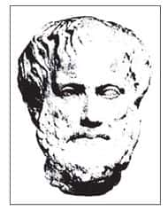
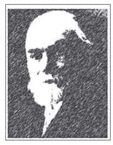
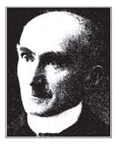
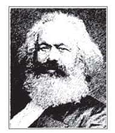
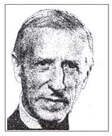

本章主题对每一个“人”来说，一方面会觉得非常熟悉，另一方面却又感到复杂而遥远。世界上六十亿人，没有两个人完全一样。人类的表现千差万别，有时候善良而高贵，有时候又丑恶得令人失望。因此，确实有必要认真思考：人性到底是什么？

我们将由古希腊、中世纪，以及近代欧洲三个阶段进行讨论，这三个阶段分别对应了三种不同的人性观点。由西方的背景开始探讨，主要是因为从希腊到欧洲近代，西方文化的发展有着一脉相承的系统。

如果从中华文化的背景来探讨这个问题，就只能回到古典的材料上，以儒家与道家为焦点（因为我们历代思想的进展性比较不明显，学者们不断“温故而知新”，而很少采取截然不同的观点）。这一方面，将在《哲学与人生Ⅱ》第二章与第三章再作详细说明。

第一阶段是古希腊时期，此时期偏向从“人的现状”来看待人性的问题，亦即就一个人具体的生命有什么样的能力、表现、要求等，进行探索。

第二阶段是中世纪时代，此时期的西方文化以基督教为主，各方面的想法都与宗教有关，所以要从“人的起源”来看待人性的问题，亦即相信“人是上帝造的”。这个定位给了人性一个很清楚的轮廓。

第三阶段则是近代欧洲时期，这个时期是从达尔文（Charles R. Darwin，1809—1882）提出进化论之后逐渐发展形成的，此时期所关注的问题是“人的生命特色”，转而探讨“人应该往哪里发展”。

# 就人的现状而言（希腊思想）

谈到希腊思想，我们要参考三种观点，分别是荷马（Homer）史诗、德尔斐（Delphi）神殿，以及亚里士多德（Aristotle，公元前384—前322）的哲学。  

亚里士多德  
Aristotle  
公元前384—前322

柏拉图的杰出弟子，在亲炙了柏拉图二十年之后，说：“吾爱吾师，吾尤爱真理。”他认为建构知识应该由经验世界的材料出发，通过观察、归纳、分类、实验、综合，形成各种领域的研究内容。  

在哲学上，他的十大范畴之说，对于逻辑及思想方法的探讨影响深远；他的四因说（质料、形式、动力、目的）及“潜能与实现”之说，对于人们理解具体存在的一切，大有帮助。而“形而上学”一词，也是从他的著作内容所建立的学科。他的学术成就极高，足以称为希腊哲学的集大成者。

## 荷马史诗：能够=应该=必然

荷马是希腊时代的重要作家，著有《伊利亚特》、《奥德赛》等著名史诗。荷马史诗中有许多复杂的故事，描写神明与人间的互动关系。人类社会所发生的许多事情，有些在表面上看来好像是神话，其实都有历史事实作为根据。在最古老的时代，人类因为生活上的需要，而发展出各个不同的群体与社会。群体之间可能会为了某些利益、某些观念，或者是其他的理由，而形成竞争、斗争及战争。荷马史诗所要反映的就是这样的情形，他的描述中也出现了对人性的反省。

荷马史诗中对于人性的理解，基本上是一个“能够=应该=必然”的公式。“能够=应该”是指：只要我能够做到，就应该去做。譬如，如果我能够攻下一座城池，那么就应该去攻占它，否则我的这个能力就是无谓的、不能落实的。换言之，上天赋予我这么大的能力，就是要我把它展现出来。而“必然”则代表命运，譬如：我能够攻下这座城池，我就应该攻占它；并且，命运必然规定我要攻占它。

这种观点反映出所谓“强权就是公理”的思考模式：如果我今天是一个强者，因为我有这个能力，就可以欺侮其他的弱者，没有人可以制止我。换言之，我的能力可以使行为获得正当性（justification），亦即所有行为都是“应该做的事”[1]，而带来自我肯定。这种思考模式显然会产生误导，因为如果只要是能够做到的事就应该去做，那么这个世界岂不是没有客观的正义吗？

然而，“能够=应该=必然”这种想法的确比较原始，能够反映出古老社会中人与人之间以能力为主的互动方式，而能力又可以延伸为权力和暴力。如果以这种思考模式来看，因为我是一位老师，能够把学生当掉，所以我就应该把学生当掉，这是命运规定我必然要把学生当掉，否则我的能力就没有展现。然而，这种说法对学生而言岂不是很不公平？似乎学生只能够成为待宰的羔羊了。

用这种方法来理解人性，的确会出现很大的偏差。一个人的生命阶段中，青年进入盛年这个时期在各方面都处于高峰，因此就算为所欲为，别人可能也阻止不了。然而，我们都曾经幼弱，将来也会衰老。当我们处于这两个阶段时该怎么办？因此，人的生命不能只看光辉灿烂的这个阶段，而需要留些后路。换言之，在思考时必须注意到普遍性的问题。亦即，一个理论的提出，应该能够适用于人生中的每个阶段，以及社会中的每个人。如此一来，对人性的理解才是比较完整的。

如果对荷马的史诗稍有认识，就会发现，其中对英雄人物的描写往往只有一个基本观念，就是“打遍天下无敌手”，听起来有点像金庸小说《雪山飞狐》里的苗人凤。这基本上是一种比较原始的思想，在武侠世界里面屡见不鲜。武侠世界中很少有所谓的正义，往往只要谁武功最高、天下第一，就可以当上盟主，决定许多事情。当然，由于这些武侠小说是中国人写的，所以往往会把它与一些道德观念连在一起，譬如“善恶到头终有报”等。因此，武侠小说比起荷马史诗中描写的那种纯粹以能力、权力、暴力决定一切的情况，还是进步一些。

这种以能力决定一切的方式，使人们得到许多惨痛的教训，由此造成了西方社会的发展，再推进到第二个阶段，也就是德尔斐神殿的阶段。

## 德尔斐神殿：认识你自己，凡事勿过度

“德尔斐”是世界著名的古希腊神殿，其中供奉的是阿波罗神（Apollo）。阿波罗神是希腊神话中的太阳神，代表着光明、理性、形式，以及各种安顿的力量，因此对很多人而言，它是一个解决人生谜题的地方。人生总是充满困惑，古代的教育又不够普及，因此一般人有迷惑时都会到德尔斐神殿去求签，请神殿中的祭司加以解释[2]。由此可知，德尔斐神殿对希腊人来说，可以算是信仰的中心。

德尔斐神殿上刻了两行字：一行是“认识你自己”；一行是“凡事勿过度”。能够被刻在神殿上的语句一定是很特别的，都是前人经年累月体验得来的智慧。

然而，“认识你自己”，却是一件极其困难的事，一个人就算读了大学或者进入社会，都不见得能够认识自己。我们小时候总以为知道自己叫什么名字，是什么样个性的人，就算是认识自己了。然而，真的有这么容易吗？金庸小说《射雕英雄传》里有一个角色叫做欧阳锋，他号称“西毒”，武功非常高，为了练“九阴真经”而走火入魔，最后忘了自己是谁。他逢人就问：“我是谁？”黄蓉告诉他：“你是欧阳锋啊！”他接着又问：“欧阳锋是谁？”这个问题就很难回答了。

举这个例子是要说明，对自己的了解本来就是人生最困难的事情，因为人有选择和学习的可能，看了一部电影或一本书之后，你就和以前的自己不一样了。同理，只要经历过一个事件，自己也会变得不一样。譬如，许多经历过“9·21”大地震的人会说：“以前我总以为人生最重要的事就是赚钱，但地震之后，我的观念完全改变了。”一个事件的发生会使许多人对人生的看法改变，甚至变成完全不同的人。这就是“认识自己”的困难。

认识你自己代表人在“知”方面应有的态度——与其去了解世界，不如多了解自我，因为人对世界的了解永远不可能足够，也不可能停止，只有自我对每个人来说才是最切身的。俗话说得好：“苦海无涯，回头是岸。”所谓“回头是岸”即是指：回到自己身上，了解自己。这反而是一个出发点。

刻在德尔斐神殿上的第二句话是“凡事勿过度”。这句话是与行为有关的，亦即做任何事情都不要太过分，要懂得适可而止。我们年轻的时候，常因为气盛而较为决断，多年以后才感到后悔。其实，无论做任何事，到了某个程度就该停下来省思，要给自己、也给别人留点余地。这就是神殿中的教训——“凡事皆勿过度”的真义。孔子也懂得这个道理，所以孟子说他是“不为已甚者”（《孟子·离娄下》），意思就是：孔子是做什么事都不过分的人。

## 亚里士多德的哲学：人是理性的动物

我们至此已经知道，希腊时期一开始对人性的看法是“为所欲为”，亦即“能够=应该=必然”（第一步）；接下来逐渐在“知”、“行”方面有所限制（第二步）。接着要讲到第三步，也就是哲学开始出现之后的思想，以亚里士多德为代表。

或许我们对亚里士多德不是很了解，但对《EQ》（Emotion Quotient）这本书应该熟悉得多。这本书在第一页即引用了亚里士多德的话：“任何人都会生气，这没什么难的。但要能适时适所，以适当的方式对适当的对象恰如其分地生气，可就难上加难。”因为要能够恰如其分地生气，必须具备高度自我反省、自我判断、自我约束的能力。

亚里士多德对人性有一个简单的说法：“人是理性的动物。”这句话大家都耳熟能详。的确，人与其他动物的差别，就在于人有理性。在亚里士多德看来，人的特性在于“灵魂根据logos来运作”，而“logos”一词在希腊文的原意包括“言说、叙述、理性、定义、理性功能、适当比例”等。这些相关的语词所描述的，即是“人”这种有理性的动物。

后代的人由“logos”推衍出“logic”（逻辑），并且许多学问都在字尾加上此字，如Biology（生物学）、Psychology（心理学）、Sociology（社会学）、Theology（神学）等等。这代表所有的学问都要靠理性运作才可以成立。

人有理性，可以学习，亚里士多德在他的《形而上学》一书，开宗明义就说：“人类天性渴望求知。”如果人类都能发挥这样的理性，天下还有什么问题不能解决？人类世界应该是和谐而安详的。但是我们接着要问：“为什么有理性的人会做出许多非理性的事情？有时候做了一件事自己觉得后悔，别人也觉得难以理解。并且，为什么身为理性的动物，还是有许多行为是不可预测的？”由此可知，这个定义本身太过单纯，只注意到动物与人的差别，而没有注意到人类本身并未完全排除动物的特性，因而有着非常复杂的结构。不过，在古希腊时期，就算想要进一步研究人性，也缺乏知识方面必要的条件，如各种科学上实验、观察、研究的方法等。

# 就人的起源而言（基督教）

中世纪时期也就是一般所谓的罗马时代（公元5世纪至15世纪）。这个时期罗马人统一了整个欧洲，还横跨到亚洲与非洲部分，成立了罗马帝国。在哲学的领域谈论中世纪感觉好像很遥远，因为这个时期并没有特别重要的哲学思想可以影响到现代人，它是一个以宗教为主导原则的时代。

## 基督教与天主教

基督教和天主教看起来类似，其实是不一样的。究竟这些教派如何区分？

凡是信仰基督的团体都称作“基督教”，也就是英文中的Christianity这个字。基督教又分成三大系统：天主教（Catholic）、东正教（Orthodox）、新教（Protestant）。这三个系统相信的是同一本《圣经》，但是解释的方式却不完全一样。

天主教是这三个系统中历史最悠久的，由耶稣亲自创立，任命门徒彼得为教会领袖。天主教以罗马作为中心，从古至今一脉相承。若以个别宗教来看，天主教是目前全世界信徒最多的宗教，总人数超过了八亿。

11世纪时，在希腊半岛出现了另一个派别，成立于罗马的东方，因此被称为“东正教”。东正教从希腊半岛往北延伸到俄罗斯，这些地区所谓的基督徒，大多是信仰东正教的。所以我们读到俄国作家陀斯妥耶夫斯基（Fyodor Dostoevsky，1821—1881）的小说时，会发现许多描写上帝的观点，是以东正教为背景的。

到了15、16世纪，罗马帝国瓦解，欧洲开始兴起民族思潮，各地出现民族独立运动，建立民族国家，譬如：日耳曼人建立了德国，盎格鲁-撒克逊人创立了英国，法兰克人则创立了法国。配合这种民族思潮，也开始产生宗教改革运动，宗教逐渐变得本土化，开始有一些新的宗教领袖出现，譬如：德国有马丁·路德（Martin Luther，1483—1546）、英国有英王亨利八世（Henry Ⅷ，1491—1547）、瑞士有加尔文（John Calvin，1509—1564）。这三大教派统称为“反对派”（Protestant），英文protestant具有“反对”的含义，中文译名称为“基督教”，因相对于原本的天主教（旧教），又称为“新教”。

新、旧并不代表价值判断，其分别在于：旧的天主教是一脉相承的，至今都还是由罗马教宗来领导；新的基督教则是各自分立的，相当多元化，目前有名可称的新教已达两百多派。

我记得在1986年时，曾赴美国参加一场“世界宗教大会”的研讨会，在分组讨论的时候，我的这一组有一位四十岁的女士，居然声称自己是一位教主。我觉得很好奇，于是请教她：“你这么年轻怎么会变成教主呢？”她回答：“我住在美国得州的南部，整个村子里只有我一个人读过大学，大学毕业之后回到家乡。当时村里的人星期天找不到牧师，因此请我带他们做礼拜。于是我开始讲解圣经，另外又配合了《易经》和《老子》里的思想。大家觉得我讲得很有道理，就捐钱给我，并且盖了一座教堂，我就变成教主了。”

这就是新教发展的模式之一，往往具有本土色彩——无论到了任何地方，都会与当地的特色结合。只要经济上能够独立，主持者可以自由形成某种特定的解释方式。这种解释方式往往得自于个人的启发，而未必具有完整和一贯的系统。如此一来，容易与原始的基督教渐行渐远，有时候甚至会出现一些奇怪的教派和光怪陆离的传教方式。不过，这里所说的基督教并不只是指新教，而是指所有信仰耶稣基督的这个系统，也就是包括了天主教、东正教和新教。这三个系统中，天主教已经存在了两千年，东正教从11世纪开始，而新教则是从16世纪开始。这三个系统全部加起来的人口多达十八亿，是世界各大宗教中排名第一的。

## 上帝造人：神的形象与原罪

基督教认为人是上帝创造的，这样的“人”具有两点特色：神的形象与原罪。

每个人的心中都有神的形象，不论住在天涯海角，人的内心之中都有一点灵明，可以让他在许多关键的时刻发现自己具有神性。但是人因为有身体，所以也无法排除兽性。由此可知，人是介于神与兽之间的[3]。神的形象代表正面的力量，亦即每个人都有良心，会自我要求去行善。

另一方面人还有原罪。自古以来就不断地有人在犯罪[4]，譬如有一部电影叫做《七宗罪》（Seven），其中描写的就是基督教中的七大死罪。在这部电影中，有七种人因为分别犯了骄傲、嫉妒、暴食、好色、愤怒、贪婪、懒惰的罪行，而被残杀。骄傲是七大死罪中的第一条，因为一个人如果骄傲，就会忘记自己原是受造之物，以为自己很伟大，可以自行成就许多事。

既然世界上很多人犯罪，那么就要问：“罪是怎么来的呢？难道是上帝造了会犯罪的人吗？”这种说法其实对上帝不太公平，因为上帝在造人的时候，应该不会故意要造一个会犯罪的人，他只想要让人有自由，可以选择。然而，任何一种自由选择都隐含了犯错的可能性，否则就不能叫做自由选择了。

我的女儿读初中时，我认为她应该已经可以学习自己负责了，于是告诉她：“你现在上初中了，做什么事情都要自己决定、自己负责。”她听到之后问：“我真的可以自己决定吗？那我第一个就选择不要上学！”我赶紧接着声明：“除了这个以外！”事实上，我们常会说：“除了这个以外，别的随便你选！”结果最后有一堆“除了这个以外”，那干脆不要选吧！我相信很多人在上大学选填志愿时也有过类似的经验，父母表面上尊重你的意思，其实不断想左右你的选择，最后干脆由父母选算了。其实自由选择的意思就已经包含了犯错的可能性。

总而言之，人有“神的形象”，这代表正面；但是又有“原罪”，代表了负面。举个最明显的例子，每个人都有惰性与劣根性，有时候会觉得内心出现一种难以理解的、可怕的欲望，而是不能说出口的。就像英国作家兰姆（Charles Lamb，1775-1834）有一段自我解嘲的话说：“有些人称赞我是好人。这种名声实在来得太容易了！付清你的贷款，不要向人借钱，不要扭断小猫的脖子，不要打扰大众的聚会等等，这样就够了。但是我却真正了解我自己，假使朋友们知道我的真面目的话，恐怕要像逃避瘟疫一样溜之大吉了。”当然，心中想的和实际做的是两回事，如果要以一个人心中所想的来评定他，那么天下恐怕没有人是真正的好人了。

换个角度来看，如果没有想过坏事，又怎么知道坏事是好，或是不好的呢？如果一个人心中从来不曾出现不纯洁的念头，那恐怕是受到妥善呵护的温室花朵，未曾经历过任何考验，那么这种纯洁又有什么值得肯定的？相反，如果一个人在社会上打滚，却能够出污泥而不染，才是真正值得喝彩；因为他知道只要有一个念头不对，随时都有可能犯错，也知道犯错可能产生的后果。这些都明白以后，还能够选择自己该做的事，这才是真正的抉择。

## 得救之途：信、望、爱

在基督教中，一个人如果要得救，必须通过信、望、爱三种德行。信就是信仰，也就是我们常听到的“信耶稣得永生”。

不要以为基督教在一开始就很顺利，然后席卷整个西方中世纪的一千多年。事实上，基督教刚创立时饱受迫害，许多教徒被到处追杀。当时的基督徒被抓到的话，首先要被处死，其次则是财产被没收，而财产则归于举报的人，因此大家都很乐意去检举基督徒。

罗马帝国有一栋著名的建筑，叫做“斗兽场”。找谁来斗兽呢？其中之一就是基督徒。基督徒被抓到以后就被关到场内，跟饿了好几天的狮子决斗。这是非常恐怖的事情。然而，令人困惑的是，一般人在被咬死之前，都会恐惧发抖，跪下求饶，但很多基督徒却能够在狮子扑上前时拥抱狮子。为什么？因为他相信，为了信仰而牺牲生命叫做殉道，一个人如果能够殉道，无论生前曾经犯过多少罪，死后都会直升天堂。

想想看，人生只有短短的数十载，最后终究是要衰老、生病、死亡，而死了之后是否能够上天堂都不知道。现在有一头狮子能够让你因耶稣的名义而死，这实在是太划算了！当时的罗马人看到这种情况之后，也深深感到困惑及惊讶，以致到最后连罗马皇帝都接受这种信仰，并且定为国教，让全国上下全部改信基督教。

当然，信仰的领域是很难考察的，也无法证明是否信耶稣真的会得永生。但就像我们无法“证明”人是否有灵魂[5]一般，一旦相信之后，人生的视野将会豁然开朗。由信仰可以产生“希望”，就是面对生老病死的必然规律而不害怕，即使遭遇世间一切痛苦的折磨，也不会放弃乐观盼望的心情。然后以信仰与希望为个人生命的基础，发挥无限的爱心，不但可以“爱人如己”，甚至要舍己为人，因为他相信神就是爱，人除了“爱”之外，一切都是虚幻的。

人生在世，若有“信、望、爱”三德，死后将获得永生。这是基督教的核心理念，也是人惟一的得救之途。可惜的是，自古以来能够充分实践的人仍是少数。

## 中世纪≠黑暗时代

中世纪是一个大体上安定的时代，一个时代能够稳定长达一千多年，似乎不应该被称为“黑暗时代”。这个时期的人能够生活平静，原因之一是他们信仰宗教，活在来世可以得救的希望中。真正的黑暗是心灵上的黑暗，而与科学上的发现、发展、发明无关。如果以科学的进展作为评断黑暗与否的标准，未免太过狭隘。

举例来说，当你早上醒来，是否能够回答“我为什么还活着”这个问题？我们读高中的时候可能会想：“我活着是为了要考大学。”那么上了大学以后呢？出了社会又是如何？可能有人会说：“活着是为了赚钱。”但事实上，赚钱赚到某个程度以后，也会觉得这种日子实在是无趣。所谓“路长人困蹇驴嘶”，人生的道路的确是很辛苦的。那么，到底人有多少把握可以说自己“活得很有希望，知道自己为了什么而活”？

中世纪的人有把握这么说，因为他们从小就开始上教堂，聆听宗教教义，长大以后则有一个目标，就是要“信仰上帝以拯救自己的灵魂”，他们所做的任何事都是为了这个目标。如此一来，在人生的道路上自然比较稳定，能够按部就班走下去，而不会感到迷惑与彷徨。

有一首描写中世纪骑士的诗，内容的大意是：有个骑士从马背上摔下来，在还没掉到地上的那一刹那，他的心中出现一个悔恨的念头：“请神宽恕我的罪恶。”那么，他即使摔死了也会得救。

我们可以想象，这是一种多么幸福的状况！如果有一天我们在家里睡觉，忽然发生地震，在快要死亡的那刻，我们请求神宽恕，结果死后就上天堂，这多好啊！而中世纪的人确实是这么相信的，因此他们的内心能够比较安定，也不会为了生命中的苦难而绝望。

信仰所强调的是“意念的转变”。换言之，所谓信仰有时候不太在乎你做了什么事，而是在乎你的“心”究竟怎么想。有一句话是这么说的：“有心为善，虽善不赏；无心为恶，虽恶不罚。”由此可知，有心和无心就有了差别。宗教之所以不太在乎人所表现出来的行为，是因为行为是相对的，有时候乍看之下是坏事，久而久之却变成了好事。譬如：一个学生也许因为做错事被老师处罚，结果反而发奋图强考上了很好的学校。人生是很奥妙的，任何一个因素都有可能使一个人产生转变。有时候老师讨厌一个学生，反而把学生带往了光明的前程；相反，有时候父母太照顾孩子，却把孩子给宠坏了。

# 人类的生命特色与未来发展（近代世界）

西方从中世纪跨入近代世界，是一个急剧的演变过程。西方人在思想上经历了一连串的震撼，无异于一次次的“革命”。譬如，在宇宙观方面，出现了天文学的革命，由地心说转变为日心说，接着，著名的进化论[6]造成了生物学的革命。

关于人类起源的问题，由于“上帝造人”是宗教所给的答案，无法在经验上获得验证，随着人类知识的进展，科学家开始进行客观的研究，探讨生命起源的问题。其中以达尔文在1859年《物种起源》一书中，所提出的“进化论”最具代表性。进化论认为人和其他动物一样，是进化而来的，在生命的本质上不应该有差别。如果真是如此，那么所谓人格的尊严也就没什么特别的基础，更遑论人生有什么特别的价值。

可以想见，达尔文的学说出现以后，对西方原本以宗教为基础的价值观造成很大的威胁，也产生了强烈的影响。近代西方文化中的重要人物几乎都受到达尔文的启发，包括尼采、弗洛伊德等人。换言之，达尔文使人们的观念大幅转变，让人们开始不去询问“神如何造人”，转而着重于探讨“人到底是什么样的生命”。如此一来，也就从“以神为主”转变为“以人为主”，真正去观察人类生命的特色，以及人性究竟为何。

弗洛伊德  
Sigmund Freud  
1856—1939

奥地利心理学家，出身犹太家庭。于1899年出版《梦的解析》，提出“潜意识”概念，开创了精神分析学派，对西方世界乃至全人类，皆有极大的影响。  

## 从达尔文到柏格森

达尔文的说法流行之后，在法国出现了一位哲学家——柏格森（Henri Bergson，1859—1941），他把进化论修改为“创化论”。所谓的“创化”，就是把创造（creation）和进化（evolution）二者结合，亦即把“上帝创造人类”和达尔文“进化论”这两种思想联系起来，认为整个宇宙都具有生命，甚至它本身就是一个生命，而生命一定要发展。  

柏格森  
Henri Bergson  
1859—1941

法国哲学家，文笔优美，思想富于吸引力，曾获诺贝尔文学奖。以“创化论”之说，强调创造与进化并不相斥，因为宇宙是一个“生命冲力”（elan vital）在运作，一切都是有活力的。他反对科学上的机械论、心理学上的决定论与联想主义。

他认为人的生命是意识之绵延或意识之流，是一个整体，不可分割成因果关系的小单位。他对道德与宗教的看法，亦主张超越僵化的形式与教条，走向主体的生命活力与普遍之爱。  

达尔文的问题在于“一条鞭法”，亦即认为所有的生命都是同一个来源，从低等到高等慢慢发展，最后出现了人类。柏格森则认为物种的发展并非只有一条路，至少应该有三种途径：植物、动物、人类。因此，我们实在没必要说动物是我们的祖先。更何况，达尔文自己也承认动物和人类之间有一个“失落的环节”（the missing link），一直没有办法找到。既然如此，我们又怎能肯定说人是从猴子演化而来的呢？

我的女儿小时候就读基督教主办的怀恩幼稚园，老师常常会介绍《圣经》故事，她当时回家就会问：“老师说人是上帝造的，那么上帝是谁造的呢？”我听到这个问题一方面很高兴，因为这么小的孩子能够提出这种问题的确不容易，但是另一方面也有压力，因为要对这么小的孩子解释这种问题太困难了，于是我只好回答：“这个问题太复杂了，你以后长大就会明白。”直到她上小学五年级时，有一天放学回来告诉我，说我以前都在骗她，我赶紧问：“我以前怎么骗你？”她答说：“我今天才知道人是猴子变的！”原来她在学校看到儿童百科全书，上面还有图片为证，说明人是从猴子变的。当时我觉得这真是太离谱了，因为就连达尔文都承认猴子和人类之间有一个“失落的环节”，百科全书怎么能够把它连贯起来？事实上这一点到现在都还无法证明！

## 失落的环节：理性思考

根据简单的测试，当人的身体与猩猩一样大的时候，猩猩的体力比人大四倍。除此之外，人与猩猩还有什么差别？当人的头同猩猩的头一样大的时候，人的大脑占的比例比猩猩的大脑多四倍。由此可知，人类作为万物之灵，在自然界之中其实是非常脆弱的，并没有什么值得自豪的地方。然而，由于人有理性、可以思考，所以胜过其他动物。

马克思曾经说过一句话：“再好的蜘蛛所结的网，也比不上一个最差的工人所造的房子。”这是因为蜘蛛结网靠的是本能，不需要经过学习，并且，无论结得再怎么精密，都只是一张相同的网；工人不同，他造房子不是靠本能，而需要先思考：“房子要怎么造？造了之后给谁用？该有什么样的窗、什么样的门……”这些都是经由学习与思考而来的。  

马克思  
Karl Marx  
1818—1883

德国哲学家，由犹太人家庭背景转变为无神论者。认为人性是“人自己在历史发展的过程之中制造出来的”，因此与人的阶级及生产方式有密切关系。  

有一个故事是这样的：有一只狮子从小在羊群中长大，由于它的叫声和羊的叫声不同，所以常常感到很自卑、很沮丧。直到有一天晚上，这只狮子听到对面山头的狮子大吼一声，突然被唤醒，觉悟了那才是它的同伴，于是回到狮群之中。这个故事说明了，动物无论谁去养大或怎么养大，它都还是原来的样子。人则不同。在德国有狼人的个案：有一个小孩从小被丢到森林中，被狼养到十六岁，最后被猎人发现。之后许多人开始进行研究，想知道一个人被狼养到十六岁，还有没有可能回到人的世界。最后发现不可能，这个狼人就连要用双足行走都做不到。

人类可以用双脚走路是一件非常特殊的事情。在电影《上帝也疯狂II》（The Gods Must Be CrazyII）中，有一个小男孩要去找爸爸，在路途中遇到土狼。这种土狼很可怕，当成群结队地行动时，连狮子都要让几分。土狼靠近这个小男孩想要咬他，小男孩看到，赶紧抓了一块木板放在自己头上。土狼看到小男孩比自己高，就不敢接近。于是小男孩慢慢地走，土狼也在后面慢慢地跟，突然木板断掉一半，土狼就追过去了。这一段剧情固然颇有戏剧性，但是也相当符合实际的情况——动物对于看来比自己高的生物，都会比较畏惧，而这个世界上，能够双足独立，快速行走的哺乳动物，也就只有人类。讲得更明白一些，所有的生物之中，只有人类的头是在颈椎上面，其他生物的头部是在颈椎前面。

## 人与动物的分界

柏格森认为人与其他动物的分界在于：所有的动物都是用身体的器官作为谋生的工具，譬如：狮子、老虎的爪子与特别锋利的牙齿，而被它们追捕的羚羊则是跑得特别快。人的特别之处，在于可以使用身体以外的东西作为谋生的工具[7]，所以人可以使用、发明、改善工具，进而改造世界、创造文明。这一点是人与动物最基本、最明显的差别。

此外，动物具有种性[8]却缺乏个性，人类则是除了有种性之外还有个性。例如，一个人晚上回家经过巷子，看到黑影闪过去，会觉得紧张。仔细一看，发现那是一只猫，才放下心来，因为猫不会对我们造成威胁；相反，如果发现那是一只老虎，肯定会害怕极了，因为老虎会咬人。我们能够预测这些动物的行为，是因为它们只有种性而没有个性，因此，它们的本能就代表了它们的生命，很少出现不可预测的情况。人类则不同，如果我们在巷子看到的是一个人，会觉得有些疑虑，想知道他到底是“什么样的人”。这就是因为人有个性，他的行为不是用种性就可以预测的。

人和其他动物之所以会有这种差别，是因为人有自由。人有自由，因此可以作选择，我们可以选择往正面发展，也可以选择往负面发展。换言之，人的发展是双向的。

## 真正的生命：直观的发挥

理智让人可以活下去，但一个人真正的生命却要靠“直观”（intuition）来表现。直观和理智不同，理智一定要通过概念，而通过概念所掌握的都是抽象之后的结果，并没有碰触到真实；相反，直观则不需要通过概念。例如，光是通过一些理性的问题（如哪一县人、读哪个学校、成长背景等），无法真正认识一个人。要认识一个人，必须通过直接的接触。有时候我们一看到某个人，就会对他有一种了解，这种无法用言语来表达的了解，就是直观，也就是一般人所说的“第六感”。直观往往是可靠的，有时候可以借此分辨一个人的真伪、善恶等。

一般而言，把这种直观能力发挥得最好的人是艺术家。艺术家可以凭借他们的直观，看到变化世界中永恒的吉光片羽（吉光：古代神话中的野兽名；片羽：一片毛。比喻残存的珍贵文物）。就像闪电把漆黑的大地在一刹那之间照亮，一般人往往来不及反应，大地就重新回归原来的漆黑之中。但是艺术家却可以捕捉这一刹那，并且把它们用色彩或声音表现出来。这种情境无法用言语描写，但我们在看、在听的时候，就会觉得受到震撼，受到感动。

语言所能描写的通常都不是最高境界，譬如我们欣赏音乐时，常会觉得那股感受美妙到无法描述。我在荷兰教书时，有一天晚上听到意大利男高音波切利（Andrea Bocelli）的演唱会，觉得很感动、很震撼，顿时感到心里很充实，却无法解释为什么。这就说明了，艺术家拥有这种能力，为人类表现了某种生命的样态，让我们从刹那之中，品味到永恒的滋味。这就是一种属于直观的感受，与理性大不相同。如果想要通过理性的分析与安排，来达到相同的感受，恐怕相当困难。

## 德日进：人往哪里去？

德日进（Pierre T. de Chardin，1881—1955）是法国人，也是柏格森的学生。他是第一流的地质学家、考古学家，曾经参加北京周口店山顶洞人的考古工作，当化石被发现的时候，德日进也到现场进行研究。除此之外，他还是个物理学家、天文学家、神学家、哲学家。  

德日进  
Pierre T. de Chardin  
1881—1955

法国哲学家，综合科学、哲学、宗教的观点，协调进化论与创造论，认为两者并无矛盾。两者之所以能够调和，关键在于“人”的出现。人由其他生物进化而成，但是跨过了“反省的门槛”，有了自我意识以及自由意志，然后可以选择人类的未来要何去何从。换言之，人类对自己的未来必须负责，亦即除了团结互助之外，别无他途。  

德日进的论点可以分成四个部分：演化之能、热力学第二定律、复构意识定律、主体自觉。以下分别介绍：

（一）演化之能

演化是一种变化，任何变化都是由能量变成热量（此为热力学第一定律）。在这过程之中，会产生出两种能：一为切线能；一为辐射能。

切线能所产生的热量，作用在事物之间的关系上，使一件事物与其他事物结合，借此从简单变成复杂。譬如，从细胞变成有机体、从简单的有机体变成复杂的有机体。辐射能则是作用在事物本身的内部。随着外在的组合渐渐复杂，内部的结构也会趋于精密；随着内部结构的趋于精密，事物本身意识能力的层面也会慢慢提高。

简单来说，整个宇宙慢慢演化，生物也从简单渐渐变得复杂。外在变得越来越复杂，内部也就变得越来越精密。譬如：一颗石头不会动、不会变化，但一棵树却会随着阳光产生变化，慢慢成长。这是因为植物的结构比石头复杂，本身有它内在的意识能力，因此它意识的层面也比石头高。动物的结构又比植物复杂得多，因此意识层面又比植物更高。譬如，无论我们如何踢一棵树，它都不会有反应，但如果踢一条狗，它却马上会有反应。

（二）热力学第二定律

任何能量变成热量之后，就不能完全回收（或者说不再能够作用），因此一个封闭系统中的能量会慢慢消耗掉，然后整个系统会陷入混乱而瓦解消灭，这称为熵（entropy）。有些人把entropy译为“能趋疲”，亦即能量会趋于疲乏。

根据德日进当时的计算，地球只能继续存在一百五十亿年。几年以前，科学家又重新计算，结果发现地球只能再存在一百亿年。一百亿年看似很长，事实上并非如此，因为这个时间有可能会缩短，却不可能延长——因为地球所有的能量都来自太阳，只要太阳一消失，地球就会跟着结束，而太阳只能再存在一百亿年，能量就会消耗完，若是中间又以热力学第二定律可预见一切都将归于虚无。如此一来，自然界的发展形成了两个曲线：首先，演化慢慢发展，从简单到复杂，随着复杂程度越高，意识层次也就越高；其次，演化的能量会越来越少，最终耗尽。

然而，这一切却因为人类的出现而有了转机，人类跨过了反省的门槛[9]，可以自由思考、自由抉择，以便决定人类自己的未来。说得更明白一些，人类可以在能量耗尽以前，利用智慧发明出新的能量来替代原本的能量，让地球永远存在。当然，这只是一种想法，而这个想法是否有可能实现，则至少是一个希望。由此可知，人类的出现对于地球而言是一个重大事件，而对于人类自己来说，则包含了一种挽救未来的希望。

（三）复构意识定律

有机体复杂的结构会孕生意识能力。人类的意识能力已经跨过了反省的门槛，其他生物则否，因此其他生物只有直接意识，而没有反省意识[10]。换句话说，除了人类以外，其他生物都只能够意识到外在环境的变化，并作出直接反应。譬如，一只狮子可以意识到自己面前有斑马，然后采取猎取的行动。可是当它能够填饱肚子以后，就不会再继续猎取其他斑马。狮子不会想要多捉几只，然后可以休息个一两天。由此可知，狮子只能意识到外在发生的情况，而无法意识到自己，并设计自己的生活。

反省的英文是（reflection），也有反射的意思，也就是像照镜子一样借由反射看到自己。看到了自己，就会有自我，这就是自我意识。有了自我意识以后，才有自由选择的可能。人类的生命就由此展开。其他的动物则因为没有看到自己，只会按照本能需求反应，而没有选择的余地，所以没有自我，也没有自由。

我们常听说动物也会自杀，事实上，除了人类之外，其他任何动物都没有所谓自杀的问题。如果我们要说某种动物会自杀，首先必须证明它有自我、有自由，否则自杀不可能出现。然而，到目前为止还没有人可以证明这一点。

古书中曾记载：“彗星见，鲸鱼死。”这是因为彗星出现会影响地球磁场，鲸鱼在凭本能判断时就产生了误差。判断的误差使它们拼命往岸上游，以为那边是水，就算人们将其推回水中，它们还是会拼命往岸上游，因为那是它们的本能。相同的，有一次一篇报道写到，在南极洲有几万只老鼠一起游到海里，大家都在想，老鼠为什么要自杀？事实上，这些行为都不能称为自杀，因为自杀不是群体性的行为，而是个别性的选择。这些动物群体性的行为，则是由于本能判断受到干扰所造成的。

（四）主体自觉

人类跨过了反省的门槛之后，就应该要为自己的未来作决定。要决定未来，首先要让全体人类团结起来。这并非空想，因为人类受到共同威胁的时候就会团结起来。

事实上，人类的共同威胁一直存在，这个威胁就是命运，但这个命运还不大明显，所以一般人无法有所警觉。能够使命运明显化的就是外来的威胁，譬如在《独立日》（Independence Day）这部电影中，人类为了要抵抗外星人的进攻，就能够不分彼此团结起来。由此可知，只要人类愿意思考，就可以找到一条出路，而能够让人类文明永远存在下去。

# 结论：掌握人生的方向

我们试图从西方的背景来看人性的真相，前后跨越了两三千年。首先，从希腊时代赤裸裸的武力斗争，一步步得到经验与教训，并由此凝结一些智慧；到了中世纪则是借由宗教作解释，宗教固然会对学术的进步产生限制与压力，但也提供了人们稳定生活的力量；接着，近代的各种思想革命，继续带领人类往前开展，出现了科学主导的时代。

然而，科学的出现并不能否定人类生命的其他要求。有些人以为有了科学之后，就不再需要宗教、哲学以及一些心灵上虚构幻想的东西。事实上，这些人忽略了一点：科学是非常谨慎、非常有分寸的，它绝对不会去批评不在它研究领域的东西。

我们要肯定人性的特色，因为不管选择了哪一条路，都会发现人类的确有他特别的尊严所在——他必须自己决定该往哪里走。有些人可能会质疑：“关于选择难道没有标准吗？我的决定就可以算数吗？”当然不是如此。每一个哲学家都会告诉我们，一个人作选择时应该考虑的因素。这些因素有些是外在的（譬如：违反一个社会的规范会遭受外界压力），有些则是内在的（譬如：做了不该做的事而觉得不安、不忍）。一般而言，这两种压力是同时存在的，一个社会不可能只有外在因素而没有内在因素，反之亦然。

在对人性的真相稍微有了理解，知道了人有自我意识和自由抉择的可能之后，就要进一步问：“人类应该往哪里去？”换言之，我们要思考：“对于整个人类而言，真正有意义的选择究竟是什么？”当然，这里有几个基本原则：首先是要“存在”，也就是要活下去；其次是要“理解”，也就是要了解人类为什么如此活着；最后是要“快乐”，也就是要活得快乐。掌握了原则之后，继续往前发展，人生的方向就会越来越开朗了。

* * *

[1] “应该做的事”就是一种权利，“权利”的英文是right，这个字也有“正确”的意思。由此可知，“应该”一词往往代表着一种正义，亦即，只要去做应该做的事，就是正确的。

[2] 人生难免会有迷惑，而迷惑必须通过某种方式来加以解释。在教育不普及的社会中，需要一个宗教所代表的力量支撑，否则这个社会很难稳定发展。

[3] 尼采即认为人是桥梁，两端分别是野兽和神，而人应该要从野兽的一端走到神的一端。

[4] 这里并非单纯地指违法，事实上违法还算小问题，有时候只是因为一时忽略，或者是对法律的无知而造成的。这里的犯罪是指：面对神明，却在起心动念与言行上违背他的旨意。

[5] 虽然我们无法证明灵魂的存在，但仍倾向于肯定灵魂的存在。荣格（Carl G. Jung）说：“许多人身体健康，心智正常，但是并不快乐！”这就是因为灵的层次没有开发。若我们否认灵魂的存在，则无法解释这一类问题。

[6] 关于进化论的讨论参见《哲学与人生Ⅱ》第七章。

[7] 有人研究了非洲黑猩猩以后发现，它们懂得用竹竿、树枝挖出蚂蚁作为食物，因此认为它们跟人类很接近。事实上这种推论失之独断，因为黑猩猩对于工具并没有概念。如果对工具有概念，就会懂得改善及推广应用，然而我们在黑猩猩身上并没有发现这种情况。

[8] 每个动物都属于动物类（genus）之中的某一种（species），并具有此一种的特性，此即称为种性。

[9] 在《圣经》故事中，由于亚当、夏娃偷吃禁果，才使得人类得以跨过反省的门槛。亚当偷吃了禁果之后有一个反应，就是“眼睛睁开，发现自己赤身裸体”。这几个字相当重要，因为它代表了人性的出现，也就是开始能够反省自己。在这之前，他们眼睛睁开只知道向外看，但是从这一刻开始，眼睛却回到了自己身上，自我意识就此浮现。他们在发现自己赤身裸体之后，产生了一种羞耻心，于是开始找树叶把自己遮起来，进而制作衣服，而各种文明也因此慢慢出现。

[10] 直接意识是凭感觉接受资讯后作出反应；反省意识则是指可以把自己本身当做观察和思考的对象，亦即，“意识”可以意识到自己。

