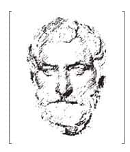
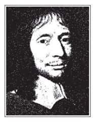
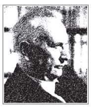

西方哲学家能够适应时代及社会实际的状况，提出一系列新的概念加以理解与诠释，因而西方哲学一直都在延续进展之中。西方哲学为什么以及如何有这样的发展？苏格拉底是典型的西方哲学家，可以通过他来了解西方人的思考模式。

# 时代与思想背景

苏格拉底是雅典人[1]，常被称为“西方的孔子”，这是因为他们都开创了一个新的时代。这个时代并不是靠军事或政治的力量所成就的，而是通过理性，对人的生命作透彻的了解，而引导出一种新的生活态度。

苏格拉底可以说是无所不学，并以一种开放的心态学习各种知识，他先后研究过当时势力最大的两派哲学，就是自然学派和辩士学派。

## 自然学派

自然学派所研究的对象是自然界（Physis，指有形可见并充满变化的一切），也就是研究自然现象。最初的几位希腊哲学家出于米勒图地区，所以又有米勒图学派之称。他们观察自然界，想要找出一切现象的根源。

希腊人之所以能由神话时代过渡到哲学时代，就是因为他们开始懂得以理性探讨宇宙人生的根本真相，而不再用神话或神的故事来解释人间所发生的一切，包括自然现象、社会分工，以及人的欲望等。泰勒斯（Thales，公元前624—前547）被称为第一位希腊哲学家，就是因为他说了一句话：“宇宙的起源是水。”为什么说了这句话就会成为哲学家？因为这是第一次有人用世界中的某元素来解释世界的一切现象。这是一种以“一”来解释“多”的思考模式，也就是用一个简单的原理来说明复杂的现象，把万物归之于一个因素[2]，这种“以一统多”的方式就叫做哲学。换言之，哲学就是要求一个系统，试图把整个宇宙、整个人生用一个概念来概括。  

泰勒斯  
Thales  
公元前624—前547

西方第一位哲学家。曾说：“宇宙的起源是水；一切都充满神明。”这句话的意思是：第一，“起源”（arche）一词的含义包括：开始、起点、原质、究竟底基、究竟原理等。在此之前，希腊人是靠神话故事作为解释宇宙起因的根据，至此才开始转向宇宙内部寻找起因。第二，“神明”一词表示，当时所谓的“水”并非单纯的物质，而是具有神性力量的物质。所以，不宜认为这些希腊早期的自然学派哲学家是唯物论者。  

由此可知，希腊哲学首先出现的就是自然学派，也就是设法用自然界的元素，解释大千世界的变化。然而自然学派演变到最后，必须随着各种科学仪器的改善而不断有新的发现。换言之，科学是永远研究不完的。我们每年都可以看到新的诺贝尔物理奖、化学奖、医学奖得主，但是却不可能有诺贝尔哲学奖。这就说明了，哲学不像科学，不可能突然产生一种新的理论，让所有人都觉得是一个新的成就，因为物质世界的研究和人类心灵的成长，是两个截然不同的领域。

泰勒斯是研究自然的哲学家，曾经预测过公元前585年5月28日的日食。由于他经常抬着头观察天象，有一天他走着走着，摔进了水井。跟在后面的女仆看到这种情形，笑他说：“你连地上都没搞清楚，还看什么天上呢！”这个故事相当适切地表达出当时人们对自然学派的批评。

苏格拉底也有过类似的感受，他起初探讨天上的云、自然界的各种现象，却发现这些东西不是他所能把握的，因为自然界的事物永远都没有定论。他最后说了一句话：“我的朋友不是城外的树木，而是城内的居民。”所谓的“朋友”（philia），在希腊文中代表了他所愿意接近的对象，苏格拉底既然把接近的对象转向居民或老百姓，就表示他开始注意到人生哲学。不过，当时最有影响力的人生哲学，是辩士学派的理论。

## 辩士学派

辩士学派的英文是“The Sophists”，Sophist就是“有智慧的人”，因此很多人又将它翻译为“智者学派”，这种翻译事实上并不妥当。由于这一派的人专门用辩论的方式阐述自己的思想，所以将其翻译为“辩士学派”是比较恰当的[3]。

当时的雅典人认为自己是开化的民族，而其他的民族都是野蛮人，这是一种文化中心主义。但是辩士学派的哲学家经常到处旅行，因而发现各地的奇风异俗。他们见多识广，明白人间所有的价值都是相对的，就连法律也不例外，譬如对雅典人而言，杀人是一件罪大恶极的事，但对其他比较野蛮的地区而言，可能会觉得杀人是一件稀松平常的事情。因此，辩士学派认为“人间的一切都是相对的”。

辩士学派的代表人物普罗塔哥拉斯（Protagoras）就曾经说过一句名言：“人是万物的尺度。”这句话表达出辩士学派的观点，认为人类本身的判断是宇宙万物最后的标准。不过，由于下判断的是“个人”，那么个人与个人之间的争议如何化解？

另一位辩士学者戈尔吉亚（Gorgias）的说法更为偏激，他作出了以下的结论：第一，天下没有任何东西存在；第二，即使有东西存在，也不能被我认识；第三，即使我认识了，也不能告诉别人。依次推论，还可以加上一句：第四，即使我告诉别人，别人也听不懂。这样一路下来，等于是否定了任何沟通的可能性，也否定了教育。

在实际的生活中的确如此：我对你说的话是我自己所了解的，但是你听了之后所了解的，难免会跟我想要表达的意思产生差距。由此可知，人活在世界上，要和别人沟通、建立共识，确实困难重重，而辩士学派即因此而主张没有绝对真理。换言之，辩士学派的目的是要打破许多固定的观念，使得一切都变成了相对主义，而相对主义最后恐怕就会沦为怀疑主义，也就是怀疑所有的一切[4]。

# 思想方法的特色

苏格拉底对自然哲学和辩士学派这两种极端立场都抱着批评的态度。他知道人生是在具体的实际生活中度过的，因此若是只研究自然，就会忽略了人生；然而，探索人生时，却找不到真理。那么应该怎么办？这就是苏格拉底必须面对的问题。因此，如同之前指出的，苏格拉底的老师是整个时代的思潮，所有过去的哲学思想都变成了苏格拉底学习及了解的材料。

雅典被称为西方文化的冠冕、西方文化的摇篮，这是因为雅典人在文化上的成就受到高度推崇。苏格拉底身为雅典人，自然也具有一定水平的知识。苏格拉底经历了两大战争，亦即波斯战争（波斯进攻希腊城邦，最后希腊以寡击众获胜）与伯罗奔尼撒战争（雅典和斯巴达爆发内战）。这是雅典由盛而衰的关键时期[5]，整个时代的变化也使他不得不发展出一套完整而充实的人生观。

## 对话的方式

要了解苏格拉底的思想，首先就要了解他所使用的方法。苏格拉底的方法简而言之，就是“对话”（dialogue）。

苏格拉底从来不作公开演讲，他认为若要探讨真理，应该由两个人进行对话。两个人有各自的立场，一个代表正方，一个代表反方，谈到最后变成“合”。“合”代表各自吸取了对方的优点，再往上提升。然后再以其为正，寻找另一个反，继续谈下去。这种对话就像是辩证（dialectic）的方式，不断向上提升。而苏格拉底的学生柏拉图后来参考他的对话方式，有时也以苏格拉底为主角，推衍写成了名传千古的《对话录》。

苏格拉底在对话中常使用到反诘、辩证、归纳的方法。反诘法就是在对话中不断反问，不断追问。辩证法则是当别人提到一个观点的时候，请教他此观点的反面能否成立，正反两面综合起来再往上提升。如此不断地提升，到最后会发现，真正的结论往往是有所保留的，因为不可能找到一个完全客观超然的立场或角度，可以作成最后的结论。这就好比阿基米德（Archimedes，约公元前287—前212）说的一句话：“给我一个支点，我可以撬起整个地球。”但我们知道在这个世界上不可能找到支点，所有的支点都是相对的，因为即使是地球，也不断在转动着。

这种辩证法说明了，人的心灵要永远保持开放，才能往上提升。人年轻的时候，往往觉得自己看到什么就是什么，这样未免过于执著。我们应当同意可能还有自己尚未看到的部分。就算我们今天选择过这样的生活，也必须给自己保留其他更高境界的可能性，在还没有到达那些境界之前，不应该先去否认或者怀疑。如此一来，人生才有继续提升的空间。

归纳则是从个别的事物中寻找出共同概念，亦即借由归纳法可以找到某个概念的定义。举例来说，我现在问：“你能不能告诉我谁是正直的人？什么样的法律叫做正直的？哪个国家是正直的？”这些问题都回答出来以后，继续问：“什么是正直？”这就是归纳法。若我们知道什么是正直的人、正直的法律、正直的国家，就可以归纳出“正直”为何，亦即通过归纳法找到定义。

## 苏格拉底的对话

举一个《对话录》中的例子，说明苏格拉底如何与他人对话，这种对话造成全城骚动，也造成他在思想上对雅典人的冲击。

苏格拉底晚年时，得罪当时社会上一些有权势的人，结果被控告“腐化雅典青年”和“对神不敬”。他接到传票后，一大早就到法院门口等待审判开庭，好像在等待他的命运一样。

苏格拉底在法院门口时，一个年轻人走过来。这个人对神学相当有研究，名为欧西弗洛（Euthyphro）。欧西弗洛看到苏格拉底，上前说：“先生，你怎么跑到法院来了？你这么温和，应该不是来告人的吧？”苏格拉底回答：“我是被告，你又是来做什么的呢？”欧西佛洛说：“我是来告人的啊！”苏格拉底接着问：“你要告谁？”欧西佛洛回答：“我要告我父亲。”苏格拉底一听感到很惊讶，又问：“你为什么要告你父亲？”欧西佛洛回答：“因为我父亲侵犯神的权利！”

原来欧西佛洛的父亲是一个地主，夏天的时候从外地请了一个工人到家中做工。这个工人和家中的长工起冲突，把长工打死了。欧西佛洛的父亲身为主人，于是命人把这个外来的工人捆绑起来，丢到山沟里，再派人到德尔斐神殿去求签。当时的希腊人认为只有神有权利判决犯错者应该接受何种惩罚，一般人是不能擅自做主的。然而，在接到神的旨意之前，这个工人就冻死了。欧西弗洛对于父亲因为疏忽而让工人死掉感到非常生气，认为这侵犯了神的权利。

苏格拉底了解事件的来龙去脉之后，开始与欧西弗洛对话。他说：“太好了！既然你认为自己对神非常崇敬，要维护它的权利，那么请你做我的老师，解除我的疑惑，启发我的智慧，让我知道什么叫做‘敬’（以前只对神用敬字）。因为我被控告的两大罪状，其一是腐化雅典青年，其二就是对神不敬。”欧西佛洛听了以后回答：“‘敬’就是做的事情让神喜欢啊！”苏格拉底接着问：“可是神有这么多位，应该让哪一位神喜欢？神与神之间有这么多仇恨、斗争，一位神所喜欢的，另一位神不见得会喜欢啊！”欧西弗洛听了，觉得很有道理。

的确，一件事情的好坏不能决定于神喜不喜欢，而应该决定于事情本身是否正确。换句话说，如果我们做的事情是正确的，神就一定要喜欢，因为神的本性不能喜欢坏的事，也不能不喜欢好的事。由此可知，一件事情的好坏是内在的，不是全由神来决定的。

如此一来，苏格拉底就把焦点转移了。他们继续讨论，苏格拉底的每一句话都是很谦虚的：“请你回答”“请你说明”“请你告诉我”。问到最后，欧西弗洛简直难以招架，于是干脆说：“总之，敬就是要对神很好！”苏格拉底听了就问：“所谓的对神很好是不是就像照顾马一样？你对马很好，替它刷背、替它洗澡，目的就是为了要利用它来替你拉车。那么你也是在利用神吗？”欧西弗洛哑口无言，发现自己原来根本不知道什么是敬，又怎么能够用这种理由来告自己的父亲？因此就借故离去了。

这是一个很典型的对话实例。苏格拉底走在街上遇到了人，就会问他：“你今天发生了什么事？我们来聊聊天吧！”和苏格拉底聊天必须很小心，因为对方只要在言谈中说了一个概念，苏格拉底就会针对那个概念不断追问，一直问到他答不出来为止。譬如，若你称赞某人很勇敢，苏格拉底就会问“何谓勇敢”，最后你会发现原来自己根本不知道什么是勇敢。

这种例子几乎在每一篇《对话录》里面都会出现。许多人在开始与苏格拉底对话时，无一不是信心满怀，认为自己很有知识，最后却会发现自己原来是如此无知。后来有一个学生受不了苏格拉底，趁着酒醉时告诉他：“你好像海中的黄鲷鱼[6]一样，任何鱼碰到你都会被电得麻痹，人们与你谈话就会觉得自己是如此的无知！”苏格拉底听了以后回答：“如果我是因为自己有知，而指出你们的无知，那是我不对。但请你不要忘记，我自己也是无知的！”

由此可知，苏格拉底作为一个老师，从来不教导别人什么知识，而是不断地告诉别人，他们所以为的知识其实都只是假的知识。若不先破除假的知识，怎么可能拥有真的知识呢？真的知识必须由内而发，由主体觉悟而生。

据说苏格拉底的母亲是一位助产士，专门协助别人分娩婴儿，而苏格拉底则认为自己也好似心灵上的助产士，要协助别人生出智慧的胎儿。换言之，智慧是必须由自己觉悟而生，不能由别人给你。别人所能给的只是可以表述的知识，这种知识没有太大的价值，因为我们不会去实践。真正的智慧是自己觉悟与体验到的，所以能够引发实践的动力，并且终其一生坚持不移。

## 知识就是德行

苏格拉底主张：知识就是德行。他认为如果一个人理解什么是德行，必然会实践德行。但是，为什么很多人明明知道自己做的事是错的，却仍然去做？举例来说，如果询问银行抢劫犯是否知道抢银行是错的，相信他们的回答都是“知道”。那么，既然知道抢银行是错的，为什么还这么做？这是因为他们认为“抢银行会对自己有利”。

所谓“有利”，就是对自己有好处，亦即对自己来说是一种“善”。但是先不谈违法的问题，试问：钱财对自己真的有利吗？或者是有利有弊？或者长期看来可能有害？或者对人生整体而言是害多利少的？真正明白了什么是善就不会为恶了。这说明了，这些人其实并没有真正了解“抢银行是错的”。说得更明白一些，一个人在做坏事时，他认为自己知道这是坏事，事实上他并不是真的知道，只是自以为知道，因为当他在做这件事情的时候，事实上是在想：“恶啊，请你做我的善吧！”

以作弊来说，许多人都知道作弊是坏事，但考试时却照样作弊，为什么？因为他们认为这么做对自己比较有利。由此可知，这些人实际上并没有真的了解什么是善、什么是恶，而把恶看做是善了。

对苏格拉底而言，一个人如果真的了解什么是恶，会唯恐避之不及，又怎么可能去做？相反，一个人如果真的知道什么是善，当然也会迫不及待想接近它。换言之，一个人如果认知了真正的善恶，就会自然且必然地行善避恶。之所以有这么多人没有行善避恶，就是因为他们未能认知真正的善恶。

明代哲学家王阳明也曾说过类似的话，他说：“知是行之始，行是知之成。”由此可知，真知必然能够实践，之所以未能实践，就是因为缺乏真正的理解。

# 生平大事

## 最有智慧的人

苏格拉底有一个学生很调皮，特地前往德尔斐神殿求签，请示神明谁是雅典最有智慧的人，结果答案是苏格拉底。这个学生欣喜若狂，跑去告诉苏格拉底。苏格拉底听了却相当不以为然，他为了证明自己不是最聪明的人，就带了一群学生去访问当时社会上著名的权威人士。

苏格拉底首先访问了政治家。因为政治家身负领导城邦走向未来的重任，所以应该彻底了解人生的真相、人生的幸福，以及人生应该如何规划。然而，当苏格拉底请教这些政治家“人生真正的幸福为何”时，却没有一个人答得出来，最多只知道要让社会治安好一点，经济繁荣一点，国民所得提高一点等。然而，这些怎么能称作是人生的幸福？人生的幸福必然要能够告诉我们人生的意义何在，对生死如何理解，对于人间的灾难、痛苦、罪恶、不义要有怎样的看法，了解这些之后才能够谈论人生的问题！

接着，苏格拉底访问了诗人。古时候的诗人代表了创作者，因此从荷马以降的悲剧作家都算是广义的诗人。诗人在当时的影响力相当大，许多年轻人都会熟读诗人的作品，他们也被称作年轻人的老师，因此苏格拉底就请教他们所写的作品具有什么含义。然而，这些诗人却无法清楚解释自己的作品，因为许多作品的产生都只是受到灵感的启发，而不是经过理性思考。

最后，苏格拉底访问了科技专家。当时科技专家的社会地位相当高，他们要造军舰、城邦，所以应该知道什么是真理，什么是真相。结果，发现他们也不了解真理为何，因为他们都是按照既有的蓝图去建造东西，并不了解背后的原理。

苏格拉底于是作了一个总结：神认为他最有智慧，是因为他比别人多知道一件事，那就是“我是无知的”，而别人连自己无知都不知道。

## 被人诬告，为己辩护

这三种在当时社会上最有权威的人，都因为与苏格拉底的一番谈话而感到尴尬与愤怒。他们认为雅典的年轻人本来相当谦虚，但是经过苏格拉底教导以后，变得很骄傲，认为这些权威人士根本什么都不懂。于是，他们找人控告苏格拉底“腐化雅典青年”和“对神不敬”[7]。

苏格拉底上了法庭之后，一个人面对五百零一人组成的法官团。当时苏格拉底已经七十岁，法官中大多数都是他的晚辈。在这种情形下，他原本应该很容易获得同情而被判无罪的，但是苏格拉底特立独行，坦然面对审判，没有请人替他辩护，而由自己为自己辩护。这一段精彩的过程，记录在柏拉图所著的《自诉篇》（Aplolgy）中。

苏格拉底在法庭上侃侃而谈，不但没有为自己求情，还详细说明自己到处与别人对话的理由。他告诉法官团：“你们都希望我从此不要再和任何人谈话，但是我不能这样做，因为我要听的是神的命令，而不是人的命令！我负有神的使命，我活着就是为了要实现神所托付的使命。因此，如果你们让我活着，我见到任何人还是要问：‘朋友，你是雅典公民。雅典是最伟大的城市，以智慧和强盛驰名远近。可是你只顾在多赚财富和博取名声与荣耀方面用心，对于内心的修养和真理，以及怎样使灵魂更趋完善等问题，却置之不理，难道你不感到羞愧吗？’”法官团听到一个被告讲出这样的话，当然非常不悦，认为自己原本是要审判苏格拉底的，结果却反过来被教训一顿！

苏格拉底本来是要为自己辩护的，但是他所说的话却让法官团深觉反感，因此最后以两百八十一票对两百二十票，被判有罪。法官团问苏格拉底想接受什么惩罚[8]，结果他回答：“对我最大的惩罚，就是把我供养在国家英雄馆，不让我在街上与人谈话！”

法官团听到这种回答会有什么反应？他们一怒之下以更大的比数（相差八十票）判了苏格拉底死刑。因此，苏格拉底的一生最后以死刑作为终结。

## 狱中讨论

苏格拉底在监狱中等待死刑的时候，正好碰到雅典的“圣船”仪式开始[9]，在一个月内不准杀人。这一个月当中，苏格拉底其实有很多机会逃狱，而且他的朋友、学生，包括柏拉图在内，都把钱准备好了，只要苏格拉底一点头，立刻可以潜逃。然而苏格拉底却坚持不逃狱，他说：“我身为雅典公民，一定要遵守法律。法律以不义的方式判我有罪，但我不能因此而反抗法律！”由此可知，苏格拉底的为人有自己的风格。

待在监狱中这一个月，每天都有朋友和学生来探望苏格拉底。他们经常与苏格拉底谈着谈着就忍不住哭泣起来，因为不久他就要死了。这时，苏格拉底却安慰他们：“你们认为死亡很可怕吗？”别人于是请教：“什么是死亡？你为什么不怕死？”苏格拉底回答：“死亡只有两种情况：第一，死亡就好像是无梦的安眠，而这是求之不得的！第二，死亡是前往一个过去的人所去的世界，所以我死后去到这个世界，可以同很多贤哲见面，这很好啊！”

经过苏格拉底这样的解释，死亡似乎没什么好怕了。一般人对死亡感到恐惧，是因为他们对于死亡有各种可怕的想法，认为死亡是一种恐怖的情况，而苏格拉底是一位理性的哲学家，可以从思考来化解疑惑。

死亡的期限到了，苏格拉底必须喝下毒酒，离开世界，他甚至还询问狱卒喝了毒酒之后的反应会如何，想先有心理准备。狱卒听了十分惊讶，因为一般的犯人都会不断咒骂，怨天尤人，从来没有一位犯人像苏格拉底这般温和有礼。

苏格拉底喝下毒酒，交代朋友帮他献一只鸡给医神，就离开了人间。希腊时代有个传统，当一个人从长久的疾病中复原之后，必须献给医神一只鸡。由此可知，苏格拉底将死亡看做是痊愈！换言之，灵魂与身体一起活在世界上的时候，是处在生病的状态，而身体的死亡让灵魂得到了痊愈。这种思想指出，人活在这个世界上就是在准备死亡、练习死亡[10]，因为死亡能够使我们的身体消失，而生命的本质（灵魂）由此摆脱物质世界的羁绊，不会再有各种欲望妨碍真正的自由了。苏格拉底死后，柏拉图赞叹：“他是我们这个时代所知道的最正直、最明智、最善良的人！”

# 生命内涵

关于苏格拉底的生命内涵，可以归纳为三个部分说明：追求真理、肯定传统、内心之声。

## 追求真理

追求真理是西方哲学家共同的目标。真理就是真实存在之物，此物与客观的命题或知识不同，而是“真实”本身。在希腊时代，“真理”这个词等同于英文的discover，亦即“发现”的意思。希腊人认为所有的一切都被盖子（cover）盖住了，有时是因为外在事物本身被遮蔽，有时则是因为我们自己的眼睛蒙上了一层纱，自己戴着有色的眼镜来看这个世界，所看到的当然与真实有所不同。

人生也有各种遮蔽，一个人在什么环境成长，接受何种教育，父母亲灌输了什么样的观念，都会让他有所遮蔽。如果想要发现真相，就须去除这些遮蔽。苏格拉底之所以不断让别人觉察自己的无知，就是为了帮助他们去除遮蔽，因为他们自以为拥有的许多知识，往往都是假的知识。经过与苏格拉底的谈话之后，就能破除这些假的知识，这也就是把遮蔽去除。去除了遮蔽，人才可能发现真正的存在。

苏格拉底一生都在追求真理，心中充满了对于存在（Being）[11]的向往，所以基本上他对于每天变化的一切并没有太大的兴趣。这种特质在他的学生柏拉图身上表现得更为明显，柏拉图一生所追求的都是无法通过感官，而必须通过理性才能掌握的真正的存在，称为“理型”（Idea）[12]。这等于是要人减少感官的作用，增加理性思考的运作范围，因为只有理性才能够帮助我们掌握到真实。

人活在世界上，因为有身体，所以永远不可能获得真正的智慧。哲学之所以叫做“爱好智慧”，就是因为人只能够爱好智慧而不能够得到智慧。身体使理性无法进行纯粹的运作，而必须借助各种感觉的官能。由此可知，身体就好像是障碍一般，我们要尽量减少它对心灵的干扰，让心灵做主人，而身体则是心灵的辅助工具，用来帮助主人完成他真正的目的。

## 肯定传统

哲学家即使怀疑一切，也是以此为方法，而不是以此为结论。苏格拉底认为我们对传统仍然要有基本的尊重，他公开宣称：“我希望你们和我年轻的时候一样，在还不能够独立思考、独立判断以前，能够遵守两样东西，一个是城邦的法律，一个是城邦的信仰。”这也就是说，一个人在尚未成年、还不能由自己作出决定之前，必须遵守法律，并且信奉祖先的传统宗教。

法律是最低限度的道德要求，而信仰则是对人生所作的高标准的要求，二者都是社会重要的传统资源。因此，遵守法律和信仰，可以化解很多人生的问题。这也是为什么苏格拉底明明可以逃狱，却仍然选择遵守法律的原因。至于追求真理，则必须等到有了独立思考的能力之后比较适合。

或许有人会问：“如果法律是有问题的，该怎么办？若是被人诬陷，还是要遵守法律吗？”

这其实不是一个大问题，只要能够遵守程序正义，知道现在这些人判了一个无辜的人有罪，将来历史则会判他们有罪，也就能坦然以对了。

## 内心之声

苏格拉底接受审判的时候特别提到一点：“我从年轻的时候就开始有一种特别的现象，亦即每当我要去做一件不该做的事情时，内心都会出现一个声音叫我不要做。”苏格拉底称这个声音为代蒙（Daemon）[13]，一般翻译为“精灵”或“守护神”。这个精灵有一个特色：它一向只说“不”，而不说“是”。换言之，只有当人要去做不该做的事情时，精灵才会出现，告诉你不可以，其他时候则不会发声。

这种说法听起来很玄，其实并不难了解。就像我们常说：“做这件事，会让我良心不安，很不忍心。”事实上，所谓的“不安”、“不忍”，即和苏格拉底所要表达的意思是相似的，只不过苏格拉底用一种非常具象化的方式来描述他的良知。

没有人可以证明苏格拉底是否真的听到了精灵的声音，因为其他人无法听到这个声音。但是从他的说明中，我们可以清楚了解，他所指的其实就是良知。

精灵永远只会说“不”，换句话说，当一个人在做该做的事情时，精灵不会有反应，因为人性本来就是向善的，做该做的事只是顺其自然罢了。但是在做不该做的事情时，精灵会叫你不要做，因为这件事并不符合你内心对自我的要求与期望。

苏格拉底把精灵讲得栩栩如生，以至于很多人误会，以为他自己另外创造、崇拜别的鬼神，所以后来才会控告他“对雅典的神不敬”。这其实很冤枉，因为苏格拉底本人并没有这种意思。

希腊人所谓的“神”（theos）一词，有四个意思：（一）泛指神性；（二）神祇；（三）介于人神之间的精灵；（四）神的子女。在此，“代蒙”是指第三义的“精灵”而言。换言之，苏格拉底认为自己所言并未背离传统信仰。

# 人格表现

有些哲学家说的是一套，做的又是另外一套，但苏格拉底则是希望把他的思想和行为结合在一起，通过理性的思维与行动的实践，使生命得到转变的机会。

关于苏格拉底的人格表现，可以分为三点说明：理性与自由、信念与尊严、生死与超越。

## 理性与自由

强调理性，并不表示要排斥宗教信仰，而是主张：任何事情发生时，都要从理智的角度加以掌握，并且保持心灵开放，多多参考别人的说法而不要妄下结论。

理性是哲学家的特征，在这一点上，他与科学家其实是抱着相同态度。若说一个人讲话很理性，就是指他讲话很有逻辑，不会太过冲动，好像立刻就想找到结论。孔子说过：“知之为知之，不知为不知，是知也。”（《论语·为政篇》）知道就是知道，不知道就是不知道，这即是求知的方法。换言之，我们到底了不了解，是要问自己，而不是问别人。这就是一种理性的态度。

“知”好像一个门槛，知道是跨过去了，不知道就是没过去，没有什么是在知和不知之间的。当然，一个人了解得越多，并不代表他越来越有知识。

事实上，一个人了解得越多，恐怕才越发现自己的无知，因为学习是永无止境的。莎士比亚说过：“愚者总以为自己聪明，智者却知道自己愚昧。”只有对任何事一知半解的人，才敢放言高论；反之，如果真的了解透彻，说话时会有分寸。

人类有理性，因而可以做自己的主人，这是自由的真谛。换言之，自由是指一个人不是被动接受别人给的规范，而是在别人告诉我该怎么做以后，自己能够思考，想通了之后才接受，然后去实践。自由不是为所欲为，也不是谁都不在乎，自由必然来自理性，理性思考后再作选择，这才是真正的自由。

## 信念与尊严

一般人谈起自己的信念时，往往必须接受别人异样的眼光，因为别人可能会质疑你的信念的基础，有什么佐证。事实上，信念是没有证据的，有证据的是知识而不是信念。换言之，知识一定要有证据，信念则否。当某个信念有了证据，就不再是信念而是知识了。

信念就是去肯定一个尚未被证明的说法，这种肯定不能只是说说而已，还需要用行动及生命去证明。例如，若我相信“人性向善”，但却从来不帮助别人，那岂不是自相矛盾？换言之，既然我相信人性向善，我的行为就应该有向善的表现，并且如果不行善，心里会感到不安，这样才能够说我是相信人性向善的。然而，如果有人说人性本善，我就不知道他在说什么了，因为“人性本善”，还要如何去实践？

一旦有信念，就必须以行动证明，在这个过程中会显示出人的尊严。也许当我去做自己所相信的事情，可能会和别人的做法有所不同，因为每个人相信的都不一样，譬如有人相信马克思主义，有人相信无神论，有人相信唯物论等。但是只要能够坚持按照自己的信念去行动，就会得到别人的尊敬，而这也是一个行动者内在的尊严。

有时候我们看到一些人彼此立场不同，却同样真诚，因此会怀疑这个世界究竟有没有真理存在。这其实是很自然的现象，因为人生就像爬山一样，每个人的速度不同，有些人很年轻就爬到了高峰。以魏晋时代的哲学家王弼（226—249）来说，他只活了二十三岁，但是现今研究老子的人，就算到了八十几岁仍然要读王弼的《老子注》。又如著名的数学家兼哲学家帕斯卡（Blaise Pascal，1623—1662），也不过活了三十九岁，但是我们到现在还是要阅读他的书。  

帕斯卡  
Blaise Pascal  
1623—1662

法国哲学家，也是近代数学天才，十九岁时发明了历史上第一架计算机。他以《沉思录》而广为人知。

他对人生的体验与反省极为深刻，曾说：“人只不过是大自然中最柔弱的芦苇，但他是会思想的芦苇。他不用等待全部宇宙武装起来打击他；一点蒸气、一滴水，就足以置他于死地。可是，宇宙压溃他时，人仍比他的凶手更高贵；因为他知道死期已到，而宇宙毫不知情。”在宗教信仰方面，他提出“赌注论证”，认为人若相信神的存在，“假如你赢了，你得到一切；假如你输了，你也毫无损失（因为人难免一死）”。  

因此，生命的长短并不是最重要的，重要的是生命的密度。有些人可以在很短的一生中，以一种信念作为原则，表现出生命的精彩。相反，如果一个人想要把所有的道理都研究透彻，再去选择人生的道路，那么他可能永远无法往前，因为人生并没有一条绝对正确的路，任何一种理论都可以找到与它相对的另一种理论。

事实上，真理要靠实践去印证，而不是在理论上争个对错。如果在理论上争论，首先必须解决许多后设的问题，譬如若要讨论某种学说，就必须先了解这个学说的命题，以及其中所提到的各个概念定义为何，是怎么产生的。然而，任何一个概念都针对一个真实的情况，所以这个时候就会出现许多弹性空间。举例来说，谈到桌子时，因为桌子的种类非常多（如办公桌、课桌、餐桌等），首先必须弄清楚彼此所指的是哪一种桌子。

依此类推，在实际的生活中，任何一个概念都可以作各种不同的应用。我们会发现，很多所谓的“对”，其实只是方法上的正确。举例来说，假设我现在要去美国，正确的方法是坐飞机，若想用游泳的方式去美国，恐怕永远都到不了。所以坐飞机去美国在方法上是对的，但我要去美国的动机却不见得正确。

因此，“把事情做对”与“做对的事情”是不同的，一般人活在世界上通常希望能够把每一件事都做对。换句话说，每一件事都有很多种方法可以达成，而我们要选择其中最适当的一种，这也是学校教育的目的之一。但事实上，还有比这个更重要的，亦即，我们要去“做对的事情”。那么，我们首先就要问自己：“什么事情是对的？什么事情是错的？”也就是要能够分辨善恶是非，而在这里面，就包含了许多价值上的抉择。这也就是为什么哲学与人生有着密切的关系。

## 生死与超越

苏格拉底面对死亡十分坦然，他何以能够如此？生命是有限而值得珍惜的，活着本身就是一种当下的肯定，这种肯定会让一个人觉得有希望。不过，虽然我们常说活着就有希望，但是大多数的人活着时，往往没有想到死亡的威胁，而随意浪费时间。

要改变这种情况，必须常常练习把死亡拉到眼前来看。一个人只有在面对死亡的时候才会真正严肃，能为自己所拥有的时间作妥善的分配和安排。人的生命是在时间当中表现的，甚至可以说时间就是生命，如何掌握自己的时间，就是如何安排自己的生命。如果没有把死亡拉近到自己眼前，很容易误以为时间永无止境，可以让人随便使用，这样一来就是在浪费生命。

人生不堪浪费，当然，这也不代表人每天都要过得战战兢兢，好像一直处于战斗的状态。人生有如一首乐曲，要有一定的主题、一定的节奏，还要有各种随时插入的和声、间奏，这样的生活才能显示出它的韵味。

苏格拉底生长在雅典这样一个爱琴海畔的小小城邦，却从来不觉得自己有什么局限，这是因为他能够随时自我反省。一个人只要有自觉，他就成为宇宙的中心，问题只在于，我们是否能够像苏格拉底一样，活出这样的气魄。

像苏格拉底这样的人，自然会带给后人深刻的影响。柏拉图在苏格拉底过世之后说了一句话：“老师死了，我们这些学生都变成孤儿。”由此可知，苏格拉底就像这些学生心灵上的父亲。柏拉图甚至曾经说：“我觉得自己非常幸运，因为我生为雅典人，而不是蛮族；生为自由人，而不是奴隶；生为男人，而不是女人[14]。但是，我真正觉得最庆幸的是，能够生在一个苏格拉底的时代，能够亲近他，向他学习。”柏拉图的《对话录》影响西方文化非常深远，是西方哲学最早期也是最重要的经典，因此有人说：“谈起希腊，转头必见柏拉图。”可见苏格拉底的事迹经过柏拉图记载后，对后世的影响多么深远！

# 结论：活出自己

苏格拉底从平凡的环境中成长，通过一生的努力，在思想上、实践上不断转化，最后能够表现出“人之所以为人”应该具有的风范。正因为如此，苏格拉底成为雅斯贝尔斯（Karl Jaspers，1883—1969）所选出的四大圣哲之一，与释迦牟尼、耶稣、孔子齐名并列。  

雅斯贝尔斯  
Karl Jaspers  
1883—1969

德国哲学家，当代存在主义的代表之一。他研究东西方伟大哲人的观念与作为，特别选择四位典型——苏格拉底、佛陀、孔子、耶稣——编成了《历史的巨人：四大圣哲》这本书。  

他写道：“他们的生命核心，在于体验了根本的人类处境，并且发现了人类的在世任务。”“在他们身上，人类的经验与理想被表达到最大极限……他们的真实生命与思想模式，已经构成人类历史不可或缺的要素了。他们成为哲学思想的来源，同时激励人挺身抵抗，抵抗者通过他们的表率，首先获得了自我觉悟。”

关于雅斯贝尔斯本人的思想，请参考本书第六章。  

苏格拉底是西方哲学家中最有典型、最有特色的代表，他把一个人的生命充分活出来。从他一生的经历中，我们可以获得启发，体认人生总是会面临各种遭遇，会有得意、失意，即使面对不义时，都要坦然接受。更重要的是，人活在世界上，要把关注的重点，由外在转向内在，因为人生终究会结束。

在此，我借用雅斯贝尔斯在《四大圣哲》里面对苏格拉底的描述，来作为本章的结束：

“苏格拉底临终前，安慰朋友们说：“你们所埋葬的只是我的躯体，今后你们当一如往昔，按照你们所知最善的方式去生活。”

那些在他死前环绕身旁的朋友都怀着复杂的心情，既昂扬又绝望。在悲伤哀恸与兴奋莫名的气氛中，他们领悟了一种神妙的境界。

苏格拉底立下了伟大的典范：在面对浓烈的哀愁时，能够解放灵魂，展现伟大仁慈的平安气氛。死亡于此失所凭依。这不是掩藏死亡于不顾，而是肯定：真正的生命不是走向死亡的生命，而是走向善的生命。苏格拉底不曾留下任何著作，但是却为希腊哲学注入强心针，激起了无比汹涌的风潮，余波荡漾绵延至今。”

* * *

[1] 雅典是希腊的一个城邦（City State）。希腊地区还没有大的国家，是由一个个的城邦所组成的，城邦的人口往往只有几十万人。这样的城邦虽然相当小，但由于其本身经济能够独立，因此在政治上也就能够有自己的掌控范围，居民也能选择各种不同的政治实验，包括贵族政治、民主政治、寡头政治等。

[2] 其后有人主张宇宙的起源是火，有人主张是气，也有人主张是一种不限定的东西，甚至有人干脆说宇宙是由水、火、土、气四种元素构成的。事实上，主张宇宙由水、火、土、气构成会有很大的问题，因为如此一来就必须解释这四种元素之间的关系，但这基本上是一个很难回答的问题，因为无论宇宙由哪些元素构成，到最后还是要有一个根源，否则无法自圆其说。

[3] 辩士学派除了自己与人辩论外，也教导他人辩论的技巧。从希腊一直到罗马时代，辩论技巧都是有心从政的人重要的条件，尤其在议院中，拥有好的口才更是不可或缺的。

[4] 事实上，真正的怀疑主义并不能成立，因为一个人如果是怀疑主义，根本就无法说话了，譬如：假设我说：“我怀疑一切。”然而，既然怀疑一切，那又怎么知道有“我”呢？如果没有“我”，又怎么能怀疑，怎么知道什么是“一切”呢？如果不能肯定什么是“一切”，那我们又在怀疑什么？由此可知，怀疑主义不能说话，只能用怀疑的眼光安静地看着这个世界。

[5] 苏格拉底三十八岁时，雅典和斯巴达为了争夺希腊城邦的领导权，爆发了伯罗奔尼撒战争（the Peloponnesian War，公元前431—前404）。这一仗打了二十七年，雅典最后战败，斯巴达人准备进城把雅典毁灭。在进城的当天晚上，斯巴达的将军一起聚餐庆功，宴会中找了一位雅典人来唱诗助兴。唱完一首诗之后，斯巴达的将军说了一句话：“一个城邦能够产生如此优美的诗歌，它不应该被毁灭！”第二天就班师回朝，雅典得以保全。由此可知，雅典之所以能够免于被毁灭，正是因为其文化的卓越成就。

[6] 这种鱼带有电流，其他鱼如果碰到这种鱼，就会被电得麻痹。

[7] 他被控告的内容是：“苏格拉底作为不当，他败坏青年德行，不信城邦所信的神祇，而信其他新的神灵。”此处所谓的“新的神灵”即是后面“内心之声”一节所说的“代蒙”（Daemon）。

[8] 雅典的审判分为两个阶段，第一个阶段要先审判是否有罪，第二个阶段才判决应为何罪。当时雅典有一种习惯，亦即，若犯人被判有罪，法官团会让犯人自己提议要接受何种惩罚，然后看大家是否赞成。

[9] 雅典古代有一习俗，亦即每年五月派船前往祭祀阿波罗，以示感谢神明保佑雅典王子忒修斯（Theseus）杀死牛神（Minotauros），救回雅典奉献为牺牲品的七童男七童女。在圣船来回的三十天期间，城中应保持绝对洁净，不许有刑杀之事发生。

[10] 练习死亡不是要我们自杀，而是要我们把身体的欲望慢慢消减，使它不能控制灵魂，而让灵魂越来越自由，做一个真正的人。

[11] “存在”（Being）是一个重要的哲学术语。凡是存在之物，皆可以用“存在者”（beings）来概括，而使这些存在者得以存在的基础或力量，则称为“存在”（大写的Being）。这个“存在”在位阶上，与“上帝”相当，亦即西方哲学所欲探求的“究竟真实”。

[12] 柏拉图所谓的“理型”，是指理性才可以理解的“真实”。理性是“发现”而不是“发明”理型，所以他的思想不是近代所谓的唯心论。

[13] 所谓“代蒙”，是指希腊人相信的精灵，随着人的降生而出现，预示了人的命运。苏格拉底所描述的精灵能够向他示警，所以受到人们的质疑。

[14] 虽然雅典以民主制度闻名，但是女性在政治及教育上都没有受到公平的待遇。

