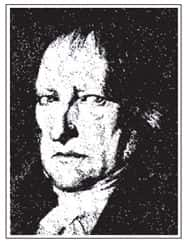
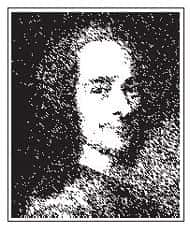

在谈论西方文化的时候，必须对神话、悲剧与《圣经》故事有一些基本认识，才能真正了解此一文化的内涵。以《泰坦尼克号》这部电影为例，在船快要沉没之时，船上的乐团演奏了一首名为《求主垂怜》（Nearer My God to Thee）的曲子。若是对其宗教背景不了解，就无法体会为什么他们在快要离开人世的时候，需要靠这样的旋律来抚慰人心。

人生无异于旅行，生死就像起点与终点，终点是结束，也是另一种生命的开始。在面临死亡时，如果获得神的怜悯，又何须害怕呢？这是西方宗教（主要是基督教）的明显影响。

本章要谈论的是关于西方的神话与悲剧，这是我们认识西方文化的根基时，最重要的资料之一。

# 神话：神界故事、民族的梦、不自觉的虚构

“神话”的英文是myth，讲的是有关神的故事，亦即神与神之间所发生的许多事情。每个民族都有属于自己的神话，即使是非常开化的民族、发达国家，照样会有一些神话流传着。

如果民族没有神话，就像一个人活在世界上无梦可做或不曾做梦一样。一个民族在有文字记载的历史以前，就像人类的幼年阶段，需要靠虚构的故事来认识周遭的一切。就此而论，神话与童话是相似的。

神话又与童话不同，神话是民族的梦，没有固定的作者，只能靠口耳相传，因此，神话总是有着各种不同的版本。童话则有作者，所以有固定的版本，譬如安徒生童话就只有丹麦作家安徒生（Hans Christian Anderson，1805—1875）所写的这一个版本而已。

童话是写给小孩子看的，因为小孩子需要有梦想，神话则是民族的梦想，因此我们如果了解童话的性质，对于神话的本质也能够有些基本的认识。

童话的开头一定是“很久很久以前……”，结尾则是“从此以后……”。它不能有确切的年代、时间，因为如此一来就变成历史了。童话不是历史，因为它不是这个世界上真正发生过的事。

童话中一定会有固定的规则，譬如：善有善报，恶有恶报；只要努力就可以达到目标等。这些规则让小孩子在还没真正接触和了解现实世界之前，就对人生有一些基本的信念。有了基本信念，他在往后的一生中才有能力去迎接各种不同的考验。反之，一个人如果从小就没有梦想，这是不近情理的。

《泰坦尼克号》中有一幕，描写三等舱的人在船快沉没时出不去。其中有一位母亲让孩子躺在床上，听她讲故事，希望孩子能够在美妙的故事之中离开这个世界。这个世界对于穷人是非常残酷的，但是穷人照样可以有梦想！

神话的开头常常是“在起初……”，因为接着所描述的故事是以前不曾出现过的。然后这些故事是来自“不自觉的虚构”，是人类面对一个客观现象而没有能力理解，同时又非理解不可，于是辗转流传一些故事来说明之。譬如，古人对于日食、月食，如果不靠相关的虚构故事来满足自己的知性需要，就只能活在未知的恐惧之中了。

## 神话的基本信念

首先，我们要说明，神话在一个民族的形成中究竟扮演什么样的角色，具有什么样的作用，表达了哪些基本信念。

神话的基本信念可以分为四点：天人无间、万物有生、情感主导、戏剧性格。以下分别加以说明：

（一）天人无间

天代表大自然，人代表人类，天人无间是指大自然与人类之间没有隔阂。这意味着在神话世界里，人与自然界的关系非常亲密。譬如，把太阳视为自己的祖先；把月亮视为自己的母亲等。在神话里，人跟大自然、宇宙，就好像是生命共同体[1]一般，是同体、同质的生命。

（二）万物有生

在神话世界中，由于万物都是同体、同质的生命，因此可以互相转化（Everything can become everything）。这也就是说，所有东西都可以变成别的东西。譬如，我们可以看到有的人到最后变成了神明，有的神明则变成人。大自然也是如此，太阳有它的神，月亮有它的神，海洋、高山、河流、花草树木等，都有它们自己的神。换言之，整个宇宙的生命显示一种交流、沟通的情况。

所以在神话世界中，往往会让人有一种宾至如归的感觉，就好像大自然是自己的家一般，把大地当做母亲，可以说是神话中的普遍信念。几乎每个民族都有大地之母（Mother Earth）的神话。

（三）情感主导

神话基本上不是靠理性原则、逻辑思维来安排的，而是依情感展开，因此充满了感性的色彩。神话之中的神，往往都会有明显的情绪表现（如喜怒哀乐、爱恨等），代表着一种尚未经过文化陶冶及修饰之前的，较为自然、原始、粗糙的人性的面貌。

（四）戏剧性格

神话所表现的，不是叙述与说理，而往往是像戏剧一样，有着特殊情节与存在处境。阅读神话时，会发现其故事情节充满了戏剧张力，好像是以表演的方式重现了人类的起源与一切相关的奥秘。

一般人最为熟知的神话大概就是希腊神话，但在希腊神话中诸神明所做的事，对人类而言，究竟有着什么样的参考价值？希腊神话中天神宙斯（Zeus）、海神波赛冬（Poseidon）、冥王哈得斯（Hades，地狱之神），分别统管着三大领域：天、海、地狱。除此之外还有雷神、电神等，不胜其数。只要是我们所能想像得到的，关于大自然的一切，都充满了生命。这些神祇之间的爱恨情仇，所激荡出来的涟漪，固然使人看得惊心动魄，但同时也产生了极为重要的作用。

## 神话的作用

古时候的人因为理性功能还不太发达，或者说尚未充分施展开来，所以需要另外找一些对宇宙人生的解释。我们可以想像古时候的人处在宇宙洪荒之中，刚从混沌进入一个有形可见的秩序，就和其他生物一样，只能在大自然中求生存，生命毫无保障可言。当生命随时都处在危险之中，会产生怀疑：就算人类懂得制造一些物品，但若没有办法掌握变化万千的世界，甚至没有把握自己下一刹那是否还活着，那么现在制造一张桌子又有什么必要性？

中国古代的人用四个阶段说明文明的发展：有巢氏、燧人氏、伏羲氏、神农氏。这种描写既生动又实际：有巢氏时期人类住在树上，因为地面太过危险；燧人氏发明了火，有了火之后就可以回到地面居住，因为只要把火生起来野兽就不敢靠近；伏羲氏时期人类开始懂得饲养一些比较温驯的动物，把它们作为家畜、家禽；到了神农氏时期，农业社会出现，人类开始懂得合作耕种，改善生活。

在人类的理性还没有能力了解世界之前，必定需要神话。举例来说，某个地方一直下雨，最后演变成洪水。当洪水来时，人类的生命没有保障，也不知道大雨什么时候会停。于是人们杀牛去祭神，当杀了第三头牛时，雨终于停了。从此以后人们就知道，下雨不止的时候要杀三头牛来祭神。

为什么人们会想到要借由祭神的方式来让洪水停止呢？这是因为他们相信——人类可以和操纵雨水的神沟通。虽然这是由于民智未开、教育尚未普及、科学思想不够发达所造成的一相情愿的想法，但这仍然说明，人类活在世界上，如果发现大自然可以借由某种方式沟通，就会比较安心；反之，如果认为大自然是非人性、无法沟通的，那么活着也就没有任何保障，因为各种灾祸随时都可能发生，而人的生命又是如此脆弱，只要稍有变化，就可能立刻死无葬身之地。这正是人类需要神话的原因。

由此深入探讨，可知神话有以下四个作用：掌握真实；建立原型；为世界带来意义与结构；说明自然现象、社会分工、人的欲望。以下即针对这四点分别加以说明：

（一）掌握真实

可能有人会质疑：“神话明明就是虚构出来的东西，如何能掌握真实呢？”一般人往往以为只有历史的记录才是真实，其实人在记录历史事件时，是采取特定的角度，对某个已经发生的事件作一些描述，然而每一个时代所采取的角度都有所差异。正因为如此，每隔一段时间就必须重新检视历史记载是否正确。西方历史学家强调：“历史就是现代史，每个时代当时的人对于古代发生的事都要重新加以解释。”

但是，可以解释就代表不是真实，因为真实是没有解释空间的。换句话说，每个人所了解的都只是当时的人所能够掌握的一部分，并非完全的真实。

历史是在时间之中一去不返的，凡是一去不返者，就无所谓真实可言，所以没有任何历史学者会说自己能够掌握绝对真实，就连司马迁或班固也不例外，因为既然每个人的角度都不同，就不能说有哪个人所记录的是绝对正确的。历史学的研究中往往特别重视考古学，有时候一些文献、绝版书籍的出土，就会把某段历史完全改写。换言之，历史是随时等待被改写的，那又有什么真实可言呢？

黑格尔说过：“人类从历史中学到的惟一教训就是，人类无法从历史中学到任何教训。”既然历史中没有真实，那么我们就要问：“如果没有真实，那么人类的生命不是很混乱、很危险吗？过去的事情不会重现，而未来又充满了不确定性，那么我们应该何去何从呢？”由此可知，人类还是需要真实，而神话就提供了我们掌握真实的机会。  

黑格尔  
Georg W.F. Hegel  
1770—1831

德国哲学家，主张绝对唯心论，认为宇宙万物的本质是精神（又称心灵、思想），精神的本质是活动而非静止，所以精神必须走出自己再回归自己，而方法则是由人类的有限精神去发现一切皆是绝对精神的展现。

他说：“绝对者即是精神，这乃是绝对者的最高定义。发现这个定义并且理解这个定义的意义和内容，可以说，曾是一切教化和哲学的绝对目标，一切宗教和科学都曾渴望达到这一点；只有从这种渴望出发，世界史才可以理解。”

黑格尔逝世的1831年，代表近代哲学的结束，后续的发展较为复杂，请参考本书第六章。  

神话要如何掌握真实呢？神话所展现的是一种人类对永恒的向往，因此可以通过对神话的理解，发现生命中普遍的、永恒的层次。以亚里士多德的观点为例，当他谈到文学的时候，说了一句话：“我们在这个世界上找不到正义，只有在诗里面可以找到正义。”

在现实的生活中，某个人认为正义的事，另一个人不见得也会如此认为。譬如，许多人常说高考是最公平的，但是对于那些高考失利的人而言，恐怕就会认为高考不太公平。又如，若是某个人遭遇了不幸的事情，恐怕会认为这个世界不太公平、没有正义；相反，若是这个人一直都很顺利、很得意，恐怕就会认为人生很公平。

这个世界上或许没有所谓真正的正义，但文学里面则有所谓“诗的正义”（Poetic Justice）。金庸小说就是一个典型的例子，他的每一部小说结局几乎都是“善恶到头终有报”，坏人到最后都不会有好下场。事实上，在真实的世界中却不是如此。因此诗的正义反映了人类对永恒的向往，这才是真正的真实。亦即，我们在神话中所看到的是一个原型：“一个人有什么样的作为，就会有什么样的后果。”这之间有一种善恶对称的报应关系，其所表现出来对生命的理解，才是人的生命中最真实的部分。其他的部分（如个人遭遇、每个时代不同的价值观等）则都是会变化的。

（二）建立原型

人活在世界上会面临各种存在处境的断裂状况，而原型可以让我们跨越存在之断裂。譬如，当我们要从少年跨越到成年，进入成人社会时，就面临了一个存在的断裂，我们必须跨过这个门槛，成为一个大人。这时候就需要通过一个故事来解释，这就是原型。举例来说，台湾有些原住民的成年礼是要通过某种考验，譬如给你一把小刀，让你到山里面住一个星期再回来。一个星期回来之后，就算是通过考验，变成了成年人，然后可以进入成人社会，和其他成年人共同商量整个部落的发展，并且能够成家立业。

存在的断裂有四大状况：出生[2]、成年、结婚、死亡。这四大存在的断裂都需要有原型，而这些原型就是由神话所提供的。以出生为例，南方有一个习俗，就是小孩出生后满月时要请吃红蛋，让亲戚朋友知道自己家中多了一个生命，这个生命将来要请大家多多照顾等，这就是原型。

接着谈到成年。许多国家，例如日本、韩国都有成年礼，年轻人在二十岁时会穿上传统服装，仪式十分庄严。现代中国最可惜的就是没有一套好的成年礼，有时候我们看到别人有成年礼会觉得很羡慕，因而想要恢复传统的成年礼，却总有很大的困难。

我在教书的过程中，曾经有一位学生向我抱怨，说他在高中毕业时，参加县长主持的成年礼，并且和县长合照，照片还放大挂在家里。第二年县长被刺杀，他只好把照片收起来，成年礼变成一个梦魇。另外一位从南部来的同学，则是参加了一个官员主持的成年礼，也同他合照。第二年该官员被关进监狱，他只好把照片收起来，成年礼变成了一件荒谬的事情。

这种现象的缘由，是因为我们的社会泛政治化已经太久了，一个人只要在政治上有某种权位，影响力就无所不在。然而，人类生命存在领域的跨越是非常重要的，一旦泛政治化，就会产生很多问题。所以应该要让政治的归政治，文化的归文化。那么找谁来主持成年礼比较好？我曾经为文建议，每个县市设几位礼仪的主持人，这些人最好是年高德劭、曾在教育界服务一辈子的人士，请他们来主持比较不会有后遗症。任何一种礼仪都具有象征性，所以更需要有良好的对象作为表率，让学生从中学习。

整体而言，神话提供了一个故事，通过这个故事可以了解到仪式背后所具有的含义，如此一来，就可以建立原型。宗教之中也有许多仪式，譬如：赎罪的仪式、受洗的仪式，或者是佛教中的皈依、供佛、斋戒等。这些仪式背后都有神话，只是我们不见得了解。若不了解仪式背后的神话，那么某个仪式只不过是一种客套、形式，而没有内涵。神话可以把故事说出来，让我们回到最初实施某个仪式时真正的情况，也就是回到原始的真实，才能让我们现在所做的事情得到充分的肯定。

（三）为世界带来意义与结构

这个世界本身很难理解，我们要理解它，就必须使其具有意义与结构。神话中常会描写，这个世界最初是一片混沌（chaos），最后才变成有秩序的宇宙（cosmos）[3]。神话中有许多故事都是用来说明这个世界有什么意义，它的结构如何等，让人类活在世界上，可以懂得如何安排自己的生活，让这个世界不再黑暗、朦胧不清。换句话说，神话可以让人类清楚地知道上下四方、前后左右，让自己的世界显示出一种重要性。

所谓的重要性是指：每个民族都会借由神话，来肯定自己的特别之处。世界上每个民族都认为自己很特别，譬如：犹太人认为自己是上帝的选民；伊朗人认为其境内的伊朗高原是上帝造人的地方等。中国之所以称为中国，就是因为认为自己位于中央，是最重要、最有价值的一个民族，其他国家只不过是野蛮民族而已（如东夷、西戎、南蛮、北狄）。

几乎每个民族都有类似的神话，认为自己是宇宙的中心，或者自己的祖先是神特别创造的，能够得到神的眷顾。这种神话可以建立民族的自信心与认同。举例来说，欧洲有一个小国叫做奥地利，其人民跟德国同文同种，属于日耳曼民族。那么我们可以问：“德国如此强盛，而奥地利这么小，经济也不算富裕，那么奥地利人为什么还愿意做奥地利人呢？他们为什么不干脆移民到德国？”这是因为奥地利人很重视文化教育，他们教导小孩每天在睡前聆听国家广播。广播中总会有一句话：“没有奥地利，就没有欧洲；没有欧洲，就没有世界。”所以奥地利人能够以身为奥国人为荣。这句广播词的确有它的根据。欧洲整个局势的形成受到奥匈帝国极大的影响，而奥匈帝国就是以奥地利为核心的。

这种对于文化的认同，是一个民族在今日多元化的世界上，寻求长久存在的最佳办法。台湾其实也一样，即使很多人都抢着移民到岛外，还是有些人不愿意离开台湾，就是因为他们认同这个民族的文化，认为以中华文化作为基础的生活方式，有其特别的价值。

许多人认为中国最值得自豪的部分就是中国菜，当然，中国菜确实是很特别，许多外国人也很向往。然而，一个民族若是只能靠吃来取胜，似乎并不是一件太光彩的事情。我们还需要发扬其他值得骄傲之处，而这部分就是“文化”。

记得1983年我在美国，当时的美国总统里根，在发表国情咨文时用了一句老子的话：“治大国，若烹小鲜。”[4]我听到觉得很兴奋，因为就连美国总统都知道老子的话很有道理。事实上，中华文化的资产相当丰富，外国人也常借用这些思想，老子不过是其中之一而已。

任何一个民族都有引以自豪的部分，如日本国旗是一个太阳，而韩国国旗则是一个太极图，这些图形都带有“根源”的含义，一个国家受文化的影响越深，就会越肯定自己的根源；相反，如果一味追求现代化，到最后就会与根源脱节，只能在变化的潮流里面，力求不被淹没而已。

（四）说明自然现象、社会分工、人的欲望

●自然现象：古时候的人知识不够发达，如果没有神话可以说明自然现象，难免每天生活在不安和恐惧之中。有神话可以解释自然现象，人们才会觉得比较安心。譬如：打雷代表雷神发怒，但是只要没做坏事，就不需要害怕打雷，因为只有做坏事的人才会遭到天打雷劈。经过这样的解释之后，人们在打雷时就比较不会担心。

●社会分工：任何一个社会都需要分工合作，自古以来即是如此，譬如有人编草鞋、有人做衣服、有人耕田等。如此一来，一个社会才能维持、合作、发展。

每一种职业的背后都有神话，各行各业在最开始的时候有一个了不起的人发明了这种行业，因此以后从事这个行业的人必须定期祭拜他。而这个人的故事，也能够鼓励同行业的人坚持自己的原则和理想，相信自己对社会有所贡献。举例来说，老师这个行业是以孔子作为始祖，所以当孔子受到大家推崇时，也会让许多人觉得老师这个行业是值得尊敬的。又如我们常可以在香港电影中看到，警察和黑道都要拜关公。由此可知，每一种行业都会有神话来说明它的内在价值。

●人的欲望：每个人都有七情六欲，如果不了解神话，而只看自己本身，很容易被自己内心的矛盾所吓倒，觉得自己有时候很高尚，有时候却很卑微。譬如“9·21”地震之后，很多人抢着捐血，在排队的那一刹那，觉得自己真是一个有为而可敬的青年，能够跟时代的需要完全结合。但有时候可能又会想去排队买凯蒂猫，这时候就会觉得自己相当平凡。由此可知，人的欲望是多面性的。

人类的许多欲望，以及人间各种复杂的恩怨，甚至是相互的伤害，其背后都有神话可以解释。最有名的例子就是希腊神话中，克洛努斯（Kronus）杀了自己的父亲尤拉诺斯（Uranus），而他的儿子宙斯又将他杀死的故事。这故事并不是真的在说谁杀了谁，而是代表一种取代，一个新阶段的开始。德文中“ur-”代表根源、最原始的东西，Kronus则代表了时间（chronicle，为年代之意）。有了时间，原始就被淘汰了。宙斯则代表宇宙主神的出现，也就是有了一个主宰，因此其又超越了时间。古代的人就是用这种神话来象征生命发展及宇宙发展的阶段。

有了神话的说明，人们对于世界上各种怪诞的事情就可以理解。人活在世界上，最重要的不是只有活着，而是要了解自己为什么活着——人如果不知道自己为什么活着，就算生活得很好，也是没有任何意义的，因为他连活下去的理由都没有。

## 神话的主题

神话的主题大致可以分为六种类型：创世、造人、灾难、救世、文化超人、英雄典型。以下分别加以介绍：

（一）创世

创世神话是最原始、最典型的神话，开头第一句即是“在起初”（in the beginning……），因为在此之前并无世界。神明创世的方式主要有两种：一是无中生有，如犹太人的《圣经》（《旧约》）所描述的；二是为混沌带来秩序，把原始物质整理为可供万物生存的宇宙，如中国神话中的“盘古开天辟地”即为一例。无论如何这个世界都已经出现了，所以需要通过神话来加以说明。

（二）造人

世界出现之后，接着就要描述人的存在，因此造人的神话又更多了，譬如有的神话说人可以区分为金银铜铁不同的材质，有的神话说人是神用泥土造成的。在此我要引述一则古代寓言，其中谈到的“造人”的过程，虽然超出了原始神话的领域，但是对于我们认识人的特质，却有很大的启发性：  

> > > 挂念过河的时候　看到一块黏土> > > 他思念着　拿起土开始塑造> > > 他正在想　自己做了什么东西> > > 精神来了> > > 挂念就请求精神把精神赐给这块土> > > 他轻易地得到他所求的> > > 当挂念要取它的名字时> > > 挂念说取为“挂念”> > > 精神不肯　他说你应该取我的名字> > > 因为我把精神给了这块土> > > 挂念与精神在争论不休时> > > 大地起来了> > > 他说应该取名为“大地”> > > 因为是他提供了肉体> > > 于是　他们邀请时间来做法官> > > 法官作这样的公正裁判> > > 精神既然给了精神> > > 死了之后你取回精神> > > 大地既然给了肉体> > > 死了之后你取回肉体> > > 挂念既然最先塑造> > > 有生之日　就让他来掌握> > > 但是现在因为名字而发生争执> > > 可以称它为homo> > > 因为他似乎是由泥土（humus）所造成的  

（三）灾难

只要人类出现，地球上就必然会有灾难，因为人类是一种群居的、社会性的动物，聚在一起就会按照自己本性的需要去改造自然界，让它适合人类生存，其他生物则是配合自然的条件，不会破坏生态。

环境一旦以人为的方式改变，必然会产生后遗症，而这个后遗症在古代往往就演变成洪水。许多民族都有洪水灭世的神话，譬如中国有大禹治水的故事，西方则有诺亚方舟（Noah’s ark）[5]的故事。这些神话所描写的就是人类出现以后，对自然界造成了伤害，而这些伤害最后形成巨大的灾难。

人类对自然界所造成的伤害可说是不胜其数，举例来说，现今的澳洲中部是一片沙漠，然而，一开始的时候其实并非如此。当初英国人到了澳洲之后，看到澳洲中部有很多植物既不结果实也不开花，于是把它们砍伐殆尽，改种英国移来的树木。但植物是不能随便移植的，澳洲四面环海，所下的雨水盐分特别高，当地原来生长的树木就是能够适应这种特殊气候条件的特殊品种。从英国运来的树木虽然美观，但是无法适应这种气候条件，土地最后当然变成一片沙漠了。

这只是一件很简单的近代史实，却说明了，人类从古至今所造成的灾难，确实是史不绝书，一直持续在进行着。

（四）救世

有了灾难之后就要救世。救世除了救自然之外，更重要的是救人类。救世的神话也不止一种，以西方来说，犹太人就有一个弥赛亚（Messiah）的故事：犹太人相信弥赛亚的降临可以为他们带来拯救及和平。直到现在，他们仍然在等待弥赛亚。对基督徒来说，弥赛亚早已降生了，他就是耶稣（Jesus）。

在神话中，人类陷入灾难之后，就会出现一位神或者一位半神半人的超人来拯救人类。

（五）文化超人

所谓文化超人，是指人类社会生活中需要的各项产品，在这个人所处的时期大量出现。中国最有名的文化超人就是黄帝，在他统治的那个时期发明了许多文化产品，譬如指南车、织布等。事实上，这些东西不可能是黄帝一个人发明的，而应该说是那个时代的人共同发明的。为了解释这些发明的出现，就使得黄帝成为文化超人的神话角色。

（六）英雄典型

英雄有三个阶段：退出、接受考验、复返。一个人必须历经这三个步骤才能成为英雄。

退出是指退出原来所处的社会，退出之后，要在另一个不同的社会中接受考验，最后再回到原来的社会中。一个人经过了这三个阶段，就等于是生命经过了锤炼，内在的能力充分发挥，当然也就可以被其他人推崇。这就形成了英雄的典型。

英雄典型在很多地方都适用。我小学时就读桃园的观音国小。母校建校一百周年时，邀请一些杰出校友回去，我就被列在受邀名单上。这是因为我毕业后离开了桃园，到外地，甚至外国读书，最后拿到了博士回来。这种经历可以给当地的学生起一种示范作用，让大家产生“有为者亦若是”的感受，所以自然会成为被推崇的对象。这也是符合“退出、接受考验、复返”的规则的。

## 现代社会的神话

一个社会不能没有神话，如果没有了神话，就代表这个社会没有梦想。举例来说，从前的台湾社会中，人民有着比较高昂的斗志，就是因为当时的神话能够让一般老百姓真正有一个远景，譬如二三十年代很多地方都贴着“三民主义统一中国”的标语，这就是一个很宏伟的神话，让大家觉得好像要参与一个伟大的历史性事件。不过随着时间慢慢过去，这个理想看起来也不太可能实现，所以神话就开始瓦解了。

一般而言，我们现在的社会是处于一种比较现实、功利、肤浅的状况。之所以会陷入这种情况，就是因为整个社会缺少了神话让人们向往。没有了向往的目标，自然无法激发奋斗的精神。我们在教育下一代时，应该重新诠释古代神话，使其具有生命力，可以发挥适当的作用，塑造多元而正确的价值观。譬如，社会上有各种职业，如果缺少类似神话的故事，就无法肯定其内在的意义，然后工作只是为了生活，一切向“钱”看，后果当然很不理想了。

# 悲剧（以希腊类型为代表）

希腊悲剧是一个非常独特的题材，在研究希腊悲剧时会发现它好像昙花一现，从此以后无论是与它类似的题材或者是它所要表达的境界，都不再出现了。

悲剧如同一般的戏剧，会有人物角色、故事情节的发展，最后还会有一个结局。一般戏剧中所描写的故事有几种可能：第一种是好人做了好事，最后得到好的报应，反之则是恶有恶报（道德剧）；第二种是好人做了好事，最后落到悲惨的下场；第三种则是坏人做了很多坏事，最后竟然得到好的报应。这些都不算是真正的悲剧。

根据亚里士多德对悲剧的界说：“悲剧是模仿一个严肃而本身完整的行动，行动的范围相当广泛，剧中使用的语言，应依不同情节加上愉悦的伴奏；其形式应是戏剧性的而不是叙述性的；最后，以其剧情引起怜悯与恐惧之感，借以达成此等情绪之净化。”

进一步的解释是：真正的悲剧是指一个平凡人，没有特别做好事，也没有故意做坏事，却因为命运的摆布，而陷入一种极惨的情况。

这种极惨的情况会使观众产生两种情感：第一种叫做“怜悯”；第二种叫做“恐惧”。观众之所以会产生怜悯的情感，是因为此人并没有犯太大的罪，却遭受极惨的遭遇；之所以会感到恐惧，则是因为发生在此人身上的事，也可能会发生在自己身上。

怜悯和恐惧是人与人互动时最鲜明的情感，而悲剧的作用就在于引发这两种情感，然后加以净化（purify）。人活在世界上，情感中往往掺杂了许多杂质，譬如我们跟别人来往时，有时候会有一些不太真诚的目的或动机（如：对别人好一分，会希望对方能回报两分，或借此沽名钓誉等）。欣赏悲剧则能够让人把情感展现，然后加以净化，使自己的心灵回到原始的、纯真的、真诚的一面。我们平常与人来往常常会斤斤计较，但看到人类的共同命运出现之后，就比较不会再和别人计较。

希腊悲剧最大的特色在于：悲剧的主角不是人，而是命运。

希腊悲剧所凸显的，是命运对人的操纵。它之后就不再出现这种类型的悲剧，这是因为理性思维抬头，使悲剧中的神话背景逐渐消失，命运的法则也逐渐被自然界的规律所取代。不过，流传于世的悲剧作品对于西方人的心灵所产生的影响，依然在潜移默化之中运作着。

## 希腊悲剧三大代表

这部分要介绍希腊悲剧的三大代表性作家：埃斯库罗斯[6]（Aischulos，公元前525—前456）、索福克勒斯（Sophokles，公元前496—前406）、欧里庇得斯（Euripides，公元前480—前406）：

（一）埃斯库罗斯

他是第一位著名的希腊悲剧作家，最有名的一出戏剧著作是《普罗米修斯》（Prometheus）。这部剧有三部曲：《盗火的普罗米修斯》、《被绑的普罗米修斯》、《解脱的普罗米修斯》。

上帝造了人类之后，由于世界还没有火，遍地都是泥泞、潮湿，因此人类生活得非常凄惨。普罗米修斯看不过去，于是到天上盗火给人类，但是自己却必须接受惩罚。宙斯将普罗米修斯绑在高加索山上，让老鹰每天吃他的肝脏。照理说一般人肝脏被吃完也就死了，但是普罗米修斯死不了，因为每到隔天早上，他的肝脏又会重新长出来，如此周而复始。

这出悲剧所要传达的内涵是相当深刻的，代表着我们只要活着一天，痛苦就不会消失。当一个人生活在战乱的年代中，这种感受会特别强烈，因为所有的悲欢离合会让人难以承受，对明天毫无把握，但是又必须活下去。这出悲剧主要是在说明，人生的本质的确有其痛苦的成分。“周而复始，被老鹰啄食肝脏”这个生动的形象，往往成为艺术家的“原型”象征。相关说法请参见《哲学与人生》（Ⅱ）第四章。

（二）索福克勒斯

他所著的《俄狄浦斯王》（Oedipus the King）是希腊悲剧中最典型的代表，将命运对人的操纵刻画得相当深刻。

这部悲剧的剧情大致如下：希腊城邦的小国底比斯城（Thebes）的王后生了一个儿子。当时的人习惯小孩出生之后请人算命，底比斯城的国王当然也不例外。有一个算命师看了婴儿，断言他将来会弑父娶母。国王听了非常难过，也非常愤怒，立刻叫仆人把这个婴儿带到外面杀掉。然而，仆人把婴儿带到山上后却下不了手。这时候科林斯城（Corinth）国王的仆人刚好经过，想到自己城邦的国王和王后一直没有生小孩，很希望能够有个儿子，因此要求底比斯城的仆人让他把婴儿带回自己的城邦。底比斯城的仆人答应了他的要求，但是为了让自己有一个交代，于是在婴儿的脚后跟割了一刀，让刀上沾满了血，然后回去告诉国王已经将婴儿杀死了。

科林斯城的国王跟王后看到这个婴儿非常高兴，因为他的脚后跟被割了一刀，于是取名为俄狄浦斯（在希腊文中，“俄狄浦斯”就是指脚后跟肿起来的意思）。随着年龄渐增，俄狄浦斯长得越来越高大英武，二十岁时，他遇见了一位算命师，算命师警告他要小心，因为他将来会弑父娶母。当时的俄狄浦斯仍以为科林斯城的国王和王后是他的亲生父母，为了避免此事发生，因此离家出走。

俄狄浦斯离开科林斯城后，朝着底比斯城的方向走去。走着走着，来到了一个三岔路口，忽然前面一辆马车急驰而来。车上坐着一个中年男子，挥着皮鞭想把俄狄浦斯赶走，好继续向前赶路。俄狄浦斯抓住了鞭子，把此人拉下马并一拳挥去，当场把这个人打死。这位中年男子，事实上就是底比斯城的国王——俄狄浦斯的亲生父亲。

当时的底比斯城正好发生了重大灾难，有一只人面狮身、背上长有老鹰翅膀的怪兽占据了城门前的山坡，这只怪兽名为斯芬克斯（Sphinx）。任何往来的路人都必须回答司芬克斯的问题，若是无法说出正确答案，就会被杀死；相反的若是能够说出正确答案，司芬克斯就会自杀。底比斯城的国王为了寻找救兵，带着仆人，扮装出城，然而却在途中被俄狄浦斯打死，仆人看到这种情形，立刻返回城中报告。最后大伙决定，只要有人能够解开司芬克斯的谜题，就让他当底比斯城的国王，并且可以娶王后为妻。

俄狄浦斯继续往底比斯城走，到了城门前的山坡时，司芬克斯命令他停下回答问题。司芬克斯问道：“哪一种动物早上四只脚，中午两只脚，晚上三只脚？”这个问题以前从来没有人答得出来，但是俄狄浦斯却答出来了：“答案是人类。早上代表小时候，这时候的人在地上爬，所以是四只脚；中午代表成年，这时候的人是用两只脚走路；晚上则代表老年，这时候需要拐杖辅助，因此变成了三只脚。”谜题揭晓，司芬克斯跃下山谷而死，底比斯城全城解围，大家欣喜若狂，而俄狄浦斯则当了国王，娶了自己的母亲，并且生了两男两女。

俄狄浦斯完全不知道自己做了如此罪大恶极的事，还是努力治国。隔了几年，底比斯城突然发生一场大瘟疫，于是请人来算命，想知道是谁造成了这种结果。得到的答案是：“谁杀死了前任国王，谁就是罪魁祸首。”然而，没有人知道是谁杀了前任国王，而当时的仆人也不敢把实情说出来。大家于是开始思考：“前任国王以前生过一个儿子，曾经有预言说过国王会被自己的儿子所杀，可是他儿子应当早就已经被杀了，这到底是怎么一回事？”于是大家把当初接受命令杀婴儿的仆人找来问个究竟，仆人就把当时的情形一五一十地说出来。

俄狄浦斯王听完，想到自己的脚后跟有一个刀疤，因此整件事真相大白了，他这才了解自己真的就是弑父娶母的凶手。俄狄浦斯无法接受这样的事实，于是刺瞎自己的双眼，将自己放逐，而底比斯城的王后也因无法承受事实而自杀。

《俄狄浦斯王》是典型的希腊悲剧。在当时，希腊悲剧都是在露天的广场上公开演出。当它演出时，所有观众的心中一定都在喊：“不要这样！不可以这样做！”但是却一点用都没有，因为对希腊人而言，没有人可以改变命运的决定，所以观众在看完这样一出戏剧后，心中会充满莫名的怜悯与恐惧，然后在和别人相处时，能够回到情感最原始的出发点。换句话说，希腊悲剧会让我们突然发现人类事实上是生命共同体，因此在面对共同的命运时，反而可以捐弃成见，重新互相关怀。

这是希腊悲剧很重要的一种社会教化的作用。更重要的是，经过希腊悲剧的洗礼，西方人开始养成了一个重要的观念：无论任何事情，主观上的希望是一回事，但客观上会如何则是另一回事。换句话说，由于希腊悲剧的影响，使得西方人在心态上开始变得实事求是，而不会加入太多主观的情绪及意愿，因为自然界的规则是客观的，绝对不因为人的需要而转变。西方人从希腊时代开始慢慢陶冶的这种心态，叫做“科学心态”（scientific mentality）。关于科学心态对西方文化的影响详见《哲学与人生》（Ⅱ）第七章。

（三）欧里庇得斯

他的代表作为《爱恩》（Ion）。这部戏剧已经不能算是一出悲剧，它的剧情是：有一位漂亮的少女，某天在外面游荡时，遇到了阿波罗神。阿波罗神是一位俊美的青年，两人发生关系。后来这位少女怀孕生了一个儿子，她生下儿子之后将他丢弃在供奉阿波罗神的德尔斐神殿。于是德尔斐神殿的女祭司抚养了这个孩子，并将他取名为爱恩。

这个女子后来结婚了，好几年都没有生小孩，于是她跟先生到德尔斐神殿去祭拜，希望能够生一个儿子。她在神殿中祭拜的时候，先生待在神殿外，正好看到爱恩，觉得这个小孩很可爱，就陪他一起游戏。这个女子出来后看到先生跟小孩玩得很愉快，心中充满了嫉妒与愤怒，认为这个小孩一定是先生的私生子，因此想把他杀了。

这个女子想了一个办法，她倒了一杯水给爱恩喝，在水中加了毒药，想把爱恩毒死。由于在神殿中喝任何东西之前，都必须先倒一点在地上祭神，她照着做时，有一只鸽子飞过来喝了水，立刻死掉。阴谋暴露出来，有人问她为什么想把爱恩杀死，于是她把自己的想法说了出来。这时候祭司听到了这段谈话，就告诉这个女子，爱恩事实上是她的私生子，而不是她先生的。真相大白，他们夫妻俩就把爱恩带回家，从此过着快乐的日子。

在大致了解了《爱恩》的剧情之后，我们可以发现，这已经不是典型的希腊悲剧了。凡是剧情最后出现“快乐结局”的，都成了通俗的戏剧。希腊悲剧到了这个时期，可以说是告终了。

## 近代欧洲的悲剧

希腊悲剧通过人与命运之间的对抗来彰显人的伟大，因为当我们面对的敌人很伟大时，也就能够凸显自己的伟大；相反，当我们面对的敌人很渺小时，自己也会变得渺小。换句话说，因为命运这样的对手是无比的伟大，伟大到令人觉得恐惧与无奈。然而，正因为如此，正好能够肯定自己的伟大。希腊悲剧最大的特色，就是让人通过整个剧情的演变过程，发现自己所要对抗的敌人正是命运，因此不应该低估自己。如此一来，就能够使人的生命力整个展现出来。

那么到了近代欧洲有没有悲剧呢？

近代欧洲也有悲剧，其中最有名的就是莎士比亚（Shakespeare，1564—1616）的四大悲剧：《李尔王》（King Lear）、《麦克白》（Macbeth）、《奥塞罗》（Othello）、《哈姆雷特》（Hamlet）。这四大悲剧的主角都是帝王将相，以这些人作为主角就产生了一个特色，亦即他们身上所发生的事情会影响到整个国家的未来。这也正是莎士比亚写作的用心。我们可以试想，若是相同的事情发生在一个农夫身上，那也就称不上是一出悲剧了，因为这些事随时可能发生在许多人身上，所造成的影响也不会太大。

在莎士比亚的悲剧中，命运已经不再扮演重要的角色，取而代之的是人类的各种欲望，如猜疑、嫉妒、贪婪、斗争等。这些都是来自人类内心深处各种复杂的情感，人类只能用有限的理性寻求解决之道，但是到最后往往会发现，结局无论如何都是悲惨的，而这种悲惨的结局也就使得人类慢慢走向虚无主义。以《麦克白》为例，他原是苏格兰的大将，听女巫预言自己会当国王，加上妻子一再怂恿，终于弑君称王。接着又杀害了其他竞争对手，但是最后还是被前王之子复仇所杀。这一切都来自一念之间的野心，而结局则是毁灭。

换句话说，近代欧洲悲剧是从理性主义出发，亦即用人的理性去选择、衡量、判断一切，并且设法改变现状。然而，所谓“智者千虑，必有一失”，无论计算得再精密，也掌握不了所有的变数。一个人再怎么聪明，很多事情仍然是处于他所能掌握的范围之外。因此我们到最后会发现，一切终究会归于幻灭。这就是虚无主义。

有一部电影，是日本导演黑泽明所编剧的《暴走列车》（Runaway Train）。这部电影的剧情很单调，是描写一个人追逐逃犯的过程。电影结束时，屏幕上出现了几句话，出自莎士比亚的《理查三世》：“再凶猛的野兽，也有一丝怜悯；我没有丝毫怜悯，所以我不是野兽。”我看到这几个字的时候，受到很大的震撼，因为这几句话真正要表达的是“我是人类，所以心狠手辣”。换言之，人类的可怕较之于野兽，是有过之而无不及。这句话也许听起来相当恐怖，但它的确发生在现实社会中。我们常说“虎毒不食子”，但是在人类社会中，父子相残、家人互相伤害的例子却屡见不鲜。由此可知，莎士比亚的戏剧会让人觉得人生相当无奈，这与希腊悲剧的教化作用是大不相同的。

近代欧洲的悲剧到最后往往接近一种虚无主义的情调，让人觉得人生再怎么奋斗都没有用，因为最后的结果都是一种虚幻。因此，同西方其他悲剧相比之下，我们就可以了解到希腊悲剧的特殊之处，它在西方悲剧中永远是一个特别的领域。

## 中国的戏剧

或许有些人会问：“中国有没有悲剧呢？”事实上中国社会很少有悲剧，一般人比较熟悉的多半是历史剧，譬如，《三国演义》、《水浒传》等。这些戏剧都是切合历史，配合当时的时空条件、政治社会情况所演变出来的。

很多人说《红楼梦》是一出悲剧，事实上它也算不上是悲剧，因为它是融合了儒、道、释三种传统思想所写成的。大观园基本上是一个官宦之家，这种从政当官的入世思想和儒家有关；其中描写的许多特定节庆、消灾祈福等，则是属于道教的仪式；贾宝玉到最后准备脱离红尘，出家当和尚，则是一种佛教的情操。由此可知，《红楼梦》表达出中国社会的缩影，其中写实的成分相当多。至于在希腊悲剧中，因为受到命运的操纵，而让人感受到经过考验之后展现出来的生命的力量，在《红楼梦》中则完全没有着墨。

那么金庸小说是否算是悲剧？事实上金庸小说也不能算悲剧，书中一些带有深刻成分的描写，跟宗教比较有关系。金庸自己也说过，他写《侠客行》的时候并不了解禅宗，但后来接触了禅宗之后发现，禅宗的道理和他在《侠客行》中所要表达的想法有共通之处。

《侠客行》描写很多人到了侠客岛，看到岛上有一面很大的墙壁，上面刻着李白的《侠客行》，每个人都想从这首诗中参出重要的武功秘笈。男主角不认识字，看不懂上面写了些什么，却因此注意到了刻字者所使用的力道。换句话说，这面墙上刻的东西在他看来是一幅图画，而非文字。男主角根据这幅图画练气，最后练成了上乘武功。文字有时候是一种障碍，因为有文字就有意义，有意义则必须去思考，而一思考反而练不成武功了。这和禅宗“不立文字，教外别传”的思想是相通的。

至于金庸小说中的角色，有些看似悲剧人物，事实上是为了吸引读者继续看下去而精心设计的剧情，其实并不带有悲剧色彩。

法国哲学家伏尔泰写过一篇小说，叫做《老实人》（Candide），描写一个人到处被冤枉、被迫害。他去坐船，船就沉没；他走在路上，就发生地震。最后，这个人在百死千难之中逃到了乡下，种了一些花生。花生收成时他坐在田埂上吃，开始想：“如果当初没有沉船、没有地震，我现在怎么可能坐在这里吃花生呢？可见我这一生的际遇还是很不错的。”  

伏尔泰  
Francois M.A. de Voltaire  
1694—1778

法国哲学家、启蒙思想家，亦是著名作家，是18世纪法国启蒙运动的开拓者和巨擘，崇尚理性思想，致力于打击腐败的封建专制制度。他在哲学、史学、文学、社会政治等领域都留下大量著作，影响世人深远。

伏尔泰是著名的无神论者，他曾宣称：“再过一百年，在市面上你将找不到一本《圣经》，你若想看《圣经》，就到博物馆里去看吧！”  

这篇小说所描写的主人翁其实跟中国人很像。中国人基本上是一个比较务实的民族，不管遭遇到任何灾难，都觉得只要活着就是一件好事。至于这个考验是否为精神带来了某些锤炼，或者因此激发了某种人格特质、洗涤了某些人性上的劣质，则是其次的问题。

# 结论：从神话与悲剧中获取知识

谈论这一章，目的是希望通过希腊背景的神话与悲剧来了解人生的问题。这些题材严格来说并不是哲学，因为哲学基本上是要从理性的角度来思考宇宙人生的根本真相。不过，在理解人生时，神话和悲剧提供了丰富的素材。

神话是民族用来说明自身源起的方式，所以神话的第一句话往往是“在一开始的时候”，譬如《圣经·旧约》的第一句话就是“In the beginning……”。这就是神话的特色，因此无论读到任何神话时，都要想：“它有什么象征意义呢？它如何掌握真实、建立原型、提供我们对于世界的理解所需要的意义和结构？它对于人的生命、人的欲望、自然现象又有什么样的解释？”这一连串的思考，可以让我们从神话中学到很多与人有关的重要观念。

至于希腊悲剧，则能够让我们感受到，人即使是面对着无穷的宇宙或各种人生的无奈时，还是要坚定地活下去。这是因为人的内在有一种尊严，这种尊严无法用言语清楚表达，但可以借由戏剧来感受。

哲学是对人生经验作完整而根本的省思。神话与悲剧是塑造人们心灵架构的重要素材。许多人未必喜欢从事哲学思维，但是却不能对神话与悲剧的情节无动于衷。因此，从哲学的角度剖析神话与悲剧，以及本书后续所谈的艺术、宗教、教育、文化等，就有其必要性了。换言之，这一切都是人类共同的资源与资产，但是如何提炼出其中的精神与精华，则是哲学家当仁不让的工作。

* * *

[1] “生命共同体”这个概念原本来自神话。神话所描写的社会是一个“society of life”，亦即以生命作为共同质料、共同元素的一个大的社会。

[2] 这里的出生并非指自己的出生，因为我们自己在出生时，还无法知觉到这个事实。这里是指我们周围有人出生，譬如兄弟姐妹有了下一代。一个小孩的出生会促使我们的身份升级，因为他的生命使所有人的关系都要再重新调整。

[3] cosmos在希腊文中代表秩序（order），宇宙之所以为宇宙，就在于它有秩序。在这之前是chaos的状态，所有的一切是毫无秩序、混沌一片的，没有天、地、山、海的分别。如此一来，我们就无法清楚地了解这个世界究竟是怎么一回事。

[4] 这句话出于《老子》六十章，意思是：治理一个大的国家，就好像煎一条小鱼一样。这是一种无为而治的思想，因为当我们在煎鱼的时候，如果很认真地把它翻来翻去，可能鱼还没熟之前就已经烂了；相反，如果把鱼放在锅里面不去理会，隔一阵子自然就会熟了。治理一个大国就需要采取这种态度。

[5] 《圣经》中记载，上帝为了重新改造世界，用洪水将所有的一切淹没，只有诺亚方舟上的生物可以获得保存。

[6] 关于埃斯库罗斯的死亡，法国作家蒙田（Michel de Montaigne，1533—1592）曾写道：“他因一座房子快要倒塌而躲到空地上，仍未幸免于死，一块龟壳从一只飞鹰的爪子中坠落，将他砸死。”

