# 引言：中国有哲学吗？

习惯了西方哲学的思考模式之后，许多人心中难免浮现一个疑问，就是：中国有哲学吗？答案是肯定的。因为任何一个群体所形成的文化中，一定有其属于哲学的部分；并且，中国古代也确实出现了可以称为哲学的几派思想。以下先就这两点稍加说明。

## 有文化必有哲学

首先，有文化必有哲学。我们将在本书第七章《文化的视野》中，详细探讨此一观点。在此，不妨先作简单的剖析。文化有器物、制度、理念这三个层次。理念层次保存的是无形而重要的理想及观念，通常展现于文学、艺术、宗教与哲学中。哲学的特色在于进行“完整而根本的”思考，再以几个关键概念来解释宇宙与人生的复杂现象。譬如，“善有善报，恶有恶报”，显然代表人类的信念；而哲学的任务在于探讨：何谓善与恶？如何分辨善与恶？人为何应该行善避恶？在善恶报应无法公平时，又作何解释？

因此，如果没有哲学，文化中的理想与观念无法得到澄清与辨明，而人们的生活只能依赖宗教中的信仰及习俗中的禁忌来维持稳定。事实上，每个民族在古代都有一段很长的时期，正是如此度过的。这一点我们在《哲学与人生》（Ⅰ）第四章《神话与悲剧》中，也曾以西方为例说明。换言之，哲学是“化隐为显”的工作，把隐含在生活秩序中的信念，以清晰的概念展现出来。

譬如，在孔子（公元前551-前479）之前的一千多年，中国有三部主要的经典，就是《周易》、《尚书》、《诗经》。这三部经典所保存的不只是古人经验的记录，还有他们长期生活中所提炼出来的智慧。《周易》从自然现象的变化，看出人类趋吉避凶的法则；《尚书》从帝国朝代的兴亡与更替，看出“天命”的基本要求；《诗经》则充分反映了古人对正义与仁爱的信念，以及对幸福生活的向往。哲学的根苗早已在滋长之中，只是等待时机成熟及哲人的诞生。

我们稍后讨论中国哲学的起源时，会针对《周易》与《尚书》的相关材料，揭示其中有所谓的“变化哲学”与“永恒哲学”。在此所谓的哲学，是指其中有丰富的思考成分与完整架构，足以让人安身立命。许多学者认为中国古代属于“早熟的文明”，与其他文明相较之下，显示高度的礼乐文化以及合理的人文精神。这种说法是可以成立的。

## 中国古代的哲学流派

其次，到了春秋时代，传统的政治结构开始崩解，于是好学深思的人勇于提出新的理念来说明宇宙与人生是怎么回事。庄子（公元前369—前286）是战国时代的道家代表，他的著作中有一段话，描写“古代”（哲学家出现之前）的状况。他说：“古之人其备乎！配神明，醇天地，育万物，和天下，泽及百姓，明于本数，系于末度，六通四辟，小大精粗，其运无乎不在。”（《庄子·天下》）意思是：“古代的人真是完备啊！他们配合神明，取法天地，抚育万物，调和天下，恩泽推及百姓，明白治国的根本原则，也不疏忽法度的末节，不论时间空间上的任何领域，事情上的小大精粗，他们的功用都无所不在。”

随着此一理想世界幻灭之后，各家各派的学者竞相发表言论，意图引动风潮成为思想界的主流。当时声势较为显赫的有六家，就是：儒家、道家、墨家、法家、名家、阴阳家。其中又以前三家特别值得留意。譬如，儒家以理性而温和的态度，希望通过经典的诠释而“承先启后”；道家则有“革命派”之称，因为他们主张“以道取代天”，由此避开天与天子（人间帝王）之间的复杂纠葛，重新恢复自由思考的无限领域；墨家则有“保守派”之称，因为他们依然坚持相信“天志”，认为上天希望看到人间和乐，同时人们必须学习“兼爱”，以无私与无差等之心，平等对待每一个人。墨家团体不仅保守，并且强人所难，以致到了秦汉之后就失传了。

法家思想在战国末期大为盛行，最后还帮助秦始皇统一天下。不过，此派的重点在于取得现实世界的成功，侧重手段之效用，而忽略“以人作为目的”的立场。秦朝二世而亡，亦与此直接有关。譬如，法家以韩非为代表，他一方面师承儒家的荀子，另一方面以《解老》、《喻老》来诠释道家老子的思想，这两种不同体系的哲学糅杂之后，无法形成一套体大思精的系统，以致在谈及宇宙与人生的问题时，程度既有限，说法又牵强，到了后世就无法持续吸引人才，加以发扬光大了。

此外，名家强调名实关系与修辞辩论，虽有趣味但大多止于“言谈”层次，对实际人生并无影响。而阴阳家在汉代虽有辉煌时期，但其思想局限于具体形质的宇宙，却又辅以灾异之说，以致在天象与人事之间逞其聪明，乃日益远离理性之途，成为历史陈迹了。

因此，只有儒家与道家演变而为中国古代两大学派，从此一路左右并塑造了中国人的思维模式与基本心态。直至今日，一谈到中国哲学，立刻跃上舞台的即是儒家与道家。不过，这两派哲学并非凭空出现，在它们之前的一千多年，中国已经拥有两套思想系统，可以称为中国哲学之“起源”。以下分别加以说明。

# 中国哲学之起源

关于中国哲学之起源，我服膺业师方东美先生（1899—1977）的主张，认为早在儒家与道家出现之前，中国人在理念上已经肯定了一套永恒哲学与一套变化哲学。这两套哲学有如火车的双轨，使中国民族长期存续发展。那么，它们如何构成相辅相成的双轨？

首先，人为万物之灵，其灵在于觉知自身的处境：一方面是在时间之流中，思索如何面对刹那生灭的变化；另一方面，又想辨明自身存在的意义，亦即理解此一短暂人生究竟有何目的。一个文化传统，如果侧重前者，就会强调因应变化，顺势而行，求取今生今世最大的成就与利益。历史上许多帝国皆在极盛之时，种下败亡的因素，最后沦为考古学所研究的遗迹。那么，如果侧重后者，情况又会如何？会凸显其信仰层次的建构，争千秋而不争一时，因为企盼来世之报应而能够忍受此世一切苦难。这样的民族往往具有鲜明的宗教性格，但是也因而可以绵延不绝。印度人与犹太人就是最好的例子。

印度人的传统信仰是印度教，配合种姓制度的社会结构，相信轮回转世之说，因而在承受苦难的能力上高人一等。他们重来世而轻此世，重修行而轻享乐，不易与人为敌，自然也没有亡国灭种之虞。犹太人相信惟一真神，更深信自己是真神之选民，因此历经三千多年的颠沛流离，还惨遭第二次世界大战的“大浩劫”，却依然存续下去，并且多难兴邦，培育出来的杰出人才，在人类心智与灵性的领域闪耀光芒。

我们这样说，并不是重永恒而轻变化。试问：谁愿意保有宗教信仰而在现实世界一筹莫展？谁不希望两者兼顾，相互搭配而持盈保泰？中国古代就达成了此一理念。或者更可说是：中国能够从文明古国一路发展，历经数千年而不坠，正是因为先圣、先贤以其高明的智慧，在这两方面有所建树。代表永恒哲学的，是《尚书》中的《洪范》，代表变化哲学的，是《周易》。我们以下分别介绍之。在介绍这一部分的资料时，将会引述不少原典，若能耐心读完，则所领悟的不只是古人的智慧，也将是我们省思自己人生时的美好借鉴。

## 《尚书·洪范》：永恒哲学

《尚书》是古代的历史文献，记录从尧、舜开始，到夏、商、周三代的资料。其中有些篇章的真伪受到质疑，但是大体而言，仍可展示古人（尤其是统治阶级）的基本观念与实际作为。以下介绍《洪范》中的主旨。

周武王在约公元前1122年，取代商朝成为天子之后，深知想要治理天下，必须借重前朝的经验。于是他前往拜访商朝的遗贤箕子（商纣王的叔父），他说：“呜呼！箕子，唯天阴骘下民，相协厥居，我不知其彝伦攸叙。”这句简单的问话，含意非常丰富。首先，周武王相信“上天暗中保佑下界人民，帮助他们获得安定的生活”。古人所信的是天，天是真正的主宰，帝王称为天子，必须代替天来治理百姓。但是如何治理呢？有一套“治国安民的常道次序”，留给了更早的帝王，所以周武王现在要虚心请教。

箕子是商朝遗贤，当然知道商朝兴亡之理，但是他把答案推到更早的夏朝，亦即当大禹治水成功之后，上天就赐给他“洪范九畴”（九类大法），由此可以治国安民。箕子的回答牵涉了古代的一则神话，不过，重要的是：“洪范九畴”有一个神圣的来源，而其中的核心理念就构成了我们所谓的永恒哲学。以下我们将稍加解说此一宝贵的资料。

先就其大纲来说：“初一曰五行；次二曰敬用五事；次三曰农用八政；次四曰协用五纪；次五曰建用皇极；次六曰乂用三德；次七曰明用稽疑；次八曰念用庶征；次九曰向用五福，威用六极。”以下分别说明其详细内容。

（一）五行

所谓“五行”，是指水、火、木、金、土。这是人类在大自然中所见的五种素朴的材质。人类的生存要靠五行来支持，所以必须明辨其性质，如“水向下渗透，火向上燃烧，木可以弯曲伸直，金可以随意屈伸，土可以生产百谷”；由这五行还牵连出人类的五种味觉，分别是：咸、苦、酸、辛、甘。换言之，自然界的五行在人类的感觉与理解中，会显示特定的性质，由此提供了可利用的条件，让人类在文化上继续创造发展。

（二）敬用五事

五事是指人的五种本能，如“容貌、言语、视察、听受、思虑”。这些本能的表现有一定的要求，譬如，“容貌要恭敬，言语要有条理，视察要清楚，听受要聪敏，思虑要通达”。只要符合上述要求，则效果必佳，分别是：“表现严肃，办事顺利，明辨一切，谋事成功，成为圣人（古代的‘圣人’是指无所不通的智者）。”换言之，这里所谈的是人类世界的基本条件，是期许人人由其特殊本能，表现恰到好处的作为，以便融入群体生活，共享幸福。人是社会性的动物，除了个人具备基本修养之外，需要国家层面的整体规划，否则无法保障其福祉，以下第三、第四项即是此意。

（三）农用八政

农用八政之意是切实办好八政。八政是国家施政的八大领域，就是：“管理粮食，管理财物，管理祭祀，管理住行，管理教育，管理司法，接待宾客，治理军务。”一个政府的主要部门大致如此，其中最值得注意的是“祭祀”，古人所祭的对象有三：天或上帝，自然神，以及祖先。它代表宗教信仰的仪式，要让人民知道人生不是当下的刹那生灭，死亡也不是沦入未知的虚无。人类活在世间，借由定期的祭祀，可以与生命的大源、自然界的母体，以及自己的祖先，保持适当的关系。

（四）协用五纪

协用五纪之意是调和阴阳，要用五纪。阴阳是指自然界的动力而言，其变化显示于天象，作用于人间，所以要由“天官”来观察及记录有关“岁、月、日、星辰、历数”等五纪的一切细节。在农业社会中，五纪直接影响人民的作息。

（五）建用皇极

“皇极”即是大中（至大谓之“皇”，至中谓之“极”），亦即最高正义或绝对正义的原则。这是整篇《洪范》的精神所在。人的社会向来极不单纯，在人际互动的过程中，各种有心或无意所造成的恩怨可谓层出不穷。因此之故，人人心中所期盼的正是“绝对的正义”。谁来代表天意而维持大中呢？当然是天子了。以下是一段精彩的描述：

“无偏无陂，遵王之义；无有作好，遵王之道；无有作恶，遵王之路。无偏无党，王道荡荡；无党无偏，王道平平；无反无侧，王道正直。会其有极，归其有极。曰：皇极之敷言，是彝是训，于帝其训。凡厥庶民，极之敷言，是训是行，以近天子之光。曰：天子作民父母，以为天下王。”[1]

“天子”是天之子，相对的，即是“作民父母”，因为古人相信“天生烝民”（《诗经·大雅·荡》）。天子所推行的王道是以“大中”（绝对正义）为目标，亦即要让百姓对“善恶报应”这种正义要求得以实现。这无异于以政治来实践宗教的目的，欲使人间成为幸福之地。这种理想就是“永恒哲学”的表现。以此为理想，人民活在变化多端的世间，不会丧失行善避恶的信心，同时对美好的未来抱着希望。相对于西方的发展，中国古代的政教关系确实自成一格，颇有特色。“皇极”在九畴之中，正好居中。在此之后，所侧重的是后续效应。

（六）乂用三德

“乂用三德”的意思是治民要靠三德。“三德”是指：刚正不阿，以刚制胜，以柔制胜。这里所谈的是人际相处之道。正直是首要原则，接着就须妥善运用刚与柔，亦即刚柔并济。对顽强者，采取刚的策略，使他有所收敛；对柔顺者，则温和有加，使他增益信心。

（七）明用稽疑

明用稽疑的意思是一国之君若要明辨疑惑，必须使用各种方法。古代有卜与筮。卜是用龟壳卜卦，筮是用蓍草占卦。今日所谓的甲骨文，即是古代卜卦的遗迹。根据目前所有的甲骨文，我们已可断定夏朝历史之可靠性。

《洪范》内亦记载，古人遇到疑难时，除了使用卜与筮之外，其实还有三种更常用的方法，就是国君“自己”（乃心）多加考虑，接着与执行政务的“卿士”商议，然后还须与“人民”（庶人）大众商量。因此，合而言之，共有五法。如果全部使用，则采多数决（亦即五者之中，有三者相同则采行）。这是否表示理性的考量已经出现？当然，卜与筮所要询问的对象是天意。在古代民智未开时，天意对于民意具有很大的影响力。但是，如果担心天意受到国君操纵，则古人也有“天视自我民视，天听自我民听”（《尚书·泰誓》），亦即“上天的视听均来自小民百姓”的说法。由此可见，凡是与国家或大众有关之事，总是以谨慎为要。

（八）念用庶征

“念用庶征”的意思是人的思考必须根据外界各种现象。四季变化与气象，势将影响农作物之生产，随之也将影响人们的心绪与行动，进而干扰到社会与国家。因此，要仔细考察“雨、晴、暖、寒、风”，若是五者不能调顺，后果将是不幸的。在此有些观点涉及自然与人事之间的对应，有些阴阳家的倾向。不过，就人的言行无法脱离自然界的运作而言，此说仍有参考价值。

（九）向用五福，威用六极

这句话的意思就是用五种幸福引导人行善，用六种困苦警戒人为恶。所谓“五福”，是指“寿、富、康宁、攸好德（亲近有德）、考终命（长命善终）”。所谓“六极”，是指“凶短折、疾、忧、贫、恶（丑陋）、弱（懦弱）”。这种说法是想以现世的遭遇来作为“善有善报，恶有恶报”的验证。这种观念既古老又朴素，与后来儒家与道家的思想大异其趣。譬如，孔子主张“杀身成仁”，就不会在乎这种观念；而老子认为“金玉满堂，莫之能守”，也不会在乎这种观念。由此亦可反证上述“洪范九畴”之说，确实是十分原始的信念。

以上九大范畴，足以建构一个国家。其中从自然材质谈到人类属性，从政务规划谈到天象规律，然后推出至高理想——皇极，以此作为国家的指导原则，亦即人群组成国家是为了体现绝对正义。接着，由“三德”再到“稽疑”，由“庶征”推至“五福、六极”，以作为个人具体的报应参考。于是，我们有了一个像北极星一样的恒定之点，要将人生指向“大中”之体现。有此目标，人生才不至于失望与落空。

对古人而言，此一信念的作用无异于宗教的稳定力量。问题在于：如果“天子失德”，不但无法维持正义，反而作威作福，欺压百姓，又会有何后果？事实上，正是由于这个原因，造成礼坏乐崩，天下大乱，然后才有“哲学的突破”，才有儒家与道家的立论与宣扬。我们稍后还会说明这一点。在此，所要接着探讨的是变化哲学。

## 《周易》：变化哲学

天地之间唯一不变的，就是变化。变化提醒人们：今日异于昨日，明日又将不同，甚至没有任何一刹那不在变动之中。如果无法把握变化的规则与方向，则将时时刻刻生活在不安与恐惧之中。我国古代有《周易》一书，又名《易经》，由其书名可知，是周朝有关“变化”的著作。据说，夏朝与商朝也有同类著作，分别称为《连山》与《归藏》。今日所知者，则为《周易》。

《周易》有“经”与“传”两部分。“经”是最早的资料，内容有六十四卦的卦象，以及每卦的卦辞与爻辞。据说那是周文王被拘禁时所作的。所以，后来有“《易》之兴也，其于中古乎，作《易》者，其有忧患乎！”（《易经·系辞下》）的说法。所谓“中古”，即指周文王的时代；所谓“忧患”，即指文王为天下人而忧患。当变化转遽时，一切将趋于灭亡，还是可能变好或变坏呢？人类仔细观察自然界的变化，应该可以找出一些规则，那么至少可以顺着天时地利，安排自己的生活；这些规则与人生的具体处境，也有或深或浅的关联，那么何不由之找出趋吉避凶的方法呢？

《周易》的主体是六十四卦。每一卦皆由六爻组成，爻有阳爻（—）与阴爻（––）之分。由三爻组成的基本卦有八个，就是：乾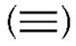、坤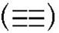、震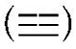、艮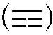、离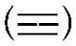、坎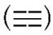、兑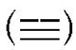、巽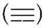。有一个简单的口诀是：乾三连，坤六断，震仰碗，艮覆碗，离中虚，坎中满，兑上缺，巽下断。

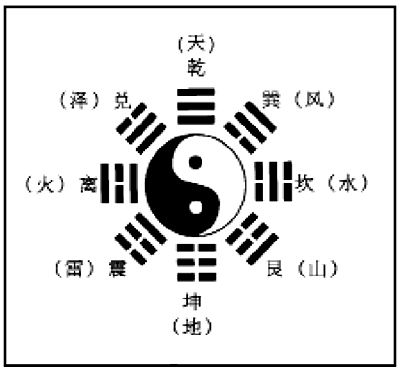

这八卦即是符号，用以代表自然界的八大现象，亦即依序是：天、地、雷、山、火、水、泽、风。一般所见的八卦图如下页图。依此图来观察每一卦时，要以中间的太极图为中心点，向外再由下而上，譬如，震卦是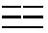，艮卦是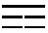。

由基本八卦再两两配合，就成为六十四卦了。譬如，“乾卦”是六爻皆阳，而“坤卦”则是六爻皆阴。每一卦皆有简单扼要的卦辞与爻辞，这些就构成了“经”的部分。

“经”之外，还有“传”，是最早的注释。“传”有十部分，又名“十翼”（翼为辅助之意），就是：彖（上、下）、象（上、下）、系辞（上、下）、文言、说卦、序卦、杂卦。关于《十翼》的作者，一般认为是孔子的弟子数代相传的结晶，因为其中屡见“子曰”，并且基本立场是要人进德修业，成为君子。譬如，乾卦《象传》说：“天行健，君子以自强不息。”坤卦《象传》说：“地势坤，君子以厚德载物。”

《周易》的基本原则，是观察自然规律以安排人的言行。自然规律是变化中有其不变，循环不已而永葆生机。因此，人要学会“穷则变，变则通，通则久”（《系辞下》）。古代圣人制作这一部经典，目的是：“以通天下之志，以定天下之业，以断天下之疑。”（《系辞上》）希望能够了解天下人的心意，使大家和衷共济；能够成就天下人的事业，使大家安居乐业；能够决断天下人的疑惑，使大家充满信心。

《系辞上》有一段话对于《周易》的功能，作了中肯的描述：

“圣人设卦，观象系辞焉而明吉凶，刚柔相推而生变化。是故吉凶者，失得之象也；悔吝者，忧虞之象也；变化者，进退之象也；刚柔者，昼夜之象也。六爻之动，三极之道也。是故君子所居而安者，《易》之序也；所乐而玩者，爻之辞也。是故君子居则观其象而玩其辞，动则观其变而玩其占，是以自天佑之，吉无不利。”[2]

重点在于最后一句：“自天佑之，吉无不利。”表面看来，人期待得到上天的助佑，但是这个天已经不再保障“绝对正义”。因此，人需要自求多福，由圣人（异于原来的天子）来设计一套卦象，借着掌握自然界的变化规律，配合古人一千多年的生活经验所凝聚的智慧，希望由此提供人们明确的指引，使自己“吉无不利”。而另一方面，则处处提醒人们进德修业是不可或缺的。六十四卦的各“传”，在标志吉凶时，总是留了一线生机，也就是：不可安于小成，也不必为小祸而失去上进的意志，因为变化是一直在进行的，只有把握主体自觉的行善要求，以日新又新的德行走向君子的目标，才是逢凶化吉的上策。于是，原本可能由变化带来的危机，一变而为转机，使人随遇而安，顺势而行，充分实现生命的创意与活力。

以下试举几个较常听说的卦，来稍加介绍：

（一）“否极泰来”

否卦是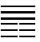（下坤上乾），其象为地在下而天在上，两者不相交通，失去活力而没有出路。

至于泰卦则是（下乾上坤），其象为天在下而地在上，天必然要往上而地必然要往下，两者之交通也必然因生气蓬勃而畅旺无比。换言之，吉凶要看变化之可能性，有变化则机会大增。

（二）“剥极而复”

剥卦是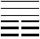（下坤上艮），其象为地在下而山在上，又是两者固定而不再交通。反之，复卦是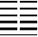（下震上坤），其象为地在上而雷在下，雷必然要鼓动力量往上奋进，所以这是循环之新生的开始。

（三）“谦卦”

六十四个卦象中，只有“谦卦”是六爻皆吉，其卦为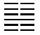（下艮上坤），其象为山在下而地在上。明明是高山，却愿意隐藏于地下，如此谦虚，当然到处受人欢迎了。

（四）“既济卦”

第六十三卦为“既济卦”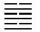（下离上坎），其象为火在下而水在上，代表一切完成了（济为完成之意）。理由是六爻皆“当位”（由下而上，一阳一阴，完全无误）。同时，火在下而水在上，表示以火烧水，其功可成。

（五）“未济卦”

第六十四卦为“未济卦”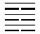（下坎上离），其象为水在下而火在上，这两者又是无法交通，并且六爻皆不当位，事未定而物未成，一切有待继续努力，甚至要重新开始。

由上述各例可知，《周易》是一部值得仔细省思与品味的作品，对人生哲理的启发也有随机指点的效果。即使仅就阅读而言，也有无可比拟的趣味。

# 中国哲学的特质

由前文对中国哲学起源的探讨，已经可以肯定中国哲学兼具永恒义与变化义，并且由此启发了先秦哲学家获得丰富的成果。在我们继续分别介绍儒家与道家之前，再就其特质作大概的描述。

## 以生命为中心的宇宙观

中国人认为整个宇宙是充满生命的，亦即宇宙中没有任何孤立的地区或物质。这种思想在西方属于较新的理论，称作“机体论”（Organism）。机体论是把整个宇宙看成一个有机体，而不是死的机械———西方近代科学的共同信念是“机械论”（Mechanism），认为宇宙是由物质拼凑而成的，有如一个组合的玩具，没有自身的内在动力，而是由外在的力量造成它的运动。

一个人如果研究科学，比较容易接受自然机械论，把自然当做机器来看待，如此才能加以区分研究。然而，用这种方法，研究了一部分却无法联系到另一部分，更谈不上整合为一体了。就以西医和中医来说，西医倾向于头痛医头，脚痛医脚，却不知道通过对脚的适当按摩，可以把头痛治好；而中医懂得利用这种方法，主要原因即是把人看做一个有生命的整体。事实上，人本来就是一个整体，西医的身体检查，会注意所谓的临界点，只要还没到达到那个指数，就会判断我们的身体没问题，但是一旦到达那个指数时，身体的情况可能已经很糟糕了。中医则会通过调理的方式，让我们的身体由保养而逐渐改善。

生命表现为一种力量和趋势，有时候一个人表面上看起来很健康，其实正在走向严重的疾病。如果我们趁早察觉并对症下药，就能够调整方向；相反，如果把生命看做物质，用仪器去测量，现在没事就说没事，那么有一天真的有事的时候，恐怕已经太晚了。这就是把人看做有机体与机械的差别。

在西方来说，一直要到当代才出现机体论的思想[3]。中国古代是朴素的机体论，西方经过科学革命后所发展出来的，则是现代化的机体论。此二者仍有不同之处。现代的机体论的说法比较准确而精密；古代的机体论则往往是靠体验，借此肯定整个宇宙是相通的。譬如你家前面有一座山或没有一座山，会产生截然不同的差异。山虽然是没有生命的物质，但是它可以对整个气流，甚至是一个人的心情产生影响。由此可知，大自然虽然是物质，但还是会对人造成影响，只不过有的影响是表面的，有的则是深层的。换言之，任何东西只要存在，都不会是毫无目的的存在。

中国人说“大化流行”，亦即认为整个宇宙是一个生命流行的场所，在其中，任何东西的生灭都与人有关。这种想法可以使得人类与大自然的关系变得比较亲切，因为我们看到任何东西，都会觉得它与我们不只是外在的关系，而是能与我们的生命互动的。正因为如此，中国哲学谈到人的时候，往往认为人与大自然不应该分开考虑，因为这不是两个不相干的领域。

中国哲学以生命为中心的宇宙观，是一种具有特色的想法，并且也符合西方现代物理学所推展出来的最新观念。

## 以价值为中心的人生观

宇宙万物的生命不断在变化，而人类的生命除了变化之外还有另一个特色，就是需要不断地实现价值，不能只是随着生、老、病、死的步伐，最后一切结束就停止了。

我们每天都应该要问自己：“我今天有没有比昨天稍微长进一点？在真、善、美这些价值上，有没有稍微提升一点？”或许有人会认为一天的变化看不出来，那么一个星期如何？一年如何？十年又如何？一个人总不能十年过了还是跟以前一样，没有丝毫差别。孔子自三十而立以后，每十年都会有所成长———四十而不惑，五十而知天命，六十而（耳）顺，七十而从心所欲不踰矩[4]。这就是一个标准的模式，亦即以价值为中心的人生观。人生不应该只是活着而已，而是要不断地实现价值。也就是说，多活一天就要有多活一天的效果，绝对不是白白活着。

所谓的价值，与人的自由有关。换句话说，没有自由选择的机会，就没有所谓的价值。我们要时常自问：“我要自由，作什么样的选择？”接着要问：“为什么我要作这样的选择？根据是什么？是否正确？”如果一个人选择的根据是来自外在的因素，那么它的力量可能不够，因为一旦外在的条件改变或消失，就不见得要坚持原来的选择；反之，如果选择的根据是内在的因素，那么情况就不一样了，因为这是出于内心对自己的要求，促使自己去实现更高的价值。

## 存在与价值可以统合于超越界

存在就是活着，而价值是活着所要追求的目标。此两种需要合而为一，合一之处则在于超越界（Transcendence），也就是儒家所说的“天”或道家所说的“道”。“超越界”是很难解释的一个名词。简单来说，与超越界相对的称为“内存界”（Immanence）。这两个词可以说明一切的存在。从人的角度来看，所有我们可以经验到的、思考到的，全部都是内存界。换言之，我们活在世界上，理性与经验所能掌握的范围，包括宇宙万物，统统属于内存界；人类的各种变化、各种花样、各种细致的情感，也都属于内存界。由此可知，内存界简单地说，就是大自然加上人类社会。

然而，大自然与人类都没有必然的理由可以存在，宇宙有开始也有结束，人的生命则更为短暂。换言之，内存界并无法证明与保证自己的存在。但是它居然存在了！因此我们要问：“它凭什么存在？”答案就是超越界。

两千多年以来，西方哲学不断在探讨如何追求真正的智慧，最后产生了一个基本想法，用一句话来说，就是：“为什么是有，而不是无？（Why is there something rather than nothing?）”这句话在西方来说，是最深奥的一句话。当一个人问这句话时，表示他在追求形而上学最后的基础。举例来说，“我”为什么存在？有生有死的我，到底凭什么存在？为什么是有而不是无？这是因为有一个超越界使“我”此时可以存在。

每个人都有形而上学的需求，这是出于自然的冲动，因为一个人要知道这个答案，才能活得有意义。活着绝对不是吃饱、睡觉，然后慢慢成长而已，这些都只是每天变化的过程。人活着就要问：“我的活着是一个‘存在’吗？它有基础吗？”正因为如此，所以我们要谈超越界。

孔子为什么要谈“天”？老子为什么要谈“道”？孔子两次遭遇危险的时候，都毫不迟疑地诉诸于天[5]，这个“天”就是超越界；老子谈“道”，便说“知者不言，言者不知”（《老子》五十六章）。这指的就是超越界。我们如果对“天”与“道”没有深入了解，或不曾与它建立关系的话，人生根本只是一场空。我们所谈论的超越界，是超越一般宗教之上的，它基本上是一种信仰。信仰不等同于宗教，却是宗教的核心。有关这一点，请参考本书第五章《宗教与永恒》。

# 结论：使传统智慧再现生机

本章重点置于中国哲学的起源部分。至于特质部分，只是略谈一个大概，因为后续二章所谈论的儒家与道家，可以充分印证此处所略谈者。那么，儒家与道家如何在此一起源之后开展出来？我们今日又能由此一起源学到什么？

首先，古代的政教合一结构，使得“天子”的角色成为天与人之间的中介。天子失德之后，天的概念立即产生变化。我们且以最扼要的方式加以说明。

由功能的角度来看，“天”在古代扮演了五种角色，就是：主宰之天、造生之天、载行之天、启示之天，审判之天。[6]其中，主宰之天一直受到肯定，譬如历代帝王沿用“天子”之名，到了清朝，皇帝仍在诏书中说“奉天承运”。但是，造生与载行应该体现的是“仁爱”，而启示与审判应该体现的是“正义”。《周易》讲求变化之道，目的在让人活得有希望，无异于侧重“仁爱”；《尚书·洪范》标举永恒理想，所揭示的自然是“正义”了。

但是，随着天子失德，天下大乱，出现两大危机：造生与载行之天由于不再表现仁爱之德，而变为“自然之天”；启示与审判之天由于不再保障正义之德，而变为“命运之天”，这两种观念，亦即以天为具象的自然，以及以天为盲目的命运，在春秋时代开始蔚为流行。这是一个危机，既不能由自然现象的变化中看出超越的理想，又不能由人间复杂的遭遇中发现正义的原则，人群的未来还可设想吗？

孔子的志业在于把人的命运转化提升为使命，再将它上溯于天，重新为“天命”下定义，亦即让人人自觉其内在向善的力量，经由择善固执而走向至善，以符合天命的要求。老子的志业在于为自然界找到基础，而那是无从名之的超越界，勉强可以称之为“道”，“道”产生万物并且在万物之中，但是它又不受万物变化所影响。于是，人的精神世界重新得到无限提升的机会，可以与“道”为友，自在逍遥。有关儒家与道家的探讨，请见后续第二、第三章。

今日回顾中国哲学，不是为了怀古或念旧，而是要借重古人思想的完整架构，就是兼顾永恒与变化的双重要求，使自己既可因为永恒信念而安身立命，又可因为变化之理而勇于创新。如此双轨配合，人生方可动静得宜，收放自如，并且在每一个当下皆有充实之感。如果进而领悟儒、道二家的精彩见解，不是知性领域的莫大快乐吗？

* * *

[1] 此段文字的大意是：不要偏差不要倾斜，要遵守先王的正义；不要有所爱好，要遵守先王的大道；不要有所厌恶，要遵守先王的正路。没有偏私没有朋党，王道是宽广的；没有朋党没有偏私，王道是平坦的；不要反复不要偏执，王道是正直的。如果有了这种标准，大家就有一致的归向了。又说：用大中之道颁布教言，作为经常的守则，以顺应上帝。所有的人民，尽量说出好的意见，作为教训，作为行动，就能逐步获得天子的光荣。所以说：天子做了人民的父母，为的是使天下有一致的归向。

[2] 这段话的大意是：圣人制作了六十四卦，观察卦爻之象而撰写相关的系属文辞，以说明吉凶的出现，经由阴阳刚柔诸爻的相互推移而生出各种变化。所以，吉凶是表示外在的得失；悔吝是表示内在的忧虑；变化是表示进退取向；刚爻柔爻是表示昼夜的阴阳现象。六爻的变动，体现了天、地、人的活动规律。所以，君子平居时所考察的，是《周易》各卦承接转化的次序；闲暇时所玩味的，是爻辞的内在含意。所以，君子闲居时，观察卦爻之象而玩味卦爻之辞；决定行动时，观察卦爻象的变化而玩味卦爻辞的占筮，这样就可以得到上天的助佑，从而吉利无比。

[3] 1900年普朗克（Max Planck，1858—1947）提出“量子论”，1905年爱因斯坦提出“相对论”，1927年海森堡（Werner Heisenberg，1901—1976）提出“测不准原理”，至此西方才提出机体主义的哲学。

[4] 本段话出自《论语·为政篇》，其中“六十而顺”，不再采用一般所谓的“六十而耳顺”。理由是：一、孔子自述的六个阶段都是直接以“动词”描写修行的进境，不宜有例外。二、顺天命与孔子生平事迹完全相应，耳顺则无合理解释。三、敦煌石经的版本是“六十而顺”，无耳字。四、孟子私淑孔子，谈到“顺天命”，并且在宣称“舍我其谁”时，正是想要顺天命；除此之外，他也未曾提起耳顺。相关讨论请参见本书第二章。

[5] 孔子这两次谈“天”分别记载于《论语》的《述而篇》与《子罕篇》，解释如下：（一）《述而篇》：“子曰：‘天生德于予，桓魋其如予何？’”意思是：孔子说：“天是我这一生德行的来源，桓魋又能对我怎么样呢？”桓魋为当时宋国的军事统帅。当时孔子五十九岁，是其生命成长阶段知天命之后的顺天命时期，因此遇到生命危险，立即诉求于天。（“孔子的生命成长阶段”请参见第二章。）（二）《子罕篇》：“子畏于匡。曰：‘文王既没，文不在兹乎？天之将丧斯文也，后死者不得与于斯文也；天之未丧斯文也，匡人其如予何？’”意思是：孔子被匡城的群众所围困，他说：“周文王死了以后，文化传统不都在我这里吗？天如果要废弃这种文化，后代的人就不会有机会学习这种文化；天如果还不要废弃这种文化，那么匡人又能对我怎么样呢？”

[6] 意思是：（一）天是自然界与人间的至高主宰；（二）天造生了自然界与人类；（三）天继续载行着这一切；（四）天启示了人间的善恶原理；（五）天将审判善恶，并且赏善罚恶。有关这五种“天的角色”的说明，参考了《诗经》、《尚书》、《周易》、《左传》等资料。

