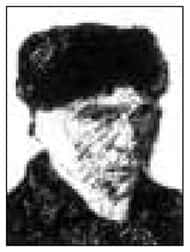
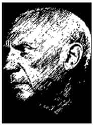
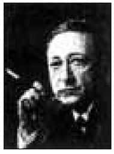
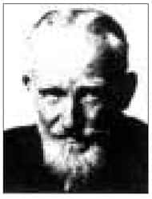
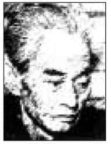
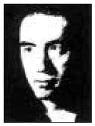
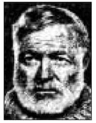
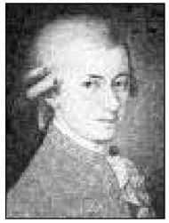
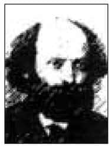

谈到“艺术与审美”，除了专门研究艺术的人，一般人不会认为这个主题与自己的生命有什么直接关联，他们最多只是欣赏艺术而已。然而，真正研究艺术的人又因为很早就进入某个领域（如：音乐、绘画等），往往局限在狭隘的范围内。这种专业训练虽然可以使人成为某方面的专家，却不一定能够充分掌握艺术的精神，以及它与人类生命内在的关联。正因为如此，这一章所介绍的内容也就显得特别重要。

# 艺术家的界定

没有艺术家就没有艺术，而艺术家是一些具有某些特色的人，我们可以从以下几个角度来了解这些特色。

## 以直接的途径，展现新形式与新象征

“直接”是指“感性可及”的部分，凡是能用眼睛看到的美术作品，能够用耳朵听到的音乐，以及一些具体的雕塑、建筑等，都包含有美的成分。

艺术家相当少见，他们能够使用感性所及的途径（如：声音、颜色、具体的物像、影像等），展现出新形式与新象征。

什么是新形式？形式与内容是相对的，人类生活的内容自古以来相差无几，然而我们不能因此就过着日复一日、不断重复的生活。

人的心中总有一种创造的冲动，希望通过不同的方式、通过人类心灵所得到的某种启发或灵感，重新品味生命中永恒不变的素材。由此可知，尽管内容相似，但表达的形式和象征却可以不同，而艺术家就是能在这些地方表现出创造性才华的人。他们能以新形式（譬如唐朝的诗、宋朝的词、元朝的曲等）来表达恒久的情感，使人能够体验到生命的新意。

那么，什么是新的象征？举例来说，一般人常说“母亲像月亮一样”，第一个提出这种比拟的就是艺术家，后来重复使用的则是模仿者。一个象征被不断重复使用，就会丧失它的敏感程度，变成陈腔滥调，使人觉得乏味，这时候就需要改取一个新的象征了。

谈到象征和形式，可能衍生几个问题：首先，这将造成艺术作品与人生的距离。如果一种艺术形式需要先了解它丰富的背景才能欣赏，就代表它与当前的人生有些距离。举例来说，绘画有所谓的古典派、野兽派、抽象派等，这些术语各有专门的背景。而一般人看画时不见得了解，可能会觉得自己没有欣赏的能力。如此反而使得大多数人没有机缘接触艺术。

此外，艺术家有时候很容易与外界隔绝，形成自己独有的内在世界。加上一般人常常误认“你是艺术家，所以你所创作的一切都是艺术作品”，而不是“因为你创作了艺术作品，才成为艺术家”，往往让艺术创作与真实人生的距离更加遥远。

其次，一个作品并非放在街上就可以成为艺术作品，但是任何东西只要进了美术馆都会成为艺术作品。在纽约发生过一件类似的事：有位艺术家把一棵白菜用塑胶袋装起来，下面写着“某人于某年的创作”。有个农夫看到后心想：“这个我也会啊！”于是拿了很多白菜放在塑胶袋里，在街上宣称是艺术品大拍卖。别人却不这么认为，因为在他们看来，艺术家的创作是无价的，而街上卖的白菜不过值几块钱而已。

相同的东西，一旦签上艺术家的名字就变成了艺术品。这是现代社会分工之后用标签来决定内容的一种现象。事实上，要表达出创造性（新形式与新象征）非常困难。我在荷兰教书时，见识了这个国家对艺术创作的重视程度。

荷兰在欧洲虽然是小国，但是却出了梵高（Vincent van Gogh，1853—1890）这位大画家，荷兰政府以此为傲，大力提倡艺术创作，设立许多基金让有心从事艺术创作的人申请。有个心理学家需要钱用，于是假借艺术创作的名义申请补助。  

梵　高  
Vincent van Gogh  
1853—1890

荷兰画家。年轻时立志成为牧师，并在煤矿区传教，体验了矿工的贫困。后赴巴黎，靠开画廊的弟弟支持生活，并接触许多印象派画家的作品；1888年与高更交往密切，后罹患精神病症，于1890年举枪自杀。

他的画作色彩鲜明，阴郁而如火焰般的笔法，充分显露他深受折磨的精神状态。生前只售出一幅作品，死后作品动辄以千万美元计。  

政府拨款之后，要求一年后验收他的创作成果。结果，这个心理学家什么都没做，到了视察那一天，他在路边搭了一个台子，自己站上去，旁边写着“我就是艺术品，因为我是独一无二的”。

的确，每个人都是独一无二的艺术品，但重要的是，他第一个想到用这种方式来表现。以后的人不能再以相同的方式来申请补助，因为模仿就没有创造性可言了。

## 表达某种集体潜意识，使个人可以过渡到人类

人类的生命自古至今都类似，必须经历生老病死、喜怒哀乐、恩怨情仇、悲欢离合等过程。这种集体的共同感受会造成人类心灵上的复杂情结：有时候觉得孤单，有时候又希望自己独处不被打扰；有时候关怀整个社会，有时候又感叹命运无奈。这种属于集体的潜意识，必须靠艺术家来表达。

当艺术家展现出这种集体潜意识时，会引起大家“共鸣”。以音乐为例，尚未听到某首乐曲之前，并不会感觉自己有任何不足，但是当这首乐曲一出现，我们会开始觉得自己有所失落，好像遗忘了某些重要的东西。一旦有了这种感觉，就说明我们准备要恢复完整的生命了。由艺术创作感受人类有一种共同的记忆，而这个记忆几乎可以说是保存在人类的基因里面的。

这种基因与文化有关，所以中国人有中国人的集体潜意识，西方人有西方人的集体潜意识。西方有许多乐曲都非常悦耳、非常优雅，但是对中国人而言，这些乐曲无论再怎么动听，都不如中国乐曲容易让人感动。这是因为音乐的创作不能摆脱特定的时空背景，当我们听到中国乐曲时，会勾起潜藏于心中共同的情感内容。换言之，这首音乐就是一种唤醒心中共同记忆的形式或象征。相反，外国人听到中国乐曲比较不易被感动，因为他们缺少这样的历史和地理背景。不过，人类还是有共同的潜意识，而真正伟大的艺术作品是可以回应此一需求的。

艺术家有很多类型，诗人就是其中一种。诗人用文字唤醒集体潜意识，因此他们的作品可以一代一代传诵下去，而人们阅读的时候也会发现“于我心有戚戚焉”，自己好像回到了整体[1]一般。

## 有如雷达观测站，对人类文化的病征提出预警

文化是会生病的，每一种文化在发展过程中都会产生一些问题。尼采说过：“哲学家是文化的医生。”文化之所以需要医生，就是因为它可能会生病。文化为什么会生病呢？因为文化是人类生活、表现、发展之所在，人类的问题层出不穷，文化当然也就可能出现问题。

我们介绍中国文化时曾经提到过，文化会经历兴、盛、衰、亡四个阶段。那么，谁能够观察出文化何时会衰亡呢？尼采认为哲学家可以，我个人则认为应该先找艺术家来诊断，因为艺术家有能力点出时代的趋势。

以毕加索为例，他于1957年在纽约展出生平画作，将他的作品分成数个阶段，以下就几个比较重要的阶段分别介绍：

（一）1924年以前（古典时期）

毕加索最初创作的作品完成于20世纪20年代早期，这时期的作品很多都相当唯美，是一种希腊人物的反射，内容多呈现出俊秀、美丽的青年男女在海滩上嬉戏追逐。这反映出欧洲在第一次世界大战前后的情景。由于第一次世界大战所造成的伤害还不算太严重，所以整个情势还算是缓和。

（二）1925年至1936年（蜕变时期）

渐渐发展到第二次世界大战，也就是20世纪30年代左右。这时候整个欧洲的气氛变得非常诡谲而复杂，德国希特勒的势力也开始兴起了。这时期毕加索的画充满了人间存在的不确定性。  

毕加索  
Pabto Picasso  
1881—1973

西班牙画家。在巴塞罗纳艺术学校即有神童之称，十九岁至巴黎学画，由马蒂斯（Henri Matisse，1869—1954）、高更（Paul Gauguin，1848—1903）、塞尚等人的作品中深获启发，再创了立体主义的画风。立体主义所关心的是：如何在平面的画布上画出具有三度，甚至四度空间的立体的自然形态。他自九岁开始作画，画作在质与量方面都十分惊人。  

（三）1937年至1953年（第二次世界大战前后）

在20世纪30年代后期，接近第二次世界大战的时候，他的作品以灰色为主色调。灰色当时是坦克车和枪的颜色，这种暗色系会让人感受到一种压力。到了1937年西班牙内战之后，也就是在创作了《格尔尼卡》（Guernica）这幅作品之后，这种画风更为明显，这幅作品中的人物全部是扭曲的，整个割裂后重新拼凑。

而在第二次世界大战以后，大约是1940—1950年后，整个世界呈现出一种撕裂的局势，因此毕加索的作品在此时大都没有主题，画作不再有“名称”，只留下“编号”。

毕加索的作品是他敏锐心智的表现，反映出当时人类的处境。一般人因为看不到全面，无法表达得这么清楚，艺术家则可以体察真正的脉动，就像雷达观测站一样，在敌机即将来袭之时，侦察到那股氛围；而一般人只看到晴空万里，以为一切平静安详，无法预测危险即将来临。

## 在人神之间挣扎，以创造力反叛死亡

艺术家比一般人敏感，而如此敏感的心灵是要付出代价的。要成为艺术家并不容易，因为他们必须在人神之间挣扎。人代表有限的、会死的生命；神则代表不朽的、永恒的生命。艺术家从天上偷了一些永恒的东西给人类，所以西方用希腊神话中的普罗米修斯来象征艺术家[2]。

人终究会死，但是艺术家却用创作表现出永恒之美，这些创作也能够在他们的生命结束后继续存在。这些永恒之美需要后代人欣赏才能展现出来，否则即使是千古名画，却藏在地窖中，也没有用。由此可知，艺术家面临的压力相当大，他们心灵上的挣扎、冲突不是一般人所能想象的，而这种真正的紧张和痛苦也只有伟大的心灵才能承受。

有一段关于美籍立陶宛小提琴家海菲兹（Jascha Heifetz，1901—1987）的故事。海菲兹是当代第一流的小提琴家，某次英国著名的幽默文学家萧伯纳（George Bernard Shaw，1856—1950）听了他的演奏会之后，深受感动，整晚睡不着，因此写了一封信给他。内容如下：  

海菲兹  
Jascha Heifetz  
1901—1987

美籍立陶宛小提琴家，犹太人后裔。五岁即公开演奏，十岁在圣彼得堡举行演奏会，大为轰动。1917年第一次世界大战期间，海菲兹应邀到美国卡内基音乐厅登台，轻易征服了美国乐坛，此后四十年以旅行演奏为生。他的演奏要求完美，被称为“现代小提琴技术之父”。  

萧伯纳  
George Bernard Shaw  
1856—1950

出生于爱尔兰的作家，作品风格幽默，有幽默大师之称。热心于社会批判，主张素食主义，他说：“动物是我的朋友，我不会去吃我的朋友。”生平发表47部剧本，深受大众喜爱，于1925年获得诺贝尔文学奖。代表作有《伦敦的音乐》、《素描与回顾》、《我们在九十年代的剧场》等。  

“海菲兹先生雅鉴：

内子与我对阁下的演奏会赞叹备至。如果你继续演奏得如此美妙，将难免于早夭。没有人可以演奏得如此完美，而不致激起诸神的嫉妒。我诚心奉劝阁下，每晚临睡前胡乱演奏一些曲子……”

这个例子是要说明，海菲兹的演奏完美不凡，然而人间并不容许完美之物存在。越是美的东西，越容易让人因为随后的幻灭而心碎。

体验美好之物时，会感受到刹那的可贵。我在美国耶鲁大学读书时，有时候也会出现类似的感触。耶鲁位于美国康州的纽黑文市（New Haven），这是美国东北角的一个小城，附近有几座小山丘。每当秋天来临，满山遍野的树长满了茂密的叶子，没有任何叶片的颜色是完全相同的。那种繁华热闹、多彩多姿，美到令人觉得好像无法思考了。然而，越是美丽的事物就越容易消逝，树叶在一两个星期之后就枯黄、飘落，只剩下干枯的树枝，紧接着就下雪了。

每当看到生命年复一年随着春、夏、秋、冬循环变化，我就会觉得人的生命确实很短暂。这也可以联想为艺术之中的审美意境。

## 艺术家的困境

既然艺术家把永恒带到变幻的人世间，让平凡人品尝到永恒之美，那么他们会受到什么样的惩罚？

艺术家常常会有罪恶感、精神失衡、自杀倾向三种由压力而来的行为，以下分别说明：

（一）罪恶感

第一流的艺术家在创作时往往会产生罪恶感，因为他们觉得自己好像泄露了神明的秘密，把不该展示的真相表达出来。但是，这种真相一旦被呈现出来，又难免陷入世间的限制与变迁之中。杜甫说：“文章本天成，妙手偶得之。”有些人文章写得很好，但最多只能说是上天要形成这篇文章，亦即这文章原本就存在，只是借着作者的妙手偶然写下来而已。作家写成了好文章，把美好带进世间，但是，他也开始担心它会不会受到珍惜，或自己是否反而糟蹋了美好。

（二）精神失衡

艺术家容易精神失衡，亦即容易患有精神官能症。他们与世间的流行事物好像格格不入，常被认为特立独行，譬如，披头散发、不修边幅，说话不太在乎别人的感受。一般人遇到这种情形通常也会谅解：“这也难怪，因为他是艺术家！”似乎艺术家就有豁免权，言行举止可以任性随意，再邋遢也没有关系。

事实上，这并不代表真正的艺术家都如此，许多艺术家会表现出这种行为，是因为他们的内、外自我有时候不能平衡。艺术家的精神向往永恒，身体却活在这个世界上，所以需要通过某种刺激来麻痹自己，甚至使自己沉醉。有些艺术家会酗酒、吸毒，即是基于类似的原因。饮酒之后人处于一种半清醒的状态，这时候意识会松懈下来，潜意识将能发挥作用，让造化的力量通过自己的心灵表现出来。当然，长期处于这种身心状态，很容易造成精神失衡[3]。

（三）自杀倾向

除了罪恶感、精神失衡之外，艺术家也容易有自杀的倾向，譬如著名的作家海明威、川端康成、三岛由纪夫等，最后都以自杀结束自己的生命。艺术家的创作力量有时候与年龄及身体状况有关，当生命力旺盛的时候，创造力可以充分施展；相反，年纪越来越大之后，想要不断超越自己就很困难了。我们可以看到，很少人得到诺贝尔奖之后还能创作出第一流的作品，这是因为得奖之后作家成为世俗的英雄，就很难再全心创作了。而有些艺术家因为觉得自己无法再有新的创作，最后常常选择结束生命。  

川端康成  
1899—1972

日本作家。从小父母双亡，与祖父相依为命，十六岁时预感祖父不久于人世，写出了《十六岁的日记》。他对《源氏物语》爱好无比，立志成为作家。

由于早期生活的影响，他的作品总有感伤悲哀的调子，他说：“这种孤儿的悲哀成为我的处女作的潜流，说不定还是我全部作品、全部生涯的潜流吧\!”

1968年获得诺贝尔文学奖，代表作有《雪国》、《古都》、《千羽鹤》等。1972年自杀，没有留下遗书。他曾经说：“自杀而无遗书，是最好不过的了，无言的死，就是无限的活。”  

三岛由纪夫  
1925—1972

日本作家。出生于官僚家庭，毕业于东京大学法学系，曾在银行局任职，后专心于写作。二十四岁出版《假面的告白》，奠定他在文坛的地位。  

他对日本的天皇制度与军队都有自己的特殊观点，于1970年率领学生冲入军事基地，号召政变。失败后剖腹自杀。代表作有《金阁寺》、《火宅》、《丰饶之海》等。  

海明威  
Ernest Hemingway  
1899—1961

美国小说家。从小爱好钓鱼、打猎、音乐与绘画。第一次世界大战时，曾担任红十字车队司机，以后长期担任驻欧记者，经历了第二次世界大战与西班牙内战。1954年获得诺贝尔文学奖。代表作有《太阳照常升起》、《战地钟声》、《老人与海》等。1961年因久病不愈而自杀。  

## 艺术家是人类的瑰宝

许多人以为艺术家的创作很容易，事实上他们在背后所下的功夫以及面临的挑战，都不是一般人所能想象的。如果真的了解艺术家的整个生命，可能会很庆幸自己不是他们。有一部电影《阿玛迪斯》（Amadeus），叙述的是著名音乐家莫扎特（Wolfgang A. Mozart，1756—1791）的故事。像莫扎特这样的天才，同样也会遭逢困境，例如有人要对付他，他也变得疑神疑鬼。每个人的内心都难免经历一些挣扎，不过这种情况在艺术家身上表现得特别明显。  

莫扎特  
Wolfgang Amadeus Mozart  
1756—1791

德国作曲家，有“音乐神童”之称。六岁时写出钢琴与小提琴的演奏曲，八岁写出第一首交响曲。十四岁开始，所写的歌剧大受欢迎。后因失去亲情的打击，深刻体验了人生的悲欢离合，尤其在婚姻上并不顺遂，工作又无着落，必须日夜努力作曲才可维生，代表作有《魔笛》、《费加罗的婚礼》、《布拉格交响曲》等。  

了解艺术家的特色之后，就能够理解他们为什么可称为人类的瑰宝，听到一首好的曲子，看到一部好的电影时，都应该感谢这些创作者。此外，我们要懂得欣赏艺术作品，因为欣赏也是一种创作，通过欣赏的方式能够让艺术家的心灵不再孤单。关于这一点，在稍后讨论“艺术的审美效果”时，会作详细说明。

# 创造力与潜意识

这个时代大家都喜欢谈创造力，究竟怎么样才能拥有创造力？在此针对艺术的创作过程与潜意识的关系，提供几点分析。

## 遭遇实在界：主客融合的忘我之境

一般人常说的“遭遇”，是指碰巧遇到某件事情或某种状况，譬如“我今天的遭遇真是不幸”。而此处所谓的“遭遇”则是指整个人的生命全部投入而产生碰撞，在英文中称为encounter，指的正是艺术家和实在界（reality）的碰撞。而实在界是指真实存在的领域，不再只是一些表面的现象。

一个人要成为艺术家，就必须遭遇实在界。公园里有时候会有一些人拿个画板为人画肖像，不到一个小时就完成了，不仅画得快，而且画得像，但是这种画不能称为艺术。那么如何才能称为艺术呢？

法国著名的画家塞尚（Paul Cézanne，1839—1906），曾花了一年的时间画一棵树。有人问他为什么一棵树要画一年，他回答：树在春天、夏天、秋天、冬天，都有不一样的姿态、不一样的神采。如果不先观察一年，怎么知道它真实的生命是什么样子？因此，塞尚花了整整一年的时间观察这棵树，之后才下笔画出来。  

塞尚  
Paul Cézanne  
1839—1906

法国画家。后期印象画派的代表，有“现代绘画之父”的称号。塞尚家境富裕，可以专心学画。1874年参加第一届印象派画展，反映不佳，但已受人注意。随后十年，追求画布上形象与色彩的完美统一，在风景画与肖像画方面皆有过人成就。他擅长在自己的想象中创造一个整体，构成异于自然世界的艺术世界，开辟了美术史上的新纪元。  

塞尚画的树的确和一般树不一样，这棵树有神经、有血管，以及各种生命的结构，甚至连根都可以看到。虽然看起来树干不像树干、树叶不像树叶，但是却能让人感觉到这棵树的活泼生命——在春天欣赏这幅画，会觉得它就像春天的树木，充满新嫩朝气；在夏天观看，则会觉得这棵树在盛夏中，恣意伸展；秋天和冬天亦各有风采。换言之，这幅画把树的整个生命完全展现出来。这样的画才能称为真正的艺术作品。

艺术家之所以有这种创意，是因为他真的“遭遇”了树木的本身。树木本身不只是一个由人所定义的概念，而是指树木的生命。在艺术家的眼中，宇宙万物都有生命，只是一般人不容易察觉。

我曾经在德国南部一个小镇Schwae BIschhall住过四个月，那个小镇只有三万人，但是基本的文化设施一应俱全，不但有图书馆、美术馆，还有演奏厅和一座大教堂。有一次美术馆推出一项展览，主题是“树木”。我好奇进去参观。按照指示，一进门我就戴上耳机，然后按照箭头，环绕展场中央的树走一圈。结果我发现，随着我走在不同地方，跟树木形成不同角度，耳中就会传来各种不同的声音。绕完一圈回到原点，我感觉到树木好像会说话、会用声音来表达自己的情感。

从此以后，无论在何处，我看到任何树木，都会觉得它有感情，会与人沟通。换言之，通过一次欣赏艺术的过程，我打开了眼界，对树木的了解深入许多。植物尚且如此，何况其他动物？这就是艺术家伟大的地方，他们视一切万物都充满生命。

在欣赏艺术的时候，很容易发现艺术家的“遭遇”是多么彻底。遭遇本来只是碰到某样事物，但艺术家却碰触到实在界的真实，最终能够达到物我融合、彼此相忘的境界，并且通过艺术创作将此境界展现出来。

## 洞见闯入意识领域

“洞见”的英文是insight，意味着潜意识闯入意识的领域。意识的领域就好比冰山，冰山有六分之一在海平面上，六分之五在海平面下。人类的意识也是一样，我们能清楚认识的部分只有六分之一，而占较多比例的六分之五则隐藏在意识之下。既然在意识之下，我们为什么会知道它存在？因为人会做梦。

提出潜意识理论的心理学家弗洛伊德，在二十世纪初写了一本《梦的解析》，提到人之所以会做梦，是因为有潜意识。夜晚入睡时，意识的防卫系统松懈下来，潜意识就会跑出来活动，所以人会做许多梦，但醒来之后却几乎完全遗忘。

潜意识的分量之大、内容之复杂，还有待更深入的研究。没有人知道潜意识本身如何运作，但它确实有一种完型（Ges Talt）作用。“完型作用”是心理学的专有名词，举例来说，大部分人小时候都看过许多童话故事，而这些故事不知不觉会在我们心中组合成一个整体。一般人不会知觉这种潜意识的运作，但有一天当你到了瑞士，却会感觉自己好像曾经来过。会出现这种“似曾相识”的感觉，是因为很多童话故事都以欧洲为背景，所以潜意识会让自己感觉到对这个地方十分熟悉。

潜意识的发现是人类精神成长的重要历程，因为它可以解决大多数灵异方面的问题。虽然人类对于潜意识还无法充分理解，但是在研究方面已经有了相当的成绩。譬如，荣格认为理性和非理性不见得一分为二，而是可以连贯的（传统的西方思想习惯把理性和非理性截然二分），这种思想就是从弗洛伊德发展出来的。

不止在艺术世界，有时候，科学研究也需要“洞见”。例如，美国纽约有一位化学家，领导一个重要的试验。这个试验进行了好几个月，但其中一直少了某个步骤，因此始终无法完成整个化学公式。有个晚上，这位化学家沉沉入睡，突然梦见了完整的公式，惊醒后，立刻拿了床边的面巾纸随手记录下来，再继续睡觉。可是第二天早上他清醒以后，却看不懂自己写下的一串符号。他非常懊恼，从此以后每天晚上都在床边放一本笔记本，希望再做一次相同的梦。隔了几天，他终于又梦到了那个公式，这次醒来后，他马上把公式记在笔记本上，后来也因此得到诺贝尔化学奖。

这是一个真实的故事，正好可以说明潜意识的功能。化学公式之所以会在化学家的梦中出现，是因为潜意识本身会运作及组合，可以超越清醒时自己忽略的一些盲点，最后组织成一个完型。

美国心理学家詹姆斯（William James，1842—1910），说过许多深刻而有趣的话，其中一句是这样的：“我们在夏天学习溜冰，在冬天学习游泳。”一般人听到这句话会以为他讲反了，事实上他是对的。许多人都有过这种经验，在某年夏天学会了游泳之后，隔年夏天再游，忽然之间就游得很好。这是因为冬天时，虽然没有真的下水，潜意识却在运作，由此组合及协调身体与四肢的活动。游泳主要是靠身体与四肢的搭配，这种搭配不是一朝一夕可以熟练的。一个夏天或许无法提升泳技，但经过一个冬天，情况就不同了。溜冰也是相同的道理。

人的身体本身也有记忆，譬如一个开车经验非常丰富的人，坐上驾驶座，根本不需要思考如何操作，自然就有本能的反应；相反，一个不会开车的人就缺乏这种本能反应，因此即使辛苦得满头大汗，还是无法掌控一部车。这就说明了，潜意识的运作能够让一个人的某种能力充分发挥，使整体得以协调。

一旦洞见出现，周围的一切就会再显生机，活跃起来。举例而言，当我的研究还没完成的时候，触目所及，任何事物都死气沉沉。一旦我的研究得到好结果，走出研究室时就觉得天地一片光彩，充满了活力，好像所有人都在对我微笑。“洞见”的出现也是如此。

整个存在界本来是充满活力的，只是因为人习惯把它定位在一个明确的概念范围之内，以至于忽略了整个宇宙活泼的生机。如果总是等灵感出现之后，才感觉得到活泼的生命力，那么这辈子将会错失许多审美的机会。

## 创意往往在意识转换之刹那展现

想要让潜意识展现，有一些方法可供参考。譬如，有些人建议一件事情不要做太久，每隔五十分钟就改换处理另一件事情。许多学生在准备考试的时候都会发现，如果同一科目连续阅读三小时，效率就会越来越差。相反，如果语文读五十分钟之后改做数学，五十分钟之后再改读历史，那么效果会好很多。所以做任何事情都要懂得转换。

爱因斯坦曾经说：“为什么我最好的灵感都在刮胡子的时候出现？”这是因为刮胡子往往是在每日开始工作之前，这时候内心没有任何紧张、压力、障碍。当脑中一片空白时，潜意识里精彩的心得就能表现出来。他平常很少有灵感，就是因为大脑平常总是不断地思考，被意识塞得满满的，当然不可能觉察灵感和创意。换言之，有时候，一个人需要先回到空无的阶段，重新出发，才会开始灵光浮现。

美国有一位作家，他在家中特别设计了一个没有窗户的房间，门一关起来立刻一片漆黑。每隔两三个月他就会把自己关在里面，有时候半天，有时候一天，让自己完全与世隔绝，这就是他保持创意的方法。由此可知，转换的刹那非常重要，在转换的过程中让自己的心思一片空白，或者，试着从新的眼光、新的角度来欣赏这个世界，之后才可能产生新的创意。

所谓“习惯是第二天性”，人很容易养成固定的习惯，因为这是一种让人觉得稳定、安全的轨迹。但是，习惯也可能让人封闭在一个范围里，不敢离开。事实上，有时候另辟蹊径，试着在别的领域尝试一下，反而能看到不一样的风光。

# 艺术之审美效果

大多数人并不具备作为艺术家的条件，也不打算成为艺术家。换句话说，大部分人都属于欣赏者，因此以下便讨论如何欣赏艺术。艺术的审美效果大致可以分为以下几点：

## 表现感情甚于模仿自然

“艺术究竟是模仿还是表现？”这个问题直到现在还引起不少讨论。事实上，艺术当然是一种表现，模仿本身并不能成为艺术。一幅画即使画得和实物一模一样，都只是模仿而已，还不如拍照来得精准。

模仿只是成为艺术家所需的基本功夫，譬如，成为画家之前，必须先临摹许多静物、人像等。模仿是一种技术，庄子认为“道”是“进于技矣”[4]。从技术进步到艺术，才能称为艺术家。技术需要经过锤炼，到最后能够出神入化，就会提升为艺术。

## 创造性的表现，目的性的结构

艺术的表现需要有计划，因为它是一种创造性的表现，而不只是任意表现。要有创造性的表现就必须具备目的性的结构，例如，作曲时，首先要设计一定的曲长，然后把它分成数节，思考每一节需要哪些旋律来表现情感，这就是结构。一首曲子一定要有结构，就像写文章要有“起承转合”一样。结构本身要显示出一种目的，譬如它可以用来表达某种情感，而这种情感在这样长度的曲子中，正好可以彰显得淋漓尽致。

换言之，艺术要想表达某种情感，需要有一个经过设计的、目的性的结构。

所谓目的性的结构，以作曲为例来说明，结构中强调的某些重点、精华，当我们聆听歌曲时也很容易注意到，因为这些部分往往会不断地回旋往复。至于前奏和结尾，都只是让听者准备及调适心情而已。

孔子谈到音乐时说：“乐其可知也。始作，翕如也；从之，纯如也，皦如也，绎如也，以成。”（《论语·八佾篇》）

这句话的意思是：音乐是可以了解的。开始演奏时，众音陆续出现，显得活泼而热烈；由此接下去，众音和谐而单纯，节奏清晰而明亮，旋律连绵而往复，然后一曲告终。由此亦可看出“目的性的结构”在其中运作。

## 不只是情感的宣泄或净化，而是升华

艺术能够使人对生命内容深入体会，宣泄及净化感情，进而创造主动的活力。

人活在世界上常会触景伤情，人与人相处久了也会产生感情，有了情，难免造成各种正面或负面的后果，进而产生复杂的恩恩怨怨。譬如，《论语》中经常出现“怨”这个字。事实上，在《论语》这样一本薄薄的书中，“怨”这个字就出现了二十次。由此可知，在孔子和弟子的对话中，也常用这个字来描述情感。

人生不可能没有遗憾，有时候是别人抱怨我，有时候则是我抱怨别人，这时候就应该通过欣赏艺术作品来宣泄和净化感情。

举例来说，我最近跟别人处得不好，心情非常郁闷，那么我可以试着听音乐。在聆听音乐的这段时间，很容易忘记自身的遭遇，而把自己在此一时空所受到的压力舒解开来，进入艺术的世界。艺术世界本身是超越时空的，能够化解人们心里的当下困境，当融入一首曲子的艺术境界时，就能忘怀其他繁琐的事务。

一般人都知道艺术可以让感情得到宣泄和净化，却忽略了它也能使人的生命产生主动的活力。欣赏艺术看似被动，因为一个人在听与看时，是以感官去接受别人提供的作品；其实它也可以产生一种主动的活力，使我们由被动变成主动，重新凝聚生命力。亦即可以通过艺术的接引，使生命产生一种新的动力。

第一流的艺术家，必然对生命有非常深刻的体会。因此，如果观赏的人年轻而经验有限，当然不易与艺术家呼应，而难免产生落差，唯有当生命有了实质经验及内涵，才可能与艺术家的心灵接洽。由此可知，年轻的时候听音乐、读小说、看电影，都只是让生活增加趣味而已。只有在到了某个年纪，经历了人世的沧桑、累积了足够的经验，才能真正体会某些艺术作品的内涵。

我且以自己的经历，来说明审美经验。我在美国攻读博士学位的时候，每天读书十二个小时以上，非常辛苦，压力极大。其中最明显的压力就是一种不确定、不安全感，因为不知道自己究竟能不能顺利取得学位，而我舒解压力的一个方法就是听音乐。我每天晚上睡觉前都会听音乐，有一晚听到芭芭拉·史翠珊（Barbra Streisand）所唱的“回忆”（Memory）时，忽然很感动。这种感动不带任何激动的情绪，反倒多了几分宁静的力量，让我感觉到一种特殊的安慰，心中满溢着淡淡的喜悦。

我于是思考这是一种什么样的感觉。这种感觉用一句话来形容，就是“只要让我听到这么美的曲子，再怎么苦也值得”。对于未曾经历过真正苦难的人来说，是无法体会这种感受的。阿拉伯诗人纪伯伦（Kahlil Gibran）说：“美——就是你见到它，甘愿为之献身，甘愿不向它索取。”因为美的本身就是最好的回报，有了美，人生尚有何求？接着我又想：“为什么我以前从来不曾觉得这首曲子这么美？”事实上，这首曲子我听过很多次，却唯独在那个晚上的那个时刻，忽然受到感动，觉得它美得足以让自己的一切辛劳都得到回报，让我又有斗志可以继续下去。这就是一种生命的力量，化被动为主动的活力。

在人生某一时刻出现这种感动时，可以把这首特定的曲子记在脑海里。如此一来，不管日后遇到什么困境，或是受人误会，只要再度聆听这首曲子，就会浮现“就算天下人都不了解我也没关系，至少还有这首曲子”的开朗心情，这就是美的力量。

如果你现在觉得这种说法很奇怪，代表你十分幸福，还未经历过苦难，所以无法感受到这股力量。然而，每个人终究会了解这种感受，因为苦难是人生必然经历的过程。没有人能够避免经验生、老、病、死以及喜、怒、哀、乐的情绪，至于事与愿违更是随处可见。

一个人年纪较大之后，还能受到美的感动，应该怀着感恩之心。相对的，这也代表此人的生命历程可能比一般人辛苦，因为一帆风顺的人不大可能欣赏到美，顶多只能欣赏到表面而已，譬如有些富人喜欢搜集世界名画挂在家里，但他们关心的往往只是那些画值多少钱，而不是画本身的美。

## 通往自由之路，恢复完整生命

曾经看过《肖申克的救赎》（The Shawshank Redemption）这部电影的人都知道，片中男主角曾为了听莫扎特的《费加罗的婚礼》而闯入控音室，尽管警卫一再叫嚣要他出来，他也不为所动，最后被抓到黑牢中关了两星期。事后问他，为什么为了听一首曲子愿意付出这么大的代价，他回答：“监狱能关住我的身体，却不能关住我的心灵。因为有音乐，我的心灵得以翱翔。”

人间是一座大监狱，每个人活在世界上就好像被关在监狱中的犯人一样。我们以为自己是自由的，事实上每个人都以各种方式为自己设定行走的范围。人有身体，不可能有真正的自由，需要靠艺术的审美才能通往自由之路。

一个人如果能体验到审美的愉悦，那么艺术家的一切作品都可以任你取用，无论是音乐、舞蹈、绘画、小说、戏剧、诗、电影。例如，有时候看到一部浪漫的电影，会觉得爱情真是伟大，这种感觉是现实生活中所无法体会的。由此可知，人活在这个世界上，如果能够审美，是一件多么幸福的事。

自由就是可以“做我自己”，亦即减少自己被其他因素干扰及限制的机会。艺术审美就能够让人不受任何干扰，摆脱任何限制。以多年前的我为例，每当假期来临，只要抱着一套金庸小说，即使全世界的人都不理我，我也不在乎。

同样，许多人对最喜爱的电影会百看不厌，有时候对内容熟悉到连什么时候会出现什么人、说出什么台词都了如指掌，并且在看过以后觉得“就算人生再苦也值得”。换句话说，电影的剧情已经跟你实际的人生打成一片了。

许多生活经验是我们不可能亲自去接触或遭遇的，而通过观赏艺术，将使心灵好像遭遇这些经验一般。由此可知，一个人看电影或小说，如果能看得更深刻、更投入，内心就会产生更丰富的生命内涵。

生命有无限的可能性，人却只能过一种生活。以职业来说，每个人只能选择一种主要的职业。然而，每个行业有不同的生命境界，因此只好通过欣赏电影、小说或其他的艺术形式来充实自己对这些境界的向往，才不至于感到遗憾。

# 结论：透过艺术了解生命

从古至今，多少伟大的艺术家，他们拥有某种特殊的才能，经过辛苦的基础训练，将涌现的灵感化为动人的创作。这些人的潜意识比一般人更容易进入意识的领域，因此，他们的意见得以展现，再加上他们的心灵与真实世界有直接的接触，所以可以为真实世界揭露出内在的意义。

而作为欣赏者也是不错的，因为如果没有欣赏者，艺术家的生命一旦结束，就没有人能够重现他们作品的活力。通过与艺术家心灵的契合，欣赏者也能让自己提升到一种属于全体人类的高度。最重要的是，透过艺术领悟一种自由，让生命获得解脱，恢复人原有的完整性。

哲学强调理性思维的能力，但是不会忽略审美经验的调节功能。在审美时，一个人可以体会短暂的忘我状态，化解世间的压力与烦恼，感觉人生一切劳苦原来是为了放下担子时的那种惬意与自在。审美经验犹如生命乐章的节奏，虽然平淡却富含生机。

* * *

[1] 人从离开母体之后就开始一个人独自生活奋斗，孤单而辛苦，这时候我们可以经由艺术回到整体。我们在欣赏艺术作品的时候，可以体验到自己是一个“人”，和他人有共同的命运、共同的愿望，以及共同的苦乐。

[2] 普罗米修斯在偷了火之后，付出了极大的代价。从这种象征中我们可以知道，艺术家同样也需要付出极大的代价。相关讨论请参见《哲学与人生》（Ⅰ）第四章。

[3] 柏拉图的“疯狂”理论在此可供参考：他认为疯狂有四种：（一）预言，来自阿波罗（Apollo）；（二）神秘仪式，来自狄奥尼索斯（Dionysus）；（三）诗的疯狂，来自缪斯（Muses）；（四）爱的疯狂，来自厄洛斯（Eros）与阿弗洛狄忒（Aphrodite）。由此可见，艺术家属于来自缪斯的疯狂，是一种神明所赐的幸福状态。但是，从平凡人的眼光看来，艺术家可能真的是疯狂了。

[4] 此语出自《庄子·养生主》，描写“庖丁解牛”的故事，意思是：道“已经超过技术的层次了”。关键在于庖丁（厨师）所谓的“以神遇而不以目视”，就是在解牛的时候，以心神去接触牛，而不是用眼睛去看牛。

