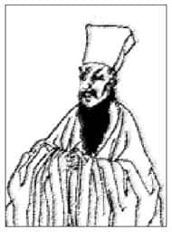

大多数人在受教育的过程中，并没有体会到太多的快乐，反而感受了不少压力，并且认为教育只是一个人进入社会之前必要的训练过程。

到底什么是教育呢？西方学者以三种职业，就是农夫、医生、教师，来说明教育的特性，亦即教育是一种“需要合作才能产生效果”的工作。农夫再怎么努力耕田，也不一定有收成，除非有上天的合作，让气候风调雨顺；医生的医术再怎么高明，也需要病人的身体有复原的能力来配合，否则即使华佗再世，对病入膏肓的人也无可奈何；教师则需要学生的合作，无论老师再怎么费心教导，如果学生不愿认真学习，那么教育怎么会有效果呢？

这种类比值得我们省思。我们常说教育是“自我教育”，就是因为它需要受教者的配合。每个人在学习的过程中都会有下述经验：在同一个班级中，被同一位老师教导的一群学生，每个人都会有自己的心得，将来的发展也都会不一样。因此，教育是一个需要靠自己去承担的责任。

# 教育是风格的培养

## 教育的三阶段

英国哲学家怀特海认为：教育是“风格之培养”。他进而指出，一个人从小学到大学的教育可以分为三个阶段：浪漫期、精密期、展望期。以下分别就这三个阶段加以说明：

（一）浪漫期

小学阶段称为浪漫期，此期的心态充满想象力与好奇心，并且要求对任何事件都有比较完整的叙述，借此对无法理解的现实世界保持距离。

对这个阶段的孩子而言，现实世界发生的一切都是片片断断的，每天都会出现一些不完整的信息，最后甚至让人觉得这个世界好像四分五裂。小孩子能够把握的，是比较完整、有开头也有结局的故事，譬如：漫画、童话、卡通等。小孩子在尚未准备好接受现实世界之前，必须先以这些浪漫题材所提供的故事情节作为他所相信的世界，然后再慢慢成长，接受真实的挑战。若是忽略此一阶段的需求，幼小的心灵将会受到伤害。

（二）精密期

初中、高中的六年称做精密期，在这个阶段要奠下知识的基础。每一门学科都有基本知识，如果这个基础没有打好，可能从此一生都讨厌某一门学科，甚至从此不喜欢学习，结果损失最大的是自己。由此可知，这个时期是相当重要的，丝毫不能松懈，必须像装配机械零件一样，严格要求精确。

对这个阶段中的学生而言，感觉辛苦是应该的。我们不能因此就给他们松懈的理由，而要设法让他们知道这种辛苦到最后是值得的，会有丰富的回馈和收获。如果在中学阶段没有好好努力，那么这一生在知识的领域中，恐怕必须放弃许多权利了。

（三）展望期

上了大学以后则进入展望期，这个阶段要开始学习高瞻远瞩，去发现自己同社会、群体、整个人类、历史，甚至宇宙之间的关系。换言之，展望是要敞开自己的心灵，培养独立思考的能力，找到自己生命的定位与意义。

一般而言，一个人在上大学以前不会想到这么多问题，即使想到也很难得到满意的答案。因此，中学生应该专心学业，努力把考试的科目学好，准备升大学。他们的人际关系也相当单纯，所面对的不过就是家人、同学、朋友而已。不过，如果上了大学之后还保持中学生的心态，满脑子只有考试、得高分、毕业之后顺利就业等目标，那是不够的。大学生之所以被称做知识分子，就是因为他们懂得展望，可以高瞻远瞩，让自己的生命与其他所有的重要领域连上线。

## 教育就是自我的要求

教育就是风格的培养，在此“风格”的意思是指一个人对自己的思想及行为有一定的要求，因此表现出来就有一定的水准。一个人受过教育之后，最大的特色是：对于许多事情不是不能做，也不是不敢做，而是不屑于做。“不屑于做”就是一种风格，是人受教育以后首先应该有的自我要求。

孔子说过，交朋友的时候，首先要选择“中行”，若中行不可得，则要选择“狂者”或是“狷者”[1]。狷者就是“有所不为”，一个人受过教育之后就应该表现出如此的风格。一个人能够有所不为，然后才能有所为。换言之，因为有所放弃，才能有所坚持。狂者则是志向比较高远的人，就算是一般人认为做不到的事情，他还是同样努力以赴。

最理想的则是中行，亦即言行适中、恰到好处。基本上，任何一种想法都可以用适当的言语表达出来。一个人如果能把握“适当”这两个字，就能确切地传达自己的想法，并且不会有后遗症。相反，若一开始没有掌握到适当的言词，那么往往就会造成误会，还可能与别人产生各种复杂、麻烦的关系，进而必须承担许多后遗症。

当然，人的表达不是只有言语的问题，还包括态度，也就是肢体语言。如果我们对于这些都能掌握，那么接下来的就是进一步的行动，也就是我们和别人相处时的应对之道。事实上，“中行”这两个字有点像“中庸之道”，中庸之道指的并不是温温吞吞，而是做任何事都能秉持原则，也就是所谓的“当狂则狂，当狷则狷”。

教育培养风格，要从“狷”开始，我们交朋友也是一样的。交朋友时首先要问：“什么事情是你不屑于做的？”如果对方没有任何事情不屑于做，那么就不必深交，因为这种人可以无所不为。其次，我们要看对方是不是狂者。狂者的志向很高，虽然有时候无法达到目标，但依然努力奋斗，因此会显示出一种非常高昂的斗志，亦即所谓的“天行健，君子以自强不息”。这种人会让人觉得生命是难得的机缘，应该好好珍惜，不断努力向上。

“中行”则代表一个人在各方面的修养都达到很高的水平，在此举王阳明（1472—1528）的例子来说明这种境界。有一次，王阳明的一个学生告诉他：“我每次提到老师的意见，都会有人和我辩论，让我有些生气。”王阳明听了回答说：“我听到别人批评我，一点都不会生气，反而还要感谢他给我指导。”这番话说起来好像很容易，要做到却非常困难，真正的修养就是要抵达这种境界。  

王阳明  
1472—1528

明朝哲学家，名守仁，早年于学无所不窥，后归本于儒家思想，标举“心即理”、“致良知”、“知行合一”之说，与宋朝的陆象山合称“陆王”，代表儒家的“心学”系统。广为人知的作品为《传习录》。  

与别人相处的时候，如果发现别人的意见和我们不同，不但不要生气，反而应该要借这个机会自我反省。《孟子·公孙丑上》提到：“子路，人告之以有过，则喜；禹闻善言则拜。”如果有一天，你对别人的批评不但不生气，反而很高兴，那就证明教育在你的身上已经展现成果。反之，如果你听到别人的批评就不高兴，那代表还有很长的一段修行路要走。事实上，教育可以说是一生的功课。

# 人生四大领域

人活在世界上，首先要明白，人生究竟有哪些重要的范围。如果没有全盘了解这些领域，很容易执著于某一部分，而忽略了其他可能更重要的部分。

人生有四大领域，就是：群体、自我、自然界、超越界。进入社会以后的教育，应该根据这四个领域来思考，以下分别加以介绍。

## 群　体

人不能离开群体而生活，从家庭到社会到一生，我们在群体中可以取得成就，以及随之而来的责任。我们在群体中生活，相对的，群体也会带来各种压力。现代人容易患有精神官能症，往往就是由于群体的压力，如人际关系失调所造成的。

群体有优点也有缺点，一般人常常注意到它的缺点，但是此处则要谈到群体的优点。群体的优点是，储存了长期以来人类社会所生产的文化成果与资源，譬如好的音乐、电影、小说及诗词等。这些资源提供人类自由使用，如果不懂得如何享用，无异于自己放弃了这个可贵的权利。

如果对生活感到厌烦，觉得电视和报纸充斥着无聊的内容，那是因为我们自己不懂得去调适，不必怨怪别人。社会风气固然有它负面的压力，但同时也提供了各种文艺产品，如果懂得去欣赏、去享用，人生其实可以变得更美好。例如，台北的故宫博物院中保存了许多国宝，就算我们花四五十年的时间都欣赏不完，但是大多数人不见得有兴趣参观，即使看了也可能不懂其中的奥妙。这说明我们在学习进入文化领域上所花的时间太少了，而花太多精力在准备如何接触现实的世界——而现实世界原本就充满生存竞争的压力，也难怪大部分人总是看到群体的缺点。

一旦对社会群体[2]有了基本了解，就可以尽量避开它的缺点而利用它的资源。我们必须约束自己每天看电视、看报纸的时间。自我约束成了习惯之后，多出来的时间与力量将可以用来欣赏人类文化的资源。这些资源取之不尽、用之不竭，如果多接触它们，会比较容易在纷扰的世界中保持自己对人生的信心与希望。

人要活得快乐，才会觉得生命有价值。一个人活在世界上，总是要忍受一些缺憾、困难、不便，如果不了解自己“为了什么”而活，那么这种忍受就显得毫无意义。很多人顺利考上大学，是因为他们在中学时代已经知道自己是为了什么而活，因此再怎么苦都愿意承受。相反，有些人并不觉得考大学有什么意义和乐趣，因此在准备的过程中就会感到痛苦不堪，以至于在心理上造成很大的压力。

## 自　我

自我对人而言是非常重要的核心概念。人的一生无论主动或被动、清醒或模糊，都是在自我实现的过程之中。一般而言，我们都希望自己与社会之间能保持平衡关系——一方面保有属于自己的内涵及观念，不要完全被社会同化；另一方面也不能完全排斥社会，否则人生会很寂寞。人必须设法开发自我的潜能，因为潜能得以开展，自己内在的条件就会越来越充实，人生也会因此更丰富。

自我的潜能有三：知、情、意。

（一）知

知就是求知，人的求知过程非常辛苦，所以我们要肯定所谓的“三受主义”：忍受、接受、享受。

读书时必须放弃许多娱乐，这就是忍受。其次，通过文字的理解，得到观念之后，你才会愿意接受书本里的道理。人活在世界上只能看到事实，而事实不一定有道理。书本能够提供道理来解释事实，所以一个人越能了解书本上的道理，就越能接受生活中遭遇的一切。一旦能够接受，心态也会跟着调整。

第三步是享受，也就是享受知识的趣味。许多人常问：“读书快不快乐？”这个问题的答案不是一语可以道尽的，因为读书的快乐在于结果，而不是开头，很少有人一开始读书就感到喜悦。有些人不喜欢孔子，觉得他在《论语》中的第一句话就有问题。孔子说：“学而时习之，不亦说乎？”一般人都忽略了，这个“说”（悦）是指学了之后“在适当的时候印证练习”的心得而言，而不是一开始读书就能满心欢喜。

我有个朋友很注重小孩的教育，儿子一上初中，他就把电视卖掉，全家三年不看电视。这是因为他了解初中生的课业相当繁重，放学回到家一定要念书，这时若客厅传来阵阵欢笑声，对儿子而言一定是一件很痛苦的事情。如果一个人在初中就觉得读书很痛苦，那么他可能一辈子都不会喜欢读书了。由此可知，求知确实有它辛苦的过程。

想开发出“知”的潜能，秘诀在于每天学习新事物，并持之以恒。人生的道理其实很简单，能立定志向，生命就会转变；能持之以恒，生命就会脱胎换骨，最后终能赢得美好的结果。许多值得羡慕与崇拜的人，大都在认知上掌握了正确的方向，然后持之以恒，生命就完全改观了。

（二）情

自我的第二种潜能是“情”。人的情感有两方面，其一是人与人之间的亲情、友情与爱情；另一方面是审美的情操。亲情、友情与爱情听起来相当温暖，但是世间许多困难也是从这些情感而来，因为这一类情感有一个特色，就是不能谈条件，也不能要求公平。譬如，父母对子女照顾有加，并不保证子女会孝顺；你对朋友讲道义，也不代表朋友会像你待他一样地待你；爱情更是如此，当你爱上一个人时，往往无怨无悔地付出，丝毫谈不上公平的回应。

此外，“爱”这个字听起来很美，却很难长期维系。在张爱玲的《红玫瑰与白玫瑰》这篇小说中提到，每个男人的一生中都会有两个女人，一个是红玫瑰，一个是白玫瑰，红玫瑰代表热情如火，白玫瑰代表纯洁无瑕。如果他娶了红玫瑰，久而久之，红玫瑰就会变成墙壁上的一抹蚊子血，而白玫瑰则如同“床前明月光”，永远那么皎洁亮丽；如果他娶的是白玫瑰，久而久之，白玫瑰就会变成衣服上的一粒饭黏子，而红玫瑰则是心口上的一颗朱砂痣。由此可以想见人生之无奈。在男生是如此，在女生也有类似的情况。爱情往往在成功的那一刹那，就变质或消失了。

由此可知，情感一方面带给人无穷的活力，产生多彩多姿、充满戏剧性的情节，另一方面也带来了挣扎、痛苦与烦恼。

遇上这些困境时，可以转到情感的另外一面——培养审美的情操。因为受到美的感动，就会觉得自己无论再怎么苦都值得[3]，随之化解生命中的困境。然而，我们不可因而沉溺在眼前的欢娱中，因为沉溺只会让人逃避，带来更大的痛苦。换言之，审美可以作为一种调解，但不能用来替代现实生活。

（三）意

自我的第三种潜能是“意”。在谈到教育是自我的要求时，说过人要立志，意思是，在意志上我们要觉悟自己具有主动权，才能化被动为主动，把自己的生命掌握在手上，塑造成自己喜欢的人格类型。

教育是风格的培养，而培养风格的关键就在于“如何立志”。现代人听到“志向”这两个字，通常会联想到具体的、外在的、社会化的成就，譬如要赚多少钱、从事什么行业等。在此所谓的志向应该要回到内在特质的培养，譬如，我欣赏勇敢，就应该设法培养自己成为一个勇敢的人；我欣赏正直，就应该培养自己成为正直的人。有些性格特质尽管你现在还做不到，但是只要立定志向，将来就有可能达成。

《哲学与人生》（Ⅰ）第六章介绍过“存在主义”，所谓“存在”就是“选择成为自己的可能性”，由此可知，我们要先对人生有基本的认识，然后作选择。在年轻的时候及早思考、选择，这一生才不至于后悔。人的身体会自行成长，同时也有成长的极限；心灵却不会自动发展，需要靠自己立志，然而一旦发展起来却是无所限制。

自我培养及充实知、情、意潜能的内涵，就可以与群体分庭抗礼。当然，最理想的状况是从对抗转变为相辅相成，亦即处身于群体中，却不受群体局限，无论动静出处都可以自在从容。有一个很好的例子可以说明这种风范：舜年轻时在田里耕作，丝毫不觉得有任何遗憾，后来尧把两个女儿嫁给他，让他当上帝王，他也不认为自己有什么了不起，好像天下原本即属于他。这就是人生的高明境界——一个人无论处在任何情境之中，都不会感到卑微或骄傲。舜可以表现这种风范，正是因为他的内在自我保持了动态的和谐。

如果只注意群体，自我将缺乏自信，甚至随俗浮沉，一旦遇到挫折立刻觉得活着没有意义。反之，如果在群体和自我的关系上能够维持均衡，那么基本上，你的人生已取得稳固的出发点。

## 自　然　界

如果有人觉得活着很辛苦，面对自己又感觉无聊乏味，那么他应该多接触自然界。我有个朋友曾经养了九条狗，因为他认为看狗的脸比看人的脸舒服多了——的确，社会上很多人都是以貌取人，或见面先询问身家背景。譬如，我们下雨天走在街上，被一辆疾驶而过的车溅湿了衣服，如果看到那是一辆福特，通常会气愤难平，如果是一辆奔驰，可能反而会后退一步，好像自己理屈。这就是群体造成的荒谬，使大家从外在价值来判断行为的是非。自古以来，人间岂有真正的公平？

自然界不会有这个问题，因为自然界的特色就是公平，耶稣说过：“（上天）降雨给义人，也给不义的人。”无论你是好人或坏人，下雨的时候都会淋到，绝对不可能因为你是好人就不会淋湿，坏人就变成落汤鸡。又如，任何人到海边都能听到一样的浪涛声，绝不会因人而异。自然界是公平的，当你觉得在群体和自我两方面面临很大的压力时，不妨和大自然多接触，譬如养宠物、种盆栽，假日到山上、公园走走，甚至街边的树木与小草都有值得观赏的地方。苏东坡说：“凡物皆有可观。苟有可观，皆有可乐，非必怪奇玮丽者也。”即使路边的一株小草、一朵小花，都有美妙迷人之处，并非只有风景名胜才值得造访。

我们对自然界要采取四种态度：竞争、利用、保护、欣赏。

（一）竞争

面对自然界，首先要有基本的戒心，因为人类和大自然之间仍然有一种最原始的“物竞天择、适者生存”的“竞争”关系。大至整个地球的变化（如地震、风灾），小至在野地上遇到虎头蜂、眼镜蛇，都需要小心对待。譬如，在野外碰到虎头蜂时，要赶紧逃命，不能以为虎头蜂属于大自然，就应该与它和睦相处。

（二）利用

人类利用大自然来取得生存的条件，譬如食物。原本专家预测人类的食物早已不敷使用，但是生物科技的发展解决了这个危机。生物科技让人类知道什么样的土地应该种植什么样的食物，所以全球上地的开发及利用效率提高，生产量大增，人类也有了足够的维生食物。由此可知，人类在利用大自然这方面的确有重大的成就。

（三）保护

利用大自然的同时，也要注意对大自然的“保护”，否则将会造成大自然的反扑。举例来说，每当出现台风与暴雨，山坡地常会因为水土保持太差而造成泥石流，这就是因为我们平常只知道利用土地，发展经济效益，而忽略了环保的必要性。

（四）欣赏

欣赏是我们与大自然之间取得一种和谐。事实上，这种和谐本来就存在，因为人类是大自然的子女。古代神话中常将大地视为母亲，意味着我们在大自然中可以放松紧张的压力，好像回到母亲的怀抱一样。西方许多诗人所描写的大自然都充满情感，尤其是一些田园派、浪漫派的诗人，包括泰戈尔、纪伯伦等，都擅长以大自然作比喻（如云、风、树、雨等）。这些作品值得我们欣赏品味，因为它一方面描写人类生命的自然状态，另一方面也道出了自然界取之不尽、用之不竭的资源。

苏东坡说：“惟江上之清风与山间之明月，耳得之而为声，目遇之而成色！取之无禁，用之不竭，乃造物者之无尽藏也。”人类社会的资源也许有用尽的一天，自然界的资源则不然，因为我们并不是真的去利用它，而是去欣赏，所以它是永无止境的，只要春天一到，所有的生物就开始欣欣向荣。自然界有它的周期，而人的生命也处在这个周期之中，如果一个人可以和自然界保持良好的互动，随着自然界的周期而发展，生命会比较顺畅而自在。

如果我们领悟与自然界的相处之道，就已经把握了三个领域——在社会中奋斗、有个人的内在修养，还有大自然可以调节。然而，人最后还是要离开这个世界，所以必须对死亡有一个交代，对命运及善恶报应有一个解答。若要回答这些问题，就必须谈到超越界。

## 超 越 界

人活在世界上，有许多东西是经验所不能接触、理性所不能回答，但又必须面对的，那就是有关超越界的问题。譬如我问：“人从哪里来？要往哪里去？”这即是一个涉及超越界的问题。你可以回答：“人从道而来，最后要回到道之中。”然而什么是道？你回答的时候或许不太清楚答案，但是这代表了至少你知道有某样东西或某个境界是自己所不了解的。

因为真正的道或超越界，本来就无法用语言文字形容。当人们用语言文字描述道的时候，会碰到一个限制，亦即说了之后必须立刻补充说明，表示并非字面上的意思。譬如我说：“道像母亲一样。”紧接着马上要强调：“但是，道不是母亲。”因为母亲怎么能够容忍自己的子女受到迫害（譬如地震使得无辜的人死亡）？

我们想对超越界有所认识，是因为人的生命是有极限的，这个极限需要一个终极答案，而超越界就是作为最后的、充分的理由，来说明人间的一切现象。如果不谈超越界，那么人活在世界上将陷入一个封闭的系统，这个系统最后只能到生命结束为止。假如真是如此，人生的意义就不值得一谈了，在此以无神论与唯物论为例说明。

无神论与唯物论并不是“对或错”的问题，而是无法说明人之所以存在的意义。这样的理论发展下去，人生只是“一团漆黑”四个字，只有吃饭、生孩子、交朋友这些事可做，谈不上更深一层的价值。当然，我们不能否认这些事情都是必要的，但是人生仅仅如此，显然不够。

基本上，人的理性总是希望理解最后的原因，既然这种希望存在，代表这个最后的原因也有“可能”是存在的，否则人的生命结构难免沦于荒谬——若人类有理性可以探讨宇宙万物最后的原因，但是宇宙万物居然没有最后的原因，那么人类等于一出生就上当，而到离开世界时还不见得知道自己如何上当，这岂不是一个很大的荒谬吗[4]？

当然，有些人认为人生本来就是荒谬的，但这只能算是一个出发点，而不是结论。如果以荒谬作为出发点，必须在荒谬之上建立不同的人生观，像加缪早期所做的一样。然而，如果以荒谬作为结论，那么请问人究竟为什么还要活下去？心理学家弗兰克（Frankl，1905—1997）是犹太人，他在第二次世界大战时被关进集中营，所有亲戚朋友都被纳粹杀害，他却侥幸存活下来。他在集中营时开始思考：“为什么许多人在等死的时候还坚持活下去？”他在恶劣的环境中体会了精神力量的可贵，以及生命意义对人的影响，因此发展出“意义心理学”。

弗兰克的“意义治疗法”帮助了很多人。很多人不快乐，就是因为找不到人生的意义。然而，人生意义又是什么？一个人在读中学的时候，人生的意义是要考大学；读大学的时候，人生的意义则是要顺利毕业或继续深造。这样的意义一直往后推衍，最后总是会碰到结束，而在这个关卡上，不能再以一个具体的东西作为意义了（如赚到多少钱、当到什么官等）。这个意义是一个人在生命过程中无法达成的，因此不能向外探求，只能向内寻找，也就是一种对自己的要求，要求自己达成一种最高的、圆满的境界。

弗兰克所说的寻求意义的过程，与超越界可以互相配合。我们在第十二章“宗教与永恒”中曾经说过，信仰就是我与超越界之间的关系，而宗教则是这种信仰的具体实现，因此会受到时空环境影响。

然而，我们怎么知道自己与超越界有关系？人都会碰到极限。有时候一个人表面上好像十分不幸、可怜，譬如遭遇失学、失业、失意、失恋等，一无所有，但事实上，这可能正是他生命转弯的关键。人在这时候蓦然回首，才会发现原来自己的生命有一个最后的、稳固的基础；反之，如果一个人总是一帆风顺，也许就缺少了这种回首沉思的机会，一辈子在权力、财富、名声中打转，转到最后，仍然对生命感到迷惑。

一个人如果认真看待生命，自然会思考自己的一生是如何来去。但是，即使请教父母，也得不到答案，因为他们与我们一样，对人生也会感到茫然。如此不断地询问，最后自然会碰到超越界的问题。这也就是为什么自有人类以来，宗教可以一直存在。

人的生命是由身、心、灵三个部分所构成，一般人往往只注意到身与心的部分，这是不够的，真正伟大的哲学与宗教，一定会谈到灵。身代表身体（如：身体是否健康、事业是否有成等），心代表心智（如：是否能够正常与别人沟通，以及学习、思考、反应的情形等）。有些人身体健康、心智正常，却不快乐，由此可知，快不快乐决定于第三个因素，这个因素我们称做灵。

灵的题材不必然与宗教有关，它是一种赋予自己生命意义的能力。换言之，灵是一种力量，使人进行从自觉到赋予意义的整个过程。这种能力是每个人都具备的，但是如果不加以开发，那么生命就好像在薄冰上，基底薄弱不易站稳；反之，如果能逐步开发灵的力量，他就可以承受身心的各种考验。这也是为什么有些人虽然身体受伤、心智也失常，但是却能因为灵的力量而安定；相反的有些人虽然身体健康、心智也正常，却不想活了，这代表他的灵陷于困境，漂浮无依。

此外，灵也是一种整合的能力，能够把人的分裂状况统合起来，让自己肯定自己是“一个人”、是一个整体。要做“一个人”是很困难的，因为每个人都有多重角色，这种多元化会使得一个人的生命分散、内心挣扎，因此特别需要统合。如果无法做到这一步，内在就会有一种撕裂的痛苦。

既然统合的力量是灵，那么如何让灵发挥作用？第一步要定期沉思冥想，定期回归内心、回归原点。自古以来，许多哲学家都强调静思和反省，因为如此才能稳定心情，让生命恢复完整。人如果没有定期回到原点，很容易感到疲倦与乏味，需要借由各种外在刺激让自己继续奋斗，最后恐怕将忘记自己原本的面貌。

许多宗教规定信徒定期（每周或每半月）回到教堂（会堂、祈祷所、寺庙等），就是一种回到原点的方式。如此一来，信徒的生命密度将会提高，也能有更深的自我了解。许多人推崇犹太人这个民族，就是因为他们具有很强的宗教性格。许多中东地区信仰伊斯兰教的人民能活得很有自信，勇敢对抗所谓的美帝强权，也是基于相同的原因。由此可知，让自己定期离开群众、离开世间的联系，回归超越界的向往，是人生中不可或缺的安排。

# 教育与自我生命的发展

自我在一生之中，有四项任务需要设法达成，就是：自我认识、自我定位、自我成长、自我超越。以下分别说明。

## 自我认识

“认识自我”是一件难事，却非常重要，因此希腊人会在德尔菲神殿刻上“认识你自己”这几个字。“自我”本身不断在变化，譬如我今天看了一部电影，获得很大的启发，那么看完电影之后的我就和看电影之前的我不一样了。

自我认识可以从心理测验、性向测验，或者星座、八字着手，不论使用何种方法，关键在于：要把生命看做一个动态的过程。想了解自己，可以留意三个问题：“什么事情使我感动？”“什么人的作为使我羡慕？”“我对自己满意吗？”当看到一件事情而觉得感动时，立刻把它记下来，因为这是内心的召唤，代表内心希望自己也能做到同样的事。同理，如果羡慕某个人，代表这个人的作为与成就引发自己内心向他学习的愿望。

然后问：“我对自己满意吗？”一般而言，人对自己都不太满意，如果试着了解不满意的理由是什么，就能由此找到奋斗的方向[5]。

人在年轻的时候，应该开始尝试自我认识，譬如通过自由想象法[6]，用各种价值观来测试自己，看看自己对哪些价值最为珍惜。一个人的生命内涵由他所选择的价值所构成，如果无法回答：“人生中什么最重要？”代表你根本不了解自己。这种认识自我的方式是最妥当的，其中涵盖了生命的动态开展，因为了解自己的志向何在，就知道未来应该往哪里发展。

根据柏拉图的说法，每个人的内心都有一个精灵（Daemon），它像是上天为人注定的一种天命，让人知道自己该往哪个方向发展，最后达成一个目的，完成生命的拼图。我们每作一个抉择，就好像是加上一片拼图，而在尚未完成之前，是无法看到全貌的。一个人如果想将人生拼成美好的图案，一定要有愿景（vision）。如果没有愿景，拿到什么拼什么，最后的成果可能令人难以辨认，有的地方灿烂、有的地方晦涩，整体看来不成一个构图。

现代人强调生涯规划，正是因为人生需要一个构想或蓝图。不过，一般人往往将生涯规划局限于事业规划。但是，不论经营任何事业，最后仍然要退休交棒，又怎么算是全部的生涯？有些人的生涯规划则是在规划子女的生涯，自己的生命却没有任何发展，这也会造成各种问题。真正的生涯规划，要由开发自己的潜能着手。

## 自我定位

“定位”的英文是orientation，指涉“位置”和“方向”的双重意思。我们必须知道自己在哪里，以及未来往哪里走，因为生命是动态而不是静止的，不可能停留在某一个定点。孔子曾在河边，望着流水感叹：“逝者如斯夫，不舍昼夜。”（《论语·子罕篇》）时间是不等人的，每天都不停地变化。所以我们要养成一个习惯，亦即发生任何事情的时候都要想一想：“我是如何走到这一步的？现在位于什么处境？”

有一部电影《势不两立》（The Edge），剧情描写一群登山客迷路了，当所有人惊慌失措时，有个人说了一句发人深省的话：“大多数登山迷路的人，都是因为自责而死的。”的确，若我们登山迷了路首先应该设法求生，但是通常我们都在为自己先前的大意行为而懊恼及悔恨，在还没有分辨清楚自己身在何处之前，就先责怪自己，可能因此而丧失斗志，甚至放弃求生的意愿。

人生难免遭逢困境，困境之中，不应该一味抱怨或自责，而要问自己：“我在哪里？”我在美国读书时，偶尔会出现这种状况，有时候半夜惊醒，便问自己：“我在哪里？接着应该往哪里走？”理清思绪之后，总会发现还有些微希望，于是又能继续奋斗下去。人生很多时候，不能由别人给你希望，只要自己还怀抱一丝希望，就应该继续奋斗，即使无法感动别人，你的斗志也会赢得敬畏。孔子说过：“后生可畏。”（《论语·子罕篇》）年轻人之所以值得敬畏，就是因为他们斗志昂扬，你永远不知道他们什么时候才会放弃。

通常人在进入社会、找到工作，并且安定下来之后，会开始思考“自我定位”的问题。自我定位需要定期做反省，尤其是遇到困境的时候，一定要认清自己的位置与方向。

## 自我成长

一个人的自我成长，往往从中年以后才真正开始。年轻时的自我成长是具体明确、可以被测量的，譬如：每天读书，知识就会增加。至于从事其他方面的修行，年轻人的生活经验恐怕还不足以配合。换言之，年轻时所面对的世界比较单纯，自我成长还无法全面展开。

有一部电影《城市乡巴佬》（City Slickers），描写几个四十岁左右的美国中年男子的故事。这些人从小遵循父母所教导的方式生活，好好读书、成家立业，到了四十岁却面临中年危机。于是他们利用假期到西部去放牛，因为对许多美国人来说，牛仔生活充满浪漫的情怀，好像可以模仿祖先的生活而回归根源。

城市人到了乡下，难免显得非常笨拙。他们要负责把一群牛赶到德州，在这途中发生了不少趣事。有一天晚上大家聚在一起聊天，话题聊到人生如何才会快乐。这些人颇有成就，才四十岁已经实现了童年梦想，但是并不快乐。大家讨论了很久仍然没有答案，这时，同行中赶了一辈子牛的老牛仔宣称他知道快乐的秘密。他举起一根指头说：“人生快乐的秘密就在于‘一’，只要能够设定一个目标，专心奋斗，就会快乐。”

这个例子提醒我们，自我成长主要是从中年开始的。我认识很多中年以上并且相当好学的朋友，他们的上进精神也是我继续努力教书的动力之一。我在学校教书的对象是大学生，而大学生在学习方面有一个缺点，就是总觉得读书是被迫的，是为了考试、为了学分，学习的心态也就比较被动。学生一旦被动，会给老师构成压力，使共同求知的兴趣大为消灭。相反，许多中年朋友，他们在社会上已经贡献了心力，却能够保持求知的渴望，主动来上课学习。看到他们时我就会想到，他们的生命经验已经相当丰富了，而这正是走向自我成长的最好机会。

许多人强调全方位的教育，因为人生的经验原本是全方位的，如果没有考虑这一点，那么一个人的教育可能离开学校后就停止了，只接受了部分的教育。事实上，进入社会之后，人生许多问题才刚开始。很多人听过孔子说“四十而不惑”，都觉得很难理解，因为对一般人而言，通常是四十而大惑，人生各种问题四十岁之后才会一一涌现。

现在在台湾地区很多人提倡建立书香社会，并且有各种读书会的组织，让很多成年人可以重新学习。这是一种良好的风气，因为真正的成长从中年开始。真正的成长不是被动的、被安排，或无意识发生的，这些只是“灌输”而已，真正的成长一定出于自己的意愿，并且知道自己在哪些方面应该再进修、再充实。

## 自我超越

这部分与前面所谈的超越界，有相似及相通之处。之前提过超越界不是一般生命经验能够轻易掌握的，而自我超越则是要化解自我的执著。一个人如果刻意追求快乐，往往得不到快乐，就算得到了也很容易失去，因为他永远都会有新的追求。

相反，当一个人化解自我的执著之后，就不再刻意追求快乐了，结果当他不去追求快乐，快乐反而自己降临，换言之，真正的快乐往往是在无意之中来到的。

有一个生动的比喻可以描写这种境界：快乐就像一只蝴蝶，你拿着网去捕它，它会飞得更快；如果你不理它，它反而会飞来停在你的肩膀上。

努力追求快乐，本身就是一件不快乐的事情，因为追求本身就代表欲望尚未实现，内心当然会觉得痛苦。如果不去理会快乐是什么，专心做好自己该做的事，沉浸其中，快乐自然来临，因为快乐是一种由内而发的感受，不是向外探求所能获得的。

一个人若是提升到一种无私无我的境界，就是自我超越。通常老年人比较可能达到这种境界，因为他们经过人生的历练，拥有比较丰富的见识，对任何事都观察得比较透彻。

譬如，老年人常说“吃亏就是占便宜”，年轻人通常很难明白这一点，但是年纪越来越大，就会发现这些话的确有它的道理，可以帮助人把自我慢慢消解到群体中、到自然界中，甚至到整个宇宙中。宗教信仰对人的期许，也与“自我超越”的目标相符。

自我发展的四个阶段，也多多少少与年龄有关：年轻的时候开始自我认识，学校毕业之后要寻找自我定位，中年之后追求自我成长，年老的时候则努力自我超越。达到自我超越的境界，人生才算是真正完成了目标。

# 结论：活在当下，珍惜高峰经验

生命是丰富的，但是对每个人而言，都只能活在当下，过去种种美妙的经验永远只能留在回忆之中。即使舍不得过去努力奋斗的成果，但那些都已经成为过去，在现今这一刹那，只能看到当前的要求。未来或许美好，但古人有句话说得好：“富贵而不还乡，如锦衣夜行。”一个人奋斗有成，得到了名利权位，如果没有回到故乡，也不过像在夜晚穿着漂亮衣服，没有人欣赏。很多人功成名就之后还乡，就是为了拥有一种成就感。但如果一味追求这种快乐，未来必须付出很大的代价。这种代价是否值得，是一个需要思考的问题。如果你打拼一生所等待的只是别人的掌声，那么人生未免太不值得了，更何况最后为你鼓掌的人，不见得是你原先预期的那些人。

人活在世界上，如何把当下这一刹那的压力变成快乐，是一个制胜的关键。人本心理学家马斯洛（Abraham Maslow，1908—1970）所描述的“高峰经验”（Peak Experience），是一种能够让人在一刹那之间觉得无所缺憾、一切美好圆满的感觉。我们有很多时候会有这种感觉，例如你晚上在家听收音机，忽然听到一首老歌，那一刻心里非常愉悦，即使眼前还有不理想的地方，也正好构成一个背景，反映出当下的圆满；有时候你和家人在一起聊天，聊着聊着忽然感觉好像有一刹那时空停止不动，看到父母、兄弟俱在，觉得人生实在开心、别无所求，外面世界的成败得失根本不值得一谈；有时候你辛苦地替朋友奔走，最后终于解决了问题，那一刹那内心充实而欢喜；有时候你一个人到郊外，看到山上各种树叶、云彩的变化，那一刹那忽然觉得内心敞开，好像自己和大自然之间没有任何隔阂，天地间的一切任你享用，你甚至也不想占有这一切，因为彼此已经合二为一了。

这些都属于高峰经验，当这种经验出现的时候，要加倍珍惜，因为它不会随时出现，也无法事先安排。假设有一天我和几个朋友聊得相当愉快，一刹那之间出现了高峰经验，觉得一切非常美好。因为念念不忘这种经验，于是又约了一个时间跟同一群人见面，希望再体验一次当时的感觉，但不见得有相同的效果，就算真的出现了类似的体验，也会因为心里早有预期，而觉得似乎没有原先感觉的那般美好。

生命是一个奥秘，希腊悲剧作家索福克勒斯曾说：“宇宙万物之中，没有比人的存在更值得惊讶的。”人类的生命本身就是一个惊奇，我们身处这个充满惊奇的世界之中，有时候可能会觉得自己没有任何特别之处。但是如果回头看看过去，就会发现自己的生命从出生到现在，历经各种精彩的转变，以至于现在的自我可以思考、可以做合理的推论、与别人有情感交流、对整个宇宙有个人欣赏的角度、对人生有自己的品位，这不是一件值得惊讶的事吗？

更重要的是，在未来的日子里，我们还可以选择一个目标去奋斗、选择一种理想去坚持，然后以有限的生命展现出无穷的力量\!

* * *

[1] 子曰：“不得中行而与之，必也狂狷乎！狂者进取，狷者有所不为也。”（《论语·子路篇》）意思是：“找不到行为适中的人来交往，就一定要找到志向高远或洁身自好的人。志向高远的人奋发上进，洁身自好的人有所不为。”

[2] 达尔文主义之后开始有人提出社会达尔文主义，亦即把社会当做丛林，大家在其中求生存。在这种生存竞争中，人们往往是借着别人的失败来取得自己的成功。

[3] 关于此部分请参考第四章《艺术与审美》。

[4] 美国心理学家、哲学家威廉·詹姆斯主张实效主义（Pragmatism）。他在有关宗教的议题上，认为：第一，有神论与唯物论（在此可包括无神论），这两者所见的世界及其历史是相同的，但是前者加入“上帝”假设，而后者纯以“物质”来解释。第二，如果不就各自对未来的经验或行为所造成的影响来看，则无法判定两者孰是孰非。亦即，唯物论使人发现：人类的理想、成就以及思想成果，这一切都将变得“有如从未存在一般”。而有神论则使人发现：人类理想中的秩序将会永远保存下去。换言之，有神论更可以合理解释大多数人目前的行为。

[5] 孔子说：“德之不修，学之不讲，闻义不能徙，不善不能改，是吾忧也。”（《论语·述而篇》）意思是：“德行不好好修养，学问不好好讲习，听到该做的事却不能跟着去做，自己有缺失却不能立刻改正；这些都是我的忧虑啊。”忧虑，意思是最为关切者。这就是孔子表达他对自己不满意，因而保持奋发上进的动力。

[6] 请参见《哲学与人生》（Ⅰ）第二章“胡塞尔的现象学”。

