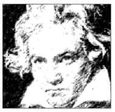

人类社会的主要特色就是有文化传统，到底什么是文化？文化与人生有何关系？思考这些问题时，必须走出个人狭隘的世界，思考自己与社会、人类、历史，甚至宇宙的关系。

# 文化之界定

一般人常说文化是人类生活的全部表现，但是这个定义太过空泛，无法说明为什么有些文化会兴盛，有些则会衰退，甚至灭亡。

文化的兴盛与衰亡就像人的生命一样，具有周期性。英国历史学家汤因比在《历史研究》一书中，曾分析全球自古以来的各种文化，结果发现每一种文化都是历经兴、盛、衰、亡，最后成为遗迹。在他看来，能够长期存在，历经两个周期，亦即经过兴、盛、衰、亡，又重新兴、盛、衰，而至今将亡未亡的，只有中华文化。为什么中华文化如此特别？这是因为中国人有一套独特的文化理念。

历史上长期存在的文化最后往往变成考古的对象，譬如埃及文化。台湾地区文化界在2003年的大事之一，就是岛内科学博物馆向海外收藏家购买一具木乃伊，进行深入研究，木乃伊就是文化的遗迹。然而，现在的埃及人也已经与他们的祖先脱节了。

能够自古至今延续发展，并且在血源与语言上没有脱节的文化，只有三种：犹太文化、印度文化、中国文化。维持文化活力的方式要看一个文化的“理念”，因为那是文化的生命力所在。

如何理解文化，即是本章要谈的第一个主题。以下先对文化稍作界定。

## 异于自然

文化的第一个特色就是异于自然。自然界有花草树木、鸟兽虫鱼、山河大地、日月星辰；但是，像大安森林公园内的水池花圃、林阴步道，就不是单纯的自然现象，因为自然界的树木是自由生长的，不会如此整齐地排列。举例来说，南美洲的热带雨林是自然生长的，一旦深入其中很容易迷路；反之，在公园里则不易迷路，因为树木、步道都规划得很整齐。这说明了，文化和自然是不同的，自然界经过人手改造以后，就变得人文化了。

有人类才有文化，如果没有人类存在，这个世界上就没有文化的问题。以前恐龙统治地球的时代，并未遗留任何文化，只能让我们挖到恐龙化石；然而，人类所留经之处，却能够挖出由人力改造自然界的成果，譬如城堡。由此可知，人类的生命的确不能与其他生物等量齐观。

## 形成传统

人类文化的另一个特色，在于随着时间的延续发展，可以累积、创新、学习、认同，形成传统。人一开始学习母语及文字，便已经开始接受文化的熏陶，因为一个人的思考，必须在母语的结构中发展。它提供我们丰富的概念，也就是单字、语词，以及使用这些概念的方法，同时也塑造了我们的思考模式。

西方当代诠释学极力强调语言的重要，因为对人类而言，语言就是一切。如果没有语言，人类的生命无法摆脱大自然生生灭灭的规则。

人类文化经过语言的累积、创新、学习、认同形成传统之后，一方面成为重要的资源，相对地也成为很大的负担。譬如，我们有时会觉得中国人看起来比较老成，活得比较辛苦，是因为中华文化太悠久了，五千年的文化压得我们喘不过气，光是要学会粗枝大叶就很不容易了；相反，西方文化显得充满活力，原因之一是他们的文化发展的时间较短、内容较少，人们可以直接与自己当前的经验接轨。以今日来说，中华文化光是语言就有文言与白话之分，我们现在接触的只有白话文，而白话文只有一百年的历史。如果我们完全舍弃文言文，中华文化还剩下什么？如果忽略了整个传统，我们将无法分享文化资源，只能困处于模糊的过去与茫然的未来之间了。

## 自为中心

每一个民族对自己的文化都有一个核心信念，亦即相信自己具有特殊价值，譬如犹太人自视为上帝的“选民”。犹太人从一开始就认定自己蒙受恩宠，得到上帝的青睐。然而，这究竟是福是祸？犹太民族从有历史记录以来，充满了悲剧色彩和严酷考验，因为选民必须作为其他民族的模范。然而平凡的人怎么可能作为示范？人的生命从好的方面来看，固然可以展现许多伟大的典范，但无可避免也有其幽暗的一面，犹太人为此而受苦受难。因为从上帝的观点来看，他既然选择了你，你就必须是纯洁而圣洁的，那么当然必须通过他给你的各种试炼了。

在《圣经》的《出埃及记》中，摩西（Moses，生平约在公元前十三世纪）带领犹太人出埃及，那段路程只需要十一天，他们却走了四十年。因为犹太人在埃及世代为奴，已经习惯自认为奴隶。离开埃及最主要的用意即是要涤除他们的奴隶性格，而四十年的时间，正好让老一代的人全部凋零，就连摩西本人都无法进入应许的迦南福地，要靠下一代的约书亚（Joshua）带领。

再来谈到中国。我们自称为“中国人”，又岂是单纯的事情？“中”是中间，这个字的象形义在古代是指“旗子”的意思。古代是部落社会，酋长所在的地方必须插上旗子，演变到最后就形成了“中”这个字。以酋长为中心，接下来才有东南西北的方向，因此从前所称的东夷、西戎、南蛮、北狄，都代表着在“中心”以外，文化落后的地方。由此可知，自称为“中国”，其实是出于原始的信念，别的民族也会质疑我们凭什么说自己位居中间，处于重要地位。

如果“中间”代表的是文明和开化，每个民族都会认为自己位居中间。举例来说，参考雅典的历史，会发现他们称其他民族为“野蛮人”（barbarians），意思是只有雅典人是开化的；又如，伊朗人相信国境内的高山是上帝造人时亲临的那一座山，因此自己位居创世的核心地位。不仅如此，在每个原始部落的神话中，一定都会谈到神明直接与他们的祖先建立关系。一个民族如果没有这样的信念，等于承认自己的文化位于边陲地带，是属于次级和附属的文化。如此一来，这个民族要如何自我认同，稳定群体而存活下去？

请不要小看一些人口较少、规模也较小的部落，因为当我们从经济角度看不起他们时，他们也许会从精神层面看不起我们。在他们眼中，一个民族的人口较多，代表着品质比较差；相反，人口少，才可能成为精华（如所谓的“选民”）。由此可知，肯定自己为中心，是任何一个民族的文化特色，否则自己的生命将失去存在的必然理由。

## 生命周期

文化是有生命的，所以有兴盛衰亡，那么如何免于步入衰亡？了解文化有生命周期，就会警惕自己保持创新的活力。一种文化要长期存续，必须处于“挑战与回应”的过程中。举例来说，当前中华文化面临各种考验，最主要的是来自现代化的挑战。

本章稍后会说明近代以来的几种革命，由此凸显人类文化共同的挑战。中华文化如果可以适当回应，将会顺利度过生命周期，重现生机，进而在世界上扮演重要的角色。以下先就文化内涵作一说明，再谈如何重现文化生机。

# 文化之内涵（结构）

听到“文化是人类生活的全部表现”这种说法时，会觉得内容无所不包，但也不易明白其重点为何。说明文化的内涵，也就是对文化作结构上的分析。

文化有三个层次：器物层次、制度层次、理念层次。文化由人创造，所以它展现在人类生活中的每一部分。一个人的举手投足，做一个简单的动作，说任何一句话都会反映他所使用的器物为何，在什么制度下成长，有什么样的人生理念。举例来说，观察一个人吃一顿饭，就大概知道他的出生背景、教养过程以及生活态度。譬如，他在长辈还没开动前先吃，这种行为比较像在西方文化中成长的人，因为西方人用餐是各有各的分量，互不干扰。中国人则不同，长辈没动筷子之前，晚辈必须安静等待，甚至座位也是长幼有序。

看一个人见面如何打招呼，也可以猜测他来自什么文化背景。记得我刚到美国的时候，系上的秘书是一位很胖的女士，她习惯与人见面时要拥抱。我到系上报到之后，她伸开双手要拥抱，我不禁吓得后退两步，真是手足无措，因为我们不习惯一见面就拥抱，何况还是陌生人。这就是文化差异所造成的状况。

文化是一个整体，不能分割，这是我们分别介绍文化三层结构时，必须牢记于心的。

## 器物层次

器物层次是指经济、科技等实用方面的发明。以交通工具为例，古人的交通要靠走路、乘马车，现在则有火车与飞机。又如通讯，古人传讯很困难，寄一封信称为“鱼雁往返”，也有“家书抵万金”之说，现在很少听到所谓的家书了，E-mail一按就能解决问题。孔子说：“父母在，不远游，游必有方。”重点就是不要父母挂念。现代人就不必担心这一点，因为只要一打开手机马上可以与父母联络。由此可见，现代人最明显的进步，是在器物方面。

谈到器物，一般人总认为西方的科技一向远远领先我们。这种想法值得稍作探讨。英国生化学家李约瑟（Joseph Needham，1900—1995）对中国科技文明的发展，做了半世纪的研究，写了几十部书。这些研究证明了，中国的科技水平在公元1500年之前，是领先全世界的[1]。

李约瑟采用的研究方法称为“商定法”（titration），此种化学实验方法是把许多元素放在一起，观察什么元素决定什么变化。结果发现中国的科技水平领先全世界。举例来说，骑马时所设的马鞍是中国人发明的，运河如何开凿、万里长城如何兴建等等，也都需要一定的科技作为基础。至于火药、印刷术这类发明就更不用说了。

中国科技能够长期领先全世界，是因为中国是一个统一的国家，只有朝代的更迭而没有国家的存亡问题，因此，科技发明仍然会延续下去。这同时也产生了一些缺点，亦即科技难免沦为服务政权的工具。譬如，有些帝王即位时会修改历法，如此一而再、再而三地修改，导致历法变得非常复杂，却未必可以对应大自然的节气。

既然中国的科技水平原本是领先的，为何近代的科学革命会从西方开始，而不是从中国开始？自十六世纪起的四五百年以来，西方的科技一路领先全世界，往后还可能继续领先，关键在于“科学心态的培养”。

西方近代的科学革命，是经过两千年的准备之后才开花结果的，这种准备就是“科学心态的培养”。根据怀特海的说法，西方科学心态的培养有三个基础：希腊悲剧、罗马法律、中世纪的信仰。

《哲学与人生》（Ⅰ）第四章谈过希腊悲剧，指出其中的主角不是人而是命运。命运的安排，超越人的愿望与情面，该怎么样就怎么样，即使所有观众都希望有不同的结局也无济于事。这种命运的规定后来变成物理上的法则，完全不考虑人的主观意志或情感需求。

罗马法律也是如此，它基本上不是通过归纳法，而是通过演绎法，确定大原则之后，其他部分则按照规定推衍下去，没有任何例外。

至于中世纪的信仰，简单用一句话来说：如果没有等到时机成熟、没有上帝的允许，就算是一只麻雀或一根头发，都不会掉在地上。换言之，这是强调一切都有定数，不会受到人为因素的影响。

悲剧、法律、信仰这三样东西，听起来都属于人文的领域，好像与科学没有直接关系。然而，人是一个整体，因此这三种基本的人文素养融合并培养出一种心态，叫做“科学心态”（scientific mentality），可以用“实事求是”四个字来形容。以戏剧为例，我们可以发现，华人世界至今仍然希望每出戏都有圆满的结局，亦即善恶到头终有报。这是因为华人文化面对不义的现实世界时，习惯以小说、戏剧来满足内心的需求，然后才有勇气继续面对现实，而不像希腊悲剧，当它描写命运残酷时，所想到的其实是要改善自己的人生态度，而不是麻痹自己。由此可见，中国人离科学心态还有不少差距。又如，许多学生参加大考前，都会到庙里拜拜祈望自己考试时表现优异，至少不会心烦意乱。然而，这些人真的相信求神拜佛能提升成绩吗？其实未必。这一类行为就是缺乏科学心态的表现。

总之，现在谈到科技发展，都是以西方为先进的指标。换言之，在文化的器物层次上，我们必须向西方学习，尤其不可忽略培养科学心态。

## 制度层次

人类社会需要制度，主要是因为人有自由，有自由当然就会替自己着想，以致忽略或侵犯了整个团体的秩序与和谐。即使有人自认大公无私，这也只是个人看法，别人未必认同。事实上，“我这个人最客观”这句话本身就不够客观。因此，人可以要求客观，但同时也要记得，人不可能真正做到完全客观。

我曾在台北参加一场座谈会，这场座谈会是在美国发生“9·11”事件之后，伊斯兰教希望取得其他教徒的谅解所召开的。我的角色是代表儒家发言，最后我忍不住表示，这场座谈会的意义不大，因为每个人都有自己的立场。举例来说，假设一个人信仰伊斯兰教，他会辩称，“9·11”事件是一个“结果”，造成这个结果有很多的原因，因此我们不能只看“9·11”事件，更要看几十年来美国帝国主义在中东的霸权干预，譬如，如何争取石油、掌握经济动力等等。这一连串过程造成了“9·11”事件这个结果。以这种方式来解释的话，我们就不应该完全怪罪恐怖分子，反而要责怪美国自作孽不可活。然而，如此一来将会产生其他方面的混淆，亦即每个人所做的任何事，都可以找到从前的原因作为借口。譬如，我走在马路上，有人瞪我一眼，于是我打了他一顿。我可以说“我打他”只是结果，因为我早就察觉社会充满敌意，如果有人瞪我而我不采取行动，恐怕就会受到伤害。如此解释，试问哪一个人做的事情不是结果？又有谁可以从零开始？

社会需要制度，这个制度在一开始是很简单的，就是所谓的“禁忌”（taboo）。在古代社会，一个人如果触犯禁忌，就会受到众人的批评及惩罚。例如，在农业社会中，大人没吃饭以前小孩不能吃，男人没吃饭以前女人不能吃。这种禁忌是因为男人没吃饱就无法耕种，而女人与小孩不需要下田。禁忌慢慢演变为风俗习惯，而法律不外乎就是风俗习惯的具体化。至于英文的“道德”（morai）这个词，在字源上也是指“风俗”的意思。

制度中最明显的就是法律，而法律需要靠教育来配合。这个世界上没有一套完美的制度，因为每一套制度都离不开特定社会的条件。举例来说，中国与西方从前都有专制政体，但是这两种专制政体是有差别的。根据历史学者钱穆先生的说法，中国的专制有两点特色：一是监察权，一是考试权。监察权就是御史大夫，能对皇权作适度的节制。历代许多御史大夫，能够对皇帝的过错勇于进谏，丝毫不畏惧死亡。这种约束力虽然有限，但至少让专制不至于形成完全的独裁。考试权也相当重要，如果没有考试制度，将会由权贵子弟掌握各种资源，互相勾结、交换利益。所谓“十年寒窗无人问，一举成名天下知”，古代的考试制度，让许多穷人抱有希望，能够通过公平的制度提升自己的社会阶级。如此一来，社会才有源源不绝的新生的力量。否则，一个社会一旦陷于封闭或僵化，必然会导致腐败或崩溃。

西方中世纪的专制政体只靠一个力量约束，就是神权，亦即依赖宗教界来制衡，只是这种制衡的效果相当有限。不过西方后来也慢慢转变为民主制度。西方民主制度的起源，即与宗教信仰有关。尽管在日常生活中，人与人之间有阶级区分，但是星期日上教堂时，则要同声齐念“我们在天上的父”，因为在上帝面前人人都是兄弟姐妹。以这个信仰作为基础，后来才能够发展出“人人平等”的观念。

有些国家没有像基督教这样的信仰，所以不易发展出民主制度。以印度为例，现今仍保有“种姓制度”（Caste System），还有所谓“不可接触的贱民”这种阶层。许多西方倡导人权者建议印度废除种姓制度，但是印度人却不放过自己，仍然坚持着。因为一旦放弃这种制度，整个社会将不知如何重新定位人际关系。换言之，全面解放对他们而言等于失去生活行事的依靠。

总而言之，不同社会中的制度很难互相引用。就以民主制度为例，英国是欧洲最早的民主国家，但是现在还有女王；而实施民主最彻底的亚洲国家是日本，他们也还有天皇。由此看来，究竟什么是民主？难道只有美国那一套制度才能称为民主吗？显然不是。因此，不必询问哪一种民主制度最好，应该问它是否适合一个社会的传统，以及这个社会的教育程度能否配合。

## 理念层次

文化架构中最重要的是理念层次。许多学者在研究自杀的问题时，发现某些先进国家的自杀率一直居高不下，譬如瑞典、丹麦、澳大利亚，甚至亚洲的日本。这些国家具备两个特色：第一，都是器物层次非常发达的现代化国家；第二，都是制度层次非常完善的民主国家。那么，在两者都如此理想的状态下，一个人为什么会不想活？这是因为丧失理念。譬如，许多国家本来是以宗教信仰为理念的基础，然而由于现代化的冲击，宗教信仰被逐渐瓦解、淡化了。

有宗教信仰的人原则上是不会自杀的，因为如果遭逢苦难，宗教会告诉他，受苦是一件好事，它在使人饱受折磨时，也会使人更纯净；或者告诉他，受苦能使人产生智慧，了解苦难的来源而加以化解。然而，现代化的冲击使得宗教信仰被漂白了，许多人的信仰不再具有真正的力量，星期日上教堂时也感受不到内心的震撼。此外，现代人好像要什么都不难得到，想做什么都可以如愿，最后发现生命只是量的累积，似乎抓不住什么非坚持不可的理想了。

没有理念或者理念模糊的社会，问题会层出不穷。许多人强调现在是后现代社会，所谓后现代社会，若以一句话来说明，就是：“所有已经被接受的，都必须再加以质疑。”譬如我们原本以为的善与恶、美与丑，都必须重新界定。换言之，后现代社会的特色是“价值归零”，“零”代表着回到出发点。这种思想表面上看来，似乎是一种解脱和解放，让每个人都享有完全的自由。然而，当一个人可以自由做任何事时，将会发现没有任何事是绝对必要或不必要的。如此一来，恐怕会觉得自己的生命亦非绝对必要，却因为有了自由，必须为自己的选择负责，而变成一项负担。最后，就会想要逃避自由，甚至逃避自己的生命，而出现忧郁症的现象。现代人最大的问题就是忧郁症。忧郁症患者的特征是缺乏斗志，活得一点都不起劲、不快乐，似乎生命只是无尽的烦恼。

后现代社会表面上看来是一种解脱和解放，却一变而为虚无主义，因为每个人今天所作的选择，恐怕到了明天就会改变。举例来说，同样一件事情，我昨天认为对，今天不一定觉得对。由此可知，后现代社会展现出的是多元并存、相对主义，甚至虚无主义的倾向。以西方社会来说，在理念被淡化为可有可无之后，许多人不知道生存是为了什么而不想再继续活下去。

文学、艺术、宗教、哲学等领域，是保存理念的最佳载体。一个人的人生观是从小在童话、小说中学来的。我们小时候听父母讲童话故事，自然就会相信其中的价值观，譬如，善有善报，勇敢的人一定能达到目的，诚实的人一定会得到报偿等。小学毕业以后，可能会自己阅读《三国演义》、《水浒传》之类的书，从中得到对人性的了解，以及做人处世的原则。诺贝尔物理奖得主杨振宁先生曾经公开说，他的人生在三十岁以后靠的是自己小时候背诵的儒家经典，亦即孔孟的思想。换句话说，是哲学家的见解提供他生活的原则，使他相信自己只要做该做的事，就会心安理得。

事实上，一个人即使不懂儒家思想，在做自己该做的事时，内心也会感到平安，只是不大有把握罢了。孟子所谓的“我善养吾浩然之气”，就是在说明，人的经验有时候需要概念才能展现内涵。了解某些概念之后，就容易体会类似的经验。假设遇到一种经验，却无法用言语形容，我们怎么能确定它真的存在？并且，这种体会可能过了今天就忘了，即使再遭逢类似的经验，也缺少先前的心得作为对照。当然，概念也有缺点，因为它彰显多少就遮蔽多少。这一点提醒我们，生命经验的本身才是真实，概念则是重要的认知工具。

再以艺术为例。中国画善于留白，不懂的人看了总觉得浪费纸张。事实上，有时作画者刻意在画面留白，希望观者体认，这幅画所要展现的不是客观实物，而是观赏时体验的意境。此外，中国画习惯把人画得很小，嵌入山水之中，代表着人与山水融为一体。西方人作画时喜欢凸显个人，意图表现出画中人物的特色、个性，以及生命特质，并且习惯画满整块画布。这就是中国和西方在艺术理念展现的差异之一。

东、西方在宗教方面的发展，也是截然不同。西方的三大一神教（犹太教、基督教、伊斯兰教）都是以父亲的形象作为上帝的形象；东方的宗教则偏向母性温柔的一面。父亲代表正义，母亲代表仁爱，这两种力量其实应该合作。如果光谈正义，很多人犯错之后可能会自暴自弃。弗洛伊德甚至说：“很多人因为先有罪恶感而犯罪。”人们怀着罪恶感，害怕不能得到救赎，最后干脆放弃希望。由此可知，父亲的严厉角色，会使很多人无法回头；反之，如果光讲仁爱，则一个人无论做好事或做坏事、有罪或无罪，都有母亲照顾着。既然好人或坏人都能被接纳，那么为什么要做好人？做坏人不是更容易一些吗？由此可知，这两类宗教有各自的特色以及优缺点，应该互相配合。

至于哲学方面，西方哲学一直都有明显的二元论倾向，古代是上、下二元（理想的世界与现实的世界）。以柏拉图的学说为例，上层的世界称做理型界，亦即理性所针对的原始典型，它是永恒不变的，也是知识的真正来源；人类以感官所见的世界，则是充满变化。充满变化代表不可靠，所以能够认识某物，是因为我们通过理性认识了此物的理型。然而，我们怎么知道那是理型？原因是我们前辈子的灵魂见过理型，只是出生时忘记了。所以柏拉图认为，知识即是回忆。知识如果不是回忆，只能靠今生经验的累积，由经验累积的叫做归纳法，而归纳法并不具有普遍性与必然性，所以知识不能来自归纳，只能来自回忆。

然而，从笛卡儿之后，近代的西方思想变成了内、外二元。笛卡儿说：“我思故我在。”这句话一旦成立，人立刻陷入一个封闭的自我内在世界，因为我们所能掌握到的“我”就是思想。“我”是纯粹的思想，是思想的主体，并且这个主体除了思想之外，别的都不能肯定。如此一来，心（mind）与身（body）就分开了。西方哲学光是探究如何联结心与身，就花了几百年，到了康德，则演变成唯心论立场，后来又有唯物论的出现，让二元对立难以整合。西方人到现在还是一样喜欢“分”，譬如把人的生命分为几个不同阶段，因此西方的法律或生活方式都擅长于区分，至于要整合，则力有未逮。

中国哲学则是一开始就讲究人际关系，譬如儒家认为，善是“我与别人之间适当关系的实现”。这个定义是整个中国哲学的精华所在。西方讲个人主义或个体主义，这是把个人孤立，由此尊重个人的生命抉择；中国哲学则认为人不是孤立的，从一出生就在人际关系的网络里。一个人的生命如果趋向完美，他的整个人际关系就会往上提升。这是中国哲学与西方哲学的不同之处，很难评断孰优孰劣，因为它们分别在不同的时空，由不同的条件所造成。本章稍后会专就“中华文化的理念”加以说明。

借由探讨理念，才可以区分各种文化的特色，因此文化之间的沟通，绝对不能只放在器物层次。举例来说，我们不能以麦当劳速食店数目的多寡，来判断这个社会是否进步，因为这是把文化等同于“食”了；同理，也不能以汽车数目的多寡，来判断这个社会是否进步，因为这又是把文化等同于“行”了。器物层次的进步是不够的，因为即使一个社会拥有全世界最好的科技，也不能保证生活在其中的人可以活得快乐。制度也是一样。就算一个社会的制度不断改善，譬如从黑金结构转变为选贤与能，也不表示人们会活得比较快乐。

除了器物及制度层次，更重要的是理念层次。古代的器物和制度非常落后，但是很多人照样可以活得很快乐，譬如颜渊“一箪食，一瓢饮，在陋巷”，却能够继续着这种生活而“不改其乐”。由此可知，理念的重要性不言而喻。换言之，一个人活在世界上，可以没有丰富的物质享受，可以没有良好的制度，却不能没有正确的理念。

# 现代人的考验

既然探讨文化的视野，就须追溯现代文化是如何演变形成的，因此我们要从近代以来的几次革命谈起。

## 天文学革命

西方从十六世纪开始，逐渐兴起了天文学革命。天文学革命的主要代表人物是哥白尼（Nicolaus Copernicus，1473—1543）。哥白尼所造成的革命，简单地说，就是从“日动说”变成“地动说”。日动说认为太阳绕着地球转，这其实很符合一般常识，因为我们总是说“太阳从东边升起，从西边降下”。只有当太阳绕着地球转，以地球作为核心时，才能说太阳升起和降下。从前的人还没有地心引力的观念，如果告诉他们正确的现象应该是地球绕着太阳转，他们可能会质疑：“为什么我不会头昏呢？”

地动说被提出来之后，人的视野忽然开阔，因为如果以地球为中心，人们的宇宙观只局限在地球四周；相反，如果以太阳为中心，看到的宇宙自然比之前大上千万倍。太阳有九大行星，地球不过是太阳的一个行星而已，在整个宇宙里面算得了什么？因此人类的视野逐渐扩大到难以想象的程度。

天文学的革命，意义在于：一，人们由此更清楚宇宙是怎么回事；二，不再认为地球是宇宙中心，随之也挑战了人类中心的观念，至少不会轻易相信上帝创造地球是为了安顿人类。至于由此推翻宗教中的过时宇宙观更是不在话下了。

## 生物学革命

达尔文在1859年出版《物种起源》，指出现存的生物是经由进化过程而来的。这种演化是从简单趋于复杂，并且采行“一条鞭”的方式，亦即只有一条路线的发展，衍生出人类也是从其他动物进化而来的理论，因为人类是所有生物中最后出现的。于是“万物之灵”变成了“万物之末”，这实在是令人震撼的说法，令人看到其他生物的时候不禁想：“这些生物以前和我们的祖先是平起平坐的啊！”而从前人类以为自己是上帝特别创造的宠儿，这种信念也变得不这么肯定了。当然，关于这一点可以采取新的解释，来调和创造论和进化论，亦即主张上帝不一定直接造人，也可能是以更复杂也更合理的方式创造人类。

这种生物学上的革命意义重大，因为它把人的生命从最高的地位贬到一般生物的层次。不过事实上，达尔文本人也承认，他尚未找到联结人类与其他生物的那个“失落的环节”。然而，一般人众口铄金认为“人是猴子变的”，好像这句话代表了达尔文的重大成就。把尚未证实的假设当成了科学上的命题，其实是一件不幸的事。如果人真的是由猴子进化而来的，为什么人的行为要比猴子高尚？生物世界不过就是“物竞天择，适者生存”，那么人类为什么要讲求仁义道德？如果这个社会是一座城市丛林，我们与人来往也只需依循“成王败寇”的原则，不必坚持任何道义。换言之，生物学的进化论，使人们特别留意到人类生命中负面的因素。

## 心理学革命

造成心理学革命的是弗洛伊德。弗洛伊德在心理学上最大的成就，是提出了“潜意识”的观念。弗洛伊德广泛分析人类的做梦经验指出，人之所以会做梦，是因为人有潜意识。潜意识理论引起很大的震撼，因为这一部分的领域太广了。意识和潜意识的比例是六分之一比六分之五，六分之一的意识就像是浮在水面上的冰山一角，而水面下的六分之五则是潜意识。换句话说，每一个人的生命都有丰富的潜意识，之所以称为潜意识，是因为我们无法察觉也无法意识到它。既然这部分占了这么大的比例，人恐怕很难再说自己了解自己。

弗洛伊德采取一种公约主义的解释，他把潜意识解释成一种生物性的、原始的、性欲的冲动，如此一来，所有文化的表现都是性欲的升华，人的生命显得复杂而诡异。这种理论在当时也许说得通，因为在他所处的维多利亚时代（Victorian era，1837—1901），社会上对人性的压抑非常严重，很多绅士淑女变得伪善，产生稀奇古怪的性幻想。这是因为压抑得越重，就会相对产生各种变态的发展。由此可见，心理学家自己也难以超越时代的限制。

弗洛伊德的学生在其后提出许多不同的看法，譬如阿德勒（Alfred Adler，1870—1937）主张，潜意识并非性欲，文明也不是性欲的升华，而是自卑的超越。每个人小时候都会有自卑的情结，因为小孩看到大人时，相较之下自然觉得自己每一方面都相去太远。小孩想做什么事，都必须得到成人的准许，自己一点反抗能力都没有，久而久之就会造成自卑感。而人在成长的过程中，为了克服孩童时代埋下的自卑，于是创造了各种成就。

这种说法十分吻合一般人的经验，因为人必定是从小孩长成大人，而童年的各种欲望也多少会受到父母的压抑，而产生自卑感。许多人一辈子的努力就是为了克服年幼时不被准许的部分，也因而获得各种成就。举例来说，一个人如果像贝多芬（Ludwig van Beethoven，1770—1827）一样耳朵失聪，可能当上音乐家；然而如果四肢五官都很健全，很可能只成为普通人。这样的理论虽然有一部分道理，但是显然也有盲点，因为同样的缺陷可能发展出相反的结果。  

贝多芬  
Ludwig van Beethoven  
1770—1827

德国作曲家，有“乐圣”之称。祖父与父亲皆曾担任宫廷乐师，他于八岁时举行演奏会，十岁即担任宫廷乐师，后来得缘向莫扎特与海顿请教。三十岁完成第一首交响曲，后因耳聋而更致力于创作，一生在恋爱方面有花无果。所作名曲有《英雄》、《命运》、《田园》等。1812年，他与歌德会面，歌德形容他是“精力充沛、无与伦比的男性”，并且说：“虽然有很多人，却没有一个伟大的……不，不，只有一个……”  

经过心理学的革命，人们开始认清，每个人都是一个复杂无比的生命。而从天文学革命、生物学革命，乃至心理学革命以降，人类对自我的了解越来越深刻，也就越觉得生命缺乏保障与希望，这已经给现代人造成重大的困难了。我们在第五章谈论宗教时，提到了弗洛伊德的一句话：“宗教是人类心理上的拐杖。”在心理学革命之前，一般人有了宗教信仰之后，如果愿望无法实现，可以投射出去，相信有位慈祥的天父，他是人类的希望，因此活在世界上还有安慰。现在呢？这一切恐怕只是我们主观的幻想而已。

以这样的方式来理解，人的生命显然相当悲惨，但是人类还是提出了一种希望，亦即科学和教育。很多人把希望放在这两者的进步上，然而科学不断发展，也会造成一些问题。例如，科技进展往往造成环保问题，我们可能以更新的科学技术来解决眼前的环保问题，但是谁知道更新的科学发展会不会带来更严重的问题？以《K—19》这部电影为例，潜艇上的核子弹因为人员操作错误，面临可能产生核爆、引发世界大战的危机，我们看了之后立刻能体会到核子弹有多可怕，辐射有多恐怖。如果当初科学家没有发明核子弹，也不会产生这些问题。以前的社会虽然较为原始，但是战争时拿刀砍砍杀杀，顶多造成少数人伤亡，然而现在只要核子弹一爆炸，影响的可能是全人类。这就是科技所造成的重大影响，但是科技仍然继续往前发展。

至于教育，我们也知道关键在于内涵而不在于程度。即使教育普及，或者人人都读大学，但是试问：我们所学的知识能够回应人生的各种挑战吗？知识分子可以免于精神官能症的威胁吗？弗洛伊德对此未免太过乐观了。

## 资讯化革命

资讯化革命就是所谓的电脑革命。电脑革命发展至今，甚至出现了虚拟实境，人们因此发现，重要的不是实际上发生了什么事，而是自己“感觉”发生了什么事。换言之，一个人的感觉可以取代客观上发生的事件。举例来说，我告诉一个人：“张三对你很凶，你知道吗？”这个人回答：“我不觉得啊，我觉得张三对我很好。”究竟张三对这个人是好还是凶？当然是这个人自己觉得好就好！就算在另一个人看来，觉得这样的态度让人不能忍受，也无损于这个人的感觉。由此可知，重要的不是发生了什么事，而是一个人对这件事有什么样的感受。

电脑在这方面显示惊人的成就。在这个资讯急速发展的时代，我们开始怀疑自己看到的是否真实？就算原本是假的，看久了之后也变成真的了，因为我们生活在影像的世界中，无法判断何谓真实，即使接触到现实情况，也难以确定那就是真实。这可以说是人类注定的命运。这种对世界的不真实感与怀疑就好像你认识一个朋友，但你真的认识他吗？就算大学时代就认识，毕业几年之后还是一样认识吗？你当然可以认得出这个人，但是却无法知道他心里在想什么。再说到自己，你对自己了解吗？一个人很难真正做到认识自己。有时候忽然会觉得：“咦，我怎么会做出这种事？”如果连自己都怀疑曾经做过的事，那么还有谁能证明你做了或没做？你在做这件事的时候真的是你在做吗？还是别人在做？

《魔戒》第二部（The Lord of the Rings：The Two Towers）中有一个叫做“咕噜”的角色，他代表的就是现代人精神分裂的状况，一下说：“嘿，我要去告他。”一下又说：“不行！我不能害他。”一下说：“主人出卖了你啦！”一下又说：“我不能背叛主人，他对我很好！”他讲的话究竟哪一句才是真的？这就代表了现代人两面挣扎的情况。电影中其他善恶分明的角色，到最后也只肯定一句简单的格言：“我相信这个世界上毕竟还有某些善是值得去坚持的！”当然，这种电影能够受到重视，也反映出人类想要回到原点，重新再出发的心情。因为面对这个世界各种复杂的处境，许多人都觉得自己很辛苦也很疲倦，因此也不愿意再去碰触这些问题。

资讯化革命带来影像的新世界，我们在生活中有时候看到的画面是新闻真正的现场，有时候则是完全虚拟的电影。我们从同一块面板不断地接收这些信息，久而久之完全分不清什么是真实、什么是虚假，也无从判断是非。因为从小小的荧幕中所展现出的世界，人根本无法消化。知识上不能分辨，情感上不能消化，所以在真实人生中面临选择时，常常不知道何去何从。所以许多人一离开荧幕，面对现实人生时，会感到枯燥、无聊、乏味，于是又回到由影像建构的世界中。如此不断重复，人生恐怕就这样过去了。由此可知，资讯化革命让每个人毫无限制地接受到他无法使用的资讯，对现代人形成一种很大的考验。

## 基因学革命

当代科学对基因的研究，已经有了惊人的发展。专家认为如果能够掌握人类基因的组合并加以改善，人类最多可以活到一千两百岁。然而，生命重要的不是存活时间的长短，而是活得有没有意义。意义是指“理解的可能性”，如果人类真的活到了一千岁，你能理解自己这样活着的用意吗？或者那只是生命的延长而已？

谈到基因学革命，最主要的是复制人的问题。第一个被克隆成功的生物是多利羊，总共经过了二百七十七次的实验。那么，前面二百七十六次失败的成果何在？那些胚胎可能沦为实验室中各种畸形的羊了！克隆羊的实验失败或许比较无所谓，但如果是克隆人的实验失败，该怎么办？

如果复制人真的出现，还会产生许多复杂的伦理与社会问题，譬如老化的问题。无论是多利羊，或者是我们培养出来的克隆猪，都老化得特别快。如果幼小的克隆人惊觉自己不断老化，我们如何向他解释？当克隆人老年出现病痛、安养等问题时，又该怎么办？又如，克隆人如果犯罪，该由谁来负责？是克隆人本身还是被克隆的那个本尊？

许多国家的政治与宗教领袖都反对克隆人，就是因为这些问题无法解决。克隆人最大的特色在于，他与本人的同质性超过同卵双胞胎。同卵双胞胎的相似程度是百分之四十八到百分之五十。美国曾经做过一项有趣的调查：一对双胞胎女性，出生之后立即被分开抚养，彼此都不知道对方的存在。三十年之后这对双胞胎相见，两个人一聊，才发现自己有一半的经验与对方完全一样，譬如：先生的名字、车子的颜色与品牌、喜欢穿的衣服、喜欢的发型等。这就是基因相似造成的结果。

复制人的情况比同卵双胞胎还要严重，恐怕有百分之九十以上的相似度。当你看到一个与自己几乎完全相同的人时，会有什么感觉？当然，人的成长过程也会造成生命的重大差异，不过如果先天的基础相同，后面的变化相当有限，除非你能够自我教育，让自己生命的内聚力非常明确，由此建立起坚强的核心，否则只能顺着天生的本能发展。许多人的一生就是顺着天生的基因发展，他所做的一切事情，无论是好是坏，都不过是基因的表现而已。只有少数人，经过长期的教育，懂得自我修养，因此能够表现得与众不同，并且与自己先天基因所设定的路程大不相同。

## 回溯传统，因应挑战

从以上五种现代人面对的革命的分析中，可以发现，过去三百多年，人类的确面临史无前例的挑战。关键在于这是一个自由开放的社会，每一个人必须为自己负责。自己一旦从群体游离而出，得到的几乎是完全而绝对的自由。拥有这种自由的条件，现代人如何安排自己的生活？是继续模仿别人或盲从流行吗？如果得到了自由，却仍然模仿别人、过着同样的生活，岂不是一种难以理解的情况？人的生命，至此面临了全新的挑战。

如何面对这种挑战？我的建议是，重新回溯传统。人如果脱离传统资源，根本没有立足点主观看世界，与人来往也不知道自己的立场。我们常以为人有立场不好，因为有立场就会有成见。事实上，人本来就不可能没有成见，有偏才有见，一个人如果没有特定偏差的立场，不可能提出任何有价值的见解，因为他所说的不过是泛泛之论，是每个人都会说的。相反，如果你知道自己所偏之处，那么你的见解反而可以代表某一种明确的观点。因此，不必担心自己有所偏，重点是要因此而有所见。有了见解之后能为自己的立场提出理由，这才是一个人生命成长的重要阶段。

# 中华文化的理念

## 儒家的人性论

当我们开始询问“人是什么、人生应该如何”的时候，其实应该参考儒家的人性论。儒家的人性论相当精彩，因为它是从经验出发的。现实社会中有人做好事，有人做坏事，而做好事的人会比较快乐，做坏事的人会心里不安。或许有人会说：“不会啊，我觉得做好事的人很痛苦，做坏事的人很快乐！”那么他恐怕只是从表面来看事情而已。

我曾经举过例子，说明一个人做坏事时虽然是自由的，但是之后心里会不安，因此总要想办法弥补；相反，一个人做好事虽然表面上看起来比较辛苦，但事实上内心很快乐，否则他为什么愿意坚持下去？谁愿意一直做一件痛苦的事情？也正因为如此，有些人虽然生活穷困，却能安于平淡，乐天知命；而另一些人虽然生活富足，但有时候却会于心不安或于心不忍。这样的例子很多。

儒家对人性的看法值得我们参考，其中最重要的是“真诚”。身为一个人，无论别人怎么看待你，都不必太在意，只有在自己面对自己时，才是一个稳当的出发点。一个人必须面对自己，夜深人静时，觉得天地之间好像只剩下自己一人，这时候会觉得需要与自己对话。这种对话如果不真诚，连对自己也伪装起来、无法说真话，那么这个人的生命就分裂了；相反，言行设法合一，内外尽量一致，他就能够保持真诚，也就是一个完整的生命。

那么，什么是真诚？举例来说，张三工作时，无论老板是否在旁，他做的都是同一套，这就是真诚。他不会因为老板在或不在，而调整态度。并且，他对老板与对属下的态度是一样的，绝对不会欺上瞒下。当我们越了解真诚的道理，就越懂得他人有没有一致性与完整性。而且，真诚的人，会发现内心有一股力量，要求自己去做一些可以改善人际关系的事情。举例来说，你坐在公车上，看到一位老太太上车，这时候你会要求自己让座。一旦让座，内心立刻涌现一股自我肯定，觉得这种行为符合自我的期许，然后由衷地快乐起来。站着虽然比较辛苦，需要的能量也较多，但是年轻人消耗一点身体的能量，来增加内心的能量（对自己的肯定与欣赏）是很值得的。

儒家的人性论让我们对于很多事情的苦与乐，不会只看表面，而可以设法从内在去判断。也就是说，我的苦与乐不会被别人左右，而是由我自己决定。这种力量永无止境，只要活在世界上一天，就有一种由内而发的自我要求，要求自己遵守法律、遵守礼仪、与别人和睦相处、奉公守法、做自己该做的事。这种对人性的看法，使得个人在追求自我实现时，能够与整个社会良性互动，并且符合群体的福祉。

当然，有人会反驳：“可是，这个社会还是有很多罪恶啊！”有罪恶代表人性有弱点，所以没必要说人性本善，但重要的是，人性向善。“向”这个字是关键，它是一种力量。一个人如果永远由力量的角度来看自己，就会感觉到自己的生命力日新又新。

儒家的人性论对文化的发展，甚至对全人类来说，都是重要的资源。把生命看做一种力量，进而自我要求，从这一点出发，再由个人所信仰的宗教提供教义、仪式、戒律，如此一来，儒家和宗教之间不但没有冲突，反而可以携手并进。

## 道家的自然观

专就人的社会来谈，总会觉得狭隘及压迫，因为要改善这个有各种复杂的利益交换的深层结构的社会，的确困难重重。许多时候批评别人很容易，但是一旦事情发生在自己身上，顿时发现每个人都是软弱的，希望拥有一点弹性或通融，此时道家的自然观就会提供一个调节的空间。

大自然之所以可贵，是因为大自然有自己的规律，不会因为人而改变。一个人如果多接触大自然，就会体认到什么叫做“顺其自然”。举例来说，该下雨的时候一定下雨，它不会因为人不希望下雨而有所改变。有时候无为反而会让一切自行实现，这就是“无为而无不为”；反之，当一个人在某些方面有所表现（有为），可能就必须以其他方面作为代价，生命因此而受到扭曲。

道家的自然观，是要人通过欣赏自然，体验什么是“道”。“道”是“究竟的真实”（最后的真实）。人活在世界上的时间非常短暂，几十年以前没有我，几十年以后也将没有我，这个世界上每天都有人出生，每天都有人离开。那么，到底什么是人生？不就是昙花一现罢了？如此说来，人生岂不是虚幻的？那么我们为什么活下去？道家思想认为，这全是因为我们与“道”有所接触。

道家思想与儒家不同。儒家强调修行，认为每一个人，从少年到老，都可以学习儒家，努力保持与别人之间的适当关系；道家则认为，只有少数成熟的人，可以在智慧上得到启迪，并从“道”来看待万物。这就是所谓的“以道观之，物无贵贱”，这样的心态叫做“一往平等”，亦即任何东西，只要存在，都分享着“道”的资源，因此它的存在也就值得欣赏。这是一种审美的态度，既不功利也不实用，不谈道德也不讲知识，纯粹就一物的存在来肯定它的价值，因为有“道”，一切才能存在。

东郭子请教庄子：“道何所在？”庄子回答他：“道无所不在——在蝼蚁，在稊稗，在瓦甓，在屎溺。”这些东西在一般人看来是非常卑微的，然而，从动物到植物到矿物，甚至到废物，“道”都在其中，因为这些东西只要存在，即有“道”的力量在支撑。

道家的这种思想，的确不是一般人可以体会的。但是若把这种思想当做文化的理念，可以让我们了解：一方面人要在社会上尽自己的力量；另一方面则可以跳开一步，设法与大自然的规律配合。那么，这种思想如何在人间实践呢？用三个字来说，就是“不得已”。不得已不是被迫或者无奈，而是指当各种条件成熟的时候，人该怎么样就怎么样，尽量避免主观意愿的操作。凡是勉强或有所为的，必然招致后遗症；相反，当各种情况与条件成熟之后，该往哪里走必定往哪里走。虽然在别人眼中你好像是有所为，事实上是无所为，这就是无心于为。举例来说，工作时工作，却不计较成果，是放得开；相反，如果工作时一直想着成果，就是执著。

完成一件事之后要放开，不必念念不忘，人只能活在当下，过去种种如何评断，要看你今天赋予它什么意义。举例来说，我过去觉得这件事情很好，但是今天发现了真相，因而觉得它并不好。就好像国家历史可以翻案，每个人过去的历史也可以随时翻案，至于翻成什么面貌，全视你现在的观念而定。譬如，你现在觉得某个人是你的贵人，但是几年之后你看到他的日记，发现他其实是利用你。那么这个人对你到底是善是恶？其实，人非常复杂，有时候好与坏很难截然划分。每个人都有自己的考量，而所谓的好坏也就掺杂一起。

道家思想可以帮助一个人超越人间各种相对的束缚与压力，其自然观也能让人摆脱世间的执著，找到另外一条出路，引发智慧，接近究竟真实的领域。

## 儒道皆有超越界

无论儒家或道家的思想，都属于人文主义，亦即尊重与肯定人性的潜能，并且把人性当做价值的基础，而不是手段或工具。人文主义可以分为开放与封闭两种，而儒、道的思想都属于开放的人文主义。

（一）封闭的人文主义

封闭的人文主义认为人就是一切，亦即是最伟大的，但是由此产生一个困难：所谓的“人”究竟指谁？我们不能说是人类，因为人类是一个集合名词，现实生活中真正存在的，是每一个不同的个体。然而，如果“人”指的是个人，则变成每个人都是价值的惟一基础，是最后、最高的目的。如此一来，人与人之间如何相处？很多时候，人的目的是互相冲突的，有人成功必定有人失败。选举就是最好的例子，不可能所有的人统统当选，而是一定有人落选，这时候该怎么办？由此可知，封闭的人文主义找不到一个客观的标准来判断是非，可能最后变成人与人之间互相伤害。

（二）开放的人文主义

开放的人文主义认为人是向超越界开放的。人是有限的，譬如人会犯错、人有生有死等。知道这些局限以后，我们接着要问：“限制的另外一边是什么？”另外一边就是超越界。如果没有超越界，那么痛苦、罪恶、死亡这些难题，不可能得到理解。为什么有些人一出生即罹患不治之症？为什么有些婴儿不幸夭折？这些问题不能统统归之于命运，因为命运就是需要被解释，若仅是把它当做无法解释的笼统说法，那只是一种逃避。

罪恶也是一样。为什么有些人会犯罪，而有些人会成为受害者？为什么有些人第一次坐飞机就罹难，有些人经常搭乘却平安无事？死亡是最公平的，因为每一个人迟早都必须面临这个关卡，但它同时也是最难理解的。由此可知，如果没有超越界，人生所有的一切都无法被理解，也没有意义可言。

古代的哲学家在提供理念时，当然知道人生有所限制，也知道必须有超越界，所以孔子就曾谈到“天”，当他两次面临杀身之祸时，毫不犹豫地诉诸于“天”[2]；同样，老子与庄子谈到人生的最高境界时，也以“道”为终极答案，并且指出，这是无法用言语表达的。

这种对超越界的信念可以配合宗教，也可全视每个人如何在生命中体现它的启发。

