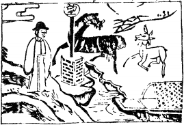

# 09風天小畜

  
此卦韓信擊取散關不破，卜得之後，再撃之果破也。

圖中：

**兩重山，一人在山頂，舟横岸上，望竿在草中，羊馬過河。**

**匣藏寶劍之課 密雲不雨之象**

==比乃親和，親和之後必有所畜，因物`相比親則附於一處`，為畜，此畜者，聚之來源也。同相親和之人，其志必同畜。畜亦止也，止然後有聚。此體本乾為天，乃在上之體，今居風之下， 示意吾人如要聚止剛健之人，唯有巽順為大，故世間再剛健之事與人，必為巽順所止也。本卦一陰居第四位，為五陽所包，此得位乃因柔巽之道也。卦象『外柔內剛』，乃能以小畜大。==

# 卦圖象解

一、兩重山：知有險阻於前，不妄動之象。亦為出字象。  

二、一人山頂：孤立獨行象。已至顛峰，將走下坡之意。  

三、舟横岸上：準備出發，水未至而不行也。

四、望竿在草裡：等待訊息象。草頭姓人為貴人。望，亡也。

五、上有羊馬：馬引羊過河，馬為貴人，肖馬人，姓馬人也，馬亦為午時。

**全卦：一人在頂顛，但有疑，前有二山所阻，只有等待消息，午年或午月、午日、午時或馬人引羊至，不由水路而來也。**

# 人間道

**小畜，亨。密雲不雨，自我西郊。**

==此言雲之畜聚雖密，卻不能成雨，猶人雖聚，卻不能和之義。==

## 彖曰：小畜，柔得位而上下應之，曰小畜。

小畜之卦，因第四爻陰，居近君主之位，以巽之柔順本性，使上下之陽剛相互溝通，但只能維繫，卻不能強固，故曰小畜。

## 健而巽，剛中而志行，乃亨。

以卦象而言，內剛健而外能柔順，雖為小畜，但能亨也。

## 密雲不雨，尚往也。自我西郊，施未行也。

此言密雲不能成雨，猶小畜無法成大也，其因下陽往上，上陽往下，二氣不和。

## 象曰：風行天上，小畜，君子以懿文德。

以乾之剛健，風仍能在上而行，故剛健之性，唯柔順能畜止之，君子以小則文章才藝，大則道德經綸之聖才，以此二道為所畜之才義。

## 初九：復自道，何其咎，吉。

初入之地為初爻，以其剛健之性，又得上位之同性，進必上，何來災也。故初之陽剛， 乃因上位之陽剛性同，故無災也。

## 象曰：復自道，其義吉也。

初爻與第四爻本為對應之位，故在畜時， 陰在四，陽在初，陰陽相應，故吉。

## 九二：牽復，吉。

九二居將位，因與第五爻陽爻相對應，同為剛健，雖中有四爻，但因同為陽剛，自古『同患相憂』〔同慾相憎〕，吉之道，此時為將時。

## 象曰：牽復在中，亦不自失也。

初爻為陽剛，復二爻亦陽剛，其勢乃強， 但因此時乃居中位，將位，故即強亦不會過剛， 過剛乃失，此天道。故吾人須知居中而陽剛之美，因理正，故能強剛，君子持之以理，雖剛亦不為過矣。

## 九三：輿説輻，夫妻反目。(説即脱)

九三為下卦之上爻，最親密於四爻陰位， 故乃陰陽之情相處也。猶如夫妻。陰本受制於陽，今居四位居陽之上，即反制陽，如夫妻之反目，故如車輿脱去輪軸，不能行也。妻為夫所惑，反制於夫，乃因夫不正道。未有夫不失道，而妻能制之也。

## 象曰：夫妻反目，不能正室也。

因陽剛位之夫，過剛而失自處之道，不能顧家室，以致夫妻反目。故為夫之道，須正室其家，方為正道。

## 六四：有孚，血去惕出，无咎。

六四乃處近君之位，其能畜君，使五位君之威嚴能因之而止其欲，皆因六四有孚信\(孚， 乃內有誠信也〕而受其感也。

## 象曰：有孚惕出，上合志也。

因四位有誠信且外柔，使五之君位信任之，乃合同志。五因四位之人能與之合，眾陽從之，故惕出則血去，不見兵禍矣。

## 九五：有孚攣如，富以其鄰。

小畜之時，乃眾陽皆為其中一陰所畜之時。猶如一國之君，與臣下皆剛而不容（密雲不雨〕，但近君側之人，適得柔順之人，而此人為上下溝通之管道，此時乃即小畜之時也。九五為君位，如以中正居至尊之位，又內有誠信，則所有皆附應之。就好像富人出其財力與鄰共享之也。從此爻則知當君子為小人所困， 正人為艰邪所逼，此時如無上下正陽之互援， 則獨力難助於此時，須有互助方可去小人也。

## 象曰：有孚攣如，不獨富也。

是故君子處之艱危，唯其至誠，能得眾力之助，則平安矣。（攣如即牽連使相從之。）

## 上九：既雨既處，尚德載，婦貞厲。月幾望，君子征凶。

上九為此卦之終極，乃處畜之終。和而能止乃畜之道，陰柔之能畜剛，由累積而成，非朝夕可得，此戒之在平時，如專任以柔制剛， 不知止，如婦之堅守此道則乃凶矣，天下無婦制其夫，臣制其君，尚能安穩者乎？月滿之時為月望，與日相敵狀。若君子待婦將成敵時，

動之必凶，不須戒也，故须戒之於月未滿時。

## 象曰：既雨既處，德積載也；君子征凶，有所疑也。

此小畜之道積滿而成，其象為陰將盛樣， 君子動則有凶也。小人抗君子，必有害於君子， 制陰極盛之道，則為君子有疑而知警惕，不妄動，求其所以制君子之因，則不至凶也。

