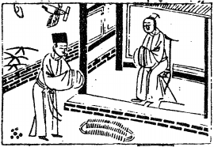

# 17澤雷隨

  
此卦孫臏破秦，卜得之，便知必勝也。

圖中：

**雲中雁傳書，一堆錢，朱門內有人坐， 一人在門外立，地上一堆珠。**

**良士琢玉之課 如水推車之象**

==豫悦之道，人必皆隨之，故豫之後有隨。震為雷，兌為澤，雷震於澤中，澤隨雷而動，此隨之義。以陽而下陰，陰乃隨陽，此陰陽不易之理。『外悦內動象』『下動上悦象』。==

# 卦圖象解

一、雲中雁傳書：飛來喜訊象。  

二、一堆錢：財聚也。

三、朱門內有人坐：君王之象，必見君面也。

四、一人在鬥外立地：乃士人求仕，受尊重之象。  

五、串錢在地：有用利不行之象。

六、亂珠聚盆：先聚後散之象。

**全卦：禮儀得體，有見速喜之象。**

# 人間道

隨：元，亨，利，貞，无咎。

==隨之道，可以致大亨通。君子之道，眾人所隨，又遇事擇所隨，隨能得道，必致大亨。今==

==人君之從民意，臣下之從君意，人人隨從義，利在堅守隨義，隨因能正，其道必亨。小人群聚， 此隨失正，豈不招凶乎。==

## 彖曰：隨，剛來而下柔，動而説，隨。大亨，貞，无咎，而天下隨時。

雷為剛今居柔下，是以尊貴而對下隨，為隨之義。臣君關係，以上悦下動，以動可悦，為隨之道，如是則亨通而無災。

## 隨時之義大矣哉。

君子之道，隨時而變，因時制宜。今世昏蒙不明，凡事皆表明裡暗，是故民之所隨，未能適中，常受謡言、外飾所惑，隨而必枉，受奸人利用。

## 象曰：澤中有雷，隨，君子以嚮晦入宴息。

澤隨雷震而動，君子晝則自強不息，夜則入居內安其身，起居作息隨天時，乃宜也。禮云： 君子晝不居內，夜不居外，此隨時之道。

## 初九：官有渝，貞吉，出門交有功。

官為守也，因所從隨為正，故吉。出門交往多所親愛者，因人心所從隨也。常人之情， 愛之所見皆對，惡之所見皆非，小人皆以私情而隨從之，不合正理，君子出鬥交不以私，故所隨皆有功也。

## 象曰：官有渝，從正吉也。出門交有功，不失也。

所隨從之道，須從正則吉。隨從不正，招悔咎也。因交非因本身之私，其交必正，故不失。

## 六二：係小子，失丈夫。

六二為陰柔位，陰乃順從，柔順之意，但如順隨的對象為小人，則必失卻君子之人，此因不能固守，聖人戒之。

## 象曰：係小子，弗兼與也。

人因所順隨為正道，邪惡必遠也，但須戒， 人若從於正，須專一，不可兼與。

## 六三：係丈夫，失小子，隨有求得， 利居貞。

六三居相位，所固守本身之正，求上之隨， 有求必得，乃上上隨也。如背是求非，舍君子從小人，為下下之隨也。故君子之隨，首先固守本身之正。

## 象曰：係丈夫，志舍下也。

隨之至善即在此，舍小人而從君子，人人如此，小人無所遁也，常自省而人之性乃從善如流，故將無小人矣。

## 九四：隨有獲，貞凶，有孚在道以明，何咎？

因四位乃臣之極位，如隨而有獲，即正亦易招凶，皆因天下之心隨於己。為臣之道，應使恩威出於上，眾心能隨於君，如讓人心從己， 致凶之道。故君子居此，唯誠正於心，所動皆合於道，則可無悔。小人位極，用君王權，遂行其志，得民心又不歸功於上，位極而逼上， 勢強而專權，隨之過大矣。君子雖功大震主， 但由於其正而心誠，故主隨從而信之，何有災？

## 象曰：隨有獲，其義凶也，有孚在道，明功也。

近君之位，因追隨而有得，雖有凶戒，但有中正之誠，則無災，明哲保身也。

## 九五：孚於嘉，吉。

此君位之人，得中正而固守，動隨於善， 大吉也。故此，從人君到平民，隨道之吉，唯隨善耳。

## 象曰：孚于嘉，吉，位正中也。

處中正之位，又中誠所隨，必吉矣。

## 上六：拘係之，乃從維之，王用亨于西山。

此柔順而居隨之極也，柔順之隨至極雖有過之失，但如人心皆隨，因有得民之隨，仍有王道王業之成也，故能得民心者，得天下也。

## 象曰：拘係之，上窮也。

隨之道至此，乃窮盡也。

