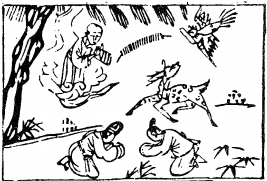

# 18山風蠱

  
此卦伯樂療馬，卜得知馬難治，見三蠱同器皿也。

圖中：

**孩兒在雲中，雁啣書，一鹿、一錢，男女相拜。**

**三蠱食血之課 以惡害義之象**

==因喜而隨人者，必有事，無事何喜何隨？故蠱以次隨也。山下有風，風在山下，遇山而回，使物亂，是為蠱象，蠱者，壞亂也。長女下於少男，長幼無序也，其亂可知。此卦象言成蠱之因，卦才專言，治蠱之道。==

# 卦圖象解

一、孩兒在雲中：有天官促成也。不求名利之人。  

二、雁啣書：有消息至。

三、一鹿：有大利也。

四、錢在空中：此心中圖利之象也。

五、男女相拜：男女相合，此為利而結合，非正婚也。

# 人間道

 **蠱：元亨，利涉大川。**

==蠱之大者，乃時之艱難險阻，能有治蠱之才，則必亨通。==

## 先甲三日，後甲三日。

甲為十干之首，意言事之始也。先甲三日，乃言治蠱之道，應先思其事之原，再思其事之後，乃知救弊之道。亦強調慮之深，推之遠也。能善於救者，則前之弊可革，能善親備者，則後利長久。此聖人之治蠱道。今人不明聖人先甲後甲之誡，慮淺而事近，故勞於救亂，亂不革， 功未及成，弊已生矣。

## 彖曰：蠱，剛上而柔下，巽而止，蠱。

以卦而言，男雖少但居上，女雖長而在下，尊卑得正，上下顺理，治蠱之道也，故以巽順之道治蠱，是以元亨。

## 蠱，元亨，而天下治也。利涉大川，往有事也。

自古治亂者，能使尊卑上下之義正，在下為巽順，在上有才能安定萬事，如此則天下大治。如正遇天下壞亂之時，持治蠱之道而往濟之，利也。

## 先甲三日。後甲三日，終則有始，天行也。

有始必有終，終之後必有始，此天道也。聖人體始終之道，故能於事之始而探究其所以然， 能於事之終而備其將然，此先甲後甲之慮，故能治蠱而天下亨。

## 象曰：山下有風，蠱，君子以振民育德。

山下有風，風遇山而回，致物皆散亂，故為有事之象。君子觀有事之象，在己則養德，在天下則濟民，君子所事此二者為最大。
## 初六：幹父之盎，有子，考无咎， 厲終吉。

庶民之道，即子幹父蠱之道。子能居其位而知正，則無災，不然，則為父之累，故必惕厲為戒，終吉。初六為最下之道，故言子與父之關係。

## 象曰：幹父之蠱，意承考也。

子幹父蠱之道，意在能承擔父事，常懷惕厲，只敬其事，盡誠於父，則終吉。
## 九二：幹母之蠱，不可貞。

婦人本陰柔，若子只顧強伸己陽剛之道， 反逆之，則傷恩，所害大也，唯有屈下己意柔順將成，使之身正而事乃治，故曰不可貞。如同陽剛之道輔柔弱之君，須盡誠竭忠致使其於中道即可，不會有大做為的。

## 象曰：幹母之蠱，得中道也。

居臣位，不過剛，乃得幹母蠱之道完整者。
## 九三：幹父之蠱，小有悔，无大咎。

九三乃以陽剛之才居相位，克盡所事，雖以剛過而小有悔，但終無大災，但如以事親之道，則並非善事親之人也。

## 象曰：幹父之蠱，終无咎也。

此因剛而明斷之才，雖剛因不失正，故終無災。
## 六四：裕父之蠱，往見吝。

此柔順之才而以正道處事，只能自守其道而已，若遇非正之事，因柔順之本質，而無法矯正，故不能而招罷斥。

## 象曰：裕父之蠱，往未得也。

柔順之才，守於寛裕之時可以，如要前行， 則不可得也，再加其任務，必不能勝任之。聖人知柔順之才可以守成，但不可用於發展，委之重任，必不成也。
## 六五：幹父之蠱，用譽。

此君位之人但質柔，但下應九二陽剛之位，意其能用陽剛之才為臣，但因本實陰柔， 故可為承其舊業，而不能為開創事業之才。自古創業之事，非剛明之才不足以成事。不能用剛賢之人，只可以守舊袓業而已。

## 象曰：幹父用譽，承以德也。

陰柔之君主，能承下陽剛之才，以在下位之賢而能用之，乃因此而聲譽顯。
## 上九：不事王侯，高尚其事。

上九乃居蠱之終，乃無事之地，處事之外。此應賢人君子不遇於時，應高潔自守，不可曲道以遁時，此進退合於道者也。

## 象曰：不事王侯，志可則也。

不臣事於王侯，因知無法施其志，此乃賢能之人，此可以為法則也。小人皆可曲道而順行，背己逆天，只圖權力名位，此不可法也。

