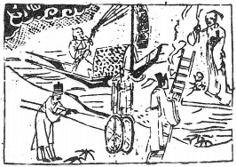

# 22山火賁

  
此卦管鮑卜得之，果獲全，彼此相遜，終顯名義也。

圖中：

**雨下，車行路，舟張帆江中，官人著公服登梯，仙女雲中執珪。**

**猛虎靠岩之課 光明通泰之象**

==物之合後則必立文，文乃飾之意。賁者，飾也，故為之序。人因合聚則有威儀上下，物之合聚則必有次序行列。此卦山下有火，草木百物聚於山處，下有火，則能照見草木百物，且增益其光彩，有賁飾之象。==

# 卦圖象解

一、雨下：滿也，潤澤也，成也。

二、車行路：前往任官象，行走四方也。  

三、舟張帆在江中：此行順風大利也。

四、官人著公服登梯：升遷在外地象。任公職主官外調象。丈夫從公職升官也。  

五、仙女雲中執珪：受陰人提攜象。

# 人間道

## 賁：亨，小利有攸往。

==物有外飾而後有立，但须有內實而加外飾，則可以亨。因文飾之道可以增加光彩，故必利於小進。==

## 彖曰：賁亨，柔來而文剛，故亨。分剛上而文柔，故小利有攸往，天文也；文明以止，人文也。

賁之道能亨，實由飾而來，飾之道，須來往以柔，求文飾以剛，名須正，故利小吉。賁飾之道，並非能增其內實，只外加文彩而已。今人但求外飾，不求內實，富侈表面，內無實才， 比比皆是，上位者所用皆富有之人，此敗亡之初始象也。

## 觀乎天文以察時變，觀乎人文以化成天下。

天文，為日月星辰之錯列，四時寒暑之變化。人文為人理之倫序，觀人文以教化天下，此聖人用賁之道也。

## 象曰：山下有火，賁。君子以明庶政，无敢折獄。

山下有火，草木為其明照而有光彩，此賁飾也。聖人觀此明照之象，以修明庶政，成文明之治，無敢於用文飾，掩飾實情，枉法不顧，故君子以用明為戒。

## 初九：賁其趾，舍車而徒。

初九乃君子有剛明之德，居於下也。因其無位，無法施濟天下，唯求賁飾自己而已。君子修飾之道，在正其所行，守節處義，凡不正則寧不與同行。

## 象曰：舍車而徒，義弗乘也。

於義不可同行，寧舍車而步行。

## 六二：賁其須。

外飾於物，無法改變其本質，須因其本質如何加飾，乃賁之道。

## 象曰：賁其須，與上興也。

須賁之道，須與上隨，隨上而動，動靜歸依於所主。

## 九三：賁如濡如，永貞，吉。

賁之盛，須戒永正，則吉，因永正之心及行，很難維持。

## 象曰：永貞之吉，終莫之陵也。

如飾之變化多且非正，人所陵侮也，故戒之永正則吉。

## 六四：賁如皤如，白馬翰如，匪寇婚媾。

賁外飾為白色，白馬亦為白色，但志不同， 由外飾同，而終有婚遂相應也。今人之求門當户對也。

## 象曰：六四當位，疑也；匪寇婚媾， 終无尤也。

四與一為應爻，六四當位時，中離間隔二三位，故疑也，但因一與四為正應，理直義勝， 終必無災也。

## 六五：賁于丘園，束帛戔戔，吝， 終吉。

此雖君位，但本質陰柔，不足自守，但求外賁於設險守國，田園近城，山丘在外，據險而守，即令陰柔之質，受人裁制其外，雖君子吝之，但終平安。

## 象曰：六五之吉，有喜也。

君能從人以成賁之功，此吉有喜也。

## 上九：白賁，无咎。

賁飾之極，則失於外偽，唯能質白於賁， 則無過飾之災。故尚質素，不失其本真，千萬不可外飾過於華美而失其本質，此戒賁也。

## 象曰：白賁无咎，上得志也。

處賁之極，則有過華偽失實之慮，故戒之， 以質素則可無災，飾不可過也。

