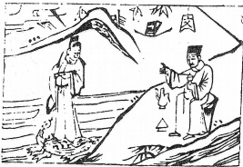

# 33天山遯

  
此孟嘗君進白狐裘，夜渡函谷關，卜得知， 果脱身也。

圖中：

**一山，一水，酒旗上文字，官人踏龜，月半雲中，幞頭上樹，樹下人獨酌。**

**豹隱南山之課 守道去惡之象**

==恆者，久也，久不動則有去意，遯乃退也，故遯所以繼恆也，此卦天下有山，天陽向上， 物雖上陵但止而不進，以陰陽之道論，二陰居下有上進之勢，陽將消退，故此時乃論小人渐盛， 君子退避之時，此遯之義也。==

# 卦圖象解

一、一山：阻也。  

二、一水：險也。

三、酒旗上文字：酒為忘憂之物，文在旗上，受人提攜也。  

四、官人踏龜：歸，鬼也；玄武自來，水上求財。

五、幞頭上樹：求去辭官也。

六、月在雲中：主半清半濁象，事未明晰。  

七、人在水邊：等待平安狀，蒞臨也。

八、樹下人獨酌：休也，無事也，萌生退意狀。

# 人間道

 **遞：亨，小利貞。**

==遯，乃君子潛藏之時，君子退而伸其道，人退道不屈，則可亨，雖無大力，但仍有小吉，因知時避退，此善之道也。==

## 彖曰：**遯**亨，**遯**而亨也。剛當位而應，與時行也。

君子處遯之道，知退生吉，退所以為伸道。故雖退之時，君子處之，未必真遯，當隨時消息，有可以致力，當不避之，以扶持其道，並非於遯時，藏而不為也。

## 小利貞，浸而長也，**遯**之時義大矣哉！

小人之道長時，不可求大功，但利於小功，君子之人能察於其微，始即深以戒之，退而伸道，不使道消，此處遯之時意義之大處也。

## 象曰：天下有山，**遯**；君子以遠小人，不惡而嚴。

山在天下，由下起而上止，天上進分之相違，此遯之象，因違和而須遯。君子遠小人之道， 若以惡聲厲色，只增其怨忿而已，唯用莊嚴威色，使其敬畏，小人自然遠矣。
## 初六：**遯**尾，厲，勿用有攸往。

因遯本即退去，故初爻為往退之初，反為其尾，此時以柔處遯，不可往，往則有災。

## 象曰：**遯**尾之厲，不往何災也。

退處之時，居於尾者，此危也，唯晦藏於下或末端，可得吉，因往有晦不若不往，故晦藏可免災也。
## 六二：執之用黃牛之革，莫之勝説。

二與五位相應，居正而相親合，其交之堅， 若牛革之繋，不可言語。

## 象曰：執用黃牛，固志也。

二與五位用中正之道相結，且堅心其志， 猶牛革之堅也。

可無咎，古之前例多矣。
## 九三：係**遯**，有疾厲，畜臣妾，吉。

遯退之道，其貴在速及遠，如有事累，則不速，於遯時則有危也。此爻即言，人之親， 若以女子小人而言，其皆懷恩而不知義，親愛之則忠，犯錯而嚴厲時，則生暗害，此小人之道。然君子之道非如是，待之以正，即令有拖累亦不有災，如君王有危而不棄黎民，雖危亦

## 象曰：係**遯**之厲，有疾憊也，畜臣妾吉，不可大事也。

係遯之道，於養臣妾親暱人時可吉，但不可以擔當大事，待人取中正之道，不以私心而生偏，取諸於公，則可行大事矣。
## 九四：好**遯**，君子吉，小人否。

君子之人亦有所好，處退之時，必去而不疑，以道來制欲，故為吉，而小人反之，其不能以義處之，唯私慾之所好，即令身陷亦不能自制，故於小人則否。故君子必易出難進，小人則易進難出。

## 象曰：君子好**遯**，小人否也。

君子知時而退不疑，小人則無法克制私慾，以至於凶也。
## 九五：嘉**遯**，貞吉。

君王處得中道，動靜間必以時，故嘉美， 終吉。今人卻動靜皆以私慾，表裡不一，不以中正之道處，知進不知退，此凶也。

## 象曰：嘉**遯**貞吉，以正志也。

內心正則動必正，此退之美也，今人不以退為美，只動之以欲，因志不正也。
## 上九：肥**遯**，无不利。

此退之極致，退求遠且無累於他人，此退之有餘，無往不利矣。今人即令退，亦追求有所牽累他人，其動不正，唯自苦而已，小人自招之累也。

## 象曰：肥**遯**无不利，无所疑也。

退之求其遠，且無所拖累，此退之道至極， 必無不利。且剛決而不疑，君子之遯道，雖退， 因得道，卻能無往不利。

