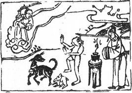

# 34雷天大壯

  
此卦唐玄宗避安祿山亂，卜得之，乃知不久亨通也。

圖中：

**北斗星，天神執劍，一官人燒香拜， 一猴，一兔，一犬。**

**羝羊觸藩之課 先曲後順之象**

==君子之退而伸道，多數君子之退且聚合，而成大壯之勢，壯有進且盛義，陽剛而震動此以剛而動，乃大壯之象，猶雷威震在天上也。==

# 卦圖象解

一、北斗星：帝君，老闆，主事之人。  

二、天神執劍：民意歸向，人心也。

三、一官人燒香拜：拜求於天，而不求人，凶。

四、一猴、一兔、一犬：侯，劉，狄姓，在野之人。  

五、猴回頭：回吼。

六、兔回頭：回吐。  

七、羊回頭：回陽。

==此卦示意過剛必招凶，而猴、羊、兔為三貴人，和中近易為處之道。==

# 人間道

**大壯：利，貞。**

大壯之道利在正，理正而勢正，如不得正而壯，只強猛無理而已，非君子之壯。

## 彖曰：大壯，大者壯也，剛以動，故壯。

大且壯為大壯，乾之至剛而動，外動內剛狀，名壯。

## 大壯利貞，大者正也。正大而天地之情可見矣。

天地之道可運行而長久，乃至大至正始然也，此道之至大能如是。

## 象曰：雷在天上，大壯，君子以非禮弗履。

君子觀雷震威在天，此之壯大，而行大壯之道，知唯克己復禮最大。能自勝之人為天地之最壯者，能赴湯蹈火，此唯武夫之勇也。君子能和而不流，大立而不倚。

## 初九：壯於趾，征凶，有孚。

初爻在下，而陽剛居之，乃初進而用壯， 必凶，吾人居上用壯，猶須正方可行，初進而剛壯，必招凶辱。

## 象曰：壯於趾，其孚窮也。

在下位而用壯，即令行可信，亦必招窮困阻滯也。

## 九二：貞吉。

二位屬陰位，陽剛居之，乃示人剛柔得中也，人能識得時義之輕重，則必吉。

## 象曰：不能退，不能遂，不詳也。

象曰：九二貞吉，以中也。

能得中正，而堅持守之，也吉乎，此意中而不失正。今人中立而為己，已失正道，猶牆頭之草，可嘆也。

## 九三：小人用壯，君子用罔。貞厲， 羝羊觸藩，羸其角。

小人尚力，只用其壯勇，而君子用罔，因其志剛，無視於非正之事，無所忌憚也。萬物莫不用其壯，猶羊之壯於首角，一遇藩籬，亦受困也，故用壯，不可強力進，須持之正道， 無忌憚於邪吝，方為真罔。

## 象曰：小人用壯，君子罔也。

小人用其強壯之武力，終困，君子志氣剛強，無視邪惡，無所忌憚。

## 九四：貞吉，悔亡，藩決不羸，壯于大輿之複。

時方道之長盛時，如有小失，則必害進之勢，猶大車其輪軸必壯，乃利於行，如輪軸不強，以致大車之不行也，有如藩籬之決開而不復其困也。

## 象曰：藩決不羸，尚往也。

四位未至極，以當盛之陽，又用壯以進， 無能阻之，即令藩籬隔而不困其力也。

## 六五：喪羊于易，无悔。

羊性喜群行又互觸其角，猶諸陽並行，如以力制，則必難勝有悔，唯其平和得之，則無所用其剛，使其壯失於和易之道，可以無悔。

## 象曰：喪羊于易，位不當也。

柔居尊位，位不當也，猶人君之勢不足， 下又壯進，才有所謂『治壯之道』，治壯之道不可用剛，須以平易近人待之，可化壯也。

## 上六：羝羊觸藩，不能退，不能遂， 无攸利，艱則吉。

陰柔又處壯極，猶羊角之觸藩，進退不得， 必無所往也，陰柔處壯時，一遇艱困，必不能守，往即凶也。吾人須居艱困時而處柔，必吉。此壯之極，須變義也。

## 艱則吉，咎不長也。

此因自處不詳不慎，以致進退不能也。以柔處艱時，即有咎，亦不長久。

