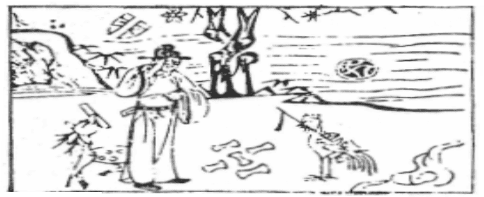

# 35火地晉

  
此卦昔司馬進策，卜得之，後果為丞相。

圖中：

**文字破，官人掩面，毬在泥上，雞啣秤， 枯木生花，鹿啣書，一堆金寶。**

**龍劍入匣之課 以臣遇君之象**

==繼壯盛之後，則必進，晉，進也，明出於地，升而明，故晉，此論進之道，離，中虛為明， 乃明出於地上也。==

# 卦圖象解

一、文字破：官事不成，退位象。  

二、官人掩面：無顏見人，悲象。三、毬在泥上：所求必陷險也。

四、雞啣秤：雞，酉也，肖雞人也，落日之象。秤：示公平，稱心也。  

五、枯木生花：晚發也。

六、鹿啣書：祿與命到也。

七、一堆金寶：財祿豐收之象，占疾厄，則有焚金紙之象。主喪服，二人去一也。  

八、人立水邊：恐泣之象，主喪服。

九、三點在石上：心象，示人心在石上，不動念，堅心也。

# 人間道

 **晉：康侯用錫馬蕃庶，晝日三接。**

==有能治安之諸侯，名康侯，其因能明，下體順附，承王之象，則見眾多之馬駕，有重賜， 乃寵遇之至也，此上明下順，乃進盛之時。==

## 彖曰：晉，進也。明出地上，順而麗乎大明，柔進而上行，是以康侯用錫馬蕃庶，晝日三接也。

晉乃明進而盛，此外明內順，故能包明至大明，如順德之良臣，附麗於明主也。柔居君位， 能明而順，上附於君，下順於民，故為康侯，此為諸侯之道也。

## 象曰：明出地上，晉，君子以自昭明德。

君子觀明出地上，近明為晉，故知惟昭明德於已，求己之明且有德，為晉之道。
## 初六：晉如摧如，貞吉，罔孚，裕无咎。

初爻乃晉之始時，始進而求快升，必不遂其意，因上位未能遽信，必當自守安位，寬裕不求，以待上位之信方可。小人始進而求上信， 則必傷於義，皆招咎悔。此君子方知進退之道。

## 象曰：晉如摧如，獨行正也。裕无咎，未受命也。

進退之間，惟君子能獨行正道，唯義之所趨，方可出仕，未受命時，皆寬裕無求。若能信於上，忠職守，卻反失去職務，則君子一日不居，必退而遠之。
## 六二：晉如愁如，貞吉。受茲介福， 于其王母。

進退之間守正道，當吉，二爻之位雖無援， 因能守正，日久彰顯，自得上六五君位之人相應，上位自當求之，因德同也。

## 象曰：受茲介福，以中正也。

雖居下位之人，能永持中正之道，久必有亨。更加有明君在上，雖位遠，但必因同德受福。
## 六三：**眾**允，悔亡。

柔居剛位，又不中正，此乃居不適位時， 必有悔咎，惟居此時，能明謀從眾，順應天心， 吉。

## 象曰：**眾**允之志，上行也。

能順從眾志，居下位之上，又上從明君， 合於眾志。
## 九四：晉如**鼫**鼠，貞厲。

陽剛居陰位，非適其位而居之，乃貪據其位，貪而畏人者，範鼠也，近君之位又不適， 下位又求上進，居此時生畏忌之心，必生危矣。

## 象曰：**鼫**鼠貞厲，位不當也。

不正又居高位，時懷貪而懼失之心，堅守此不放，招危險也。
## 六五：悔亡，失得勿恤，往吉，无不利。

柔居尊位，乃不正位，本凶。但用大明之德而上下皆附順，故反吉。因下之順附，必能盡誠委任眾人之才，以濟天下。明君不患其不能明照，患其用明之過於察察，有失委任之道， 自任其明而以私意偏任，天下必無法為公。

## 象曰：失得勿恤，往有慶也。

有明明之君，下又上附順，能推誠委任， 必能成天下之大功，往必有福也。
## 上九：晉其角，維用伐邑，厲吉， 无咎，貞咎。

陽剛又居最上，如角之象，此言進之極， 過剛則易失於躁急，本剛又急於求進，必有失也。此惟有用於治內\(伐邑〕可以無患。但如用其治外，反凶。觀人之自治，能剛之人守道必固，求進燥急之人必遷善益速，唯須合中正之道，可無咎。

## 象曰：維用伐邑，道未光也。

盡善之道，能安內攘外，今維用伐邑，能治內不能治外，其道未光大也。

