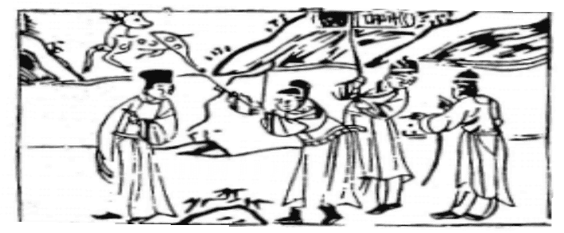

# 44天風姤

  
此卦漢呂后擬立呂氏謀漢社稷，卜得之果不利也。

圖中：

**官人射鹿，文書有喜字，二人執索， 綠衣人指路。**

**風雲相濟之課 或聚或散之象**

==夬，決也，潰決之後，必有遇，姤，遇也，故次夬卦。此卦，乾上巽下，即風行天下，風行時必觸及萬物，故為遇之象。==

# 卦圖象解

一、官人射鹿：丈夫也，取祿狀，野外之財，射，發也。  

二、文書上有喜字：摇摇欲墜，根只一線，夫妻凶。

三、二人執索：互相牽累。

四、綠衣人指路：掌生死簿之人，信差（今日）。  

五、二重山：重阻也。出也。

# 人間道

 **姤：女壯，勿用取女。**

==姤之道在戒陰壯之始，娶女本欲其柔且順從，但初進為陰，而渐進長盛，且有壯於陽者， 古来女壯必失男女之道，家道必敗。戒之在初始。==

## 彖曰：姤，遇也，柔遇剛也。勿用取女，不可與長也。

姤，乃柔之遇剛，小人之道始遇君子之陽剛，須戒之在始，勿取如是之女，不可使小人之道長。

## 天地相遇，品物咸章也。剛遇中正，天下大行也。**姤**之時義大矣哉。

萬物之生始於天陽地陰之交遇，不遇則不生。但须剛遇中正之道，猶人君之遇賢臣，剛與中正合德，其道必及於天下，姤之道即在遇之始，遇之正則吉，遇之不正須始戒。

## 象曰：天下有風，**姤**，后以施命誥四方。

君之道，能如風之及於萬物，方可施政令而及於四方，故遇之道能行，天下必因中正之遇， 上下配合，而政令能如風之遍及萬物。
## 初六：繫于金柅，貞吉，有攸往， 見凶，羸豕孚**蹢**躅。

柅，止車之物，金，堅固意，因姤乃陰始於初而將長盛之卦，小人之道，於始初即應如止車之柅，且繫之，使不進也。此吉。如令其渐盛，不知始戒，有凶，猶羸弱之豕其雖不強， 然為陰物，故知其能跳躍之時，必消之，故小人之道於始即消除，則必不能成大，而無有作為矣。

## 象曰：繫于金**柅**，柔道牽也。

陰柔小人之道，始進則如車之受金柅而止，不使其進，正道必存，吉也。

柔之人志易變，必不能專。
## 九二：包有魚，无咎，不利賓。

姤相遇之道在於專一，陽剛將位之人與五君位應，其志必專一，遇則無災，如又遇於旁人，變其志，則有悔，其不利在不能專一。陰

## 象曰：包有魚，義不及賓也。

二位乃初遇志同之時，因不事二主，當如苞苴之魚，只能及於主人，無法及於客賓一樣。動，可無咎也。
## 九三：臀无膚，其行次且，厲，无大咎。

時義乃謂初進之人與上位相遇而恰合，此時居上位之人同志於初始進之人，如為求其助，而親密於下，此凶，乃行且困難，必令居不安也，如臀之無膚狀，居此時如懷危懼不妄

## 象曰：其行次且，行未牽也。

相位之人求姤遇於初進之人，中有將位阻隔，故行次且困頓，知危立改，必可未至大殃也。
## 九四：包无魚，起凶。

君側之人始遇初進同志之相應，但因其已先遇九二位之人，此遇已失，此意味臣位之人不中正，必失其民，故凶。故遇之道，必下不離散，今如下位之人散，上必失道也。

## 象曰：无魚之凶，遠民也。

下民遠離，乃起因於已之不中正，或已中正，而下民不相應也。
## 九五：以杞包瓜，含章，有損自天。

九五乃至尊之位，上位下求賢才，瓜乃美實但居於下，今上位之人能屈而求下，此乃包含之美德，人君能如此，則必有遇所求之人才， 故能屈尊求下內心至誠，如有隕石自天而下， 此遇之善道也。

## 象曰：九五含章，中正也。有隕自天，志不合，命也。

九五至尊，能含有中正之德，求賢而屈下， 此存志乃合於天理，必如隕石般，天助而得良才，遇之大道。
## 上九：**姤**其角，吝，无咎。

至剛而居上，莫過於角，人之遇，必由降屈相求，巽順相應，此合之由來，如居高而剛極，持才自傲，人何將與之，此人之遠離，乃肇因於己之過亢，非他人之罪也。

## 象曰：**姤**其角，上窮吝也。

遇之如角之亢極，以剛而遇，必致窮極末路，人必散之。

