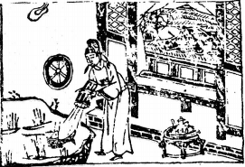

# 47澤水困

  
此卦李德裕罷相時，卜得之，乃知身命無氣也。

圖中：

**一輪獨在地上，一人臥病，葯爐， 貴人倾水救旱池魚，池中青草。**

**河中無水之課 守己待時之象**

==升至極，不知進退，私欲使然，終必至困，故困次升也。此卦「兌」上「坎」下，水在澤上乃有水也，今水在澤下乃枯涸無水之象，此示人之困乏象，本卦論人紀中，君子受小人掩蔽， 居窮困之時也。==

# 卦圖象解

一、一輪獨在地下：獨行也無依也，方向不明也。  

二、一人臥病，招危難也。

三、藥爐：有人來救，待時緩進也。

四、貴人傾水救旱池魚：旱池，無財也，有貴人資援。  

五、池中青草：仍有生氣狀。

# 人間道

 **困：亨，貞，大人士口，无咎，有言口不信。**

困之時，如何用困之道，乃易之精神，大人居困時，以`樂天安命，隨時善處`，自得其樂，必吉。有愚頑之人，`居困而力求言，人必不信`也。

## 彖曰：困，剛揜也。險以説，困而不失其所亨，其唯君子乎？

困之生乃因剛為柔所掩蔽，專言君子之道為小人所掩蔽，而困窮之時君子知困之道，外悦內險，處困而能以悦之度量居之，不失正道，則其道必自然亨通，能如此之人，必為君子貞， 大人吉，以剛中也。有言不信，尚口乃窮也。

處困時，君子能吉，乃因堅守剛中之道，不變節。於困之時，所言人必不信，如反求己之口才以脱困，必更致困，此即為尚口之戒。

## 象曰：澤无水，困。君子以致命遂志。

澤中無水，困之象。居此時君子以力盡防患之法，如仍難免，則歸之於命，泰然處之，絶不因困窮而變其志節。小人遇困，志節必變，但求附於他人，以求脱困，其終必凶。
## 初六：臀困于株木，入于幽谷，三歲不覿。

陰柔之人位居卑下，又無上位救助，猶如無葉之木，無法蔭庇下物，因無庇蔭，故不能安居於此，如進入幽暗之谷，無法自出，有三年的時間無法入亨。

## 象曰：入于幽谷，幽不明也。

自陷於深谷，乃出自己之不明也。

其招凶皆自取也。
## 九二：困于酒食，朱紱方來，利用享祀：征凶，无咎。

常人無不為酒食所困，不知酒食之施，乃生於人有所欲，常言：宴無好宴。君子之飲與小人不同，能困君子的，必是其剛正之道不足以濟天下之困，此其困擾也。居此時君子必求至誠以守，等待時機，可利用祭祀以示至誠， 俟貴人至，求之方吉。若不安居困，自往求之，

## 象曰：困于酒食，中有慶也。

居困時，雖未能施惠於人，如能守其剛中之德，必能亨。而有吉慶也。
## 六三：困于石，據于蒺藜，入于其宮，不見其妻，凶。

處困可羞之時，卻用外剛來飾內險，益增自困，必堅重如石，而不安之情如手握蒺藜之物，因刺多而不能握，進退不得狀，必失所居， 凶。

## 象曰：據于蒺藜，乘剛也。入于其宮，不見其妻，不祥也。

此言內之不安，欲求外剛來飾，乃用剛之不正，必終失所安，果必不祥也
## 九四：來徐徐，困于金車，吝，有終。

居君側之人，不以中正之道處困時，而才能又不足濟困，其來動必遲遲，困於金車之內， 必不見容於世，可羞也，如知濟困得中正之道， 乃有歸也。

## 象曰：來徐徐，志在下也，雖不當位，有與也。

居不適位，志在求下，其雖徐徐而來，即令未善，但因與正相應，必有果矣。
## 九五：劓刖，困于赤紱，乃徐有説， 利用祭祀。

劓，乃上有傷，刖，乃下有傷，人君之困， 乃上下無應，天下之民不來也，必起用剛正之賢才，以至誠待之，並利用祭祀，示道之至誠於天，則民必徐來。

## 象曰：劓刖，志未得也，乃徐有説， 以中直也，利用祭祀，受福也。

上下不應，君王之困，其志不遂，於此必用祭祀以至誠，求得天下之賢，必能濟天下之困，終享其福慶也。
## 上六：困于葛**藟**，于**臲卼**，曰動悔。有悔，征吉。

困至極，必生變，如物之纏束於身，動則有悔，無所不困，即動靜皆困，必求進，方有吉處。

## 象曰：困于葛**藟**，未當也，動悔有悔，吉行也。

為困纏身，無法求變，乃未知困之道，知動有悔，求悔而去，必可出困，其行必吉矣。

