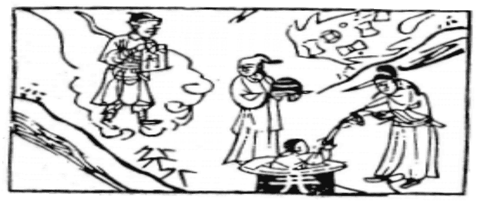

# 48水風井

  
此卦楊貴妃，私與安祿山為事，卜得之，反受其害也。

圖中：

**金甲神執符，女子抱合，錢寶有光起， 人落井中，官人用繩引出。**

**珠藏深淵之課 守靜安常之象**

==困之後，如至極，則纏身動彈不得，猶陷井中，故困之後為井。`物之居下者，莫如井`，此卦坎上巽下，坎為水，巽為木，木在水下，必上乎水，故有汲井之象。==

# 卦圖象解

一、金甲神執符：貴人在空中，祥瑞之兆也。  

二、女子抱合：好也，但先成後破。

三、錢寶有光起：財不失，不露之象，不久有喪也。  

四、人落井中：病重象，官司沈陷象，招陷害也。   

五、官人用繩引出：貴人為官人，欲相救也。

六、符：符乃策略有傍人作對。

# 人間道

 **井：改邑不改井，无喪无得，往來井井。**

==井，為不常改之處，常見都巿已改，但井無法遷動，井之性，汲之不竭，存之不盈，故曰無喪無得，凡人至井側，皆受其用，此不變之常德也，此為井之道。==

## 汔至，亦未繘井，贏其瓶，凶。

井之道在乎供人用為善，如人至而未用井，仍飲泉，則有亦若無。君子之道，以有成為貴， 如道即令正，但不為所用，亦等於無也。徒自招凶。

## 彖曰：巽乎水而上水，井，井養而不窮也，改邑不改井，乃以剛中也。

木入水中，而又上於水，此井也，井能養物，不盡不竭，此井德之常也。城巿可改，而井不能遷，猶君子剛中之德，即令再艱險，卻永不改變其志。

## 汔至亦未繘井，未有功也，羸其瓶，是以凶也。

井以供人使用為功，今人至井側，而不用井，則有井亦同於無井，無法發揮井之功用。瓶須盛水，今破壞，是以無用而致凶也。

## 象曰：木上有水，井，君子以勞民勸相。

君子觀井象，效法井之性，為助民而任勞，且教其互助之功，此效法井之佈施無私也。
## 初六：井泥不食，舊井无禽。

井之道，始為井之時，仍不適用也，井內初無水，其底為泥，不可食，井之德能養人， 乃其有水也。今若為廢棄之舊井，其無水，故必無禽至，猶人之無才無法濟物，必為時代淘汰。今之師即須有舊井之戒，故孟子曰：人之

## 象曰：井泥不食，下也，舊井无禽， 時舍也。

初為陰柔，而居井之底，乃泥象，無水之泥，人必不食，無水之井亦無禽聚，此必為時所捨之也。
## 九二：井谷射鮒，甕敝漏。

陽剛居將位，居井之時，上不對應，因而趨下，失井之道，降下而趨泥，而成微不足道之物，如破漏之甕也，終必無功。

## 象曰：井谷射鮒，无與也。

井，能出水助人為功用，故以能出為成功， 今陽剛之才，本可濟用於世，因上不用故成無用。
## 九三：井渫不食，爲我心惻，可用汲，王明並受其福。

九三之才居相位，陽剛又居高位，才必能濟世，如井之清水升而上，可助人之力大也， 今不見人食，乃謂君明其賢不用其才，賢才之心必憂，如君能用其才，使其才能濟民，乃上下之共福也。

## 象曰：井渫不食，行惻也，求王明， 受福也。

井中水清澈而不食用，乃有才智之人，不見用，其無法遂行其志而憂懷，但求得遇明君而天下受其福澤。
## 六四：井甃，无咎。

陰柔之人居君王身側，才不足而任其位， 若但求修治井口之磚砌，自守之，亦可無咎。

## 象曰：井甃無咎，脩井也。

修治井口 ，即令無功於天下，亦因其能守而不致招廢棄，亦可為功矣。
## 九五：井洌，寒泉食。

九五君位之人，能如井中之泉，甘寒潔淨， 為民所喜用，此井道之至善也。

## 象曰：寒泉之食，中正也。

寒洌甘潔之泉水受人喜用，乃中正之道得用亦同。
## 上六：井收勿幕，有孚元吉。

井以水能上出為人所用為居功，使人汲取而不竭，其利必無窮無盡，其間之性為常此不變，始終如一，廣施其德於萬民，此乃井道之成也。

患，莫過於為師，即有舊井之戒。

## 象曰：元吉在上，大成也。

能以至善而居卦終，乃大成也。

