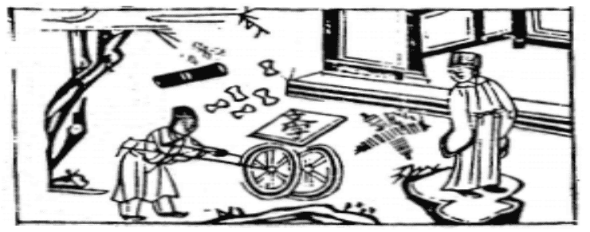

# 51震爲雷

  
此卦是李靜天師遇龍母借宿，替龍行雨， 卜得之，官至僕射。

圖中：

**人在岩上立，一樹開花，一文書，一人推車上有文字，一堆錢財者。**

**震驚百里之課 有聲無形之象**

==鼎，器也，能主器者，必賴長子，震為長男，取其主器之義，故次鼎為震也，此卦二震相重，有奮發震驚之象，二雷相繼，重雷也。長子繼位為君也。==

# 卦圖象解

一、人立岩上：特立獨行，摇摇欲墜也。危險也。

二、一樹開花：有果也，惜乎過於短暫，少部份之人。  

三、一文書：消息至，公文至。

四、一人推車：轉變之象，執行命令象。  

五、上有文字：得官令也。

六、一堆錢財者：錢財散於地狀，憂心也，喪事也，求財不利，占疾病凶。

# 人間道

 **震：亨。震來虩虩，笑言啞啞。震驚百里，不喪匕鬯。**

==震之道，能奮發，動而進，知懼而進修，皆足以亨。當震動之來，恐懼不寧不安狀，知所戒懼，則可保安，故笑言和適貌。震聲遠及百里，人無不懼而喪失，唯執宗廟祭祀之器者，不喪失不懼也。人間之至誠，莫如於祭祀時之堅心守正。==

## 彖曰：震亨，震來虩虩，恐致福也。笑言啞啞，後有則也。

震來時能知恐懼，則無患而能亨矣。此因能有戒懼反為福也，必恐而知自修，不敢違於常理法規，因震而生法度，必能致福安，故可笑言無憂。

## 震驚百里，驚遠而懼邇也。出可以守宗廟社稷，以爲祭主也。

雷之嚮震百里，遠受驚而近受懼，人能知戒懼不妄為，則出可以長守宗廟社稷，能如是， 則必可守承國家。

## 象曰：洊雷，震。君子以恐懼修省。

洊為重意，上下同卦故為洊雷，形容威震之大也，君子觀之乃知恐懼自修，畏天威省思已過而改之，唯君子能如是。

## 初九：震來虩虩，後笑言啞啞，吉。

初九：居震之始，知震之來，能於始即知戒懼恐慎，不敢掉以輕心，終必安吉。

## 象曰：震來虩虩，恐致福也，笑言啞啞，後有則也。

雷震之來知懼進修，此因知恐而終有福吉。不違於常法，則可保平安也。

## 六二：震來厲，億喪貝，躋于九陵， 勿逐，七日得。

六ニ乃柔居正位，善處震時之道也，雷震乃剛動而上，無人能禦其威猛，度量知其必喪全數之資，故能遠避以自守其中正，以不追隨而得，雖不能立，即防禦，但時過後，必可得

## 象曰：震來厲，乘剛也。

震之至剛而來，如欲駕乘，乃自招危厄。

此如能知己力之不足而求去，亦可無咎。

## 六三：震蘇蘇，震行无眚。

三位為陽位，陰居之，乃不正位也。不正位之人於平日，尚且不安，更何況處於震時居

## 象曰：震蘇蘇，位不當也。

處不當位，即震來而不知戒，不知恐懼也。

## 九四：震遂泥。

以剛居柔，不適位而失去剛健之道，無法震奮也，如泥之滯也。

## 象曰：震遂泥，未光也。

震之動必以剛為本，今動如滯泥，已失剛道，震之義，必無法光大也。

## 六五：震往來厲，億无喪有事。

君位之人居震動之時，必不失中道，即令危亦不為凶矣。中道勝於正道，有中道之人必不違於正道，正道卻不必一定為中道。此其差異所在也。

## 象曰：震往來厲，危行也，其事在中，大无喪也。

震之動不以中，往来皆有危，其危之生， 乃因失中之道，居此時，以無喪失為至善。

## 上六：震索索，視矍矍，征凶。震不于其躬，于其鄰，无咎，婚媾有言。

陰柔之人居震之極，驚懼至甚，無志抖索狀，其視瞻亦不能安定而明，其於此時，若動， 必招凶。乃不明而動之戒。震之戒在不及身而及於鄰時己生戒心，則終無咎，如婚事之初有爭言，則己生戒心，莫俟及於身，已不及矣。

