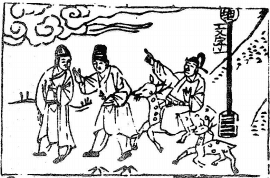

# 54雷澤歸妹

  
此卦舜娶堯二女，卜得之，乃知卑幼不寧也。

圖中：

**官人騎鹿指雲，小鹿子在後，望竿上有文字，人落刺中，一人拔出。**

**浮雲蔽日之課 陰陽不交之象**

==渐乃進也，人進必有所歸，所以歸妹次渐也，少女，人所悦也，雷為動，今如人之動以悦， 此因悦而動，必有所不正，此卦澤上有雷，雷震而澤動，相從之象，男動在外而女從之在內， 有女嫁歸男之象。人之動须以明，明而後動，方不失正。==

# 卦圖象解

一、官人騎鹿指雲：浮雲蔽日，乘亂而欲進。  

二、小鹿子在後：生意人，隨從狀。

三、望竿上有文字：旦夕而亡，揭竿而起，正名也。  

四、人落刺中：如鲠在喉，去之不得。

五、一人拔出：一人相救示寵狀。  

六、此卦問病凶，問財吉，問政凶。

# 人間道

 **歸妹，征凶，无攸利。**

==此動之以悦，必有不當，如動反招凶，所往必不利。==

## 彖曰：歸妹，天地之大義也。

此言陰陽之道，男女之配，乃天地間之常理也。有男居上女在下，陰從陽動。

## 天地不交而萬物不興，歸妹，人之終始也。

天地如不交則萬物必不生，女之從男，為生生之道，人類從男女之交而生，其終必不窮

## 説以動，所歸妹也，征凶，位不當也。无攸利，柔乘剛也。

此動之因喜悦對方為少女，人如只因悦而動，必失明之道，動必凶至。此不以正道，而以悦道，故位不當也。男女尊卑，夫唱婦隨，人之常理，如不以常道，惟私欲作與，柔勝於剛， 所以凶也，往必不利矣。

## 象曰：澤上有雷，歸妹，君子以永終知敝。

君子觀雷震於澤上，澤隨雷而動，猶男女相配，生生不息之象，其有永終之戒，因物久後必生敝壞，君子於始初乃知戒敝壞之理，故凡事之長久而吉，必於初始即生戒故謂永終之戒。

## 初九：歸妹以娣，跛能履，征吉。

娣，有賢良正德之義，女之嫁歸能如此， 又知處卑順，然因其位卑，即令有賢才亦只能助夫而已，獨善其身，猶跛之能行，必無法及遠，但往乃得吉。

## 象曰：歸妹以娣，以恆也。跛能履吉，相承也。

女嫁歸男，能自處卑順，且悦於內，持之以恆，即令跛者行路，亦可以有吉，其因乃其能相承相助也。

## 九二：眇能視，利幽人之貞。

九二乃陽剛之賢居正位，於歸妹之時，乃意女之賢能所配不良之人，猶如目眇之人，其視必不能及遠，此時惟隱藏其賢，且堅心以正禮，可利也。

## 象曰：利幽人之貞，未變常也。

守其隱於內之才，堅心不變，此不失夫婦常久之道也。

## 六三：歸妹以須，反歸以娣。

六三乃相位居陰柔之人，於歸妹時，以悦而求上應，不以正道，故必不得其歸，無所適從。必當反歸求處卑下，則可吉矣。

## 象曰：歸妹以須，未當也。

女歸嫁男，如求己之须，無法求外應合， 必不當也。

## 九四：歸妹愆期，遲歸有時。

四柔陽剛居之，即意處柔乃婦人之常道， 但內有剛明之賢，處歸妹之時，因賢明又居高位，人所願娶，但卻有遲嫁之象，非不嫁也， 乃待時而動，有佳配而後行也，此遲歸有時。

## 象曰：愆期之志，有待而行也。

此之延期所由皆己，不由他人，因己之有賢，故能如是。

## 六五：帝乙歸妹，其君之袂，不如其娣之袂良，月幾望，吉 。

六五居尊位之人，柔性象女，示女之高貴者，今居歸妹之期，雖為帝女，於歸時，乃得屈而謙降，故女之歸以能謙降為美德，但求於禮，不求於外飾，故猶月陰之盛，而不至於盈滿，此乃能為吉。女子尊貴之道即此。

## 上六：女承筐无實，士刲羊无血， 无攸利。

女歸之終至極時，乃承繼祖先祭祀之職， 但至極則無實可祭，猶士人之割取羊血以祭禮，如割羊無血無以祭，必不利繼往也。

## 象曰：帝乙歸妹，不如其娣之袂良也，其位在中，以貴行也。

此尚禮而不尚外飾，為帝乙歸妹之道，五為柔而居尊位，乃有尊貴而又知能行中道之人也。

## 象曰：上六无實，承虛筐也。

女歸嫁之極處，以柔居之，猶空筐之無實， 必不可以承祭祀，女終不可承繼也，必主人人離絶也。

