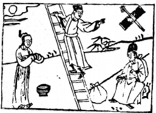

# 58兌爲澤
  

此卦唐三藏去西天取經，卜得之，乃知必歸唐國。

圖中：

**人坐看一堆擔，月在天邊，秀才登梯， 一女在合邊立，文字上箭。**

**江湖養物之課 天峰雨澤之象**

==巽者，入也，物能相入，必有相悦方成，故兌為巽之序。==

# 卦圖象解

一、人坐看一擔：任務完成狀，有人相助象，助人為樂之貴人。  

二、月在天邊：清明之治。

三、秀才登梯：金榜登科象。

四、一女在合邊立：女人介入，先成後破。  

五、文字上箭：得機而發，射：發象。

# 人間道

 **兌：亨，利、貞。**

==兌之道，可以致亨。人能悦於物，物亦相悦，必足以亨。然兌之道在貞正，求悦不以正道， 必成邪吝，終致悔咎。==

## 彖曰：兌，説也，剛中而柔外，説以利貞，是以順乎天而應乎人，説以先民，民忘其勞，説以犯難，民忘其死，説之大，民勸矣哉。

兑，悦也。外柔內剛，中心誠實之象，悦之道可亨，乃因其能貞正。上順天理，下應人心， 能使民以悦，則民忘勞苦，且欣然為國犯難。忘其生死，此悦之道至極矣，民莫不信之。

## 象曰：麗澤，兌，君子以朋友講習。

兩兌相重，即兩澤互麗，交相浸潤，互有滋益之象，君子觀之乃知朋友講習，互相增益， 為天下之大悦，有互相明益之象。

## 初九：和兌，吉。

初雖陽剛，但因居卑下，乃知卑下和順， 此悦必無所偏私，此兌之正道，故吉。

## 象曰：和兌之吉，行未疑也。

初位必隨時順處，心無所欲，惟求能和而已，是以吉也。其行必未有可疑。

## 九二：孚兌，吉，悔亡。

二位有剛中之德，內實孚信，雖近小人， 但不失君子之道，悦而不失剛中之德，所以能吉而不慮亡矣。

## 象曰：孚兌之吉，信志也。

君子之悦，自心中之至誠，故必不失道， 小人之悦，必忘形而自失不知。

## 六三：來兌，凶。

陰棄居陽剛之位，不適也，比得兌之道不以中正，為悦而求悦，人之有求必因私欲，己離正道，故凶。

## 象曰：來兌之凶，位不當也。

柔居陽剛，自處必不中正，和欲而求悦， 必招凶。

## 九四：商兌未寧，介疾有喜。

陽剛處陰位，居不中正，故有未決，未能定也。居兑之時，不為悦所惑，能知命守剛正， 疾惡去仇，必能得君之信，而有喜也。

## 象曰：九四之喜，有慶也。

九四君側之人能有喜慶，必来自君之信孚，得遂行其陽剛之志也。

故於此設戒。

## 九五：孚于剝，有厲。

九五君位得中正之道，居悦時，乃可盡善， 但聖人復設戒於有厲，即雖中正聖賢在上，天下仍有小人，為免惑於悦，小人之入而不自知，

## 象曰：孚于剝，位正當也。

居悦知剝之戒，人於事始知戒，可以無災咎也。

## 上六：引兌

悦之至極則愈悦，故言引兌。天下萬事過之皆不宜,有凶至。

## 象曰：上六引兌，未光也。

悦之至極，已太過於事理，其果必不能更光也。

