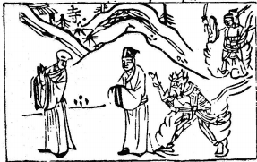

# 59風水渙

  
此卦漢武帝，卜得之，乃知李夫還魂也。

圖中：

**山上有寺，一僧，一人隨後，一鬼在後，金甲人。**

**順水行舟之課 大風吹物之象**

==兌，悦也，人悦時，則必舒散，渙、散也，故渙為兌之序。人之性憂則結聚，悦則舒散。此卦上巽下水，乃風行水上，水遇風則渙散，故渙為散也。==

# 卦圖象解

一、山上有寺：出家狀，對峙狀，寸土寸金象。  

二、僧：化外之人，光頭人，曾姓人。

三、一人隨後：逃避，求助化外之人。

四、一鬼在後：為禍追緝之象，內心有鬼，處事不明象。  

五、金甲人：正義之師，得民心也。

六、寺，土頭人作對。等待時機也。

# 人間道

 **渙：亨。王假有廟，利涉大川，利貞。**

==渙，散也。人會離散，本於中心一念，心離則散矣。故能治散，必從中入手，有能收拾人心，散可聚矣，故散之道論如何用散，故可以亨。君王能知立宗廟收人心，則必可前進無阻， 故須堅心到底。==

## 彖曰：渙，亨。剛來而不窮，柔得位乎外而上同。

渙之道所以可致亨，以卦來言，用陽剛之法，不可致極剛，以居下位，又得中道，柔位而得五君位之相應，故居渙時，能守其中，必不至於離散，所以能亨。

## 王假有廟，王乃在中也。利涉大川，乘木有功也。

君王能利用宗廟收拾人心，乃知用中道之妙，能如此可往天下，無處不阻也，自古以來， 能得民者，必得其心，方可謂得民矣。

## 象曰：風行水上，渙。先王以享于帝立廟。

風行水上，渙散之象。先王觀渙之象知，救天下之散，惟有祭祀宗廟，收合人心，合心之道，莫大於此。

## 初六：用拯馬壯，吉。

初爻，為渙之始，陰柔居不正，又處卑下， 故於始時即察知而拯，只須託於陽剛之人，即可整渙，故吉。

## 象曰：初六之吉，順也。

初六之能吉，乃因於渙始即察知，始而拯， 此得時也故吉。

## 九二：渙奔其機，悔亡。

外飾順，內實險憂，心已散。九二居坎險中位，乃意於渙散時，又居險中，其險可知， 如能知機而奔往不猶豫，方可不慮亡也。

## 象曰：渙本汁其機，得願也。

渙之時居險，必以知機而親近之，乃可得願矣。

## 六三：渙其躬，无悔。

六三相位，今才為陰質，不適居位，於渙散之時，必無法拯救他人，只能止於其身，可以無悔矣。

## 象曰：渙其躬，志在外也。

渙時，以躬順求上同。可免己之災。

## 六四：渙其群，元吉。渙有丘，匪夷所思。

六四乃大臣之位，今有九五君來同應，有君臣合力，以濟天下之渙散，能如此則有大功。方渙散之時，用剛則必不能使之懷附，用柔又不足使其依歸，故如能使大聚，此事必難，用必非常法，能成此大功，非聖賢何能如是乎？

## 象曰：渙其群，元吉，光大也。

元吉謂大功德也，君臣合力於渙時，能群聚民眾，其功可光大也。

## 九五：渙汗其大號，渙王居，无咎。

九五君位，居渙之時，以陽剛正德又得巽之外順，此深得處渙之道，必能號令人民，民心信服而從矣，如汗之於體外，息息相關，民與君之關係能如此，則必能居王位而無咎。

## 象曰：王居无咎，正位也。

君位尊，而其才德又適其位，稱王可無咎， 因合於正位。

## 上九：渙其血，去逖出，无咎。

渙至極時，仍能守巽順之道，即令有傷， 亦仍可出險，遠離災害而無災矣。

## 象曰：渙其血，遠害也。

渙散至極，即令血出傷害。以堅守巽順之道，必遠離禍害也。

