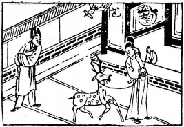

# 61風澤中孚

  
此卦辛君屯邊，卜得之，遂果得梅妃之信也。

圖中：

**望子上文書，人擊柝，貴人用繩牽鹿雁啣書。**

**鶴鳴子和之課 事有定期之象**

==人有節，而後有信，故中孚次之。節本有節制，不可過越之意，人能信而後行之，上位知信守，下位知信從。此卦澤上有風，風行于澤上能感於水為中孚之象，此因一 、二爻位，五六爻位，皆實陽，而三、四爻位，為中虛之象，全卦有外實中虛之義，此中孚之象。==

# 卦圖象解

一、望子上文書：科甲高中，刑法更吉。  

二 、人擊柝：預警也。

三、貴人用繩牽鹿：守成，不可攻也。  

四、雁啣書：喜事將至，有南徙之象。

五、人立庭中：蒞庭也，防官司或打官司保身也。

# 人間道

 **中孚：豚魚吉，利涉大川，利貞。**

==中孚之道，其中心之誠信，能使豚魚都有感，則無所不至矣。故利涉大川，週行無限也==

## 彖曰：中孚，柔在内而剛得中。

中孚之中虛乃至誠之象。此示意剛之道能得中正，故吉。

## 説而巽，孚乃化邦也。豚魚吉，信及豚魚也。

上位以至誠而順從於下，下位以至誠以求上悦，由其中孚之至誠，必教化邦國，此信能令豚魚皆感，此道之至善也。

## 利涉大川，乘木舟虛也。中孚以利貞，乃應乎天也。

中孚道之吉，猶乘舟渡川，內無實物，不虞覆船，即處艱困，能以中孚則必可亨通，能堅守中孚之道，此天道之極至也。

## 象曰：澤上有風，中孚，君子以議獄緩死。

風在澤上，澤有感于風，因水體本虛，故風能入。君子觀之，知人心虛，則物必感之，此中孚之象，君子于議獄，本為盡忠而已。於決死之際，但求緩之，寬之。

## 初九：虞吉。有它，不燕。

陽剛居始進，於中孚之道並非了解，人初志必不定，故如能以愚誠信之，且專一之志， 若生異志，必不得安矣。

## 象曰：初九虞吉，志未變也。

始信之時，志未能從，但能愚誠專一至信， 則吉矣，故吾人初始，必求能為己所信之道， 方以愚誠，如此方不致迷。

感之，能化邦國。

## 九二：鳴鶴在陰，其子和之，我有好爵，吾與爾靡之。

內剛外柔，陽居陰位，中孚之感，因外柔必能感通，猶鶴鳴於幽谷，人不聞也，而其子必應和，乃心感通也。故能中心孚誠，千里能

## 其子和之，中心願也。

子能與合，乃中心誠意能通故也。

而不知吉凶，此非長才之君。

## 六三：得敵，或鼓或罷，或泣或歌。

柔居陽剛之位，居位高但才不能濟，故勢必唯所信而從，其外在之鼓張，罷廢悲泣，歡歌皆因導於內心之所信，因才不足，故只有信，

## 象曰：鼓鼓或罷，位不當也。

居不適位，無所心主，惟能從於所信而已。

## 六四：月幾望，馬匹亡，无咎。

近君之位，以柔順得信，其盛必如月之滿盈。即同類同屬亡失，亦可無咎。

## 象曰：馬匹亡，絕類上也。

求上之孚信，即令同類亡，亦不顧而求， 此所以吉也。

## 九五：有孚孿如，无咎。

君位之人，以中孚至誠之道，感通天下， 民心之信服，固結如抽掣也。

## 象曰：有孚孿如，位正當也。

五居君位以陽剛，用中正之道，天下民心固結信服，其稱位如此，君之道乃能致極矣。

## 上九：翰音登于天，貞凶。

中誠孚信致於極，有信終則衰，華美其外， 內無忠篤，猶翰音登天，不知止之，貞固如此， 不知變，乃自招凶。孔子曰：好信不好學，此敝也贼。意即固守而不通也。

## 象曰：翰音登于天，何可長也？

守誠信至窮極而不知變，必不能長久？此固守不知變之戒，招凶至矣。

