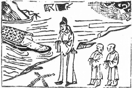

# 63水火既濟

  
此卦季布在周家潛藏，卜得之，遂遇高皇帝

圖中：

**人在岸上一船來，一堆錢，雲中雨下， 二小兒在雨中行，文書一策。**

**舟楫濟川之課 陰陽配合之象**

==小過乃過於物，能過於物，必能相濟，故受之以既濟。此卦，水在上，火在下，火水相交， 則能為用，能互為用，即為既濟，此卦言，天下萬事，己互濟之時也。==

# 卦圖象解

一、人在岸上：泣也，等待也，無目的也。  

二、 一船來：接引至也。

三、一堆錢：財祿無用也，憂心忡忡也，有竊象，抄家之象。  

四、雲中雨下：陰中有果也，夜間至凌晨時。

五、二小兒：主喜也，二人也，二人雨中行也。  

六、文書一策：證件，命令也，資料也。

# 人間道

 **既濟：亨小，利貞，初吉，終亂。**

==既濟之時大事必能亨通，然須知小事亦须亨通，方可為吉，必須所有事皆吉，否則濟至極時，終亂。==

## 彖曰：既濟亨，小者亨也。利貞，剛柔正而位當也。

陰陽能皆得位，故為既濟，但須無所不亨，乃可也，且貞固守之。

## 初吉，柔得中也。終止則亂，其道窮也。

其以柔順文明之中道，故可成既濟之功，至既濟之極，若不知變通，必生亂，其亂之生乃因道至盡窮。

## 象曰：水在火上，既濟，君子以思患而豫防之。

水火即交，各有其用，為互濟，時當既濟，君子觀象知於既濟之時，必先思慮患害之生， 使不至成禍患也。自古以來，天下由治而亂，乃皆因居治不思亂時之戒。

## 初九：曳其輪，濡其尾，无咎。

倒曳輪，使不再進。獸之涉水，必舉高其尾，使尾不濕方可進，無災至。

## 象曰：曳其輪，義无咎也。

於既濟大吉之時，能知止進，則必不至極時，故必無咎也。

## 六二：婦喪其茀，勿逐，七日得。

陰居正位，得五君位應，其志必得遂行， 但中正之道，不可廢也，猶婦人出門用茀遮己今喪其茀，則不行，能自守不失，道必復也。待時之至。

## 象曰：七日得，以中道也。

因中正之道非不可用，乃時之未至，於此時自守其中，俟時至必能行矣。

## 九三：高宗伐鬼方，三年克之，小人勿用。

以剛居剛位，居既濟時，其君主威武必令民心服。但若專肆威武，必令民心忿而不服， 殘害人民，貪人民之富，故有小人勿用之戒， 因惟小人其威武必為滿足其私欲，君子戒之。

## 象曰：三年克之，憊也。

既濟之時，必濟天下，於高宗可也，乃因其心為民，道必正，如為己之私欲，則三年民必疲憊而終忿矣。

## 六四：**繻**有衣**袽**，終日戒。

四近君位，陰柔居之，乃適其任，當既濟之時，須如行舟，戒之滲漏，始漏則塞以衣物， 且終日戒懼不怠，則必可免患。

## 象曰：終日戒，有所疑也。

當既濟之時，必疑其患之將至，其戒懼之心如此，謹慎如此。

時，方可得易之神明矣。

## 九五：柬鄰殺牛，不如西鄰之**禴**祭，實受其福。

九五至尊君位，陽剛人居此，當既濟之時， 必以至誠信孚如祭祀之誠，則即令薄禮之祭， 也可勝於豐厚之祭，由其至誠之心使然也。易之不重形，而重神，此明而顯矣，故論易須知

## 象曰：東鄰殺牛，不如西鄰之時 也，實受其福，吉大來也。

既濟之時，能得時者，即令薄祭，亦可有大吉之福至，此言時之可貴也。

## 上六：濡其首，厲。

既濟至極時，必不安而危，今陰柔居之， 居坎險之上，即既濟之終，小人居之，其敗壞必立可見矣。

## 象曰：濡其首厲，何可久也。

藭盡之須以水淋其首，其必不可長久也。

