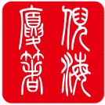
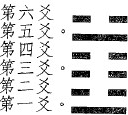
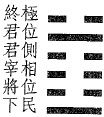

人間道

  

# 校 堪 序

本《人间道》乃由民间的中医爱好者整理与校对。中华民族文化博大精深、渊远流长，中医更是中华民族的瑰宝，几千年来一直守护着炎黄子孙的健康。继承和发扬中医,本是我们爱好中医人士与生俱来的使命。可是由于种种原因,使得中医的许多典籍在流传上产生问题；或已出版而校对欠佳,或印量稀少而极难购得，甚或已经绝版而失传。使得这份本应属于整个中华民族所共有共享的珍贵智慧，无法让更多需要的人学习它,大非往圣之本意！

我们在校正的过程中，仅对明显的错别字给予了修改,对于无法确定者则保留原样。我们力图提供正确无误的电子书,但限于能力,自知错误在所难免。

本书的原始材料来自于网络,为网络中善心人士传播之电子版本。本书的校正, 由民间中医爱好朋友们自发组织，属于无偿的自发行为，在此首先对他们表示感谢\! 本电子版不收取任何费用，亦不得将本书内容用于商业行为。

根据相关法律,本电子书仅供网络测试,不收取任何费用。请您下载后 24 小时内删除,如果您喜欢本书,请购买原版。任何人不得将本书用于商业行为,否则由此直接或间接引发的任何法律问题,我们不承担责任。

民间中医爱好者 敬校

2010-10-22

自 序

本書之著作，是為了發揚我國千年來，易經的神髓而作的，目的是希望後代子孫能以中國文化為榮，以身為炎黃子孫為傲，切不可數典忘袓，唯有真正的發揚固有文化，才可以讓中國人領導二十一世紀，獨領風騷。

本書之書名，是由我父親倪志凌先生親手寫的，我父親飽讀詩書，現旅居美國， 一手好字，為同仁所公認，他一直以中國人為榮，時時教诲他的孫子，不可忘本， 從小我就受他影響很大，萬般皆下品，惟有讀書高的觀念，三日不讀書，面目可憎， 真是如此。現在社會形態一直轉變，我從事算命有十幾年，看盡人間百態有感而發， 希望藉由此著作，能寓教於人，不可再茫然度日，只知吃喝玩樂，不知長進。做長輩的要求子女多讀書，而不以身作則，人言：言教不如身教。我愛讀書，喜歡研究， 實身受我父親影響至大，故特別請我父親為我的書名立文，以茲感念。

梵宇龍八十三年九月十日

自 序

易，變易也，隨時變易以從道也。

不易也，事物之外象皆變，而其理不變也。簡易也，萬法皆不同，然其神只有一也。

故易廣大皆備，順性命之理，通陰符，盡事物之情，而示吾人開物成務之道。得此易道之神，則天下萬事皆能化繁為簡矣。

前賢失其義而只能傳其言，後學者誦言而忘其味。自秦以後，無傳矣。前有天官，姜太公、范蠡、鬼谷子、張良、諸葛亮、李淳風、程頤、邵康節、劉伯温之用易，其用易之神，後學者瞠乎其後，而實無來者再傳其神矣。

易中聖人之道有四：以言者，尚其辭。以動者，尚其變。制器者，尚其象。卜筮者，尚其占。其間藴含吉凶消長之理，進退存亡之道。

君子靜則觀象以悟其辭，動則觀變以玩其占。

今世之人，大都得其辭，而未達其意，此著作以悟象之角度申其義，此其目的也。

祈與同道共勉之！

作者倪海廈甲戍年正月廿四日

 郭 序

易經一書，相傳始於伏羲，成於文王。爲古人仰觀天象，俯察地理，累積日常生活資料所得之經驗。稱之為易，蓋取其〔簡易、變易、不易〕。因其簡易，當為常人所了解；因其變易，當可用於事事，復因不易，當能垂教萬世。唯以書成年代久遠，用語艱澀隱晦，不易暸解，師徒口語相傳，又失其微言大義，加以今人多不識此書，或竟視爲算命工具，或直斥爲迷信，殊為可惜。

畏友 海廈兄，自幼隨明師習醫，於吾國固有之〔山、醫、命、相、卜〕諸術， 無不精通，尤擅於易經，除熟讀探究易經精義，更已將易經融入日常生活中，經由具體之實驗，驗證先哲思想之正確性。而余生也駑鈍，自倖入法界服務以來，對案件之偵査，雖期能究明實情，勿枉勿縱，但驗諸實際，每感實質正義追求之不易與人道之難爲，挫折感屢生，適因緣際會得識 海廈兄，每以易經象術相教，既解迷惑於一時，復啟對問題思考之另一模式，助益可謂大矣。

今兄將研習易經多年之心得與課堂講授之經驗，集數月之力，爲十餘萬言，著成此書，以簡淺文字，發前人之所未言，闡明易經之微言大義；又博採史例，廣爲佐引，論證古今，詳實可信。於書成之際，邀余爲序，爰不揣淺陋做之序，以示慶賀之意，更盼巨著隨出，以享讀者。

中 華 民 國 八十三年十一月九日

郭學廉 序於台灣板橋地方法院檢察署

 徐 序

人生於天地之間，秉天地之氣而有形，受天地之養以爲生。未有能離於天地之

間而生者。是倪師海廈畢數十年之心力，上窮天道，下探地脈，中明人事，終底於成，而作「天紀」。

余不敏，早歲亦嘗涉獵易理，惟不得法鬥。自從倪師游，方知易者「易」也， 何「難」之有？亦知吾國先人之智慧至倪師而能昭顯。「天紀」一書，以易經爲軸， 以天文、地理及人間道爲輔；發前人之所未發，言前人之所未言。復道盡天、人、地三才之關係，良以三才能分，能合；名異而實爲一體也。又豈天人合一之境所能比擬？

吾國易經博大精深，漢、唐以前，重象、數而輕辭，自宋以降，則重辭而輕象、 數。倪師則並重之。使「天紀」一書不僅成爲集古代易經之大成，更有所發明。例如，，倪師之陽宅學，以九宮八卦圖爲内卦，居於其位之人爲外卦；卦既成，則觀該卦之象以斷其人之吉凶禍福。此實深合易之道也。

君子静以觀象，退而演易，動則問卜，以果決行。「天紀」一書實爲倪師智慧之結晶，若以卜筮之流者視之，吾不與焉！

徐光佑甲戍年孟冬 序於 台北景美

前 言

本書的內容，共分二部份。〔一〕從圖來談易經，即古人所謂「無字天書」，占卜、問卦，也可以應用於易經推命來批流年行運，也可以運用於陽宅來推易，這是學如何演易。〔二 〕從易辭部份來研究「人間道」。從第一卦「乾為天」開始，天地定位後，人的一生即進入此一輪迴，舉凡天地間所有的任何事物，全部包羅在內， 不但是醒世哲言，更可將世間所有的學問理論簡化之。今人讀易越讀越複雜，或是講易經講半天，而無人懂，這都是未得易之道，所謂易者，易也，不然何名「易經」？

讀易的心理準備

易經本身並不難，故讀者先要有一概念，在讀易之前，平心静氣，捨去一切雜念，千萬不可在讀易之前，先對易經有所認定，那尚未開始，您已經錯了 ， 一步錯，步歩錯，一旦離開了易經的神，運氣好的要「十年乃字」〔十年乃數之終，有倦怠的象〕，運氣不好，又自以為是的話，可能終其一世，仍未窺得易之全貌。

孟子學而篇：**學而不思則罔，思而不學則殆。**

此二句銘言，示吾人正確的讀書方法為：**學而後思則悟。**

現今教育的失敗即在此，莘莘學子們苦背書籍，為考試而讀書，加之考試內容問題的設計只著重死背，造成人們都學而不思則罔。罔者，迷惘也。故現今社會， 人心失落，不知孰是孰非，謡言滿天，大家所從何事，所為何事，只一昧的湊熱鬧， 一昧的為自己利益著想，別人都是不好，只有自己最好，大家一昧的修飾外在，而無人著重內實，繁不勝舉的例子，都是教育失敗造成。更有人成天胡思亂想，從不學習任何學問，亳無正確求知的方法，造成自以為是，殊不知危險就將來臨，結果自己害自己，絶大多數自以為是的人，往往事情發生前都認定是不可能的，事情發生以後都在後悔，更有人連後悔都不，還死不認錯，從不悔改，這是無知至極的， 相信夜闌人靜時一個人會害怕的無法入眠。

吾人的邏輯〔求學的方法〕如下：假設→驗證→結果，凡天下任何事都無法離開這個科學精神，是非應辨，真理即現，舉例説：有人說：「我不相信命，命都是自己努力來的。」聽起來好像是對的，但諸君深入一想，真偽立判，首先此人犯了第一錯誤，他從未研究過命，也就是完全不懂命學，卻從一不知的角度，來認定古聖先賢智慧的結晶，就是「不知而説」，這是一無知的人。第二錯誤，吾人假設他的話是對的話，既然命完全靠努力可得，那農業博士必是第一志願，因為如拿到農業博士 ， 一定可以做到總統的。試問這可能嗎？大家都知道，可是卻從不深思，這就犯了大錯。所以諸君在看易經之前，應如一張白紙，心中無任何擔心會看不懂，或看了無益，或是迷信等等任何想法，都不存於心中。切記「學而後思則悟」的真言，悟得後方屬於您自己的，這才是求知的方法。吾同道共勉之！

易經中的「人間道」

易經中共分六十四卦，每一卦體代表事，代表一狀況每一卦有六爻，每個爻意味事之時機也。每一卦的爻是由下而上，從第一爻到第六爻，共六階段，一般只知其為事之演進，吾人在何階段，做何動作，都可以預知其未來之果。如更進一步的推論，則是您在處於何階段，應如何做，如果做錯結果會如何，易經上早已明示， 更進一步提示讀者，這是一部終極的書，它可涵蓋一切，千萬不可被自已對易的觀念鎖定，要爭脱易的束縛，吸收為己用，此時它將領著您，使您有顆平常心，無欲則剛，智慧打開如海一樣能容納百川不增減，這才是讀易的至高階段。

吾人先定位，六爻可區分為六個層面，如左：

水雷屯： 定位

  
  

※註：易經原文中，凡九代表陽，六代表陰，例如：九三，即代表第三爻為陽爻，六五即代表第五爻為陰爻。餘類推。

吾人须先明屯之義，屯為物之初始，如胎在母體中，故萬物之始生謂 屯，此卦示吾人事之始生，如何戒之於初，即「慎始」之精神。

例如，你是一位新任銀行經理，剛到任時，即物之始生因為經理如一方之將， 故你須看屯卦，第二爻位，為將位應有之態度，於始之時，〔爻為時也。〕。如你剛考上金融特考而分發到一陌生之單位，無人記得，那你就是居於第一爻的位置，易經告訴你如何處理才是正確的，又如你是大企業的第二代須接君位，你就必須看第五爻君位處屯時之方法，成敗就看你如何做了 。唐朝名將李靖，有一銘言：「古今勝敗，一誤而已，」示人一念之間，就已決定勝敗，故開始時是最重要的。此例諸君要依此類推，任何事情都不出易之法則。吾定書名為「天紀」就是説明易經，本來就是一部闡述天地間永不變的紀律，循此法則則不論上下，不論何行，皆不脱離此範圍。

此後始論易經之人間道，將由六十四卦之順序演變，一 一為各位説明，許多天

機，已被古之天官將易卦之順序調整，為防止天機外洩，故陰符經云：「天發殺機， 龍蛇起陸，人發殺機天地反覆。」此處恕無法多言，自古能通陰符經之人不多，連姜太公，亦只有一半通悟，故此留於諸賢來研究，俗云「師父領進门，修行在個人。」 現在讓我們來看一看「人間道」。

**目录**

| 乾爲天 | ........................................ 1 | 地火明夷 | ....................................... 79 |

|-------------------------|-----------------------------------------------------------|-------------------------|-----------------------------------------------------------|

| 坤爲地 | ......................................... 7 | 風火家人 | ...................................... 81 |

| 水雷屯 | ...................................... 11 | 火澤睽 | ....................................... 83 |

| 山水蒙 | ...................................... 13 | 水山蹇 | ....................................... 85 |

| 水天需 | ...................................... 15 | 雷水解 | .......................................87 |

| 天水讼 | ...................................... 17 | 山澤損 | ....................................... 89 |

| 地水師 | ...................................... 19 | 風雷益 | ...................................... 91 |

| 水地比 | ...................................... 21 | 澤天夬 | ....................................... 93 |

| 風天小畜 | ....................................... 25 | 天風姤 | ....................................... 95 |

| 天澤履 | ....................................... 27 | 澤地萃 | ....................................... 97 |

| 地天泰 | ....................................... 29 | 地風升 | ....................................... 99 |

| 天地否 | ...................................... 31 | 澤水困 | .................................... 101 |

| 天火同人 | ....................................... 33 | 水風井 | .................................... 103 |

| 火天大有 | ....................................... 35 | 澤火革 | .....................................105 |

| 地山謙 | ....................................... 37 | 火風鼎 | .................................... 107 |

| 雷地豫 | ....................................... 39 | 震爲雷 | .....................................109 |

| 澤雷隨 | ...................................... 41 | 艮為山 | ................................... 111 |

| 山風蠱 | .......................................43 | 風山漸 | .................................... 113 |

| 地澤臨 | ....................................... 45 | 雷澤歸妹 | .................................... 115 |

| 風地觀 | .......................................47 | 雷火豐 | .................................... 117 |

| 火雷噬嗑 | ....................................... 49 | 火山旅 | .................................... 119 |

| 山火賁 | ...................................... 51 | 巽為風 | .................................... 121 |

| 山地剝 | ....................................... 53 | 兌爲澤 | .................................... 123 |

| 地雷復 | ....................................... 55 | 風水渙 | .....................................125 |

| 天雷无妄 | ....................................... 57 | 水澤節 | .................................... 127 |

| 山天大畜 | ....................................... 59 | 風澤中孚 | .....................................129 |

| 山雷頤 | ...................................... 61 | 雷山小過 | .................................... 131 |

| 澤風大過 | ....................................... 63 | 水火既濟 | .................................... 133 |

| 坎爲水 | ....................................... 65 | 火水未濟 | .................................... 135 |

| 離為火 | ....................................... 67 | | |

| 澤山咸 | ....................................... 69 | | |

| 雷風恆 | ...................................... 71 | | |

| 天山遯 | ....................................... 73 | | |

| 雷天大壯 | ....................................... 75 | | |

| 火地晉 | ....................................... 77 | | |

