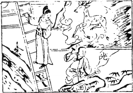

# 01乾爲天

  
此卦高祖與呂后走在芒碭山卜得之，餘人難壓也。

圖中：

**鹿在雲中，石上玉，有光明，人琢玉。月當空，官人登雲梯，望月。**

六龍御天之課 廣大包容之象

萬物皆成於天地之間，故天之高，地之厚德，皆為吾人所效法。聖人觀天而知天之運行恆古不變，且永不止息，此天之道。乾為萬物之始，以象言其為天，為陽，為父，為君。

卦圖象解

一、官人在梯上：平步青雲象。

二、鹿在雲中：作為行事心中不可求祿，則祿至矣。三、石上玉有光明：示人才如玉之含光，吉也。

四、人磨玉：示人堅心不移，夕惕若厲，隨時戒之。五、工匠：有重立門户之象。

六、梯上官人：棺也。卜疾厄凶也。

七、官人望磨玉人：示人即平步青雲須戒盛，且望下看，念中無妄，則升遷平安，如爭位則旦夕而亡也。

人間道

 乾：元、亨、利、貞。

元為萬物之始生，亨為萬物之成長，利為萬物之遂成，貞為萬物之堅心，此為乾之性，恒古不變，示人须有堅定不移之心志，萬事乃成於此。

## 初九：潛龍勿用。

初爻為陽位，且陽居此，因爻理本無形， 聖人假借龍之物象來示人乾之初象如聖人始萌，如物之始端，若龍之潛隱，由於始生，未為可用之時機，當韜光養晦，以俟時之至。

## 九二：見龍在田，利見大人。

以個人而言，此時如舜之田漁，其德已著， 乃時之至，故利見大德之君，以行其道。以君王言，此時亦利見大德之人臣，以共成其功。以天下百姓言，亦利見大德之人才，以受其恩澤。

## 九三：君子終日乾乾，夕惕若厲，无咎。

三爻位是在下卦之最上，雖為臣位，但未離下位，此時君子知朝夕不懈，隨時警惕，即處危地，但因戒惕而無災至。時今在下位之人，因德已顯彰，民心將至，天下將歸於他，試想其危懼之程度，故聖人設戒於此時，此易之論時也。

## 九四：或躍在淵，无咎。

或乃進與不進之時，聖人示戒進之時機，如時機不對，亦可不進，或之意也，無災。

## 九五：飛龍在天，利見大人。

此乃進乎天位君位之時，天下利見有大德之人，來共成天下之大事，聖人居此位，乃知時之至矣。廣納天下大德之人共成之。

## 用九：見群龍無首，吉。

上九：亢龍有悔。

上九為位之極點，過此時太過也。聖人知此為時之極限，乃知進退存亡而終至無過,就不至於後悔也。

用九之道，即用鲍陽剛之道，須剛柔相濟方為中道，如過乎剛，以至剛為天下之優先，此凶之道也。

## 彖曰：大哉乾元！萬物資始，乃統天。雲行雨施，品物流形。大明终始。六位時成，時乘六龍以御天。乾道變化，各正性命，保合大和， 乃利貞。首出庶務，萬國咸寧。

彖為一卦之義，吾人觀讀彖，有助於對卦之了解。開始即讃乾道之浩大，萬物由此而生， 乾道因統天，故即為天道，萬物生後，雲行雨施，品物流形，此物之長也。六爻之卦位，各因時而成，此為天之運行，因天道之剛健而自強不息的運作，生育出萬物，且各有分類，各有所性，各有所命。吾人言『天所賦為命，物所受為性。』自此常存此道，因天道生成之

剛正，利於吾人堅心向道，果必吉。天之道首出萬物而皆亨吉，人君之道遵循天道，以致四海顺从。

## 象曰：天行健，君子以自彊不息。

象為解一卦之神，每卦皆有象，每爻皆有象，所有的卦皆以象為法則。此乾之卦象言，始終如一，永恆不變，人之行為能如此則至健，可以見天道也。吾人之自強不息，乃法天之則也。此為天紀。

## 潛龍勿用，陽在下也。

陽居最下始生之位，猶植物之生於土中， 未出頭，始萌之狀。故君子如處此時，乃應進德修業，未為可用之時機也。

## 終日乾乾，反復道也。

此時居下卦之最上，要再進前，但又未脱下位之關係，進退動靜，必依有道，且旦夕進修勵德，此時之法則也。

## 飛龍在天，大人造也。

君子能進君位，而行其正道，天下大治矣。

## 用九，天德不可爲首也。

用九，意為用剛之道也，天道陽剛，又用剛而為先，此之過矣。

## 見龍在田，德施普也。

此時君子之德已普及各地，人民已感受其教化之力量也。

## 或躍在淵，進无咎也。

或乃量可而進，待之以時，時至而動，動必以明，無災。

## 亢龍有悔，盈不可久也。

滿則溢，此天之道也，故易示人滿必不可持久，太過必生悔矣。

## 文言曰：元者，善之長也；亨者，嘉之會也；利者，義之和也；貞者， 事之幹也。

易中唯乾坤二卦有文言，此乃補強乾坤天地之道。元，萬物之始皆為善，天之生必有其用， 此為造化之跡也。亨者，乃其成長之嘉且美也。利者，任何行為必合於義也。貞者，萬物之用， 必以堅心不移方可成矣。

## 君子體仁，足以長人。

分均，仁也，此仁之道大矣，君子體之，以仁普及教化，以所以長人也。

## 嘉會，足以合禮。

不合理則為非禮，合於理之生長，為美之至嘉也。故萬般事物皆有一定之法則，吾人須體理之治，則發展合於天道自然。

## 利物，足以合義。

合於義，則能利於萬物之遂行。後出，義也。能斷後，則為義也。而今人類製造之物，無法完全回收，造成自然界之失衡，此不合於義之道也，不合於利物之理。

## 貞固，足以幹事。

因堅定不移之意志，則定以成事。

 君子行此四德者，故曰：乾，元，亨，利，貞。

能行此四德，則合乎乾天之道。

## 初九曰：潛龍勿用，何謂也？子曰：

龍德而隱者也，不易乎世，不成乎名，遁世无悶，不見是而无悶，樂則行之，憂則違之，確乎其不可拔， 潛龍也。

乾卦之用，即用九之道。初九為陽剛之微

現，如龍之潛隱，聖人居之陋側，堅守其道不因世之變而改變，時不至，隱其行，不求為人知也，自信自樂，見可而動，知災而避，守正道之心堅而不移，此真潛龍也。

## 九三曰：君子終日乾乾，夕惕若厲， 无咎，何謂也？子曰：君子進德脩業，忠信所以盡德也；脩辭立其誠， 所以居業也。知至至之，可與幾也； 知終終之，可與存義也。是故居上位而不驕，在下位而不憂,故乾乾因其時而惕，雖危无咎矣。

位居下卦之上者，已近君位，又因有君之

德顯，為免招凶，故君子居此時，必求進德修業，終日謹慎言行，知進退之機，此義之道。不以居上位或處下位而驕傲或憂慮，不予人有野心之戒，故雖處危地但無災至也。

## 九二曰：見龍在田，利見大人，何

謂也？子曰：龍德而正中者也。庸言之信，庸行之谨，閑邪存其誠， 善世而不伐，德博而化。易曰：見龍在田，利見大人，君德也。

因非為君位，但有中正之德，謹言慎行，

但求處於無過之地，遇邪道，但求存誠，德施普及，但不伐其惡，以誠純一，雖不為君，但為君之德也。

## 九四曰：或躍在淵，无咎，何謂也？ 子曰：上下无常，非爲邪也；進退无恆，非離群也；君子進德脩業。欲及時也，故无咎。

或即進退須待時之意，時行時止，不可恆久不變。君子之順時而動，猶影之隨形，並非欲為邪吝之人，亦非欲離同類也。此位乃近君惻之人也。

## 九五曰：飛龍在天，利見大人，何謂也？子曰：同聲相應，同氣相求, 水流濕，火就燥，雲從龍，風從虎，聖人作而萬物睹。本乎天者親上， 本乎地者親下，則各從其類也。

此有中正之德的人，居於君王之位，天下人皆歸仰其德，上應於下，下從於上，故聖人做而萬人皆明，因同德相感，故賢人出，各有其類，本為君位之人則親和於君王，本為位低之賢， 則近於下位之人，此乃自然之水流濕，火就燥，雲從龍，風從虎之義。故利見大人。

## 上九曰：亢龍有悔，何謂也？子曰：貴而无位，高而无民，賢人在下位而无輔，是以動而有悔也。

有陽剛之正德而居不適位，則動而必悔，因无民无輔，獨力難成也。

## 潛龍勿用,下也。

居下位之時，即有中正之德，亦宜潛隱， 不可就用也。

## 終日乾乾，行事也。

君子行事之法則，不居君位，則終日警惕， 進德修業，不求有大功。

## 飛龍在天，上治也。

有君王之位人，又有中正之德者，如龍在天，乃上上之治，其意如此。

## 乾元用九，天下治也。

用九之道，因天與聖人同知且同用，天下因治。

## 見龍在田，天下文明。

龍之陽剛德性，見於地上，如此天下則見其文明也。

## 或躍在淵，乾道乃革。

因知進退之得宜，故能離下卦，而躍居上位，故曰上下之革。

## 亢龍有悔，與時偕極。

時之過，再居此時，則人與時皆過也。

## 乾元用九，乃見天則。

用九，乃天之則也，天之法則即為天道， 聖人稟道而行，得失吉凶立知於事之初，此為天則。

## 見龍在田，時舍也。

因時而止，此利普施其德於一地，範圍有限。

## 或躍在淵，自試也。

處君側，可自試時機為何，動靜隨消息而進或止，不可躁進，求凶之道。

## 亢龍有悔，窮之災也。

因窮困之極，乃有太過之舉動，此災之至也。

## 潛龍勿用，陽氣潛藏。

方陽衰而潛藏之時，君子效此，亦晦隱， 不可用也。

## 終日乾乾，與時偕行。

待時而動，不可分秒懈怠。

## 飛龍在天，乃位乎天德。

正於君位，天德乃現，如龍升天。

## 乾元者，始而亨者也。

用陽剛之天則，初始即可亨通也。

## 利貞者，性情也。

陽剛之性既亨通，須始終如一，則能生生不息。

## 乾始能以美利利天下，不言所利，大矣哉。

乾始之道，能使天下皆感其美，而天下因之而利，又不歌功頌德，將功歸己，此則大矣。

## 大哉乾乎！剛健中正，純粹精也；六爻發揮，旁通情也；時乘六龍， 以御天也；雲行雨施，天下平也。

此言乾道之偉大，因純之剛健中正，按步就班，順時順位而行之，則可以統御天下，陰陽和暢，天下則進入和平之道也。

## 君子以成德爲行，日可見之行也。潛之爲言也，隱而未見，行而未成，是以君子弗用也。

君子以行為而示人其德性，隨時可見。初因方潛未為見用，故君子弗用也。

## 君子學以聚之，問以辯之，寬以居之，仁以行之，易曰：見龍在田, 利見大人，君德也。

聖人居下位，德已顯，卻未得位時，必求進德修身，不怪時之不與，但求身體力行此雖不為君，卻是為君之德才。

## 九三：重剛而不中，上不在天，下不在田，故乾乾因其時而惕，雖危无咎矣。

因九三位為過中而又居下卦之上，屬相位，上又未至君位，又為陽剛之性，故屬危懼之地，聖人知戒，競競惕惕以防危，故雖處此時而无咎也。

## 九四：重剛而不中，上不在天，下不在田，中不在人，故或之；或之者，疑之也，故无咎。

九四為近君位，亦屬危地，或進或退，但求平安耳，故可无咎。君子能曲能伸。

## 夫大人者，與天地合其德，與日月合其明，與四時合其序，與鬼神合其吉凶，先天而天弗爲，後天而奉天時，天且弗違，而況於人乎？况於鬼神乎？

聖人先知於天故天與其同，後於天又順於天，此合乎天道，故人與鬼神皆不能違，天為至大，存天地之間，道也。鬼神，造化之跡也。

## 亢之爲言也，知進而不知退，知存而不知亡，知得而不知喪，其唯聖人乎！知進退存亡，而不失其正者，其唯聖人乎！

亢之義乃不知進退存亡之機也，聖人知亢而處此，凡事皆不失正道，故不為亢，唯聖人可為也。

