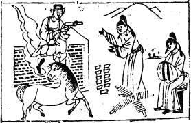

# 02坤爲地

  
此卦漢高袓與項羽交爭卜得之，乃知身霸天下。

圖中：

**十一箇口，一官人，坐看二串錢。一官人立受命，一馬，金甲神人在台上乘雲下， 綬文書與官，土堆上有四點。**

生載萬物之課 君倡臣和之象

一、十一口：吉也，陳姓人也。

卦圖象解

二、一官人：倌人，丈夫也。公務員也。 三、坐看二串錢：欲拿不得，憂心忡忡狀。四、一馬者：肖馬人；指官貴；指調動也。五、金甲神：示民心也。

六、授文書與官：授官封侯。

七、土堆上有四點：黑也，背有陰謀也。

人間道

 坤：元、亨、利牝馬之貞。

坤乃地之厚德，示人效地之性，如牝馬之柔順而健行也，貞示堅心，但與乾不同，乃堅心於柔順之念也。

## 君子有攸往。

君子因行柔順，且表裡一致，合乎坤地之德性。

## 先迷後得，主利。

陰從陽也，即不了解但知須從陽剛之中正，如不知而欲進，則迷錯，損失在己，須居於後， 則利，如君臣之道，柔順乃臣之職也。

## 西南得朋，東北喪朋，安貞吉。

西南為陰位，東北為陽位，陰必從於陽，陽之正而陰亦正，由陽剛之中正，去蕪存菁，故能成化育之功也。

## 彖曰：至哉坤元！萬物資生，乃順承天，坤厚載物，德合无疆。

坤之道大也，萬物因乾而始，因坤而生，猶父母之道，坤之德厚，故能持載萬物。

## 含弘光大，品物咸亨，牝馬地類，行地無彊，柔順利貞，君子攸行。

含弘光大此四者，用来形容坤道，含，包容也，弘，寬裕也，光，昭明也，大，厚且博廣。聖人有此四德，故能成天之功，牝馬因柔順而能行，故健。

## 先迷失道，後順得常。西南得朋，乃與類行；東北喪朋，乃終有慶， 安貞之吉，應地无疆。

因先迷而從陽剛之德，後必得理，西南為陰，同類而行，故得朋，東北陽方，離其類而喪朋，因離其類而從陽，故能成物之功也。終必吉，又因能安心堅守此道，則無所不可往矣。

## 象曰：地勢坤，君子以厚德載物。

坤地之道至大，聖人體之，君子以地之柔順且厚能載物之德處事。

## 初六：履霜，堅冰至。

聖人於陰之始生，知其將長，此時戒之， 猶人之履及霜，則知後必有堅冰，故小人始雖甚微，但絶不可使其長，長盛則凶也。

## 六二：直方大，不習，无不利。

聖人以地之直、方、大三德以盡地之道。直者，直來直往，不迂迴作假。方者，原則不因局勢而改變，且正。大者，容載萬物之胸襟乃大也。不習，謂順其自然，則無往不利。亦可云，因又直且方，氣勢乃大也。

## 六三：含章可貞，或從王事，无成有終。

六三居相位，為臣之道，如有含章之美， 即不居其功，將善歸於君王，乃可因王無忌惡之心，終必吉。

## 或從王事，知光大也。

象曰：履霜堅冰，陰始凝也，馴致其道，至堅冰也。

陰始凝為霜，渐盛則至堅冰，故聖人戒小人於初，如任小人因循不阻止，則終至凶。故吾人須戒之於初，小人表面常有可憐，博人同情，示弱以求憫恤，實則內心有所圖，今人不知濟弱扶倾與姑息養奸乃一線之差，一昧以濟弱扶倾為自傲，殊不知其姑息養奸，而至今小人才盛。

## 象曰：六二之動，直以方也，不習， 无不利，地道光也。

地道之光顯，由其直且方大，人人順其自然，則奸人何所遁形，無往不利。

## 象曰：含章可貞，以時發也。

處臣下之道，不當有功，免招君忌，但義之當為時，須立行之，此因不有其功，不失其宜，皆因時也。今人含而不為，皆不忠之人。

聖人知含章之光大，故能養晦，小人有善唯恐人不知，此君子小人之分野。

## 六四：括囊，无咎，无譽。

六四為居近君之側位，藏口而不露，則平安無災，此沈默之功也。

## 六五：黄裳，元吉。

坤本論為臣之道，今臣居尊位，或婦人居尊位，须有黄裳之戒，應守中而居下，不可揚溢無節制，否則必有非常之變。

## 象曰：括囊无咎，慎不害也。

能隨時謹言，不妄言，此無害之因慎也。

## 象曰：黃裳元吉 ，文在中也。

因黃裳之美，乃內積至美，執中不過，位高但謙居下，故吉。

## 上六：龍戰於野，其血玄黃。

六爻為極盛之位，陰至極則陽至，故有抗爭，因六又再進不已，故必戰，戰必有傷，故血色現，天之血色為玄，地之血色為黃。

## 用六：利永貞。

此為用陰之道，如乾有（用九）之道同。陰道柔而難常，有朝令夕改之憂。故利在常而堅固。

## 象曰：龍戰于野，其道窮也。

道因陰至極而無道，故有龍戰於野之象現。

## 象曰：用六永貞，以大終也。

聖人自此悟之，始終如一，堅心不變，必利，其終極必大。今人朝夕所思不同，自視甚重，角色不能認清，小人有太過之行為，常人從俗只見愚善，致小人極盛，積非成是，故積重難改。

## 文言曰：坤至柔而動也剛，至靜而德方。後得主而有常，含萬物而化光， 坤道其順乎？承天而時行。

坤之道雖柔，但如動亦須剛，坤之體至靜，但其德也须方正。動而不違方正。再得同道之呼應，成萬物光大之功，故坤道之順大，皆因王時之至也。

## 積善之家，必有餘慶，積不善之家，必有餘殃。臣弑其君，子弑其父，非一朝一夕之故；其所由來者漸矣，由辨之不早辨也。易曰：履霜堅冰至，蓋言順也。

學者讀此段，必可自悟矣。故聖人戒小人於初，其道大也。

## 直其正也，方其義也；君子敬以直内，義以方外，敬義立而德不孤， 直方大，不習无不利，則不疑其所行也。

君子外敬內直，堅守義以方其外，故內敬直，外義方，其德之盛，順其自然，不须裝飾， 無人會疑其所行也。

## 陰雖有美含之，以從王事，弗敢成也。地道也，妻道也，臣道也， 地道无成，而代有終也。

臣下之道，不表其功，含晦以為王行事，至終而不敢有其功，如地道代天終萬物，而成功又歸之於天，妻之道同此。今之妻如何，吾人試自問之？

## 天地變化，草木蕃。天地閉，賢人隱。易曰：括囊，無咎無譽，蓋言謹也。

天地相交，則能興發草木，天下因君臣相往而道亨。今天地隔絶，萬物不成，猶君臣無道， 賢者隱退，此時易道為閉口含藏，雖無聲譽，但無災，皆因言論謹慎也。

## 君子黃中通理，正位居體，美在其中，而暢於四支，發於事業，美之至也。

君子知謙守下之道而通於事理，居君王位故美積其中，暢於四體，現於事業，此美之極也。此段乃示柔中有剛，乃至大至美，今人有柔善而無剛，或過剛而無仁，皆不足之美也。

## 陰疑於陽必戰，爲其嫌於无陽也，故稱龍焉； 猶未離其類也，故稱血焉。夫玄黃者，天地之雜也，天玄而地黃。

中醫之至道在此，陽大陰小，陰乃從陽，故經方派乃用陽藥，如人間亦然。如令陰到極盛， 陽受陰盛而外走，此不相從必戰，傷而見血，天地之色變，亦言傷之大也。

第 9页

