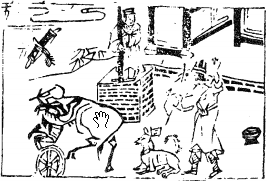

# 03水雷屯

  
此卦季布遇難，卜得之漢推其忠，乃赦其罪。

圖中：

**人在望竿頭立，車在泥中，犬頭上回字， 人射文書，刀在牛上，一合子。**

龍困淺水之課 萬物如生之象

==雲雷之興，陰陽始交，而未成澤，故為屯，如成澤則為解，此卦動於險中，乃屯之義，如陰陽不交則否，此時機乃天下屯難，未亨泰之時也。==

卦圖象解

一、人在望竿頭上立：此不明局勢之屯難時也，不可妄動也。二、犬上回字：乃肖狗之人，狗年，狄姓之人，果為哭之象。三、車在泥中：進退兩難之象。刀在牛上：解也，牛為貴人象。四、人射文書：張姓，小人阻礙也。射：同音，色也，緋聞。五、牛不順道：背道而馳，反其道而為之，吉。

六、人望：人亡也。七、人立：在位也。八、盒：先成後破。

九、牛回頭視犬：計無所出，待也。

## 卜得此卦：動於險中，先成後破也。

人間道

屯：元、亨、利、貞，勿用有攸往，利建侯。

此義處屯之時必貞固（堅心），須明非獨力能成，必廣資助，此利見侯之義。不可往，唯利建侯。

## 象曰：屯，剛柔始交而難生，動乎險中。

剛柔始交而未通暢，則難屯，難生，於此之時，如動即往，乃取險之道。

## 大亨貞，雷雨之動滿盈。

此言屯有大亨之道，得陰陽交而和洽，則成雷雨，充滿天地之間，此因貞固才能出屯。

## 天造草昧，宜建侯而不寧。

天時造出地上之草，亂而無序，此暗昧不明時，須建立輔助，可以有助矣，此聖人之戒。

## 象曰：雲雷，屯。君子以經綸。

水未能成雨為雲象，君子觀屯象，知須立法規範來經營此時。

## 初九：盤桓，利居貞，利建侯。

初而陽爻居下，意乃剛明之才，當屯難之時，而居下位。此時未便往濟，故盤桓。如遽進，則犯險遇難。此即示人處屯難時，須守正方是，現今之人，鮮少人於屯難之時守正。聖人戒之於屯時。

## 以貴下賤，大得民也。

象曰：雖盤桓，志行正也。

聖人處屯時，雖有濟屯之志，仍盤桓不動， 因時未至也。此居下位之念。

初陽之剛健，居陰之下，此易以貴下賤之象。即處屯之時，陰柔不能存，唯一陽剛之才， 則眾所歸從也。更加此人能自處卑下，所以大得民心。

## 六二 ：屯如邅如，乘馬班如，匪寇，婚媾，女子貞不字，十年乃字。

此陰爻之柔居屯世。受逼於初剛健之人， 故柔處屯時，無法自濟，又受下之陽剛所逼， 為難為也。非理而至者為寇，柔守中正不苟合於初剛之意，須十年久久乃通。

## 象曰：六二之難，乘剛也。十年乃字，反常也。

此六二患難，因柔，又居屯時，又有下之陽剛所逼，此患難乃因柔而生，須十年，難久必過。如反其柔之常性，而與陽剛合，則省十年，十為數之終也。

## 六四：乘馬班如，求婚媾，往吉， 无不利。

此以柔順居近於君位，此得之於上者，而才不足以濟屯時，須求賢自輔，則往而利矣。此即居公卿之位，己之才不足以濟屯難之時， 若能求在下之賢人，親而用之，則必平安有利。

## 九五：屯其膏，小貞吉，大貞凶。

五居尊位得正，當屯時，若有剛明之才為位，則利。如無，則屯其膏，此因無良臣，而施為有所不下於民，民未得其德澤，乃因威權不在己之故也。此屯因威權已去而妄想瞬間正回，此求凶之道。须以渐正之，方吉，如不為會因當屯時不改，以至於亡矣。

## 上六：乘馬班如，泣血漣如。

六此以陰柔居屯之終，此險之極而無援， 居之不安，動無所向，此窮厄之

極，若陽剛而有助，即屯至極，亦可平安互濟矣。

## 六三：即鹿无虞，惟入于林中，君子幾，不如舍，往吝。

此陰爻居三之陽位，此意柔居剛而不中正，則必妄動，貪於所求，必不足自濟，此不安之源。如入山林射鹿，又無嚮導，此不安也。君子見事於微，捨而勿逐，如往取，徒取其咎也。

## 象曰：即鹿无虞，以從禽也，君子舍之，往吝窮也。

事因欲而妄動，此貪禽也。處屯之時，不可動而動，凶也。君子捨之不從，則無咎，如往必困窮也。

## 象曰：求而往、明也。

知己才之不足，往而求賢，以濟己之不足、此乃真明也。

## 象曰：屯其膏，施未光也。

膏澤不下及，此人君之屯也，乃因威權不在之象。

## 象曰：泣血漣如，何可長也。

如於屯難窮極，而莫知所為，則至泣血顛沛，則必不長久。

