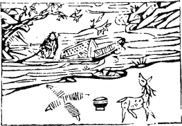

# 04山水蒙

  
此卦王莽篡漢社稷卜得知，乃知漢家必有中與之主。

圖中：

**一鹿一堆錢，一合子，李樹一枝子折， 二人江中撑船，珍寳填塞。**

人藏祿寶之課 萬物发生之象

艮為山，為止，坎為水，為險。山下有險，遇險而止，莫知所之，蒙之象也。

卦圖象解

蒙卦有示吾人去蒙之道。反觀之，如人以蒙蔽之法示人，勢必有所圖也。圖中：

一、滿船珍寳：暗示人圖財之象。二、船在水上：乃離國他去象。

三、鹿在地上，示仍有小祿於內，鹿—祿也。

四、兩串錢：乃憂心忡忡象，即意雖有祿，但仍令人憂心。

五、圖中一碗：示此蒙蔽手段，必先成後破，因其乃不正之財，必不久遠也。六、李樹子折：示人李姓人氏，且有子夭折之象，則成格。

人间道

## 蒙：亨，匪我求童蒙，童蒙求我。初筮告，再三瀆，瀆則不告，利貞。

兒童之蒙，其未發蒙，而志則專一，此為童蒙，因有童蒙，則告之。因其童蒙，故必至誠一意以求必中。而發蒙之道，必以貞正方吉。

## 象曰：蒙，山下有險，險而止，蒙。蒙亨，以亨行，時中也。匪我求童蒙，童蒙求我，志應也。

此因剛賢之才居九二爻位，處於下位。六五之童蒙，處於君位。九二之賢臣，必以時中也。時之義，必待其至誠一心之童蒙求問，方以告之，乃中與。如賢能之人處下，而自求為進，主動告以君，則必無被信用之理。故如方法正確，非二求於王君位，實為五之志應於下二也。此為「時中」也。

## 初筮告，以剛中也，再三瀆，漬則不告，瀆蒙也。

此言，如誠一而來求決其蒙，當以剛中之道開發之，如煩數不能誠一，則乃瀆蒙，此時， 不當告。因告之必不能信受，徒以煩瀆，無益矣。

## 蒙以養正，聖功也。

此申利貞之義，養蒙之法，必以正道，此時乃純一未發之童蒙時，故養正於蒙，乃學之至善也。現今人類皆「教而後禁」，故難以教勝，故時風日下。

## 象曰：山下出泉，蒙，君子以果行育德。

此蒙之象也，如人蒙蔽，未知所適從狀。君子此時，必以果決其行，使通行無阻。如始生而方法不對，則以養育其明德為教法。

## 初六：發蒙，利用刑人，用説桎梏， 以往吝。

初六之爻屬最下位，此言，發下民之蒙， 须明刑禁以示之，使之知懼，從而教之。是故為政之始，立法居先，治蒙之初，威以刑者， 是以使民去其昏蒙之桎梏。不設法去其蒙之桎梏，即善教亦無法改變其蒙，故聖人使下民畏威以從，不敢任意其昏蒙之欲，然後才能漸知善道，此為移風易俗之唯一法門。但只有初爻之始可用之，如專用刑以為治，則蒙雖畏，終不能发。

## 九二：包蒙吉，納婦吉，子克家。

九二有剛明之才，與六五之君相對應，其志又一同，當其時，必廣其包容，老人婦孺之見，皆包容，則能啓天下之蒙，功大矣。今人專持其明，漫用自任，致凶之道。是故古之堯舜，其聖功天下莫及，尚能請教下民，取合理之言，天下之民歸之，就如兒子能治其家一樣

## 六三：勿用，取女見金夫，不有躬， 无攸利。

三爻之位陰居之，此時機正應上位不能遠從近見，九二為群蒙所蔽，居此之時，無所往則利矣。猶女之嫁夫，當由正禮，如見人多金， 悦而相從，不可取也。

## 六四：困蒙，吝。

因六四之陰爻，離剛賢最遠，無由來發其蒙，終困於昏蒙也，其永不足矣。

## 六五：童蒙，吉。

此示柔順之人居君位，下應於二，乃示柔中之德，任剛明之才，如此能治天下之蒙，吉也。為人君者，如至誠用賢，以成功惠於百姓，此功亦猶如己出一樣，何須顧忌手下，功高震主。

## 象曰：利用刑人，以正法也。

此即用立法制刑，以教人之意，萬不可不教而誅。後世之論刑者，不復知教化孕其中， 只一昧的論刑。

## 象曰：子克家，剛柔接也。

兒子之能治家，其因父之信任專一也。是故九二能成啓蒙之功，乃由五之信任專一也。此剛柔相接之義也。

## 象曰：勿用取女，行不順也。

此女不可取，因行不順故也。

## 象曰：困蒙之吝，獨遠實也。

此義昏蒙之人，不能親賢以致困，終不得明矣。實，陽剛也。

## 象曰：童蒙之吉，順以巽也。

從人之言，只要合理，都能接受，順也。降尊位下求，巽也。君能如此，天下治矣。

## 上九：擊蒙，不利爲寇，利禦寇。

陽剛居蒙之極，爻之終，示吾人知，人之愚蒙至極，而為宼為亂者，當擊伐之，故戒不利為寇。

## 象曰：利用禦寇，上下順也。

禦寇之限度，上不過暴，下得撃去其蒙， 則上下皆得順矣。

