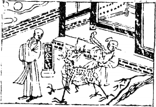

# 05水天需

  
此卦蔡順遇赤眉贼，卜得知，乃知必脱大難也。

圖中：

**月當天，一門，一人攀龍尾，一僧接引，一墓。**

**雲靄中天之課 密雲不雨之象**

==蒙之後須養，此需之時也，飲食之道也。雲之上於天有蒸潤之象，就如同飲食之於人一樣， 此養之時，乃待也。乾之性健，必採進法，仍處坎險之下，故須待而後進，即外險內健，此卦之象，乃真養之義。==

# 卦圖象解

一、月當天：陰人居上位象，無擔當也；清明無災。  

二、 一門：豪鬥也，官府也。

三、一人攀龍尾：附於貴人，想進據其位也。

四、一僧接引：光頭之人，柔而無慾之象。入空門可解。  

五、墓：藏棺之地，有官與財象；置之死地而後生之象。

**全意，即使如龍之力大，但動不以時，則有入墓之險，此動為求官與財。佛理亦同：『生死一線，無死焉大生』。**

# 人间道

**需：有孚，光亨贞吉，利涉大川。**

==以二卦體而言，乾以剛健，如上進而遇險，此未可進也。需待之。以卦之爻言，五爻陽居陽位，乃陽剛中正之德人，居君位，而誠信充實於內（內卦為乾），則光明而可進，必亨，故利涉大川。==

## 彖曰：需，須也，險在前也，剛健而不陷，其義不困窮矣。

因險在前，未可遽進，须待而進，以乾之剛健，能待而不輕動，則不陷險中，則必不至困窮。時下剛健之人頗多，其動必躁，如能待時而動，則為至善之道。

## 需：有孚，光亨貞吉，位乎天位以正中也。

孚，中實之義。五位因剛實居中，此孚之象，此居天位而能正中，光明而亨通，且須貞正（堅心），吉也。

## 利涉大川，往有功也。

因中實（內之學問、操守）而貞正（堅心向道），即涉險阻，亦可有功也。故需之道在以乾剛之性而知待之道，何所不利。

## 象曰：雲上於天，需，君子以飲食宴樂。

此自然之象，水上於天未成雨，為雲。猶君子積蓄其才德，而未施於用也，懷其大才，安以待時，飲食以養身體，宴樂和其心志也。

# 初九：需于郊，利用恆，无咎。

初爻因最遠於險，故於郊（曠遠之地）， 故君子處於曠遠之地，仍安守其常，則無咎災也。如躁進犯難，則必災至矣。

## 象曰：需于郊，不犯難行也，利用恆，无咎，未失常也。

君子處下野，不冒犯險難而行，復宜安處， 不失其常，保持恆靜心亦不動，如雖不進而志動，則不能安其常也。

# 九二：需于沙，小有言，終吉。

坎為水，水近則有沙，此二爻之位近險， 故需于沙。君子知渐近於險難，雖未至於害， 已小有言矣。此示言語之傷，至小者也。二爻以陽爻居之，示人陽剛之才居陰柔位，守中正之德，雖小有言語之傷，而无大害，終也吉。

## 象曰：需于沙，衍在中也；雖小有言，以吉終也。

此寓，二位雖近險，而如以寬裕居中，即小有言語之傷，及終得吉。

# 九三：需于泥，致寇至。

泥，逼近於水也。因逼近於險，而致寇難之至，此居健體之上，有進動之象，苟非謹慎， 終致喪敗也。

## 象曰：需于泥，災在外也。自我致寇，敬愼不敗也。

三位居上險之最近，故云災在外。此寇致之因，實乃己之逼也。須敬慎小心，量宜而進， 則无喪敗。義在相時機而動，戒之盛也。即盛時須戒之象。

# 六四：需于血，出自穴。

第四爻位以陰柔之質居於險，下又有三陽之進，必傷於險難。因傷於險難，必不可安居， 而失其居所，故出自穴。此順時以從，不競於險難，則不至凶也。又無中正之德，只以剛競於險，此適足以致凶之道也。

## 象曰：需于血，順以聽也。

意為陰柔之性居近險之位，不能處，則退， 以順從而聽於時，不至凶也。

# 九五：需於酒食，貞吉。

此五君位，陽剛之人居中，只需宴安酒食以待之，所需必得也。堅心，必吉。

## 象曰：酒食貞吉，以中正也。

陽剛中正居五之君位，只需酒食，即可盡其道也。

# 上六：入于穴，有不速之客三人來， 敬之終吉。

陰柔於六位，乃需之極限，須安其處，此入於穴之義。安而止居，則下之三陽必來。不速，不促之而自來也。此時須以至誠盡敬之心以待之，雖再剛暴，必無欺凌之理也，此因六位陰位，非三陽乾體之人，志在必奪，故敬之則吉。

## 象曰：不速之客來，敬之終吉；雖不當位，未大失也。

此不當位，意為以险而在上也。聖人明示陰宜居下而今居上，此不當位也。但如能謹慎自處，則陽再剛亦不能欺，終得其吉。