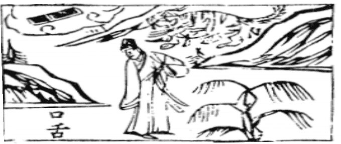

# 06天水讼

  
此卦漢高祖斬丁公，疑惑，卜得之後，果遭戮也。

圖中：

**口舌二字，山下有睡虎，文書在雲中， 人立虎下，望口舌，柳樹在旁。**

蒼鷹逐兔之課 天水相違之象

==人之所需飲食也，因有所須，爭訟之所由起。天陽上行，水性就下，其行相違，所以成訟也。卦義：外健內險之象，必有訟。==

卦圖象解

一、口舌二字：官司，糾紛，災也。二、山下有睡虎：入危地而不知象。三、虎：王姓，肖虎之人。

四、文書在雲中：心想事不成，幻想也。 五、人立虎下：近險也，近險為脱險之道。

六、柳樹：隨風而動，雖大風而不斷，此柳之性也。〔韓信之辱，即柳性〕

人间道

 訟：有孚，窒惕，中吉，終凶。

訟之道，必中實，如中無有實，乃誣妄，凶之道也。訟，乃與人爭辩，而待決於他人，雖有孚，仍會窒塞。故有得中實則吉，但終極其事則凶也。

## 利見大人，不利涉大川。

因訟者求辩曲直，故利見大人，如大人能以剛明中正決其訟，吉。因訟非吉事，須擇安地而居，不可陷於險難，故不利涉大川也。

## 彖曰：訟，上剛下險，險而健，訟。

此內險外健，訟之所起。若健而不險，不生訟也。險而不健，不能訟也。猶如一人，只重外飾，內無真實材料，此為訟之源也。

## 訟，有孚，窒惕，中吉，剛來而得中也。

訟之，有中實剛健，但處訟之時，雖有中實，仍有阻礙而須惕懼，則吉。

## 終凶，訟不可成也。

因訟本非善事，乃不得已也，終極其事，則凶矣。

## 利見大人，尚中正也。不利涉大川，入于淵也。

如見中正之大人，吉。與人訟必先居於平安之地，任意行險，則身陷。

## 象曰：天與水違行，訟，君子以作事謀始。

此因天上水下，二卦體相違，訟之由也。君子觀象，知人有爭訟之道，故行事必「慎始」， 絶訟端於事之始，則訟不生矣。

## 初六：不永所事，小有言，終吉。

此陰柔居下位，必不可終極其訟也。若不終極其訟，雖小有言傷，而終得吉。

## 九二：不克訟，歸而逋，其邑人三百户，无眚。

二爻與五爻為相應之地，九二乃將位，以剛處險，與五之君位為敵，知不可敵，歸而避之，儉樸自處，則無過矣。三百户，乃邑之至小者，如處強大，此競也，則必過也。

## 六三：食舊德，貞厲終吉。或從王事，无成。

陰爻居三陽剛位，乃陰柔居二剛之間，须知雖處危地，能知危懼，終必獲吉。守原之本分而無所求，則不生訟矣。或從上而成，因從王事，故不在己也。訟乃剛健之事，故始則不永，三則從之，皆可使善也。

## 九四：不克訟，復即命，渝安貞， 吉。

此陽剛居乾下，因不得中正，本必訟。故四爻剛位陽居之，雖剛健欲訟，而無與對敵， 則訟無由而興。此即若能克制剛忿欲訟之心， 就於命，革其心，平其氣，而變為安貞，吉矣。孟子云：「方命虐民，夫剛健而不中正，則躁動，故不安，處非中正，故不貞，不安貞，所以好訟也。」方，不順也。

## 九五：訟，元吉。

九五居尊位，治訟得中正，則大吉而盡善。

## 上九：或錫之鞶帶，終朝三褫之。

剛健之極，處訟之終極，人因其剛強，窮極於訟，取禍喪身，即使善訟能勝，即賞，亦來自與人仇爭所得，其能保乎。終一日而見三次褫奪也。

## 象曰：不永所事，訟不可長也。雖小有言，其辯明也。

此即於訟之初，即戒訟，因柔弱而居下， 不可長久。因既訟，必有小災，應辩理之明， 終得其吉。

## 象曰：不克訟，歸逋竄也。自下訟上，患至掇也。

因義不敵，故不能訟，須避去其所。自下訟上，義不正，且氣勢不足，此招禍患之至易也。

## 象曰：食舊德，從上吉也。

守其本分，順從上之所為，非由己意，終也吉。

## 象曰：復即命，渝安貞，不失也。

能如上，則無失，吉也。

## 象曰：訟元吉，以中正也。

此云中正之道，施必吉也。

## 象曰：以訟受服，亦不足敬也。

窮極訟事，即有受命之寵，亦不足以敬， 而可賤惡，禍患隨至也。

