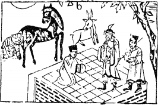

# 07地水師

  
此卦周亞夫將欲排陣，卜得之，果獲勝。

圖中：

**虎馬羊待命，將軍臺上立，一文一武綬印，人跪台上受印，棋盤在下。**

天馬出群之課 以寡服眾之象

師之興，因有爭議也。此卦本體上順下險之象，亦即地下有水，內外分即內險外順，有行險之道如何順行之義。水在地下必聚，如部隊之集結，如九五為一陽，餘為諸陰，則為天子之象，今九二為將位，統帥諸陰，則為將帥之象。此卦申明處師之時，內須戒慎警惕，不可掉以輕心，外須統一專權，命令如一，方能行順之義。

卦圖象解

一、肖虎、馬、羊之人三合：可戰。二、文武二官綬印：得萬人服之帥。

三、人立棋盤上：圍棋愈下愈多，但須有謀略方可成事。 四、將軍臺上立：示有兵權也。生殺之專權也。武職大利。

五、羊回首：回陽也，病危之人卜之，有自陰間回陽間之象。六、虎在馬後：為馬之靠山，馬因虎威而動。故馬回首視虎。

人間道

 師：貞，丈人吉，无咎。

此言，師之道必有正名，因師之與，天下萬民必傷，如不以正，則民心不從，致凶之道。丈人，即尊貴有眾望之人，故出師必立帥將，此人必民所聽從順同，不能服眾人，安得民心。如此則無災。故興師必有二道：正名與主將。

## 彖曰：師，眾也；貞，正也，能以眾正，可以王矣。

師為帶眾之道，必以正，如能使眾人皆正，即可王天下。此用師之正道。

## 剛中而應，行險而順。

出師之將帥，須得君王之專信也。此王者之帥，民心從之，雖有險必順矣。

## 以此毒天下，而民從之，吉又何咎矣。

如從前面所論之師道下手，則雖因出師傷下之百姓，民仍從之，故吉而無災。

## 象曰：地中有水，師，君子以容民畜眾。

水在地下相聚，為眾聚之象，君子之人須以包容民眾，為使民順從之法。

## 初六：師出以律，否臧凶。

師之出，必以誅亂制暴而動，行師之道， 须以律法，合於義理，如不按此法，即致勝亦凶。

## 九二：在師中，吉，无咎，王三錫命。

此言九二之道，為為將之道，君之事為人臣絶無敢專權，但出師作戰之時，則將在外君命有所不從，君王須順從其命，以專信任之。

## 六三： 師或輿尸，凶。

輿尸，眾人為主也。此言師旅之事，任當專一，須以剛中之才居上為信，乃得成功。如不這樣，而以眾之意見為主，凶之道也。

## 六四：師左次，无咎。

左次，乃知不可進而退。此言，師之常法， 見可而進，知難而退，進退有據，平安無災。六四為陰爻，主陰柔，而師必以強勇，中有陰柔，即兵家之風、林、火、山同義。

## 六五：田有禽，利執言，无咎。長子帥師，弟子輿尸，貞凶。

五為君之位，此為興師之主，此君主興師任將之道。師之興，必以生民受災，蠻夷賊寇， 此正名以誅之。如禽獸之入於田中，害五穀， 於義宜獵取，則獵取之，如此之動，則吉。如無禽獸入田，則出不因禽，凶。此有禽之義。

## 上六：大君有命，開國成家，小人勿用。

師之終極，言功之成也。此時君主以爵位財祿賞賜有功之人，並任用之。但於軍旅征戰中，查覺出之小人，不能因其有功而任用之， 致凶之道。

## 象曰：師出以律，失律凶也。

師出必有律法，失律法，致凶之道。

## 象曰：在師中吉，承天寵也。王三錫命，懷萬邦也。

人臣如無君之專寵，則不得專制之權，更何論成功。

## 象曰：師或輿尸，大无功也。

如倚二三人以上，必誤之時也，不但無功， 凶禍至矣。

## 象曰：左次，无咎，未失常也。

言師之道，退亦未必為失道，退須得宜， 無災。

## 象曰：長子帥師，以中行也，弟子輿尸，使不當也

任將授師之道，必以長子帥師。此長子義， 非定為真長子，而示意為任用可信任之如長子者，可以為帥，以其專任後之權必大，故必有信：方可。若以眾人主之，無主將帥之師，雖名正出師於義，亦凶道也。

## 象曰：大君有命，以正功也。小人勿用，必亂邦也。

君王有持恩賞之權柄，来表揚軍旅之功， 小人雖亦有賞，用之必亂邦，史上小人持功而亂邦，有太多案例了 。

