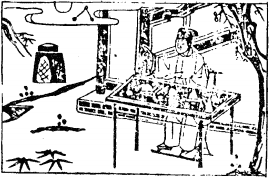

# 08水地比

  
此卦陸賈將説蠻，卜得之，果勝蠻王歸也。

圖中：

**月圓當空，秀才望月飲酒，自酌自斟， 藥爐在高處，枯樹開花。**

眾星拱比之課 水行地上之象

==師之後，師者眾也，眾聚有相比親也。比，相親也，有眾則必有比，故次師也。物之相近莫如水與地，永遠相比附，故卦體為水在地上，地上有水象。水為險，地為順，故外險內順為比卦。險猶戰戰兢兢，恐得罪人象，內心又持順之地道，有坤厚之德性，此比之道也。==

卦圖象解

一、月圓當空：政治清明象。

二、三星拱照：得賢能剛直之人輔助。

三、秀才望月飲酒：示才智之人無憂也。\(亦示：作秀之人，於政治清明時，無法出頭〕四、自酌自斟：無慾則剛象，孤獨之象。

五、藥爐在高處：無病無災，故不需用藥也。

六、枯樹開花：晚發也。示心有誠，制度立，事必成。七、酒：忘憂之物。

## 全卦：上位清明，三台輔佐，人將無憂，即使枯樹亦能開花。

人間道

比：吉，原筮，元永貞，无咎。不寧方來，後夫凶。

==比為吉之道。人相親比，必有其道，須視可比而決定比之，不可比而比，凶。如果等到不能自保安寧之時，方開始求親比，幸運的得所親比，可得平安。但如仍獨立自持，求親比之想法不前反後，即使是丈夫之親人，亦招凶矣。==

==是故君王亦懷柔天下，下位之人亦和親其上，未能獨立也，平日即須有此志，天地之間， 沒有不相親比而能獨立生存的。==

==相比之道，须兩志相求，如互不相求則為睽卦，故戰國策〈中山策〕有同慾相憎，同憂相親之理。所以好的制度，能使人有所依從，故能互相親和也。==

## 彖曰：比，吉也。比，輔也，下順從也。

因相親比為吉之道，有相輔相成之意。但求比之道，須如臣下順從君上一樣，即使地位相同，或上下有別，決不可因持於己之高位，而忘順從之道，此乃真比之道。

## 原筮，元永貞，无咎，以剛中也。

元、永、貞為相比之道。元為君長之道，永為可以長久，貞謂得正道且堅其心志，人有此三德性，再以陽剛當君主之位，此為君之德也。如此之君主可以無災矣。

## 不寧方來，上下應也。

上位之念，應知君不能獨立，须保民以此為安。下民知己不能自保，須擁君以求寧，此上下相應之理。如以王之私而行為之，不求下民之附和，凶危立至矣。

## 後夫凶，其道窮矣。

若眾人之志相和親，則無有不遂，此天地之道，若人之和親不行，則雖夫亦凶矣。

## 象曰：地上有水，比。先王以建萬國，親諸侯。

天地之間，物相親比，莫如水在地上，聖人觀比之象，以此建萬國，近諸侯，親近人民， 此比之極道。

## 初六：有孚，比之无咎。有孚盈缶， 終來有它，吉。

此為比之始。孚為中信，故相比之道，以誠信為本，表裡不一致，人誰近之。誠信充實於內，如於缶中之滿，且外不加修飾（它，外也〕，至誠以待之，則無不信。

## 六二：比之自内，貞吉。

自內言主之在己也。得正道，而與君道相合，此吉也。即以中正之道，合於上位之所求， 乃曰自內。今人汲汲以求比者，非君子自重之道，乃自失之道也。

## 六三：比之匪人。

相親比之人，如為不正當之人，即為匪人， 招凶也。

## 六四：外比之，貞吉。

六四之位，為近君之位。居此位之人，以柔性坤德向君主親比，且堅心順從，吉也。

## 象曰：比之初六，有它吉也。

此即比之道在乎始也。始即能中實誠信， 終吉，始無誠信，終凶。

## 象曰：比之自内，不自失也。

堅守己中正之道，以待上求，乃不自失也。此易之戒。故士人修己，方求上進之道。降志辱身此絶非自重之道。吾人救天下之心，並非不急切，乃因須待禮遇之至方出也。

## 象曰：比之匪人，不亦傷乎。

相親於匪人，必將得悔咎，傷之大矣，君子須深戒所親比之人。

## 象曰：外比於賢，以從上也。

六四之位從於五君之位，為外比。因五位剛明之賢為中正，故附從之，此從上之道，絶不可盲從。

## 九五：顯比，王用三驅，失前禽，邑人不誡，吉。

人君親比天下之道，须誠意以待物，恕已以及人，發政施仁，民之所好好之，民之所惡惡之，為民圖利，使天下蒙其澤，此盡善也。則天下亦盡親於上也。如表彰己之小功，展示自己的權力，違反道德人心，強力施為，致人心不信，社會浮華，人偷敗亡，如此而求天下親比是不可能的。就好比君王出獵，只圍三面開一面，禽獸前去者，免矣，此曰失前禽，只取來者， 此王道也。邑者，居邑，誡，期約也。此意臣之效於君，竭盡忠誠，用盡才能，以彰顯親君之道，此為正道。至於用之與否，決定在君，萬不可阿諛奉承，妄求君之親比也。朋友亦然，須修身誠意待人，至於是否願意與己相親，在人而己，千萬不可巧言令色，曲從苟合，以求人之相比。『此顯比之道』。

## 象曰：顯比之吉，位正中也。舍逆取順，失前禽也。邑人不誡，上使中也。

故顯比之所以吉，以其所在之位，得適中之法也。且比之道，须舍逆取順，孟子收徒之道： 往者不追，來者不拒也。三面圍網，所失唯前禽，即言此來者撫之，去者不追之理。

## 上六：比之无首，凶。

上六乃比之終極處。凡比之首，其始善， 終亦必善矣。多數人皆有其始，而無其終，但從未有人沒有開始，而有終善也。故此言，比之無首（首，始也〕，至終必凶矣。今天下之人，始親和比之時不以正道，至終必有隔閡， 此類人居多數。

## 象曰：比之无首，无所終也。

此即始不以道，則至終必也凶矣。是故交友之道，你來我往，你不來，我何往。如我往， 必有求，須以正，否則終將隔隙，互相仇視也。

