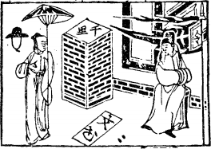

# 10天澤履

  
此卦子路出行，卜得之，遇虎拔其尾也。

圖中：

**笠子下一女，文書破，手中有傘，軍旗官人邊坐，堠上有千里字，地上兩點足印。**

**如履虎尾之課 安中防危之象**

==天地間萬物由畜道而止之後，有禮生焉，履者，禮也，故畜之後為履。所有物之聚大小不同，高下不等，有美惡之分，是故物聚後必有禮。人到何處，必有禮也。卦體天在上，澤在下， 上下區分，尊卑立見，此理所當然也。此以柔藉剛，謙卑而順，説禮之道也。澤有卑順之意， 卦象『外健內卑』，禮之本也。==

# 卦圖象解

一、女人在笠下：妾也。

二、千里堠：遠離外出封侯象。

三、文書破在地：憑證承諾無效象。  

四、傘下：有庇蔭也。

五、軍旗下官人坐：主有官司、訴訟、牢獄之災象。

六、二點在地：踐踏之足印也，示人處危之時，有禮之道，乃能行危而無殃也。

# 人間道

 **履虎尾，不咥人，亨。**

==有禮之道即入險中，如踐虎尾，不見其反食人，乃因有禮也，所以亨也。故常言伸手不打笑臉人，同此。==

## 彖曰：履，柔履剛也。説而應乎乾，是以履虎尾，不咥人，亨。

兌為澤，為悦，兌以柔順之藉乾剛，與乾剛相乎應，又有禮於下，故踐虎尾而不相害也。

## 剛中正，履帝位而不疚，光明也。

九五以陽剛又居君位，又得履道之善，此不病之因，乃得光明也。

## 象曰：上天下澤，履。君子以辯上下，定民志。

天在上，澤在下，尊卑有分，此天下之正理也。人之禮常如是，有禮乃行也。君子觀履象， 以辨上下之區分，來立民志，民因上下區分明顯而志定，自此乃可言治。立法複雜，民無所從， 治世將不再。是故人各安其位，此得其分內也，如佔位又不進德，除之，由君子進任，士人進修學識，到一定程度而君子求之。士農工商各行業之人，因所享有限，而能有定志，則天下一

心也。今人自下至公卿，日所志為尊榮，農工商人，日思於富侈，億兆之心交相為利，天下皆如此，心如何一致？要它不亂也難矣！皆因上下無定其志也。君子觀履，分區上下，使各當其位，用此以定民心之向也。

# 初九：素履往，无咎。

初處於下，陽剛之才可以進，但外則表現其卑下之位的素養，無咎。

## 象曰：素履之往，獨行願也。

安於有禮之往，因非為利也，乃各有其志也。如人有行道之心，又有名利之心，交戰於中，豈能安履。

# 九二：履道坦坦，幽人貞吉。

二為陰位，陽居，即意其待人之禮坦蕩蕩， 平易之道也。因為陽進，故須有防人嗤之禮數之誹，是以安幽清靜之心情處此時，則吉。

## 象曰：幽人貞吉，中不自亂也。

履之道(禮之道)在於安靜，其因正，則所履安也，心中躁動，則不能安於禮道，此即有禮於人，必以心中安靜，如以利欲交爭於心中， 必自亂。

# 六三：眇能視，跛能履，履虎尾， 咥人凶，武人爲于大君。

三為陽位，柔居之，乃志欲剛而體本柔， 不能堅心為履道。就如盲人之視而不見，跛人行路而不遠，意乃才能不足，又處時之不順遂， 則禮道非正，乃履於危地，因不善履道，入危地召凶，禍患立至，故咥人凶，就如武暴之人卻居人上，又任意為之，不知禮，乃凶之道。

## 象曰：眇能視，不足以明也，跛能履，不足以與行也。

陰柔乃才不足之人，視不明，行又不遠， 今又居剛之上，災難來矣。

# 九四：履虎尾，**愬愬**終吉。

在近君之側，知伴君如伴虎，愬愬，畏懼之貌，意如能畏懼，則終必吉。上位之陽剛， 雖近處，能敬慎畏懼，即入危地終亦必吉也。

## 咥人之凶，位不當也，武人爲于大君，志剛也。

此凶之致，乃因才不足，以武人為喻，其居陽剛之位，但才不足，又強出之，則所履不由本道，屬於志剛又妄動。

# 九五：**夬**履貞厲。

夬乃剛決之意，九五雖示君位之人，居此位，任意剛決而行之，即得正，仍危厲也。古之聖人，居天下之尊，仍納眾言，明足以照， 剛足以決，必以明而動，動則志剛，此之所以為聖也，若自以為剛明，決行不顧，即使行正， 亦屬危道也。

## 象曰：**夬**履，貞厲，位正當也。

居正當之尊位，須戒剛決自任，否則招凶。

# 上九：視履考祥，其旋元吉。

人之禮，須視其終，若始終完備，善之至也。今人淺視人之表面禮遇，而不考證其始終， 禮之至善，其『始終如一』方是。

象曰：**愬愬**，終吉，志行也。

畏懼之貌，入危而終吉，因本心在於能行己之志願，故須居此位，故為行其志，而示畏懼之態，終得吉，其志遂行。

## 象曰：元吉在上，大有慶也。

人之所以履善終能吉，貴乎有終，始終如一，禮之至極也。

