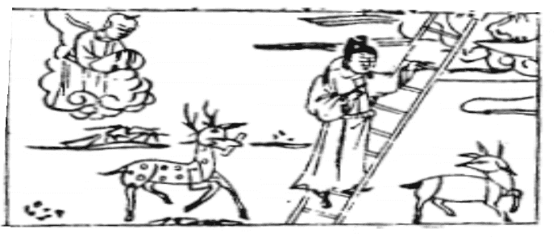

# 11地天泰

此卦堯帝將襌位，卜得之，乃得舜而遜位。

  
圖中：

**月中桂開，官人登梯，鹿銜書，小兒在雲中，羊回頭，地下亂點。**

天地交泰之課 小往大來之象

履之後（有禮而始終如一）則有泰，即履得其所，則舒泰而安也。故泰所以次履也，坤柔在上，乾陽居下，乃天地陰陽之氣相交合，萬物生成，故表通泰狀。卦象外柔內健，此為致泰之道。

卦圖象解

一、月中桂開：清明政治之時。

二、官人登梯：升遷順遂之意，官人亦倌人，即丈夫也。三、鹿銜書：受天子恩賜祿位。

四、小兒在雲中：少年得志象。得天官貴人助也。 五、羊回頭：回陽間也。亦楊姓人，發肖羊人成格。

人間道

 泰，小往大來，吉亨。

==陽氣下降，陰氣上升，陰陽和暢，萬物生焉，此天地之泰。人間之泰，大則居上，小則臣下，君王推誠任下，臣盡誠以事君，上下同志，朝廷之泰。君子，小人亦如是，君子處君位， 小人居下位，天下之泰也。==

## 彖曰：泰，小往大來，吉亨。則是天地交而萬物通也，上下交而其志同也。

陰往而陽來，天地氣相交，萬物通泰。人則上下之志相同，互相交通，人之泰也。「內陽而外陰，內健而外順，內君子而外小人，君子道長，小人道消也。」陽進陰退之時，故內健外順，君子之道也，君子在內，小人在外，此所以為泰。

## 象曰：天地交，泰。后以財成天地之道，輔相天地之宜，以左右民。

此示人君須體會交泰之道而為法制，使民用天時之宜，輔助教育人民之功，使民有財，輔助於民，民則必賴君上之法制，因法治之宜也，得其生養。

## 初九：拔茅茹，以其彙，征吉。

剛明之才，居於下位，遇泰之時，志而上

進，遇同志而行同道，因同類而進，吉。凡君子小人都須賴同類以助，未有人能獨立而不須朋類之助。

## 象曰：拔茅征吉，志在外也。

同類相聚，如拔茅之根相牽連，同欲上進。

## 九二：包荒，用馮河，不遐遺，朋亡，得尚于中行。

九二為將位，以剛明之才，五為柔順而得君位，上下之專信建立，此位乃治泰者，故治泰之道，主將位而能包荒，如人情放肆所為， 則政令緩，法度廢弛，治此之道，必有包含荒穢之量，詳密施政，去其弊端，則人安之。處泰之道，人之常情習於久安，惰於因循，不敢變更，用馮河，乃奮發改革之意，雖至小至微之事亦不可遺漏，自古立法治事，牽於人情， 卒不能行者多矣。如禁奢侈則害近戚，限田宅， 則防礙貴族之家，此治泰之難。遇治泰，須稟持公正之態度，即中行意。

## 九三：无平不陂，无往不復，艱貞无咎，勿恤其孚，于食有福。

三居諸陽之上，乃泰之盛時。聖人為之戒， 在下者必升，居上者必降，泰久而必否，故戒之。故當此時，不敢安逸，居安思危，則無災。故處泰之道須能堅貞，可常保泰。自古以來隆盛皆因內失道而喪敗下來。

## 六四：翩翩不富，以其鄰，不戒以孚。

翩翩，疾飛之貌，人富而從其類，為利也。不富而從其者；志同也。上三爻皆為陰，陰在上而失其中實之道，皆欲下從，故為不富而從， 此誠意相合也。如至六四位方戒已晚，居三為適中，知戒可保，四位則已過，必生變化。

## 六五：帝乙歸妹，以祉元吉。

為居君位，古之帝女皆向下嫁，帝乙制禮法，须降其尊貴，以順從其夫也。今六五以陰柔居君位，對應之九二為陽剛，乃能信之，而任用其賢且順從之，猶帝女之下嫁亦然，此成治泰之功也。

## 上六：城復于隍，勿用師，自邑告命，貞吝。

此致泰之終也，小人處之，行必否矣。掘隍土累積成城，如治道累積以成泰，今城土頹圮，又復返於隍也。勿用師，夫用師之道，必得民心，今民心不從，用師必亂，此時即自有天命任之，亦逄羞而凶矣。

## 象曰：包荒，得尚於中行，以光大也。

有包含荒穢之量，又配合中行之德，其道則明顯光大。

## 象曰：无不復，天地際也。

陽降於下，必復上，陰升於上，必復下， 此示人明天地交泰之道不常存之理也，聖人戒之。

## 象曰：翩翩不富，皆失實也；不戒以孚，中心願也。

因三陰在上，失其實才，欲行往下，不待其人富而鄰從，皆因失實故也。此已失乃方知戒之意，此時不待告誡而誠意相待，乃出於中心所願也。

## 象曰：以祉元吉，中以行願也。

其能任用剛中之賢，乃因已有中道與之合，志同相交也。

## 象曰：城復於隍，其命亂也。

此意城傾圮，又回歸隍土 ，即令命為正， 但亂已不可止矣。

