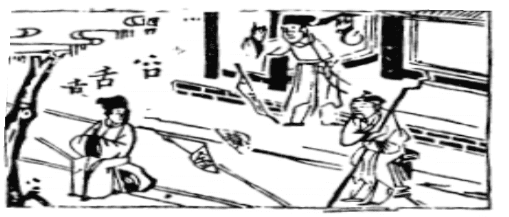

# 12天地否

  
此卦蘇秦將遊説六國，卜得之，果為相矣。

圖中：

**男人臥病，鏡破，人路上坐，張弓箭頭落地，人拍掌笑，口舌。**

天地不交之課 人口不實之象

上泰之終，六爻以陰柔（小人）處之，則為否之初。天地相交，陰陽相通，則為泰，今天在上，地在下，是天地隔絶，不相往來，故成否卦。

卦圖象解

一、男子臥病：男子為陽，陽同佯，裝病之象也。二、镜破：不可赴也。破鏡難圓之象。

三、人路上坐：小人阻路，不讓進也。四、張弓箭頭落地：鳥盡弓藏也。

五、人拍掌笑：幸災樂禍之小人，做假攻訐兩人感情得逞狀，夫妻凶。六、舌：主口舌，官司，謡言生害。

七、口上有四點：四點為黑，暗中誣陷之謡言，古人謂三口成虎，即意此。

人間道

 否之匪人。不利君子貞，大往小來。

==舉凡天地之間皆為人道，今天地不交，不生萬物，是無人道，故曰匪人。處此之時，君子不可堅心，因正道不行，小人道長之時。==

## 彖曰：否之匪人，不利君子貞，大往小來，則是天地不交，而萬物不通也。上下不交，而天下无邦也。内陰而外陽，内柔而外剛，内小人而外君子，小人道長，君子道消也。

天地不交，萬物不生。上下不和，則天下無治國之道。治世乃上位施政來治民，人民擁戴君王而願從命，上下相交，此治國之道。今君子居於外野，小人處於朝內，故為小人道長，君子道消之時也。

## 象曰：天地不交，否。君子以儉德辟難，不可榮以祿。

君子觀否塞之象為外健內顺(柔)。處否之時，損儉自己，避開禍亂。千萬不可榮居祿位， 戀棧不去。因小人得志之時，君子仍居顯位，則禍必及己身。反之，仍居顯位不放，乃真小人也。即內小人，外君子之意。

## 初六：拔茅如，以其彙，貞吉，亨。

否之在最下者，為君子也。因否而不能進者，君子也。處否而能進者，小人也。因在下位，又貞固其節志，同類而聚，雖不進升，但亦吉矣。

## 六二：包承，小人吉，大人否，亨。

六二本陰爻位，今陰柔居之，以小人而言， 其心所包容的，皆承顺上位之意，以求本身之利，此小人之吉。大人處否，則以道之陽剛自勉，絶不枉屈正道，奉承上位，雖身處否，但道仍亨也。

## 六三：包羞。

不中不正之人居否之時，位居相位，不能守道安命，極盡小人之能事，每日謀慮邪事， 無所不包，此羞恥之大也。

## 九四：有命，无咎，疇離祉。

居君側之人，最忌有居功招忌之事，因否時君道不正，即令有濟世之大才，亦不堪用。如能使事事出於君令，威柄皆歸於上，則

無災而可實現大志。當君子道行，同類必同進同出為天下黎民福祉著想。小人亦同進退也。

## 九五：休否，大人吉，其亡，其亡，

繋于苞桑。

處否之時，惟有陽剛中正之人居君位，能去天下之否，即大人吉。如循環至泰，亦須戒盛警惕否之復来，此其亡，其亡之意。此戒须如同苞桑，桑為根深蒂固之物，苞乃叢生之物， 其固更強，此為安固之道。此為聖人之深戒也。 繫辭：『危者安其位者也，亡者保其存者也， 亂者有其治者也。是故君子安而不忘危，存而不忘亡，治而不忘亂，是以身安而國家可保也。』

## 上九：傾否，先否後喜。

物極必反，泰極則否，否極則泰，故否之極，即否道將覆，則泰矣，故曰後喜。

## 象曰：拔茅貞吉，志在君也。

君子處否時而居下位，冀得同類而進，如遇小人，則堅守其節，但心仍在天下。

## 象曰：大人否亨，不亂群也。

處否而守其正節，乃為大人，不與小人同亂為群體，形雖否，但其道吉，此道必大。

## 象曰：包羞，位不當也。

居否時，所為邪吝，羞於公正，居此相位而不適，此不可以為正道。

## 象曰：有命，无咎，志行也。

凡事皆由君命而出，則無災，且大志得行。

## 象曰：大人之吉，位正當也。

因有陽剛中正之德才，又居君子之位，能去天下之否，故吉也。

## 象曰：否終則傾，何可長也。

否之終必傾危，絶無永否之理，但反危為安，易亂而治，必有陽剛之才，乃能做也，故否卦之上九能傾否，如屯之上六則不能去屯同意也。

