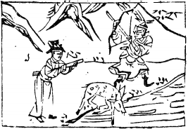

# 13天火同人

  
此卦劉文龍在外求官，卜得之，果衣錦還鄉。

圖中：

**人捧文書上有心字，人張弓，射山上， 一鹿飲水，一溪。**

**游魚從水之課 二人分金之象**

==天地不交則否，上下相同則同。`遇否之世，必與人同力方能渡過`。故次否也。以象言，天之性在上，火之性炎上與天同，故為同人。以卦體言，五為君位乾主，二為離位，陰柔居二爻。上下相同之義，天性剛健，火性明耀，即`外健內明`之象，吾人外剛健，內明道，則成天火同人，此為大同之道。==

# 卦圖象解

一、人捧文書上有心字：得民心之象，同心協力之象。寧姓。  

二、人張弓射山上：高中金榜。張姓人氏。

三、一鹿飲水：财祿滾滾而來。亦在野之賢人。  

四、一溪：平和安靜狀。

五、鹿之性，動則敏，靜則順，此剛健人之性，世間但聞虎食人，未聞鹿食人。

# 人間道

 同人：于野，亨。利涉大川，利君子貞。

==野即遠與外之意，以天下大同之道，聖賢大公之心，使之無遠不同。常人之同，以私意所合，此暱親之情。故必于野，方可謂大同。天下皆同時，何險阻能阻礙？何艱困能致危？故利涉大川，君子須堅心於此。小人唯用私意，所親比者亦為小人，朋黨之始，其心不正也。==

## 象曰：同人，柔得位，得中而應乎乾，曰同人。

二爻以陰居陰位，此為正位，得中正之德，應乎乾上，五為君位，以剛健中正，二以柔順對應，上下同心同德，故曰：同人。

## 同人于野，亨，利涉大川，乾行也。

乾之行，必至誠無私，故可以涉險難，而吉。無私，天德也。

## 文明以健，中正而應，君子正也。唯君子爲能通天下之志。

下體為有文明之德，上卦為剛健之性，此君子之正道。天下之志萬殊且異，但理則一也。君子因明理，故能通天下之志。聖人視億萬人之心為一心，因只一理而已。文明能使人更明理， 故能明大同之真義，剛健必能克已，則必能致大同之道。

## 象曰：天與火，同人，君子以類族辨物。

天在上，火之性炎上，此為同人，君子觀同人之象，以分類群族各以其性同來區分，如君子小人，善惡是非，物之外形固異，但事理皆同，君子能辨明。

# 初九：同人于門，无咎。

初進為剛健，此因無所偏私，出門在外因無私，而無咎也。

## 象曰：出門同人，又誰咎也。

出門在外，因同人之道而無私，同此道之人又廣，無厚此薄彼之異，則無人歸咎也。

# 六二：同人于宗，吝！

宗為宗黨也，同於所派系，此有所偏，故可吝。故只用宗黨之人則有偏私，此為鄙吝之人。

## 象曰：同人于宗，吝道也。

同人之道用於宗親，乃有所私，因私比， 非人君之道，故此為吝道。今人皆如是，莫若太宗之用人。

# 九三：伏戎于莽，升其高陵，三歲不興。

二以中正之道與君五位相同志，三以剛暴之人居二五之間，欲奪，然理不直，義不勝， 不敢發動，故只能藏兵戎於莽林間，時升高陵顧望，至三年之久，仍無機可乘，此小人之情狀。

## 象曰：伏戎于莽，敵剛也；三歲不興，安行也。

因三爻乃剛暴之人，其五君位為剛且正， 故畏忌而不敢與，即三年亦不與。

# 九四：乘其墉，弗克攻，吉。

九四乃陰位，陽剛居之，故以剛居柔位， 其近君位，知義不直而能復返正道，亦吉也。

三以剛居剛，故終其強而不可能反。此示人畏義能改則終吉。

## 象曰：乘其墉，義弗克也；其吉， 則困而反則也。

因同人乃一陰，而眾陽所同欲也。今獨三四爻有爭奪之意，乃邪不勝義，其困窮乃因反於法則，故吉。

# 九五：同人，先號咷而後笑，大師克相遇。

人君當與天下大同，如獨私一人，則非君道也。其同志為二爻，間隔有三四之剛，故未遇之前憤怒而號咷，即遇則大笑，故二人同心， 其利斷金，中誠所同，無所不同，天下莫能離間，則無所不入，故聖人赞之曰：『同心之言， 其臭如蘭』。

## 象曰：同人之先，以中直也；大師相遇，言相克也。

同人之先以中誠理直，故同心之力大，雖敵剛強，如大師相遇，由其義直理勝，終能克之也。

# 上九：同人于郊，无悔。

求大同之道，必相親相與，即在外又遠之地不同，但亦永無悔矣。

## 象曰：同人于郊，志未得也。

此申明同人之道，在外及遠之地求同之志不成，即無悔，但非最善之道。

