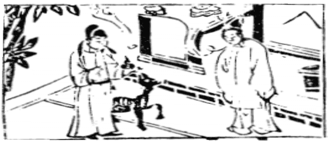

# 14火天大有

  
此卦藺相如送趙壁往秦，卜得之，果還壁歸趙也。

圖中：

**婦人腹中一道氣，氣中二小兒，一藥王，藥有光，女人受藥，一犬。**

金玉滿堂之課 日麗中天之象

同人之序卦，與人同者，物必歸，此天紀也。故大有為同人之序，物歸之後，乃大有也此卦，火在天上，火之處高，其明及遠，能照萬物，此為大有之象，一柔居尊位，眾陽應和，此居尊執柔，物乃所歸，上下相應，為天子之道。

卦圖象解

一、婦人腹中一道氣：妊娠之事；事萌於內也。二、氣中二子：主雙喜臨鬥。伯仲之間象。

三、一藥王：平安之象。得病有救，遇良醫也。四、藥有光：藥有名也，災中有救也。

五、女人受藥：女人為陰，示表面不信，但暗中仍聽之。

六、一犬：乃狗年，戌月，戌日，此論時機也；或狄姓人士。七、犬：哭笑皆有象。

人間道

 大有：元亨。

此乃以卦才而言，不言元亨利貞四德，乃恐與乾坤二卦相混淆，只言元亨乃盡元之義，元乃物之始，萬物生成之初皆為大善，因必有功用。此為大善之初，易經唯四卦，大有、蠱、升、鼎有元亨。其不與乾坤同，在乾為首出萬物，元始之象，在此四卦唯至善為大而已。

## 彖曰：大有，柔得尊位，大中而上下應之，曰大有。其德剛健而文明， 應乎天而時行，是以元亨。

此卦之所以為大有，乃因五以陰柔居尊位，又處以中庸大中之道，為諸陽所依歸，上下相應，此居尊執柔，有虛中之象，卦德內剛健而外明理，處事順乎天應乎人，此所以元亨。事於成後，方可見成敗，敗非先現於事前也。故有得後乃有所失，非得則何言有失乎？

## 象曰：火在天上，大有，君子以遏惡揚善，順天休命。

火因在天上，故能照見萬物，君子觀大有之象，故知治眾之道，唯遏惡揚善，此能順天命而安眾民心，天子之道即如是。

## 初九：无交害，匪咎，艱則无咎。

以陽剛之性處卑下之位，因未至於盛，故不有驕盈之慮，因無交往，故無害。人之富有於財或才，鮮不有害，富有本無罪，但人卻皆因富有而招害，乃因處富有而不知思艱戒盛， 則生驕侈之心，此所以生害也。

## 九二：大車以載，有攸往，无咎。

此位以剛健之才，居於陰柔之位，而為六五君位所信任，故無災。就如大車之材，強壯能载重物，可以任重行遠，往而無災。

## 九三：公用亨于天子，小人弗克。

九三居下卦之上位，為諸侯之位，諸侯雖享有土地之富，人民之眾，但仍屬天子所有， 此人臣之義。但小人居此位則專其富有以為私，不知奉上以公之道。

## 九四：匪其彭，无咎。

九四陽剛居大有之時，因近君位，如處之太盛，則致凶，彭為盛大之義，須謙損，方為吉道。

## 六五：厥孚交如，威如，吉。

人君之位，以陰柔守之，以誠信待於下， 下亦誠信待上，上下相交，此人心易安，但若專以柔順，則必生悔慢之心，故以威信，故君子柔中有威，使下屬有畏，其吉可知也。

## 上九：自天祐之，吉，无不利。

此位乃大有卦之終極，仍明之極意。人唯至明，故不居於已有，有極大之位，而不為已有，則無盈滿之災，君能至此，則合於天道， 得天之祐，則無往不吉。大同之世來矣。

## 象曰：大有初九，无交害也。

此即在大有之初始，即生戒心，須時思念艱難之時，此居安思危之來源，故能如此，則交亦無害也。故與人交往，持富有而驕，必生害也。

## 象曰：大車以載，積中不敗也。

大車能載重物，重物集中而不損敗，言九二才力之強，能勝大有之重任。

## 象曰：公用亨于天子，小人害也。

諸侯能守臣節，忠順奉上，慎養其眾，為王之徵用。若小人處此位，則不知奉上之道， 以所有為私有，故小人居此位，則有大害也。

## 象曰：匪其彭，无咎，明辯皙也。

明智之人，處此大有盛大之時，戒在咎之將至，以謙損態度應之，不敢至於極滿招凶之道也。故無災。

## 象曰：厥孚交如，信以發志也；威如之吉，易而无備也。

上下相交以誠信，互相呼應，上位如無威嚴，則下屬易生毁謾，故君須戒無威。

## 象曰：大有上吉，自天祐也。

大有至極處，本有變化，但由所為皆順天合道，此君子滿而不溢，故天祐之。尊尚賢人， 崇尚信義，故為上吉。

