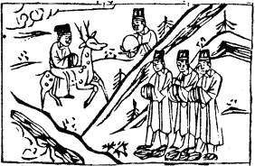

# 15地山謙

  
此卦唐玄宗因祿山之亂，卜得之，乃知干戈必息也。

圖中：

**月當天，一人騎鹿，三人腳下亂絲， 貴人捧鏡，文字上有公字。**

地中有山之課 仰高就下之象

大有至終必不可盈滿，故聖人受之序卦為謙。天之道盈滿，則必損地道，此卦為亦謙之義， 以自然界喻之，外卦為地，內卦為山，即山居地下，山乃至高大之物，而今居地下，此處卑乃謙之象，亦示人有崇高之至德，而處卑下，乃盡謙之義。

卦圖象解

一、月當天：清明之政，中秋時也。二、一人骑鹿：才祿俱備。

三、三人腳下亂絲，隱於山後：小人不敢正面示人，惟隱山謙之後(即外飾謙為幌子)實則亂如麻，計無所出。

四、貴人捧鏡：明鏡高懸，執法公正光大。五、文字上有公字：處事以公，得理也。

## 全卦：不知謙下自晦，果必招訟也。

人間道

謙：亨，君子有終。

有德而不居，為謙，人能以謙遜自處，無往不利。君子之志在達理，樂天命而無競之心， 但求內充，退讓而不衿持。能安於謙，終身不易。小人則有慾必競，此種人見有德之人必攻之， 即令有人告之謙遜，但終不能宽行固守。故小人，必不能有終也。

## 彖曰：謙，亨，天道下濟而光明，地道卑而上行。

君子明謙之道而能亨。天之道因其氣能下濟，故能生育萬物，故道乃光明，故君子知謙而能使其道濟天下萬民，地之道亦同天，因自處卑地，故能上交於天，是故天地二者，皆因能卑降而終亨通也。

## 天道虧盈而益謙。

天之道有日月五星，其隨時盈晦，故能降氣於地，生養萬物。

## 地道變盈而流謙。

地勢如盈滿，則必倾變而下陷。

## 鬼神害盈而福謙。

天地之道乃形而上之學，吾人可推理求之。鬼神人道乃形而下之學，吾人可親而見之，世間萬物必有其用，凡盈滿者，必有禍害，能謙損者，必有福祐之，猶今之西醫，其但知能如何除瘤用毒，不知損害之大，故後遗症之多，而自不見之。

## 人道惡盈而好謙。

人情必惡人之盈滿，好人之謙損，故聖人戒盈而勸人為謙也。

## 謙尊而光，卑而不可喻，君子之終也。

君子之道因謙卑而光大，至誠之念如是而終。

## 象曰：地中有山，謙。君子以裒多益寡，稱物平施。

高大之山在地下，故示人外卑下，內實高大乃謙象。君子有過則損之，不足則益之，以之用於事，使萬物皆平衡也。

## 初六：謙謙君子，用涉大川，吉。

最卑下之位以柔態處之，又謙讓也。能如是，君子也。即涉險難，必無凶也。

## 六三：嗚謙，貞吉。

二位以柔順居中，謙之德至此，則須明倡於外，見諸聲色，堅心如此，吉也。

## 九三：勞謙，君子有終，吉。

三為相位，以陽剛居之，上為君所任，下為民所從，能知勞而不居功，謙下待人，君子能行之至終，故吉。今上位掌權之人，盡皆示民其功勳為何，不知勞謙之美，此為小人之道長之時也。反之，能盡勞謙之道，必為君子。

## 六四：无不利，撝謙。

四體居近君主之位，此時因六五之君，以謙柔自處，九三之相位，又因大功德為上所用， 此當恭畏侍君，卑謙以讓勞謙之臣，所有布施， 均為謙也，切不可不利於謙。

## 六五：不富以其鄰，利用侵伐，无不利。

富貴，眾人之所嚮往，以財來聚人。今五以居尊之君王，不以富而能得人親，皆因知謙順，乃能得天下。然須戒君道，切不可專尚謙順，必須威柔並濟，才能服天下，故易曰：「利用侵伐」。威德並重，方為君道。

## 象曰：謙謙君子，卑以自牧也。

君子以謙卑之道，於初入世間而自處之。

## 象曰：鳴謙貞吉，中心得也。

因中心能自得，山至大又能知謙，故吾人須有高厚實力，乃真謙非勉力為之也。

## 象曰：勞謙君子，萬民服也。

此勞謙君子，能服萬民也。

## 象曰：无不利，撝謙，不達則也。

六四因近君之位，又居勞謙臣之上，絶不可不利謙道，此得宜之法也。

## 象曰：利用侵伐，征不服也。

君王之道，須用征伐，其用謙德所不能服者，否則不能治天下，則為謙之過也。

## 上六：鳴謙，利用行師，征邑國。

上六處謙之極也，因極謙反居高位，為太過於謙，為倡明其謙，只有用剛武之道，於已之私有地，征之。此因謙之太過而致如此。

## 象曰：鳴謙，志未得也。可用行師， 征邑國也。

因極謙又居上，其不適謙，故志不得伸， 則鳴，唯宜以剛武自治其國內。

