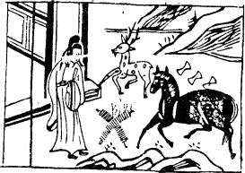

# 16雷地豫

  
此卦諸葛孔明討南蠻，卜得之，便知必勝。

圖中：

**兩重山，一官人，一祿一馬，金銀數錠，錢一堆者。**

**鳳凰生雛之課 萬物發生之象**

==人有大量而又能謙，必豫，豫者悦也，豫卦承大有及謙之序也。上動而下又順，以象言， 陽之始，潛伏地下，及出於地，乃因動，即為雷，故雷出地上，有通暢和順象。==

# 卦圖象解

一、兩重山：出象，千里阻隔也。

二、官人在中：外出不任官象；丈夫外出從商。  

三、一祿一馬：從商之人，財祿豐盛。

四、金銀數錠：紙錢錠，主喪服。  

五、錢一堆者：內有憂心忡忡象。

**全卦：此卦內有憂，外有阻，乃順勢而動，祿馬來會，可去官從商矣。**

# 人間道

豫：利建侯，行師。

==聖人體豫悦之道，知兵師之興，諸侯之封，必眾心和悦方成，故能君臨萬邦，能群聚大眾，唯和悦可也，此豫之時也。==

## 彖曰：豫，剛應而志行，順以動，豫。

動之順理，眾順而回應，其志乃行，故豫乃動而眾順。

## 豫順以動，故天地如之，而況建侯行師乎。

順理而動，天地之道亦如是，更何況立建諸侯，興兵之師。

## 天地以順動，故日月不爲過，而四時不忒；聖人以順動，則刑罰清， 而民服。

天地之順而動，吾人可視四季之行，日月運轉永不為過，聖人稟此，而知因正而民相爭於行善，刑清罰簡，萬民皆服。

## 豫之時義大矣哉。

聖人知豫而體用豫之道，故於時機之掌握大矣，此卦之下有十一卦，豫、遯、姤、旅，皆言時之義。坎、睽、蹇，皆言時之用。頤、大過、解、革，皆言時之大也。

## 象曰：雷出地奮，豫。先王以作樂崇德，殷薦之上帝，以配祖考。

雷動出於地而奮震，悦之象也。先王作聲樂以褒揚功德，歸之上帝、祖先，此言，豫之道， 能知，能體，則盛而至大也。

# 初六：鳴豫，凶。

初六乃下位，陰柔處之，是意不中正之小人，處豫時，為上所寵，志得意滿，乃至於發聲，小人之輕淺如是，必至凶也。

## 象曰：初六鳴豫，志窮凶也。

初六處下而驕鳴，雖外飾喜悦，實乃窮極而凶。

# 六二：介于石，不終日，貞吉。

豫悦之道，易流放縱，過則失正道，乃不合於時。此六二本陰位，今陰爻居位，乃處中正，為自守之象，君子處豫之時，獨其能以中正自守，示出其節介如石之堅也，故吉。能見事於幾微者，謂之神妙。君子之人上交不諂， 下交不瀆，因能知微，吉凶之始，可先見於此也。守堅如石，則能不惑而明。

## 象曰：不終日貞吉，以中正也。

人能中正，且守堅，故能辨之於早，此君子處豫之道。

# 六三：盱豫，悔。遲有悔。

六三乃以陰而居陽位，為不中不正之人居相位也。如此動則有悔，盱為上視也，其動竟上視君側之人，故不中不正，悔之始也。是故君子明處身不正，進退皆有悔矣。處已之道， 在正本身而已，以禮制心，即處豫卻不失中正， 則無悔矣。

## 象曰：盱豫有悔，位不當也。

因自處不當，失卻中正，造成進退有悔， 處不當位也。

# 九四：由豫，大有得，勿疑，朋盍簪。

九四乃君側之位，動則眾陰悦順，此豫之義。豫悦之由，以陽剛而任此位，大行其志， 而天下皆悦。人能盡誠則無疑，上下因至誠而信，合而聚之，簪，乃聚髪之物。

## 象曰：由豫，大有得，志大行也。

志得大行於天下，乃皆由聚所悦也。

# 六五：貞疾，恆不死。

六五為君位，當豫悦之時，陰柔有沉溺之象，故乃柔弱不能自立且耽於酒色之豫道，受制於專權之臣，因受制於下，故有疾苦，古今人君致危之道很多，但以縱情於樂居多，豈有不死乎？

## 象曰：六五貞疾，乘剛也；恆不死， 中未亡也。

君位有疾，乃因側位專權之人壓制也，如能不死，乃因側位之剛為中正，方不致於亡。

# 上六：冥豫，成有渝，无咎。

豫之極，而以陰柔居之，乃聖人示意，凡人之失，苟能自變，則亦可以无咎，此乃為君子。如昏迷不知反省，必招凶。

## 象曰：冥豫在上，何可長也。

昏冥於豫悦，乃至於終極，災難至矣，不可長久，君子當速變。

