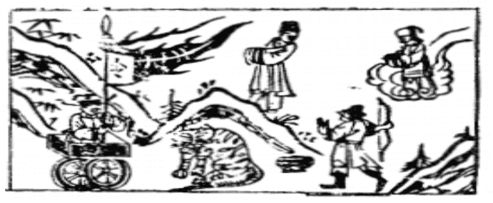

# 19地澤臨

  
此卦蔡琰去和番，卜得知，必還故國也。

圖中：

**婦人乘風，一車上有使旗，人在山頂， 虎在山下坐，一合子，人射弓。**

鳳入雞群之課 以上臨下之象

有事之後乃有可大之心，臨者，大也，故序卦為臨。為卦澤上有地，乃岸也，因與水相近故曰臨，天下之事最近臨者，唯水與地，故地上有水，為此卦，澤上有地，為臨；臨，即臨民臨事，凡所面臨的，皆有臨之道。

卦圖象解

一、婦人乘風：外援為陰女，美人也。

二、一車上有使旗：出使之象，以謀略可解災，謀之對象為女人也。連姓、車姓人。三、人在山頂頭：盛極將衰，招困也，即將下坡也。

四、虎在山下坐：人受虎困之象。五、一合：先成後破象。

六、人射弓：張姓人士，夷狄之人，以弓射獵，故外族入侵象。

## 故自古天下安治，未有久而不亂者，皆因不能戒盛而已。

人間道

臨：元，亨，利，貞。

言臨之道，可致大亨也。

## 至于八月有凶。

二陽才剛生於下，聖人戒之於方盛，方盛而慮衰，則可以防自滿，圖其永久，衰而後戒， 無及也，此乃戒盛之道。今人富而多驕，為安樂而壞綱紀，忘禍亂而任小人奸邪，皆因不知戒盛。

## 彖曰：臨，剛浸而長，説而順，剛中而應，大亨以正，天之道也。

剛中得正道，而有應助，故能大亨。天道，能化育生萬物，皆因其剛正而和順而已。以此道來臨事，臨人，臨天下，莫不大亨通也。

## 至於八月有凶，消不久也。

此乃聖人知戒於盛時，不以自滿，則凶不至也。

## 象曰：澤上有地，臨。君子以敎思无窮，容保民无疆。

地與水之臨近為至近，君子以此知臨之道乃親民如此，才能教導人民。有寬容保民之心， 才能廣大無窮的包容。

## 初九：咸臨，貞吉。

初為卑下之位，而以正道與四位感應，為所信任而得行其志，故吉。

## 九二：咸臨，吉无不利。

九二居將位，能以陽剛之心臨人，臨事， 不愧於人，吉無不利。

## 六三：甘臨，无攸利，既憂之，无咎。

三居相位，柔陰居之，此居上位又不以中正臨下，此失德也，不利。如能憂於此而立改之，則無災也。

## 六四：至臨，无咎。

此臨之至也，臨道乃由近而生，此位居上之下，又切臨於下，乃處近君之臣位，守正任賢，如親臨於下，則无咎。

## 六五：知臨，大君之宜，吉。

以一人之身，君臨天下之廣，若皆以自任， 必不能周於萬事，如自認為皆知者，正明示其不知也。唯有能得天下之善，用天下之智者， 則無所不周，這就是不以自認皆知，故其知乃可大。

## 上六：敦臨，吉，无咎。

此位乃臨之極位，以坤順而居此位，乃意尊而應卑，高而從下，尊賢取善，此為敦厚之極也。皆因其能敦厚於順剛，是以吉而無災。

## 象曰：咸臨貞吉，志行正也。

陽剛之志在於行正，志正也。

## 象曰：咸臨，吉无不利，未順命也。

九二乃應於五之尊位，因以剛德之長，又得中道，此至誠相感，而得吉，並非因順上之命而得吉也。

## 象曰：甘臨，位不當也，既憂之， 咎不長也。

陰柔之人，處臨人事不以中正，又居下之上，乃不適其位，如能知懼而憂之，則必自改其災不長也。

## 象曰：至臨无咎，位當也。

居近君之臣，陰柔對之，為得正道，與下之剛賢相應，故能無咎。

## 象曰：大君之宜，行中之謂也。

君臣合道，皆因同氣相求，君能倚任剛中之賢，則能成臨之功，此知臨之意。

## 象曰：敦臨之吉，志在内也。

內心敦厚篤實，志順於陽剛，其吉可知。

