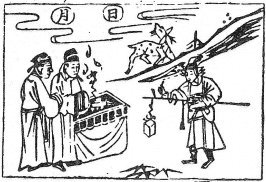

# 20風地觀

  
此卦唐明皇與葉靜遊月宫，卜得之，雖有好事，必違也。

圖中：

**日月當天，官人香案邊立，鹿在山上， 金甲人執印秤。**

雲捲晴空之課 春花競發之象

臨者，大也，萬物之成大，乃有可觀，故觀所以次臨也。凡觀視於物，即為觀也。人君上觀天道，下觀民俗，為觀之道。風行地上，遍觸萬物，乃周觀之象。以陽剛在上，為群下所觀， 故觀亦有仰之義。

卦圖象解

一、日月當天：政治清明，普照大地，父母雙全。

二、官人香案邊立：倌人，丈夫也。蔡姓人士，神人共明之象。三、鹿在山上：得高祿之象。

四、金甲人：君側之人也，護衛也。五、執印秤：提印信而來授權也。

人間道

 觀：盥而不薦，有孚顒若。

人於祭祀之始，求神之時，心念最專精之時也。居上位者，正其儀表，以為下民之觀，當

始與終，皆能令民之觀如初始之專精，則盡觀之道也。今人至君位後，禮數繁多，致令人心散， 精一不如初始也。

## 彖曰：大觀在上，順而巽，中正以觀天下。

五居尊位之人，能以陽剛中正之德，始終如一，為下所觀見，則必能精一也。

## 觀，盥而不薦，有孚顒若，下觀而化也。

處觀之道須嚴守如始之精一，則下民必至誠瞻仰而從教化，不薦為不使誠意少散。

## 觀天之神道，而四時不忒，聖人以神道設敎，而天下服矣。

天之道至神，故曰神道。聖人觀天之運行四時，從無差錯，其神妙如此。聖人體神之道而以設教，故天下服也。

## 象曰：風行地上，觀。先王以省方、觀民、設敎。

風行地上，能觸萬物，聖人體之，知巡省四方，觀視民俗，設為政教，例如見奢則約之以儉，見奸則矯之以正，則民將觀之。

## 初六：童觀，小人无咎，君子吝。

處最下之位，又為陰柔之本質，離陽剛過遠，是故其觀淺如童稚，故曰童觀。小人觀陽剛之道，不識君子之道，於觀之初，反而無災， 如見君子亦昏淺如是，則可羞也。

## 六二：闚觀，利女貞。

象曰：初六童觀，小人道也。

此所觀不明如童稚，此實小人也，故言小人之道。

觀，乃少見而無甚明也。二居將位，而不能明見陽剛中正之道，則如女子之道，即見之不甚明，又能順從者。將位之人，能如女子之順從，則不失其正，故利。

## 象曰：闚觀女貞，亦可醜也。

此即君子之人不能觀見陽剛中正之大德，雖能順從，乃同女子也。亦可羞也。

## 六三：觀我生，進退。

柔質居相位，處觀之時，其進退之道，乃為己者，雖非正，.亦不為過也。

## 六四：觀國之光，利用賓于王。

四雖陰柔居君側之位，能觀見國之光辉盛大，可見人君之道德也。此因九五君位為聖明之人，致令才德之士 ，皆願進朝廷輔佐，以濟天下。反之聖君因能用敬才德之人，則人才聚之。

## 九五：觀我生，君子无咎。

九五君位之人，體觀之道，其視天下之俗而知己，若天下之俗，不合乎君子之道，則是己之所為，政治必不佳，不可不怪自己。

## 上九：觀其生，君子无咎。

上九為不當位之人，以陽剛處之，如同賢人君子不在其位，而道德為天下所觀仰，能如此，皆君子也。

## 象曰：觀我生進退，未失道也。

觀己知生存之道，而以之進退，此未失道也。

## 象曰：觀國之光，尚賓也。

君子懷才自守，乃因無明主也。既觀見國之盛德光華，則志願登進王朝，以行其道。

## 象曰：觀我生，觀民也。

人君欲觀己之施政良否，當觀於民，民俗善，則政化必善。此意即王弼云『觀民以察己之道』。

## 象曰：觀其生，志未平也。

吾人觀其生存之道，常不失於君子，雖不在位，則亦不失人所望之教化也。

