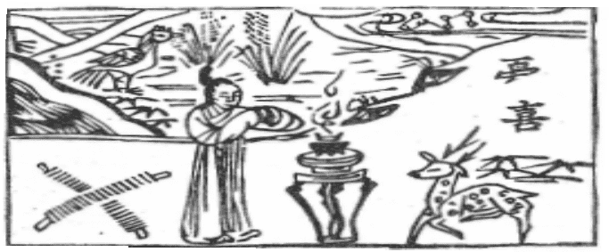

# 21火雷噬嗑

  
此卦蘇秦説六國，卜得之，後為六國丞相。

圖中：

**北斗星，婦人燒香拜，憂字不全，喜字全，一雁食稻，一錢財，一鹿。**

==日中爲喜之課 順中有物之象==

==觀之後而有來合者，所合者，噬嗑也。故為觀之序。卦才中有一剛居，意為口中有物隔其上下，不得嗑狀，必咬之則得嗑，故稱噬嗑，以此理推而天下事，如天下有強梗或讒邪阻隔其間，使天下事不得合，當用刑法。小則懲戒，大則誅戮以除去，使天下得治。古今萬物皆合而後遂成，如未合必有間阻，若君臣、父子、親人、朋友有怨隙者，因讒言在其間也，除之則合， 是故間隔為天下之大害。聖人體噬嗑之道，知此為天下之大用，能去天下之阻間，唯刑與罰。此卦二體明照而威鎮，乃用刑之象。==

# 卦圖象解

一、北斗星：君王也，夫君也，公職也。

二、婦人燒香拜：妻於人事無助，乃求助於天。  

三、憂字不全喜字全：乃無又喜象。

四、一雞食稻：果被食，無果也。

五、一錢財、一鹿者：於財祿事憂心忡忡也。  

六、禽：字解為『離多會少』之象。

# 人間道

 **噬嗑：亨，利用獄。**

==此即天下之事不能亨通，乃因有間阻，非刑獄何以除之。==

## 彖曰：頤中有物，曰噬嗑，噬嗑而亨。

如口中有物阻，必用力嗑之，乃能亨通象。用獄之道，所以察情偽，得其情，則知為間之道，而後可以設防與致刑。知噬嗑之道，乃知去間之道，而天下亨通。

## 剛柔分，動而明，雷電合而章。

此卦才有剛有柔，分而不雜，為明辨之象。察獄之本即明辨，以明而動，上震下離，其動因明也。照與威並行，為用獄之道。人能照，則無隱情，有威則無人不畏，故照與明並用也。

## 柔得中而上行，雖不當位，利用獄也。

此言治獄之道，如全剛則傷於嚴暴，過柔則失於宽縱。以仁而居剛得中正，則得用獄之道。

## 象曰：雷電，噬嗑，先王以明罰敕法。

雷威而電明，聖人觀雷電之象，效法其明與威，而立刑罰法令。法之精神乃在教明事理而設防也。

# 初九：屨校滅趾，无咎。

最下位，下民之象，為受刑之人，用刑之始，罪小刑輕，以木械傷其趾，則不敢進惡矣。此即因小懲而有大戒。小人之福，即在此。

## 象曰：履校滅趾，不行也。

因小罪而小用木械傷其趾，則因懲而不再進為惡也。

# 六二：噬膚滅鼻，无咎也。

二居中而得正，是用刑得中正象。如此罪惡易服，然遇剛強之人，刑之必须深痛，故致滅鼻而无災。

## 象曰：噬膚滅鼻，乘剛也。

此用刑於剛強之人，不得不深痛，乃有戒也。

# 六三：噬臘肉遇毒，小吝，无咎。

本身不正又用刑於人，則人不服而怨對反駁，如食臘肉遇毒，反傷於口。此雖有小議， 但無大災也。

## 象曰：遇毒，位不當也。

受刑之人難服，乃因其用刑之人位不當也。今之他國人在本國犯罪，即見之。

# 九四：噬乾胏，得金矢，利艱貞， 吉。

九四乃居近君之位，乃意愈大，則用刑必重。至此得剛直之道，可克艱其事，又因貞固本身操守，且執意行之，則无咎。

## 象曰：利艱貞吉，未光也。

此時，乃有不足，故雖堅心，但仍未光大也。此貞亦艱也。

# 六五：噬乾肉，得黃金，貞厲，无咎。

因五乃居君位，至尊故勢大，以此刑下， 較易如吃乾肉，故為君之道，時天下之間阻物大，須得中而剛，心懷危懼，持續下去，方吉。

## 象曰：貞厲无咎，得當也。

當正位，以剛而能守正又慮危，故無災。

# 上九：何校滅耳，凶。

受刑之極，乃起因於惡之積也，其凶可知。小惡不懲，必成大惡。

## 象曰：何校滅耳，聰不明也。

人之為惡不悟，積其惡以致極大，至此何教之？今之人聰而不明，不知止惡於初，教正以刑，乃至大惡。

